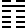
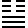

# 御纂周易折中 卷二

## 【折中】8. 比卦

<!-- Source: https://www.eee-learning.com/book/4553 -->
<!-- BEGIN SOURCE: eee-4553 -->
---

8\. 　 **比卦** 　坤下坎上

【程傳】比《序卦》：「眾必有所比，故受之以比。」比，親輔也。人之類必相親輔，然後能安，故既有眾則必有所比，比所以次師也。為卦上坎下坤，以二體言之，水在地上，物之相切比無間，莫如水之在地上，故為比也。又眾爻皆陰，獨五以陽剛居君位，眾所親附，而上亦親下，故為比也。

**比，吉，原筮元永貞，无咎。不寧方來，後夫凶。**

【本義】比，親輔也。九五以陽剛居上之中，而得其正，上下五陰，比而從之，以一人而撫萬邦，以四海而仰一人之象。故筮者得之，則當為人所親輔。然必再筮以自審，有元善長、永正固之德，然後可以當眾之歸而无咎。其未比而有所不安者，亦將皆來歸之。若又遲而後至，則此交已固，彼來已晚，而得凶矣。若欲比人，則亦以是而反觀之耳。

【程傳】比，吉道也。人相親比，自為吉道，故《雜卦》云「比樂師憂」。人相親比，必有其道，苟非其道，則有悔咎，故必推原占決其可比者而比之。筮，謂占決卜度，非謂以蓍龜也。所比得「元永貞」則无咎。元，謂有君長之道。永，謂可以常久。貞，謂得正道。上之比下，必有此三者，下之從上，必求此三者，則无咎也。人之不能自保其安寧，方且來求親比，得所比則能保其安。當其不寧之時，固宜汲汲以求比，若獨立自恃，求比之志，不速而後，則雖夫亦凶矣。夫猶凶，況柔弱者乎。夫，剛立之稱。《傳》曰：子南夫也。又曰：是謂我非夫。凡生天地之間者，未有不相親比而能自存者也，雖剛強之至，未有能獨立者也。比之道，由兩志相求。兩志不相求則睽矣。君懷撫其下，下親輔於上，親戚朋友鄉黨皆然，故當上下合志以相從。苟無相求之意，則離而凶矣。大抵人情相求則合，相持則睽，相持相待莫先也。人之相親固有道，然而欲比之志不可緩也。

【集說】

○　郭氏雍曰：一陽之卦得位者，師、比而已，得君位者為比，得臣位者為師。

○　馮氏椅曰：萃與比下體坤順同，上體水澤不相遠，惟九四一爻有分權之象，故「元永貞」言於五。比下無分權者，故「元永貞」言於卦。義各有在也。

○　胡氏一桂曰：六十四卦，惟蒙、比以筮言。蒙貴初而比貴原者，蓋發蒙之道，當視其初筮之專誠；顯比之道，當致其原筮而謹審，所以不同也。

○　胡氏炳文曰：原筮《本義》讀如原蠶、原廟、原田之原，義皆訓再。曰吉、曰无咎、曰凶，皆占辭。吉，上下相比之占，統言也。无咎，所比者之占。凶，比人者之占。分言也。蒙比卦辭特發兩筮字，以示占者之通例。筮得蒙卦辭，蒙求亨者與亨蒙者皆可用筮。得此卦辭，為人所比與求比者皆可用，顧其所處所存者何如耳。蒙之筮，問之人者也，不一則不專。比之筮，問其在我者也，不再則不審。不寜方來，指下四陰而言。來者自來，後者自後，吾惟問我之可比不可比。彼之來比不來比，吾不問也。此固王者大公之道，而為九五之顯比者也。

**初六，有孚比之，无咎。有孚盈缶，終來有它吉。**

【本義】比之初貴乎有信，則可以无咎矣。若其充實，則又有它吉也。

【程傳】初六，比之始也。相比之道，以誠信為本，中心不信而親人，人誰與之？故比之始，必有孚誠，乃无咎也。孚，信之在中也。誠信充實於內，若物之盈滿於缶中也。缶，質素之器，言若缶之盈實其中，外不加文飾，則終能來有它吉也。它，非此也，外也。若誠實充於內，物无不信，豈用飾外以求比乎？誠信中實，雖它外皆當感而來從。孚信，比之本也。

【集說】

○　鄭氏汝諧曰：五為比之主，初最遠而非其應，何以有吉義？蓋幾生於應物之先，而誠出於志之未變，故以信求比，何咎之有？盈，充也。缶，素器也。居下而位卑，擴吾之信以充之，雖遠而非其應，終必應而有它吉矣。有它吉者，非期於必得而得之也。

○　胡氏炳文曰：與人交，止於信。親比之初，能有誠信，所以比之无咎。及其誠信充實，則非特无咎，又有它吉。初六不與五應，故曰有它。大過九四、中孚初九皆曰有它，彼則戒其有它向之心，此則許其有它至之吉也。

**六二，比之自內，貞吉。**

【本義】柔順中正，上應九五，自內比外，而得其正，吉之道也。占者如是，則正而吉矣。

【程傳】二與五為正應，皆得中正，以中正之道相比者也。二處於內，自內，謂由己也。擇才而用，雖在乎上，而以身許國，必由於己，己以得君道合而進，乃得正而吉也。以中正之道，應上之求，乃自內也，不自失也。汲汲以求比者，非君子自重之道，乃自失也。

【集說】

○　梁氏寅曰：二與五為比，由內而比外者也。凡貞吉，有爻之本善者，有爻非貞而為之戒者。此曰貞吉，爻之本善也。言自內比外而得其正，是以吉也。

○　谷氏家杰曰：自內之所有者以比之，達不變塞也。即此是正，故吉。

**六三，比之匪人。**

【本義】陰柔不中正，承、乘、應皆陰，所比皆非其人之象，其占大凶，不言可知。

【程傳】三不中正，而所比皆不中正，四陰柔而不中，二存應而比初，皆不中正，匪人也。比於匪人，其失可知，悔吝不假言也，故可傷。二之中正，而謂之匪人，隨時取義，各不同也。

【集說】

○　王氏弼曰：四自外比，二為五應，近不相得，遠則無應，所與比者，皆非己親，故曰比之匪人。

○　《朱子語類》云：初應四，為比得其人。二應五，亦為比得其人。惟三乃應上，上為比之无首者，故為比之匪人也。

○　趙氏彥肅曰：初比於五，先也。二應也，四承也，六三無是三者之義，將不能比五矣。

**六四，外比之，貞吉。**

【本義】以柔居柔，外比九五，為得其正，吉之道也。占者如是，則正而吉矣。

【程傳】四與初不相應而五比之，外比於五，乃得貞正而吉也。君臣相比，正也。相比相與，宜也。五剛陽中正，賢也。居尊位，在上也。親賢從上，比之正也，故為貞吉。以六居四，亦為得正之義。又陰柔不中之人，能比於剛明中正之賢，乃得正而吉也。又比賢從上，必以正道則吉也。數說相須，其義始備。

【集說】

○　易氏祓曰：易以上卦為外，下卦為內，而二體亦各有內外。四與五同體，而言外比者，亦所以比五也。

○　李氏過曰：二與四皆比於五，二應五，在卦之內，故言比之自內；四承五，在卦之外，故言外比之。外內雖異，而得其所比，其義一也，故皆言貞吉。

**九五，顯比，王用三驅，失前禽，邑人不誡，吉。**

【本義】一陽居尊，剛健中正，卦之群陰，皆來比己，顯其比而无私，如天子不合圍，開一面之網，來者不拒，去者不追，故為「用三驅，失前禽」，而「邑人不誡」之象。蓋雖私屬，亦喻上意，不相警備，以求必得也。凡此皆吉之道，占者如是則吉也。

【程傳】五居君位，處中得正，盡比道之善者也。人君比天下之道，當顯明其比道而已。如誠意以待物，恕己以及人，發政施仁，使天下蒙其惠澤，是人君親比天下之道也。如是天下孰不親比於上？若乃暴其小仁，違道干譽，欲以求下之比，其道亦狹矣，其能得天下之比乎？故聖人以九五盡比道之正，取三驅為喻，曰「王用三驅，失前禽，邑人不誡，吉」。先王以四時之畋不可廢也，故推其仁心，為三驅之禮，乃禮所謂天子不合圍也。成湯祝網，是其義也。天子之畋圍，合其三面，前開一路，使之可去，不忍盡物，好生之仁也。只取其不用命者，不出而反入者也。禽獸前去者皆免矣，故曰失前禽也。王者顯明其比道，天下自然來比。來者撫之，固不煦煦然求比於物。若田之三驅，禽之去者，從而不追，來者則取之也。此王道之大，所以其民皞皞而莫知為之者也。邑人不誡吉，言其至公不私，无遠邇親疏之別也。邑者，居邑，易中所言邑皆同。王者所都，諸侯國中也。誡，期約也。待物之一，不期誡於居邑，如是則吉也。聖人以大公无私治天下，於顯比見之矣。非惟人君比天下之道如此，大率人之相比莫不然。以臣於君言之，竭其忠誠，致其才力，乃顯其比，君之道也。用之與否，在君而已，不可阿諛逢迎求其比己也。在朋友亦然，修身誠意以待之，親己與否在人而已，不可巧言令色，曲從苟合以求人之比己也。於鄉黨親戚，於衆人，莫不皆然，三驅失前禽之義也。

【集說】

○　《朱子語類》：問：伊川解「顯比王用三驅失前禽」所謂來者撫之，去者不追，與失前禽而殺不去者，所譬頗不相類，如何？曰：田獵之禮，置旃以為門，刈草以為長圍。田獵者，自門驅而入，禽獸向我而出者皆免，惟被驅而入者皆獲，故以前禽比去者不追。獲者譬來則取之，大意如此，無緣得一一相似。伊川解此句不須疑，但邑人不誡吉一句似可疑，恐易之文義不如此耳。

○　又云：「邑人不誡」，如有聞無聲，言其自不消相告誡，又如歸市者不止、耕者不變相似。

○　胡氏炳文曰：諸陰爻皆言比之，陰比陽也。五言顯比，陽為陰所比也。師比之五，皆取田象。師之「田有禽」，害物之禽也。比之「失前禽」，背己之禽也。在師則執之，王者之義也。在比能失之，王者之仁也。

○　梁氏寅曰：九五陽剛中正，為比之主。陽剛則明而不暗，中正則公而不私，此其所以為顯比也。以象言之，如田狩而用三驅失前禽，來者不拒，去者不追，此上之比下也，固顯比也。比下既得其道，則雖私屬亦喻上意，而不待告誡，此下之比上也，亦顯比也。上下之相比，同一顯明之道，又安有不吉乎？

○　林氏希元曰：顯與隱對。光明正大，而無隱伏回曲闇昧褊窄者，顯也。隱伏回曲闇昧褊窄，而不光明正大者，隱也。王者以父母天下為職，生養教誨，但知吾分所當為，盡其道而為之，至於民之感恩與否，則聽其在彼，初不屑屑焉暴其私恩小惠，違道干譽，以求百姓之我親。此其施為舉措，何等光明正大，而豈有隱伏回曲闇昧褊窄之病，故謂之顯比。譬如王者，解一面之網，用三驅之田，禽獸向我而入者取之，背我而前去者則失之，初不求於必得。至於私屬亦喻上意，不相警備以求必得焉。夫王用三驅失前禽者，王道之得，邑人不誡者，王化之行，凡此皆吉之道也。王者能如九五之顯比，則亦王道得而王化行矣。

○　陸氏振奇曰：三驅失禽，置失得於勿恤者，狀蕩平之王心。邑人不誡，泯知識於大順者，狀熙皞之王化。

【案】《本義》解「邑人不誡」，謂不相警備以求必得，似以為求所失之前禽也。然《語類》只作有聞無聲之意，尤為精切。蓋言王者田獵，而近郊之處，略不驚擾耳。《本義》係朱子未修改之書，故其後來講論，每有不同者，皆此類也。大抵爻意是以田獵喻王者皞皞之氣象。前禽失而不追，邑人居而不誡，遠去者若不知有王者之親，乃所以為親之至也。近附者若不知有王者之尊，乃所以為尊之至也。顯比之世，凡有血氣，莫不尊親，而所謂大順大化，不見其迹者又如此。

**上六，比之无首，凶。**

【本義】陰柔居上，无以比下，凶之道也。故為无首之象，而其占則凶也。

【程傳】六居上，比之終也。首謂始也，凡比之道，其始善則其終善矣。有其始而无其終者，或有矣，未有无其始而有終者也，故比之无首，至終則凶也，此據比終而言。然上六隂柔不中，處險之極，固非克終者也。始比不以道，隙於終者，天下多矣。

【集說】

○　王氏弼曰：无首，後也。處卦之終，是後夫也。為時所棄，宜其凶也。

○　王氏申子曰：五以一陽居尊，四陰比之於下，故《彖傳》曰「下順從也」。而上六孤立於外而不從，豈非後夫之象？
<!-- END SOURCE: eee-4553 -->

## 【折中】9. 小畜卦

<!-- Source: https://www.eee-learning.com/book/4554 -->
<!-- BEGIN SOURCE: eee-4554 -->
---

9\. 　 **小畜卦** 　乾下巽上

【程傳】小畜《序卦》：「比必有所畜，故受之以小畜。」物相比附則為聚。聚，畜也。又相親比則志相畜，小畜所以次比也。畜，止也，止則聚矣。為卦巽上乾下，乾在上之物，乃居巽下。夫畜止剛健，莫如巽順，為巽所畜，故為畜也。然巽，陰也，其體柔順，惟能以巽順柔其剛健，非能力止之也，畜道之小者也。又四以一陰得位，為五陽所說，得位，得柔巽之道也。能畜群陽之志，是以為畜也。小畜，謂以小畜大，所畜聚者小，所畜之事小，以陰故也。《彖》專以六四畜諸陽為成卦之義，不言二體，蓋舉其重者。

**小畜，亨，密雲不雨，自我西郊。**

【本義】巽，亦三畫卦之名。一陰伏於二陽之下，故其德為巽為入，其象為風為木。小，陰也。畜，止之之義也。上巽下乾，以陰畜陽，又卦惟六四一陰，上下五陽皆為所畜，故為小畜。又以陰畜陽，能係而不能固，亦為所畜者小之象。內健外巽，二五皆陽，各居一卦之中而用事，有剛而能中，其志得行之象，故其占當得亨通。然畜未極而施未行，故有「密雲不雨自我西郊」之象。蓋密雲陰物，西郊陰方，我者，文王自我也，文王演易於羑里，視岐周為西方，正小畜之時也。筮者得之，則占亦如其象云。

【程傳】雲，陰陽之氣，二氣交而和，則相畜固而成雨。陽倡而陰和，順也，故和。若陰先陽倡，不順也，故不和。不和則不能成雨。雲之畜聚雖密，而不成雨者，自西郊故也。東北陽方，西南陰方，自陰倡，故不和而不能成雨。以人觀之，雲氣之興，皆自四遠，故云郊。據西而言，故云自我。畜陽者四，畜之主也。

【集說】

○　胡氏瑗曰：陰陽交則雨澤乃施，若陽氣上升，而陰氣不能固蔽，則不雨。若陰氣雖能固蔽，而陽氣不交，亦當不雨。猶若釜甑之氣，以物覆之，則蒸而為水也。自我西郊，是雲氣起於西郊之陰位，必不能為雨也。

○　《程子語錄》：或以小畜為臣畜君，以大畜為君畜臣，曰：不必如此。大畜只是所畜者大，小畜只是所畜者小，不必指定一件事，便是君畜臣，臣畜君，皆是這道理，隨大小用。

○　張氏浚曰：臣之誠意雖通於上，而君德未孚，若天氣未應，曰密雲不雨。西郊陰位，自我西郊，言陽氣未應也。

○　《朱子語類》：問：「密雲不雨自我西郊」。曰：凡雨者皆是陰氣盛，凝結得密，方濕潤，下降為雨。今乾上進，一陰止他不得，所以《彖》中云「尚往也」，是指乾欲上進之象。到上九則以卦之始終言，畜極則散，遂為既雨既處，陰德盛滿如此，所以有君子征凶之戒。

○　丘氏富國曰：乾本在上之物，今在巽下，則為柔所畜，故曰小畜。但六四以一陰而畜止五陽，能係其志，而不能固其志，此又畜道之小者也。夫物畜則止，止極則行，故小畜亦有亨義。密雲，陰氣也。自二至四互兌，屬西方，故曰西郊。四以柔居柔，故有此象。凡雲自東而西則雨，自西而東則不雨，陰先倡也。小畜以柔為主，不能固陽而止之，故雲雖密而不雨。

○　林氏希元曰：小畜有二義，一是以小畜大，一是所畜者小。亦惟以小畜大，故所畜者小，其歸一而已矣。問：天氣屬陽，地氣屬陰，今以陰畜陽，反以天氣為陰，地氣為陽，何也？曰：以兩儀之分言，則位乎下而氣上騰者為陰，位乎上而氣下降者為陽。自四象之交言，則陰之騰上者又為陽，陽之下降者又為陰。此蒙引之說也，可以發朱子之所未發。

【案】此卦須明取象之意，則卦義自明。《彖》言「密雲不雨」者，地氣上騰，而天氣未應，以其雲之來自我西郊，陰倡而陽未和故也。蓋以上下之陰陽言之，則地氣陰也，天氣陽也。以四方之陰陽言之，則西方陰也，東方陽也。陰感而陽未應，乃卦所以為小畜之義，《彖傳》「尚往」謂陰氣上升，「施未行」謂陰氣未能成雨而降也。以人事擬之，則是臣子志存國家，未能得君父和合之象。諸家或以地氣上升者為陽，天氣下應者為陰，故於《彖傳》「尚往」亦屬陽說，惟張氏以為天氣未應者，於卦義極相合也。

**初九，復自道，何其咎，吉。**

【本義】下卦乾體，本皆在上之物，志欲上進，而為陰所畜。然初九體乾，居下得正，前遠於陰，雖與四為正應，而能自守以正，不為所畜，故有進復自道之象。占者如是，則无咎而吉也。

【程傳】初九陽爻而乾體，陽在上之物，又剛健之才，足以上進而復與在上同志，其進復於上，乃其道也，故云復自道。復既自道，何過咎之有？无咎而又有吉也。諸爻言无咎者，如是則无咎矣，故云「无咎者，善補過也」。雖使爻義本善，亦不害於不如是則有咎之義。初九乃由其道而行，无有過咎，故云「何其咎」，无咎之甚明也。

【集說】

○　王氏申子曰：復，反也。初以陽剛居健體，志欲上行，而為四得時得位者所畜，故復。然初剛而得正，雖為所畜而復，如自守以正，不為所畜者，故曰復自道。言雖為彼所畜，而吾實自復於道也。

○龔氏煥曰：復自道，此復字與「无往不復」、「不遠復」之義同，謂復於在下之位而不進也。初九以陽剛之才位居最下，為陰所畜，知幾不進而自復其道焉，何咎之有。九二牽復，亦謂與初九牽連而内復也。易及諸經，無有以復為上進者。

○　俞氏琰曰：復，謂返於本位也。以初九之剛，往應六四之柔而受其制，豈不失其道而有咎？今也返而以正道自守，故能轉咎而為吉。

○　何氏楷曰：天地間氣化人事，皆有陰畜陽之時。陽既為陰所畜，便不宜過剛躁動。初以陽才居陽位，潛伏於下，何咎之有？先言何其咎，而後言吉者，以无咎為吉也。

【案】傳義皆以復為上進，沿王弼舊說也。以大畜初二爻比例觀之，則王氏、龔氏諸說為長。

**九二，牽復，吉。**

【本義】三陽志同，而九二漸近於陰，以其剛中，故能與初九牽連而復，亦吉道也。占者如是則吉矣。

【程傳】二以陽居下體之中，五以陽居上體之中，皆以陽剛居中，為陰所畜，俱欲上復。五雖在四上，而為其所畜，則同是同志者也。夫同患相憂，二五同志，故相牽連而復。二陽並進，則陰不能勝，得遂其復矣，故吉也。曰：遂其復則離畜矣乎？曰：凡爻之辭，皆謂如是則可以如是，若已然則時已變矣，尚何教誡乎？五為巽體，巽畜於乾，而反與二相牽，何也？曰：舉二體而言，則巽畜乎乾；全卦而言，則一陰畜五陽也。在易隨時取義，皆如此也。

【集說】

○　王氏申子曰：二所乘之初，為陰所畜，亦既復矣。所承之三，又為陰所畜，說輻而不進矣。二以陽處陰，居下得中，上又無應，故不待畜，即與同類牽連而復，是不自失其中者也。自能審進退而不失其中，故吉。

○　何氏楷曰：與初相牽連而復居於下，故吉。

**九三，輿說輻。夫妻反目。**

【本義】九三亦欲上進，然剛而不中，迫近於陰，而又非正應，但以陰陽相說，而為所係畜，不能自進，故有「輿說輻」之象。然以志剛，故又不能平而與之爭，故又為夫妻反目之象。戒占者如是則不得進而有所爭也。

【程傳】三以陽爻居不得中，而密比於四，陰陽之情相求也，又暱比而不中，為陰畜制者也，故不能前進，猶車輿說去輪輻，言不能行也。夫妻反目，陰制於陽者也。今反制陽，如夫妻之反目也。反目，謂怒目相視，不順其夫而反制之也。婦人為夫寵惑，既而遂反制其夫。未有夫不失道而妻能制之者也。故說輻反目，三自為也。

【集說】

○　項氏安世曰：輻，陸氏《釋文》云：本亦作輹。按：輻，車轑也。輹，車軸轉也。輻以利輪之轉，輹以利軸之轉，然輻無說理，必輪破轂裂而後可說，若輹則有說時，車不行則說之矣。大畜、大壯，皆作輹字。

○　又曰：九三「反目」稱妻，言相敵也。上九「既雨」稱婦，言相順也。

○　胡氏炳文曰：大畜九二輿説輹，輹與輻或據《左氏傳註》以爲通用，何也？曰：《説文》，輹，車下横木，非輻也。大畜九二說輹，剛而得中，自止而不進也。小畜九三説輻，剛而不中，止於陰而不得進也。說輹可復進，說輻則不可以行矣。

【案】九三比近六四，故有夫妻之象。過剛不能自制其動，雖有六四比近畜之，不能止也。進不利於行，故曰輿說輻。退不安其室，故曰夫妻反目。

**六四，有孚，血去惕出，无咎。**

【本義】以一陰畜眾陽，本有傷害憂懼，以其柔順得正，虛中巽體，二陽助之，是有孚而血去惕出之象也，无咎宜矣。故戒占者亦有其德則無咎也。

【程傳】四於畜時，處近君之位，畜君者也，若內有孚誠，則五志信之，從其畜也。卦獨一陰，畜眾陽者也，諸陽之志係於四，四苟欲以力畜之，則一柔敵眾剛，必見傷害，惟盡其孚誠以應之，則可以感之矣。故其傷害遠，其危懼免也。如此則可以無咎，不然則不免乎害矣。此以柔畜剛之道也。以人君之威嚴，而微細之臣，有能畜止其欲者，蓋有孚信以感之也。

【集說】

○　項氏安世曰：以陰畜陽，以小包大，能無憂乎？獨恃與五有孚，故能離其血惕，去而出之，以免於咎。臣之畜君，必信而後濟，非與上合志，不可為也。

【案】此爻《程傳》之說獨明，蓋惟此爻與《彖》義合者，以其為卦之主故也。

**九五，有孚攣如，富以其鄰。**

【本義】巽體三爻，同力畜乾，鄰之象也。而九五居中處尊，勢能有為，以兼乎上下，故為有孚攣固，用富厚之力而以其鄰之象。「以」猶《春秋》以某師之以，言能左右之也。占者有孚則能如是也。

【程傳】小畜，眾陽為陰所畜之時也。五以中正居尊位而有孚信，則其類皆應之矣，故曰攣如。謂牽連相從也。五必援挽，與之相濟，是富以其鄰也。五以居尊位之勢，如富者推其財力，與鄰比共之也。君子為小人所困，正人為群邪所厄，則在下者必攀挽於上，期於同進；在上者必援引於下，與之戮力，非獨推已力以及人也，固資在下之助以成其力耳。

【集說】

○　《朱子語類》云：孚有在陽爻，有在陰爻，伊川謂：中虛信之本，中實信之質。

【案】此爻之義，從來未明。今以卦意推之，則六四者近君之位也，所謂小畜者也。九五者君位也，能畜其德以受臣下之畜者也。四曰有孚，是積誠以格其君。五亦曰有孚，是推誠以待其下，上下相孚而後畜道成矣。故四曰上合志者，指五也。五曰以其鄰者，指四也。四與五相近，故曰鄰。又鄰即臣也，《書》曰臣哉、鄰哉是也。富者積誠之滿也，積誠之滿，至於能用其鄰，則其鄰亦以誠應之矣。故《象傳》曰「不獨富也」，以誠感誠之謂也。大抵上下之間，不實心則不能相交，故曰富以其鄰；不虚心則亦不能相交，故曰不富以其鄰。所取象者，本於陽實陰虚，而其義一也。

**上九，既雨既處，尚德載，婦貞厲。月幾望，君子征凶。**

【本義】畜極而成，陰陽和矣，故為「既雨既處」之象。蓋尊尚陰德，至於積滿而然也。陰加於陽，故雖正亦厲。然陰既盛而抗陽，則君子亦不可以有行矣。其占如此，為戒深矣。

【程傳】九以巽順之極，居卦之上，處畜之終，從畜而止者也，為四所止也。既雨，和也。既處，止也。陰之畜陽，不和則不能止，既和而止，畜之道成矣。大畜，畜之大，故極而散；小畜，畜之小，故極而成。尚德載，四用柔巽之德，積滿而至於成也。陰柔之畜剛，非一朝一夕能成，由積累而至，可不戒乎？載，積滿也。《詩》云：厥聲載路。婦貞厲，婦謂陰，以陰而畜陽，以柔而制剛，婦若貞固守此，危厲之道也。安有婦制其夫，臣制其君，而能安者乎？月望則與日敵矣。幾望，言其盛將敵也，陰已能畜陽而云幾望，何也？此以柔巽畜其志也，非力能制也，然不已則將盛於陽而凶矣。於幾望而為之戒曰，婦將敵矣，君子動則凶也。君子謂陽。征，動也。幾望，將盈之時。若已望則陽已消矣，尚何戒乎？

【集說】

○　楊氏時曰：三陽下進，一陰畜之不能固，故「密雲不雨，尚往也」。至上九則往極矣，故既處。夫陰陽和則雨，而婦以順為正。雖畜而至於雨，以是為正則厲矣。月遡日以為明者也，望則與日敵。故幾望則不可過。君子至此而猶征焉，則凶之道也。小畜以陰畜陽為主，其極必疑陽，故戒之如此。

○　項氏安世曰：上九居畜之極，畜道已成，昔之不雨者，今既雨矣；昔之尚往者，今既處矣。彖之所謂亨，於是見之。載者，積也。畜至於上，其德積而成載，則所畜大矣。然以小畜大，非可常之事也。婦道貞此而不變，則為危，君子過此而復行，則為凶。蓋月望則昃，陰極則消，自然之理也。

○　王氏應麟曰：小畜上九「月幾望」則凶，陰疑陽也。歸妹六五「月幾望」則吉，陰應陽也。中孚六四「月幾望」則无咎，陰從陽也。

【案】此爻亦以畜道既成言之耳，楊氏說最完善。
<!-- END SOURCE: eee-4554 -->

## 【折中】10. 履卦

<!-- Source: https://www.eee-learning.com/book/4555 -->
<!-- BEGIN SOURCE: eee-4555 -->
---

10. 　 **履卦** 　兌下乾上

【程傳】履《序卦》：「物畜然後有禮，故受之以履。」夫物之聚，則有大小之別，高下之等，美惡之分，是物畜然後有禮，履所以繼畜也。履，禮也。禮，人之所履也。為卦天上澤下，天而在上，澤而處下，上下之分，尊卑之義，理之當也，禮之本也。常履之道也，故為履。履，踐也，藉也。履物為踐，履於物為藉。以柔藉剛，故為履也。不曰剛履柔，而曰柔履剛者，剛乘柔，常理不足道。故易中唯言柔乘剛，不言剛乘柔也。言履藉於剛，乃見卑順說應之義。

**履虎尾，不咥人，亨。**

【本義】兌亦三畫卦之名，一陰見於二陽之上，故其德為說，其象為澤。履，有所躡而進之義也。以兌遇乾，和說以躡剛強之後，有履虎尾而不見傷之象，故其卦為履，而占如是也。人能如是，則處危而不傷矣。

【程傳】履，人所履之道也。天在上而澤處下，以柔履藉於剛，上下各得其義，事之至順，理之至當也。人之履行如此，雖履至危之地，亦無所害，故履虎尾而不見其咥齧，所以能亨也。

【集說】

○　《朱子語類》云：履上乾下兌，以陰躡陽，是隨後躡他，如踏他腳跡相似，所以云履虎尾。卦之三四爻，發虎尾義，便是陰去躡他陽後處。

○　李氏簡曰：履，禮也。行之以和，故能進退履眾剛而不見傷。禮之用和為貴，其是之謂乎？

○　胡氏炳文曰：《程傳》訓履為踐為藉，以上下論也。《本義》云：有所躡而進，以前後論也。於尾字為切。諸家多以兌為虎，《本義》從《程傳》以乾為虎，本夫子《彖傳》意也。不咥人亨，大抵人之涉世，多是危機，不為所傷，乃見所履。《大傳》曰： 易之興也，其當文王與紂之事邪，是故其辭危。危莫危於履虎尾之辭矣，故九卦處憂患，以履為首。

○　梁氏寅曰；履者踐履也。人之於禮，亦踐行其天理者，故履為禮也。夫虎，剛猛之獸。乾三陽，虎之象也。上為虎之首，則四為虎之尾。兌履乾之後，履虎尾之象也。虎咥人者也，然以和說履之，則不見咥而反至亨。以是觀之，人之踐履卑遜，何往而不亨乎？然和非阿容也，說非佞媚也，亦恭順而不失其正耳。兌之《傳》曰「剛中而柔外」，此其道也。

○　蔡氏清曰：八卦惟兌為至弱，惟乾為至健。今以至弱者而躡於至健者之後，自是危機，故獨以履名卦，而《彖傳》復取其德，而謂之「履虎尾，不咥人亨」也。

**初九，素履往，无咎。**

【本義】以陽在下，居履之初，未為物遷，率其素履者也。占者如是，則往而无咎也。

【程傳】履不處者，行之義，初處至下，素在下者也。而陽剛之才，可以上進，若安其卑下之素而往，則无咎矣。夫人不能自安於貧賤之素，則其進也，乃貪躁而動，求去乎貧踐耳，非欲有為也。既得其進，驕溢必矣，故往則有咎。賢者則安履其素，其處也樂，其進也將有為也，故得其進，則有為而无不善，乃守其素履者也。

【集說】

○　胡氏炳文曰：初未交於物，有素象。案《本義》與蔡氏皆曰：居履之初，不為物遷。蔡氏則曰：素者無文之謂。蓋履，禮也。履初言素，禮以質為本也。賁文也，賁上言白，文之極反而質也。白賁無咎，其卽素履往无咎與。

**九二，履道坦坦，幽人貞吉。**

【本義】剛中在下，无應於上，故為履道平坦，幽獨守貞之象。幽人履道而遇其占，則貞而吉矣。

【程傳】九二居柔，寬裕得中，其所履坦坦然平易之道也。雖所履得坦易之道，亦必幽靜安恬之人處之，則能貞固而吉也。九二陽志上進，故有幽人之戒。

【集說】

○　梁氏寅曰：行於道路者，由中則平坦，從旁則崎險。九二以剛居中，是履道而得其平坦者也。持身如是，不輕自售，故為幽人貞吉。

**六三，眇能視，跛能履。履虎尾，咥人凶，武人為于大君。**

【本義】六三不中不正，柔而志剛，以此履乾，必見傷害，故其象如此，而占者凶。又為剛武之人，得志而肆暴之象，如秦政、項藉，豈能久也？

【程傳】三以陰居陽，志欲剛而體本陰柔，安能堅其所履？故如盲眇之視，其見不明。跛躄之履，其行不遠。才既不足，而又處不得中，履非其正，以柔而務剛，其履如此，是履於危地，故曰履虎尾。以不善履履危地，必及禍患，故曰咥人凶。武人為于大君」，如武暴之人，而居人上，肆其躁率而已，非能順履而遠到也。不中正而志剛，乃為群陽所與，是以剛躁蹈危而得凶也。

【集說】

○　耿氏南仲曰：視欲正，視而不正，則眇者也。行欲中，行而不中，則跛者也。故歸妹初九不中則為跛，九二不正則為眇。履，六三不中又不正，故跛眇兼焉。歸妹、履，皆兌下也。

○　王氏申子曰：三以陰居陽，以柔履剛，謂其明耶？則眾陽而獨陰。謂其不明耶？則又居於陽。眇能視之象也。謂其能行耶，則眾剛而獨柔。謂其不能行耶？則又履乎剛，跛能履之象也。是體暗而用明，才弱而志剛者也，而又不中不正，故不自度量而一於進，敢於蹈危而取禍，如履虎尾而受咥人之凶也。若不顧強弱，勇猛直前，惟武人用之以有為于大君之事則可。然彖亦主三而言曰不咥人亨，此曰咥人凶，何也？蓋彖總言一卦之體，爻則據其時與位而言，所以不同。

○　吳氏澄曰：彖通指一卦而言，則上九虎之首也。虎口實而合，有不咥之象。此專據一爻而言，則三為兌之上畫也，兌口虛而開，故有咥人之象。

○　胡氏炳文曰：凡卦辭以爻為主，則爻辭與卦同。如屯卦利建侯，而初爻亦利建侯。以卦上下體論，則爻辭與卦不同。如此卦云「履虎尾不咥人」，而六三則曰「咥人」是也。卦書「不咥人」，兌三爻說體，自與乾三爻健體相應也。爻書「咥人」，六三一爻，與上九一爻獨相應，履虎尾而首應也。

【案】武人為于大君，王氏之說得之。蓋三非大君之位，且為于兩字語氣亦不順也。子曰：「暴虎馮河，死而無悔者，吾不與也。」即此句之意。

**九四，履虎尾，愬愬，終吉。**

【本義】九四亦以不中不正，履九五之剛，然以剛居柔，故能戒懼而得終吉。

【程傳】九四陽剛而乾體，雖居四，剛勝者也。在近君多懼之地，无相得之義，五復剛決之過，故為履虎尾。愬愬，畏懼之貌，若能畏懼，則當終吉。蓋九雖剛而志柔，四雖近而不處，故能兢慎畏懼，則終免於危而獲吉也。

【集說】

○　王氏弼曰：逼近至尊，以陽承陽，處多懼之地，故口「履虎尾，愬愬」也。然以陽居陰，以謙為本，雖處危懼，終獲其志，故終吉也。

○　王氏宗傳曰：《經》曰「四多懼」，處多懼之地，而復以恐懼自處，所謂愬愬也。四處三陽之後，故亦曰履虎尾。無忘其愬愬之戒，故曰終吉。在卦德曰「履虎尾，不咥人，亨」，其九四之謂乎？

○　《朱子語類》云：履三爻正是躡他虎尾處，四上躡五，亦為虎尾之象。

○　胡氏炳文曰：《本義》於三之履虎尾曰不中不正以履乾，是以乾為虎而三在其後也。於四之履虎尾，則曰亦以不中不正履九五之剛，是以九五為虎，而四在其後也。三四皆不中正，而占有不同者，三多凶，以柔居剛，其凶也宜。四多懼，以剛居柔，所以終吉。

**九五，夬履，貞厲。**

【本義】九五以剛中正履帝位，而下以兌說應之，凡事必行，无所疑礙，故其象為夬決其履，雖使得正，亦危道也，故其占為雖正而危，為戒深矣。

【程傳】夬，剛決也。五以陽剛乾體，居至尊之位，任其剛決而行者也。如此則雖得正，猶危厲也。古之聖人，居天下之尊，明足以照，剛足以決，勢足以專。然而未嘗不盡天下之議，雖芻蕘之微必取，乃其所以為聖也，履帝位而光明者也。若自任剛明，決行不顧，雖使得正，亦危道也，可固守乎？有剛明之才，苟專自任，猶為危道，況剛明不足者乎？易中云「貞厲」，義各不同，隨卦可見。

【集說】

○　項氏安世曰：六三於彖辭為亨者，以下卦言之，有和說之德也，於本爻為凶者，資本陰柔，履位不正，宜其凶也。九五於彖辭為不疚者，以上卦言之，有剛健中正之德也。於本爻為厲者，以剛行剛，志在夬決，其理雖正，其事則危也。凡彖多言卦德，凡爻多論爻位。

○　王氏申子曰：履之卦義，履剛也。履剛之道，尚柔不尚剛也。五雖中正以履帝位，然以剛居剛，是一於尚剛者也。夬履，謂決於行也。一於任剛，決行而不顧，則於中正之道，豈能无咎乎？若貞固守此，危道也，故曰貞厲。

【案】凡《彖傳》中所讚美，則其置辭无凶厲者，何獨此爻不然？蓋履道貴柔。九五以剛居剛，是決於履也。然以其有中正之德，故能常存危厲之心，則雖決於履，而動可無過舉矣。《書》云：心之憂危，若蹈虎尾，此其所以履帝位而不疚也與。凡易中貞厲、有厲，有以常存危懼之心為義者，如噬嗑之貞厲无咎，夬之其危乃光是也。然則此之貞厲，兌五之有厲，當從此例也。

**上九，視履，考祥其旋，元吉。**

【本義】視履之終，以考其祥，周旋无虧，則得元吉，占者禍福，視其所履而未定也。

【程傳】上處履之終，於其終視其所履行，以考其善惡禍福，若其旋則善且吉也。旋，謂周旋完備，无不至也。人之所履，考視其終，若終始周完无疚，善之至也，是以元吉。人之吉凶，係其所履，善惡之多寡，占凶之小大也。

【集說】

○　王氏弼曰：禍福之祥，生乎所履。處履之極，履道成矣，故可視履而考祥也。居極應說，高而不危，是其旋也，履道大成，故元吉。

○　梁氏寅曰：上，履之終也。人之所履，觀之於始，則誠偽未可見，惟觀之於終，然後見也。故視其所履以考其善，若周旋无虧，則其吉大矣。是爻也，豈非動容周旋中禮而為盛德之至與？

【總論】

○　項氏安世曰：一陰一陽之卦，在下者為復、姤，在上者為夬、剝，其義主於消長也。在二五者，陽在二為師之將，在五為比之主，陰在二為同人之君子，在五為大有之君子，其義主於得位也。在三四者，陽在三，則以剛行柔為勞謙，在四則以剛制柔為由豫，陰在三，則以柔行剛為履，在四則以柔制剛為小畜，其義主於用事也。大抵用事之爻，在下者為行己之事，在上者為制人之事。

○　又曰：履之六爻，皆以履柔為吉，故九二為坦坦，九四為愬愬終吉，上九為其旋元吉，皆履柔也。六三卦辭本善，終以履剛為凶。初九九五所履皆正，然初僅能无咎，五不免於厲，皆履剛也。是故初則懼其失初心之正，而教之以保其素。五則懼其恃勢位之正，而教之以謹其決。蓋剛者，喜動而好決，任剛而行者，後多可悔之事也。
<!-- END SOURCE: eee-4555 -->

## 【折中】11. 泰卦

<!-- Source: https://www.eee-learning.com/book/4557 -->
<!-- BEGIN SOURCE: eee-4557 -->
---

11\. 　**泰卦** 　乾下坤上

【程傳】泰《序卦》：「履而泰然後安，故受之以泰。 」履得其所則舒泰，泰則安矣，泰所以次履也。為卦坤陰在上，乾陽居下，天地陰陽之氣相交而和，則萬物生成，故為通泰。

**泰，小往大來，吉亨。**

【本義】泰，通也，為卦天地交而二氣通，故為泰，正月之卦也。小謂陰，大謂陽。言坤往居外，乾來居內。又自歸妹來，則六往居四，九來居三也。占者有剛陽之德，則吉而亨矣。

【程傳】小謂陰，大謂陽。往，往之於外也。來，來居於內也。陽氣下降，陰氣上交也。陰陽和暢則萬物生，遂天地之泰也。以人事言之，大則君上，小則臣下，君推誠以任下，臣盡誠以事君，上下之志通，朝廷之泰也。陽爲君子，陰爲小人，君子來處於內，小人往處於外，是君子得位，小人在下，天下之泰也。泰之道，吉而且亨也，不云元吉、元亨者，時有汙隆，治有小大，雖泰，豈一概哉？言吉亨則可包矣。

【集說】

○　劉氏牧曰：往來者，以內外卦言之，由內而之外為往，由外而復內為來。

○　蔡氏清曰：卦名曰泰，以天地交而二氣通，就造化之本不可相無上取也。卦辭曰「小往大來」，以內君子外小人而言，就淑慝之分上取也。然則泰有二乎？曰：一也。但是天地交而二氣通，則決然內陽而外陰矣。

**初九，拔茅茹以其彙，征吉。**

【本義】三陰在下，相連而進，拔茅連茹之象，征行之占也。占者陽剛，則其征吉矣。郭璞《洞林》讀至彙字絕句，下卦放此。

【程傳】初以陽爻居下，是有剛明之才而在下者也。時之否，則君子退而窮處。時既泰，則志在上進也。君子之進，必與其朋類相牽援，如茅之根然，拔其一則牽連而起矣。茹，根之相牽連者，故以為象。彙，類也。賢者以其類進，同志以行其道，是以吉也。君子之進，必以其類，不惟志在相先，樂於與善，實乃相賴以濟。故君子小人，未有能獨立不賴朋類之助者也。自古君子得位，則天下之賢萃於朝廷，同志協力，以成天下之泰。小人在位，則不肖者並進，然後其黨勝而天下否矣。蓋各從其類也。

【集說】

○　劉氏向曰；賢人在上位，則引其類，而聚之於朝，在下位則思與其類俱進。在上則引其類，在下則推其類。故湯用伊尹，不仁者遠，而眾賢至類相致也。

○　《朱子語類》云：以其彙屬上文，嘗見郭璞《洞林》亦如此作句，便是那時人已自恁地讀了。蓋拔茅連茹者，物象也，以其彙者，人也。

○　林氏希元曰：《程傳》曰：茹，根之相牽者。以《本義》三陽在下，相連而進推之，乃別茅之根，非本茅之根也。蓋一陽進而二陽與之相連，猶一茅拔而別茅之根與之相連也。

**九二，包荒，用馮河，不遐遺，朋亡，得尚于中行。**

【本義】九二以剛居柔，在下之中，上有六五之應，主乎泰而得中道者也。占者能包容荒穢，而果斷剛決，不遺遐遠，而不昵朋比，則合乎此爻中行之道矣。

【程傳】二以陽剛得中，上應於五，五以柔順得中，下應於二。君臣同德，是以剛中之才，為上所專任，故二雖居臣位，主治泰者也，所謂上下交而其志同也。故治泰之道，主二而言。「包荒，用馮河，不遐遺，朋亡」，四者處泰之道也。人情安肆，則政舒緩而法度廢弛，庶事无節，治之之道，必有包含荒穢之量，則其施為寬裕詳密，敝革事理，而人安之。若无含弘之度，有忿疾之心，則无深遠之慮，有暴擾之患，深敝未去，而近患已生矣，故在包荒也。用馮河，泰寧之世，人情習於久安，安於守常，惰於因循，憚於更變，非有馮河之勇，不能有為於斯時也。馮河謂其剛果足以濟深越險也。自古泰治之世，必漸至於衰替，蓋由狃習安逸因循而然。自非剛斷之君，英烈之輔，不能挺特奮發以革其弊也。故曰用馮河。或疑上云包荒則是包含寛容，此云用馮河則是奮發改革，似相反也，不知以含容之量，施剛果之用，乃聖賢之爲也。不遐遺，泰寧之時，人心狃於泰，則苟安逸而已，惡能復深思遠慮及於遐遠之事哉？治夫泰者，當周及庶事，雖遐遠不可遺，若事之微隱，賢才之在僻陋，皆遐遠者也，時泰則固遺之矣。朋亡，夫時之既泰，則人習於安，其情肆而失節，將約而正之，非絶去其朋與之私，則不能也，故云朋亡。自古立法制事，牽於人情，卒不能行者多矣。若夫禁奢侈則害於近戚，限田産則妨於貴家，如此之類，既不能斷以大公而必行，則是牽於朋比也。治泰不能朋亡，則為之難矣。治泰之道，有此四者，則能合於九二之德，故曰得尚于中行，言能配合中行之義也。尚，配也。

【集說】

○　胡氏炳文曰：若有包容而無斷制，非剛柔相濟之中也。必包容荒穢，而又果斷剛決，則合乎中矣。雖不遺遐遠，而或自私於吾之黨類，則易至偏重，非輕重不偏之中也。惟不遺遐遠，而又不昵朋比，是不忘遠又不泄邇，合乎中矣。《本義》兩而字當細玩。

○　龔氏煥曰：初九以其彙，九二則欲其朋亡，何也？初九在下之賢，則欲其引類而進，九二大臣，所以進退天下之人才者，故欲亡其朋類。惟亡其朋類則能用天下之賢，若獨私其朋，則天下之賢，有不得進用者矣。此其所以不同也。

【案】此爻以夫子《象傳》觀之。須以「包荒」兩字為主。蓋聖賢之心無棄物，堯舜之道欲並生，非包荒則不足以體天地之心，而盡君師之道矣。然包荒非混而無別之謂，故必斷以行之，明以周之，公以處之，然後用舍舉措無不合於中道。《魯論》所謂寬信敏公者，意蓋相似也。四者以寬為本，故曰居上不寬，吾何以觀之哉！

**九三，无平不陂，无往不復，艱貞无咎，勿恤其孚，于食有福。**

【本義】將過乎中，泰將極而否欲來之時也。恤，憂也。孚，所期之信也。戒占者艱難守貞，則无咎而有福。

【程傳】三居泰之中，在諸陽之上，泰之盛也。物理如循環，在下者必升，居上者必降。泰久而必否，故於泰之盛，與陽之將進，而為之戒曰：无常安平而不險陂者，謂无常泰也。无常往而不返者，謂陰當復也。平者陂，往者復，則為否矣。當知天理之必然，方泰之時，不敢安逸，常艱危其思慮，正固其施為，如是則可以无咎。處泰之道，既能艱貞，則可常保其泰，不勞憂恤，得其所求也。不失所期為孚。如是，則於其祿食有福益也。祿食，謂福祉。善處泰者，其福可長也。蓋德善日積，則福祿日臻，德踰於祿，則雖盛而非滿。自古隆盛，未有不失道而喪敗者也。

【集說】

○　項氏安世曰：无平不陂，為三陽言之；无往不復，為三陰言之。兩言无不者，明此皆天道之必至，而有孚者也。人能知此，則當泰之極，不可不盡人事以防之，撫極泰之運而操心之危，如此則舉動之際，必无過咎，然後彼必至之孚，可以勿恤。我固有之福，可以長享矣。

○　徐氏直方曰：小人所以勝君子者，非乘其怠，則攻其隙，艱則無怠之可乘，貞則無隙之可攻，如此則可以无咎，可以勿憂其孚矣。或曰：陰陽交運，否泰相仍，時勢然也，雖艱貞，勿恤如之何？曰：平陂住復者，天運之不能無；艱貞勿恤者，人事之所當盡。天人有交勝之理，處其交，履其會者，必有變化持守之道，若一諉之天運，以為無預於人事，則聖人之易，可無作矣。

**六四，翩翩，不富以其鄰，不戒以孚。**

【本義】已過乎中，泰已極矣，故三陰翩然而下復，不待富而其類從之，不待戒令而信也。其占為有小人合交以害正道，君子所當戒也。陰虛陽實，故凡言不富者，皆陰爻也。

【程傳】六四處泰之過中，以陰在上，志在下復，上二陰亦志在趨下。翩翩，疾飛之貌，四翩翩就下，與其鄰同也。鄰，其類也，謂五與上。夫人富而其類從者，為利也，不富而從者，其志同也。三陰皆在下之物，居上乃失其實，其志皆欲下行，故不富而相從，不待戒告而誠意相合也。夫陰陽之升降，乃時運之否、泰，或交或散，理之常也。泰既過中，則將變矣，聖人於三，尚云艱貞則有福，蓋三為將中，知戒則可保，四已過中矣，理必變也，故專言始終反復之道。五，泰之主，則復言處泰之義。

【集說】

○　沈氏該曰：四處上體，在近君之位。三陽既進，樂與賢者共之，志同願得，是以不富以鄰，不戒而孚也。

○　趙氏彥肅曰：從六五下賢，其心休休焉者也。

○　李氏簡曰：陰氣上升，陽氣下降，乃天地之交泰也。上以謙虛接乎下，下以剛直事乎上，上下相孚，乃君臣之交泰也，君臣交泰，則天下泰矣。故下三爻皆以剛直事其上，上三爻皆以謙虛接乎下，四當二卦之交，故發此義。

○　俞氏琰曰：翩翩，降以相從之貌。易以陰虛為不富，六四陰爻，故曰不富。

○　何氏楷曰：此正陰陽交泰之爻也。翩翩，群飛而下貌。陰虛陽實，凡言不富者皆陰爻。鄰，指五上，四能挾其並居之鄰，相從而下者，以三陰皆欲求陽，故不待教戒，而能以之下孚乎陽也。

【案】《傳》義皆以此爻為小人復來，然以《彖傳》「上下交而其志同」觀之，則四五正當君相之位，下交之主，兩爻《象傳》所謂中心願也，中以行願也，則正所謂志同者也。爻辭不富，與謙六五同，皆言其謙虛而不自滿足爾。沈氏趙氏以下諸說，義皆可從。

**六五，帝乙歸妹，以祉元吉。**

【本義】以陰居尊，為泰之主，柔中虛己，下應九二，吉之道也。而帝乙歸妹之時，亦嘗占得此爻。占者如是，則有祉而元吉矣。凡經以古人為言，如高宗、箕子之類者，皆放此。

【程傳】史謂湯為天乙，厥後有帝祖乙，亦賢王也。後又有帝乙。《多士》曰：自成湯至于帝乙，罔不明德恤祀。稱帝乙者，未知誰是。以爻義觀之，帝乙制王姬下嫁之禮法者也。自古帝女雖皆下嫁，至帝乙然後制為禮法，使降其尊貴，以順從其夫也。六五以陰柔居君位，下應於九二剛明之賢，五能倚任其賢臣而順從之，如帝乙之歸妹然，降其尊而順從於陽，則以之受祉，且元吉也。元吉，大吉而盡善者也，謂成治泰之功也。

【集說】

○　項氏安世曰：帝女下嫁之禮，至湯而備。湯嫁妹之辭曰：無以天子之富而驕諸侯。陰之從陽，女之順夫，天下之義也。往事爾夫，必以禮義。湯稱天乙，或者亦稱帝乙乎？

**上六，城復于隍，勿用師。自邑告命，貞吝。**

【本義】泰極而否，城復于隍之象。戒占者不可力爭，但可自守，雖得其貞，亦不免於羞吝也。

【程傳】掘隍土積累以成城，如治道積累以成泰。及泰之終，將反於否，如城土頹圯，復反于隍也。上，泰之終，六以小人處之，行將否矣。勿用師，君之所以能用其眾者，上下之情通而心從也。今泰之將終，失泰之道，上下之情不通矣。民心離散，不從其上，豈可用也？用之則亂。眾既不可用，方自其親近而告命之，雖使所告命者得其正，亦可羞吝。邑，所居，謂親近，大率告命必自近始。凡貞凶，貞吝，有二義，有貞固守此則凶吝者，有雖得正亦凶吝者，此不云貞凶而云貞吝者，將否而方告命，為可羞吝，否不由於告命也。

【集說】

○　《朱子語類》：問：泰卦「无平不陂，无往不復」與「城復于隍」。曰：此亦事勢之必然，治久必亂，亂久必治，天下無久而不變之理。子善遂言天下治亂，皆生於人心，治久則人心放肆，故亂因此生。亂極則人心恐懼，故治由此起。曰：固是生於人心，履其運者，必有變化持守之道可也。

【案】貞者，常也。爻義言當此之時，只可告邑，未可用師。若守常而用師則吝，非以告邑為可吝也。

【總論】

○　劉氏定之曰；泰取天地交而萬物通，上下交而其志同，故六爻之中，相交之義重。初與四相交，泰之始也。故初言以其彙，如茅之連茹。四言以其鄰，如鳥之連翩，二與五相交，泰之中也，故五言人君降其尊貴以任夫臣，二言大臣盡其職任以答夫君。三與上相交，泰之終也，故三言平變而為陂，上言城復而于隍。蓋君子進而小人退，所以致泰也。君委任而臣效忠，所以致泰也。抑天運之循環，泰極而否，有必然者，而保泰之意，隱然有不容不恐懼焉，則平陂城隍，其旨嚴哉！

○　吳氏曰慎曰：初四以氣類言，二體之始也。三上以時運言，二體之終也。二五以主泰言，二體之中也。
<!-- END SOURCE: eee-4557 -->

## 【折中】12. 否卦

<!-- Source: https://www.eee-learning.com/book/4558 -->
<!-- BEGIN SOURCE: eee-4558 -->
---

12\. 　 **否卦** 　坤下乾上

【程傳】否《序卦》：「泰者通也，物不可以終通，故受之以否。」夫物理往來，通泰之極則必否，否所以次泰也。為卦天上地下，天地相交，陰陽和暢則為泰。天處上，地處下，是天地隔絕，不相交通，所以為否也。

**否之匪人，不利君子貞，大往小來。**

【本義】否，閉塞也。七月之卦也，正與泰反，故曰匪人，謂非人道也。其占不利於君子之正道。蓋乾往居外，坤來居內。又自漸卦而來，則九往居四，六來居三也。或疑「之匪人」三字衍文，由比六三而誤也。《傳》不特解其義，亦可見。

【程傳】天地交而萬物生於中，然後三才備，人為最靈，故為萬物之首。凡生天地之中者，皆人道也。天地不交，則不生萬物，是无人道，故曰匪人，謂非人道也。消長闔闢，相因而不息，泰極則復，否終則傾，无常而不變之理，人道豈能无也？既否則泰矣。夫上下交通，剛柔和會，君子之道也。否則反是，故不利君子貞。君子正道，否塞不行也。大往小來，陽往而陰來也。小人道長，君子道消之象，故為否也。

【集說】

○　孔氏穎達曰：否之匪人者，言否閉之世，非是人道交通之時，故云匪人。不利君子貞者，由小人道長，君子道消，故不利君子為正也。陽氣往而陰氣來，故云大往小來。陽主生息，故稱大。陰主消耗，故稱小。

○　崔氏憬曰：否，不通也。於不通之時，小人道長，故云匪人。君子道消，故不利君子貞也。

○　呂氏大臨曰：否，閉塞而不交也，「否之匪人，不利君子貞」，言否閉之世，非其人者，惡直醜正，不利乎君子之守正。

○　王氏宗傳曰：匪人，所謂非君子人也。人非君子，則平時與君子如枘鑿之不相入者，正斯人也。匪人得志，則君子之道否塞而不行矣。夫正道之在天下。不可以一日無也。今也君子之道否塞而不得行者，皆否之匪人，不利乎貞故也。蓋小人之心，同乎己者則利之，異乎己者則不利也。夫惟彼己之勢，既不相入，故大者往而小者來也。

○　喬氏中和曰：君子以正自居，隱見隨時，無入而不自得，何不利之有，亦小人不利於君子之貞耳。於是而君子往小人來而天地否矣。由否而之泰焉，天也。由泰而之否焉，人也。

**初六，拔茅茹以其彙，貞吉亨。**

【本義】 三陰在下，當否之時，小人連類而進之象，而初之惡則未形也，故戒其貞則吉而亨。蓋能如是，則變而為君子矣。

【程傳】泰與否皆取茅為象者，以群陽群陰同在下，有牽連之象也。泰之時，則以同征為吉。否之時，則以同貞為亨。始以內小人外君子為否之義，復以初六否而在下為君子之道。易隨時取義，變動无常。否之時，在下者君子也。否之三陰，上皆有應。在否隔之時，隔絕不相通，故无應義。初六能與其類貞固其節，則處否之吉，而其道之亨也。當否而能進者，小人也，君子則伸道免禍而已。君子進退，未嘗不與其類同也。

【集說】

○　王氏弼曰；居否之時，動則入邪。三陰同道，皆不可進，故拔茅茹以類，貞而不諂則吉亨。

○　胡氏瑗曰：否之初，是小人道長，君子不可用之時也。時既不可用，則必引類而退，守以正道，不可求進，然後得其占而獲亨也。

○　王氏宗傳曰：否之初六雖有其應，然當此之時，上下隔絕而不通，故初六無上應之義，惟其以彙守吾正而已。吉亨，泰之時為然也。初六以其類貞，而亦吉且亨者，詘身以伸道，故無往而不吉，亦無往而不亨也。吉，謂免禍。亨，謂伸道也。

○　王氏應麟曰：泰之征吉，引其類以有為；否之貞吉，潔其身以有待。

【案】聖人雖許小人改過，恐無繫以吉亨之辭之理，《程傳》及諸家作君子守道者近是。

**六二，包承，小人吉，大人否亨。**

【本義】陰柔而中正，小人而能包容、承順乎君子之象，小人之吉道也。故占者小人如是則吉，大人則當安守其否，而後道亨。蓋不可以彼包承於我，而自失其守也。

【程傳】六二其質則陰柔，其居則中正。以陰柔小人而言，則方否於下，志所包畜者，在承順乎上，以求濟其否，為身之利，小人之吉也。大人當否，則以道自處，豈肯枉己屈道，承順於上？惟自守其否而已。身之否，乃其道之亨也。或曰：上下不交，何所承乎？曰：正則否矣，小人順上之心，未嘗无也。

【集說】

○　楊氏簡曰：小人者之事其上也，包而不敢露，承而不敢拂，故吉。若夫大人，則否而亨。

**六三，包羞。**

【本義】以陰居陽而不中正，小人志於傷善而未能也，故為包羞之象。然以其未發，故无凶咎之戒。

【程傳】三以陰柔不中不正而居否，又切近於上，非能守道安命，窮斯濫矣，極小人之情狀者也。其所包畜謀慮，邪濫无所不至，可羞恥也。

【集說】

○　游氏酢曰：在下體之上，位浸顯矣。當否之世而不去，忍恥冒處，故謂之包羞。

○　郭氏雍曰：尸祿素餐，所謂包羞者也。孔子曰：「邦無道，穀，恥也。」其六三之謂與？

○　楊氏簡曰：六三德不如六二，而位益高，舍正從邪，有愧於中，故曰包羞。是謂君子中之小人，自古此類良多。

**九四，有命无咎，疇離祉。**

【本義】否過中矣，將濟之時也。九四以陽居陰，不極其剛，故其占為有命无咎，而疇類三陽，皆獲其福也。命，謂天命。

【程傳】四以陽剛健體，居近君之位，是有濟否之才，而得高位者也。足以輔上濟否，然當君道方否之時，處逼近之地，所惡在居功取忌而已，若能使動必出於君命，威柄一歸於上，則无咎，而其志行矣。能使事皆出於君命，則可以濟時之否，其疇類皆附離其福祉。離，麗也。君子道行，則與其類同進，以濟天下之否，疇離祉也。小人之進，亦以其類同行。

【集說】

○　項氏安世曰：泰九三於无咎之下言有福，否九四於无咎之下言疇離祉者，二爻當天命之變，正君子補過之時也。泰之三，知其將變，能修人事以勝之，使在我者无可咎之事，然後可以勿恤小人之孚，而自食君子之福也。否之四，因其當變，能修人事以乘之，有可行之時，而无可咎之事，則不獨為一己之利，又足為眾賢之祉也。是二者苟有咎焉，其禍可勝言哉？

○　又曰：泰雖極治，以命亂而成否，否雖極亂，以有命而成泰。命者，天之所令，君之所造也。道之廢興，豈非天耶？世之治亂，豈非君耶？

○　胡氏炳文曰：否泰之變，皆天也。然泰變為否易，故於內卦即言之。否變為泰難，故於外卦始言之。

**九五，休否，大人吉，其亡其亡，繫于苞桑。**

【本義】陽剛中正，以居尊位，能休時之否，大人之事也。故此爻之占，大人遇之則吉，然又當戒懼，如《繫辭傳》所云也。

【程傳】五以陽剛中正之德居尊位，故能休息天下之否，大人之吉也。大人當位，能以其道休息天下之否，以循致於泰。猶未離於否也，故有其亡之戒。否既休息，漸將反泰，不可便為安肆，當深慮遠戒，常虞否之復來，曰其亡矣，其亡矣。其繫于苞桑，謂為安固之道，如維繫于苞桑也。桑之為物，其根深固。苞，謂叢生者，其固尤甚。聖人之戒深矣。漢王允、唐李德裕不知此戒，所以致禍敗也。《繫辭》曰：「危者安其位者也，亡者保其存者也，亂者有其治者也，是故君子安而不忘危，存而不忘亡，治而不忘亂，是以身安而國家可保也。」

【集說】

○　《朱子語類》：問：九五「其亡其亡，繫于苞桑」如何？曰：有戒懼危亡之心，則便有苞桑繫固之象。蓋能戒懼危亡，則如繫于苞桑，堅固不拔矣。如此說，則象占乃有收殺非是其亡其亡而又繫于苞桑也。

**上九，傾否，先否後喜。**

【本義】以陽剛居否極，能傾時之否者也，其占為先否後喜。

【程傳】上九否之終也，物理極而必反，故泰極則否，否極則泰。上九否既極矣，故否道傾覆而變也。先極否也，後傾喜也。否傾則泰矣，後喜也。

【集說】

○　孔氏穎達曰：處否之極，否道已終，能傾毀其否，故曰傾否也。否道未傾之時，是先否。已傾之後，其事得通，故曰後有喜也。

○　王氏宗傳曰：言傾否而不言否傾，人力居多焉。

○　胡氏炳文曰：以陰柔處泰之終，故不能保泰，而泰復為否。以陽剛處否之終，故卒能傾否，而否復為泰。否泰反復，天乎？人也。

○　何氏楷曰：先否後喜，即先天下而憂，後天下而樂之意，正與其亡其亡之君心相似。
<!-- END SOURCE: eee-4558 -->

## 【折中】13. 同人卦

<!-- Source: https://www.eee-learning.com/book/4559 -->
<!-- BEGIN SOURCE: eee-4559 -->
---

13. 　 **同人卦** 　離下乾上

【程傳】同人《序卦》：「物不可以終否，故受之以同人。」夫天地不交則為否，上下相同則為同人。與否義相反，故相次。又世之方否，必與人同，力乃能濟，同人所以次否也。為卦乾上離下，以二象言之，天在上者也，火之性炎上，與天同也，故為同人。以二體言之，五居正位，為乾之主，二為離之主，二爻以中正相應，上下相同，同人之義也。又卦惟一陰，眾陽所欲同，亦同人之義也。他卦固有一陰者，在同人之時，而二五相應，天火相同，故其義大。

**同人于野，亨，利涉大川，利君子貞。**

【本義】離，亦三畫卦之名。一陰麗於二陽之間，故其德為離，為文明，其象為火，為日，為電。同人，與人同也。以離遇乾，火上同於天。六二得位得中，而上應九五，又卦惟一陰，而五陽同與之，故為同人。于野，謂曠遠而无私也，有亨道矣。以健而行，故能涉川。為卦內文明而外剛健，六二中正而有應，則君子之道也。占者能如是則亨，而又可涉險，然必其所同合於君子之道，乃為利也。

【程傳】野，謂曠野，取遠與外之義。夫同人者，以天下大同之道，則聖賢大公之心也。常人之同者，以其私意所合，乃暱比之情耳。故必于野，謂不以暱近情之所私，而於郊野曠遠之地，既不繫所私，乃至公大同之道，无遠不同也，其亨可知。能與天下大同，是天下皆同之也。天下皆同，何險阻之不可濟？何艱危之不可亨？故利涉大川，利君子貞。上言于野，止謂不在暱比。此復言宜以君子正道。君子之貞，謂天下至公大同之道，故雖居千里之遠，生千歲之後，若合符節，推而行之，四海之廣，兆民之眾，莫不同。小人則唯用其私意，所比者雖非亦同，所惡者雖是亦異，故其所同者，則為阿黨，蓋其心不正也。故同人之道，利在君子之貞正。

【集說】

○　孔氏穎達曰：同人，謂和同於人。野是廣遠之處，借其野名，喻其廣遠，言和同於人，必須寬廣無所不同，用心無私，乃得亨通，故云「同人於野亨」。與人同心，足以涉難，故曰「利涉大川」。與人和同，易涉邪僻，故「利君子貞」也。

○　胡氏炳文曰：同人于野，其同也大。利君子貞，其同也正。與人大同，亨道也，雖大川可涉。然有所同者大，而不出於正者，故又當以正為本。

○　蔡氏清曰：大人之道，豈必人人而求與之同哉？亦惟以正而已。正也者，人心之公理也，不期同而自無不同者也。若我既得其正，而彼或不我同，則彼之悖矣，吾何計哉？然同我者已億萬：而不同者僅一二，亦不害其為大同也。

○　林氏希元曰：《序卦傳》曰：「與人同者，物必歸焉。」同人於野，則物無不應，人無不助，而事無不濟，故亨。雖大川之險，亦利於涉矣。然必所同者合於君子之正道，乃為于野而亨且利涉。使不以正，雖所同滿天下，竟是私情之合，不足謂之于野，又何以致亨而利涉哉。

**初九，同人於門，无咎。**

【本義】同人之初，未有私主，以剛在下，上无係應，可以无咎，故其象占如此。

【程傳】九居同人之初，而无繫應，是无偏私，同人之公者也，故為出門同人。出門，謂在外。在外則无私昵之偏，其同博而公，如此則无過咎也。

【集說】

○　王氏弼曰：居同人之始，為同人之首者也。無應於上，心無係吝，通夫大同，出門皆同，故曰「同人于門」也。出門同人，誰與為咎？

○　王氏應麟曰：同人之初曰出門，隨之初曰出門，謹於出門之初，則不苟同，不詭隨。

○　胡氏炳文曰：同人與隨，皆易溺於私。隨必出門而後可以有功，同人必出門而後可以无咎。

**六二，同人于宗，吝。**

【本義】宗，黨也。六二雖中且正，然有應於上，不能大同而係於私，吝之道也，故其象占如此。

【程傳】二與五為正應，故曰同人于宗。宗，謂宗黨也。同於所係應，是有所偏與，在同人之道為私狹矣，故可吝。二若陽爻，則為剛中之德，乃以中道相同，不為私也。

【集說】

○　馮氏當可曰：以卦體言之，則有大同之義；以爻義言之，則示阿黨之戒。

○　蔡氏清曰：柔得位得中而應乎乾，曰同人。今乃謂同人于宗吝者，蓋卦是就其全體，上取其有相同之義。然同人之道貴乎廣，今二五相同，雖曰兩相與則專，然其道則狹矣。曰于宗吝以見其利于野也。

**九三，伏戎于莽，升其高陵，三歲不興。**

【本義】剛而不中，上无正應，欲同於二而非其正，懼九五之見攻，故有此象。

【程傳】三以陽居剛而不得中，是剛暴之人也。在同人之時，志在於同，卦惟一陰，諸陽之志，皆欲同之，三又與之比。然二以中正之道，與五相應。三以剛強居二五之間，欲奪而同之。然理不直，義不勝，故不敢顯發，伏藏兵戎於林莽之中，懷惡而內負不直，故又畏懼。時升高陵以顧望，如此至於三歲之久，終不敢興。此爻深見小人之情狀，然不曰凶者，既不敢發，故未至凶也。

【集說】

○　《朱子語類》：問：「伏戎于莽，升其高陵」如何？曰：只是伏於高陵之草莽中，三歲不敢出。

○　胡氏炳文曰：卦惟三四不言「同人」，三四有爭奪之象，非同者也。

**九四，乘其墉，弗克攻，吉。**

【本義】剛不中正，又無應與，亦欲同於六二，而為三所隔，故為乘墉以攻之象。然以居柔，故有自反而不克攻之象。占者如是，則是能改過而得吉也。

【程傳】四剛而不中正，其志欲同二，亦與五為仇者也。墉，垣，所以限隔也。四切近於五，如隔墉耳。乘其墉，欲攻之，知義不直而不克也，苟能自知義之不直而不攻，則為吉也。若肆其邪欲，不能反思義理，妄行攻奪，則其凶大矣。三以剛居剛，故終其強而不能反。四以剛居柔，故有困而能反之義。能反則吉矣，畏義而能改，其吉宜矣。

【集說】

○　《朱子語類》：問：同人三四皆有爭奪之義。曰：三以剛居剛，便迷而不返；四以剛居柔，便有返底道理。《繫辭》云「近而不相得則凶」。如初上則各在事外，不相干涉，所以無爭。

○　項氏安世曰：凡爻言不克者，皆陽居陰位。惟其陽，故有訟有攻。惟其陰，故不克訟、弗克攻。訟之九二、九四，同人之九四，皆是物也。

【案】卦名同人，而三四兩爻，所以有乖爭之象者，蓋人情同極必異，異極乃復於同。正如治極則亂，亂極乃復於治。此人事分合之端，易道循環之理也。卦之內體，自同而異，故于門、于宗，同也。至三而有伏戎之象，則不勝其異矣。外體自異而同，故乘墉而弗克攻，大師而克相遇，漸反其異也。至上而有于郊之象，則復歸於同矣。三四兩爻，正當同而異、異而同之際，故聖人因其爻位爻德以取象。三之所謂敵剛者，敵上也。四之所謂乘墉者，攻初也，蓋既非應則不同，不同則有相敵相攻之象矣。以為爭六二之應，而與九五相敵相攻，似非卦意也。

**九五，同人先號咷而後笑，大師克相遇。**

【本義】五剛中正，二以柔中正，相應於下，同心者也，而為三四所隔，不得其同。然義理所同，物不得而間之，故有此象。然六二柔弱而三四剛強，故必用大師以勝之，然後得相遇也。

【程傳】九五同於二，而為三四二陽所隔，五自以義直理勝，故不勝憤抑，至於號咷。然邪不勝正，雖為所隔，終必得合，故後笑也。大師克相遇，五與二正應，而二陽非理隔奪，必用大師克勝之，乃得相遇也。云大師、云克者，見二陽之強也。九五君位，而爻不取人君同人之義者，蓋五專以私暱應於二，而失其中正之德，人君當與天下大同，而獨私一人，非君道也。又先隔則號咷，後遇則笑，是私暱之情，非大同之體也。二之在下，尚以同于宗為吝，況人君乎？五既於君道无取，故更不言君道，而明二人同心，不可間隔之義。《繫辭》云：「君子之道，或出或處，或默或語，二人同心，其利斷金。」中誠所同，出處語默無不同，天下莫能間也。同者一也，一不可分，分乃二也。一可以通金石，冒水火，無所不能入，故云其利斷金。其理至微，故聖人贊之曰：「同心之言，其臭如蘭。」謂其言意味深長也。

【集說】

○　楊氏萬里曰：師莫大於君心，而兵革為小；克莫難於小人，而敵國為小。

○　胡氏炳文曰：同人九五剛中正而有應，故先號咷而後笑，旅上九剛不中正而無應，故先笑後號咷。

○　吳氏曰慎曰：案《程傳》論九五，非人君大同之道，《本義》不用此意，何也？蓋六二為同人之主，著于宗之吝，所以明大同之道也。至五則取其中正而應，故未合而號咷，既遇而笑樂，非以其私也，故《象傳》明其中直，《彖傳》與其中正而應，《本義》謂其義理所同，豈得以私暱病之哉？

【案】居尊位而欲下交，居下位而欲獲上，其中必多忌害間隔之者，故此爻之號咷，鼎九二之「我仇有疾」，亦論其理如此爾，說易者必欲求其爻以實之，則鑿矣。

**上九，同人于郊，无悔。**

【本義】居外无應，物莫與同，然亦可以无悔，故其象占如此，郊在野之內，未至於曠遠，但荒僻无與同耳。

【程傳】郊，在外而遠之地。求同者必相親相與，上九居外而无應，終无與同者也。始有同，則至終或有睽悔，處遠而无與，故雖无同亦无悔。雖欲同之，志不遂，而其終无所悔也。

【集說】

○　楊氏時曰：同人于野亨，上九同人于郊，止於无悔而已，何也？蓋以一卦言之，則于野無暱比之私焉，故亨。上九居卦之外而無應，不同乎人，人亦無同之者，則靜而不通乎物也，故无悔而已。

○　蔡氏淵曰：國外曰郊，郊外曰野，雖在卦上，猶未出乎卦也，故止曰郊。

○　梁氏寅曰：上無所係應，而同人于郊，則所同者遠，亦無私矣。然猶未能極乎遠，故不能吉亨，止於无悔而已。《象傳》言「志未得」，蓋其所同者未能周於天下，是其志之未遂也。

【總論】

○　孔氏穎達曰：「凡處同人而不泰焉則必用師矣」者，王氏注意非止上九一爻，乃總論同人一卦之義。去初上而言，二有同宗之吝，三有伏戎之禍，四有不克之困，五有大師之患，是處同人之世，無大通之志，則必用師矣。

○　楊氏文煥曰：同人于野則亨，于門則无咎，于宗則吝，于郊則无悔。于宗不若于門，于門不若于郊，于郊不若于野，六爻有不能盡卦義者，同人是也。

○　梁氏寅曰：同人之道，以大同而不私為善，故卦之諸爻，或比或應，皆為同於所近，無大吉者。彖言同人于野，則能絕其私與，而廓然大公，此其所以亨也。以一卦觀之，由內而至外，初為同人于門，至近也；二為同人于宗，亦近也；至上而同人于郊，則遠矣，然未如野之尤遠也。同人于野，豈非超出於家邑之外乎？二為同人之主，而不能大同，故其有應者，乃所以為吝。初上雖无咎、无悔，然終不若于野之亨也。聖人以四海為一家，中國為一人，而情無不孚，恩無不洽者，豈非同人於野之意哉！
<!-- END SOURCE: eee-4559 -->

## 【折中】14. 大有卦

<!-- Source: https://www.eee-learning.com/book/4560 -->
<!-- BEGIN SOURCE: eee-4560 -->
---

14. 　 **大有卦** 　離上乾下

【程傳】大有《序卦》：「與人同者物必歸焉，故受之以大有。」夫與人同者，物之所歸也，大有所以次同人也。為卦火在天上，火之處高，其明及遠，萬物之眾，无不照見，為大有之象。又一柔居尊，眾陽並應，居尊執柔，物之所歸也。上下應之，為大有之義。大有，盛大豐有也。

**大有，元亨。**

【本義】大有，所有之大也。離居乾上，火在天上，无所不照。又六五一陰，居尊得中而五陽應之，故為大有。乾健離明，居尊應天，有亨之道。占者有其德，則大善而亨也。

【程傳】卦之才可以元亨也。凡卦德，有卦名自有其義者，如比吉、謙亨是也；有因其卦義便為訓戒者，如師貞丈人吉、同人于野亨是也；有以其卦才而言者，大有元亨是也。由剛健文明，應天時行，故能元亨也。

【集說】

○　鄭氏汝諧曰：陽為大，陰為小，一陰居尊，而為五陽所歸，所有者大也。大非陰柔所能有也，必沖虛不自滿者能有之。六五明體而虛中，所以為大有，所以為元亨。若直以大有為富有盛大，則失其義矣。

○　丘氏富國曰：一陰在上卦之中，而五陽宗之，諸爻之有，皆六五之有也，豈不大哉？惟其所有者大，故其亨亦大也。

【案】比以九居五，視大有之六五為優矣。然比之應之者，五陰也，則民庶之象也。大有之應之者，五陽也，則賢人之象也。賢人應之，所有孰大於是哉，故大有之柔中，雖不如比之剛中，而比之吉無咎則不如大有之直言元亨也。《彖辭》直言元亨，更無他辭者，惟此與鼎卦而已，皆以尚賢飬賢之故也。

**初九，无交害，匪咎，艱則無咎。**

【本義】雖當大有之時，然以陽居下，上无系應，而在事初，未涉乎害者也，何咎之有？然亦必艱以處之則无咎，戒占者宜如是也。

【程傳】九居大有之初，未至於盛，處卑无應與，未有驕盈之失，故无交害，未涉於害也。大凡富有鮮不有害，以子貢之賢，未能盡免，況其下者乎？匪咎，艱則无咎，言富有本匪有咎也，人因富有自為咎耳。若能享富有而知難處，則自无咎也。處富有而不能思艱兢畏，則驕侈之心生矣，所以有咎也。

【集說】

○　胡氏炳文曰：當大有之時，反易有害。初陽在下，未與物接，所以未涉於害也，何咎之有？然以為匪咎而以易心處之，反有咎矣。无交害，大有之初如此。艱則无咎，大有自初至終皆當如此。

**九二，大車以載，有攸往，无咎。**

【本義】剛中在下，得應乎上，為大車以載之象。有所往而如是，可无咎矣。占者必有此德，乃應其占也。

【程傳】九以陽剛居二，為六五之君所倚任。剛健則才勝，居柔則謙順，得中則无過，其才如此，所以能勝大有之任。如大車之材，強壯能勝載重物也。可以任重行遠，故有攸往而无咎也。大有豐盛之時，有而未極，故以二之才，可往而无咎。至於盛極，則不可以往矣。

【集說】

○　王氏弼曰：任重而不危。

**九三，公用亨于天子，小人弗克。**

【本義】亨，《春秋傳》作享，謂朝獻也。古者亨通之亨，享獻之享，烹飪之烹，皆作亨字。九三居下之上，公侯之象。剛而得正，上有六五之君，虛中下賢，故為享于天子之象。占者有其德，則其占如是。小人无剛正之德，則雖得此爻，不能當也。

【程傳】三居下體之上，在下而居人上，諸侯人君之象也。公侯上承天子，天子居天下之尊，率土之濱，莫非王臣，在下者何敢專其有。凡土地之富，人民之眾，皆王者之有也，此理之正也。故三當大有之時，居諸侯之位，有其富盛，必有亨通乎天子，謂以其有為天子之有也，乃人臣之常義也。若小人處之，則專其富有以為私，不知公以奉上之道，故曰小人弗克也。

【集說】

《朱子語類》云：古文無亨字，亨享烹並通用。如「公用亨于天子」解作亨字便不是。又曰：亨享二字，據《說文》本是一字，故易中多互用，如「王用亨于岐山」，亦當為享，如「王用享于帝」之云也。字畫音韻，是經中淺事，故先儒得其大者多不留意，然不知此等處不理㑹，却枉費了無限辭說牽補，而卒不得其大義，亦甚害事也。

**九四，匪其彭，无咎。**

【本義】彭字音義未詳，《程傳》曰盛貌，理或當然。六五柔中之君，九四以剛近之，有僭逼之嫌，然以其處柔也，故有不極其盛之象，而得无咎，戒占者宜如是也。

【程傳】九四居大有之時，已過中矣，是大有之盛者也，過盛則凶咎所由生也，故處之之道，匪其彭則得无咎，謂能謙損，不處其太盛則得无咎也。四近君之高位，苟處太盛則致凶咎。彭，盛多之貌。《詩‧載驅》云：「汶水湯湯，行人彭彭。 」行人盛多之狀。《雅大明》云：「駟騵彭彭。」言武王戎馬之盛也。

【集說】

○　沈氏該曰：以剛處柔，謙以自居，而懼以戒其盛，得明哲保身之義，故无咎也。

**六五，厥孚交如，威如，吉。**

【本義】大有之世，柔順而中，以處尊位，虛己以應九二之賢，而上下歸之，是其孚信之交也。然君道貴剛，太柔則廢，當以威濟之則吉，故其象占如此，亦戒辭也。

【程傳】六五當大有之時，居君位，虛中，為孚信之象。人君執柔守中，而以孚信接於下，則下亦盡其信誠以事於上。上下孚信相交也。以柔居尊位，當大有之時，人心安易，若專尚柔順，則陵慢生矣，故必威如則吉。威如，有威嚴之謂也。既以柔和孚信接於下，眾志說從，又有威嚴使之有畏，善處有者也，吉可知矣。

【集說】

俞氏琰曰：既有誠信以接下而人信之，又有威嚴以自重而人畏之，為大有之君，而剛柔得宜如此，故吉。

**上九，自天祐之，吉无不利。**

【本義】大有之世，以剛居上，而能下從六五，是能履信思順而尚賢也。滿而不溢，故其占如此。

【程傳】上九在卦之終，居无位之地，是大有之極，而不居其有者也。處離之上，明之極也。惟至明所以不居其有，不至於過極也。有極而不處，則无盈滿之災，能順乎理者也。五之孚信而履其上，為蹈履誠信之義。五有文明之德，上能降志以應之，為尚賢崇善之義。其處如此，合道之至也，自當享其福慶。自天祐之，行順乎天而獲天祐，故所往皆吉，无所不利也。

【集說】

○　郭氏雍曰：《繫辭》曰：「祐者助也，天之所助者順也，人之所助者信也，履信思乎順，又以尚賢也。」六五之君實盡此，而言於上九者，蓋言大有之吉，以此終也。故《象》曰「大有上吉」，則知此吉大有之吉也，非止上九之言也。

○　鄭氏汝諧曰：履信思順，又以尚賢，蓋言五也。五厥孚交如，履信也。居尊用柔，思順也。上九在上，尚賢也。五獲天之祐，吉无不利，由其有是也。言五而繫之上，何也？五成卦之主，上其終也。五之德宜獲是福，於終可驗也。易之取義若是者眾，小畜之上九曰「婦貞厲，月幾望」，言六四之畜陽至上而爲貞厲之婦，幾望之月也。若指上九而言，則上九陽也，不得爲婦與月。說易者其失在於泥爻以求義，故以履信思順尚賢歸之於上九也。易之所謂尚者，上也，五尚上九之賢，故自天之祐於上九見之。

○　王氏宗傳曰：六五以一柔有五剛，上九獨在五上，五能尚之，《繫辭傳》所謂「又以尚賢」，則上九是也。祐之自天，吉无不利，謂大有至此，愈有隆而無替也。然則當大有之極，莫大於得天。而所以得天，又莫大於尚賢也。

○　胡氏炳文曰：小畜上九，畜之終也。其占曰厲曰凶，承六四言也。大有上九，有之終也。其占吉无不利，承六五言也，小畜一陰畜眾陽，故其終也如彼。大有一陰有眾陽，故其終也如此。君臣大分，豈不明哉？蓋五之厥孚，履信也，柔中思順也；尚上九之一陽，尚賢也。所以其終也，自天祐之，吉无不利也。

【案】《傳》義皆以履信思順尚賢為上九之事，然易中以上爻終五爻之義者甚多，如師之大君有命，離之王用出征，解之公用射隼，皆非以上爻為王公也。蒙五爻而終其義爾，郭氏、鄭氏、王氏之說，皆與卦意、爻義合，胡氏最為恪守《本義》者，於此獨從郭氏諸說，則亦未允於心故也。
<!-- END SOURCE: eee-4560 -->
