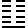
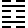

# 御纂周易折中 卷四

## 【折中】23. 剝卦

<!-- Source: https://www.eee-learning.com/book/4576 -->
<!-- BEGIN SOURCE: eee-4576 -->
---

23. 　 **剝卦** 　坤下艮上

【程傳】剝《序卦》：「賁者飾也，致飾然後亨則盡矣，故受之以剝。」夫物至於文飾，亨之極也。極則必反，故賁終則剝也。卦五陰而一陽，陰始自下生，漸長至於盛極，群陰消剝於陽，故為剝也。以二體言之，山附於地，山高起地上，而反附著於地，頹剝之象也。

**剝，不利有攸往。**

【本義】剝，落也。五陰在下而方生，一陽在上而將盡，陰盛長而陽消落，九月之卦也。陰盛陽衰，小人壯而君子病。又內坤外艮，有順時而止之象。故占得之者，不可以有所往也。

【程傳】剝者，群陰長盛，消剝於陽之時，眾小人剝喪於君子，故君子不利有所往。唯當巽言晦迹，隨時消息，以免小人之害也。

**初六，剝牀以足，蔑貞凶。**

【本義】剝自下起，滅正則凶，故其占如此。蔑，滅也。

【程傳】陰之剝陽，自下而上。以牀為象者，取身之所處也。自下而剝，漸至於身也。剝牀以足，剝牀之足也。剝始自下，故為剝足。陰自下進，漸消滅於貞正，凶之道也。蔑，无也，謂消亡於正道也。陰剝陽，柔變剛，是邪侵正，小人消君子，其凶可知。

【集說】

○　俞氏琰曰：陰之消陽，自下而進。初在下，故為剝牀而先以牀足，滅於下之象。當此不利有攸往之時，唯宜順時而止耳。貞凶，戒占者固執而不知變則凶也。

【案】俞氏之說，是以蔑字屬上句讀，蓋自《象傳》「滅下」看出，亦可備一說。

**六二，剝牀以辨，蔑貞凶。**

【本義】辨，牀幹也，進而上矣。

【程傳】辨，分隔上下者，牀之幹也。陰漸進而上，剝至於辨，愈滅於正也，凶益甚矣。

【集說】

○　俞氏琰曰：既滅初之足於下，又滅二之辨於中，則進而上矣。得此占者，若猶固執而不知變，則其凶必也。

**六三，剝之，无咎。**

【本義】眾陰方剝陽，而己獨應之，去其黨而從正，无咎之道也。占者如是，則得无咎。

【程傳】眾陰剝陽之時，而三獨居剛應剛，與上下之陰異矣。志從於正，在剝之時為无咎者也。三之為可謂善矣，不言吉何也？曰：方群陰剝陽，眾小人害君子，三雖從正，其勢孤弱，所應在无位之地，於斯時也，難乎免矣，安得吉也？其義為无咎耳。言其无咎，所以勸也。

【集說】

○　荀氏爽曰：眾皆剝陽，三獨應上，無剝害意，是以无咎。

○　王氏弼曰：與上為應，群陰剝陽，我獨協焉，雖處於剝，可以无咎。

○　胡氏炳文曰：剝之三，即復之四。復六四不許以吉，剝六三許以无咎，何也？曰：復，君子之事，明道不計功，不以吉許之可也。剝，小人之事，小人中獨知有君子，不以无咎許之，無以開其補過之門也。

【案】王氏、程子，皆以剝之无咎連讀，言此乃剝時之无咎者也，玩《本義》，似以剝之為剝去其黨。

**六四，剝牀以膚，凶。**

【本義】陰禍切身，故不復言蔑貞，而直言凶也。

【程傳】始剝於牀足，漸至於膚。膚，身之外也。將滅其身矣，其凶可知。陰長已盛，陽剝已甚，貞道以消，故更不言蔑貞，直言凶也。

**六五，貫魚，以宮人寵，无不利。**

【本義】魚，陰物。宮人，陰之美而受制於陽者也。五為眾陰之長，當率其類，受制於陽，故有此象。而占者如是，則无不利也。

【程傳】剝及君位，剝之極也，其凶可知，故更不言剝，而別設義以開小人遷善之門。五，群陰之主也。魚，陰物，故以為象。五能使群陰順序，如貫魚然，反獲寵愛於在上之陽，如宮人，則无所不利也。宮人，宮中之人。妻妾，侍使也。以陰言，且取獲寵愛之義。以一陽在上，眾陰有順從之道，故發此義。

【集說】

○　張子曰：陰陽之際，近必相比。六五能上附於陽，反制群陰，不使進逼，方得處剝之善。下無剝之之憂，上得陽功之庇，故曰无不利。

○　熊氏良輔曰：卦本為陰剝陽而陽凶，爻則以剝陽而見凶，故五則以順上為无不利，三則以應上為无咎，而上則有碩果得輿之象焉。

○　張氏振淵曰：遯陰長而猶微，可制也，則告陽以制陰之道，曰畜臣妾。剝，陰長已極不可制矣，則教陰以從陽之道，曰以宮人寵。

**上九，碩果不食，君子得輿，小人剝廬。**

【本義】一陽在上，剝未盡而能復生。君子在上，則為眾陰所載。小人居之，則剝極於上，自失所覆，而无復碩果得輿之象矣。取象既明，而君子小人，其占不同，聖人之情，益可見矣。

【程傳】諸陽削剝已盡，獨有上九一爻尚存，如碩大之果不見食，將見復生之理。上九亦變，則純陰矣。然陽无可盡之理，變於上則生於下，无間可容息也。聖人發明此理，以見陽與君子之道不可亡也。或曰：剝盡則為純坤，豈復有陽乎？曰：以卦配月，則坤當十月；以氣消息言，則陽剝為坤，陽來為復，陽未嘗盡也，剝盡於上，則復生於下矣。故十月謂之陽月，恐疑其无陽矣。陰亦然，聖人不言耳。陰道盛極之時，其亂可知，亂極則自當思治，故眾心願載於君子，君子得輿也。《詩‧匪風》下泉所以居變風之終也。理既如是，在卦亦眾陰宗陽，為共載之象。小人剝廬，若小人則當剝之極，剝其廬矣，无所容其身也，更不論爻之陰陽，但言小人處剝極，則及其廬矣。廬取在上之象。或曰：陰陽之消，必待盡而後復生於下，此在上便有復生之義，何也？夬之上六何以言終有凶？曰：上九居剝之極，止有一陽，陽无可盡之理，故明其有復生之義，見君子之道不可亡也。夬者，陽消陰，陰小人之道也，故但言其消亡耳，何用更言，卻有復生之理乎。

【集說】

○　程子曰：息訓為生者，蓋息則生矣，中無間斷。碩果不食，則便為復也。

○　楊氏文煥曰：貫魚者，眾陰在下之象也。碩果者，一陽在上之象也。

○　胡氏炳文曰：乾為木果，眾陽皆變，而上獨存，有碩果不食象。果中有仁，天地生生之心存焉。碩果專以象言，得輿剝廬，兼占而言。牀，上之藉下以安者也。廬，下之藉上以安者也。始而剝牀，欲上失所安，今而剝廬，自失所安矣。自古小人欲害君子，亦豈小人之利哉？

○　蔡氏清曰：易固為君子謀，然其為君子謀者，亦所以為小人謀也，觀小人剝廬之辭可見。蓋道理自是如此，天地間豈可一日無善類哉？不然，人之類滅矣。可見聖人非姑為是抑彼以伸此也。

○　喬氏中和曰：碩果不食，核也，仁也，生生之根也。自古無不朽之株，有相傳之果，此剝之所以復也。
<!-- END SOURCE: eee-4576 -->

## 【折中】24. 復卦

<!-- Source: https://www.eee-learning.com/book/4577 -->
<!-- BEGIN SOURCE: eee-4577 -->
---

24. 　 **復卦** 　震下坤上

【程傳】復《序卦》：「物不可以終盡剝，窮上反下，故受之以復。」物无剝盡之理，故剝極則復來，陰極則陽生。陽剝極於上而復生於下，窮上而反下也，復所以次剝也。為卦一陽生於五陰之下，陰極而陽復也。歲十月，陰盛既極，冬至則一陽復生於地中，故為復也。陽，君子之道。陽消極而復反，君子之道，消極而復長也，故為反善之義。

**復亨，出入无疾，朋來无咎，反復其道，七日來復，利有攸往。**

【本義】復，陽復生於下也。剝盡則為純坤，十月之卦，而陽氣已生於下矣。積之踰月，然後一陽之體始成而來復，故十有一月，其卦為復。以其陽既往而復反，故有亨道。又內震外坤，有陽動於下而以順上行之象，故其占又為己之出入，既得无疾，朋類之來，亦得无咎。又，自五月姤卦一陰始生，至此七爻，而一陽來復，乃天運之自然。故其占又為反復其道，至於七日，當得來復。又以剛德方長，故其占又為利有攸往也。反復其道，往而復來，來而復往之意。七日者，所占來復之期也。

【程傳】復亨，既復則亨也。陽氣復生於下，漸亨盛而生育萬物。君子之道既復，則漸以亨通，澤於天下，故復則有亨盛之理也。出入无疾，出入謂生長。復生於內，入也；長進於外，出也。先云出，語順耳。陽生非自外也，來於內，故謂之入。物之始生，其氣至微，故多屯艱。陽之始生，其氣至微，故多摧折。春陽之發，為陰寒所折，觀草木於朝暮，則可見矣。出入无疾，謂微陽生長，无害之者也。既无害之，而其類漸進而來，則將亨盛，故无咎也。所謂咎，在氣則為差忒，在君子則為抑塞，不得盡其理。陽之當復，雖使有疾之，固不能止其復也，但為阻礙耳。而卦之才，有无疾之義，乃復道之善也。一陽始生至微，固未能勝群陰，而發生萬物，必待諸陽之來，然後能成生物之功，而无差忒，以朋來而无咎也。三陽子丑寅之氣，生成萬物，眾陽之功也。若君子之道，既消而復，豈能便勝於小人？必待其朋類漸盛，則能協力以勝之也。反復其道，謂消長之道，反復迭至。陽之消，至七日而來復。姤，陽之始消也，七變而成復，故云七日，謂七更也。臨云「八月有凶」，謂陽長至於陰長，歷八月也。陽進則陰退，君子道長，則小人道消，故利有攸往也。

【集說】

○　房氏喬曰：出入无疾，害之者，喜陽氣之復。朋來无罪咎之者，欲眾陽漸進之意。

○　邵子曰：復次剝，明治生於亂乎！夬次姤，明亂生於治乎！時哉時哉！未有剝而不復，未有夬而不姤者。

○　鄭氏剛中曰：七者陽數，日者陽物，故於陽長言七日。八者陰數，月者陰物，臨剛長以陰為戒，故曰八月。

○　《朱子語類》云：七日只取七義，猶八月有凶只取八義。

○　胡氏炳文曰：反復其道，統言陰陽往來，其理如此。七日來復，專言一陽往來，其數如此。

○　林氏希元曰：天下事非一人所能獨辦，君子有為於天下，必與其類同心共濟，故復重朋來，而泰重彙征。

○　張氏振淵曰：反復其道，猶云反復計其程道也。此二句，正見天運自有定期，君子不可不善承之耳。

**初九，不遠復，无祗悔，元吉。**

【本義】一陽復生於下，復之主也。祗，抵也。又居事初，失之未遠，能復於善，不抵於悔，大善而占之道也，故其象占如此。

【程傳】復者，陽反來復也。陽，君子之道，故復為反善之義。初剛陽來復，處卦之初，復之最先者也，是不遠而復也。失而後有復，不失則何復之有。惟失之不遠，而復則不至於悔，大善而吉也。祗，宜音柢，抵也。《玉篇》云：適也。義亦同。无祗悔，不至於悔也。坎卦曰「祗既平，无咎」，謂至既平也。顏子无形顯之過，夫子謂其庶幾乃无祗悔也。過既未形而改，何悔之有。既未能不勉而中，所欲不踰矩，是有過也。然其明而剛，故一有不善未嘗不知，既知未嘗不遽改，故不至於悔，乃不遠復也。祗，陸德明音支，玉篇五經文字，羣經音辨並見衣部。

【集說】

○　楊氏時曰：初九陽始生而未形，動之微也。吉凶悔吝生乎動者也，未形而復，其復不遠矣，故不至於悔而元吉。

○　俞氏琰曰：初居震動之始，方動即復，是不遠而復，復之最先者也，故不至於悔而元吉。

**六二，休復，吉。**

【本義】柔順中正，近於初九，而能下之，復之休美，言之道也。

【程傳】二雖陰爻，處中正而切比於初，志從於陽，能下仁也，復之休美者也。復者，復於禮也。復禮則為仁，初陽復，復於仁也。二比而下之，所以美而吉也。

【集說】

○　《朱子語類》云：學莫便於近乎仁，既得仁者而親之，資其善以自益，則力不勞而學美矣，故曰休復吉。

**六三，頻復，厲无咎。**

【本義】以陰居陽，不中不正，又處動極，復而不固，屢失屢復之象。屢失故危，復則无咎，故其占又如此。

【程傳】三以陰躁處動之極，復之頻數，而不能固者也。復貴安固，頻復頻失，不安於復也。復善而屢失，危之道也。聖人開遷善之道，與其復而危其屢失，故云厲无咎。不可以頻失而戒其復也。頻失則為危，屢復何咎？過在失而不在復也。

【集說】

○　郭氏忠孝曰：唯君子能久於其道，其餘則日月至焉而已。是以子夏之徒，出見紛華盛麗而悅，入聞夫子之道而樂，與夫回之為人，拳拳服膺而弗失之者，固有間矣。

○　趙氏汝楳曰：三為震動之極，故曰頻。厲，危也，即人心惟危之危。

**六四，中行獨復。**

【本義】四處群陰之中，而獨與初應，為與眾俱行，而獨能從善之象。當此之時，陽氣甚微，未足以有為，故不言吉。然理所當然，吉凶非所論也。董子曰：「仁人者正其義不謀其利，明其道不計其功。」於剝之六三及此爻見之。

【程傳】此爻之義，最宜詳玩，四行群陰之中，而獨能復，自處於正，下應於陽剛，其志可謂善矣。不言吉凶者，蓋四以柔居群陰之間，初方甚微，不足以相援，无可濟之理，故聖人但稱其能獨復，而不欲言其獨從道而必凶也。曰，然則不言无咎，何也？曰：以陰居陰，柔弱之甚，雖有從陽之志，終不克濟，非无咎也。

【集說】

○　孔氏穎達曰：中行獨復者，處於上卦之下，上下各有二陰，己獨應初，居在眾陰之中，故云中行。獨自應初，故云獨復。

○　繆氏昌期曰：中，即中以自考中字。獨，即《中庸》慎獨之獨。四能以中而行，而於獨知之中，憬然自覺，所謂復以自知也。蓋復之所以為復，全在初爻，猶人之初念也。五陰皆復此而已，惟四在陰中，有所專向，故發此義。

**六五，敦復，无悔。**

【本義】以中順居尊，而當復之時，敦復之象，无悔之道也。

【程傳】六五以中順之德處君位，能敦篤於復善者也，故无悔。雖本善，戒亦在其中矣。陽復方微之時，以柔居尊，下復无助，未能致亨吉也，能无悔而已。

【集說】

○　項氏安世曰：臨以上六為敦臨，艮以上九為敦艮，皆取積厚之極。復於五即言敦復者，復之上爻，迷而不復，故復至五而極也。卦中復者五爻，初最在先，故為不遠。五最在後，故為敦。

○　蔡氏淵曰：敦，厚也。坤象復主初陽，五雖與初無係，而處位得中，能自厚於復者也，可以无悔。

○　李氏簡曰：初九陽剛，君於之道也。相應相比者復之易，二與四是也。遠而非應者，復之難，六五所以稱敦復。敦復者，厚之至也。不與初應，本當有悔，以其能復，是以无悔。

○　胡氏炳文曰：不遠復者，善心之萌。敦復者，善行之固。故初九无祗悔，敦復則可无悔矣。不遠復，入德之事也。敦復，其成德之事與。

**上六，迷復，凶。有災眚，用行師，終有大敗，以其國君凶，至於十年不克征。**

【本義】以陰柔居復終，終迷不復之象，凶之道也，故其占如此。以猶及也。

【程傳】以陰柔居復之終，終迷不復者也。迷而不復，其凶可知。有災眚，災，天災，自外來。眚，己過，由自作。既迷不復善，在己則動皆過失，災禍亦自外而至，蓋所招也。迷道不復，无施而可，用以行師，則終有大敗。以之為國，則君之凶也。十年者，數之終。至于十年不克征，謂終不能行。既迷於道，何時而可行也。

【集說】

○　徐氏幾曰：上六位高而無下仁之美，剛遠而無遷善之機，厚極而有難開之蔽，柔終而無改過之勇，是昏迷而不知復者也。

○　楊氏啓新曰：心為天君。以其國君，言喪失其本心也。

○　何氏楷曰：坤本先迷，今居其極，則迷之甚矣。言迷復，即昏迷而不知所復之謂。行師以下，皆假像，以喻一心不能馭眾動，徇物必至喪天君也。

【總論】胡氏炳文曰：迷復與不遠復相反，初不遠而復，迷則遠而不復。敦復與頻復相反，敦無轉易，頻則屢易。獨復與休復相似，休則比初，獨則應初也。十年不克征亦七日來復之反。
<!-- END SOURCE: eee-4577 -->

## 【折中】25. 无妄

<!-- Source: https://www.eee-learning.com/book/4578 -->
<!-- BEGIN SOURCE: eee-4578 -->
---

25. 　 **无妄卦** 　震下乾上

【程傳】无妄《序卦》：「復則不妄矣，故受之以无妄」。復者，反於道也。既復於道，則合正理而无妄，故復之後，受之以无妄也。為卦乾上震下，震，動也，動以天為无妄，動以人欲則妄矣，无妄之義大矣哉！

**无妄，元亨利貞，其匪正有眚，不利有攸往。**

【本義】无妄，實理自然之謂，《史記》作「无望」，謂无所期望而有得焉者，其義亦通。為卦自訟而變，九自二來而居於初，又為震主，動而不妄者也，故為无妄。又二體震動而乾健，九五剛中而應六二，故其占大亨而利於正。若其不正，則有眚而不利有所往也。

【程傳】无妄者，至誠也。至誠者，天之道也。天之化育萬物，生生不窮，各正其性命，乃无妄也。人能合无妄之道，則所謂「與天地合其德」也。无妄有大亨之理，君子行无妄之道，則可以致大亨矣。无妄，天之道也，卦言人由无妄之道也。利貞法无妄之道，利在貞正，失貞正則妄也。雖无邪心，苟不合正理，則妄也，乃邪心也。故有匪正，則為過眚。既已无妄，不宜有往，往則妄也。

【集說】

○　《朱子語類》云：无妄一卦，雖云禍福之來也無常，然自家所守者，不可不利於正，不可以彼之無常，而吾之所守亦為之無常也，故曰「无妄，元亨利貞，其匪正有眚」。

○　問：雖無邪心，苟不合正理，則妄也。既無邪，何以不合正？曰：有人自是其心全無邪，而卻不合於正理。如賢者過之，其心豈曾有邪？卻不合正理，佛氏亦豈有邪心者？

○　丘氏富國曰：惟其无妄，所以無望也。若其處心，未免於妄，則無道以致福而妄。欲徼福，非所謂無望之福。有過以召災，而妄欲免災，非所謂無望之災。此皆未免容心於禍福間，非所謂无妄也。若真實无妄之人，則純乎正理，禍福一付之天，而無苟得倖免之心也。

○　胡氏炳文曰：朱子解《中庸》誠字，以為真實无妄之謂。此解无妄，則以為實理自然之謂。自然二字，已兼無所期望之意矣。

○　胡氏居仁曰：无妄，誠也。誠，天理之實也。聖人只是循其實理之自然，無一毫私意造為。故出乎實理无妄之外，則為過眚。循此實理无妄而行之，則吉无不利。不幸而災疾之來，亦守此无妄之實理，而不足憂。卦辭爻辭皆此意。

**初九，无妄，往吉。**

【本義】以剛在內，誠之主也。如是而往，其吉可知。故其象占如此。

【程傳】九以陽剛為主於內，无妄之象，以剛實變柔而居內，中誠不妄者也，以无妄而往，何所不吉。卦辭言不利有攸往，謂既无妄，不可復有往也。過則妄矣。爻言往吉，謂以无妄之道而行則吉也。

【集說】

○　蘭氏廷瑞曰：初則當行，終則當止，行止適當則无妄，不妄則吉。无妄之初，當行者也，故往則有吉。无妄之終，當止者也，故行則有眚。

○　胡氏炳文曰：《彖》曰「剛自外來而為主於內」，《本義》於此曰：以剛在內，誠之主也。主字最有力。蓋妄者，誠之反也，誠之主如此，妄自然无矣。如此而往，其吉固宜。

○　何氏揩曰：此爻足蔽无妄全卦。震陽初動，誠一未分，是之謂无妄。以此而往，動與天合，何不吉之有？

**六二，不耕穫，不菑畬，則利有攸往。**

【本義】柔順中正，因時順理，而无私意期望之心，故有不耕穫，不菑畬之象。言其无所為於前，无所冀於後也。占者如是，則利有所往也。

【程傳】凡理之所然者，非妄也。人所欲為者，乃妄也。故以耕穫菑畬譬之。六二居中得正，又應五之中正，居動體而柔順，為動能順乎中正，乃无妄者也，故極言无妄之義。耕，農之始。穫，其成終也。田一歲曰菑，三歲曰畬。不耕而穫，不菑而畬，謂不首造其事，因其事理所當然也。首造其事，則是人心所作為，乃妄也。國事之當然，則是順理應物，非妄也，穫與畬是也。蓋耕則必有穫，菑則必有畬，是事理之固然，非心意之所造作也。如是則為无妄，不妄則所往利而无害也。或曰：聖人制作以利天下者，皆造端也，豈非妄乎？曰：聖人隨時制作，合乎風氣之宜，未嘗先時而開之也。若不待時，則一聖人足以盡為矣，豈待累聖繼作也？時乃事之端，聖人隨時而為也。

【集說】

○　《朱子語類》問：《程傳》爻辭恐未明白。竊謂無不耕而穫、不菑而畬之理，只是不於耕而計穫之利，如程子所解《象傳》，移之以解爻辭則可。曰：《易傳》爻象之辭，雖若相反，而意實相近，特辭有未足耳。爻辭言當循理，《象傳》言不計利。

○　陳氏埴曰：伊川大意，只謂不為穫而耕，不為畬而菑，凡有所為而為者，皆計利之私心，即妄也。但經文中不如此下語，故《易傳》中頗費言語。始謂不耕而穫，不菑而畬，謂不首造其事，則似以耕菑為私意；中謂耕則必有穫，菑則必有畬，非心造意作，則以耕穫菑畬為非私意。終謂既耕則必有穫，既菑則必成畬。非必以穫畬之富而為，則又似以穫畬為私意。三說不免自相抵捂，所以《本義》但據經文直說，謂無耕穫菑畬之私心。

○　胡氏炳文曰：耕穫者，種而斂之也。菑畬者，墾而熟之也。一歲之農，始於耕，終於穫。三歲之田，始於菑，終於畬。不耕穫，不菑畬，諸家以為不耕而穫，不菑而畬，惟《本義》以為始終無所作為之象，而必曰因時順理者，理本自然無所作為，自始至終，絕無計功謀利之心，故其占曰「利有牧往」。

○　林氏希元曰：田必耕然後穫，必菑然後畬。其耕也正以望穫，其菑也正以望畬，豈有不耕穫不菑畬之理。為此語者，特以明自始至終絶無營爲計較之心焉耳。

○　何氏楷曰：人之有妄，在於期望。不耕穫者，不方耕而即望有其穫也。不菑畬者，不方菑而即望成其畬也。學者之除妄心而必有事焉，當如此矣，故曰則利有攸往。言必如此而後利也。

【案】何氏說與《傳》義頗異，質諸夫子先事後得、先難後獲之訓，則於理尤長。且《象傳》以未富釋之，正謂其無望穫之心，未必以耕為可廢也。

**六三，无妄之災，或繫之牛，行人之得，邑人之災。**

【本義】卦之六爻，皆无妄者也。六三處不得正，故遇其占者，无故而有災，如行人牽牛以去，而居者反遭詰捕之擾也。

【程傳】三以陰柔而不中正，是為妄者也。又志應於上，欲也，亦妄也。在无妄之道，為災害也。人之妄動，由有欲也。妄動而得，亦必有失。雖使得其所利，其動而妄，失已大矣，況復凶悔隨之乎？知者見妄之得，則知其失必與稱也。故聖人因六三有妄之象，而發明其理云「无妄之災，或繫之牛，行人之得，邑人之災」。言如三之為妄，乃无妄之災害也。設如有得，其失隨至，如或繫之牛。或，謂設或也，或繫得牛，行人得之以為有得，邑人失牛，乃是災也。借使邑人繫得馬，則行人失馬，乃是災也。言有得則有失，不足以為得也。行人、邑人，但言有得則有失，非以為彼己也。妄得之福，災亦隨之；妄得之得，失亦稱之，固不足以為得也。人能知此，則不為妄動矣。

【集說】

○　關氏朗曰：无妄而災者，災也。有妄而災，則其所也，非災之也。運數適然，非己妄致，乃无妄之災。

○　《朱子語類》云：此卦六爻皆是无妄，但六三地頭不正，故有「无妄之災」，言無故而有災也。如行人牽牛以去，而居人反遭捕詰之擾，此正无妄之災之象。

○　胡氏炳文曰：匪正有眚，人自為之也。无妄之災，天實為之也。六爻皆无妄，三之時，則无妄而有災者也。《雜卦》曰「无妄，災也」，其此之謂與？

**九四，可貞，无咎。**

【本義】陽剛乾體，下无應與，可固守而无咎，不可以有為之占也。

【程傳】四剛陽而居乾體，復无應與，无妄者也。剛而无私，豈有妄乎？可貞固守此，自无咎也。九居陰得為正乎？曰：以陽居乾體，若復處剛，則為過矣，過則妄也。居四，无尚剛之志也。可貞與利貞不同，可貞謂其所處可貞固守之，利貞謂利於貞也。

【集說】

○　胡氏炳文曰：貞，正而固也。曰利貞，則訓正字，而兼固字之義。曰不可貞，則專訓固字，而無正字之義。九四陽剛健體，下無應與，可貞正守之，而其占不可有為也。

○　何氏楷曰：四剛陽而居乾體，本自无妄者也。可貞固守此，則无咎。初九之无妄往吉，行乎其所當行也。九四之可貞无咎，止乎其所當止者也。

**九五，无妄之疾，勿藥有喜。**

【本義】乾剛中正，以居尊位，而下應亦中正，无妄之至也。如是而有疾，勿藥而自愈矣。故其象占如此。

【程傳】九以中正當尊位，下復以中正順應之，可謂无妄之至者也，其道无以加矣。疾，為之病者也。以九五之无妄，如其有疾，勿以藥治，則有喜也。人之有疾，則以藥石攻去其邪以養其正。若氣體平和，本无疾病，而攻治之，則反害其正矣。故勿藥則有喜也。有喜，謂疾自亡也。无妄之所謂疾者，謂若治之而不治，率之而不從，化之而不革，以妄而為无妄之疾。舜之有苗，周公之管蔡，孔子之叔孫武叔是也。既已无妄，而有疾之者，則當自如。无妄之疾，不足患也。若遂自攻治，乃是渝其无妄而遷於妄也。五旣處无妄之極，故惟戒在動，動則妄矣。

【案】勿者，禁止之辭。言无妄矣，而偶有疾，則亦順其自然而氣自復，勿復用藥以生他候。如人有无妄之災，則亦順其自然而事自平，勿復用智以生他咎也。凡易中言勿者皆同義。此爻之疾，與六三之災同。然此曰有喜者，剛中正而居尊位，德位固不同也。

**上九，无妄，行有眚，无攸利。**

【本義】上九非有妄也，但以其窮極而不可行耳，故其象占如此。

【程傳】上九居卦之終，无妄之極者也。極而復行，過於理也。過於理則妄也。故上九而行，則有過眚而无所利矣。

【集說】

○　龔氏煥曰：无妄者，實理自然之謂。循是理則吉，拂是理則凶。初往吉，二利有攸往，循是理而動者也。四可貞无咎，守是理而不動者也。三有災，五有疾，不幸而遇無故非意之事，君子亦聽之而已，守是理而不為動者也。或動或靜，惟理是循，所以為无妄。上九居无妄之極，不可有行，若不循理而動，則反為妄矣，其有眚而不利也宜哉！

○　何氏楷曰：彖所謂「匪正有眚，不利有攸往」者。

【總論】胡氏炳文曰：六爻皆无妄也，特初九得位而為震動之主，時之方來，故无妄往吉。上九失位而居乾體之極，時已去矣，故其行雖无妄，有眚无攸利。是故善學易者在識時，初曰吉，二曰利，時也。三曰災，五曰疾，上曰眚，非有妄以致之也，亦時也。初與二皆可往，時當動而動也。四可貞，五勿藥，上行有眚，時當靜而靜也。
<!-- END SOURCE: eee-4578 -->

## 【折中】26. 大畜

<!-- Source: https://www.eee-learning.com/book/4580 -->
<!-- BEGIN SOURCE: eee-4580 -->
---

26. 　 **大畜卦** 　乾下艮上

【程傳】大畜《序卦》：「有无妄然後可畜，故受之以大畜。 」无妄則為有實，故可畜聚，大畜所以次无妄也。為卦艮上乾下，天而在於山中，所畜至大之象。畜為畜止，又為畜聚。止則聚矣。取天在山中之象，則為蘊畜。取艮之止乾，則為畜止。止而後有積，故止為畜義。

**大畜，利貞，不家食吉，利涉大川。**

【本義】大，陽也。以艮畜乾，又畜之大者也。又以內乾剛健，外艮篤實輝光，是以能日新其德。而為畜之大也。以卦變言，此卦自需而來，九自五而上，以卦體言，六五尊而尚之。以卦德言，又能止健，皆非大正不能，故其占為利貞，而不家食吉也。又六五下應於乾，為應乎天，故其占又為利涉大川也。不家食，謂食祿於朝，不食於家也。

【程傳】莫大於天，而在山中，艮在上而止乾於下，皆蘊畜至大之象也。在人為學術道德充積於內，乃所畜之大也。凡所畜聚皆是。專言其大者，人之蘊畜，宜得正道，故云利貞。若夫異端偏學，所聚至多而不正者固有矣。既道德充積於內，宜在上位，以享天祿，施為於天下，則不獨於一身之吉，天下之吉也。若窮處而自食於家，道之否也，故不家食則吉。所畜既大，宜施之於時，濟天下之艱險，乃大畜之用也，故利涉大川。此只據大畜之義而言，《彖》更以卦之才德而言，諸爻則惟有止畜之義。蓋易體道隨宜，取明且近者。

【集說】

○　《朱子語類》云：某作《本義》，欲將文王卦辭只大綱，依文王本義略說，至其所以然之故，卻於孔子《彖傳》中發之。且如「大畜，利貞，不家食吉，利涉大川」，只是占得大畜者，為利貞不家食而吉，利於涉大川。至於剛上尚賢等處，乃孔子發明，各有所主。爻象亦然。如此則不失文王本意，又可見孔子之意，但今未暇整頓耳。

○　胡氏炳文曰：不家食，是賢者不畜於家而畜於朝。涉大川，又似有畜極而通之意。要之兩利字，一吉字，占辭自分為三，不必泥而一之也。

**初九，有厲，利已。**

【本義】乾之三陽，為艮所止，故內外之卦各取其義。初九為六四所止，故其占往則有危，而利於止也。

【程傳】大畜，艮止畜乾也。故乾三爻皆取被止為義，艮三爻皆取止之為義。初以陽剛，又健體而居下，必上進者也。六四在上，畜止於己，安能敵在上得位之勢？若犯之而進，則有危厲，故利在已而不進也。在他卦，則四與初為正應，相援者也。在大畜，則相應乃為相止畜。上與三皆陽，則為合志。蓋陽皆上進之物，故有同志之象，則无相止之義。

【集說】

○　蔡氏清曰：初九不可進而未必能自不進，故戒之云進則有厲，惟利於已也。若九二之處中，能自止而不進者也。則以其所能言之曰輿説輹。

**九二，輿說輹。**

【本義】九二亦為六五所畜，以其處中，故能自止而不進，有此象也。

【程傳】二為六五所畜止，勢不可進也。五據在上之勢，豈可犯也？二雖剛健之體，然其處得中道，故進止无失。雖志於進，度其勢之不可，則止而不行，如車輿說去輪輹，謂不行也。

**九三，良馬逐，利艱貞，曰閑輿衛，利有攸往。**

【本義】三以陽居健極，上以陽居畜極，極而通之時也。又皆陽爻，故不相畜而俱進，有良馬逐之象焉。然過剛銳進，故其占必戒以艱貞閑習，乃利於有往也。曰，當為日月之日。

【程傳】三剛健之極，而上九之陽，亦上進之物，又處畜之極而思變也。與三乃不相畜而志同，相應以進者也。三以剛健之才，而在上者與合志而進，其進如良馬之馳逐，言其速也。雖其進之勢速，不可恃其才之健與上之應，而忘備與慎也。故宜艱難其事，而由貞正之道。輿者用行之物，衛者所以自防。當自日常閑習其車輿，與其防衛，則利有攸往矣。三乾體而居正，能貞者也，當其銳進，故戒以知難，與不失其貞也。志既銳於進，雖剛明有時而失，不得不戒也。

【集說】

○　項氏安世曰：初九在初，故稱童牛。九二以剛居柔，無勢，故為豶豕。九三純乾，故為良馬。

**六四，童牛之牿，元吉。**

【本義】童者，未角之稱。牿，施橫木於牛角以防其觸，《詩》所謂楅衡者也。止之於未角之時，為力則易，大善之吉也，故其象占如此。《學記》曰：禁於未發之謂豫，正此意也。

【程傳】以位而言，則四下應於初，畜初者也。初居最下，陽之微者，微而畜之則易制，猶童牛而加牿，大善而吉也。概論畜道，則四艮體，居上位而得正，是以正德居大臣之位，當畜之任者也。大臣之任，上畜止人君之邪心，下畜止天下之惡人。人之惡，止於初則易，既盛而後禁，則扞格而難勝。故上之惡既甚，則雖聖人救之，不能免違拂。下之惡既甚，則雖聖人治之，不能免刑戮。莫若止之於初，如童牛而加牿，則元吉也。牛之性，觝觸以角，故牿以制之。若童犢始角而加之以牿，使觝觸之性不發，則易而无傷。以況六四能畜止上下之惡於未發之前，則大善之吉也。

【集說】

○　《朱子語類》云：大畜下卦，取其能自畜而不進，上卦取其能畜彼而不使進。然四能止之於初，故為力易。五則陽已進而止之，則難。以柔居尊，得其機會可制，故亦吉，但不能如四之元吉耳。

**六五，豶豕之牙，吉。**

【本義】陽已進而止之，不若初之易矣。然以柔居中，而當尊位，是以得其機會而可制，故其象如此，占雖吉而不言元也。

【程傳】六五居君位，止畜天下之邪惡。夫以億兆之眾，發其邪欲之心，人君欲力以制之，雖密法嚴刑，不能勝也。夫物有總攝，事有機會，聖人操得其要，則視億兆之心猶一心，道之斯行。止之則戢，故不勞而治，其用若豶豕之牙也。豕，剛躁之物，而牙為猛利，若強制其牙，則用力勞而不能止其躁猛，雖縶之維之，不能使之變也。若豶去其勢，則牙雖存而剛躁自止。其用如此，所以吉也。君子法豶豕之義，知天下之惡，不可以力制也，則察其機，持其要，塞絕其本原，故不假刑法嚴峻而惡自止也。且如止盜，民有欲心，見利則動，苟不知教而迫於饑寒，雖刑殺日施，其能勝億兆利欲之心乎？聖人則知所以止之之道，不尚威刑，而脩政教，使之有農桑之業，知廉恥之道，雖賞之不竊矣。故止惡之道，在知其本，得其要而已。不嚴刑於彼。而脩政於此，是猶患豕牙之利，不制其牙而豶其勢也。

**上九，何天之衢，亨。**

【本義】何天之衢，言何其通達之甚也。畜極而通，豁達无礙，故其象占如此。

【程傳】予聞之胡先生曰：「天之衢亨誤加何字。」事極則反，理之常也，故畜極而亨。小畜畜之小，故極而成，大畜畜之大，故極而散。極既當變，又陽性上行，故遂散也。天衢，天路也。謂空虛之中，雲氣飛鳥往來，故謂之天衢。天衢之亨，謂其亨通曠闊，无有蔽阻也。在畜道則變矣，變而亨，非畜道之亨也。

【集說】

○　張氏浚曰：剛在上為何，何謂勝其任。

○　王氏宗傳曰：《彖傳》曰「剛上而尚賢」，則上九是也。以陽德而居五之上，為五所尚，此所以有何天之衢之象。天衢，通顯之地也。下之三陽，由己上進，故九三曰良馬逐，又曰上合志也，此賢者之道所以亨也。何，如何校之何，《釋文》曰：梁武帝讀音賀是也。言以身任天下之責，當畜賢之時，為五所尚，主張賢路，賢者之得志，莫盛於斯也。

○　吳氏澄曰：後漢王延壽魯靈光殿賦云，荷天衢以元亨，何作荷，何天之衢，其辭猶《詩》言何天之休，何天之龍。大畜者，一陽止於外，而三陽藏畜於內。畜極則散，止極則行。故上九雖艮體，至畜之終，則不止而行也。

○　胡氏炳文曰：隨畜隨發，不足為大畜。惟畜之極而通，豁達無礙，如天衢然。此不徒為仕者之占，《大學章句》所謂用力之久，一旦豁然貫通者，亦是此意。多識前言往行以畜其德者，以之可也。

○　蔡氏清曰：觀畜極而通之意，則知君子患屈之未至耳，不患其不伸也。

【案】何字，《程傳》以為誤加，《本義》以為發語，而諸家皆以荷字為解，義亦可從。蓋剛上尚賢者，惟上九一爻當之，且為艮主，是卦之主也，故取尚賢之義。則是賢路大通，卦所謂不家食者此已。取艮主之義，則能應天止健，卦所謂涉大川者此已，故天衢者，喻其通也。荷天之衢者，言其遇時之通也。《雜卦》云「大畜時也」，正謂此也。吳氏引《商頌》之詩者，意尤近。

【總論】胡氏炳文曰：他卦取陰陽相應，此取相畜。內卦受畜，以自止為義，外卦能畜，以止之為義。獨三與上居內外卦之極，畜極而通，不取止義。

○　葉氏良佩曰：卦《彖》兼取畜止、畜聚二義，《大象》專取畜聚義，六爻專取畜止義。初九進則有厲，惟利於已，知難而止者也。九二處得中道，能說輹而不行，時止則止者也。九三與上合志，其進也如良馬之馳逐，此畜極而通之象，然猶以艱貞閑習為戒者，慮其可進而銳於進也。六四當大畜之任，能止惡於初，若童牛始角而加之以牿，則大善之吉也。六五制惡有道，得其機會，故其象以豶豕之牙，其占雖吉，然比之於四則有間矣。或問：六四元吉，《傳》曰有喜；六五之吉，乃曰有慶，何也？曰：論為力之難易，則四為易，故曰元吉；論其功之廣狹，則五為廣，故曰有慶。上九之亨，畜極而大通也，故以天之衢為象。雲行雨施，天下平也，其斯以為道大行乎。

【案】有厲、說輹，則猶家食者也，阻於大川者也。牿牛、豶豕，則猶治不肖者也，弘濟艱難者也。至良馬逐則漸通矣。然猶防賢路之崎嶇，而日閑輿衛，故至於何天之衢，然後大道夷而險阻去也，卦爻義之相關者在此。
<!-- END SOURCE: eee-4580 -->

## 【折中】27. 頤卦

<!-- Source: https://www.eee-learning.com/book/4597 -->
<!-- BEGIN SOURCE: eee-4597 -->
---

27. 　 **頤卦** 　震下艮上

【程傳】頤《序卦》：「物畜然後可養，故受之以頤。」夫物既畜聚，則必有以養之，无養則不能存息，頤所以次大畜也。卦上艮下震，上下二陽爻，中含四陰，上止而下動，外實而中虛，人頤頷之象也。頤，養也。人口所以飲食，養人之身，故名為頤。聖人設卦，推養之義，大至於天地養育萬物，聖人養賢以及萬民，與人之養生、養形、養德、養人，皆頤養之道也。動息節宣，以養生也。飲食衣服，以養形也。威儀行義，以養德也。推己及物，以養人也。

**頤，貞吉，觀頤，自求口實。**

【本義】頤，口旁也。口食物以自養，故為養義。為卦上下二陽，內含四陰，外實內虛，上止下動，為頤之象，養之義。貞吉者，占者得正則吉。觀頤，謂觀其所養之道。自求口實，謂觀其所以養身之術，皆得正則吉也。

【程傳】頤之道，以正則吉也。人之養身、養德、養人、養於人，皆以正道則吉也。天地造化，養育萬物，各得其宜者，亦正而已矣。「觀頤，自求口實」，觀人之所頤，與其自求口實之道，則善惡吉凶可見矣。

【集說】

○　《朱子語類》云：養須是正則吉。觀頤，是觀其養德正不正。自求口實，是觀其養身正不正，未說到養人處。

○　林氏希元曰：人之所養有二，一是養性，一是養身，二者皆不可不正。觀其所養之道，如大學聖賢之道，正也，異端小道則不正矣。又必自求其口實，如重道義而略口體，正也。急口體而輕道義，則不正矣。皆正則吉，不正則凶。

○　陳氏琛曰：集義以養其氣，寡欲以養其心，守聖道而不溺於虛無，崇聖學而不流於術數，則所以養德者正矣。窮而不屑於嘑蹴，達而不至於素餐，不以貧賤飢渴害其心，不以聲色臭味汩其性，則所以養身者正矣。

○　陸氏銓曰：觀頤，即考其善不善。自求口實，即於己取之而已矣。

【案】陸氏說與傳義異，蓋云觀其所養者，以自求養而已，如所養者德乎，則當自求其所以養德之道。如所養者身乎，則當自求其所以養身之方，與夫子《彖傳》語意尤合也。

**初九，舍爾靈龜，觀我朵頤，凶。**

【本義】靈龜，不食之物。朵，垂也。朵頤，欲食之貌。初九陽剛在下，足以不食，乃上應六四之陰，而動於欲，凶之道也，故其象占如此。

【程傳】蒙之初六，蒙者也，爻乃主發蒙而言。頤之初九，亦假外而言。爾，謂初也。舍爾之靈龜，乃觀我而朵頤，我對爾而設。初之所以朵頤者，四也。然非四謂之也，假設之辭耳。九陽體剛明，其才智足以養正者也。龜能咽息不食，靈龜，喻其明智，而可以不求養於外也。才雖如是，然以陽居動體，而在頤之時。求頤，人所欲也。上應於四，不能自守，志在上行，說所欲而朵頤者也。心既動，則其自失必矣。迷欲而失己，以陽而從陰，則何所不至？是以凶也。朵頤，為朵動其頤頷，人見食而欲之，則動頤垂涎，故以為象。

【集說】

○　王氏弼曰：朵頤者，嚼也。以陽處下，而為動始，不能令物由己養，動而求養者也。夫安身莫若不競，脩己莫若自保，守道則福至，求祿則辱來。居養賢之世，不能貞其所履以全其德，而舍其靈龜之明兆，羨我朵頤而躁求，凶莫甚焉。

○　蘇氏軾曰：養人者，陽也。養於人者，陰也。君子在上足以養人，在下足以自養。初九以一陽而伏於四陰之下，其德足以自養，而無待於物者，如龜也。不能守之而觀於四，見其可欲，朵頤而慕之，為陰之所致也，故凶。

○　鄭氏汝諧曰：頤之上體皆吉，而下體皆凶。上體止也，下體動也。在上而止，養人者也。在下而動，求養於人者也。動而求養於人者，必累於口體之養。故雖以初之剛陽，未免於動其欲而觀朵頤也。

○　何氏楷曰：初與上陽剛之德同，而吉凶不同者，初為動之主，上為止之主，養道宜靜故也。

【附錄】項氏安世曰：頤卦惟有二陽，上九在上，謂之由頤，固為所養之主。初九在下，亦足為自養之賢，靈龜伏息而在下，初九之象也。朵頤在上而下垂，上九之象也。上九為卦之主，故稱我。群陰從我而求養，固其所也。初九本無所求，乃亦仰而觀我，有靈而不自保，有貴而不自珍，宜其凶也。初九本靈本貴，聖人以其為動之主居養之初，故深戒之，以明自養之道。

【案】項氏以觀我朵頤為上九，亦備一說。

**六二，顛頤，拂經，于丘頤，征凶。**

【本義】求養於初，則顛倒而違於常理。求養於上，則往而得凶。丘，土之高者，上之象也。

【程傳】女不能自處，必從男。陰不能獨立，必從陽。二陰柔不能自養，待養於人者也。天子養天下，諸侯養一國，臣食君上之祿，民賴司牧之養，皆以上養下，理之正也。二既不能自養，必求養於剛陽，若反下求於初，則為顛倒，故云顛頤。顛則拂違經常，不可行也。若求養于丘，則往必有凶。丘在外而高之物，謂上九也。卦止二陽，既不可顛頤於初，若求頤於上九，往則有凶。在頤之時，相應則相養者也。上非其應而往求養，非道妄動，是以凶也。顛頤則拂經，不獲其養爾。妄求於上，往則得凶也。今有人，才不足以自養，見在上者勢力足以養人，非其族類，妄往求之，取辱得凶必矣。六二中正，在他卦多吉，而凶，何也？曰，時然也，陰柔既不足以自養，初上二爻皆非其與，故往求則悖理而得凶也。

【集說】

○　項氏安世曰：二五得位得中，而不能自養，反由頤於無位之爻，與常經相悖，故皆為拂經。上艮體，故為于丘。

○　黃氏榦曰：頤之六爻，只是顛拂二字，求養於下則為顛，求養於上則為拂。六二比初而求上，故顛頤當為句，拂經于丘頤為句，征凶則其占辭也。六三拂頤，雖與上為正應，然是求於上以養己，故凶。六四顛頤，固與初為正應，然是賴初之養以養人，故雖顛而吉。六五拂經，是比於上，然是賴上九之養以養人，所以居貞而亦吉。

【案】項氏、黃氏說，深得文意，可從。《本義》雖從《程傳》以征凶屬之丘頤，然至其解《象傳》「六二征凶，行失類也」，則曰初上皆非其類也，則亦以征凶總承兩義矣。

**六三，拂頤，貞凶，十年勿用，无攸利。**

【本義】陰柔不中正，以處動極，拂於頤矣。既拂於頤，雖正亦凶，故其象占如此。

【程傳】頤之道惟正則吉，三以陰柔之質，而處不中正，又在動之極，是柔邪不正而動者也。其養如此，拂違於頤之正道，是以凶也。得頤之正，則所養皆吉。求養養人，則合於義。自養，則成其德。三乃拂違正道，故戒以十年勿用。十，數之終，謂終不可用，无所往而利也。

【集說】

○　張子曰：履邪好動，繫說於上，不但拂頤之經而已，害頤之正莫甚焉，故凶。

○　楊氏時曰：頤正則吉，六三不中正而居動之極，拂頤之正也。十年勿用，則終不可用矣，何利之有？

○　鄭氏汝諧曰：三應於上，若得所養，而凶莫甚於三，蓋不中不正而居動之極，所以求養於人者，必無所不至，是謂拂於頤之正，凶之道也。十年勿用无攸利，戒之也，因其多欲妄動，示之以自反之理。作易之本意也。

**六四，顛頤，吉，虎視眈眈，其欲逐逐，无咎。**

【本義】柔居上而得正，所應又正，而賴其養以施於下，故雖顛而吉。虎視眈眈，下而專也。其欲逐逐，求而繼也。又能如是，則无咎矣。

【程傳】四在人上，大臣之位。六以陰居之，陰柔不足以自養，況養天下乎？初九以剛陽居下，在下之賢也。與四為應，四又柔順而正，是能順於初，賴初之養也。以上養下則為順，今反求下之養，顛倒也，故曰顛頤。然己不勝其任，求在下之賢而順從之，以濟其事，則天下得其養，而己无曠敗之咎，故為吉也。夫居上位者，必有才德威望，為下民所尊畏，則事行而眾心服從。若或下易其上，則政出而人違，刑施而怨起，輕於陵犯，亂之由也。六四雖能順從剛陽，不廢厥職，然質本陰柔，賴人以濟，人之所輕，故必養其威嚴，眈眈然如虎視，則能重其體貌，下不敢易。又從於人者必有常。若間或无繼，則其政敗矣。其欲，謂所須用者，必逐逐相繼而不乏，則其事可濟。若取於人而无繼，則困窮矣。既有威嚴，又所施不窮，故能无咎也。二顛頤則拂經，四則吉，何也？曰：二在上而反求養於下，下非其應類，故為拂經。四則居上位，以貴下賤，使在下之賢，由己以行其道，上下之志相應而施於民，何吉如之？自三以下，養口體者也。四以上，養德義者也。以君而資養於臣，以上位而賴養於下，皆養德也。

【集說】

○　蘇氏軾曰：自初而言之，則初之見養於四為凶。自四言之，則四之得養初九為吉。

○　游氏酢曰：以上養下，頤之正也。若在上而反資養於下，則於頤為倒置矣。此二與四所以俱為顛頤也。然二之志在物，而四之志在道，故四顛頤而吉，而二則征凶也。

○　《朱子語類》問：《音辯》載馬氏曰：「眈眈，虎下視貌。」則當為下而專矣。曰：然。又問：其欲逐逐，如何？曰：求於下以養人，必當繼續求之，不厭乎數，然後可以養人而不窮。

○　吳氏澄曰：自養於內者莫如龜，求養於外者莫如虎，故頤之初九六四，取二物為象。四之於初，其下賢求益之心，必如虎之視下求食而後可。其視下也，專一而不他；其欲食也，繼續而不歇。如是，則於人不貳，於己不自足，乃得居上求下之道。

○　林氏希元曰：苟下賢之心不專，則賢者不樂告以善道。求益之心不繼，則才有所得而遽自足。

**六五，拂經，居貞吉，不可涉大川。**

【本義】六五陰柔不正，居尊位而不能養人，反賴上九之養，故其象占如此。

【程傳】六五，頤之時居君位，養天下者也。然其陰柔之質，才不足以養天下，上有剛陽之賢，故順從之，賴其養己以濟天下。君者養人者也，反賴人之養，是違拂於經常。既以己之不足而順從於賢師傅，上師傅之位也，必居守貞固，篤於委信，則能輔翼其身，澤及天下，故吉也。陰柔之質，无貞剛之性，故戒以能居貞則吉。以陰柔之才，雖倚賴剛賢，能持循於平時，不可處艱難變故之際，故云不可涉大川也。以成王之才，不至甚柔弱也。當管蔡之亂，幾不保於周公，況其下者乎。故書曰：王亦未敢誚公，賴二公得終信，故艱險之際，非剛明之主，不可恃也，不得已而濟艱險者，則有矣。發此義者，所以深戒於為君也。於上九則據為臣，致身盡忠之道言，故不同也。

【集說】

○　丘氏富國曰：豫五不言豫，以豫由乎四也。頤五不言頤，以頤由乎上也。

○　林氏希元曰：不能養人，而反賴上九以養於人，故其象為拂經，言反常也。然在己不能養人，而賴賢者以養，亦正道也，故居貞而吉。若不用人而自用，則任大責重，終不能勝，如涉大川，終不能濟，故不可。

**上九，由頤，厲吉，利涉大川。**

【本義】六五賴上九之養以養入，是物由上九以養也。位高任重，故厲而吉。陽剛在上，故利涉川。

【程傳】上九以剛陽之德居師傅之任，六五之君，柔順而從於己，賴己之養，是當天下之任，天下由之以養也。以人臣而當是任，必常懷危厲則吉也。如伊尹、周公，何嘗不憂勤競畏，故得終吉。夫以君之才不足，而倚賴於己，身當天下大任，宜竭其才力，濟天下之艱危，成天下之治安，故曰利涉大川。得君如此之專，受任如此之重，苟之濟天下艱危，何足稱委遇而謂之賢乎？當盡誠竭力而不顧慮，然惕厲則不可忘也。

【集說】

○　王氏弼曰：以陽處上，而履四陰，陰不能獨為主，必宗於陽也，故莫不由之以得其養。

○　李氏舜臣曰：豫九四曰由豫者，即由頤之謂也。由豫在四，猶下於五也，而已有可疑之迹。由頤在上，則過中而嫌於不安，故厲。

○　丘氏富國曰：陽實陰虛，實者養人，虛者求人之養，故四陰皆求養於陽者。然養之權在上，是二陽爻又以上為主，而初陽亦求養者也，故直於上九一爻曰由頤焉。

【總論】吳氏曰慎曰：養之為道，以養人為公，養己為私。自養之道，以養德為大，養體為小。艮三爻皆養人者，震三爻皆養己者。初九、六二、六三，皆自養口體，私而小者也。六四、六五、上九，皆養其德以養人，公而大者也。公而大者吉，得頤之正也，私而小者凶，失頤之貞也。可不觀頤而自求其正邪？
<!-- END SOURCE: eee-4597 -->

## 【折中】28. 大過卦

<!-- Source: https://www.eee-learning.com/book/4598 -->
<!-- BEGIN SOURCE: eee-4598 -->
---

28. 　 **大過卦** 　巽下兌上

【程傳】大過《序卦》曰：「頤者養也，不養則不可動，故受之以大過。」凡物養而後能成，成則能動，動則有過，大過所以次頤也。為卦上兌下巽，澤在木上，滅木也。澤者潤養於木，乃至滅沒於木，為大過之義。大過者，陽過也，故為大者過，過之大與大事過也。聖賢道德功業大過於人，凡事之大過於常者，皆是也。夫聖人盡人道，非過於理也，其制事以天下之正理矯時\*之用小，過於中者則有之，如行過乎恭，喪過乎哀，用過乎儉是也。蓋矯之小過而後能及於中，乃求中之用也。所謂大過者，常事之大者耳，非有過於理也。惟其大，故不常見，以其比常所見者大，故謂之大過。如堯舜之禪讓，湯武之放伐，皆由道也。道无不中，无不常，以世人所不常見，故謂之大過於常也。

\*「時」或作「失」。

**大過，棟橈，利有攸往，亨。**

【本義】大，陽也。四陽居中過盛，故為大過。上下二陰不勝其重，故有棟橈之象。又以四陽雖過，而二五得中，內巽外說，有可行之道，故利有所往而得亨也。

【程傳】小過，陰過於上下。大過，陽過於中。陽過於中而上下弱矣，故為棟橈之象。棟取其勝重，四陽聚於中，可謂重矣。九三九四皆取棟象，謂任重也。橈，取其本末弱，中強而本末弱，是以橈也。陰弱而陽強，君子盛而小人衰，故利有攸往而亨也。棟，今人謂之檁。

【集說】

○　王氏宗傳曰：天下之事，固有正理，豈可過耶？然古今固有所謂非常之事者，以理而論，亦無非君子之時中，特其事大勢重，不常見爾。

○　《朱子語類》問：大過、小過，先生與伊川之說不同。曰：然。伊川此論，正如以反經合道為非相似，殊不知大過自有大過時節，小過自有小過時節。處大過之時，則當為大過之事。處小過之時，則當為小過之事。在事雖是過，然適當其時，合當如此作，便是合義。

○　胡氏一桂曰：或疑頤與大過對者也，何不名為小過？中孚與小過對者也，何不名為大過？蓋大過以四陽在中言，小過以四陰在外言，此是聖人內陽外陰之意。

○　胡氏炳文曰：既曰棟橈，又曰利有攸往亨，何也？曰：棟橈以卦象言也，利往而後亨是不可無大有為之才，而天下亦無不可為之事，以占言也。

○　何氏楷曰：棟《說文》謂之極，《爾雅》謂之桴，其義皆訓中也，即屋之脊檁。惟大過是以棟橈，是以利有攸往，惟有攸往是以亨，《翼傳》乃字當玩。卦辭言棟，概指二三四五言也。爻辭專及三四者，舉中樞也。

**初六，藉用白茅，无咎。**

【本義】當大過之時，以陰柔居巽下，過於畏慎而无咎者也，故其象占如此。白茅，物之潔者。

【程傳】初以陰柔巽體而處下，過於畏慎者也。以柔在下，用茅藉物之象，不錯諸地而藉以茅，過於慎也，是以无咎。茅之為物雖薄，而用可重者，以用之能成敬慎之道也。慎守斯術而行，豈有失乎大過之用也。《繫辭》云：「茍錯諸地而可矣，藉之用茅，何咎之有，慎之至也。夫茅之為物，薄而用可重也，慎斯術也以往，其无所失矣。」言敬慎之至也。茅雖至薄之物，然用之可甚重，以之藉薦，則為重慎之道，是用之重也。人之過於敬慎，為之非難而可以保其安而无過，茍能慎斯道，推而行之於事，其无所失矣。

【集說】

○　胡氏瑗曰：為事之始，不可輕易，必須恭慎，然後可以免咎。況居大過之時，是其事至重，功業至大，尤不易於有為，必當過分而慎重，然後可也。苟於事始慎之如此，則可以立天下之大功，興天下之大利，又何咎之有哉？

○　朱氏震曰：茅之為物，薄而用重，過慎也。過慎者，慎之至也。大過君子，將有事焉，以任至大之事，過而无咎者，其惟過於慎乎！過非正也，初六執柔處下，不犯乎剛，於此而過，其誰咎之？

○　趙氏玉泉曰：當過時而陰居巽下，是以過慎之心任事，謹始慮終，無所不至。如物措諸地，又藉之以白茅焉，如是則視天下無可忽之事者，舉天下無不可為之事，身無過動，行無敗謀，何咎之有？

【案】胡氏、朱氏、趙氏說，極於卦義相關。蓋大過者，大事之卦也。自古任大事者，必以小心為基，故聖人於初爻發義。任重大者，棟也；基細微者，茅也。棟支於上，茅藉於下。故《繫傳》云「茅之為物薄，而用可重也」，正對棟為重物、重任而言。

**九二，枯楊生稊，老夫得其女妻，无不利。**

【本義】陽過之始，而比初陰，故其象占如此。稊，根也，榮於下者也。榮於下則生於上矣。夫雖老而得女妻，猶能成生育之功也。

【程傳】陽之大過，比陰則合，故二與五皆有生象。九二當大過之初，得中而居柔，與初密比而相與。初既切比於二，二復无應於上，其相與可知。是剛過之人，而能以中自處，用柔相濟者也。過剛則不能有所為，九三是也。得中用柔，則能成大過之功，九二是也。楊者，陽氣易感之物，陽過則枯矣。楊枯槁而復生稊，陽過而未至於極也。九二陽過而與初，老夫得女妻之象。老夫而得女妻，則能成生育之功。二得中居柔而與初，故能復生稊，而无過極之失，无所不利也。在大過陽爻居陰則善，二與四是也。二不言吉，方言无所不利，未遽至吉也。稊，根也，劉琨《勸進表》云：生繁華於枯荑，謂枯根也。鄭康成易亦作荑字，與稊同。

【集說】

○　司馬氏光曰：大過剛已過矣，止可濟之以柔，不可濟之以剛也。故大過之時，皆以居陰為吉，不以得位為美。

○　楊氏時曰：聞之蜀僧云：四爻之剛，雖同為木，然或為楊，或為棟。棟負眾榱，則木之強者也。楊為早凋，則木之弱者也。此卦本末皆弱，二近於本，五近於末，故均為木之弱也。

○　項氏安世曰：二五皆濱於澤，楊，澤木也。當大過之時，故稱枯焉。過則木枯也。

○　王氏申子曰：大過諸爻以剛柔適中者爲善，初以柔居剛，二以剛居柔而比之，是剛柔適中相濟而有功者也。其陽過也，如楊之枯，如夫之老。其相濟而有功也，如枯楊而生稊，如老夫得女妻。言陽雖過矣，九二處之得中，故无不利。

○　胡氏炳文曰：巽為木，兌為澤，楊近澤之木，故以取象。枯楊，大過象。稊，初在下象。老夫，九象。女妻，初柔在下象。九二陽雖過而下比於陰，如枯陽雖過於老，稊榮於下，則復生於上矣。老夫而得女妻，雖過以相與，終能成生育之功。無他，以陽從陰，過而不過，生道也。

**九三，棟橈，凶。**

【本義】三四二爻，居卦之中，棟之象也。九三以剛居剛，不勝其重，故象橈而占凶。

【程傳】夫居大過之時，興大過之功，立大過之事，非剛柔得中，取於人以自輔，則不能也。既過於剛強，則不能與人同。常常之功，尚不能獨立，況大過之事乎。以聖人之才，雖小事必取於人，當天下之大任，則可知矣。九三以大過之陽，復以剛自居而不得中，剛過之甚者也。以過甚之剛，動則遠於中和，而拂於眾心，安能當大過之任乎？故不勝其任。如棟之橈，傾敗其室，是以凶也。取棟為象者，以其无輔而不能勝重任也。或曰：三巽體而應於上，豈无用柔之象乎？曰：言易者貴乎識勢之重輕，時之變易。三居過而用剛，巽既終而且變，豈復有用柔之義？應者謂志相從也，三方過剛，上能繫其志乎？

【集說】

○　俞氏琰曰：卦有四剛爻，而九三過剛特甚，故以卦之棟橈屬之。

○　吳氏曰慎曰：九三棟橈，自橈也。所謂太剛則折，故《彖》有取於「剛過而中，巽而說行」也。

**九四，棟隆吉，有它吝。**

【本義】以陽居陰，過而不過，故其象隆而占吉。然下應初六，以柔濟之，則過於柔矣，故又戒以有它則吝也。

【程傳】四居近君之位，當大過之任者也。居柔為能用柔相濟，既不過剛，則能勝其任，加棟之隆起，是以吉也。隆起，取不下橈之義。大過之時，非陽剛不能濟，以剛處柔為得宜矣。若又與初六之陰相應，則過也。既剛柔得宜，而志復應陰，是有它也。有它則有累於剛，雖未至於大害，亦可吝也。蓋大過之時，動則過也。有它，謂更有他志。吝為不足之義，謂可少也。或曰：二比初則无不利，四若應初則為吝，何也？曰：二得中而比於初，為以柔相濟之義。四與初為正應，志相繫者也。九既居四，剛柔得宜矣，復牽繫於陰以害其剛，則可吝也。

【集說】

○　劉氏牧曰：大過之時，陽爻皆以居陰為美，有應則有它吝。

○　李氏過曰：下卦上實而下弱，下弱則上傾。故三居下卦之上，而曰棟橈凶，言下弱而無助也。上卦上弱而下實，下實則可載。故四居上卦之下，而曰棟隆吉，言下實而不橈也。此二爻當分上下體看。

○　胡氏炳文曰：屋以棟爲中，三視四則在下，棟橈於下之象。四在上，棟隆於上之象。

○　 吳氏曰慎曰：三四居卦之中，皆有棟象。三橈而四隆者，三以剛居剛，四以剛居柔，一也。三在下，四在上，二也。三於下卦為上實下虛，四於上卦為下實上虛，三也。

**九五，枯楊生華，老婦得其士夫，无咎无譽。**

【本義】九五陽過之極，又比過極之陰，故其象占皆與二反。

【程傳】九五當大過之時，本以中正居尊位，然下无應助，固不能成大過之功。而上比過極之陰，其所相濟者，如枯楊之生華。枯楊下生根稊，則能復生，如大過之陽，興成事功也。上生華秀，雖有所發，无益於枯也。上六過極之陰，老婦也。五雖非少，比老婦則為壯矣，於五无所賴也，故反稱婦得。過極之陰，得陽之相濟，不為无益也。以士夫而得老婦，雖无罪咎，殊非美也，故云无咎无譽，《象》復言其可醜也。

【集說】

○　沈氏該曰：九二比於初，近本也，生稊之象也。九五承於上，近末也，生華之象也。

○　何氏楷曰：生稊則生機方長，生華則洩且竭矣。二所與者初，初，本也。又巽之主爻為木、為長、為高。木已過而復芽，又長且高，故有往亨之理。五所與者上，上末也。又兌之主爻，為毀折，為附決，皆非木之所宜。木已過而生華，又毀且折，理無久生已。

**上六，過涉滅頂，凶，无咎。**

【本義】處過極之地，才弱不足以濟，然於義為无咎矣。蓋殺身成仁之事，故其象占如此。

【程傳】上六以陰柔處過極，是小人過常之極者也。小人之所謂大過，非能為大過人之事也。直過常越理，不恤危亡，履險蹈禍而已，如過涉於水，至滅沒其頂，其凶可知。小人狂躁以自禍，蓋其宜也。復將何尤？故曰无咎，言自為之，无所怨咎也。因澤之象而取涉義。

【集說】

○　錢氏志立曰：澤之滅木，上之所以滅頂也。雖至滅頂，然有不容不涉，即不得不過者，孔子所以觀卦象而有獨立不懼之思也。

【案】此爻《程傳》以為履險蹈禍之小人，《本義》以為殺身成仁之君子。《本義》之說固比《程傳》為長，然又有一說，以為大過之極，事無可為者。上六柔為說主，則是能從容隨順，而不為剛激以益重其勢，故雖處過涉滅頂之凶，而无咎也。如東京之季，范李之徒，適足以推波助瀾，非救時之道。況上六居無位之地，委蛇和順，如申屠蟠、郭泰者，君子弗非也，此說亦可並存。

【總論】

○　馮氏椅曰：易大抵上下畫停者，從中分反對為象，非他卦相應之例也。頤、中孚、小過皆然，而此卦尤明。三與四對，皆為棟象，上隆下橈也。二與五對，皆為枯楊之象，上華下稊也。初與上對，初為藉用白茅之慎，上為過涉滅頂之凶也。

○　龔氏煥曰：大過本為陽過，若復以陽居陽，則愈過矣。故諸爻以陽居陰者皆吉，以陽居陽者皆凶，與大壯諸爻取義略同。
<!-- END SOURCE: eee-4598 -->

## 【折中】29. 坎卦

<!-- Source: https://www.eee-learning.com/book/4599 -->
<!-- BEGIN SOURCE: eee-4599 -->
---

29. 　 **坎卦** 　坎下坎上

【程傳】習坎《序卦》：「物不可以終過，故受之以坎。坎者，陷也。」理无過而不已，過極則必陷，坎所以次大過也。習，謂重習。他卦雖重，不加其名，獨坎加習者，見其重險，險中復有險，其義大也。卦中一陽上下二陰，陽實陰虛，上下无據，一陽陷於二陰之中，故為坎陷之義。陽居陰中則為陷，陰居陽中則為麗。凡陽在上者止之象，在中陷之象，在下動之象。陰在上說之象，在中麗之象，在下巽之象。陷則為險。習，重也。如學習溫習，皆重複之義也。坎，陷也，卦之所言，處險難之道。坎，水也，一始於中，有生之最先者也，故為水。陷，水之體也。

**習坎，有孚，維心亨，行有尚。**

【本義】習，重習也。坎，險陷也。其象為水，陽陷陰中，外虛而中實也。此卦上下皆坎，是為重險。中實為有孚心亨之象，以是而行，必有功矣，故其占如此。

【程傳】陽實在中，為中有孚信。維心享，維其心誠一，故能亨通。至誠可以通金石，蹈水火，何險難之不可亨也？行有尚，謂以誠一而行，則能出險，有可嘉尚，謂有功也。不行則常在險中矣。

【集說】

○　孔氏穎達曰：坎是險陷之名，習者便習之義。險難之事，非經便習，不可以行。故須便習於坎，事乃得用，故云習坎也。案：諸卦之名，皆於卦上不加其字。此坎卦之名特加習者，以坎為險難，故特加習名。

○　胡氏瑗曰：此卦在八純之數，其七卦皆一字名，獨此加習字者，何也？蓋乾主於健，坤主於順，若是之類，率皆一字可以盡其義。而此卦上下皆險，以是為險難重疊之際。君子之人，必當預積習之，然後可以濟其險阻，故聖人特加習字者此也。

○　蘇氏軾曰：坎，險也。水之所行，而非水也，惟水為能習行於險，其不直曰坎而曰習坎，取於水也。

○　呂氏大臨曰：習坎，更試乎至難也。八卦乾健坤順，震動艮止，離明坎險，巽入兌說。惟險非吉德，君子所不取，故於坎也，獨以習坎為名。更試重險，乃君子所有事也。

○　薛氏溫其曰：坎非用物，以習為用，故名異它卦，蓋言用坎之人也。

○　張氏浚曰：習，安行不息之稱。習坎險可出矣。夫陽陷於陰，非出險則功無自興。曰習坎，求以出險也。

○　鄧氏汝諧曰：服習溫習，皆有重義。水雖至險，而習乎水者，雖出入乎水而不能溺，然則習乎險難者，斯能無入而不自得也。

○　李氏舜臣曰：坎之中實是為誠，離之中虛是為明。中實者坎之用，中虛者離之用也。作易者，因坎離之中，而寓誠明之用，古聖人之心學也。

○　胡氏炳文曰：他卦亨字，《本義》例以為占，惟此則曰中實為有孚心亨之象，蓋他卦事之亨也，此心之亨也。陽實，有孚之象。陽明，心亨之象。

○　章氏潢曰：六十四卦，獨於坎卦指出心以示人，可見心在身中，真如一陽陷於二陰之內，所謂道心惟微者此也。

○　吳氏曰慎曰：陽陷陰中，所以為坎。中實有孚，所以處險。有孚則誠立，心亨則明通。心之體，靜而常明，如一陽藏於二陰中也。心之用，動而不息，如二陰中一陽之流行也。一陽者流行之本體，二陰者所在之分限。流而不踰限，動而靜也。限之而安流，靜而動也。有孚心亨之義，發於習坎，至矣哉！

**初六，習坎，入於坎窞，凶。**

【本義】以陰柔居重險之下，其陷益深，故其象占如此。

【程傳】初以陰柔居坎險之下，柔弱无援，而處不得當，非能出乎險也，唯益陷於深險耳。窞，坎中之陷處。已在習坎中，更入坎窞，其凶可知。

【集說】

○　張氏浚曰：陰居重坎下，迷不知復，以習於惡，故凶，失正道也。傳曰：小人行險以僥倖，初六之謂。

【案】如張氏說，習坎兩字，纔不虛設，時俗所謂機深禍轉深者。

**九二，坎有險，求小得。**

【本義】處重險之中，未能自出，故為有險之象。然剛而得中。故其占可以求小得也。

【程傳】二當坎險之時，陷上下二陰之中，乃至險之地，是有險也，然其剛中之才，雖未能出乎險中，亦可小自濟，不至如初益陷入於深險，是所求小得也。君子處險難而能自保者，剛中而已。剛則才足自衛，中則動不失宜。

【集說】

○　楊氏時曰：求者，自求也。外雖有險而心常亨，故曰求小得。

○　陳氏仁錫曰：求其小，不求其大，原不在大也。涓涓不已，流為江河，如掘地得泉，不待溢出外，然後為流水也。

【案】楊氏、陳氏之說極是，凡人為學作事，必自求小得始，如水雖涓涓而有源，為行險之本也。

**六三，來之坎坎，險且枕。入於坎窞，勿用。**

【本義】以陰柔不中正，而履重險之間，來往皆險，前險而後枕，其陷益深，不可用也，故其象占如此。枕，倚著未安之意。

【程傳】六三在坎險之時，以陰柔而居不中正，其處不善，進退與居皆不可者也。來下則入於險之中，之上則重險也，退來與進之皆險，故云來之坎坎。既進退皆險，而居亦險。枕謂支倚，居險而支倚以處，不安之甚也。所處如此，唯益入於深險耳。故云：入于坎窞。如三所處之道，不可用也，故戒勿用。

【集說】

○　《朱子語類》云：險且枕，只是前後皆險。來之自是兩字，謂下來亦坎，上往亦坎。之，往也，進退皆險也。

○　王氏申子曰：下卦之險已終，上卦之險又至，進退皆險，則寧於可止之地而暫息焉。且者聊爾之辭，枕者息而來安之義。能如此，雖未離乎險，亦不至深入於坎窞之中也。其進而入，則陷益深，為不可用。勿者，止之之辭也。

【案】險且枕，傳義與王氏分為三說，王氏以為戒處險者順聽之意，似與需之六四義足相發。

**六四，樽酒簋，貳用缶，納約自牖，終无咎。**

【本義】晁氏云：先儒讀「樽酒簋」為一句，「貳用缶」為一句，今從之。貳，益之也。《周禮》大祭三貳，弟子職，左執虛豆，右執挾匕，周旋而貳，是也。九五尊位，六四近之，在險之時，剛柔相際，故有但用薄禮，益以誠心，進結自牖之象。牖非所由之正，而室之所以受明也。始雖艱阻，終得无咎，故其占如此。

【程傳】六四陰柔而下无助，非能濟天下之險者，以其在高位，故言為臣處險之道。大臣當險難之時，唯至誠見信於君，其交固而不可間，又能開明君心，則可保无咎矣。夫欲上之篤信，唯當盡其質實而已。多儀而尚飾，莫如燕享之禮，故以燕享喻之。言當不尚浮飾，唯以質實，所用一樽之酒，二簋之食，復以瓦缶為器，質之至也。其質實如此，又須納約自牖。納約謂進結於君之道。牖，開通之義。室之暗也，故設牖所以通明。自牖，言自通明之處，以況君心所明處。《詩》云：「天之牖民，如壎如篪。」毛公訓牖為道，亦開通之謂。人臣以忠信善道結於君心，必自其所明處乃能入也。人心有所蔽，有所通。所蔽者，暗處也；所通者，明處也。當就其明處而告之，求信則易也。故云納約自牖。能如是，則雖艱險之時，終得无咎也。且如君心蔽於荒樂，唯其蔽也故爾，雖力詆其荒樂之非，如其不省何？必於所不蔽之事，推而及之，則能悟其心矣。自古能諫其君者，未有不因其所明也。故訐直強勁者，率多取忤，而溫厚明辯者，其說多行。且如漢祖愛戚姬，將易太子，是其所蔽也。群臣爭之者多矣，嫡庶之義，長幼之序，非不明也，如其蔽而不察何？四老者，高祖素知其賢而重之，此其不蔽之明心也，故因其所明而及其事，則悟之如反手。且四老人之力，孰與張良群公卿及天下之士？其言之切，孰與周昌、叔孫通？然而不從彼而從此者，由攻其蔽與就其明之異耳。又如趙王，太后愛其少子長安君，不肯使質於齊，此其蔽於私愛也。大臣諫之雖強，既曰蔽矣，其能聽乎？愛其子而欲使之長久富貴者，其心之所明也。故左師觸龍因其明而導之，以長久之計，故其聽也如響。非惟告於君者如此，為教者亦然。夫教必就人之所長，所長者，心之所明也。從其心之所明而入，然後推及其餘，孟子所謂成德達才是也。

【集說】

○　王氏弼曰：處重險而履正，以柔居柔，履得其位。以承於五，五亦得位。剛柔各得其所，皆無餘應，以相承比，明信顯著，不存外飾，處坎以斯，雖復一樽之酒，二簋之食，瓦缶之器，納此至約，自進於牖，乃可羞之於王公，薦之於宗廟，故終无咎也。

○　崔氏憬曰：於重險之時，居多懼之地。比五而承陽，脩其潔誠，進其忠信，則終无咎也。

○　郭氏雍曰：有孚者坎之德，君子行險而不失其信，所以法其德也。一樽之酒，二簋之食，瓦缶之器，至微物也。苟能虛中盡誠，以通交際之道，君子不以為失禮，所謂能用有孚之道者也。《傳》曰：苟有明信，蘋蘩薀藻之菜，筐莒錡釜之器，可薦於鬼神，可羞於王公者，無他焉，以誠為主故也。

○　潘氏夢旂曰：「樽酒簋貳用缶」與損之「二簋可用享」同意，皆言不事多儀而尚誠實也。「納約自牖」與睽之「遇主于巷」同意，皆言自間道而通於君也。六四居大臣之位，當坎險之時，盡其誠實，雖自牖而納約，而終无咎，惟睽坎之時為然。

○　何氏楷曰：貳，副也，謂樽酒而副以簋也。《禮》天子大臣出會諸侯，主國樽棜簋副是也。

【案】簋貳之說，何氏得之。

**九五，坎不盈，祗既平，无咎。**

【本義】九五雖在坎中，然以陽剛中正居尊位，而時亦將出矣，故其象占如此。

【程傳】九五在坎之中，是不盈也，盈則平而出矣。祗，宜音柢，抵也。復卦云「无祗悔」，必抵於已平則无咎。既曰不盈，則是未平而尚在險中，未得无咎也。以九五剛中之才居尊位，宜可以濟於險，然下无助也。二陷於險中未能出，餘皆陰柔无濟險之才。人君雖才，安能獨濟天下之險？居君位而不能致天下出於險，則為有咎，必祗既平乃得无咎。

【集說】

○　《朱子語類》云：「坎不盈，祗既平」，祗字他無說處，看來只得作抵字解，復卦亦然。

○　俞氏琰曰：坎不盈，以其流也。《彖傳》云「水流而不盈」是也，不盈則適至於既平，故无咎。

○　何氏楷曰：祗，適也，猶言適足也。言適於平而已，即《彖傳》所謂「水流而不盈」也。

【案】如《程傳》說，則不盈為未能盈科出險之義，與《彖傳》異指矣，須以俞氏、何氏之說為是。蓋不盈，水德也。有源之水，雖涓微而不舍晝夜，雖盛大而不至盈溢，惟二五剛中之德似之。此所以始於小得，而終於不盈也。

**上六，係用徽纆，寘于叢棘，三歲不得，凶。**

【本義】以陰柔居險極，故其象占如此。

【程傳】上六以陰柔而居險之極，其陷之深者也。以其陷之深，取牢獄為喻，如係縛之以徽纆，因寘于叢棘之中，陰柔而陷之深，其不能出矣。故云至於三歲之久，不得免也，其凶可知。

【集說】

○　王氏弼曰：囚執寘於思過之地，自脩三歲，乃可以求復，故曰三歲不得凶。

○　吳氏澄曰：《周官》司圜收教罷民，能改者，上罪三年而舍，其不能改而出圜土者，殺。三歲不得，其罪大而不能改者與？

【案】不得者，不能得其道也。如悔罪思愆，是謂得道。則其困苦幽囚，止於三歲矣。聖人之教人動心忍性以習於險者，雖罪苦已成，而猶不忍棄絕者如此。

【總論】龔氏煥曰：坎卦本以陽陷為義，至爻辭則陰陽皆陷，不以陽陷於陰為義矣。二小得，五既平，是陽之陷為可出；初與三之入於坎窞，上之三歲不得，則陰之陷反為甚。易卦爻取義不同多如此。
<!-- END SOURCE: eee-4599 -->

## 【折中】30. 離卦

<!-- Source: https://www.eee-learning.com/book/4600 -->
<!-- BEGIN SOURCE: eee-4600 -->
---

30. 　 **離卦** 　離下離上

【程傳】離《序卦》：「坎者陷也，陷必有所麗，故受之以離，離者麗也。」陷於險難之中，則必有所附麗，理自然也，離所以次坎也。離，麗也，明也。取其陰麗於上下之陽，則為附麗之義。取其中虛，則為明義。離為火，火體虛，麗於物而明者也。又為日，亦以虛明之象。

**離，利貞，亨，畜牝牛，吉。**

【本義】離，麗也。陰麗於陽，其象為火，體陰而用陽也。物之所麗，貴乎得正。牝牛，柔順之物也，故占者能正則亨，而畜牝牛則吉也。

【程傳】離，麗也。萬物莫不皆有所麗，有形則有麗矣。在人則為所親附之人，所由之道，所主之事，皆其所麗也。人之所麗，利於貞正。得其正，則可以亨通。故曰「離利貞亨」。畜牝牛吉，牛之性順而又牝焉，順之至也。既附麗於正，必能順於正道，如牝牛則吉也。畜牝牛，謂養其順德。人之順德，由養以成，既麗於正，當養習以成其順德也。

【集說】

○　王氏弼曰：離之為卦，以柔為正，故必貞而後乃亨。柔處於內而履正中，牝之善也。外強而內順，牛之善也。離之為體，以柔順為主者也，故不可以畜剛猛之物，而吉於畜牝牛也。

○　郭氏忠孝曰：乾為馬，坤為牝馬；坤為牛，離為牝牛，象之宜也。

○　《朱子語類》問：離卦是陽包陰，占利畜牝牛，便也是宜畜柔順之物。曰：然。

○　吳氏澄曰：牛牝皆坤象，離中畫一陰，坤之中畫也，故象牝牛。

○　胡氏炳文曰：坎之明在內，以剛健而行之於外。離之明在外，當柔順以養之於中。

○　吳氏曰愼曰：坎性就下，下不已則入坎窞。離性炎上，炎之盛則突如焚如。坎陷，欲之類也。離炎，忿之類也。坎維心亨，以剛中則不陷。離畜牝牛，以中順則不突。

 【案】畜牝牛，胡氏、吳氏之說為切。蓋離，明也，高明柔克，則用明而不傷矣。

**初九，履錯然。敬之无咎。**

【本義】以剛居下而處明體，志欲上進，故有履錯然之象，敬之則无咎矣。戒占者宜如是也。

【程傳】陽固好動，又居下而離體。陽居下則欲進，離性炎上，志在上麗，幾於躁動。其履錯然，謂交錯也。雖未進而跡已動矣，動則失居下之分而有咎也。然其剛明之才，若知其義而敬慎之，則不至於咎矣。初在下，无位者也。明其身之進退，乃所麗之道也。其志既動，不能敬慎，則妄動，是不明所麗，乃有咎也。

【集說】

○　孔氏穎達曰：身處離初，故其所履踐，恒錯然敬慎，不敢自寧，故云「履錯然，敬之无咎」。若能如此恭敬，則得避其禍而无咎。

○　王氏昭素曰：處萬物相見之初，履錯雜之時。

○　胡氏瑗曰：錯然者，敬之之貌也。居離之初，如日之初生，於事之初，則當常錯然警懼，以進德脩業，所以得免其咎。

○　馮氏當可曰：日方出，人夙興之晨也。履錯然，動之始也。於其始而加敬，則終必吉。禍福幾微，每萌於初動之時，故戒其初。

○　趙氏彥肅曰：能敬，則動與物交，皆天理也。不能敬，則役於物而生咎矣。日出而作，故發此象。

○　胡氏一桂曰：錯然是事物紛錯之意，能敬則心有主宰，酬應不亂，可免於咎。不能敬則反是。

【案】履錯然，王氏、馮氏、胡氏之說為是，蓋錯雜者，處應物之初也。敬者，養明德之本也。人心之德，敬則明，不敬則昏。於應物之初而知敬，其即於咎者鮮矣。

**六二，黃離，元吉。**

【本義】黃，中色，柔離乎中而得其正，故其象占如此。

【程傳】二居中得正，麗於中正也。黃，中之色，文之美也。文明中正，美之盛也，故云黃離。以文明中正之德，上同於文明中順之君，其明如是，所麗如是，大善之吉也。

【集說】

○　王氏弼曰：居中得位，以柔處柔，履文明之盛而得其中，故曰黃離元吉也。

○　劉氏牧曰：離為火之象，焰猛而易燼，九四是也。過盛則有衰竭之凶，九三是也。惟二得中，離之元吉也。

○　郭氏雍曰：離之六爻，二五為美。五得中而非正，柔麗中正者惟六二盡之。黃為中之色，而德之至美者也，故言元吉。其義與坤六五相類。

○　俞氏琰曰：九三言日昃之離，六二其日中之離乎。居下卦之中而得其中道，故比他爻為最吉。六二蓋離之主爻也。

○　楊氏啓新曰：畜牝牛而利貞，六二得之，明而不失其中正，故曰黃離。

**九三，日昃之離，不鼓缶而歌，則大耋之嗟，凶。**

【本義】重離之間，前明將盡，故有日昃之象。不安常以自樂，則不能自處而凶矣。戒占者宜如是也。

【程傳】八純卦皆有二體之義，乾內外皆健，坤上下皆順，震威震相繼，巽上下順隨，坎重險相習，離二明繼照，艮內外皆止，兌彼己相說，而離之義在人事最大。九三居下體之終，是前明將盡，後明當繼之時。人之始終，時之革易也，故為日昃之離，日下昃之明也。昃則將沒矣。以理言之，盛必有衰，始必有終，常道也。達者順理為樂。缶，常用之器也。鼓缶而歌，樂其常也。不能如是，則以大耋為嗟憂，乃為凶也。大耋，傾沒也。人之終盡，達者則知其常理，樂天而已。遇常皆樂，如鼓缶而歌。不達者則恐恒有將盡之悲，乃大耋之嗟，為其凶也。此處死生之道也。耋，與昳同。

【集說】

○　荀氏爽曰：初為日出，二為日中，三為日昃。

○　梁氏寅曰：三居下離之終，乃日昃之時也。夫持滿定傾，非中正之君子不能。三處日之夕，而過剛不中，其志荒矣，故「不鼓缶而歌，則大耋之嗟」。其歌也，樂之失常也。其嗟也，哀之失常也。哀樂失常，能無凶乎？君子值此之時，則思患之心，與樂天之誠，並行而不悖，是固不暇於歌矣，而亦何至於嗟乎？

【案】梁氏之說，獨得爻義。蓋日昃者，喻心之昏，非喻境之變也。

**九四，突如其來如，焚如，死如，棄如。**

【本義】後明將繼之時，而九四以剛迫之，故其象如此。

【程傳】九四離下體而升上體，繼明之初，故言繼承之義。在上而近君，繼承之地也。以陽居離體而處四，剛躁而不中正，且重剛以不正。而剛盛之勢，突如而來，非善繼者也。夫善繼者，必有巽讓之誠，順承之道，若舜、啓然。今四突如其來，失善繼之道也。又承六五陰柔之君，其剛盛陵爍之勢，氣焰如焚然，故曰焚如。四之所行不善如此，必被禍害，故曰死如。失繼紹之義，承上之道，皆逆德也，眾所棄絕，故云棄如。至於死棄，禍之極矣，故不假言凶也。

【集說】

○　章氏潢曰：明之於人，猶火之於木。火宿於木而能焚木，明本於人而能害人，顧用之何如耳。九四不中不正，剛氣燥暴，其害若此。

○　何氏楷曰：三處下卦之盡，似日之過中。四處上卦之始，似火之驟烈。

【案】離，明德也。繼明者，所謂有緝熙于光明，其明不息也，與繼世之義全無交渉，因先儒有以明兩為繼世者，故程傳用說九四爻義，於經意似遠。章氏、何氏謂燥暴驟烈者得之，不能以順德養其明之過也。

**六五，出涕沱若，戚嗟若，吉。**

【本義】以陰居尊，柔麗乎中，然不得其正而迫於上下之陽，故憂懼如此，然後得吉。戒占者宜如是也。

【程傳】六五居尊位而守中，有文明之德，可謂善矣。然以柔居上，在下无助，獨附麗於剛強之間，危懼之勢也。唯其明也，故能畏懼之深，至於出涕。憂慮之深，至於戚嗟，所以能保其吉也。出涕戚嗟，極言其憂懼之深耳，時當然也。居尊位而文明，知憂畏如此，故得吉，若自恃其文明之德，與所麗中正，泰然不懼，則安能保其吉也？

【集說】

○　蔡氏淵曰：坎離之用在中，二五皆卦之中也。坎五當位而二不當位，故五為勝。離二當位而五不當位，故二為勝。

○　劉氏定之曰：坎者陰險之卦，惟剛足以濟之，沈潛剛克也。離者陽躁之卦，惟柔足以和之，高明柔克也。二五同歸於吉，以柔而然也。

【案】惟六二為得明德之正，三之歌嗟，四之突來，則明德昏而性情蕩，忿慾仍而災患至矣。能返之者，其惟哀悔之心乎。五有中德，又適昏極將明之候，故取象如此。三之嗟，樂過而悲也。五之嗟，自怨自艾也。

**上九，王用出征，有嘉折首，獲匪其醜，无咎。**

【本義】剛明及遠，威震而刑不濫，无咎之道也，故其象占如此。

【程傳】九以陽居上，在離之終，剛明之極者也。明則能照，剛則能斷。能照足以察邪惡，能斷足以行威刑。故王者宜用如是剛明，以辨天下之邪惡，而行其征伐，則有嘉美之功也。征伐，用刑之大者。夫明極則无微不照，斷極則无所寬宥，不約之以中，則傷於嚴察矣。去天下之惡，若盡究其漸染詿誤，則何可勝誅？所傷殘亦甚矣。故但當折取其魁首，所執獲者，非其醜類，則无殘暴之咎也。《書》曰：殲厥渠魁，脅從罔治。

【案】上九承四五之後，有重明之象。故在人心則為克己而盡其根株，在國家則為除亂而去其元惡。《詩》云：如火烈烈，則莫我敢遏，苞有三櫱，莫遂莫達。此爻之義也。
<!-- END SOURCE: eee-4600 -->
