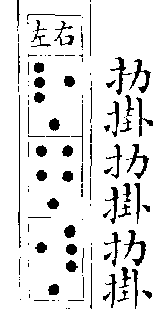
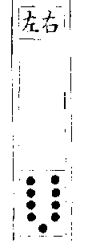
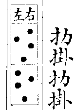
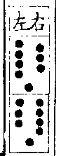
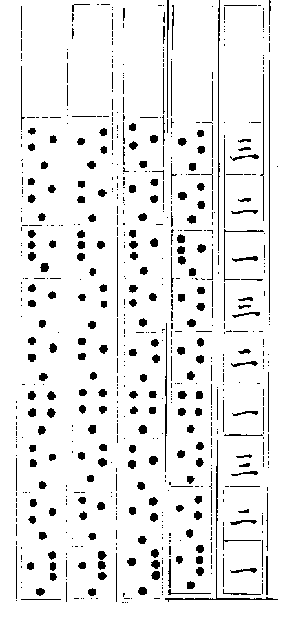
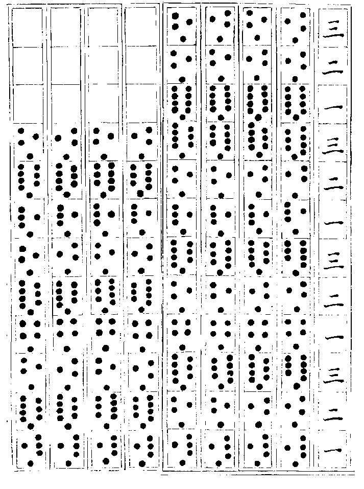
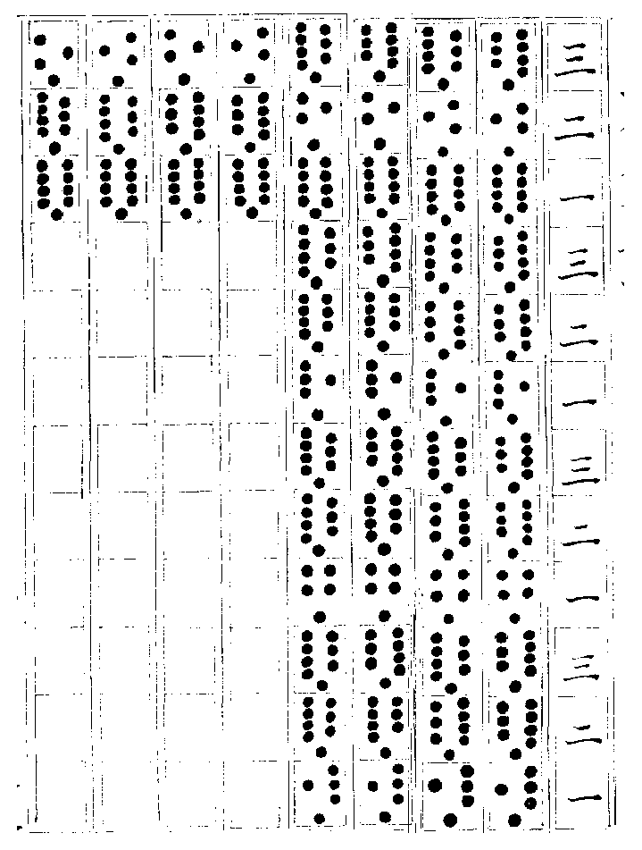
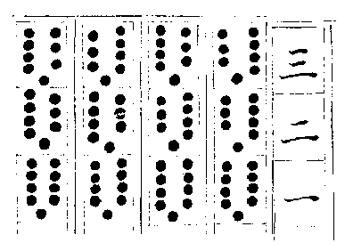

# 御纂周易折中 卷二十

## 明蓍策第三

<!-- Source: https://www.eee-learning.com/book/4715 -->
<!-- BEGIN SOURCE: eee-4715 -->
---

**明蓍策第三**

**大衍之數五十。**

**河圖、洛書之中數皆五，衍之而各極其數以至於十，則合為五十矣。河圖積數五十五，其五十者，皆因五而後得，獨五為五十所因，而自無所因，故虛之，則但為五十。又五十五之中，其四十者，分為陰陽老少之數，而其五與十者無所為，則又以五乘十，以十乘五，而亦皆為五十矣。洛書積數四十五，而其四十者，散佈於外，而分陰陽老少之數，唯五居中而無所為，則亦自含五數，而並為五十矣。**

【案】《洪範》曰：「卜五占用二，衍忒」，衍者，推衍也。忒者，過差也。卜筮所以推衍人事之過差，故揲蓍之法，謂之「大衍」。大音太，如太卜太筮之比，乃尊之之稱，非如先儒小衍大衍之說也。五十之數，說者不一，惟推本於圖書者得之。河圖之數則贏五，數之體也。洛書之數則虛五，數之用也。大衍者，其酌河洛之數之中，而兼體用之理之備者與。

**其用四十有九。**

**大衍之數五十，而蓍一根百莖，可當大衍之數者二。故揲蓍之法，取五十莖為一握，置其一不用，以象太極，而其當用之策，凡四十有九，蓋兩儀體具而未分之象也。**

【集說】

○　崔氏憬曰：「其用四十有九」者，法長陽七七之數也。六十四卦，既法長陰八八之數故。四十九蓍，則法長陽七七之數。蓍圓而神象天，卦方而智象地，陰陽之別也。捨一不用者，以象太極虛而不用也。

○　邵子曰：蓍之用數，掛一以象三，其餘四十八，則一卦之策也。四其十二為四十八也。十二去三而用九，四三十二，所去之策也，四九三十六，所用之策也。十二去五而用七，四五二十，所去之策也，四七二十八，所用之策也。十二去六而用六，四六二十四，所去之策也，四六二十四，所用之策也。十二去四而用八，四四十六，所去之策也，四八三十二，所用之策也。是故七九為陽，六八為陰。九者陽之極數，六者陰之極數，數極則反，故為卦之變也。

○　又曰：奇數極於四而五不用，策數極於九而十不用，故去五十而用四十九也。

**分而為二以象兩，掛一以象三，揲之以四，以象四時，歸奇於扐以象閏，五歲再閏，故再扐而後掛。**

**掛者，懸於小指之間。揲者，以大指食指間而別之。奇，謂餘數。扐者，扐於中三指之兩間也。蓍凡四十有九，信手中分，各置一手，以象兩儀。而掛右手一策於左手小指之間，以象三才，遂以四揲左手之策，以象四時。而歸其餘數於左手第四指間，以象閏。又以四揲右手之策，而再歸其餘數於左手第三指間，以象再閏**（五歲之象，掛一一也，揲左二也，扐左三也，揲右四也，扐右五也）**，是謂一變。其掛扐之數，不五即九。**

【案】河圖之中宮，太極也。洛書之中宮，人極也。故大衍之數，其虛一者，既以象太極之無為，其掛一者，又以象人極之參贊。虛一之後，繼以分二者，明乎分陰分陽，造化之本也。掛一之後，繼以揲四歸奇者，明乎定時成歲，人事之綱也。分二掛一，則天地設位，而人立焉，而三才之體具矣。揲四歸奇，則四氣交運，五行參差，百物生焉，萬事起焉，而三才之用行矣。大衍之數，所以為酌河洛之中，而兼體用之備者如此。

**得五者三，所謂奇也。**

五除掛一即四，以四約之為一，故為奇，即兩儀之陽數也。

**得九者一，所謂耦也。**

九除掛一即八，以四約之為二，故為耦，即兩儀之陰數也。

**一變之後，除前餘數，復合其見存之策，或四十，或四十四，分掛揲歸如前法，是謂再變。其掛扐者不四則八。**

****

**得四者二，所謂奇也。**

不去掛一，餘同前義。

****

**得八者二，所謂耦也。**

不去掛一，餘同前義。

**再變之後，除前兩次餘數，復合其見存之策，或四十，或三十六，或三十二，分掛揲歸如前法，是謂三變，其掛扐者如再變例。**

**三變既畢，乃合三變，視其掛肋之奇耦，以分所遇陰陽之老少，是謂一爻。**

---

****

**右三奇，為老陽者，凡十有二，掛扐之數十有三，除初掛之一為十有二，以四約而三分之，為一者三。一奇象圓而圍三，故三一之中各復有三。而積三三之數則為九，過揲之數三十有六，以四約之，亦得九焉。**

掛扐除一，四分四十有八而得其一也。一其十二而三其四也，九之母也。過揲之數四分四十八而得其三也，三其十二而九其四也，九之子也。皆徑一而圍三也。

**即四象太陽居一含九之數也**。

---

**右兩奇一耦，以耦為主，為少陰者凡二十有八，掛扐之數十有七，除初掛之一為十有六，以四約而三分之，為一者二，為二者一，一奇象圓而用其全，故二一之中各復有三。二耦象方而用其半，故一二之中復有二焉。而積二三一二之數則為八，過揲之數三十有二，以四約之亦得八焉。**

掛扐除一，四其四也，自一其十二者而進四也，八之母也，過揲之數，八其四也，自三其十二者而退四也，八之子也。

**即四象少陰居二含八之數也**。

---

**右兩耦一奇，以奇為主，為少陽者凡二十，掛扐之數二十有一，除初掛之一為二十，以四約而三分之，為二者二，為一者一，二耦象方而用其半，故二二之中各復有二。一奇象圓而用其全，故一三之中，復有三焉。而積二二一三之數則為七，過揲之數二十有八，以四約之亦得七焉。**

掛扐除一，五其四也，自兩其十二者而退四也，七之母也，過揲之數，七其四也，自兩其十二者而進四也，七之子也。

**即四象少陽居三含七之數也。**

---

**右三耦為老陰者四，掛扐之數二十有五，除初掛之一為二十有四，以四約而三分之，為二者三，二耦象方而用其半，故三二之中各復有二，而積三二之數則為六，過揲之數亦二十有四，以四約之亦得六焉。**

掛扐除一，六之母也，過揲之數，六之子也，四分四十有八而各得其二也，兩其十二而六其四也，皆圍四而用半也。

**即四象太陰居四含六之數也。**

【集說】

○　蔡氏元定曰：蓍之奇數，老陽十二，老陰四，少陽二十，少陰二十八，合六十有四。三十二為陽，老陽十二，少陽二十。三十二為陰，老陰四，少陰二十八。其十六則老陽老陰也，老陽十二，老陰四。其四十八則少陽少陰也，少陽二十，少陰二十八。老陽老陰，乾坤之象也，二八也。少陽少陰，六子之象也，六八也。

**凡此四者，皆以三變皆掛之法得之，蓋經曰「再扐而後掛」，又曰「四營而成易」，其指甚明。注疏雖不詳說，然劉禹錫所記僧一行、畢中和、顧彖之說，亦已備矣。近世諸儒，乃有前一變獨掛，後二變不掛之說，考之於經，乃為六扐而後掛，不應「五歲再閏」之義，且後兩變又止三營，蓋已誤矣。**

【集說】

○　胡氏方平曰：案王輔嗣注云：分而為二，一營也。掛一象三，二營也。揲之以四，三營也。歸奇於扐，四營也。孔穎達疏云：再扐而後掛者，旣分天於左手，地於右手，乃四四揲天之數，最末之餘歸之，合為掛扐之一處，是一扐也。又以四四揲地之數，最末之餘又合於前所歸之扐，而總扐之，是再扐而後掛也。劉禹錫〈辨易九六論〉云：畢中和之學，其傳原於一行禪師。一行唐開元時所作大衍曆本議云：綜盈虛之數，五歲而再閏，蓋其衍法皆以再扐而後掛也。畢中和有揲法，其言三揲皆掛，正合四營之義。朱子亦謂：畢氏揲法視疏義為詳，顧彖之說未詳，禹錫又自言揲法第一指餘一益三，餘二益二，餘三益一，餘四益四。第二指餘一益二，餘二益一，餘三益四，餘四益三。第三指與第二指同。此可以見三變皆掛矣。近世儒者若郭雍所著《蓍卦辨疑》，專以前一變獨掛，後二變不掛，其載橫渠先生之言曰：再扐而後掛，毎成一爻而後掛也。謂第二第三揲不掛也。且謂：橫渠之言所以明注疏之失。朱子辨之曰：此說大誤，恐非橫渠之言也。再扐者，一變之中，左右再揲而再扐也。一掛再揲再扐而當五歲，蓋一掛再揲，當其不閏之年，而再扐當其再閏之歲也。而後掛者，一變既成，又合見存之策分二掛一，以起後變之端也。今曰第一變掛而第二第三變不掛，遂以當掛之變為掛而象閏，以不掛之變為扐而當不閏之歲，則與《大傳》所云掛一象三，再扐象閏者全不相應矣。且不數第一變之再扐而以第二第三變為再扐，又使第二第三變中止有三營而不足乎成易之數。且於陰陽老少之數，亦多有不合者。其載伊川先生之說曰：再以左右手分而為二，更不重掛奇。朱子辨之曰：此說尤多可疑，然郭氏云本無文字，則其傳授之際，不無差舛宜矣。郭氏又云：第二第三揲雖不掛，亦有四八之變，蓋不必掛也。朱子辨之曰：所以不可不掛者，有兩說。蓋三變之中，前一變屬陽，故其餘五九皆奇數。後二變屬陰，故其餘四八皆耦數。屬陽者為陽三而陰一，皆圍三徑一之術。屬陰者為陰二而陽二，皆以圍四用半之術也。是皆以三變皆掛之法得之，後兩變不掛則不得也。三變之後，其可為老陽者十二，可為老陰者四。可為少陰者二十八，可為少陽者二十。雖多寡之不同，而皆有法象。是亦以三變皆掛之法得之，而後兩變不掛則不得也。郭氏僅見第二第三變可以不掛之一端耳，而遂執以為說。夫豈知其掛與不掛之為得失乃如此哉。大抵郭氏他說偏滯雖多，而其為法尚無甚戾，獨此一義所差雖小，而深有害於成卦變爻之法，尤不可不辯。愚嘗考之，第一變獨掛後二變不掛，非特為六扐而後掛，三營而成易，於再扐四營之義不協，且後二變不掛，其數雖亦不四則八，而所以為四八者實有不同。蓋掛則所謂四者左手餘一則右手餘二，左手餘二則右手餘一。不掛則左手餘一，右手餘三。左手餘二，右手餘二。左手餘三，右手餘一。此四之所以不同也。掛則所謂八者，左手餘四，右手餘三。左手餘三，右手餘四。不掛則左手餘四，右手亦餘四。此八之所以不同也。三變之後，陰陽變數皆參差不齊，無復自然之法象矣。

**且用舊法，則三變之中，又以前一變為奇，後二變為耦。奇故其餘五九，耦故其餘四八。餘五九者，五三而九一，亦圍三徑一之義也。餘四八者，四八皆二，亦圍四用半之義也。三變之後，老者陽饒而陰乏，少者陽少而陰多，亦皆有自然之法象焉。**

蔡元定曰：案五十之蓍虛一，分二掛一揲四，為奇者三，為耦者二，是天三地二自然之數。而三揲之變。老陽老陰之數，本皆八合之得十六，陰陽以老為動，而陰性本靜，故以四歸於老陽，此老陰之數所以四，老陽之數所以十二也。少陽少陰之數本皆二十四，合之四十八。陰陽以少為靜，而陽性本動，故以四歸於少陰。此少陽之數所以二十，而少陰之數所以二十八也。陽用老而不用少，故六十四變所用者十六變。又以四約之，陽用其三，陰用其一，蓋一奇一耦對待者，陰陽之體。陽三陰一，一饒一乏者，陰陽之用，故四時春夏秋生物，而冬不生物，天地東西南可見，而北不可見。人之瞻視亦前與左右可見，而背不可見也。不然，則以四十九蓍虛一，分二掛一揲四，則為奇者二為耦者二，而老陽得八，老陰得八。少陽得二十四，少陰得二十四，不亦善乎。聖人之智豈不及此，而其取此而不取彼者，誠以陰陽之體數常均，用數則陽三而陰一也。

【集說】

○　蘇氏軾曰：唐一行之學，以為三變皆少，則乾之象也。乾所以為老陽，而四數其揲得九，故以九名之。三變皆多，則坤之象也，坤所以為老陰，而四數其揲得六，故以六名之。三變而少者一，則震坎艮之象也，震坎艮所以為少陽，而四數其揲得七，故以七名之。三變而多者一，則巽離兌之象也，巽離兌所以為少陰，而四數其揲得八，故以八名之。故七八九六者，因揲數以名陰陽，而陰陽之所以為老少者，不在乎是，而在乎三變之間，八卦之象也。此唐一行之學也。

○　《朱子文集》曰：初一變得五者三，得九者一，故曰餘五九者，五三而九一。後二變得四者二，得八者二，故曰餘四八者，四八皆二。三變之後，為老陽者十有二，老陰四，故曰陽饒而陰乏，少陽二十，少陰二十八，故曰陽少而陰多。沈氏《筆談》云：易象九為老陽，七為少陽，八為少陰，六為老陰，其九七八六之數，皆有所從來，得之自然，非意之所配也。凡歸餘之數，有多有少，多為陰，如爻之耦。少為陽，如爻之奇。三少，乾也，故曰老陽，九揲而得之，故其數九，其策三十六。兩多一少，則一少為之主，震坎艮也，故皆謂之少陽，少在初為震，中為坎，末為艮，皆七揲而得之，故其數七，其策二十有八。三多，坤也，故曰老陰，六揲而得之，故其數六，其策二十有四。兩少一多，則一多為之主，巽離兌也，故皆謂之少陰，多在初謂之巽，中為離，末為兌，皆八揲而得之，故其數八，其策三十有二。諸家揲蓍說，惟《筆談》簡而盡。孔穎達非不曉揲法者，但為之不熟，故其言之易差，然其於大數亦不差也。畢中和視疏義為詳，柳子厚詆劉夢得以為膚末於學者，誤矣！畢論三揲皆掛一，正合四營之義，惟以三揲之掛扐分措於三指間為小誤，然於其大數亦不差也。其言餘一益三之屬，乃夢得立文太簡之誤，使讀者疑其不出於自然，而出於人意耳。此與孔氏之說，不可不正，然恐亦不可不原其情也。蔡氏所謂以四十九蓍虛一分二掛一揲四者，蓋謂虛一外，止用四十八。分掛揲之餘，為奇耦各二，老陽老陰變數各八，少陰少陽變數各二十四，合為六十四，八卦各得八焉，然此乃奇耦對待加倍而得者，體數也。若天三地二，衍而為五十者，用數也，蓋體數常均，用數則陽饒而陰乏也。此正造化之妙。若陰陽同科，老少一例，是體數，非用數也。

**若用近世之法，則三變之餘，皆為圍三徑一之義，而無復奇耦之分。三變之後，為老陽少陰者皆二十七，為少陽者九，為老陰者一，又皆參差不齊，而無復自然之法象，此足以見其說之誤矣。至於陰陽老少之所以然者，則請復得而通論之。蓋四十九策，除初掛之一而為四十八，以四約之為十二，以十二約之為四，故其揲之一變也。掛扐之數一其四者為奇，兩其四者為耦，其三變也。掛扐之數三其四，一其十二，而過揲之數九其四，三其十二者，為老陽。掛扐過揲之數皆六其四，兩其十二者為老陰，自老陽之掛扐而增一四則是四其四也，一其十二而又進一四也。自其過揲者而損一四則是八其四也，三其十二而損一四也，此所謂少陰者也。自老陰之掛扐而損一四，則是五其四也，兩其十二而去一四也，自其過揲而增一四則是七其四也，兩其十一而進一四也，此所謂少陽者也。二老者陰陽之極也，二極之間，相距之數凡十有二，而三分之，自陽之極而進其掛扐退其過揲各至於三之一則為少陰，自陰之極而退其掛扐進其過揲各至於三之一則為少陽。老陽居一而含九，故其掛扐十二為最少，而過揲三十六為最多。少陰居二而含八，故其掛扐十六為次少，而過揲三十二為次多。少陽居三而含七，故其掛扐二十為稍多，而過揲二十八為稍少。老陰居四而含六，故其掛扐二十四為極多，而過揲亦二十四為極少，蓋陽奇而陰耦，是以掛扐之數，老陽極少，老陰極多，而二少者一進一退而交於中焉，此其以少為貴者也。陽實而陰虛，是以過揲之數，老陽極多，老陰極少，而二少者亦一進一退而交於中焉，此其以多為貴者也。凡此不唯陰之與陽，既為二物，而迭為消長，而其一物之中，此二端者，又各自為一物，而迭為消長，其相與低昻，如權衡。其相與判合，如符契。固有非人之私智所能取舍而有無者，而況掛扐之數乃七八九六之原，而過揲之數乃七八九六之委。其勢又有輕重之不同，而或者乃欲廢置掛扐而獨以過揲之數為斷，則是舍本而取末，去約以就繁，而不知其不可也，豈不誤哉。**

**【集說】**

○　歸氏有光曰：九具於揲，則三奇見於餘。六具於揲，則三耦見於餘。七具於揲，則二耦一奇見於餘。八具於揲，則二奇一耦見於餘。不必反觀其在揲之數，而已舉其要矣。其曰「乾之策二百一十有六，坤之策百四十有四」「二篇之策萬有一千五百二十」，何也？掛扐雖舉其要，而七八九六之數，仍以在揲之策為正，七八九六者，自揲之以四而取也，若掛扐之策，因過揲而見者也。故曰「揲之以四以象四時」，又曰「當期之日」，而歸奇以象閏。

○　何氏楷曰：案翼言「揲四以象四時，歸奇以象閏」。四時，正也，閏餘也。下文云：「乾之策二百一十有六，坤之策百四十有四。凡三百有六十，當期之日，二篇之策，萬有一千五百二十，當萬物之數也。」皆以七八九六起數，明乎用正數而不用餘數矣。

【案】歸氏何氏之說，亦可與朱子相參酌。

**邵子曰：五與四四，去掛一之數，則四三十二也。九與八八，去掛一之數，則四六二十四也。五與八八，九與四八，去掛一之數，則四五二十也。九與四四，五與四八，去掛一之數，則四四十六也。故去其三四五六之數，以成九八七六之策，此之謂也。一爻已成，再合四十九策，復分掛揲歸以成一變，每三變而成一爻，並如前法。**

**乾之策，二百一十有六。坤之策，百四十有四，凡三百有六十，當期之日。**

**乾之策二百一十有六者，積六爻之策各三十六而得之也。坤之策百四十有四者，積六爻之策各二十有四而得之也。凡三百六十者，合二百一十有六，百四十有四而得之也。當期之日者，毎月三十日，合十二月為三百六十也。蓋以氣言之，則有三百六十六日。以朔言之，則有三百五十四日。今舉氣盈朔虛之中數而言，故曰三百有六十也。然少陽之策二十八，積乾六爻之策則一百六十八。少陰之策三十二，積坤六爻之策則一百九十二。此獨以老陰陽之策為言者。以易用九六不用七八也。然二少之合，亦三百有六十。**

**二篇之策，萬有一千五百二十，當萬物之數也。**

**二篇者，上下經六十四卦也。其陽爻百九十二，每爻各三十六策，積之得六千九百一十二。陰爻百九十二，每爻二十四策，積之得四千六百八，又合二者，為萬有一千五百二十也。若為少陽，則每爻二十八策，凡五千三百七十六。少陰則每爻三十二策，凡六千一百四十四，合之亦為萬一千五百二十也。**

**是故四營而成易，十有八變而成卦，八卦而小成。引而伸之，觸類而長之，天下之能事畢矣。**

**四營者，四次經營也。分二者，第一營也****。****掛一者，第二營也****。****揲四者，第三營也****。****歸奇者，第四營也****。****易，變易也，謂揲之一變也****。****四營成變，三變成爻。一變而得兩儀之象，再變而得四象之象，二變而得八卦之象。一爻而得兩儀之畫，二爻而得四象之畫，三爻而得八卦之畫，四爻成而得其十六者之一，五爻成而得其三十二者之一，至於積七十二營而成十有八變，則六爻見，而得乎六十四卦之一矣。然方其三十六營而九變也，已得三畫，而八卦之名可見，則內卦之為貞者立矣，此所謂「八卦而小成」者也。自是而往，引而伸之，又三十六營九變以成三畫，而再得小成之卦者一，則外卦之為悔者亦備矣。六爻成，內外卦備，六十四卦之別可見，然後視其爻之變與不變，而觸類以長焉，則天下之事，其吉凶悔吝，皆不越乎此矣。**

**顯道神德行，是故可與酬酢，可與祐神矣。**

**道因辭顯，行以數神。酬酢者，言幽明之相應，如賓主之相交也。祐神者，言有以祐助神化之功也。**

**卷內蔡氏說，為奇者三，為耦者二，蓋凡初揲，左手餘一餘二餘三皆為奇，餘四為耦。至再揲三揲，則餘三者亦為耦，故曰奇二而耦二也。**
<!-- END SOURCE: eee-4715 -->

## 考變占第四

<!-- Source: https://www.eee-learning.com/book/4716 -->
<!-- BEGIN SOURCE: eee-4716 -->
---

**考變占第四**

**乾卦用九「見群龍无首，吉」《象》曰：「用九天德，不可為首也。 」坤卦用六「利永貞」《象》曰：「用六永貞，以大終也。」**

**用九用六者，變卦之凡例也。言凡陽爻皆用九而不用七，陰爻皆用六而不用八。用九故老陽變為少陰，用六故老陰變為少陽。不用七八，故少陽少陰不變。獨於乾坤二卦言之者，以其在諸卦之首，又為純陽純陰之卦也。聖人因繫以辭，使遇乾而六爻皆九，遇坤而六爻皆六者，即此而占之。蓋羣龍无首則陽皆變陰之象，利永貞則陰皆變陽之義也。餘見六爻變例。**

歐陽子曰：乾坤之用九用六何謂也？曰：乾爻七九，坤爻八六，九六變而七八無為。易道占其變，故以其所占者名爻，不謂六爻皆九六也。及其筮也，七八常多，而九六常少，有無九六者焉，此不可以不釋也。六十四卦皆然，特於乾坤見之，則餘可知耳。

○　愚案：此說發明先儒所未到，最為有功。其論七八多而九六少，又見當時占法，三變皆掛，如一行說。

**凡卦六爻皆不變，則占本卦彖辭，而以內卦為貞，外卦為悔。**

彖辭為卦下之辭，孔成子筮立衛公子元，遇屯，曰「利建侯」。秦伯伐晉筮之遇蠱，曰貞風也，其悔山也。

**一爻變，則以本卦變爻辭占。**

沙隨程氏曰：畢萬遇屯之比，初九變也。蔡墨遇乾之同人，九二變也。晉文公遇大有之睽，九三變也。陳敬仲遇觀之否，六四變也。南蒯遇坤之比，六五變也。晉獻公遇歸妹之睽，上六變也。

【集說】

○　胡氏一桂曰：《啓蒙》謂一爻變，則以本卦變爻辭占，其下引畢萬所筮，以今觀之，未嘗不取之卦，且不特論一爻，兼取貞悔卦體，似可為占者法也，觀陳宣公筮公子完之生，尤可見矣。

**二爻變，則以本卦二變爻辭占，仍以上爻為主。**

經傳無文，今以例推之，當如此。

【集說】

○　胡氏一桂曰：案陳摶為宋太祖占，亦旁及諸爻與卦體。

**三爻變，則占本卦及之卦之彖辭，而以本卦為貞，之卦為悔，前十卦主貞，後十卦主悔。**

凡三爻變者，通二十卦，有圖在後。

○　沙隨程氏曰：晉公子重耳筮得國，遇屯悔豫皆八，蓋初與四五凡三爻變也，初與五用九變，四用六變。其不變者二三上，在兩卦皆為八，故云皆八，而司空季子占之曰「皆利建侯。」

【集說】

○　胡氏一桂曰：案《啓蒙》但云占本卦之卦彖辭，然以晉侯屯豫之占，則并占卦體可見。

○　熊氏朋來曰：七八皆不變爻，何以罕言七而專言八。曰：七七，蓍數也，八八，卦數也。

**四爻變，則以之卦二不變爻占，仍以下爻為主。**

經傳亦無文，今以例推之，當如此。

**五爻變，則以之卦不變爻占。**

穆姜往東宮，筮遇艮之八，史曰「是謂艮之隨」，蓋五爻皆變，唯二得八，故不變也。法宜以「係小子失丈夫」為占，而史妄引《隨》之彖辭以對，則非也。

**六爻變，則乾坤占二用，餘卦占之卦彖辭。**

蔡墨曰：「乾之坤曰見群龍无首吉」是也，然「群龍无首」，即坤之牝馬先迷也，坤之利永貞，即乾之不言所利也。

**於是一卦可變六十四卦，而四千九十六卦在其中矣，所謂「引而伸之，觸類而長之，天下之能事畢矣」，豈不信哉。今以六十四卦之變，列為三十二圖，最初卦者，自初而終，自上而下，得末卦者，自終而初，自下而上。變在第三十二卦以前者，占本卦爻之辭，變在第三十二卦以後者，占變卦爻之辭。**

凡言初終上下者，據圖而言，言第幾卦前後者，從本卦起。
<!-- END SOURCE: eee-4716 -->

## 六十四卦相變圖

<!-- Source: https://www.eee-learning.com/book/4717 -->
<!-- BEGIN SOURCE: eee-4717 -->
---

乾

姤　同人　履　　小畜　大有　夬

遯　訟　　巽　　鼎　　大過

无妄　家人　離　　革

中孚　睽　　兌

大畜　需　　大壯

否　漸　　旅　　咸

渙　　未濟　困

蠱　　井　　恒

益　　噬嗑　隨

賁　　既濟　豐

損　　節　　歸妹　泰

觀　晉　　萃

艮　　蹇　　小過

蒙　　坎　　解　　升

頤　　屯　　震　　明夷　臨

剝　比　　豫　　謙　　師　　復

坤

---

姤

乾　　遯　訟　巽　　鼎　大過

同人　履　小畜大有　夬

否　漸　　旅　　咸

渙　未濟　困

蠱　井　　恒

无妄　家人　離　　革

中孚　睽　　兌

大畜　需　　大壯

觀　　晉　　萃

艮　　蹇　小過

蒙　　坎　　解　升

益　　噬嗑　隨

賁　　既濟　豐

損　　節　　歸妹　泰

剝　　比　　豫　　謙　　師

頤　　屯　　震　　明夷　臨　　坤

復

---

同人

遯　　乾　　无妄　家人　離　　革

姤　　否　　漸　　旅　　咸

履　　小畜　大有　夬

益　　噬嗑　隨

賁　　既濟　豐

訟　　巽　　鼎　　大過

觀　　晉　　萃

艮　　蹇　小過

中孚　睽　　兌

大畜　需　　大壯

頤　　屯　　震　　明夷

渙　　未濟　困

蠱　　井　　恒

剝　　比　　豫　　謙

損　　節　　歸妹　泰　　復

蒙　　坎　　解　　升　　坤　　臨

師

---

履

訟　　无妄　乾　中孚　睽　　兌

否　　姤　　渙　未濟　困

同人　益　　噬嗑　隨

小畜　大有　夬

損　　節　　歸妹

遯　　觀　　晉　　萃

巽　　鼎　　大過

蒙　　坎　　解

　　　　家人　離　　革

頤　　屯　　震

大畜　需　　大壯　臨

漸　　旅　　咸

剝　　比　　豫

蠱　　井　　恒　　師

賁　　既濟　豐　　復　泰

艮　　蹇　　小過　坤　　升　明夷

謙

---

小畜

巽　　家人　中孚　乾　大畜　需

漸　　渙　　姤　　蠱　井

益　　同人　賁　　既濟

履　　損　　節

大有　夬　　泰

觀　　遯　　艮　　蹇

訟　　蒙　　坎

鼎　　大過　升

无妄　頤　　屯

　　　　　　　　離　　革　明夷

睽　　兌　　臨　大壯

否　　剝　　比

旅　　咸　　謙

未濟　困　　師　恒

噬嗑　隨　　復　豐　歸妹

晉　　萃　　坤　　小過解　震

豫

---

大有

鼎　離　睽　大畜乾　大壯

旅　未濟蠱　姤　恒

噬嗑賁　同人豐

損　履　歸妹

小畜　泰　夬

晉　艮　　遯　　小過

蒙　　訟　　解

巽　　升　　大過

頤　　无妄　震

　　　　　　　家人　明夷　革

中孚　臨　　兌　　需

剝　否　豫

漸　謙　　咸

渙　師　　困　井

益　　復　隨　既濟　節

觀　坤　　萃　蹇　坎　　屯

比

---

夬

大過　革　兌　需　大壯　乾

咸　　困　井　恒　姤

隨　既濟豐　同人

節　歸妹　履

泰　小畜大有

萃　　蹇　小過遯

坎　解　訟

升　巽　　鼎

屯　震　无妄

明夷家人　離

臨　中孚睽　　大畜

比　　豫　否

謙　漸　旅

師　渙　未濟蠱

復　益　噬嗑賁　損

坤　　觀　晉　艮　蒙　頤

剝

---

遯

同人　姤　否　漸　旅　　咸

乾　　无妄家人離　革

訟　巽　鼎　大過

觀　晉　萃

艮　蹇　小過

履　　小畜大有　夬

益　噬嗑　隨

賁　　既濟　豐

渙　未濟　困

蠱　　井　　恒

剝　比　　豫　　謙

中孚　睽　　兌

大畜　需　　大壯

頤　　屯　　震　　明夷

蒙　　坎　　解　　升　坤

損　　節　　歸妹　泰　　復　師

臨

---

訟

履　　否　　姤　　渙　　未濟　困

无妄　乾　　中孚　睽　　兌

遯　　觀　　晉　　萃

巽　　鼎　　大過

蒙　　坎　　解

同人　益　　噬嗑　隨

小畜　大有　夬

損　　節　　歸妹

漸　　旅　　咸

剝　　比　　豫

蠱　　井　　恒　　師

家人　離　　革

頤　　屯　　震

大畜　需　　大壯　臨

艮　　蹇　　小過　坤　　升

賁　　既濟　豐　　復　　泰　　謙

明夷

---

巽

小畜　漸　　渙　　姤　　蠱　井

家人　中孚　乾　　大畜　需

觀　　遯　　艮　　蹇

訟　　蒙　　坎

鼎　　大過　升

益　　同人　賁　　既濟

履　　損　　節

大有　夬　　泰

否　　剝　　比

旅　　咸　　謙

未濟　困　　師　　恒

无妄　頤　　屯

　　　　離　　革　　明夷

睽　　兌　　臨　　大壯

晉　　萃　　坤　　小過解

噬嗑　隨　　復　　豐　　歸妹豫

震

---

鼎

大有　旅　　未濟　蠱　　姤　恒

離　　睽　　大畜　乾　　大壯

晉　　艮　　遯　　小過

蒙　　訟　　解

巽　　升　　大過

噬嗑　賁　　同人　豐

損　　履　　歸妹

小畜　泰　　夬

剝　　否　　豫

漸　　謙　　咸

渙　　師　　困　井

頤　　无妄　震

　　　　家人　明夷　革

中孚　臨　　兌　　需

觀　　坤　　萃　　蹇　坎

益　　復　　隨　　既濟　節　比

屯

---

大過

夬　　咸　　困　　井　恒　姤

革　　兌　　需　　大壯乾

萃　　蹇　　小過遯

坎　　解　　訟

升　　巽　　鼎

隨　　既濟　豐　　同人

節　　歸妹　履

泰　　小畜大有

比　　豫　　否

謙　　漸　　旅

師　　渙　　未濟蠱

屯　　震　　无妄

明夷　家人　離

臨　　中孚　睽　　大畜

坤　　觀　　晉　　艮　　蒙

復　　益　　噬嗑　賁　　損　　剝

頤

---

无妄

否　　履　　同人　益　　噬嗑　隨

訟　　遯　　觀　　晉　　萃

乾　　中孚　睽　　兌

家人　離　　革

頤　　屯　　震

姤　　渙　　未濟　困

漸　　旅　　咸

剝　　比　　豫

小畜　大有　夬

損　　節　　歸妹

賁　　既濟　豐　　復

巽　　鼎　　大過

蒙　　坎　　解

艮　　蹇　　小過　坤

大畜　需　　大壯　臨　　明夷

蠱　　井　　恒　　師　　謙　　泰

升

---

家人

漸　　小畜　益　　同人　賁　　既濟

巽　　觀　　遯　　艮　　蹇

中孚　乾　　大畜　需

无妄　頤　　屯

　　　　離　　革　　明夷

渙　　姤　　蠱　　井

否　　剝　　比

旅　　咸　　謙

履　　損　　節

大有　夬　　泰

噬嗑　隨　　復　　豐

訟　　蒙　　坎

鼎　　大過　升

晉　　萃　　坤　　小過

睽　　兌　　臨　　大壯震

未濟　困　　師　　恒　　豫　歸妹

解

---

離

旅　　大有　噬嗑賁　同人豐

鼎　　晉　　艮　遯　小過

睽　　大畜乾　大壯

頤　　无妄震

　　　　家人　明夷革

未濟　蠱　　姤　恒

剝　　否　豫

漸　謙　　咸

損　　節　　歸妹

小畜　大有　夬

益　　復　　隨　　既濟

蒙　　訟　　解

巽　　升　　大過

觀　　坤　　萃　　蹇

中孚　臨　　兌　　需　　屯

渙　　師　　困　　井　　比　　節

坎

---

革

咸　　夬　　隨　　既濟　豐　　同人

大過　萃　　蹇　　小過　遯

兌　　需　　大壯　乾

屯　　震　　无妄

明夷　家人　離

困　　井　　恒　　姤

比　　豫　　否

謙　　漸　　旅

節　　歸妹　履

泰　　小畜　大有

復　　益　　噬嗑　賁

坎　　解　　訟

升　　巽　　鼎

坤　　觀　　晉　　艮

臨　　中孚　睽　　大畜　頤

師　　渙　　未濟　蠱　　剝　　損

蒙

---

中孚

渙　　益　　小畜　履　　損　　節

觀　　巽　　訟　　蒙　　坎

家人　无妄　頤　　屯

乾　　大畜　需

睽　　兌　　臨

漸　　否　　剝　　比

姤　　蠱　　井

未濟　困　　師

同人　賁　　既濟

噬嗑　隨　　復

大有　夬　　泰　歸妹

遯　　艮　　蹇

晉　　萃　　坤

鼎　　大過　升　　解

離　　革　　明夷　震　　大壯

旅　　咸　　謙　　豫　　恒　　豐

小過

---

睽

未濟　噬嗑　大有　損　　履　　歸妹

晉　　鼎　　蒙　　訟　　解

離　　頤　　无妄　震

大畜　乾　　大壯

中孚　臨　　兌

旅　　剝　　否　　豫

蠱　　姤　　恒

渙　　師　　困

賁　　同人　豐

益　　復　　隨

小畜　泰　　夬　　節

艮　　遯　　小過

觀　　坤　　萃

巽　　升　　大過　坎

家人　明夷　革　　屯　　需

漸　　謙　　咸　　比　　井　　既濟

蹇

---

兌

困　　隨　　夬　　節　　歸妹　履

萃　　大過　坎　　解　　訟

革　　屯　　震　　无妄

需　　大壯　乾

臨　　中孚　睽

咸　　比　　豫　　否

井　　恒　　姤

師　　渙　　未濟

既濟　豐　　同人

復　　益　　噬嗑

泰　　小畜　大有　損

蹇　　小過　遯

坤　　觀　　晉

升　　巽　　鼎　　蒙

明夷　家人　離　　頤　　大畜

謙　　漸　　旅　　剝　　蠱　　賁

艮

---

大畜

蠱　　賁　　損　　大有　小畜　泰

艮　　蒙　　鼎　　巽　　升

頤　　離　　家人　明夷

睽　　中孚　臨

乾　　大壯　需

剝　　旅　　漸　　謙

未濟　渙　　師

姤　　恒　　井

噬嗑　益　　復

同人　豐　　既濟

履　　歸妹　節　　夬

晉　　觀　　坤

遯　　小過　蹇

訟　　解　　坎　　大過

无妄　震　　屯　　革　　兌

否　　豫　　比　　咸　　困　　隨

萃

---

需

井　　既濟　節　　夬　　泰　　小畜

蹇　　坎　　大過　升　　巽

屯　　革　　明夷　家人

兌　　臨　　中孚

大壯　乾　　大畜

比　　咸　　謙　　漸

困　　師　　渙

恒　　姤　　蠱

隨　　復　　益

豐　　同人　賁

歸妹　履　　損　大有

萃　　坤　　觀

小過　遯　　艮

解　　訟　　蒙　　鼎

震　　无妄　頤　　離　　睽

豫　　否　　剝　　旅　　未濟　噬嗑

晉

---

大壯

恒　　豐　　歸妹　泰　　夬　　大有

小過　解　　升　　大過　鼎

震　　明夷　革　　離

臨　　兌　　睽

需　　大畜　乾

豫　　謙　　咸　　旅

師　　困　　未濟

井　　蠱　　姤

復　　隨　　噬嗑

既濟　賁　　同人

節　　損　　履　　小畜

坤　　萃　　晉

蹇　　艮　　遯

坎　　蒙　　訟　　巽

屯　　頤　　无妄　家人　中孚

比　　剝　　否　　漸　　渙　　益

觀

---

否

无妄　訟　　遯　　觀　　晉　　萃

履　　同人　益　　噬嗑　隨

姤　　渙　　未濟　困

漸　　旅　　咸

剝　　比　　豫

乾　　中孚　睽　　兌

家人　離　　革

頤　　屯　　震

巽　　鼎　　大過

蒙　　坎　　解

艮　　蹇　　小過　坤

小畜　大有　夬

損　　節　　歸妹

賁　　既濟　豐　　復

蠱　　井　　恒　　師　　謙

大畜　需　　大壯　臨　　明夷　升

泰

---

漸

家人　巽　　觀　　遯　　艮　　蹇

小畜　益　　同人　賁　　既濟

渙　　姤　　蠱　　井

否　　剝　　比

旅　　咸　　謙

中孚　乾　　大畜　需

无妄　頤　　屯

　　　　　　　　離　　革　　明夷

訟　　蒙　　坎

鼎　　大過　升

晉　　萃　　坤　　小過

履　　損　　節

大有　夬　　泰

噬嗑　隨　　復　　豐

未濟　困　　師　　恒　　豫

睽　　兌　　臨　　大壯　震　　解

歸妹

---

旅

離　　鼎　　晉　　艮　　遯　　小過

大有　噬嗑　賁　　同人　豐

未濟　蠱　　姤　恒

剝　　否　　豫

漸　　謙　　咸

睽　　大畜　乾　　大壯

頤　　无妄　震

　　　　　　　　家人　明夷　革

蒙　　訟　　解

巽　　升　　大過

觀　　坤　　萃　　蹇

損　　履　　歸妹

小畜　泰　　夬

益　　復　　隨　　既濟

渙　　師　　困　　井　　比

中孚　臨　　兌　　需　　屯　　坎

節

---

咸

革　　大過　萃　　蹇　　小過　遯

夬　　隨　　既濟　豐　　同人

困　　井　　恒　　姤

比　　豫　　否

謙　　漸　　旅

兌　　需　　大壯　乾

屯　　震　　无妄

明夷　家人　離

坎　　解　　訟

升　　巽　　鼎

坤　　觀　　晉　　艮

節　　歸妹　履

泰　　小畜　大有

復　　益　　噬嗑　賁

師　　渙　　未濟　蠱　　剝

臨　　中孚　睽　　大畜　頤　　蒙

損

---

渙

中孚　觀　　巽　　訟　　蒙　　坎

益　　小畜　履　　損　　節

漸　　否　　剝　　比

姤　　蠱　　井

未濟　困　　師

家人　无妄　頤　　屯

　　　　乾　　大畜　需

睽　　兌　　臨

遯　　艮　　蹇

晉　　萃　　坤

鼎　　大過　升　　解

同人　賁　　既濟

噬嗑　隨　　復

大有　夬　　泰　　歸妹

旅　　咸　　謙　　豫　　恒

離　　革　　明夷　震　　大壯　小過

豐

---

未濟

睽　　晉　　鼎　　蒙　　訟　　解

噬嗑　大有　損　　履　　歸妹

旅　　剝　　否　　豫

蠱　　姤　　恒

渙　　師　　困

離　　頤　　无妄　震

大畜　乾　　大壯

中孚　臨　　兌

艮　　遯　　小過

觀　　坤　　萃

巽　　升　　大過　坎

賁　　同人　豐

益　　復　　隨

小畜　泰　　夬　　節

漸　　謙　　咸　　比　　井

家人　明夷　革　　屯　　需　　蹇

既濟

---

困

兌　　萃　　大過　坎　　解　　訟

隨　　夬　　節　　歸妹　履

咸　　比　　豫　　否

井　　恒　　姤

師　　渙　　未濟

革　　屯　　震　　无妄

需　　大壯　乾

臨　　中孚　睽

蹇　　小過　遯

坤　　觀　　晉

升　　巽　　鼎　　蒙

既濟　豐　　同人

復　　益　　噬嗑

泰　　小畜　大有　損

謙　　漸　　旅　　剝　　蠱

明夷　家人　離　　頤　　大畜　艮

賁

---

蠱

大畜　艮　　蒙　　鼎　　巽　　升

賁　　損　　大有　小畜　泰

剝　　旅　　漸　　謙

未濟　渙　　師

姤　　恒　　井

頤　　離　　家人　明夷

睽　　中孚　臨

乾　　大壯　需

晉　　觀　　坤

遯　　小過　蹇

訟　　解　　坎　　大過

噬嗑　益　　復

同人　豐　　既濟

履　　歸妹　節　　夬

否　　豫　　比　　咸　　困

无妄　震　　屯　　革　　兌　　萃

隨

---

井

需　　蹇　　坎　　大過　升　　巽

既濟　節　　夬　　泰　　小畜

比　　咸　　謙　　漸

困　　師　　渙

恒　　姤　　蠱

屯　　革　　明夷　家人

兌　　臨　　中孚

大壯　乾　　大畜

萃　　坤　　觀

小過　遯　　艮

解　　訟　　蒙　　鼎

隨　　復　　益

豐　　同人　賁

歸妹　履　　損　　大有

豫　　否　　剝　　旅　　未濟

震　　无妄　頤　　離　　睽　　晉

噬嗑

---

恒

大壯　小過　解　　升　　大過　鼎

豐　　歸妹　泰　　夬　　大有

豫　　謙　　咸　　旅

師　　困　　未濟

井　　蠱　　姤

震　　明夷　革　　離

臨　　兌　　睽

需　　大畜　乾

坤　　萃　　晉

蹇　　艮　　遯

坎　　蒙　　訟　　巽

復　　隨　　噬嗑

既濟　賁　　同人

節　　損　　履　　小畜

比　　剝　　否　　漸　　渙

屯　　頤　　无妄　家人　中孚　觀

益

---

**以上三十二圖，反復之則為六十四圖。圖以一卦為主，而各具六十四卦，凡四千九十六卦，與焦贛《易林》合。然其條理精密，則有先儒所未發者，覽者詳之。**

【集說】

○　胡氏一桂曰：焦延壽卦變法以一卦變為六十四卦，六十四卦通變四千九十六卦。而卦變之次，本之文王序卦，且如以乾為本卦，其變首坤，次屯、蒙，以至未濟，又如以末一卦未濟為本卦，其變亦首乾，次坤、屯，以至既濟，每一卦變六十三卦，通本卦成六十四卦。紫陽夫子以爻變多寡，順而列之，以定一卦所變之序，又以乾卦所變之次，引而伸之，為六十四卦所變相承之序，然後次第秩然，各得其所。雖出於焦，而比焦尤密。

【案】朱子三十二圖，其次第最為詳密，而後學之疑義有二：一曰筮法用九、六，不用七、八，今四爻五爻變者，用之卦之不變爻占，則是兼用七、八也。二曰周公未繫爻之先，則彖辭之用，有所不周也。三代筮法，既不盡傳，今惟以經傳為據而推之，則用九、用六，經文甚明，而用七、八者，諸書皆無明文，惟杜預以為夏商用之，先儒已摘其非矣。考之《春秋》內外傳，蓋無論變與不變，及變之多寡，皆論卦之體象與其彖辭。即一爻變者，雖占爻辭，而亦必先以卦之體象與其彖辭為主，則知古人占法，未有爻辭之先，即彖辭而已周於用。既有爻辭之後，則但以專動者占，而初亦不離乎彖辭以為斷也。惟其一卦可變為六十四，則兩卦相參，而可以盡事物之理。故卦之有變者，意主於生卦，不主於成爻。爻之有變者，專動則有占，雜動則無占，如是則傳記之文皆合，而學者之疑可釋矣。至內外傳言得八者三：一曰泰之八，則不變者也；一曰貞屯悔豫皆八，則三爻變者也；一曰艮之八為艮之隨，則五爻變者也。諸儒以八為不動之爻，考之文意，似未符協。蓋三占者，雖變數不同，然皆無專動之爻，則其為用卦一也。卦以八成，故以八識卦，猶之爻以九六成，則以九六識爻云爾。觀朱子之圖者，更須以《左傳》、《國語》諸書互相參考。
<!-- END SOURCE: eee-4717 -->
