# 御纂周易折中 卷二十一

## 啓蒙附論

<!-- Source: https://www.eee-learning.com/book/4718 -->
<!-- BEGIN SOURCE: eee-4718 -->
---

**啓蒙附論**

朱子之作《啓蒙》，蓋因以象數言易者，多穿穴而不根，支離而無據。然易之為書，實以象數而作，又不可略焉而不講也。且在當日，言圖書卦畫蓍數者，皆創為異論，以毀成法。師其獨智，而訾先賢，故朱子述此篇以授學者，以為欲知易之所以作者，於此可得其門戶矣。今摭圖書卦畫蓍數之所包蘊，其錯綜變化之妙，足以發朱子未盡之意者凡數端，各為圖表而繫之以說，蓋所以見圖書為天地之文章，立卦生蓍為聖神之製作，萬理於是乎根本，萬法於是乎權輿，斷非人力私智之所能參，而世之紛紛撰擬，屑屑疑辨，皆可以熄矣。

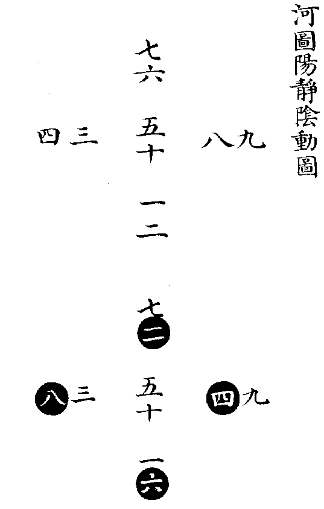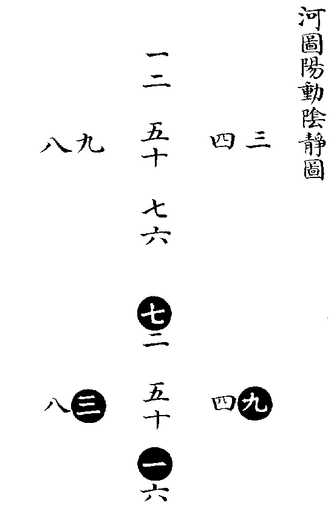

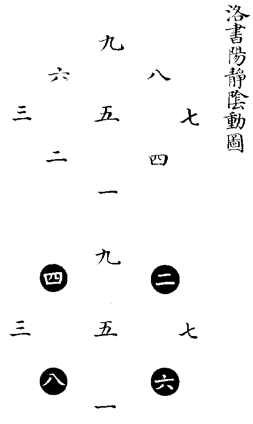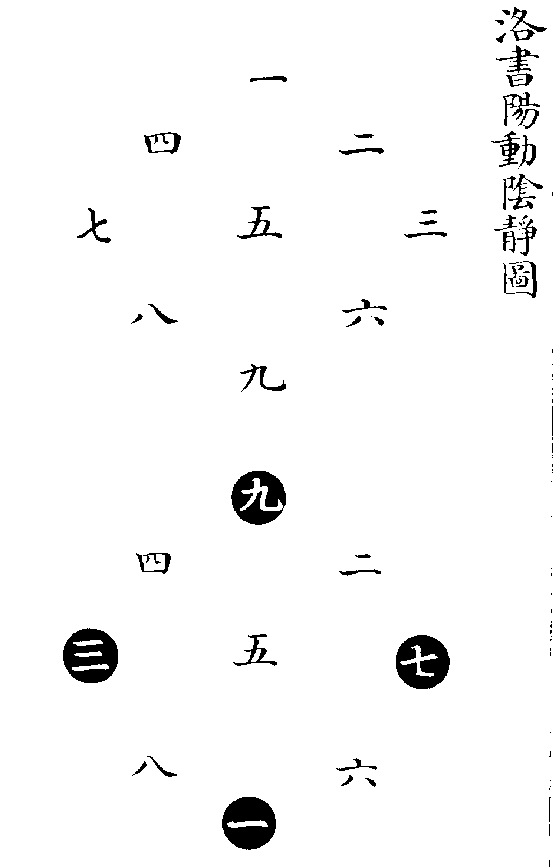

《大傳》言《河圖》，曰一二，曰三四，曰五六，曰七八，曰九十，則是以兩相從也。《大戴禮》言《洛書》，曰二九四，曰七五三，曰六一八，則是以三相從也。是故原《河圖》之初，則有一便有二，有三便有四，至五而居中；有六便有七，有八便有九，至十而又居中，順而布之，以成五位者也。原《洛書》之初，則有一二三，便有四五六。有四五六，便有七八九。層而列之，以成四方者也。若以陽動陰靜而論，則數起於上。故《河圖》之一二本在上也，三四本在右也，六七本在下也，八九本在左也。《洛書》之一二三，四五六，七八九，本自上而下也。於是陽數動而交易，陰數靜而不遷，則成《河圖》、《洛書》之位矣。如以陽靜陰動而論，則數起於下。故《河圖》之一二本在下也，三四本在左也，六七本在上也，八九本在右也。《洛書》之一二三，四五六，七八九，本自下而上也。於是陽數靜而不遷，陰數動而交易，則又成《河圖》、《洛書》之位矣。蓋其以兩相從者，如有天則有地也，有君則有臣也，有夫則有婦也。以三相從者，如有天地則有人也，有君臣則有民也，有父母則有子也。陽動陰静者如乾君而坤藏也，君令而臣從也，夫行而婦順也。自上而下，以用而言者也。陽静陰動者，如乾主而坤役也，君逸而臣勞也，父安居而妻子勤職也。自内而外，以體而言者也。同本相從，以成合一之功。動静相資，以播生成之化。造化人事之妙，窮於此矣，先後天圖象之精藴，莫不於此乎出也。

自《洛書》以三三積數，為數之原，而自四以下，皆以為法焉，何則？三者天數也，故其象圓，如前圖。居四方與居四隅者，或動或靜（居中者一定不易），而各成縱橫皆十五之數矣。四者地數也，故其象方，如後圖。居中居四隅與居四方者，或動或靜，亦各成縱橫皆三十四之數矣。自五五以下，皆以三三圖為根。自六六以下，皆以四四圖為根，而四四圖，又實以三三圖為根。故《洛書》為數之原，不易之論也。今附四四圖如左，以相證明，其餘具數學中，不悉載。

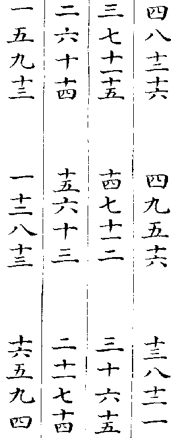

此以十六數自左而右，自上而下列之（第一圖），其居中與居四隅者不易，而居四方者交易，則成縱橫皆三十四之數（第二圖）。若居四方者不易，而居中與居四隅者交易，亦成縱橫皆三十四之數（第三圖）。

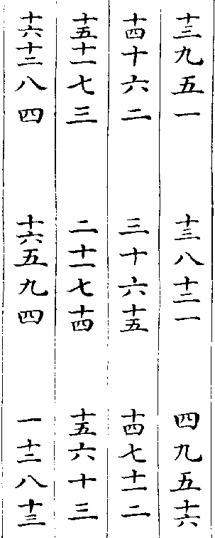

此以十六數自右而左，自下而上列之（第一圖），用前法變為兩圖（第二圖，第三圖），並得縱橫皆三十四之數，但其不易者，即前之交易者，而其交易者，即前之不易者（此第二圖同前第三圖，此第三圖同前第二圖），蓋亦陰陽互為動靜之理云。

**加減河圖之原**

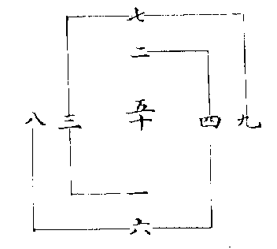

**一　三　七　九**

用中兩率，三七相加為十，以一減之得九，以九減之得一。

若用一九相加亦為十，以三減之得七，以七減之得三。

**二　四　六　八**

用中兩率，四六相加為十，以二減之得八，以八減之得二。

若用二八相加亦為十，以四減之得六，以六減之得四。

**洛書乘除之原**

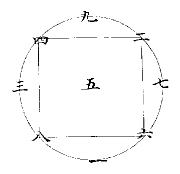

**一　三　九　七**

用中兩率，三九相乘為二十七，以一除之得二十七，以二十七除之得一。

若用一與二十七相乘，以三除之得九。以九除之得三。

**二　四　八　六**

用中兩率，四八相乘為三十二，以二除之得十六，以十六除之得二。

若用二與十六相乘，以四除之得八，以八除之得四。

《大傳》曰：「天一地二，天三地四，天五地六，天七地八，天九地十。」天地之數，皆自少而多，多而復還於少，此加減之原也。又曰：「參天兩地而倚數。」天數以三行，地數以二行，此乘除之原也，是故《河圖》以一二為數之體之始，《洛書》以三二為數之用之始。然《洛書》之用，始於參兩者，以參兩為根也，實則諸數循環，互為其根，莫不寓乘除之法焉，而又皆以加減之法為之本。今推得洛書加減之法四，乘除之法十六，積方之法五，句股之法四，各為圖表以明之如左。

**洛書加減四法**

一用奇數左旋相加，得相連之耦數。

一加三為四，三加九為十二。

九加七為十六，七加一為八。

若用奇數減左旋相連之耦數，得右旋相連之奇數。

三減四為一，九減十二為三。

七減十六為九，一減八為七。

一用耦數左旋相加，得相連之耦數。

二加六為八，六加八為十四。

八加四為十二，四加二為六。

若用耦數減左旋相連之耦數，得右旋相連之耦數。

六減八為二，八減十四為六。

四減十二為八，二減六為四。

一用奇數右旋加耦數，得相連之奇數。

一加六為七，七加二為九。

九加四為十三，三加八為十一。

若用奇數減相連之奇數，得相連之耦數。

一減七為六，七減九為二。

九減十三為四，三減十一為八。

一用耦數右旋加奇數，得相對之奇數。

二加九為十一，四加三為七。

八加一為九，六加七為十三。

若用奇數減相對之奇數，得相連之耦數。

九減十一為二，三減七為四。

一減九為八，七減十三為六。

**洛書乘除十六法**

一用三左旋乘奇數，得相連之奇數。

三二如九，三九二十七。

三七二十一，三一如三。

一用八左旋乘耦數，得相連之耦數。

八八六十四，八四三十二。

八二一十六，八六四十八。

一用三左旋乘耦數，得相連之耦數。

三四一十二，三二如六。

三六一十八，三八二十四。

一用八左旋乘奇數，得相連之耦數。

八三二十四，八九七十二。

八七五十六，八一如八。

一用二右旋乘耦數，得相連之耦數。

二二如四，二四如八。

二八一十六，二六一十二。

一用七右旋乘奇數，得相連之奇數。

七七四十九，七九六十三。

七三二十一，七一如七。

一用二右旋乘奇數，得隔二位之耦數。

二九一十八，二三如六。

二一如二，二七一十四。

一用七右旋乘耦數，得相連之耦數。

七二一十四，七四二十八。

七八五十六，七六四十二。

一用一乘奇數，得本位之奇數。

一一如一，一三如三。

一九如九，一七如七。

一用六乘耦數，得本位之耦數。

六六三十六，六八四十八。

六四二十四，六二一十二。

一用一乘耦數，得本位之耦數。

一二如二，一四如四。

一八如八，一六如六。

一用六乘奇數，得相連之耦數。

六七四十二，六九五十四。

六三一十八，六一如六。

一用四乘耦數，得相對之耦數。

四四一十六，四六二十四。

四二如八，四八三十二。

一用九乘奇數，得相對之奇數。

九九八十一，九一如九。

九三二十七，幾七六十三。

一用四乘奇數，得隔二位之耦數。

四九三十六，四七二十八。

四一如四，四三一十二。

一用九乘耦數，得相對之耦數。

九二一十八，九八七十二。

九四三十六，九六五十四。

凡除法，除其所得之數，得其所乘之數。

《洛書》乘除十六法，可約為八法，何則？五者河洛之中數，自此以上，由五以生。五加一為六，六減五為一，是六與一同根也。五加二為七，七減五為二，是七與二同根也。三八四九，其理如之。今用三與八左旋乘奇耦而皆得相連之奇耦，可以知八即三矣。用二與七右旋乘奇耦而皆得相連之奇耦，可以知七即二矣。内惟二乘奇數得隔二位之耦數者，其所得即相連奇位同根之數，猶之乎相連也。（如二九一十八，八與三同根，得八猶之得相連之三也。餘倣此。）用一與六乘而皆得本位之奇耦，可以知六即一矣，内惟六乘奇數得相連之耦數者，其所得即本位同根之數。猶之乎本位也。（如六七四十二，七與二同根。得二猶之得本位之七也。餘倣此。）用四與九乘而皆得對位之奇耦，可以知九即四矣，内惟四乘奇數得隔二位之耦數者，其所得即對位同根之數，猶之乎對位也。（如四九三十六，六與一同根。得六猶之得對位之一也。餘倣此。）其但得同根之數者，何凡奇乘耦，耦乘耦所得皆耦數而同。（如三四一十二，八四亦三十二。）奇乘奇，其得數為奇。若耦乘奇，不能得奇數而同，故但得其同根之耦數也。（如三三為九，八三二十四。九與四同根，得四猶之得九也。）所以一六二七三八四九在河圖則四方之相配，在洛書則正隅之相連，以其數之生於中五而同根也。

數有合數，有對數。合數生於五，對數成於十。一六，二七，三八，四九，此合數也，皆相減而為五者也。一九，二八，三七，四六，此對數也，皆相併而為十者也。在《河圖》，則合數同方，而對數相連。在《洛書》，則合數相連，而對數相對。相合之相從者，六從一也，七從二也，八從三也，九從四也（如前乘除十六法）。相對之相從者，九從一也，八從二也，七從三也，六從四也（如後積方五法）。凡以合數共乘一數，所得之數必同（乘耦既同數，乘奇則同報）。若各自乘焉，則又必合矣（如三三得九，八八六十四）。以對數共乘一數，所得之數必對（如三三得九，七三二十一）。若各自乘焉，則又必同矣（如一一得一，九九亦八十一。二二得四，八八亦六十四）。是以自乘之數，相合之相從者，此得自數，則彼亦得自數也（如一得一，六得六）。此得對數則彼亦得對數也（如四得六，九得一）。此得連數，則彼亦得連數也（如三得九，八亦得四。二得四，七亦得九）。相對之相從者，此得自數，則彼得對數也（如一得一，九亦得一。六得六，四亦得六）。此得連數，則彼亦得連數也（如三得九，七亦得九。二得四，八亦得四）。要皆會於一六四九而齊焉。故開平方之自乘數，止於一六四九，而《洛書》之位，一六四九居上下以為經，二七三八、居左右以為緯者，此也。

**《洛書》對位成十互乘成百圖**

**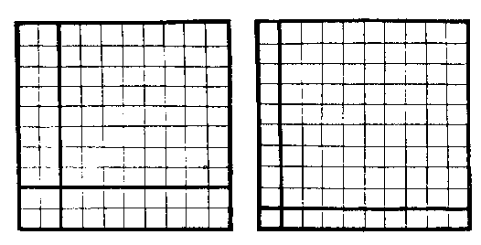**

一與九對成十（十自乘其積一百）。

九自乘八十一；一自乘一；一乘九、九乘一，俱為九，共十八；合之一百（與十自乘積同）。

二與八對成十。八自乘六十四；二自乘四；二乘八、八乘二，俱十六，共三十二；合之一百。

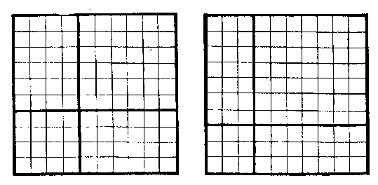

三與七對成十。七自乘四十九；三自乘九；三乘七、七乘三，俱二十一，共四十二；合之一百。

四與六對成十。六自乘三十六；四自乘十六；四乘六、六乘四，俱二十四，共四十八；合之一百。

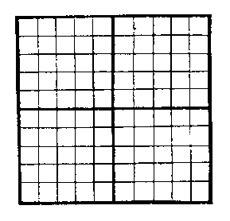

中五含五成十。五自乘二十五；又五自乘二十五；又五互乘各二十五，共五十。合之一百。

**洛書句股圖**

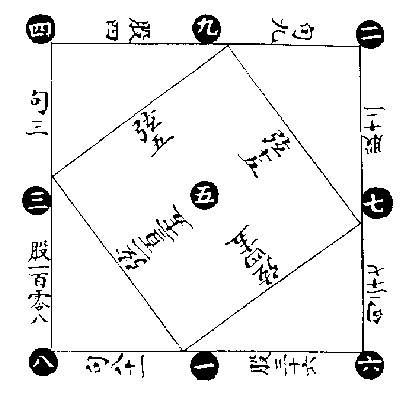

句三，股四，弦五。

句九，股十二，弦十五。

句二十七，股三十六，弦四十五。

句八十一，股一百零八，弦一百三十五。

此《洛書》四隅合中方，而寓四句股之法者，推之至於無窮，法皆視此。

**河洛未分未變方圖**

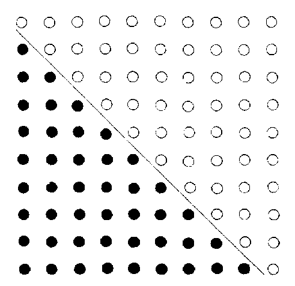

《河圖》之數，五十有五。《洛書》之數，四十有五，合為一百，此天地之全數也。以一百之全數，為斜界而中分之，則自一至十者，積數五十有五，自一至九者，積數四十有五。二者相交，而成河洛數之兩三角形矣。凡積數自少而多，必以三角，而破百數之全方，以為三角，其形不離乎此二者，下諸圖之根，實出於此。

**河洛未分未變三角圖**

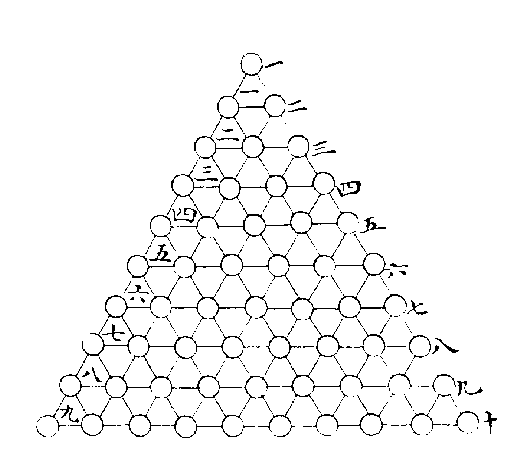

《河圖》之數，自一至十。《洛書》之數，自一至九。象之已分者也。圖則生數居內，成數居外。書則奇數居正，耦數居偏，位之已變者也。如前圖，破全方之百數，以為河洛二數，又就點數十位，中涵冪形之九層，以為河洛合一之數，則雖其象未分，其位未變，而陰陽相包之理，三極互根之道，已粲然默寓於其中矣。故為分析以明之，如後論。

**點數應《河圖）十位**

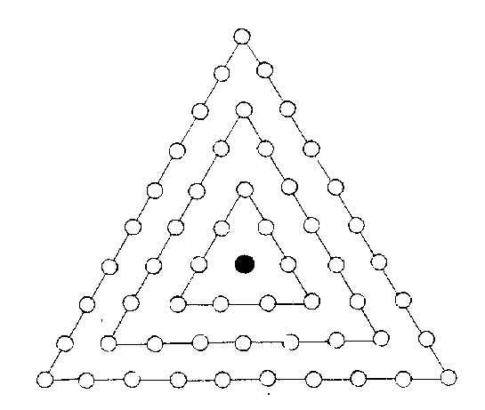

周圍三角，分三重，中一重九，次內一重二九一十八，外一重三九二十七，除中心，凡五十四。

若自上而下作三層，亦如之。

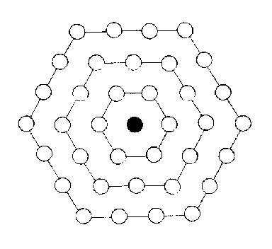

中含六角，亦分三重，中一重六，次內一重二六一十二，外一重三六一十八，除中心，凡三十六。

若自上而下作三層，亦如之。

**冪形應《洛書》九位**

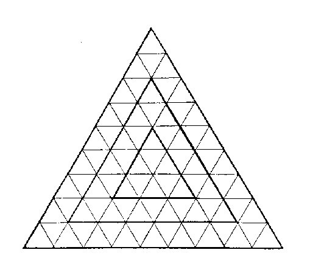

周圍三角分三重，中一重九，次內一重三九二十七，外一重五九四十五，凡八十一。

若自上而下作三層，亦如之。

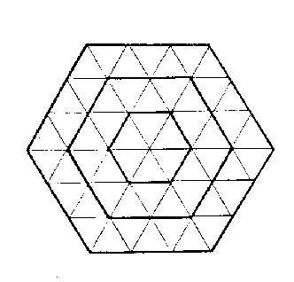

中含六角，亦分三重，中一重六，次內一重三六一十八，外一重五六三十，凡五十四。

若自上而下作三層，亦如之。

以上諸圖，本同一根，雖積數若異，而其為九六之變則一也。九六可分為內外中之三重，亦可分為上下中之三層，就每重每層論之，則九為天而包地，六為地而涵於天，心為人而主乎天地。統三重而論之，則外為天，內為地，而中為人也。統三層而論之，則上為天，下為地，而中為人也。又合而論之，則九六者，在天為陰陽，在地為柔剛，在人為陰陽剛柔之會，而其心則天地人之極也，以上下分者，其心有三，所謂三極之道，三才各具一太極也；以內外分者，其心惟一，所謂人者天地之心，三才經體一太極也。

此圖之中，渾具理象數之妙者如此，故分而為圖，則應乎陰陽剛柔之義，根於極而迭運不窮。聖人則之，易有太極，是生兩儀，陽九陰六，命爻衍策者此也。分而為書，則應乎三才之義，主於人而成位其中，聖人則之。皇極既建，彜倫攸敘，參天貳地，垂範作疇者此也。

或曰：《河圖》、《洛書》，出於兩時，分為兩象，今以一圖括之可乎？曰：十中涵九，故數終於十，而位止於九，此天地自然之紀，而圖書所以相經緯而未嘗相離也。非有十者以為之經，則九之體無以立。非有九者以為之緯，則十之用無以行。不知圖書之本為一者，則亦不知其所以二矣。

或曰：《河圖》、《洛書》，有定位矣，今以為有未變者何與？曰：《易大傳》之言《河圖》也，曰「天一地二，天三地四，天五地六，天七地八，天九地十」，順而數之，此其未變者也。又曰「天數五，地數五，五位相得，而各有合」，分而置之，此其定位者也。如易卦一每生二，以至六十有四，則其未變者也。乾南坤北，離東坎西，則其定位者也。不知未變之根，則亦不足以識定位之妙矣。

**冪形為算法之原**

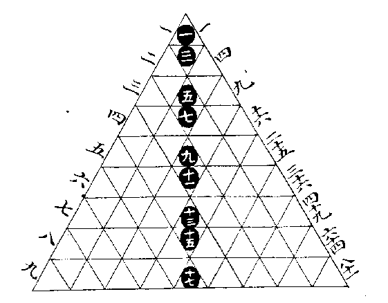

此圖左方注者，本數也，自一至九而用數全矣。中列注者，加數也，一加二為三，二加三為五，至於八加九而為十七，皆以本數遞加，而每層之冪積如之。右方注者，乘數也，一自乘一，其冪積一。二自乘四，其冪積合一三兩層而為四，至於九自乘八十一，則其羃積亦合自一至十七九層之數而為八十一，皆以本數自乘而每形之冪積如之，得加乘之法則減除在其中矣。自此而衍之，至於無窮，其數無不合焉。推之九章之術，其理無不貫焉。今考洛書，縱横逆順，無往不得，加減乘除之法，開方句股之算，乃自其未變之先，而諸法渾具，至洛書而始盡其參伍錯綜之致云爾。

**圖形合《洛書》為象法之原**

**天圓圖／地方圖**

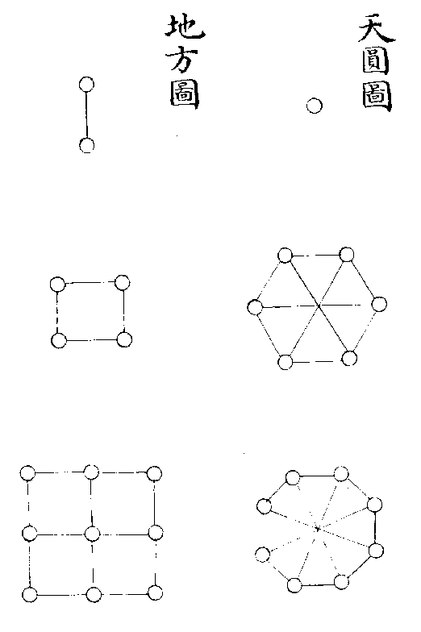

**人為天地心圖**

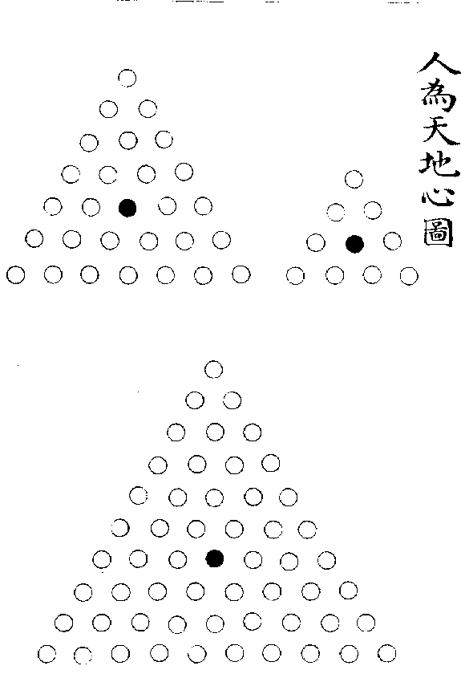

凡有數則有象，象不離乎數也。萬象起於方圓，而測方圓者以三角，此句股所以為算之宗也。圓者天象，方者地象，三角形者人象，何則？天之道如環無端，故其象圓也。地之道奠定有常，故其象方也。人受性於天，受形於地，猶三角之形，其心則圓之心，其邊則方之邊也。今就九數而三分之，則一者圓之根也，而十數之內，惟六角八角，為有法之圓形，其自十以後，角愈多以至於無角者視此矣，此一六八所以為圓象之數也。二者方之根也，而十數之内，惟四與九可以積成方面。其自十以後，積愈多而皆可成方者，視此矣。此二四九所以為方形之數也。以十數裁為三角，自一至四，則三其心也。自一至七，則五其心也。自一至十，則七其心也。所謂三角求心之法者如是，其自十以後，數愈多而皆可以求心者，視此矣。此三五七所以為三角形之數也。洛書之位，一六八居下為天道之下濟，二四九居上為地道之上行，三五七居中為人道之中處。其數其象，亦於圖形乎有合矣。

**先後天陰陽卦圖**

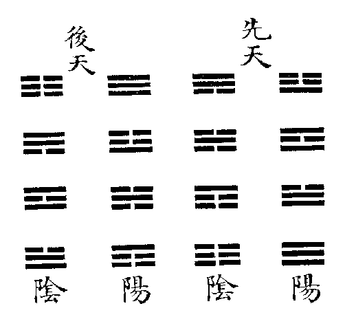

先天之陽卦曰震離兌乾，其陰卦曰巽坎艮坤。後天之陽卦曰乾震坎艮，其陰卦曰坤巽離兌，不同何也？蓋先天分陰陽卦，自兩儀而分之，由陽儀以生者，皆陽卦也；由陰儀以生者，皆陰卦也。後天分陰陽卦，自爻畫以定之，其以陽為主者，皆陽卦也；其以陰為主者，皆陰卦也。先天則因乎畫卦之序而中分之，後天則卦之已成，觀其爻畫之多寡而命之也。

其理如何？曰：陽儀上有陰卦，此所謂「立天之道曰陰與陽」也。陰儀上有陽卦，此所謂「立地之道曰柔與剛」也。

其法象之自然者如何？曰：火之炎熱光明，其為陽也，明矣。澤者水之積濕，為陽氣所驅，以滋潤萬物者也，是亦陽也。水之幽暗寒肅，其為陰也，明矣。山者土之隆起，與地為一體者也，是亦陰也。是故先天之卦，陰陽之象之正也。其變而後天，則火與澤從風而俱為陰，水與山從雷而俱為陽，蓋有由矣。凡陰陽之氣，未有不合而成者也，然有感應先後之別焉。先有陽而遇陰者屬陽，先有陰而遇陽者屬陰，有陽氣在下將發而遇陰壓之，則奮而為雷矣。有陽氣在中將散而遇陰包之，則鬱而為雨矣。有陽氣直騰而上而遇陰承之，則止而為山矣。此皆主於陽而遇陰，所以皆為陽卦也。有陰在內，陽氣必入而散之，觀之陰霾盡而後風息可見也。有陰在中，陽氣必附而散之，觀之薪芻盡而後火滅可見也。有陰在外，陽氣必敷而散之，觀之濕潤盡而後澤竭可見也。此皆主於陰而遇陽，所以皆為陰卦也。總而淪之，惟乾純陽，坤純陰，不可變也。雷陽動之始，風陰生之始，亦不可變也。火溫煖，澤發散，故以用言之則陽，然火根於陰之燥，澤根於陰之濕，故以體言之則陰。水寒涼，山凝固，故以用言之則陰，然水根於陽之噓而流，山根於陽之矗而起，故以體言之則陽。先天之象，著其用也。後天之象，探其根也。正如仁之發生為陽，而其柔和亦可以為陰。義之收斂為陰，而其剛決亦可以為陽。陰陽本一氣而互根，故其理竝行而不悖也。

**後天卦以天地水火為體用圖**

**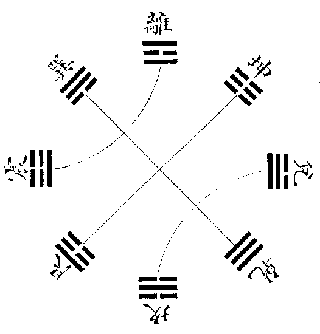**

造化所以為造化者，天地水火而已矣。易卦雖有八而實惟四，何則？風即天氣之吹噓而下交於地者也，山即地形之隆起而上交於天者也，雷即火之鬱於地中而搏擊奮發者也，澤即水之聚於地上而布散滋潤者也。道家言天地日月，釋氏言地水火風，西人言水火土氣，可見造化之不離乎四物也。故先天以南北為經，而天地居之體也。以東西為緯，而水火居之用也。後天則以天地為體，而居四維。以水火為用，而居四正。雷者火之方發，故動於春；及火播其氣，則王於夏矣。澤者水之未收，故散於秋；及水歸其根，則王於冬矣。水火為天地之用，故居四正以司時令也。天氣朕兆於西北，至東南而下交於地，易所謂天下有風姤也。故乾巽相對而為天綱。地功致役於西南，至東北而上交於天，易所謂天在山中大畜也。故坤艮相對而為地紀。天地為水火之體，故居四維以運樞軸也。天地水火，體用互根，以生成萬物，此先後天之妙也。若以卦畫論之，則震即離也，一陰閉之於上則為震。兌即坎也，一陽敷之於下則為兌。巽即乾也，一陰行於下則為巽。艮即坤也，一陽亘於上則為艮。是以六十四卦始乾坤，中坎離，而終於既濟末濟。則知造化之道，天地水火盡之矣。

**先天卦變後天卦圖**

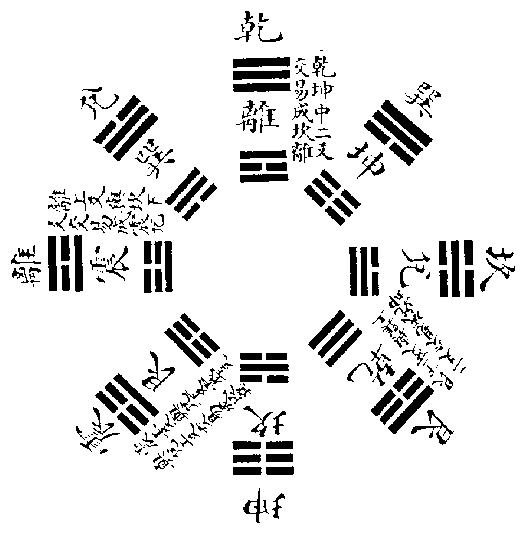

此圖先天凡四變而為後天也，蓋火之體陰也，其用則陽，而天用之，故乾中畫與坤交而變為離。水之體陽也，其用則陰，而地用之，故坤中畫與乾交而變為坎。火在地中，陰氣自上壓之而奮出，則雷之動也，故離上畫與坎交而變為震。水聚地上，陽氣自下敷之而滋潤，則澤之說也，故坎下畫與離交而變為兌。陽感於陰則山出雲，是山者雷與澤之上下相感者也，故震以上下畫與兌交而變為艮。陰感於陽而水生風，是風者澤與雷之上下相感者也，故兌以上下畫與震交而變為巽，風本天氣也，因與山交而入其下，則下與地接，故巽以上二爻與艮下二爻交而變為坤。山本地質也，因與風交而出其上，則上與天接，故艮以下二爻與巽上二爻交而變為乾。

或曰：此於經書有徴乎？曰：在易，天與火同人是天以火為用也，水與地比是地以水為用也。離為火亦為電，易曰雷電合而章，又曰雷電皆至，是雷與火一氣也。澤有水則為節，澤无水則為困，是澤與水一物也。《周禮》云「日西則多陰」，蓋西方積山，故多雲雷，今之近嶂者皆然也。又云「日東則多風」，蓋東方積澤，故多風颶，今之濱海者皆然也。莊周云「大塊噫氣，其名為風」，是風與地氣相接也。《禮》登山以祭，升中於天，是山與天氣相接也。夫天地水火者，一陰一陽而已，其情則交易而相通，其體則變易而無定，故先天交變以成後天，莫不各得其位而妙其化，各從其類而歸其根也。豈偶然哉！

**先天卦配河圖之象圖**

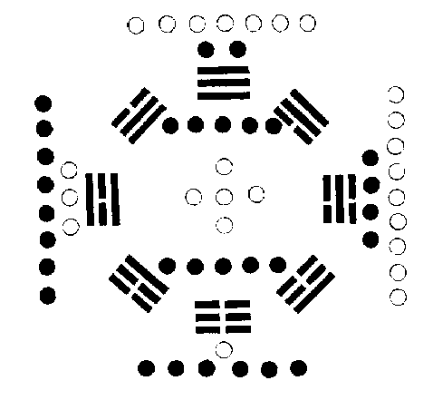

圖之左方，陽內陰外，即先天之震離兌乾，陽長而陰消也。其右方，陰內陽外，即先天之巽坎艮坤，陰長而陽消也，蓋所以象二氣之交運也。

**後天卦配河圖之象圖**

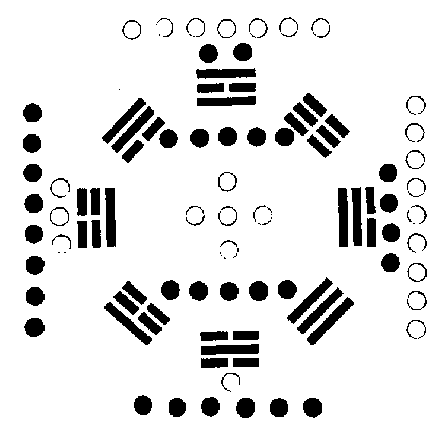

圖之一六為水居北，即後天之坎位也。三八為木居東，即後天震巽之位也。二七為火居南，即後天之離位也。四九為金居西，即後天兌乾之位也。五十為土居中，即後天之坤艮，周流四季而偏旺於丑未之交也。蓋所以象五行之順布也。

**先天卦配洛書之數圖**

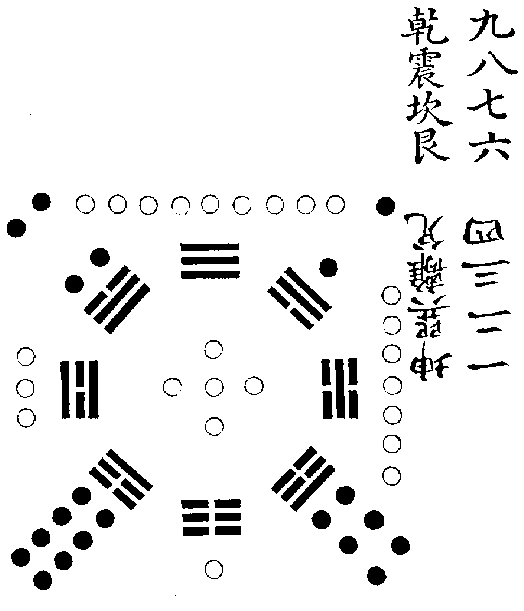

直列《洛書》九數，而虛其中五以配八卦。

陽上陰下，故九數為乾，一數為坤，因自九而逆數之，震八坎七艮六，乾生二陽也。又自一而順數之，巽二離三兌四，坤生三陰也。以八數與八卦相配，而先天之位合矣。

**後天卦配洛書之數圖**

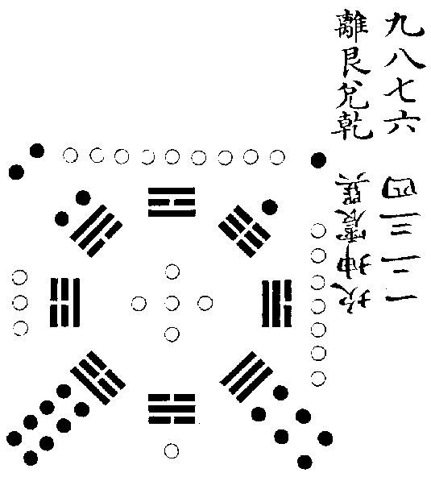

火上水下，故九數為離，一數為坎。火生燥土，故八次九而為艮。燥土生金，故七六次八而為兌為乾。水生濕土，故二次一而為坤。濕土生木，故三四次二而為震為巽。以八數與八卦相配，而後天之位合矣。

《洛書》之左邊，本一二三四也。其右邊，本九八七六也。然陰陽之道，丑未之位必交。《洛書》之二與八，正東北西南之維，丑未之位，此其所以互易也。以此類之，則先天圖之左方，坤巽離兌。其右方，乾震坎艮，以震巽互而成先天也。後天圖之左方，坎坤震巽。其右方，離艮兌乾，以艮坤互而成後天也。

據先儒說，圖書出有先後，又或謂並出於伏羲之世，然皆不必深辨。先聖後聖，其揆一也。況天地之理，雖更萬年，豈不合契哉。《洛書》晚出，而其理不妨已具於《河圖》之中，是故以易象推配，亦無往而不合也。

**先後天卦生序卦雜卦圖說**

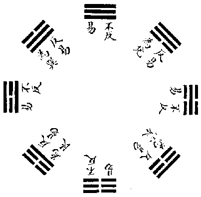

先天圖者，序卦之根也。

序卦之法，以兩卦相對為義，有相對而翻覆不可變者，乾坤、坎離、頤大過、中孚小過是也。有相對而翻覆可變者，屯蒙以後，既濟未濟以前，五十六卦皆是也。就五十六卦之中，則翻覆而二體不易者十二卦，需訟、師比、泰否、同人大有、晉明夷、既濟未濟也。翻覆而二體皆易者十二卦，隨蠱、咸恒、損益、震艮、漸歸妹、巽兌也。其翻覆而止於一體易者三十二卦，則自屯蒙至渙節皆是也。蓋翻覆而不可變者，法八卦之乾坤坎離也。翻覆而可變者，法八卦之震艮巽兌也。就翻覆可變之中，其二體不易者，又皆乾坤坎離相交者也。其一體不易者，亦皆交於乾坤坎離者也。惟震艮巽兌相交之卦，則二體皆易焉，頤、中孚、大過、小過。雖為震艮巽兌相交之卦，而翻覆不可變者，頤、中孚具離之象，大過、小過具坎之象也。故《序卦》以之附於坎離、既濟未濟，為其具離坎之象焉爾。

先天圖八卦兩兩相對，《序卦》之根也。乾與坤對，坎與離對，震與巽對，艮與兌對。相對而不相變，所以定《序卦》之體也。然既相對，則必相交。四正之卦相交，則雖翻覆，而其體不易。四維之卦相交，則翻覆而其體遂易矣。若四正之卦、與四維之卦雜交，則易者半，不易者半，所以極《序卦》之用也。是故天地定位，上經所以始於乾坤，中於否泰也。山澤通氣，雷風相薄，下經所以始於咸恒，中於損益也。水火不相射，上下經所以終於坎離、既濟未濟也。

**艮☶**　下去一陰上生一陰則為坎

**坎☵**下去一陰上生一陰則為震

**震☳**　下去一陽上生一陽復為艮

**乾☰**　下去一陽上生一陽仍為乾

**兌☱**　下去一陽上生一陽則為離

**離☲**　下去一陽上生一陽則為巽

**巽☴**　下去一陰上生一陰復為兌

**坤☷**　下去一陰上生一陰仍為坤

**艮☶**　下去一陰上生一陽為巽

**坎☵**　下去一陰上生一陽為離

**震☳**　下去一陽上生一陰為坤

**乾☰**　下去一陽上生一陰為兌

**兌☱**　上去一陰下生一陽為乾

**離☲**　上去一陽下生一陰為坎

**巽☴**　上去一陽下生一陰為艮

**坤☷**　上去一陰下生一陽為震

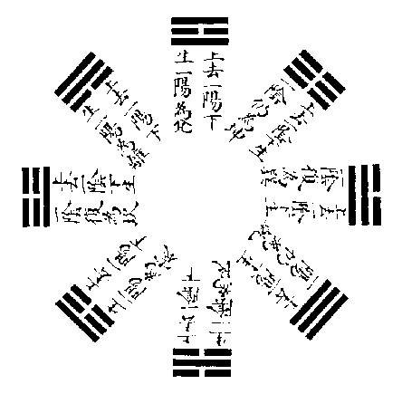

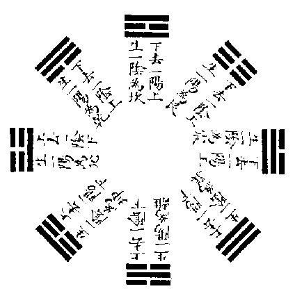

後天圖者，雜卦之根也。

雜卦即互卦也，互卦之法，或上去一畫而下生一畫，或下去一畫而上生一畫，則其體遂變矣。互體所成，凡十六卦，其陽卦從陽卦，陰卦從陰卦者八，乾坤，頤大過、蹇解、家人睽也。其陽卦交陰卦，陰卦交陽卦者亦八，剝復、夬姤、漸歸妹、既濟未濟也。以交互之法求之，乾而上去一陽，下生一陽，或下去一陽，上生一陽，仍是乾矣。坤而上去一陰，下生一陰，或下去一陰，上生一陰，仍是坤矣。惟震而上去一陰，下生一陰，則變為坎；下去一陽，上生一陽，則變為艮。巽而上去一陽，下生一陽，則變為離；下去一陰，上生一陰，則變為兌。坎而上去一陰，下生一陰，則變為艮；下去一陰，上生一陰，則變為震。離而上去一陽，下生一陽，則變為兌；下去一陽，上生一陽，則變為巽。艮而上去一陽，下生一陽，則變為震；下去一陰，上生一陰，則變為坎。兌而上去一陰，下生一陰，則變為巽。下去一陽，上生一陽，則變為離。此八變者，皆陽得陽卦，陰得陰卦，故乾之變則乾也，坤之變則坤也。震之變則雷水解也，山雷頤也。巽之變則風火家人也，澤風大過也。坎之變則水山蹇也，雷水解也。離之變則火澤睽也，風火家人也。艮之變則山雷頤也，水山蹇也。兌之變則澤風大過也，火澤睽也。皆因其能相變，故能相合也。又乾而上去一陽，下生一陰，則變為巽。下去一陽，上生一陰，則變為兌。坤而上去一陰，下生一陽，則變為震。下去一陰，上生一陽，則變為艮。震而上去一陰，下生一陽，則變為兌；下去一陽，上生一陰，則變為坤。巽而上去一陽，下生一陰，則變為艮；下去一陰，上生一陽，則變為乾。坎而上去一陰，下生一陽，或下去一陰，上生一陽，皆變為離。離而上去一陽，下生一陰，或下去一陽，上生一陰，皆變為坎。艮而上去一陽，下生一陰，則變為坤；下去一陰，上生一陽，則變為巽。兌而上去一陰，下生一陽，則變為乾；下去一陽，上生一陰，則變為震。此八變者，皆陽得陰卦，陰得陽卦。故乾之變則天風姤也，澤天夬也。坤之變則地雷復也，山地剥也。震之變則雷澤歸妹也，地雷復也。巽之變則風山漸也，天風姤也。坎之變則既濟也，未濟也。離之變則未濟也，既濟也。艮之變則山地剝也，風山漸也。兌之變則澤天夬也，雷澤歸妹也。亦皆因其能相變，故能相合也。易互卦之法盡於此，此其卦所以止於十六也。

後天圖八卦陰陽上下畫互變，雜卦之根也。何則？後天之卦，有各從其類以相變者焉，有各得其對以相變者焉。乾居西北，而三陽從之。坤居西南，而三陰從之，此各從其類者也。乾與巽對，坎與離對，艮與坤對，震與兌對，此各得其對者也。相從者除乾坤純陽純陰不變外，坎而上去一陰，下生一陰，則為艮。艮而上去一陽，下生一陽，則為震。震而上去一陰，下生一陰，則復為坎，此三陽相次之序也。巽而上去一一陽，下生一陽，則為離。離而上去一陽，下生一陽，則為兌。兌而上去一陰，下生一陰，則復為巽，此三陰相次之序也。相對者，乾而上去一陽，下生一陰，則為巽。坎而上去一陰，下生一陽，則為離。艮而上去一陽，下生一陰，則為坤。震而上去一陰，下生一陽，則為兌。此四陽卦變為對位四陰卦之序也。巽而下去一陰，上生一陽，則為乾。離而下去一陽，上生一陰，則為坎。坤而下去一陰，上生一陽，則為艮。兌而下去一陽，上生一陰，則為震。此四陰卦變為對位四陽卦之序也。然尋其對位相變之根，則又自父母男女長少而來，蓋四陰卦，兌為最少，離為中，巽為長，坤為老。四陽卦，艮為最少，坎為中，震為長，乾為老。凡變者自少而老。故兌而上去一陰，下生一陽，則變為乾矣。離而上去一陽，下生一陰，則變為坎矣。巽而上去一陽，下生一陰，則變為艮矣。坤而上去一陰，下生一陽，則變為震矣。四陽卦之變，自陰而來，故又變而為對位之四陰也。艮而下去一陰，上生一陽，則變為巽矣。坎而下去一陰，上生一陽，則變為離矣。震而下去一陽，上生一陰，則變為坤矣。乾而下去一陽，上生一陰，則變為兌矣。四陰卦之變，自陽而來，故又變而為對位之四陽也。

合而觀之，凡陽卦相變者，震變坎艮也，坎變震艮也，艮又變震坎也。凡陰卦相變者，巽變離兌也，離變巽兌也，兌又變巽離也。凡陽卦變陰卦者，乾變巽兌也，震變坤兌也，坎變離也，艮變坤巽也。凡陰卦變陽卦者，坤變震艮也，巽變乾艮也，離變坎也，兌變乾震也。易中所謂互卦者止於此，而其錯綜次序，皆具於後天也。

**大衍圓方之原**

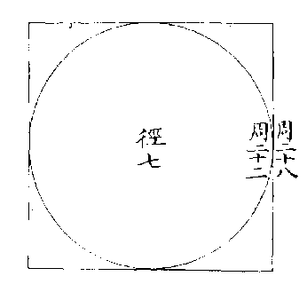

凡方圓可為比例，惟徑七者。方周二十八，圓周二十二，即兩積相比例之率也。（用其半，故若十四與十一。）合二十八與二十二，共五十，是大衍之數，函方圓同徑兩周數。

**大衍句股之原**

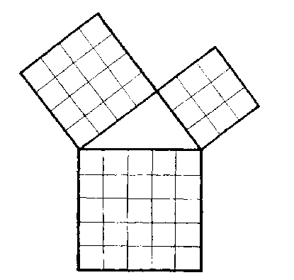

句三，其積九。

股四，其積十六。

弦五，其積二十五。

合之五十，是大衍之數，函句股弦三面積。

蓍策之數，必以七為用者，蓋方圓之形，惟以徑七為率，則能得周圍之整數。句股之形，亦惟以三四為率，則能得斜弦之整數。徑七，固七也。句三股四之合亦七也。是故論方圓周圍之合數則五十，論句股弦之合積亦五十，此大衍之體也。因而開方，則不盡一數。而止於四十九，此大衍之用也。開方而不盡一數，則蓍策之虛一者是已。方面之中，函八句股，而又不盡一數，則蓍策之掛一者是已。惟老陽老陰之數，與此密合，故作圖以明之。

**老陽數合方法**

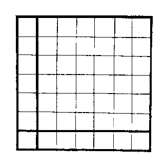

全方四十九。

中含大方六六三十六，為過揲之數。

小角一一如一，一六五互乘為十二，併成十三，為掛扐之數。

此與前《洛書》以自乘互乘為積方之法同，但《洛書》用對數，如一與九之類是也。大衍用合數，則一與六是也。

老陰數合句股法全方四十九。

**老陰數合句股法**

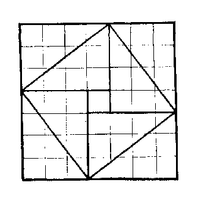

全方四十九。

句三股四，其積六，四因之得二十四，為過揲之數。

弦五，其積二十五，為掛扐之數。（弦實亦函四句股積，而多句股較一。）

十數之中，除一一不變，自二二至十十，皆可成方。然惟三三則五數居其中，七七則二十五數居其中，此二者為能得天地之中數，餘則不能也。蓋三二者《洛書》之數也，七七者蓍策之數也。《洛書》之數，五居其中矣，而其四方，則又成四句股之數，而以中五為弦之法焉。蓍策之數，二十五居其中矣，而其四方、則又具四句股之積而即以二十五為弦之實焉。是故卦數之八，合乎《河圖》之四也，為其虛五十者同一根也。蓍數之七，合乎《洛書》之三也，為其用中五者同一根也。聖人因心之作，與天地自然之文，其相為經緯者如此。

**大衍迎日推策法**

史稱黃帝迎日推策。所謂策者，蓋即神蓍也。推衍策數以候日月，故曰「迎日推策」。

考之後代，譚卦畫者多以曆法推配，然孔子未嘗言也，惟於大衍之數則曰「象四時」「象閏」，又曰「當期之日」，則蓍策之與曆法相表裏也，可見矣。顧有以理言之而肖似者，有以數推之而密合者。以理言而肖似者，孔子《大傳》所陳是也。蓋四十九算，排列成方，以句股之數求之，則零一者歸於中而為心；以開方之法求之，則零一者歸於隅而為角。以其歸於中也，故分二以象天地，而掛一者象人之為天地心也。以其歸於隅也，故分二以象二氣，而掛一者象閏之為一歲，餘也，大傳所謂掛一以象三者。此零一之策也，所謂歸奇於扐以象閏者亦此零一之策也。然當分二之初，此一之掛者，徒以象氣盈耳。至於每揲之後，又得餘策而扐之，然後以此掛一者歸之，而并以象閏，則合氣盈朔，虚而為一者也。此以理言之，而大概相似，是孔子之說也。至於以數推之者，自黄帝之法不傳，至唐僧一行始以大衍命曆以策數起歲，分閏餘之算。然按《唐書‧曆志》考之，其法蓋未密合也，故今以孔子之言為宗，而參以一行之數，康節之理，據顓頊周髀之制，以約略千載坐致之術為法，表以眀之如左：

**一年三百六十五日四分日之一。每日百分。凡三萬六千五百二十五分。以天數二十五除之，得一千四百六十一分，為日數。又以地數三十除日數，得四十八零七分，為月數。是為大衍用數。**

《大傳》言蓍數，而以《河圖》之數首之，故一年全數，以二十五除之得日數者。日有曉午昏夜，凡四限，四分期日，為一千四百六十一也；以三十除之得月數者，月有朔望，上下弦凡四限，四分歲月（每月三十日算），為四十八零七分也，與大衍用數相應。

**揲策合左右共四十八，應四十八弦**（每弦七日半），**為期日歲月之經數**（三百六十）。

**掛策一，應氣盈之餘數**（五日四分日之一）。

**以初變為主。**

日法十。

揲策應弦，每弦以十分為率。

掛策應氣盈五日四分日之一，於日法為十分弦之七。

**扐策合陰陽共十二**（得少則四為陽，得多則八為陰）**，應十二朔**（每朔二十九日，九百四十分日之四百九十九）**，為一歲之實數**（三百五十四日，九百四十分日之三百四十八）**。**

**掛策一，應朔虛之餘數**（十日九百四十分日之八百二十七）。

**亦以初變為主。**

月法十九。

扐策應朔，每朔以十九分為率。

掛策應朔虛十日九百四十分日之八百二十七，於月法為十九分朔之七。

以初變之揲策扐策計之，揲策四十八，以應四十八弦之整數，其掛一者以應氣盈五日四分口之一也。扐策十二，以應十二朔之實數。其掛一者，以應朔虛十日八百二十七分也。據四分曆法，每日九百四十分，故一歲之氣盈，有五日二百三十五分。一歲之朔虛（此合氣盈總算），有十日八百二十七分，每弦七日四百七十分，如日法十分弦之七，則為五日二百三十五分矣；每朔二十九日四百九十九分，如月法十九分朔之七，則為十日八百二十七分矣。（月每日行十二度十九分度之七，故以十，九為法），日月之法不同，而其餘分皆七。故漢儒卦氣，每卦直六日，尚餘七分。（每卦直六門七分者，日以八十分為法也。蓋歲數三百六十五日四分日之一，四乘而三除之，為四百八十七，故四百八十七者，歲策也。每卦直六日，六八四十八，得四百八十分，又餘七分，歲策之根也。積六十卦，直三百六十日，餘分之積，共四百二十分，以日法除之，為五日四分日之一。）古今曆法，一章之內，有七閏月者，法由茲起也。其在蓍數，則何以見掛一之策，為餘七之算乎？蓋亦以生蓍之法而知之爾。卦數八八者，體數也。蓍數七七者，用數也。蓍以七為用，而掛一者用中之用，故其分數亦止於七也。此皆以一行之曆，康節之說，參而用之者。然一行以弦為實弦，而不足七日有半，以掛一為實閏，而其數又餘於一弦之外，故今以弦為七日半之經，弦以掛一為五日四分日之一之盈分，必待扐餘之後，然後其歸奇之掛一，乃得應十日八百二十七分之數，而為一歲之實閏也。似於大傳之先後次序，更為脗合

**過揲為正策**（乾策三十六，合六爻二百一十有六。坤策二十四，合六爻百四十有四）。

**凡三百有六十當一期之日數。**

**掛扐為餘策**（乾策十三合六爻七十有八，坤策二十五合六爻百五十）。

**凡二百二十有八，當一章之月數。**（正策以三十為進退之法，故其合皆六十，餘策以十九為進退之法，故其合皆三十八，三十者，日法也，十九者，朔法也。）

**二篇之策為全策。**（陽爻百九十二，得六千九百一十二，陰爻百九十二，得四千六百零八。）

**凡萬有一千五百二十，當閏終之總數。**

此因《大傳》之說而推備之者。歲者，正數也，太陽主之；閏者，餘數也，太陰主之。故《堯典》始而殷正四時，則曰日中、日永、日短，此以太陽為主者也，終則曰以閏月定四時成歲，此以太陰為主者也。蓍策之正數三百有六十，當一期之日，蓋日周天而為一期，故為太陽所主也。其餘數二百二十有八，當一章之月，蓋氣朔分齊而為一章，故為太陰所主也，其全數萬有一千五百二十，當閏終之總數，蓋三十二月而閏一月，其辰萬有一千五百二十；三十二年而閏一年，其日萬有一千五百二十。此則日月正餘會終，蓍卦齊同之數也。

歷代之曆，歲分消長不同，故有五日四分日之一而有餘者，亦有五日四分日之一而不足者，然舉其中者以該其變者，則四分為常法，故顓頊曆《周髀經》皆用之，而司馬遷曆書述焉，蓋古法也。

**乾策坤策圖**

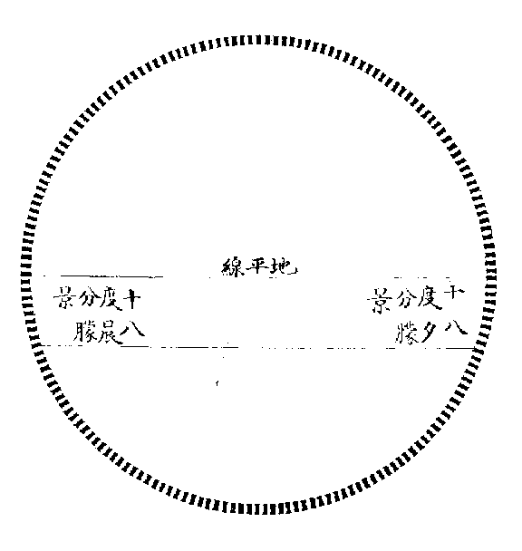  
以地平線分周天之度為二，各一百八十度。日出入朦景昏旦各十八度，共三十六度，以加晝景一百八十度，合二百一十有六，則乾之策之數也。以減夜漏一百八十度，餘一百四十有四，則坤之策數也。

《大傳》曰：「乾坤之策，凡三百有六十，當期之日。」故各一百八十者，寒暑晝夜並行之體數也。然陽生而陰殺，陽明而陰暗，故陽饒而陰乏，陽盈而陰虛。今以晝夜平分推之，其自然之數如此，若一歲寒暑之候，則若邵子之說，開物於寅末，是亦先十八日也。閉物於戌初，是亦後十八日也。以故萬物之數，萬有一千五百二十，其從陽者六千九百一十二，其從陰者四千六百八，生氣常盛，則為豐年，善類常多，則為治世，其消息盈虛之理，亦若是而已矣。

**加倍變法圖**

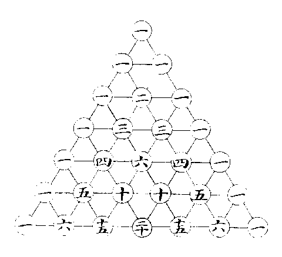

此圖用加一倍法。（如第二層兩一，生第三層中位之二，併左右兩一成四，是倍二為四也，第三層一二各生第四層中位之三，併左右兩一成八，是倍四為八也，下放此。）出於數學中，謂之開方求廉率，其法以左一為方，右一為隅，而中間之數，則其廉法也。（第三層為平方，第四層為立方，第五層六層七層，為三乘四乘五乘方。）於成卦之理，亦相肖合、伺則？陽大陰小，陽如方，陰如隅，分居兩端，陰陽合則生中間之兩象。如平方之方隅合而生兩廉，其長如方，其廣如隅也。又乘則生中間之六卦，如立方之方隅合而生六廉，三平廉根於方，而其厚如隅，二長廉根於隅，而其長如方也。故開方之法，雖相乘至於無窮，莫不依方隅以立算。成卦之法，雖相加至於無窮，莫不根陰陽以定體。成卦之始，一陰一陽，每每相加而已，及卦成而分析觀之，則自一畫至六畫，惟純陰純陽者常不動，其餘則方其為四象也，中間一陰一陽者二，方其為八卦也，中間一陰二陽者三，一陽二陰者三。方其為四畫也，中間一陰三陽者四，一陽三陰者四，二陰二陽者六。方其為五畫也，中間一陰四陽者五，一陽四陰者五，二陰三陽者十，二陽三陰者十。及其六畫之既成也，中間一陰五陽者六，一陽五陰者六，二陰四陽者十五，二陽四陰者十五，三陰三陽者二十。

朱子卦變之圖，以此而定也，蓋其倍法同於畫卦，而其多寡錯綜之數，則卦變用之。
<!-- END SOURCE: eee-4718 -->
