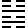
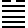
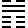
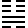

# Imperially Compiled Balanced Interpretations of the Zhou Changes

## Juan Six · 卷六

The Lower Classic: Release through Oppression. [Chinese source](../source/juan-06.md) · [Translation conventions](README.md)

**Voices:** “Original Meaning” is Zhu Xi; “Cheng's Commentary” is Cheng Yi; “Editorial Judgment” belongs to the imperial compilers. Translator’s notes appear separately at the end.

[40. Xie 解](#eee-4612) | [41. Sun 損](#eee-4613) | [42. Yi 益](#eee-4614) | [43. Guai 夬](#eee-4615) | [44. Gou 姤](#eee-4616) | [45. Cui 萃](#eee-4617) | [46. Sheng 升](#eee-4618) | [47. Kun 困](#eee-4619)

## 40. Xie 解 — Release

<!-- Source: https://www.eee-learning.com/book/4612 -->

<!-- BEGIN TRANSLATION: eee-4612:001 -->

 **Xie 解 — Release** — Kan below; Zhen above.[^j06-release]

<!-- END TRANSLATION: eee-4612:001 -->

<!-- BEGIN TRANSLATION: eee-4612:002 -->

**Cheng's Commentary.** Concerning Release, the *Sequence of the Hexagrams* says: “Limping means difficulty. Things cannot remain in difficulty forever; therefore Limping is followed by Release.” There is no principle by which things remain forever in difficulty: at its extreme, difficulty must disperse. Release means dispersal; hence it follows Limping. The hexagram has Zhen above and Kan below. Zhen is movement; Kan, danger. Moving beyond danger means emerging from it, and thus gives the image of troubles and difficulties being dispersed. Moreover, Zhen is thunder and Kan rain. Thunder and rain arise when yin and yang affect one another, come into harmony, and relax and disperse. Hence Release: the time when the world's troubles and difficulties are dispersed.

<!-- END TRANSLATION: eee-4612:002 -->

<!-- BEGIN TRANSLATION: eee-4612:003 -->

### Release: the southwest is beneficial. With nowhere to go, coming back is auspicious. With somewhere to go, an early start is auspicious.[^j06-southwest]

<!-- END TRANSLATION: eee-4612:003 -->

<!-- BEGIN TRANSLATION: eee-4612:004 -->

**Original Meaning.** Release means the dispersal of difficulty. If, while in danger, one can move, one emerges beyond danger: this is the image of Release.[^j06-jie-readings] Once difficulty has been released, benefit lies in ease and tranquility; one should not prolong troublesome disturbance. Moreover, this hexagram comes from Pushing Upward: the third line goes to the fourth place and enters the body of Kun, while the second remains in its place and also occupies the center. Hence benefit lies in the southwest's level, easy ground. If there is nowhere to go, one should return to one's place and remain tranquil. If there is still somewhere to go, one should go early and return early, without prolonging the disturbance.

<!-- END TRANSLATION: eee-4612:004 -->

<!-- BEGIN TRANSLATION: eee-4612:005 -->

**Cheng's Commentary.** The southwest is Kun's direction. Kun's constitution is broad, level, and easy. When the world's difficulties have just been released and people are only beginning to emerge from hardship, one must not again govern them with vexatious severity and urgency. The appropriate remedy is generosity and simplicity. Then people's hearts turn toward such government and rest securely in it; hence the southwest is beneficial. Tang removed Jie's tyranny and governed generously; King Wu punished Zhou's violence and reversed Shang's policies. Both followed generosity and ease. “With nowhere to go, coming back is auspicious. With somewhere to go, an early start is auspicious.” “Nowhere to go” means that the world's difficulties have dispersed and nothing remains to be done about them. “Somewhere to go” means that some matter still requires release. In a world or state, calamities arise only after governing principles and standards have fallen into disorder. Once the sage has released the difficulty and established peace without disturbance, there is nowhere to go. He should then restore the Way of government, rectify its guiding principles, clarify its standards, and return to the government of the enlightened kings of former ages. This is “coming back”: returning to correct principle, an auspicious thing for the world. Here *qi* is an introductory particle. From antiquity, sage kings rescuing people from difficulty and settling disorder initially lacked the leisure to undertake everything at once. Once stability was established, they instituted government that could endure and be carried on. From the Han onward, after disorder had been removed, rulers undertook nothing further, merely keeping things going as circumstances allowed. They therefore failed to establish good government: they did not understand the meaning of coming back. “With somewhere to go, an early start is auspicious” means that anything still requiring release should be addressed early. What should be released but has not been completely removed will regain strength unless dealt with promptly. Newly arising troubles will gradually grow unless addressed early. Hence an early start is auspicious.

<!-- END TRANSLATION: eee-4612:005 -->

<!-- BEGIN TRANSLATION: eee-4612:006 -->

**Collected Explanations.**

<!-- END TRANSLATION: eee-4612:006 -->

<!-- BEGIN TRANSLATION: eee-4612:007 -->

**Wang Bi:** Release means releasing difficulty and relieving distress. Coming back in Release does not lose the center; going forward when difficulty remains makes promptness auspicious. Without difficulty, one can return to the center; with difficulty, one can relieve the distress.

<!-- END TRANSLATION: eee-4612:007 -->

<!-- BEGIN TRANSLATION: eee-4612:008 -->

**Kong Yingda:** Master Chu says: “Some seek achievements when nothing needs doing; hence the warning to remain still when there is no difficulty. Others wait for disaster before bringing relief; hence the warning to act promptly when there is difficulty.”

<!-- END TRANSLATION: eee-4612:008 -->

<!-- BEGIN TRANSLATION: eee-4612:009 -->

**Lin Li:** Limping stops within Kan, and therefore says, “The southwest is beneficial; the northeast is not beneficial.” Release moves beyond danger, and therefore speaks only of the southwest's benefit, without repeating that the northeast is not beneficial.

<!-- END TRANSLATION: eee-4612:009 -->

<!-- BEGIN TRANSLATION: eee-4612:010 -->

**Hu Bingwen:** In the time of Release, ease is beneficial: even a little harsh urgency is not beneficial. Tranquility is auspicious: prolonged disturbance is not auspicious. The *Original Meaning* says, “If there is nowhere to go, one should return to one's place and remain tranquil.” This makes tranquility auspicious. It says, “If there is somewhere to go, one should go early and return early, without prolonging the disturbance.” This too makes tranquility auspicious. Its two occurrences of “if” leave the matter undecided: one must consider the particular time. Yet in either case, good fortune lies in coming back.

<!-- END TRANSLATION: eee-4612:010 -->

<!-- BEGIN TRANSLATION: eee-4612:011 -->

**Editorial Judgment.** The time of Release differs from the time of Limping, so their words differ slightly. Yet the Way of dealing with Release is still the Way of dealing with Limping, so their intention is largely the same. Saying that the southwest is beneficial without saying that the northeast is not beneficial is a slight difference in wording. Yet southwest means retiring behind, like Limping's “coming”; northeast means advancing ahead, like Limping's “going.” Now, coming back when there is nothing to do plainly makes the southwest beneficial. Even when there is business permitting one to go, good fortune necessarily depends on promptness: going must not make one forget to return. This still does not make the northeast beneficial; ultimately it is the southwest that benefits. The intention is largely the same as the Way of dealing with Limping. Whether a state has pressing business or not, its foundation is always to withdraw and cultivate itself. Comparing the line meanings with the hexagram makes all this apparent.

<!-- END TRANSLATION: eee-4612:011 -->

<!-- BEGIN TRANSLATION: eee-4612:012 -->

### First Six: No blame.

<!-- END TRANSLATION: eee-4612:012 -->

<!-- BEGIN TRANSLATION: eee-4612:013 -->

**Original Meaning.** Difficulty has already been released. Yielding and below, with a proper correspondent above—what blame could there be? Hence this prognostication.

<!-- END TRANSLATION: eee-4612:013 -->

<!-- BEGIN TRANSLATION: eee-4612:014 -->

**Cheng's Commentary.** The first six occupies Release's beginning, when troubles have been released. Yielding in a firm place, yin responding to yang: this signifies yieldingness capable of firmness. With no further trouble, one conducts oneself with the appropriate balance of firmness and yieldingness. Once troubles have been released and all is peaceful and undisturbed, appropriate conduct is enough for freedom from blame. At Release's beginning, tranquility and recuperation are fitting. The line's few words convey this intention.

<!-- END TRANSLATION: eee-4612:014 -->

<!-- BEGIN TRANSLATION: eee-4612:015 -->

**Collected Explanations.**

<!-- END TRANSLATION: eee-4612:015 -->

<!-- BEGIN TRANSLATION: eee-4612:016 -->

**Guo Yong:** At Release's beginning, this line fulfills “with nowhere to go, coming back is auspicious.” Hence no blame.

<!-- END TRANSLATION: eee-4612:016 -->

<!-- BEGIN TRANSLATION: eee-4612:017 -->

**Hu Bingwen:** Constancy's second nine says “regret vanishes”; Great Strength's second nine, “steadfastness brings good fortune”; Release's first six, “no blame.” These three prognostications each contain only two Chinese characters. Their language is very brief: the image is in the line itself and is not restated.

<!-- END TRANSLATION: eee-4612:017 -->

<!-- BEGIN TRANSLATION: eee-4612:018 -->

**Cai Qing:** Yielding and below, the first six can remain tranquil without making trouble and disturbing itself. What blame could there be?

<!-- END TRANSLATION: eee-4612:018 -->

<!-- BEGIN TRANSLATION: eee-4612:019 -->

**Editorial Judgment.** The Judgment's beneficial southwest means remaining behind. The first responds to firmness and supports firmness, while remaining behind them: it fulfills the hexagram's meaning. Because the meaning is clear, the words are few.

<!-- END TRANSLATION: eee-4612:019 -->

<!-- BEGIN TRANSLATION: eee-4612:020 -->

### Nine in the Second Place: In the hunt, capture three foxes and obtain a yellow arrow. Steadfastness in what is right brings good fortune.[^j06-foxes]

<!-- END TRANSLATION: eee-4612:020 -->

<!-- BEGIN TRANSLATION: eee-4612:021 -->

**Original Meaning.** The intention behind this line's image is unclear. One explanation is that the hexagram has four yin lines: excluding the fifth, the ruler's place, the other three give the image of three foxes. Broadly speaking, this line is an auspicious prognostication for divining about a hunt. It also images removing wicked flattery and attaining centered uprightness. If one can preserve correctness, nothing is inauspicious.

<!-- END TRANSLATION: eee-4612:021 -->

<!-- BEGIN TRANSLATION: eee-4612:022 -->

**Cheng's Commentary.** The second nine has the centered capacity of yang firmness and responds above to the ruler at the fifth six: it is employed in its time. Petty people are always numerous in the world. With a firm, discerning ruler above, his discernment can expose them, his authority can overawe them, and his firmness can decide against them; they dare not act out their inclinations. Even then, constant vigilance is needed, lest they find an opening and harm what is right. The fifth six occupies the honored position with yin yieldingness. Its discernment is easily obscured, its authority easily challenged, and its indecisiveness leaves it easily misled. Once a petty person gains access, the ruler's heart is turned. Moreover, difficulties have only just been released and good government is at its beginning: change remains easy. Now that the second is employed, it must be able to remove petty people; only then can it rectify the ruler's heart and put its Way of firm centeredness into practice. Hunting removes harm; the fox is a creature of wicked flattery. The three foxes indicate the hexagram's three yin lines, the petty people of the time. “Capture” means being able to transform or remove them, like capturing foxes in a hunt. Capturing them attains the Way of centered uprightness, and thus correctness and good fortune. Yellow is the central color; an arrow is a straight object. The yellow arrow signifies centered uprightness. If the wicked are not removed and once gain entry to the ruler's heart, the Way of centered uprightness has no means of proceeding. Huan and Jing's failure to remove Wu Sansi is an example.[^j06-huan-jing]

<!-- END TRANSLATION: eee-4612:022 -->

<!-- BEGIN TRANSLATION: eee-4612:023 -->

**Collected Explanations.**

<!-- END TRANSLATION: eee-4612:023 -->

<!-- BEGIN TRANSLATION: eee-4612:024 -->

**Yang Wanli:** In Release's time, this line calls for capturing foxes; the third warns against bringing on raiders; the fourth calls for releasing the toe; the fifth, for making petty people withdraw; and the sixth, for shooting the falcon. Of the hexagram's six lines, five have images of removing petty people. Who, then, brings the world's many difficulties upon it? What benefit does a ruler find in those difficulties that he enjoys drawing close to petty people and distancing noble ones?

<!-- END TRANSLATION: eee-4612:024 -->

<!-- BEGIN TRANSLATION: eee-4612:025 -->

**Wang Yinglin:** When the age is well governed, noble people overcome the crookedness of petty people through uprightness. The *Changes* says, “In the hunt, capture three foxes and obtain a yellow arrow.” When the age is disordered, petty people overcome the integrity of noble people through cunning. The *Odes* says, “The hare wanders at ease; the pheasant is caught in the net.”

<!-- END TRANSLATION: eee-4612:025 -->

<!-- BEGIN TRANSLATION: eee-4612:026 -->

**He Kai:** The world's difficulties generally originate with petty people. Anyone beginning to release those difficulties must first have a way of dealing with petty people. Neither a yielding person nor one excessive in firmness can accomplish this. The second nine, yang in a yin place, holds to firm centeredness: decisive without provocation. Hence the image of capturing three foxes in the hunt. The yellow arrow is what captures the foxes; when the foxes are captured, the yellow arrow is recovered too.

<!-- END TRANSLATION: eee-4612:026 -->

<!-- BEGIN TRANSLATION: eee-4612:027 -->

### Six in the Third Place: Carrying a burden, yet riding in a carriage: this brings raiders upon one. Even steadfast correctness brings humiliation.[^j06-burden]

<!-- END TRANSLATION: eee-4612:027 -->

<!-- BEGIN TRANSLATION: eee-4612:028 -->

**Original Meaning.** The *Appended Statements* explains this fully. “Even steadfast correctness brings humiliation” means that, even if the position was rightly obtained, it is still shameful. Only withdrawing and leaving it can avert this.

<!-- END TRANSLATION: eee-4612:028 -->

<!-- BEGIN TRANSLATION: eee-4612:029 -->

**Cheng's Commentary.** The third six is yielding yin at the top of the lower trigram, occupying a place that is not its own. It resembles a petty person who should be below carrying a burden, yet rides in a carriage—something he is not entitled to occupy. This must bring raiders intent on seizing it. Even if his conduct is correct, it remains contemptible and humiliating. A petty person usurping an exalted position may force himself to perform correct acts, but his disposition is lowly. He is not originally suited to being above, and in the end remains shameful. What if he could become greatly correct? Great correctness is not within yin yieldingness's capacity; if he attained it, he would have been transformed into a noble person. The third, a yielding-yin petty person, should be below but instead occupies the top of the lower trigram. It is like a petty person riding when he should carry a burden, and must bring raiders intent on plunder. At the time when difficulty is released, a petty person's usurpation brings raiders once again.

<!-- END TRANSLATION: eee-4612:029 -->

<!-- BEGIN TRANSLATION: eee-4612:030 -->

**Collected Explanations.**

<!-- END TRANSLATION: eee-4612:030 -->

<!-- BEGIN TRANSLATION: eee-4612:031 -->

**Kong Yingda:** Riding is the noble person's equipment; carrying a burden is the petty person's task. Applied to a person, the image is someone riding in a carriage while carrying a load. Raiders know that what he occupies is not properly his, and compete to seize it.

<!-- END TRANSLATION: eee-4612:031 -->

<!-- BEGIN TRANSLATION: eee-4612:032 -->

**Hu Yuan:** The third six, with an incorrect constitution, occupies an exceedingly honored place: a petty person in a noble person's position. Thus it brings raiders who harm it and seize what it holds. Yet petty people attain high positions because those above treat titles and insignia carelessly, granting them without distinguishing worthiness from unworthiness. This invites seizure by others and the harm of raiding and war.

<!-- END TRANSLATION: eee-4612:032 -->

<!-- BEGIN TRANSLATION: eee-4612:033 -->

**Editorial Judgment.** Explaining this line, the *Appended Statements* says, “Robbers seize it”: they seize it from the person who carries a burden yet rides. It also says, “Robbers attack it”: they attack not that person but the state in which those above are negligent and those below violent. Those above profane titles and insignia: this is negligence above, like careless storage inviting theft. Those below indulge in greed and usurpation: this is violence below, like alluring adornment inviting lust. Thus predatory people arise and the state suffers harm. When, then, will its difficulties ever be released?

<!-- END TRANSLATION: eee-4612:033 -->

<!-- BEGIN TRANSLATION: eee-4612:034 -->

### Nine in the Fourth Place: Release your great toe. Companions arrive; then there is trust.[^j06-toe]

<!-- END TRANSLATION: eee-4612:034 -->

<!-- BEGIN TRANSLATION: eee-4612:035 -->

**Original Meaning.** The great toe indicates the first line. Neither the first nor the fourth occupies its proper place, yet they correspond: their response is not correct. But the fourth is yang and the first yin, so they are not of the same kind. If the fourth can release and remove the first, noble companions will arrive and there will be mutual trust.

<!-- END TRANSLATION: eee-4612:035 -->

<!-- BEGIN TRANSLATION: eee-4612:036 -->

**Cheng's Commentary.** With the capacity of yang firmness, the fourth nine occupies a high place and supports the ruler at the fifth six: it is a great minister. Yet it corresponds below with the yin of the first six. The great toe is low and insignificant, indicating the first. When someone in a high position draws close to petty people, worthy and upright people withdraw far away. Repudiate and remove petty people, and the company of noble people advances in sincere mutual accord. If the fourth can release and remove the first six's yin yieldingness, companions of yang firmness and noble character arrive and unite sincerely. Without releasing petty people, one's own sincerity has not reached its fullness; how could one win others' trust? Because the first six is its correspondent, distancing it is called release.

<!-- END TRANSLATION: eee-4612:036 -->

<!-- BEGIN TRANSLATION: eee-4612:037 -->

**Collected Explanations.**

<!-- END TRANSLATION: eee-4612:037 -->

<!-- BEGIN TRANSLATION: eee-4612:038 -->

**Liu Mu:** The great toe means the first: it is at the bottom of the lower trigram and responds to oneself, hence the great toe.

<!-- END TRANSLATION: eee-4612:038 -->

<!-- BEGIN TRANSLATION: eee-4612:039 -->

**He Kai:** Release is the hexagram of removing petty people. Its only yang lines are the second and fourth, both responsible for release. *Er* means “your”; *mu*, the great toe. The fourth nine occupies the position near the ruler. If it remains attached to the petty person nearby without releasing him, then, even when noble companions arrive, that person will give free rein to his methods of sowing division.

<!-- END TRANSLATION: eee-4612:039 -->

<!-- BEGIN TRANSLATION: eee-4612:040 -->

### Six in the Fifth Place: The noble person has release: good fortune. There is proof of it among the petty people.[^j06-fu-release]

<!-- END TRANSLATION: eee-4612:040 -->

<!-- BEGIN TRANSLATION: eee-4612:041 -->

**Original Meaning.** The hexagram has four yin lines. The fifth six occupies the ruler's place and is of the same kind as the three other yin lines; it must release and remove them to attain good fortune. *Fu* means verification. A noble person's release is verified by the withdrawal of petty people.

<!-- END TRANSLATION: eee-4612:041 -->

<!-- BEGIN TRANSLATION: eee-4612:042 -->

**Cheng's Commentary.** The fifth six occupies the honored position and governs Release: it is the ruler's release. The words speak generally of the noble person. Those a noble person draws close to must be noble people; those he releases and removes must be petty people. Thus the noble person has release and good fortune. When petty people depart, noble people advance: what greater good fortune could there be? “There is proof” means what is commonly called seeing verification. This can be verified among the petty people. If their faction departs, the noble person has indeed achieved release. When petty people depart, noble people naturally advance, the correct Way proceeds of itself, and the world can be governed.

<!-- END TRANSLATION: eee-4612:042 -->

<!-- BEGIN TRANSLATION: eee-4612:043 -->

**Collected Explanations.**

<!-- END TRANSLATION: eee-4612:043 -->

<!-- BEGIN TRANSLATION: eee-4612:044 -->

**Zheng Ruxie:** Yi's admonition says, “Employ the worthy without divided purpose; remove the wicked without hesitation.” If the world's petty people all trust that those above employ only noble people and release only petty people, they must change their hearts and thoughts, no longer hoping to exploit a gap or force their way through a fissure. It is only because they are not yet convinced that they still harbor hopes of a lucky opening. The fifth governs Release. Because it is yielding yin, there is an admonition in the words.

<!-- END TRANSLATION: eee-4612:044 -->

<!-- BEGIN TRANSLATION: eee-4612:045 -->

**Hu Bingwen:** Only the fourth and fifth lines explicitly speak of release. The fourth's ability to release petty people can bring noble people. The fifth's ability to release petty people can also verify its own ability to be noble.

<!-- END TRANSLATION: eee-4612:045 -->

<!-- BEGIN TRANSLATION: eee-4612:046 -->

**Editorial Judgment.** Zheng's explanation of “there is trust among petty people” differs from Cheng's Commentary and the *Original Meaning*, and its principle is particularly subtle. “Companions arrive; then there is trust” means that noble people trust him; “there is trust among petty people” means that petty people trust him too. Noble people trust him and therefore delight in doing good. Petty people trust him and therefore change and cease doing evil. Often a state takes action but petty people do not change their hearts because they do not yet trust it. Once they trust, the crooked become upright and the inhumane keep their distance.

<!-- END TRANSLATION: eee-4612:046 -->

<!-- BEGIN TRANSLATION: eee-4612:047 -->

### Top Six: The duke shoots a falcon atop a high wall and captures it. Nothing is without benefit.[^j06-falcon]

<!-- END TRANSLATION: eee-4612:047 -->

<!-- BEGIN TRANSLATION: eee-4612:048 -->

**Original Meaning.** The *Appended Statements* explains this fully.

<!-- END TRANSLATION: eee-4612:048 -->

<!-- BEGIN TRANSLATION: eee-4612:049 -->

**Cheng's Commentary.** The top six occupies an honored, elevated place, but not the ruler's position, and so the text says “duke.” It speaks solely from Release's completion. The falcon is a predatory, harmful creature, imaging the harmful petty person. The wall separates inside from outside. If the harm were inside, release would not yet have occurred; if it had gone beyond the wall, there would be no harm, so what would remain to be released? Thus it is on the wall: separated from the interior, but not yet gone. Calling the wall high emphasizes the strictness of the defenses, despite which the threat has not departed. The top is Release's extreme. What alone remains unreleased when Release reaches its extreme must be a stubbornly powerful harm. Dwelling at Release's extreme, the top has perfected the Way of release and completed its equipment; hence it can shoot and capture. Once captured, the world's troubles have been released in full. What could fail to benefit? In the *Appended Statements*, the Master further develops the meaning: “The falcon is a bird; the bow and arrow are equipment; the archer is a person. The noble person stores his equipment within himself, awaits the time, and acts. What could fail to benefit? He acts without obstruction, and so goes forth and gains a capture. This speaks of acting when one's equipment is complete.”[^j06-equipment] A predatory creature is upon the wall: without the equipment, or by shooting before the proper time, how could one capture it? The means of effecting release are the equipment. The moment when the affair calls for release and one's means of releasing it are perfected is the time. Acting thus meets no entanglement, and going forth is beneficial in every respect. Entanglement means obstruction. Here the sage develops the principle of storing one's equipment and awaiting the time. From conducting oneself to conducting the world's affairs, acting without the equipment or at the wrong time brings, at least, obstruction, and at worst ruin. From antiquity, those eager to act who accomplished nothing or brought about their own overthrow have all failed for this reason.

<!-- END TRANSLATION: eee-4612:049 -->

<!-- BEGIN TRANSLATION: eee-4612:050 -->

**Collected Explanations.**

<!-- END TRANSLATION: eee-4612:050 -->

<!-- BEGIN TRANSLATION: eee-4612:051 -->

**Shen Gai:** The falcon is a creature resolute in doing harm. The wall protects the interior and marks off the exterior. Harm within means a petty person beside the ruler. Beyond the wall, it would be out of bowshot. Atop the high wall, it is between inside and outside, commanding a position of defense. Shooting it here means considering before acting; acting is unobstructed, and capturing it is beneficial in every respect. Being at the top of the outer trigram gives the image of shooting atop a high wall.

<!-- END TRANSLATION: eee-4612:051 -->

<!-- BEGIN TRANSLATION: eee-4612:052 -->

**Zheng Ruxie:** The “duke” is not the top six. The words mean that, in the situation of this line, the duke should use the method of shooting the falcon. The falcon indicates the top line's yin; the wall indicates its position.

<!-- END TRANSLATION: eee-4612:052 -->

<!-- BEGIN TRANSLATION: eee-4612:053 -->

**Wang Shenzi:** The falcon indicates the top. In its yielding wickedness it is called a fox; in its dark predation, a falcon. The top is yielding yin at the extreme of Zhen and the summit of the hexagram: predatory yin occupying high ground. Release has reached its utmost—what more is there to wait for? Hence capture is beneficial in every respect.

<!-- END TRANSLATION: eee-4612:053 -->

<!-- BEGIN TRANSLATION: eee-4612:054 -->

**Editorial Judgment.** “The duke uses” follows the examples of “the king uses” at the tops of Following and Clinging. None identifies the line's position itself as king or duke. Zheng's and Wang's explanations seem acceptable. It is also possible to speak from Release's completion without specifying whom the falcon represents. The fox is wicked and burrows in the city walls and altars: an enemy within. The falcon is fierce and flies over the open country: violence beyond the reach of civilizing influence. The means of releasing internal difficulty are fully set out from the second through the fifth lines. Should forceful violence still come from outside, one mounts the high wall and shoots it, acting successfully. Why? Inner cultivation equips one to repel external threats: this is “storing one's equipment within oneself, awaiting the time, and acting.” The preceding four lines express “coming back is auspicious”; this line expresses “with somewhere to go, an early start is auspicious.”

<!-- END TRANSLATION: eee-4612:054 -->

<!-- BEGIN TRANSLATION: eee-4612:055 -->

**General Discussion — Xu Ji:** The lower three lines do not explicitly speak of release; the upper three do. This is what is meant by moving and escaping danger.[^j06-jie-summary]

<!-- END TRANSLATION: eee-4612:055 -->

## 41. Sun 損 — Decrease

<!-- Source: https://www.eee-learning.com/book/4613 -->

<!-- BEGIN TRANSLATION: eee-4613:001 -->

 **Sun 損 — Decrease** — Dui below; Gen above.[^j06-decrease]

<!-- END TRANSLATION: eee-4613:001 -->

<!-- BEGIN TRANSLATION: eee-4613:002 -->

**Cheng's Commentary.** Concerning Decrease, the *Sequence of the Hexagrams* says: “Release means relaxation. Relaxation must bring some loss; therefore Release is followed by Decrease.” Indulgent relaxation inevitably brings loss, and loss is decrease; hence Decrease follows Release. The hexagram has Gen above and Dui below. The mountain is high and the marsh deep: deepening what is below increases the height above. This signifies decreasing below to increase above. Moreover, the marsh lies below the mountain, and its vapor rises, moistening the grasses, trees, and myriad things: again, decreasing below to increase above. Below is Dui, delight, whose three lines all respond upward: delight in serving those above, likewise decreasing below to increase above. Furthermore, Dui below becomes Dui through the change of the third six; Gen above becomes Gen through the change of the top nine. The third was originally firm and becomes yielding; the top was originally yielding and becomes firm. This too signifies decreasing below to increase above. Decreasing above to benefit those below is Increase; taking from below to benefit those above is Decrease. When those over others extend their beneficence downward, there is increase; when they take from those below to enrich themselves, there is decrease. Consider a mound of earth: remove some from its top to thicken its foundation, and both top and bottom become secure—is this not increase? Take from below to heighten the top, and dangerous collapse approaches—is this not decrease? Thus Decrease means decreasing below to increase above; Increase is the reverse.

<!-- END TRANSLATION: eee-4613:002 -->

<!-- BEGIN TRANSLATION: eee-4613:003 -->

### Decrease: with sincerity, supreme good fortune. No blame. One may be steadfast. It is beneficial to have somewhere to go.

<!-- END TRANSLATION: eee-4613:003 -->

<!-- BEGIN TRANSLATION: eee-4613:004 -->

**Original Meaning.** Decrease means reduction and economy. The hexagram decreases the yang of the lower trigram's top stroke to increase the yin of the upper trigram's top stroke. It decreases the depth of Dui's marsh to increase the height of Gen's mountain. Decreasing below to increase above, decreasing within to increase without: this images stripping the people to support the ruler, and is why the hexagram is Decrease. Decrease what should be decreased, with sincerity and trustworthiness, and the prognostication should answer with the four outcomes that follow.[^j06-sun-four]

<!-- END TRANSLATION: eee-4613:004 -->

<!-- BEGIN TRANSLATION: eee-4613:005 -->

**Cheng's Commentary.** Decrease means reducing. Whenever one reduces excess to accord with rightness and principle, this is the Way of Decrease. This Way requires sincerity: utmost sincerity in complying with principle. Decrease in accordance with principle brings great goodness and good fortune; what is reduced contains no error of excess or deficiency; the practice may be maintained steadfastly; and going forward is beneficial. People's reductions sometimes go too far, fall short, or lack constancy. None of these accords with correct principle or constitutes sincerity. Without sincerity there is no good fortune, but blame; it is not a Way that can be steadfastly maintained, and cannot be practiced.

<!-- END TRANSLATION: eee-4613:005 -->

<!-- BEGIN TRANSLATION: eee-4613:006 -->

**Collected Explanations.**

<!-- END TRANSLATION: eee-4613:006 -->

<!-- BEGIN TRANSLATION: eee-4613:007 -->

**Lü Dalin:** Decrease cannot be made an invariable standard. It is because the time calls for decrease that the text says one may be steadfast. Decrease when the time calls for decrease; increase when it calls for increase. Provided one accords with the time, there is nowhere one cannot go. Thus both Decrease and Increase say it is beneficial to have somewhere to go.

<!-- END TRANSLATION: eee-4613:007 -->

<!-- BEGIN TRANSLATION: eee-4613:008 -->

**Cai Qing:** Stripping the people to support the ruler explains only the hexagram's name. Its statement—“with sincerity, supreme good fortune; no blame; one may be steadfast; it is beneficial to have somewhere to go”—takes up the word “decrease” in a general sense. Decreasing what should be decreased is applicable to everyone, not solely to those above decreasing what belongs to those below. Increase's “it is beneficial to have somewhere to go; it is beneficial to cross the great river” is likewise not exclusively about benefiting those below.

<!-- END TRANSLATION: eee-4613:008 -->

<!-- BEGIN TRANSLATION: eee-4613:009 -->

### What should be used? Two offering bowls may be used for the sacrifice.[^j06-two-bowls]

<!-- END TRANSLATION: eee-4613:009 -->

<!-- BEGIN TRANSLATION: eee-4613:010 -->

**Original Meaning.** This means that, when the time calls for decrease, even the simplest provision does no harm.

<!-- END TRANSLATION: eee-4613:010 -->

<!-- BEGIN TRANSLATION: eee-4613:011 -->

**Cheng's Commentary.** Decrease reduces excess to reach the mean and reduces superficial elaboration to reach the substantial root. The sage takes a preference for frugality as fundamental to ritual, and therefore illuminates this meaning through Decrease. Consider sacrifice: its ritual elaboration is most extensive, yet sincerity and reverence are its root. Numerous ceremonies and complete offerings serve to express and adorn the sincere, reverent heart. If adornment exceeds sincerity, it becomes false. Reducing adornment preserves sincerity. Thus: “What should be used? Two offering bowls may be used for the sacrifice.” The simplicity of two bowls suffices for sacrifice: what matters is sincerity alone. Sincerity is the root. Every harm in the world comes from the ascendancy of secondary elaborations. Lofty palaces and carved walls originate in shelter; wine pools and meat forests, in food and drink; wanton cruelty, in punishments; exhausting armies and abusing force, in punitive expeditions. All excesses of human desire originate in provision for life; carried far from their source, they become harmful. What the former kings established at the root was Heaven's principle; the later generations' drift into secondary excess was human desire. Decrease means reducing human desire to restore Heaven's principle, and nothing more.

<!-- END TRANSLATION: eee-4613:011 -->

<!-- BEGIN TRANSLATION: eee-4613:012 -->

**Collected Explanations.**

<!-- END TRANSLATION: eee-4613:012 -->

<!-- BEGIN TRANSLATION: eee-4613:013 -->

**Kong Yingda:** “What should be used? Two offering bowls may be used for the sacrifice” shows that, in practicing the rites of Decrease, sincerity is valued, not abundance. Two offering bowls are exceedingly simple, yet they can be used for sacrifice.

<!-- END TRANSLATION: eee-4613:013 -->

<!-- BEGIN TRANSLATION: eee-4613:014 -->

**Editorial Judgment.** From “with sincerity” onward, the Judgment speaks generally of decreasing what should be decreased. Cai's explanation gets this exactly right. Decrease and increase depend on the time. When the time calls for decrease, one cannot avoid decreasing. But if sincerity governs its practice and the practice attains supreme goodness and good fortune, it is not merely blameless: it can become an enduring Way, and going forward is beneficial. One instance makes the meaning clear. A scant sacrifice of two bowls is indeed an economy made in response to the time. Yet by accumulating sincerity and fulfilling ritual, one can express filial devotion to ghosts and spirits. Extend this to every affair requiring decrease. The hexagram's meaning is to practice decrease through sincerity; Cheng's Commentary instead uses decrease to bring about sincerity. There is a slight difference.

<!-- END TRANSLATION: eee-4613:014 -->

<!-- BEGIN TRANSLATION: eee-4613:015 -->

### First Nine: Set aside your business and go promptly. No blame. Weigh the decrease.[^j06-finish-business]

<!-- END TRANSLATION: eee-4613:015 -->

<!-- BEGIN TRANSLATION: eee-4613:016 -->

**Original Meaning.** The first nine, at a time of decreasing below to increase above, responds above to the yin of the fourth six. Suspending its own business and going promptly to benefit the fourth is a blameless course; hence this image and prognostication. Yet, when one below benefits one above, one should also weigh the extent of the contribution.

<!-- END TRANSLATION: eee-4613:016 -->

<!-- BEGIN TRANSLATION: eee-4613:017 -->

**Cheng's Commentary.** Decrease means reducing firmness to increase yieldingness, reducing below to increase above. The first, with yang firmness, responds to the fourth. The fourth, yielding yin in a high position, depends on the first's benefit. In benefiting those above, one below should diminish oneself without claiming achievement. Once the work of benefiting the superior is finished, leave promptly without dwelling on the achievement: then there is no blame. Enjoying the glory of success is not diminishing oneself to benefit another; it brings blame in the Way of a subordinate. The yielding fourth depends on the first and therefore listens to it. The first should weigh what is fitting and diminish itself to benefit the fourth. Neither excess nor deficiency is acceptable.

<!-- END TRANSLATION: eee-4613:017 -->

<!-- BEGIN TRANSLATION: eee-4613:018 -->

**Collected Explanations.**

<!-- END TRANSLATION: eee-4613:018 -->

<!-- BEGIN TRANSLATION: eee-4613:019 -->

**Kong Yingda:** The Way of Decrease diminishes below to increase above, like a minister wishing to diminish himself in service to his superior. Yet each has duties in his charge: abandoning those duties to go would bring the greatest blame. Finish one's business and go promptly; only then is there no blame. “Weigh the decrease” means that firmness is serving yieldingness, but the first has not yet won intimacy. Hence it must weigh the matter before making a reduction.

<!-- END TRANSLATION: eee-4613:019 -->

<!-- BEGIN TRANSLATION: eee-4613:020 -->

**Classified Conversations of Master Zhu:** “Weigh the decrease”: at the beginning of Decrease, the one below can still weigh the extent.

<!-- END TRANSLATION: eee-4613:020 -->

<!-- BEGIN TRANSLATION: eee-4613:021 -->

**Editorial Judgment.** Kong explains “finish one's business” through such cases as entering government only after one has become accomplished in learning. The principle is also subtle and sound.

<!-- END TRANSLATION: eee-4613:021 -->

<!-- BEGIN TRANSLATION: eee-4613:022 -->

### Nine in the Second Place: Steadfastness is beneficial. To advance brings misfortune. Without decreasing oneself, one benefits the other.[^j06-without-decrease]

<!-- END TRANSLATION: eee-4613:022 -->

<!-- BEGIN TRANSLATION: eee-4613:023 -->

**Original Meaning.** The second nine is firm and centered, intent on preserving itself and unwilling to advance rashly. Hence steadfastness benefits the diviner, whereas advancing brings misfortune. “Without decreasing oneself, one benefits the other” means that not changing what one preserves is precisely the means of benefiting those above.

<!-- END TRANSLATION: eee-4613:023 -->

<!-- BEGIN TRANSLATION: eee-4613:024 -->

**Cheng's Commentary.** The second has firm centeredness at a time of decreasing firmness. It occupies a yielding place in the body of Delight and responds above to the yielding-yin ruler at the fifth six. Responding to the superior with yielding delight would lose its virtue of firm centeredness; hence the warning that benefit lies in steadfast correctness. “Advance” means go forward. Leaving the center loses correctness and brings misfortune; preserving the center is steadfast correctness. “Without decreasing oneself, one benefits the other”: by not decreasing its own firm integrity, it can benefit the superior. This is how it benefits him. Losing firm integrity and employing yielding delight would only diminish the superior, not diminish oneself to benefit him. There are foolish people who have no wicked intention but know loyalty only as exhausting their strength in complying with their superiors. They do not understand “without decreasing oneself, one benefits the other.”

<!-- END TRANSLATION: eee-4613:024 -->

<!-- BEGIN TRANSLATION: eee-4613:025 -->

**Collected Explanations.**

<!-- END TRANSLATION: eee-4613:025 -->

<!-- BEGIN TRANSLATION: eee-4613:026 -->

**Lin Xiyuan:** In the figure, the second nine is firm and centered; in human affairs, it is intent on preserving itself and refuses rash advancement. This is the second nine's steadfastness, and so the diviner benefits by maintaining it. Advancing would change what one preserves and incur misfortune. Preserving oneself without rash advancement might seem to do nothing for those above. Yet it awakens in the ruler a heart that honors virtue and delights in the Way, and checks officials' habit of competing for advancement. Its benefit to the superior is considerable: not diminishing oneself is precisely how one benefits him. “One fishing line on the Tong River secured the Han's nine tripods”; the pure influence and lofty integrity that refreshed scholars' conduct exemplify this line.[^j06-fishing-line]

<!-- END TRANSLATION: eee-4613:026 -->

<!-- BEGIN TRANSLATION: eee-4613:027 -->

### Six in the Third Place: When three people travel, they lose one person. When one person travels, that person gains a companion.[^j06-three-travelers]

<!-- END TRANSLATION: eee-4613:027 -->

<!-- BEGIN TRANSLATION: eee-4613:028 -->

**Original Meaning.** The lower trigram was originally Qian; its top line is decreased to increase Kun. This is three people traveling and losing one. One yang ascends and one yin descends: this is one person traveling and gaining a companion. When two associate, they are single-minded; three bring mixture and confusion. The hexagram has this image, and therefore admonishes the diviner to attain singleness.

<!-- END TRANSLATION: eee-4613:028 -->

<!-- BEGIN TRANSLATION: eee-4613:029 -->

**Cheng's Commentary.** Decrease reduces what is excessive; increase benefits what is deficient. The three people signify the three yang below and three yin above. When the three yang travel together, the third nine is decreased to benefit the top; when the three yin travel together, the top six is decreased to become the third. This is three people traveling and losing one. The top exchanges yieldingness for firmness, yet this is called decrease simply because one of its three is removed. Although the top and third originally corresponded, the ascent and descent of these two lines establish pairings throughout the hexagram. The two yang at the first and second places, and the two yin at the fourth and fifth, adjoin others of like virtue; the third and top correspond. All associate in pairs, making their intentions single-minded: all gain a companion. Although the third adjoins the fourth, they belong to different trigrams, and the third responds to the top; they are not traveling together. Three lose one person; one gains a companion. Everything under Heaven has its pairing: one and the other stand in mutual relation, the foundation of generation and regeneration. A third is surplus and should be decreased. This is a great meaning of Decrease and Increase. The Master fully develops it in the *Appended Statements*: “Heaven and Earth intimately intermingle, and the myriad things transform and grow rich. Male and female join their essences, and the myriad things transform and are born. The Changes says, ‘When three people travel, they lose one person. When one person travels, that person gains a companion.’ This speaks of attaining singleness.” “Intimately intermingling” describes close union. Heaven's and Earth's energies closely unite, producing the rich transformations of the myriad things. Richness means concentrated fullness, like refinement and singleness. The essential energies of male and female join, and the myriad things transform and are born. Only refinement, fullness, and single-minded concentration can generate life. One yin and one yang—how could their purpose be divided? Thus a third should be decreased: the meaning is exclusive dedication to one. Among Heaven and Earth's examples of fitting decrease and increase, none is clearer or greater.

<!-- END TRANSLATION: eee-4613:029 -->

<!-- BEGIN TRANSLATION: eee-4613:030 -->

**Collected Explanations.**

<!-- END TRANSLATION: eee-4613:030 -->

<!-- BEGIN TRANSLATION: eee-4613:031 -->

**Lin Xiyuan:** This line's statement encompasses all six lines. Because the third is precisely the line to be decreased—the reason the hexagram is Decrease—the statement is made here.

<!-- END TRANSLATION: eee-4613:031 -->

<!-- BEGIN TRANSLATION: eee-4613:032 -->

**Yang Qixin:** Association between people depends only on the unity of their hearts. Without mutual sincerity of spirit and continuity of intention, partisan cliques are indeed “three”; even one person's alienation is “three.” All such division must be decreased. With mutual sincerity of spirit and continuity of intention, two people of one heart are indeed a pair; even hundreds or thousands of companions are a pair. All such companionship must be gained.

<!-- END TRANSLATION: eee-4613:032 -->

<!-- BEGIN TRANSLATION: eee-4613:033 -->

### Six in the Fourth Place: Decrease one's ailment. Let there be haste, and there is joy. No blame.[^j06-ailment-haste]

<!-- END TRANSLATION: eee-4613:033 -->

<!-- BEGIN TRANSLATION: eee-4613:034 -->

**Original Meaning.** The first nine's yang firmness benefits oneself, decreasing the ailment of yin yieldingness. Only promptness is good. The diviner is warned that acting thus brings no blame.

<!-- END TRANSLATION: eee-4613:034 -->

<!-- BEGIN TRANSLATION: eee-4613:035 -->

**Cheng's Commentary.** Yielding yin above, the fourth responds to the first's yang firmness. In the time of Decrease, responding to firmness enables it to diminish itself and follow yang firmness: decreasing what is not good to follow what is good. The first benefits the fourth by decreasing its yieldingness and adding firmness, thus decreasing its faults. Hence “decrease one's ailment.” An ailment means sickness, something not good. Make the reduction of faults prompt, and there will be joy without blame. When people reduce their errors, the only concern is that they are not prompt. Promptness prevents errors from growing deep: something to rejoice in.

<!-- END TRANSLATION: eee-4613:035 -->

<!-- BEGIN TRANSLATION: eee-4613:036 -->

**Collected Explanations.**

<!-- END TRANSLATION: eee-4613:036 -->

<!-- BEGIN TRANSLATION: eee-4613:037 -->

**Wang Bi:** Correctly placed, receiving firmness through yieldingness, it can decrease its ailment. How could an ailment be allowed to linger? Promptness brings joy; joy brings freedom from blame.

<!-- END TRANSLATION: eee-4613:037 -->

<!-- BEGIN TRANSLATION: eee-4613:038 -->

**Su Shi:** The one who hastens is the first nine. Decrease one's ailment, and the first finds it easy to follow oneself. Thus haste brings joy.

<!-- END TRANSLATION: eee-4613:038 -->

<!-- BEGIN TRANSLATION: eee-4613:039 -->

**Yang Wanli:** The fourth six, yielding in a yielding place, obtains the yang of the first nine as correspondent, and thereby decreases its ailment. The first says “go promptly”; the fourth says “let there be haste.” The first's haste is actually brought about by the fourth.

<!-- END TRANSLATION: eee-4613:039 -->

<!-- BEGIN TRANSLATION: eee-4613:040 -->

**Hu Bingwen:** The fourth six responds to the first nine. The first is setting aside its business and hastening to benefit the fourth; the fourth should promptly decrease its ailment of yin yieldingness, and then there is joy. Otherwise, the other is urgent while oneself remains dilatory: this is not the Way of receiving benefit.

<!-- END TRANSLATION: eee-4613:040 -->

<!-- BEGIN TRANSLATION: eee-4613:041 -->

**He also said:** When those below diminish themselves to benefit those above, those above must ensure that those below also promptly have something to rejoice in. Only then is there no blame.

<!-- END TRANSLATION: eee-4613:041 -->

<!-- BEGIN TRANSLATION: eee-4613:042 -->

**Editorial Judgment.** Su's and Yang's explanations fit the force of the word “let” rather well.

<!-- END TRANSLATION: eee-4613:042 -->

<!-- BEGIN TRANSLATION: eee-4613:043 -->

### Six in the Fifth Place: Someone increases one's store with ten pairs of tortoises; one cannot refuse. Supreme good fortune.[^j06-ten-pairs]

<!-- END TRANSLATION: eee-4613:043 -->

<!-- BEGIN TRANSLATION: eee-4613:044 -->

**Original Meaning.** Yielding and compliant, with an open center, occupying the honored position in the time of Decrease: this is one who receives the world's benefit. Two tortoises make a pair; ten pairs of tortoises are a great treasure. Someone offers this benefit, and one cannot decline it: its good fortune is evident. A diviner possessing this virtue receives the corresponding outcome.

<!-- END TRANSLATION: eee-4613:044 -->

<!-- BEGIN TRANSLATION: eee-4613:045 -->

**Cheng's Commentary.** In the time of Decrease, the fifth six occupies the honored position with centered compliance, opening its center to respond to the yang firmness of the second. This is a ruler who can open and diminish himself, complying with worthy people below. If he can act thus, who in the world would not diminish themselves and give their utmost to benefit him? Thus, whenever there is an opportunity to benefit him, ten groups of companions assist him. Ten signifies a multitude. The tortoise determines right and wrong, good and ill fortune. The public judgment of the multitude must accord with correct principle: even tortoise and milfoil divination cannot contradict it. This may be called the good fortune of great goodness. The ancients said, “A plan followed by the multitude accords with Heaven's heart.”

<!-- END TRANSLATION: eee-4613:045 -->

<!-- BEGIN TRANSLATION: eee-4613:046 -->

**Collected Explanations.**

<!-- END TRANSLATION: eee-4613:046 -->

<!-- BEGIN TRANSLATION: eee-4613:047 -->

**Master Zhang:** “The tortoise cannot contradict” means that receiving benefit is certain, trustworthy, and beyond doubt.

<!-- END TRANSLATION: eee-4613:047 -->

<!-- BEGIN TRANSLATION: eee-4613:048 -->

**Yang Shi:** Yieldingness attains the honored position, empties itself, and places itself below others. Thus “modesty receives increase: this is Heaven's Way.” Heaven itself does not oppose it; how much less will people, or ghosts and spirits? Benefits fittingly arrive. Hence: “Someone increases it; the tortoises of ten groups cannot contradict it. Supreme good fortune.”

<!-- END TRANSLATION: eee-4613:048 -->

<!-- BEGIN TRANSLATION: eee-4613:049 -->

**Guo Yong:** Benefit at its utmost is not confined to human affairs: even the numinous great tortoise cannot contradict it. This is why there is supreme good fortune. The *Great Plan* says, “You assent; the tortoise assents; the milfoil assents; ministers and officers assent; the common people assent. This is called great accord.” The fifth six's supreme good fortune resembles the *Great Plan*'s great accord.

<!-- END TRANSLATION: eee-4613:049 -->

<!-- BEGIN TRANSLATION: eee-4613:050 -->

**Yang Jian:** “Someone” indicates that benefit comes from more than one source: people's hearts turn toward it. All the tortoises of ten groups follow without dissent: Heaven and the spirits assist it. Ghosts and spirits give assistance, and so tortoise and milfoil agree.

<!-- END TRANSLATION: eee-4613:050 -->

<!-- BEGIN TRANSLATION: eee-4613:051 -->

### Top Nine: Without decrease, increase. No blame. Steadfastness in what is right brings good fortune. It is beneficial to have somewhere to go. Gain subjects, without a private household.[^j06-no-household]

<!-- END TRANSLATION: eee-4613:051 -->

<!-- BEGIN TRANSLATION: eee-4613:052 -->

**Original Meaning.** At a time of decreasing below to increase above, the top nine occupies the hexagram's summit and receives benefit to the utmost. It wishes instead to diminish itself to benefit others. Yet benefiting those below from above includes what is called “generosity without expense”: one need not first diminish oneself to benefit others. Acting thus brings no blame; yet it must also be correct to bring good fortune and benefit in going forward. Generosity without expense extends widely; hence the further words, “Gain subjects, without a private household.”

<!-- END TRANSLATION: eee-4613:052 -->

<!-- BEGIN TRANSLATION: eee-4613:053 -->

**Cheng's Commentary.** Decrease has three meanings: diminishing oneself to follow others; diminishing oneself to benefit others; and practicing the Way of reduction upon others. Diminishing oneself to follow others means moving toward what is right; diminishing oneself to benefit others means extending oneself to things; practicing reduction upon others means putting rightness into effect. Each depends on its time. To state their principal applications: the fourth and fifth lines concern diminishing oneself to follow others; the three lines of the lower trigram concern diminishing oneself to benefit others. The function appropriate to Decrease is to practice its Way upon whatever in the world should be decreased. The top nine, however, takes not practicing decrease as its meaning. At Decrease's end, decrease has reached its utmost and should change. With yang firmness above, using firmness to strip those below is not the Way of one above: the blame would be great. Refrain from such decrease and change to benefiting those below through yang firmness; then there is no blame, but correctness and good fortune. Going forward is fitting, for going brings benefit. If one above can benefit those below instead of diminishing them, who in the world would not submit? Those who follow and submit are numerous, without distinction of inside and outside. Hence “gain subjects, without a private household.” Gaining subjects means winning people's hearts and allegiance; having no private household means admitting no boundary of far and near, inside and outside.

<!-- END TRANSLATION: eee-4613:053 -->

<!-- BEGIN TRANSLATION: eee-4613:054 -->

**Collected Explanations.**

<!-- END TRANSLATION: eee-4613:054 -->

<!-- BEGIN TRANSLATION: eee-4613:055 -->

**Wang Su:** At Decrease's extreme, decrease becomes increase; hence “without decrease, increase.” Gaining subjects brings the myriad regions into one course; hence no private household.

<!-- END TRANSLATION: eee-4613:055 -->

<!-- BEGIN TRANSLATION: eee-4613:056 -->

**Gou Wei:** The top nine's firm virtue attracts all things. Although it is said to gain subjects, they are not its private possession: it takes all within the four seas as its home.[^j06-gou-wei]

<!-- END TRANSLATION: eee-4613:056 -->

<!-- BEGIN TRANSLATION: eee-4613:057 -->

**Classified Conversations of Master Zhu:** If gaining subjects leaves one with a private household, what one has gained is small. Having no private household reveals its greatness.

<!-- END TRANSLATION: eee-4613:057 -->

<!-- BEGIN TRANSLATION: eee-4613:058 -->

**Editorial Judgment.** The hexagram is constituted by decreasing the third to increase the top. Thus the top is the utmost recipient of increase and governs the hexagram. Its words “no blame,” “one may be steadfast,” and “it is beneficial to have somewhere to go” therefore parallel the hexagram statement. Why does it not say “with sincerity, supreme good fortune”? Refraining from decreasing those below and thereby benefiting oneself is impossible without a heart of utmost sincerity and humane love. When the common people's livelihood is abundant, the foundation is secured and the state brought to peace. When humane and righteous customs are established, few neglect their parents or put their ruler last. What increase could be greater? Yet refraining from diminishing those below is precisely how the ruler diminishes himself. This accords with the hexagram's virtues of sincerity and fundamental goodness. “Gain subjects, without a private household” goes still further in expressing the scope of not decreasing and the character of the resulting increase. From the heart that does not decrease: one rules the world without seeking private advantage. From the extent of the benefit received: all are the king's subjects, yet he does not regard them as private dependents. Both express “gain subjects, without a private household,” the utmost of the kingly Way. The fifth and top lines develop their meaning together. The fifth's open center has already reached ghosts and spirits and won supreme good fortune, fully expressing the Judgment's “with sincerity, supreme good fortune.” This line therefore carries the explanation to its conclusion. In the second nine, “without decrease” concerns decreasing oneself, and “increase” concerns benefiting others. Here, “without decrease” concerns decreasing others, and “increase” concerns benefiting oneself. The words are the same but their referents differ. Because the hexagram means decreasing below to increase above, the lower trigram concerns self-decrease and the upper concerns receiving benefit.

<!-- END TRANSLATION: eee-4613:058 -->

<!-- BEGIN TRANSLATION: eee-4613:059 -->

**Further editorial observation:** The hexagram's name means decreasing below to increase above. Its statement discusses decreasing what should be decreased in general, and the increase present within decrease. The six line statements, in assigning decrease and increase to lower and upper trigrams, are rooted in the hexagram's name; in speaking of fitting decrease and increase within decrease, they are rooted in its statement.

<!-- END TRANSLATION: eee-4613:059 -->

## 42. Yi 益 — Increase

<!-- Source: https://www.eee-learning.com/book/4614 -->

<!-- BEGIN TRANSLATION: eee-4614:001 -->

 **Yi 益 — Increase** — Zhen below; Xun above.

<!-- END TRANSLATION: eee-4614:001 -->

<!-- BEGIN TRANSLATION: eee-4614:002 -->

**Cheng's Commentary.** Concerning Increase, the *Sequence of the Hexagrams* says: “Decrease, if it does not cease, must lead to increase; therefore Decrease is followed by Increase.” Flourishing and decline, decrease and increase, proceed in a cycle. Decrease at its utmost must bring increase: this is principle's natural course, and why Increase follows Decrease. The hexagram has Xun above and Zhen below. Thunder and wind increase one another: fierce wind makes thunder swift; thunder's agitation makes wind rage. Their mutual assistance makes Increase. This explains the images. Both Xun and Zhen are formed by a change at the bottom. Yang changing to yin is decrease; yin changing to yang is increase. The upper trigram decreases and the lower increases: decreasing above to increase below makes Increase. This explains the meaning. When the foundation below is substantial, what is above is secure. Hence benefiting those below is increase.

<!-- END TRANSLATION: eee-4614:002 -->

<!-- BEGIN TRANSLATION: eee-4614:003 -->

### Increase: it is beneficial to have somewhere to go. It is beneficial to cross the great river.

<!-- END TRANSLATION: eee-4614:003 -->

<!-- BEGIN TRANSLATION: eee-4614:004 -->

**Original Meaning.** Increase means addition and benefit. The hexagram decreases the yang of the upper trigram's first stroke to increase the yin of the lower trigram's first stroke. It descends from the upper trigram to the very bottom of the lower: hence Increase. The fifth nine and second six both possess centeredness and correctness. Zhen below and Xun above both image wood. Hence the prognostication that going forward is beneficial and crossing the great river is beneficial.[^j06-yi-wood]

<!-- END TRANSLATION: eee-4614:004 -->

<!-- BEGIN TRANSLATION: eee-4614:005 -->

**Cheng's Commentary.** Increase is the Way of benefiting the world, and so it is beneficial to have somewhere to go. The Way of Increase can overcome danger and difficulty, and so crossing the great river is beneficial.

<!-- END TRANSLATION: eee-4614:005 -->

<!-- BEGIN TRANSLATION: eee-4614:006 -->

**Collected Explanations.**

<!-- END TRANSLATION: eee-4614:006 -->

<!-- BEGIN TRANSLATION: eee-4614:007 -->

**Kong Yingda:** Decrease diminishes below to increase above; Increase diminishes above to increase below. Both names are determined from the standpoint of those below, not those above. Xiang Xiu says: “The enlightened king's Way sets its intention on benefiting those below. Thus taking from below is called decrease; giving below is called increase.”

<!-- END TRANSLATION: eee-4614:007 -->

<!-- BEGIN TRANSLATION: eee-4614:008 -->

**Lu Zhi:** Decreasing above to increase below is called Increase; decreasing below to increase above is called Decrease. Restrain oneself and provide abundance for others, and people will gladly serve those above: is this not increase? Those above who disregard others and indulge themselves make people resentful and rebellious: is this not decrease?[^j06-yi-readings]

<!-- END TRANSLATION: eee-4614:008 -->

<!-- BEGIN TRANSLATION: eee-4614:009 -->

**Fan Zhongyan:** Why is increasing above called Decrease, and decreasing above called Increase? Increasing above diminishes below, and diminishing below injures the root. Decreasing above benefits below, and benefiting below secures the root.

<!-- END TRANSLATION: eee-4614:009 -->

<!-- BEGIN TRANSLATION: eee-4614:010 -->

**Cai Qing:** Decrease below to increase above: when the people are poor, the ruler cannot remain rich alone. This is a Way of decrease, hence Decrease. Decrease above to increase below: when the people are rich, the ruler cannot remain poor alone. This is a Way of increase, hence Increase. In decrease, above and below share one decrease; in increase, they share one increase. Understand that the consequences concern those above most of all.

<!-- END TRANSLATION: eee-4614:010 -->

<!-- BEGIN TRANSLATION: eee-4614:011 -->

**Editorial Judgment.** As with Decrease, the Judgment is not confined to diminishing oneself and benefiting those below. Increase promotes benefit, and is therefore favorable for undertaking great affairs and overcoming great difficulties. Some affairs in the world yield increase only after action: one cannot sit waiting for the time.

<!-- END TRANSLATION: eee-4614:011 -->

<!-- BEGIN TRANSLATION: eee-4614:012 -->

### First Nine: It is beneficial to undertake great works. Supreme good fortune; no blame.[^j06-great-works]

<!-- END TRANSLATION: eee-4614:012 -->

<!-- BEGIN TRANSLATION: eee-4614:013 -->

**Original Meaning.** Although the first is below, this is a time of benefiting those below, and it receives benefit from above. It cannot idly offer no service in return. Hence great works are beneficial. Only supreme good fortune can secure freedom from blame.

<!-- END TRANSLATION: eee-4614:013 -->

<!-- BEGIN TRANSLATION: eee-4614:014 -->

**Cheng's Commentary.** The first nine governs Zhen's movement and has abundant yang firmness. At the time of Increase, its ability is sufficient to benefit things. Although it occupies the lowest place, the great minister at the fourth six responds above. The fourth governs Xun: above it can defer to the ruler; below it can comply with worthy talent. Ordinarily one below cannot undertake action. But when someone above responds and follows, one should use one's Way to assist the superior, undertaking great works that benefit the world: hence “it is beneficial to undertake great works.” Employed by someone above to carry out one's intention from below, one's undertaking must attain great goodness and good fortune to avoid fault. Without supreme good fortune, the blame falls not only on oneself: it burdens the superior and becomes his blame. In the lowest place yet bearing a great responsibility, small goodness is insufficient to match it. Only supreme good fortune brings no blame.

<!-- END TRANSLATION: eee-4614:014 -->

<!-- BEGIN TRANSLATION: eee-4614:015 -->

**Collected Explanations.**

<!-- END TRANSLATION: eee-4614:015 -->

<!-- BEGIN TRANSLATION: eee-4614:016 -->

**Classified Conversations of Master Zhu:** The first nine is below, entrusted by the fourth with great works. Only complete goodness brings no blame. If what it undertakes is not completely good, blame cannot be avoided.

<!-- END TRANSLATION: eee-4614:016 -->

<!-- BEGIN TRANSLATION: eee-4614:017 -->

**Editorial Judgment.** The hexagram means decreasing the fourth to benefit the first. Thus the first is the utmost recipient of benefit and governs the hexagram; its statement therefore agrees with the hexagram's. “It is beneficial to undertake great works” is the Judgment's “it is beneficial to have somewhere to go; it is beneficial to cross the great river.” Only by greatly benefiting others can one receive such benefit oneself. Otherwise, receiving great increase is precisely what brings great decrease. Wherever the *Changes* says “good fortune; no blame,” it means that only after good fortune is attained can blame be avoided. The Judgment of Decrease, this line, and Gathering's fourth line make this particularly clear.

<!-- END TRANSLATION: eee-4614:017 -->

<!-- BEGIN TRANSLATION: eee-4614:018 -->

### Six in the Second Place: Someone increases one's store with ten pairs of tortoises; one cannot refuse. Lasting steadfastness brings good fortune. The king uses this in sacrifice to the Supreme Ruler: good fortune.[^j06-yi-tortoise]

<!-- END TRANSLATION: eee-4614:018 -->

<!-- BEGIN TRANSLATION: eee-4614:019 -->

**Original Meaning.** At a time of benefiting those below, the second six occupies a lower place with an open center. Its image and prognostication therefore match Decrease's fifth six. Yet both line and position are yin, so enduring steadfastness is prescribed. Because it is below and receives benefit from above, it is also an auspicious prognostication for divining about the suburban sacrifice to Heaven.

<!-- END TRANSLATION: eee-4614:019 -->

<!-- BEGIN TRANSLATION: eee-4614:020 -->

**Cheng's Commentary.** The second six occupies a centered, correct position, with a yielding, compliant constitution and the image of an open center. If one follows the centered, correct Way, opens one's center to seek benefit, and can comply, who in the world would not wish to offer instruction and benefit? Mencius says, “If one truly delights in goodness, everyone within the four seas will think little of traveling a thousand li to bring one good counsel.” Fullness receives nothing; openness brings things in. This is principle's natural course. Thus, whenever something beneficial can be offered, many companions assist and benefit it. Ten signifies a multitude. What people collectively affirm accords most fully with principle. The tortoise prognosticates good and ill fortune and distinguishes right from wrong: what is utterly right cannot be contradicted by the tortoise. “Lasting steadfastness brings good fortune” speaks from the second six's capacity. Centered, correct, and open within, it can receive everyone's benefit; but its constitution is originally yielding yin, and so the warning is that enduring correctness and firmness bring good fortune. Without them, how can one preserve the Way of seeking increase? Decrease's fifth six, with ten groups of companions, has supreme good fortune because it occupies the honored place yet diminishes itself, responds to firmness below, and is yielding in a firm position. Yieldingness makes it open to receiving; firmness makes it steadfast in preserving. This is the utmost goodness in seeking benefit, and hence supreme good fortune. The second six also seeks benefit with an open center and has a yang-firm correspondent, but yieldingness in a yielding place raises doubt about its ability to hold the increase securely. Thus enduring steadfastness is prescribed. “The king uses this in sacrifice to the Supreme Ruler: good fortune.” If openness and lasting steadfastness like the second's can bring good fortune even in sacrificing to the Supreme Ruler, how much more in dealing with people and things? Could its intention fail to communicate, or its search for benefit from others go unanswered? Sacrificing to Heaven is the Son of Heaven's affair; hence “the king uses.”[^j06-sacrifice-worthy]

<!-- END TRANSLATION: eee-4614:020 -->

<!-- BEGIN TRANSLATION: eee-4614:021 -->

**Collected Explanations.**

<!-- END TRANSLATION: eee-4614:021 -->

<!-- BEGIN TRANSLATION: eee-4614:022 -->

**Wang Feng:** A minister of this kind can be employed by the king to sacrifice to the Supreme Ruler.

<!-- END TRANSLATION: eee-4614:022 -->

<!-- BEGIN TRANSLATION: eee-4614:023 -->

**Guo Yong:** “Someone increases it” means people give it increase. “The tortoises of ten groups cannot contradict” means ghosts and spirits give it increase. “The king uses this in sacrifice to the Supreme Ruler: good fortune” means Heaven gives it increase. If Heaven does not oppose it, how much less will people or ghosts and spirits!

<!-- END TRANSLATION: eee-4614:023 -->

<!-- BEGIN TRANSLATION: eee-4614:024 -->

**Lan Tingrui:** The second six is a yielding, compliant minister receiving benefit. The king can employ him to sacrifice to the Supreme Ruler and attain good fortune, as Tang employed Yi Yin and thereby reached Heaven's heart, and Tai Wu employed Yi Zhi and thereby reached the Supreme Ruler.

<!-- END TRANSLATION: eee-4614:024 -->

<!-- BEGIN TRANSLATION: eee-4614:025 -->

**Li Jian:** “The king uses this in sacrifice to the Supreme Ruler: good fortune” is like saying that he has the person preside over sacrifice, and the hundred spirits accept the offering.

<!-- END TRANSLATION: eee-4614:025 -->

<!-- BEGIN TRANSLATION: eee-4614:026 -->

**Zheng Weiyue:** “The king uses this in sacrifice to the Supreme Ruler” means the king employs the second six for that sacrifice. The ancients said, “Single virtue can reach Heaven's heart,” and also, “Call upon the eminent to honor the Supreme Ruler.”

<!-- END TRANSLATION: eee-4614:026 -->

<!-- BEGIN TRANSLATION: eee-4614:027 -->

**Editorial Judgment.** Guo's explanation makes the wording very clear: the benefit comes from people; the inability to contradict belongs to ghosts and spirits. Yet one must accord with Heaven's heart to receive such a response. Thus the Image commentary on Decrease's fifth traces the matter to “assistance from above,” while this line adds sacrifice to the Supreme Ruler. Zheng is quite right that the king employs the second six to sacrifice. The meanings are the same at the top of Following and the fourth of Pushing Upward. Those speak of the Western Mountain and Mount Qi, whereas this speaks of the Supreme Ruler, because those only say that ghosts and spirits accept the sacrifice. Here the preceding statement that the tortoises do not contradict has already shown that spirits adhere to this person; the account is therefore carried still higher, to the Supreme Ruler. The spirits of mountains and rivers are no greater than milfoil and tortoise divination.

<!-- END TRANSLATION: eee-4614:027 -->

<!-- BEGIN TRANSLATION: eee-4614:028 -->

### Six in the Third Place: Increase comes through adversity. No blame. With sincerity, walk the middle course; report to the duke with a jade tablet.[^j06-adversity-increase]

<!-- END TRANSLATION: eee-4614:028 -->

<!-- BEGIN TRANSLATION: eee-4614:029 -->

**Original Meaning.** Yielding yin, neither centered nor correct, the third six is not someone who ought to receive increase. Yet at the time of benefiting those below, it occupies the top of the lower trigram. Thus someone benefits it through adversity: warning, vigilance, and shock are precisely what increase it. Only then can a diviner in such circumstances be without blame. The further warning is to have sincerity, walk the middle course, and report to the duke with a jade tablet. The tablet communicates trust.

<!-- END TRANSLATION: eee-4614:029 -->

<!-- BEGIN TRANSLATION: eee-4614:030 -->

**Cheng's Commentary.** The third occupies the top of the lower trigram, above the common people: it is a local governor or magistrate. Occupying a yang place, responding to firmness, and standing at movement's extreme, it is firmly decisive above the people and resolute in benefiting them. Such resolve brings no blame when used in adversity. Adversity means extraordinary calamities and difficulties. Although the third is above within the lower trigram, it remains a subordinate and should receive direction from above. How can it take responsibility for itself and arbitrarily dispense benefits? Only amid extraordinary calamity may it assess what is fitting, respond to sudden events, and exert itself without regard for its own safety to protect its people. Hence no blame. A subordinate's independent assumption of responsibility must arouse the superior's suspicion. Even when adversity makes action right, there must be sincerity, and the action must accord with the middle Way. Then sincere intention communicates upward and the superior trusts and supports it. Acting independently without utmost sincerity in caring for the people on the superior's behalf is unacceptable; even sincere intention is insufficient if the action fails to follow the middle course. A jade tablet communicates trust. The *Rites* says that a great officer carries a jade tablet on a mission to declare his good faith. Jade in sacrifices, court audiences, and diplomatic visits conveys sincerity and trust. Sincerity joined to the middle Way can win the superior's trust, like reporting to the duke with jade: one's sincerity reaches him. One acting from below should certainly have sincerity and walk the middle course. Moreover, the third is yin and not centered, so this meaning is brought forth. Someone asks: “The third is yielding yin; how can it instead signify firm decisiveness in undertaking affairs?” Its substance is indeed yin, but its yang place means it conducts itself firmly; responding to firmness means its intention lies in firmness; movement's extreme means decisive action. Acting to benefit others on these terms—how is this not firm decisiveness? The *Changes* bases meaning on what predominates, rather than discussing only the original substance.

<!-- END TRANSLATION: eee-4614:030 -->

<!-- BEGIN TRANSLATION: eee-4614:031 -->

**Collected Explanations.**

<!-- END TRANSLATION: eee-4614:031 -->

<!-- BEGIN TRANSLATION: eee-4614:032 -->

**Wang Anshi:** With utmost sincerity in walking the middle course, one is not merely without blame but can accomplish the work. The jade tablet reports completed achievement.

<!-- END TRANSLATION: eee-4614:032 -->

<!-- BEGIN TRANSLATION: eee-4614:033 -->

**You Zuo:** Increase is auspicious, yet adversity is employed: this is what is meant by the fortunate person regarding good fortune with apprehension. The third occupies the top of the lower trigram, at Zhen's extreme. Without adversity, its height would become dangerous and its fullness overflow.

<!-- END TRANSLATION: eee-4614:033 -->

<!-- BEGIN TRANSLATION: eee-4614:034 -->

**Classified Conversations of Master Zhu:** “Increase comes through adversity” resembles the *Documents*: “Use this to bring down the evil in me and establish worthy achievement in my state.”

<!-- END TRANSLATION: eee-4614:034 -->

<!-- BEGIN TRANSLATION: eee-4614:035 -->

**Cai Yuan:** Adversity means affairs that distress the heart and obstruct thought. Because the third and fourth occupy the middle of the hexagram as a whole, both speak of walking the middle course.

<!-- END TRANSLATION: eee-4614:035 -->

<!-- BEGIN TRANSLATION: eee-4614:036 -->

**Cai Qing:** At the time of Increase, all should broadly receive benefit. Yet the top of the lower trigram is dangerous ground, so this line alone images benefit through adversity. Benefit is given, but through adversity; even adversity benefits it. This is “embittering one's resolve and thwarting one's actions, thereby stirring the heart, strengthening endurance, and increasing what one could not do.” The work also lies in sincerity and the middle course.

<!-- END TRANSLATION: eee-4614:036 -->

<!-- BEGIN TRANSLATION: eee-4614:037 -->

**Zhang Zhenyuan:** Increase comes not through pleasant affairs but through adversity: being cast into difficulty and placed amid tangled obstacles, so as to be warned, awakened, and stirred. “No blame” means that this enables one to move toward goodness and repair faults. The next two phrases state precisely how blame is avoided. Sincerity means washing thought and cleansing the heart, sincerely identifying with the state's concerns without deception. Walking the middle course means practicing correctness and serving the public, according with the middle Way without defiance. This itself communicates upward to the ruler, like reporting to the duke with a jade tablet that conveys good faith.

<!-- END TRANSLATION: eee-4614:037 -->

<!-- BEGIN TRANSLATION: eee-4614:038 -->

**Editorial Judgment.** This line is the reverse counterpart of Decrease's fourth six. That line receives benefit from below; this one receives benefit from above. Yet neither describes what is increased: one says “ailment,” the other “adversity.” The third and fourth are positions of misfortune and apprehension, so their receipt of benefit differs from other lines. A person above who understands Decrease's fourth will not regard a subordinate's compliance and service as benefit; benefit is correction of one's faults and assistance where one falls short. A person below who understands this line will not regard favors and honors from above as benefit; benefit is being tried by hardship and entrusted with many difficulties. Yet Decrease's fourth calls for prompt correction of faults, whereas this line calls for deliberation in communicating sincerity. Only thus is one prepared to receive benefit.

<!-- END TRANSLATION: eee-4614:038 -->

<!-- BEGIN TRANSLATION: eee-4614:039 -->

### Six in the Fourth Place: Walk the middle course. Report to the duke, and he follows. It is beneficial to be relied upon in moving the state.[^j06-moving-state]

<!-- END TRANSLATION: eee-4614:039 -->

<!-- BEGIN TRANSLATION: eee-4614:040 -->

**Original Meaning.** Neither the third nor the fourth is centered, so both are admonished to walk the middle course. Here, make benefiting those below one's concern and accord with that course, and the duke will follow one's report. The *Tradition* says, “When Zhou moved east, it depended upon Jin and Zheng.” Ancient rulers moving a state to benefit those below needed a support before they could establish themselves. This line is also an auspicious prognostication for moving the state.

<!-- END TRANSLATION: eee-4614:040 -->

<!-- BEGIN TRANSLATION: eee-4614:041 -->

**Cheng's Commentary.** In Increase's time, the fourth occupies the place near the ruler and attains correctness. Yielding deference assists the superior, while below it compliantly responds to the first's yang firmness. Thus it can benefit the superior. Only centeredness is lacking: its own place is not central, nor is its correspondent's. Hence, if its conduct follows the middle Way, it can benefit the ruler and win his trust and compliance when it reports. Its yielding, deferential constitution lacks firmly independent resolve, and so “it is beneficial to rely upon support in moving the state.” Reliance means adhering to the superior; moving the state means moving in accordance with those below. Above, depend upon the firm, centered ruler and bring him benefit; below, comply with yang-firm talent to carry out the undertaking. This is the beneficial course. From antiquity, states and settlements moved when the people were not secure in their dwelling. Moving the state means moving in accordance with those below.

<!-- END TRANSLATION: eee-4614:041 -->

<!-- BEGIN TRANSLATION: eee-4614:042 -->

**Collected Explanations.**

<!-- END TRANSLATION: eee-4614:042 -->

<!-- BEGIN TRANSLATION: eee-4614:043 -->

**Wu Yueshen:** The fourth is precisely responsible for benefiting those below, yet does not occupy the ruler's position and dare not act arbitrarily. It must report to the duke. Walking the middle course wins his compliance.

<!-- END TRANSLATION: eee-4614:043 -->

<!-- BEGIN TRANSLATION: eee-4614:044 -->

**Editorial Judgment.** This line likewise reverses Decrease's third. Decrease's third is diminished to benefit above; this line is diminished to benefit below, so their wording and meaning resemble one another. Decrease's third can benefit above by having no private ties and sharing the superior's virtue. This line can benefit below by refraining from arbitrary action and sharing the superior's virtue. “Uses” means employing the fourth six, as in “the king uses” at the second six. Moving the state is a great undertaking, precisely the hexagram's “it is beneficial to have somewhere to go; it is beneficial to cross the great river.”

<!-- END TRANSLATION: eee-4614:044 -->

<!-- BEGIN TRANSLATION: eee-4614:045 -->

### Nine in the Fifth Place: A sincere heart bestows benefit. Do not ask: supreme good fortune. With sincerity, they cherish my virtue.[^j06-beneficent-heart]

<!-- END TRANSLATION: eee-4614:045 -->

<!-- BEGIN TRANSLATION: eee-4614:046 -->

**Original Meaning.** When those above faithfully benefit those below, those below also faithfully benefit those above. Without asking, supreme good fortune is evident.

<!-- END TRANSLATION: eee-4614:046 -->

<!-- BEGIN TRANSLATION: eee-4614:047 -->

**Cheng's Commentary.** The fifth occupies the honored position with yang firmness, centeredness, and correctness, and also obtains the centered, correct response of the second six to carry out increase. What could fail to benefit? Solid yang in the center images sincerity. With the fifth nine's virtue, capacity, and position, if the heart's utmost sincerity lies in benefiting things, the utmost goodness and great good fortune are evident without asking. Hence “do not ask: supreme good fortune.” The ruler occupies a position from which benefit can be delivered and holds the power to deliver it. If he sincerely benefits the world, the world receives his great blessing: supreme good fortune needs no further statement. “With sincerity, they cherish my virtue”: when the ruler sincerely benefits the world, all its people sincerely love and uphold him, regarding his virtue and beneficence as kindness.

<!-- END TRANSLATION: eee-4614:047 -->

<!-- BEGIN TRANSLATION: eee-4614:048 -->

**Collected Explanations.**

<!-- END TRANSLATION: eee-4614:048 -->

<!-- BEGIN TRANSLATION: eee-4614:049 -->

**Wang Bi:** Correctly placed in the honored position, this is Increase's ruler. No increase is greater than trust; no kindness is greater than that of the heart. Benefit the people through what benefits them: generosity without expense is a beneficent heart. Faithfully employ such a heart and fulfill things' wishes: surely supreme good fortune needs no asking. Sincerely benefit things and they respond; hence “with sincerity, they cherish my virtue.”

<!-- END TRANSLATION: eee-4614:049 -->

<!-- BEGIN TRANSLATION: eee-4614:050 -->

**Lü Zuqian:** The ruler should simply benefit the people with a sincere heart, without asking whether they are grateful. Only then is there supreme good fortune, and all the people exchange trust with him and cherish his virtue. If, before benefiting them, he asks whether they will be grateful, he calculates achievement and profit rather than sincerely benefiting them. How could he make the people gladly respond?

<!-- END TRANSLATION: eee-4614:050 -->

<!-- BEGIN TRANSLATION: eee-4614:051 -->

**Cai Qing:** “A beneficent heart” is the heart that benefits those below. “Cherish my virtue” means that those below cherish my virtue. Both have sincerity: an influence from above and a response from below. The sincerity bestowed below is, in oneself, simply heart; seen by those below who receive its action, it is virtue. These are not two different things.

<!-- END TRANSLATION: eee-4614:051 -->

<!-- BEGIN TRANSLATION: eee-4614:052 -->

**Zheng Weiyue:** Decrease's fifth six receives benefit from below; Increase's fifth nine benefits below. Decrease's fifth receives benefit and attains supreme good fortune. Increase's fifth knows only that the people should be benefited, without asking about supreme good fortune. Such a beneficent heart issues from sincerity. Although the ruler expects no gratitude from the people, the people nonetheless appreciate his kindness. Their gratitude also issues from sincerity. Thus the kingly Way is rooted in sincere intention.

<!-- END TRANSLATION: eee-4614:052 -->

<!-- BEGIN TRANSLATION: eee-4614:053 -->

**Editorial Judgment.** Lü's explanation of “do not ask” is correct, as Confucius's Image commentary makes clear.

<!-- END TRANSLATION: eee-4614:053 -->

<!-- BEGIN TRANSLATION: eee-4614:054 -->

### Top Nine: No one increases it; someone may even strike it. Do not persist in setting the heart thus. Misfortune.[^j06-unstable-heart]

<!-- END TRANSLATION: eee-4614:054 -->

<!-- BEGIN TRANSLATION: eee-4614:055 -->

**Original Meaning.** Yang at Increase's extreme seeks increase without cease. Hence no one benefits it, and someone may strike it. “Do not persist in setting the heart thus” is an admonition.

<!-- END TRANSLATION: eee-4614:055 -->

<!-- BEGIN TRANSLATION: eee-4614:056 -->

**Cheng's Commentary.** The top occupies a place without official position and is not one who confers benefit on others. Firmness at Increase's extreme signifies excessive pursuit of increase. Its correspondent is yin: it is not obtaining goodness to improve itself. Profit is what everyone desires. Exclusively seeking one's own increase causes great harm. Intense desire obscures the mind and makes one forget rightness and principle; extreme pursuit leads to encroachment and seizure, bringing enmity and resentment. Thus the Master said, “Acting solely for profit brings much resentment,” and Mencius said that putting profit first leaves one unsatisfied without usurpation. These are profound warnings from the sages and worthies. The top nine's firm, extreme pursuit of increase is what everyone hates. Thus no one benefits it, and someone may attack it. “Do not persist in setting the heart thus; misfortune”: the sage warns against a heart devoted exclusively to profit. Do not continue like this: it is the Way to misfortune, and must be changed promptly.

<!-- END TRANSLATION: eee-4614:056 -->

<!-- BEGIN TRANSLATION: eee-4614:057 -->

**Collected Explanations.**

<!-- END TRANSLATION: eee-4614:057 -->

<!-- BEGIN TRANSLATION: eee-4614:058 -->

**Kong Yingda:** The top nine occupies Increase's extreme: increase is excessive. Its insatiable pursuit creates more than one resentful person. Hence “no one increases it; someone may even strike it.” *Wu*, “do not,” here means “without.” Unceasing pursuit of increase is establishing a heart without constancy. Misfortune and blame must gather around a person without constancy.

<!-- END TRANSLATION: eee-4614:058 -->

<!-- BEGIN TRANSLATION: eee-4614:059 -->

**Editorial Judgment.** The hexagram means decreasing above to increase below, so the top is the utmost recipient of decrease. One could understand receiving decrease as overcoming oneself to benefit those below. Why does the line not mean this? Because overcoming oneself to benefit those below receives the greatest increase: it could not be called receiving decrease. Thus Decrease's top, at the end of Decrease, takes self-decrease at its utmost and the resulting increase as its meaning. This line, at the end of Increase, takes self-increase at its utmost and the resulting decrease as its meaning. The *Documents* says, “Fullness invites decrease; modesty receives increase.” The two lines complete one another's intention.

<!-- END TRANSLATION: eee-4614:059 -->

<!-- BEGIN TRANSLATION: eee-4614:060 -->

**General Discussion — Xiong Liangfu:** Decrease and Increase both mean decreasing yang to increase yin. Decrease comes from Peace; Increase comes from Obstruction. No principle allows Peace never to turn to Obstruction, or Obstruction never to turn to Peace. Nor is there decrease without increase, or increase without decrease. Thus Peace occupies the eleventh place in the Upper Classic, and Decrease the eleventh in the Lower. Peace and Obstruction, Decrease and Increase, correspond between the two Classics. The subtle intention in the Later Heaven ordering of the Changes can perhaps be understood from this.[^j06-ordering]

<!-- END TRANSLATION: eee-4614:060 -->

## 43. Guai 夬 — Breakthrough

<!-- Source: https://www.eee-learning.com/book/4615 -->

<!-- BEGIN TRANSLATION: eee-4615:001 -->

 **Guai 夬 — Breakthrough** — Qian below; Dui above.[^j06-breakthrough]

<!-- END TRANSLATION: eee-4615:001 -->

<!-- BEGIN TRANSLATION: eee-4615:002 -->

**Cheng's Commentary.** Concerning Breakthrough, the *Sequence of the Hexagrams* says: “Increase without ceasing must break through; therefore Increase is followed by Breakthrough. Guai means deciding.” Increase at its extreme must break through before it stops. There is no principle of perpetual increase: increase without ceasing ends in a breach. Hence Breakthrough follows Increase. The hexagram has Dui above and Qian below. In terms of the two figures, the marsh is collected water, now raised to the highest place: an image of bursting through. In terms of the lines, five yang below grow toward their utmost, while one yin above dwindles toward extinction. The many yang advance upward and decisively remove the one yin; hence Breakthrough. Guai means firm decisiveness. The many yang advance to remove one yin: the time when the noble person's Way grows and the petty person's declines almost to extinction.

<!-- END TRANSLATION: eee-4615:002 -->

<!-- BEGIN TRANSLATION: eee-4615:003 -->

### Breakthrough: proclaim it at the royal court. Call out sincerely, mindful of danger. Make the announcement from one's own domain. It is not beneficial to resort to arms. It is beneficial to have somewhere to go.[^j06-proclamation]

<!-- END TRANSLATION: eee-4615:003 -->

<!-- BEGIN TRANSLATION: eee-4615:004 -->

**Original Meaning.** Guai means deciding: yang deciding against yin. This is the hexagram of the third month. Five yang remove one yin: only a decisive removal remains. Yet the removal requires naming its crimes correctly and calling upon one's company with complete sincerity to unite their strength. Even then, danger remains; one must not rest complacently. Moreover, one should first govern what is private to oneself, rather than exclusively esteem martial force. Then going forward is beneficial. All the words are admonitions.

<!-- END TRANSLATION: eee-4615:004 -->

<!-- BEGIN TRANSLATION: eee-4615:005 -->

**Cheng's Commentary.** When petty people flourish and the noble person's Way has not prevailed, how could one openly use the correct Way to remove them? One therefore conceals one's light, awaits the time, and gradually devises a way to diminish them. Now that petty people are weak and the noble person's Way flourishes, one should act openly in the public court, so that people clearly recognize good and evil. Hence “proclaim it at the royal court.” Sincerity is trust within, a sincere intention. Calling out means giving orders to the company. Though the noble person's Way grows strong, he dare not forget precautions. He therefore commands the company with utmost sincerity, making them know that danger remains. Even great strength removing extreme weakness can produce unexpected regret if it regards the task lightly and leaves itself unprepared. This is a continuing possibility of danger; only a vigilant, apprehensive heart prevents trouble. The sage's warning is profound. The noble person deals with petty people because they are not good. He must overcome and transform them through his own good Way. Thus the sage punishing disorder first cultivates himself, as Shun spread civil virtue. “Domain” means one's private domain; making the announcement from it means first governing oneself. The many yang are strong enough to remove the single yin, but must not push firmness to excess. Excess would resemble the top nine of Unformed Understanding “becoming a raider.” Arms are the business of force and martial power. “It is not beneficial to resort to arms” means one should not esteem force. “Resort to” means follow; following arms means esteeming military force. “It is beneficial to have somewhere to go”: yang is strong but has not filled the top; yin is weak but something remains unremoved. Petty people still exist, and the noble person's Way has not reached its full extent. Hence advance is fitting. Not esteeming martial force, yet increasingly advancing one's Way: this is Breakthrough's goodness.

<!-- END TRANSLATION: eee-4615:005 -->

<!-- BEGIN TRANSLATION: eee-4615:006 -->

**Collected Explanations.**

<!-- END TRANSLATION: eee-4615:006 -->

<!-- BEGIN TRANSLATION: eee-4615:007 -->

**You Zuo:** Proclaiming at the royal court means speaking openly above. Calling out sincerely means making a full announcement below. Announcing from one's own domain means extending from near to far.

<!-- END TRANSLATION: eee-4615:007 -->

<!-- BEGIN TRANSLATION: eee-4615:008 -->

**Hu Bingwen:** Five yang remove one yin, yet the Judgment repeatedly warns of vigilance and danger. One must proclaim at the court, exposing the petty person's crimes, and call upon one's company sincerely, uniting the noble person's kind. One must not become complacent because petty people are weak: danger remains. One must not employ force because noble people are strong: there is a Way of self-government. Return benefits from going—on to Approach, Peace, and Breakthrough. Breakthrough benefits from going—on to Qian. Although yin's power is slight, spreading tendrils may flourish and desperation may produce resistance. The noble person is never without vigilance, and especially must not forget it when the petty person's Way declines.

<!-- END TRANSLATION: eee-4615:008 -->

<!-- BEGIN TRANSLATION: eee-4615:009 -->

**Editorial Judgment.** From the *Commentary on the Judgments*, proclaiming at the royal court means declaring crimes in correct terms; calling out sincerely with danger means vigilance and apprehension. “Danger” here refers not to the circumstances, but to the heart's concern and watchfulness. Having said “proclaim it at the royal court,” the text appears to call for widespread announcement and forceful decision. Why, then, does it add what seems the opposite: “make the announcement from one's own domain; it is not beneficial to resort to arms”? Although the announcement reaches many, its root is self-cultivation. Although firmness is valuable in governing, numinous martial authority lies in refraining from killing. “Make the announcement from one's own domain; it is not beneficial to resort to arms” completes the meaning of calling out sincerely with danger. “It is beneficial to have somewhere to go” completes the meaning of proclaiming at the royal court.

<!-- END TRANSLATION: eee-4615:009 -->

<!-- BEGIN TRANSLATION: eee-4615:010 -->

### First Nine: Strength in the advancing toes. Going without prevailing brings blame.

<!-- END TRANSLATION: eee-4615:010 -->

<!-- BEGIN TRANSLATION: eee-4615:011 -->

**Original Meaning.** “Forward” means advancing. At the time of decision, one occupies a low place yet relies on strength: failure to prevail is fitting. Hence this image and prognostication.

<!-- END TRANSLATION: eee-4615:011 -->

<!-- BEGIN TRANSLATION: eee-4615:012 -->

**Cheng's Commentary.** The first nine is a yang line of Qian: firm vigor, something suited to being above. Yet it is below, at the time of decision, and forceful in advancing. The advancing toes signify going forward. A person's decision to act is right if the action is fitting; if going is unfitting, the decision is excessive. Thus going without prevailing brings blame. Going in Breakthrough means going to decide the matter, so success and failure are spoken of. The first nine, strong in advancing, moves impatiently, and hence is warned against failing to prevail. Although yin is almost exhausted, one's own hasty movement appropriately brings the blame of failure, regardless of the opponent.

<!-- END TRANSLATION: eee-4615:012 -->

<!-- BEGIN TRANSLATION: eee-4615:013 -->

**Collected Explanations.**

<!-- END TRANSLATION: eee-4615:013 -->

<!-- BEGIN TRANSLATION: eee-4615:014 -->

**Su Shi:** Great Strength grows into Breakthrough; hence the two hexagrams' first nines do not differ.

<!-- END TRANSLATION: eee-4615:014 -->

<!-- BEGIN TRANSLATION: eee-4615:015 -->

**Classified Conversations of Master Zhu:** Strength in the advancing toes is like Great Strength's first line. Broadly, this hexagram resembles Great Strength; only one stroke differs.

<!-- END TRANSLATION: eee-4615:015 -->

<!-- BEGIN TRANSLATION: eee-4615:016 -->

**Cai Qing:** Its failure to prevail is self-caused. Thus the text says “brings blame,” making clear that unfavorable circumstances are not the cause.

<!-- END TRANSLATION: eee-4615:016 -->

<!-- BEGIN TRANSLATION: eee-4615:017 -->

### Nine in the Second Place: An anxious warning cry. Though arms come in the evening or at night, do not be troubled.[^j06-midnight]

<!-- END TRANSLATION: eee-4615:017 -->

<!-- BEGIN TRANSLATION: eee-4615:018 -->

**Original Meaning.** At the time of decision, the second nine is firm in a yielding place and also attains the middle Way. Thus it can call out anxiously, warning and preparing itself. Even armed attack by evening or night brings no trouble.

<!-- END TRANSLATION: eee-4615:018 -->

<!-- BEGIN TRANSLATION: eee-4615:019 -->

**Cheng's Commentary.** Breakthrough is yang deciding against yin, the noble person deciding against petty people. Precautions must not be forgotten. Yang's growth nears its utmost, yet the second is centered and occupies yieldingness, avoiding excessive firmness. Knowing how to take precautions is the best way to dwell in Breakthrough. Inwardly vigilant and apprehensive, outwardly strict in warning and command, one need not be troubled even if armed attack comes by evening or night.

<!-- END TRANSLATION: eee-4615:019 -->

<!-- BEGIN TRANSLATION: eee-4615:020 -->

**Collected Explanations.**

<!-- END TRANSLATION: eee-4615:020 -->

<!-- BEGIN TRANSLATION: eee-4615:021 -->

**Master Zhang:** Vigilant apprehension and renewed warning fulfill sincere calling with awareness of danger. Using firmness certain to prevail against yieldingness in utmost danger, one can remain apprehensive oneself. What concern need armed attack cause?

<!-- END TRANSLATION: eee-4615:021 -->

<!-- BEGIN TRANSLATION: eee-4615:022 -->

**Su Shi:** “Evening and night” express vigilance; “though arms come, do not be troubled” expresses composure.

<!-- END TRANSLATION: eee-4615:022 -->

<!-- BEGIN TRANSLATION: eee-4615:023 -->

**Wang Shenzi:** The Judgment calls sincerely and already maintains awareness of danger. The second's firmness attains the center and knows vigilance, so it too calls out anxiously. Only thus can one escape concern that petty people will exploit gaps. Even if armed attack comes at dusk or night, when yin conceals itself, it need not cause concern, because the defenses are thorough and preparations long established.

<!-- END TRANSLATION: eee-4615:023 -->

<!-- BEGIN TRANSLATION: eee-4615:024 -->

**Wu Yueshen:** Firm and centered in yieldingness, able to call out in anxious vigilance: this is the Judgment's “call out sincerely, mindful of danger; make the announcement from one's own domain; it is not beneficial to resort to arms.” Thus even evening or nighttime attack brings no anxiety.

<!-- END TRANSLATION: eee-4615:024 -->

<!-- BEGIN TRANSLATION: eee-4615:025 -->

**Editorial Judgment.** Some divide the line as “call out anxiously in the evening and night” and “though arms come, do not be troubled.” Evening and night are when people neglect precautions; calling out then shows habitual vigilance. Arms are what people fear; not being troubled by them shows consummate steadiness. This is precisely the Judgment's sincere calling with danger and not resorting to arms. Only because one calls out vigilantly when nothing happens can one remain untroubled when something does. Histories describe someone reverently watchful all day as though facing a great enemy, yet calm and at ease on the battlefield, as though unwilling to fight. The fifth nine should govern this hexagram, yet why is the Judgment's meaning uniquely complete in the second? The second is far from yin and concerns ordinary times, developing sincere calling, announcement from one's domain, and not resorting to arms. The fifth is near yin and concerns the immediate task, developing proclamation at court and benefit in going forward. Yet both share the same middle course and middle Way.

<!-- END TRANSLATION: eee-4615:025 -->

<!-- BEGIN TRANSLATION: eee-4615:026 -->

### Nine in the Third Place: Strength in the cheekbones: there is misfortune. The noble person is resolute in resolve. Walking alone, one meets rain; as though drenched, one encounters resentment. No blame.[^j06-cheekbones]

<!-- END TRANSLATION: eee-4615:026 -->

<!-- BEGIN TRANSLATION: eee-4615:027 -->

**Original Meaning.** The cheekbones are meant. In the time of decision, the third nine's firmness exceeds the center: it wants to remove petty people, and its forceful resolve shows in its face. This leads toward misfortune. Yet among the many yang it alone responds to the top six. If it can be thoroughly decisive, unbound by private affection, then, although it associates with the top six—like walking alone into rain and becoming drenched—and incurs noble people's resentment, in the end it will remove the petty person and remain without blame. Wen Jiao's dealings with Wang Dun resemble this.[^j06-wen-jiao]

<!-- END TRANSLATION: eee-4615:027 -->

<!-- BEGIN TRANSLATION: eee-4615:028 -->

**Cheng's Commentary.** The line's words are misplaced. Lord Hu of Anding rearranged them as: “Strength in the cheekbones: there is misfortune. Walking alone, one meets rain; as though drenched, there is resentment. The noble person is resolute in resolve. No blame.” This is still unsatisfactory. It should read: “Strength in the cheekbones: there is misfortune. Walking alone, one meets rain. The noble person is resolute in resolve. As though drenched, there is resentment. No blame.”[^j06-guai-order] In the time of decisive action, when firm vigor is esteemed, the third occupies the top of the lower trigram and the extreme of vigor: resolute and decisive. The cheekbone is above, but not at the very top. The third is at the top of the lower trigram, above but not highest. With a ruler still above it, it relies on its own forceful decision: strength in the cheekbones, leading to misfortune. “Walking alone, one meets rain”: the third properly corresponds to the top six. While the many yang jointly remove one yin, private response to that yin would mean walking alone rather than with the others. Its yin-yang union with the top six is therefore called meeting rain. Whenever the *Changes* mentions rain, it means yin and yang harmonizing. At a time when the noble person's Way grows and petty people are removed, privately harmonizing with the petty person is plainly wrong. Only the noble person can manage this situation. “Resolute in resolve” means deciding one's decision, firmly making the break. Even one's private associate should be distanced and cut off, as though one had been stained and showed resentment and aversion. Thus there is no fault. The third belongs to vigor and is correctly placed: it need not necessarily commit this error. The meaning is used to teach. The words became disordered because “meeting rain” and “drenched” were mistakenly assumed to belong together.

<!-- END TRANSLATION: eee-4615:028 -->

<!-- BEGIN TRANSLATION: eee-4615:029 -->

**Collected Explanations.**

<!-- END TRANSLATION: eee-4615:029 -->

<!-- BEGIN TRANSLATION: eee-4615:030 -->

**Lu Xisheng:** In an age of noble people, responding to a petty person brings the outward encumbrance of apparent contamination and an inward sense of resentment. Yet in the end there is no blame, because the intention remains steadfast.

<!-- END TRANSLATION: eee-4615:030 -->

<!-- BEGIN TRANSLATION: eee-4615:031 -->

**Wang Anshi:** The third nine is at Qian's summit; forceful elevation appears outwardly: strength in the cheekbones. “Resolute in resolve” means insisting on the break. Responding to the top six arouses suspicion of contamination, hence “as though drenched.” Ordinary people do not understand the noble person's actions: apparent drenching makes some resent him. Yet he harmonizes without conforming, holding the intention of decisive removal. What blame could there be?

<!-- END TRANSLATION: eee-4615:031 -->

<!-- BEGIN TRANSLATION: eee-4615:032 -->

**Guo Yong:** The three inner lines of Breakthrough and Great Strength resemble one another; hence Breakthrough's first and third mention strength. Such strength is the petty person's use of force, not the strength of the great. Both third lines contain meanings for noble and petty people: Great Strength says “the petty person uses strength; the noble person does not,” while this says “strength in the cheekbones: there is misfortune; the noble person is resolute in resolve.” Seen through the petty person's use of strength, strength in the cheekbones is his conduct, and therefore inauspicious. Only the noble person understands resolute resolve and is ultimately without blame.

<!-- END TRANSLATION: eee-4615:032 -->

<!-- BEGIN TRANSLATION: eee-4615:033 -->

**Classified Conversations of Master Zhu:** In removing petty people, the noble person need not display angry indignation on his face. Even if meeting rain drenches him and makes the many yang resent him, his intention remains to remove yin, and so he is blameless. Although the third nine responds to the top six, firmness in a firm place images the ability to make the break. Thus strength in the cheekbones brings misfortune; removing the person with harmony and gentleness brings no blame.

<!-- END TRANSLATION: eee-4615:033 -->

<!-- BEGIN TRANSLATION: eee-4615:034 -->

**Cai Qing:** The broad intention is that removing petty people depends on the noble person's original heart. If his heart truly intends their removal, then, although he temporarily associates with them and incurs the resentment of the good, he will eventually make the break without blame. Is this not better than strength in the cheekbones bringing misfortune? This is why decisiveness joined to harmony is valued.

<!-- END TRANSLATION: eee-4615:034 -->

<!-- BEGIN TRANSLATION: eee-4615:035 -->

**He Kai:** The top six governs Dui's formation. The marsh is above Heaven, hence rain. Because the encounter is accidental, not the original intention, the text says “meets.” There is no actual stain, but appearances resemble it, hence “as though.” Some examine the outward traces without discerning the heart, hence “there is resentment.”

<!-- END TRANSLATION: eee-4615:035 -->

<!-- BEGIN TRANSLATION: eee-4615:036 -->

### Nine in the Fourth Place: No skin on the buttocks; walking is halting. Lead the sheep, and regret vanishes. Hearing these words, one does not believe them.[^j06-sheep-leading]

<!-- END TRANSLATION: eee-4615:036 -->

<!-- BEGIN TRANSLATION: eee-4615:037 -->

**Original Meaning.** Yang in a yin place, neither centered nor correct: at rest one is uneasy, in movement one makes no progress. If one does not compete with the many yang to advance but calmly comes after them, regret can vanish. Yet in the time of decision, the will is set on advancing, and one will surely be unable to do this. If the diviner hears these words and believes them, misfortune turns to good fortune. In leading sheep, standing in front prevents them from advancing; let them go ahead and follow behind, and movement becomes possible.

<!-- END TRANSLATION: eee-4615:037 -->

<!-- BEGIN TRANSLATION: eee-4615:038 -->

**Cheng's Commentary.** No skin on the buttocks means uneasiness at rest; halting movement means inability to advance. “Halting” describes difficulty in going forward. The fourth nine is yang in a yin place and lacks firm decisiveness. It wishes to stop, but the many yang advance together below and leave it no security—like injured buttocks preventing comfortable sitting. It wishes to go, but its yielding place has deprived it of forceful strength, and it cannot press ahead. Hence its halting walk. “Lead the sheep, and regret vanishes”: sheep move in flocks; leading means pulling along. If it could strengthen itself and pull itself along to follow the flock, regret could vanish. Yet, occupying yieldingness, it will surely be unable. Even hearing these words, it will not trust and apply them. Correcting a fault, applying good counsel, and overcoming oneself to follow rightness are possible only for the firm and discerning. In another hexagram, yang at the fourth place would not produce such a severe fault. In Breakthrough, occupying yieldingness does great harm.

<!-- END TRANSLATION: eee-4615:038 -->

<!-- BEGIN TRANSLATION: eee-4615:039 -->

**Collected Explanations.**

<!-- END TRANSLATION: eee-4615:039 -->

<!-- BEGIN TRANSLATION: eee-4615:040 -->

**Fang Yingxiang:** The *Original Meaning* explains leading sheep as letting them go first and following behind: the sheep then image the company of noble people. But if one follows Dui's image of sheep, the sheep is the fourth nine itself. A sheep is prone to butting and will not stop before its horns are trapped. The sage teaches one to lead one's own sheep and restrain its obstinacy, so that regret can vanish. This too expresses the warning that strength in the cheekbones brings misfortune.

<!-- END TRANSLATION: eee-4615:040 -->

<!-- BEGIN TRANSLATION: eee-4615:041 -->

**Editorial Judgment.** The buttocks face away from yin. Breakthrough's fourth and Coming to Meet's third both belong to the same body as yin yet face away from it; hence both image the buttocks. Facing away means their situations are still somewhat removed, and they may proceed deliberately. Buttocks with skin can sit securely; no skin images the fourth's inability to sit still. Unable to sit still, it haltingly wants to advance. Why? It cannot restrain its own forceful strength. If it could restrain that strength as one leads a sheep, regret could vanish. The concern is that, at this time, it hears counsel to be steady but does not believe it. Beyond the prognostication and warning, the sage adds a contrary prediction. People readily receive warnings when they fear and consider danger. But when the time permits action and circumstances can be used, they first fear missing the opportunity and then fear opposing public opinion. Thus they often hear but do not believe. Fang's account of leading sheep is good.

<!-- END TRANSLATION: eee-4615:041 -->

<!-- BEGIN TRANSLATION: eee-4615:042 -->

### Nine in the Fifth Place: Purslane—resolutely make the break. Walking the middle course brings no blame.[^j06-purslane]

<!-- END TRANSLATION: eee-4615:042 -->

<!-- BEGIN TRANSLATION: eee-4615:043 -->

**Original Meaning.** *Xianlu* is what is now called horse-tooth purslane, a plant highly receptive to yin energy. The fifth nine, governing decision at the time of decision, is closely adjacent to the yin of the top six, like this plant. If it decisively makes the break yet avoids excessive violence, according with the middle course, it is blameless. The diviner is warned to act thus.

<!-- END TRANSLATION: eee-4615:043 -->

<!-- BEGIN TRANSLATION: eee-4615:044 -->

**Cheng's Commentary.** Although the fifth occupies the honored position with yang firmness, centeredness, and correctness, it is closely adjacent to the top six. The top belongs to Delight and is the hexagram's sole yin, to which yang draws close. The fifth governs yin's removal, yet instead associates with it: the blame is great. Thus it must decisively make the break, like purslane; then its virtue of walking the middle course is blameless. The middle course is the middle Way. *Xianlu* is what is now called horse-tooth purslane. It dries slowly in the sun, being highly receptive to yin energy, yet is brittle and easily broken. If the fifth resembles purslane—affected by yin, yet readily making the break—its middle course contains no fault. Otherwise, it loses its centered correctness. Among things strongly affected by yin energy, purslane is easily broken, hence the image.

<!-- END TRANSLATION: eee-4615:044 -->

<!-- BEGIN TRANSLATION: eee-4615:045 -->

**Collected Explanations.**

<!-- END TRANSLATION: eee-4615:045 -->

<!-- BEGIN TRANSLATION: eee-4615:046 -->

**Zheng Ruxie:** The materia medica says *xianlu* is also called *shanglu*. Its roots spread widely: even if entirely dug out, lateral roots grow again. The petty person's kind is similarly difficult to eradicate.

<!-- END TRANSLATION: eee-4615:046 -->

<!-- BEGIN TRANSLATION: eee-4615:047 -->

**Classified Conversations of Master Zhu:** *Xian* and *lu* are two plants. *Xian* is horse-tooth purslane; *lu* is herbaceous *lu*, also called *shanglu*. Both are highly receptive to yin energy. In medicine, *shanglu* is used to treat swelling; the plant is hard to dry, and its berries are red.

<!-- END TRANSLATION: eee-4615:047 -->

<!-- BEGIN TRANSLATION: eee-4615:048 -->

**Xiang Anshi:** “Resolute in resolve” doubles the decision. The one to be removed is the top six. The third responds to it and the fifth adjoins it, raising doubt about their ability to make the break. Thus both are explicitly told to be resolute in resolve. The third's meeting rain and the fifth's purslane both mean going together with yin. Drawing close to yin yet decisively freeing oneself to preserve the center can avert blame.

<!-- END TRANSLATION: eee-4615:048 -->

<!-- BEGIN TRANSLATION: eee-4615:049 -->

**Editorial Judgment.** The purslane and resolute cutting here resemble Coming to Meet's wrapping of the melon: both use low-growing yin plants to image petty people. When the time calls for keeping one's excellence concealed, contain them; when it calls for proclamation at court, remove them. Yet containment uses the *qi* tree, preserving the substance of firmness. Removal uses the middle course, also drawing upon yieldingness in its operation.

<!-- END TRANSLATION: eee-4615:049 -->

<!-- BEGIN TRANSLATION: eee-4615:050 -->

### Top Six: No cry. In the end there is misfortune.[^j06-no-cry]

<!-- END TRANSLATION: eee-4615:050 -->

<!-- BEGIN TRANSLATION: eee-4615:051 -->

**Original Meaning.** A yielding-yin petty person occupies the time of extremity. Its faction is exhausted and there is no one to call upon. In the end there must be misfortune. If the diviner has a noble person's virtue, the enemy corresponds to this; otherwise, the reverse applies.

<!-- END TRANSLATION: eee-4615:051 -->

<!-- BEGIN TRANSLATION: eee-4615:052 -->

**Cheng's Commentary.** Yang's growth nears its utmost and yin's decline nears exhaustion. One yin alone occupies the extreme: the many noble people have their time and decisively remove the petty person in utmost danger. Its situation requires complete elimination. Thus the words say there is no use in fearful wailing: in the end there must be misfortune.

<!-- END TRANSLATION: eee-4615:052 -->

<!-- BEGIN TRANSLATION: eee-4615:053 -->

**Collected Explanations.**

<!-- END TRANSLATION: eee-4615:053 -->

<!-- BEGIN TRANSLATION: eee-4615:054 -->

**Su Shi:** “No cry” means no warning. If yang gives no warning, yin has an opportunity to take advantage.

<!-- END TRANSLATION: eee-4615:054 -->

<!-- BEGIN TRANSLATION: eee-4615:055 -->

**Yang Jian:** Yieldingness has been removed and the Way of firmness has grown, yet reverence and vigilance must not be abandoned. Carelessly neglecting reverence, vigilance, and warning will also end in misfortune. Misfortune need not arrive immediately; without vigilance one becomes indulgent, indulgence loses the Way, and losing the Way ends in misfortune.

<!-- END TRANSLATION: eee-4615:055 -->

<!-- BEGIN TRANSLATION: eee-4615:056 -->

**Jiang Tisheng:** The *Changes* counsels noble people, not petty people. Examined carefully, this line as explained by Cheng's Commentary and the *Original Meaning* appears to counsel petty people. Perhaps it should simply follow the hexagram statement's “call out sincerely, mindful of danger.” Although five yang are making the removal, one yin remains. For the noble person's purposes, silently nurturing trouble must end in misfortune. When has the sage's concern been fear that petty people will suffer misfortune?

<!-- END TRANSLATION: eee-4615:056 -->

<!-- BEGIN TRANSLATION: eee-4615:057 -->

**General Discussion — Xu Ji:** Breakthrough means decision. Five firm lines advancing in strength remove one yielding line in retreat: it seems very easy. Yet the sage dare not neglect the task because it is easy. Thus throughout Breakthrough, his earnest, searching admonitions leave no precaution unprovided.

<!-- END TRANSLATION: eee-4615:057 -->

<!-- BEGIN TRANSLATION: eee-4615:058 -->

**Gong Huan:** Breakthrough resembles Great Strength, and so many of its lines resemble that hexagram's, such as strength in the toes at the first and strength in the cheekbones at the third. Five yang deciding against one yin is extraordinary strength. The sage fears excessive decisiveness, and therefore warns throughout the lines, especially where yang occupies a yang place. Yang deciding against yin, the noble person removing petty people, values nothing more than the center.

<!-- END TRANSLATION: eee-4615:058 -->

<!-- BEGIN TRANSLATION: eee-4615:059 -->

**Editorial Judgment.** It is true that Breakthrough and Great Strength closely resemble one another in their first three lines. Earlier scholars did not fully explain the later three. One must recognize that the foremost line in Great Strength is the fourth, and in Breakthrough the fifth. Thus Great Strength's fourth, with its fence broken open, corresponds to Breakthrough's fifth, resolute in resolve. Great Strength's fifth six is already beyond strength, no longer at the time for using it. Breakthrough's fourth nine has not yet reached decision, so it too cannot yet undertake decisive action. Thus losing the sheep at Great Strength's fifth corresponds to leading the sheep at Breakthrough's fourth. Difficulty at Great Strength's top and the warning cry at Breakthrough's top admonish one never to forget apprehension, from beginning to end. Great Strength is less fully developed than Breakthrough, and so still says it cannot proceed. Breakthrough can proceed, yet the vigilant heart is the same.

<!-- END TRANSLATION: eee-4615:059 -->

## 44. Gou 姤 — Coming to Meet

<!-- Source: https://www.eee-learning.com/book/4616 -->

<!-- BEGIN TRANSLATION: eee-4616:001 -->

 **Gou 姤 — Coming to Meet** — Xun below; Qian above.[^j06-coming-to-meet]

<!-- END TRANSLATION: eee-4616:001 -->

<!-- BEGIN TRANSLATION: eee-4616:002 -->

**Cheng's Commentary.** Concerning Coming to Meet, the *Sequence of the Hexagrams* says: “Breakthrough means deciding. Decision must bring an encounter; therefore Breakthrough is followed by Coming to Meet. Gou means encountering.” Deciding means separating. When things have been separated, they can meet and join; if already joined, what encounter could there be? Hence Coming to Meet follows Breakthrough. The hexagram has Qian above and Xun below. In terms of the two figures, wind moves beneath Heaven. Beneath Heaven are the myriad things, and wind touches them all as it passes: an image of encounter. Moreover, one yin first arises below and meets yang; hence Coming to Meet.

<!-- END TRANSLATION: eee-4616:002 -->

<!-- BEGIN TRANSLATION: eee-4616:003 -->

### Coming to Meet: the woman is strong. Do not take this woman in marriage.[^j06-strong-woman]

<!-- END TRANSLATION: eee-4616:003 -->

<!-- BEGIN TRANSLATION: eee-4616:004 -->

**Original Meaning.** Gou means meeting. When decision is complete, there is pure Qian, the hexagram of the fourth month. Only at Coming to Meet does one yin become visible, making the fifth month's hexagram. What was not expected is suddenly encountered, like meeting without an appointment; hence encountering. Such meeting is already not correct. Moreover, one yin meets five yang: the woman's virtue is unsteadfast and excessively strong. Taking her as one's mate must injure yang. Hence this image and prognostication.

<!-- END TRANSLATION: eee-4616:004 -->

<!-- BEGIN TRANSLATION: eee-4616:005 -->

**Cheng's Commentary.** One yin first arises and will grow from here, gradually becoming great and flourishing. This is the woman's impending growth in strength. As yin grows, yang diminishes; as the woman strengthens, the man weakens. Hence the warning not to marry a woman of this kind. One takes a wife in the desire that her gentleness and compliance will complete the household's Way. Coming to Meet is advancing yin that gradually strengthens to rival yang, and therefore cannot be taken in marriage. As the woman strengthens, the proper relation of man and woman is lost and the household's Way fails. Although Coming to Meet's single yin is very slight, it has the course of gradual strengthening; hence the warning.

<!-- END TRANSLATION: eee-4616:005 -->

<!-- BEGIN TRANSLATION: eee-4616:006 -->

**Collected Explanations.**

<!-- END TRANSLATION: eee-4616:006 -->

<!-- BEGIN TRANSLATION: eee-4616:007 -->

**Kong Yingda:** Gou means meeting. One yielding line meets five firm lines, hence the name. Applied to people, one woman meets five men: extreme strength. Thus the warning: this woman is exceedingly strong; do not take her in marriage.

<!-- END TRANSLATION: eee-4616:007 -->

<!-- BEGIN TRANSLATION: eee-4616:008 -->

**Guo Yong:** Yang is called strong only when it reaches four or five lines; Coming to Meet's one yin, just beginning to grow, is already called strong. This also shows the different dispositions of noble and petty people.

<!-- END TRANSLATION: eee-4616:008 -->

<!-- BEGIN TRANSLATION: eee-4616:009 -->

**Feng Yi:** In the ancient text, 姤 is written 遘, meaning meeting and also marriage. Its image is a woman meeting a man. Wang Zhu's Changes substitutes the current graph 姤. The *Miscellaneous Hexagrams* still preserves the ancient graph, as does Zheng's text.

<!-- END TRANSLATION: eee-4616:009 -->

<!-- BEGIN TRANSLATION: eee-4616:010 -->

**Hu Bingwen:** Other commentators explain the woman's strength as one yin's gradual approach toward flourishing. The *Original Meaning* finds the image already present in one yin confronting five yang.

<!-- END TRANSLATION: eee-4616:010 -->

<!-- BEGIN TRANSLATION: eee-4616:011 -->

**Editorial Judgment.** The woman's strength means neither that one yin first arising below is strong nor that a single yin facing five yang is strong. Rather, yin governs the hexagram. Yin's assuming mastery is itself strength.

<!-- END TRANSLATION: eee-4616:011 -->

<!-- BEGIN TRANSLATION: eee-4616:012 -->

### First Six: Bound to a metal brake. Steadfastness in what is right brings good fortune. Going forward meets misfortune. A lean sow is inwardly bent on leaping and stamping.[^j06-metal-brake]

<!-- END TRANSLATION: eee-4616:012 -->

<!-- BEGIN TRANSLATION: eee-4616:013 -->

**Original Meaning.** The brake stops a carriage; made of metal, its firmness is evident. One yin first arises: stillness and correctness bring good fortune; advancing brings misfortune. These two meanings warn petty people not to harm noble people, so that they may have good fortune without misfortune. Yet its tendency cannot be stopped. Thus the lean sow's leaping warns the noble person to prepare thoroughly.

<!-- END TRANSLATION: eee-4616:013 -->

<!-- BEGIN TRANSLATION: eee-4616:014 -->

**Cheng's Commentary.** Coming to Meet is the hexagram in which yin first arises and is about to grow. Once one yin arises, it grows gradually stronger. Yin's growth diminishes yang: the petty person's Way grows. It should be restrained while still slight, before it flourishes. The brake stops a carriage; a metal brake is supremely firm and strong. Stop it with this brake and bind it as well: restraint is secure. Secure restraint preventing advancement makes the Way of yang firmness and steadfast correctness auspicious. Let it advance, and it gradually strengthens to harm yang: this is meeting misfortune. “A lean sow is inwardly bent on leaping and stamping”: the sage renews the warning that slight yin must not be disregarded. The pig is an agitated yin creature, hence the comparison. Though a lean, weak pig cannot yet be forceful and fierce, its heart is intent on leaping. Leaping and stamping mean springing and jumping. Yin is slight and below, and so can be called lean; nevertheless its heart constantly seeks to diminish yang. Noble and petty people follow different Ways. Even when weak, petty people have never lacked the intention to harm noble people. Guard against them while they are slight, and they can accomplish nothing.

<!-- END TRANSLATION: eee-4616:014 -->

<!-- BEGIN TRANSLATION: eee-4616:015 -->

**Collected Explanations.**

<!-- END TRANSLATION: eee-4616:015 -->

<!-- BEGIN TRANSLATION: eee-4616:016 -->

**Qiu Fuguo:** This one line makes Coming to Meet what it is. One yin first arises: unless bound to a metal brake, what would constrain the yielding Way and make it afraid to advance? Binding is the means of prevention.

<!-- END TRANSLATION: eee-4616:016 -->

<!-- BEGIN TRANSLATION: eee-4616:017 -->

**Hu Bingwen:** The Judgment speaks of the whole hexagram: one yin faces five yang, and so the woman is strong. The line speaks of a single stroke: beneath five yang, one yin is very slight, and so the sow is lean. Strength is to be feared; leanness must not be neglected.

<!-- END TRANSLATION: eee-4616:017 -->

<!-- BEGIN TRANSLATION: eee-4616:018 -->

**Editorial Judgment.** One yin is exhausted at the top and everyone supposes that misfortune is gone, yet the text says “in the end there is misfortune”: a warning to guard against what follows. One yin lies concealed below and everyone has not yet recognized its danger, yet the text says “meet misfortune”: an admonition to discern beforehand. Yin and yang wax and wane in an endless cycle. Discernment beforehand is how one guards against what follows; guarding against what follows is how one discerns beforehand.

<!-- END TRANSLATION: eee-4616:018 -->

<!-- BEGIN TRANSLATION: eee-4616:019 -->

### Nine in the Second Place: A fish in the wrapping. No blame. It is not beneficial for guests.[^j06-wrapped-fish]

<!-- END TRANSLATION: eee-4616:019 -->

<!-- BEGIN TRANSLATION: eee-4616:020 -->

**Original Meaning.** The fish is a yin creature. The second meets the first, imaging a fish within a wrapping. Because restraint lies in one's own hands, one can still avoid blame. If one fails to restrain it and lets it encounter the multitude, the harm spreads widely. Hence this image and prognostication.

<!-- END TRANSLATION: eee-4616:020 -->

<!-- BEGIN TRANSLATION: eee-4616:021 -->

**Cheng's Commentary.** Gou means meeting. The second and first are closely adjacent, and meet one another. In another hexagram, the first's proper correspondence would be with the fourth; in Coming to Meet, encounter predominates. The Way of encounter centers on exclusive devotion. The second's firm centeredness certainly meets with sincerity. But the first is yielding yin, with many yang above and also a correspondent: these are what its intention seeks. A yielding-yin constitution seldom maintains steadfastness. It is difficult for the second to gain the first's sincere heart. Meeting without gaining sincerity is a departure from the Way of encounter. “Wrapping” means enveloping. Fish are prized among yin creatures; yin is what yang delights in and finds beautiful, hence the fish image. If the second can securely contain the first like a wrapping containing a fish, the encounter is blameless. Guests come from outside. “Not beneficial for guests”: how could the wrapped fish extend to guests? It must not extend to outsiders as well. Encounter should be exclusive; a second attachment brings confusion.

<!-- END TRANSLATION: eee-4616:021 -->

<!-- BEGIN TRANSLATION: eee-4616:022 -->

**Collected Explanations.**

<!-- END TRANSLATION: eee-4616:022 -->

<!-- BEGIN TRANSLATION: eee-4616:023 -->

**Lu Xisheng:** Incorrect yin adjoins the firm, centered second. The second can enclose and possess it, preventing its wickedness from reaching outside.

<!-- END TRANSLATION: eee-4616:023 -->

<!-- BEGIN TRANSLATION: eee-4616:024 -->

**Li Kai:** Splitting Apart's string of fish and Coming to Meet's fish in a wrapping both indicate the ability to restrain yin.

<!-- END TRANSLATION: eee-4616:024 -->

<!-- BEGIN TRANSLATION: eee-4616:025 -->

**Hu Bingwen:** “Wrapping” is an enclosing package: accommodate it within, and restrain it from escaping outside.

<!-- END TRANSLATION: eee-4616:025 -->

<!-- BEGIN TRANSLATION: eee-4616:026 -->

**He Kai:** Wrapping has the same intention as binding the pig and wrapping the melon. From antiquity, petty people who disorder the world have often been provoked by noble people. The second says “a fish in the wrapping”: one does not regard petty people as a foreign species, but includes them within a generous capacity. Neither draw them into intimacy nor provoke them until they have nowhere to exist. What blame could there be?

<!-- END TRANSLATION: eee-4616:026 -->

<!-- BEGIN TRANSLATION: eee-4616:027 -->

**Editorial Judgment.** Why is restraint of yin drawn from the second nine's proximity, not the fourth nine's correspondence? When yin or yang governs a hexagram, a nearby line is most intimately involved; moreover, the manner of dealing with it may be centered or not centered. Thus Return's fourth six, returning alone, is less admirable than its second six's beautiful return. Breakthrough's fifth, near the top, risks entanglement like purslane. Does Coming to Meet's second, adjacent to the first, alone escape the burden of wicked yin? Breakthrough's yin has reached its extreme, like severe illness or established disorder: it must be removed. Coming to Meet's yin is only beginning, like an illness about to appear or disorder first sprouting. Prevent it beforehand and treat it early, and it will not flourish. The warning about guests is already an earnest concern over wicked yin's gradual development. The *Odes* says, “A worn fish-trap on the weir, its fish bream and great fish. The lady of Qi returns; her followers are like clouds.” This demonstrates failure to restrain it, allowing it to extend to guests.[^j06-worn-trap]

<!-- END TRANSLATION: eee-4616:027 -->

<!-- BEGIN TRANSLATION: eee-4616:028 -->

### Nine in the Third Place: No skin on the buttocks; walking is halting. Danger, but no great blame.[^j06-gou-third]

<!-- END TRANSLATION: eee-4616:028 -->

<!-- BEGIN TRANSLATION: eee-4616:029 -->

**Original Meaning.** The third nine is excessively firm and not centered. Below, it does not meet the first; above, it has no correspondent. At rest it is uneasy; in movement it makes no progress. Hence this image and prognostication. Yet without an encounter, it suffers no injury from wicked yin. Thus, although dangerous, there is no great blame.

<!-- END TRANSLATION: eee-4616:029 -->

<!-- BEGIN TRANSLATION: eee-4616:030 -->

**Cheng's Commentary.** The second and first have already met. The third desires the first and is closely beside the second: this is no secure place, and the second also resents and fears it. Its position is uneasy, like buttocks without skin. An uneasy position should be left. But at the time of Coming to Meet, its intention seeks encounter; the one yin below is what it desires. Thus, although uneasy where it is, its movement is halting. Halting means difficulty in advancing: it cannot promptly relinquish the attachment. Yet the third is firm and correct within Xun, implying that its confusion need not last. If it recognizes the incorrectness, feels apprehension, and does not act rashly, it can avoid great blame. Seeking an encounter contrary to rightness already carries blame; recognizing danger and stopping prevents that blame from becoming great.

<!-- END TRANSLATION: eee-4616:030 -->

<!-- BEGIN TRANSLATION: eee-4616:031 -->

**Collected Explanations.**

<!-- END TRANSLATION: eee-4616:031 -->

<!-- BEGIN TRANSLATION: eee-4616:032 -->

**Li Jian:** In sitting, the buttocks are lowest, so Oppression's first six speaks of buttocks. In walking, they are in the middle, so Breakthrough and Coming to Meet speak of them at the fourth and third places.

<!-- END TRANSLATION: eee-4616:032 -->

<!-- BEGIN TRANSLATION: eee-4616:033 -->

**Editorial Judgment.** No skin on the buttocks has the same meaning as in Breakthrough's fourth. Halting movement means the intention to restrain yin. Wanting to restrain it without the position and responsibility to do so is dangerous; yet as a matter of rightness, there is no blame.

<!-- END TRANSLATION: eee-4616:033 -->

<!-- BEGIN TRANSLATION: eee-4616:034 -->

### Nine in the Fourth Place: No fish in the wrapping. Misfortune arises.

<!-- END TRANSLATION: eee-4616:034 -->

<!-- BEGIN TRANSLATION: eee-4616:035 -->

**Original Meaning.** The first six is its proper correspondent, but has already met the second and does not reach oneself. Hence this image and prognostication.

<!-- END TRANSLATION: eee-4616:035 -->

<!-- BEGIN TRANSLATION: eee-4616:036 -->

**Cheng's Commentary.** The wrapping contains and keeps something; the fish is what is prized. The fourth and first properly correspond and should meet, but the first has already met the second. Losing the encounter is like a wrapping without fish: losing one's possession. At the time of meeting, the fourth occupies a high place yet loses those below. Their departure is caused by its own loss of virtue. Its fault is lack of centeredness and correctness; losing the people through that fault brings misfortune. Someone asks: “The first follows the second because they are near. How is that the fourth's fault?” From the fourth's standpoint, blame is appropriate: failing to keep those below is a loss of the Way. Could those above preserve the Way and yet those below depart? Encounter includes rulers and ministers, the people and their lord, husbands and wives, and friends. Because the fourth is estranged from those below, the account concerns the people. If one is above and those below leave, misfortunate change must occur. “Arises” means about to be born: the people's hearts have departed, and trouble is about to begin.

<!-- END TRANSLATION: eee-4616:036 -->

<!-- BEGIN TRANSLATION: eee-4616:037 -->

**Collected Explanations.**

<!-- END TRANSLATION: eee-4616:037 -->

<!-- BEGIN TRANSLATION: eee-4616:038 -->

**Wu Yueshen:** The third nine has no great blame because it does not meet yin; the top nine has no blame because it does not meet yin. Why, then, does the fourth's lack of fish bring misfortune? Because the first six is its proper correspondent: it should meet, yet does not.

<!-- END TRANSLATION: eee-4616:038 -->

<!-- BEGIN TRANSLATION: eee-4616:039 -->

**Editorial Judgment.** The fourth properly corresponds to the first and bears responsibility for restraining yin. Why can it not restrain it, instead imaging a wrapping without fish? This resembles Breakthrough's third nine. Both are charged with deciding against and restraining yin, but lack centered, correct virtue. One is forceful and resentful; the other hates evil so intensely that it entirely severs and distances itself. Neither has the capacity to accommodate or the method to control. With this line's virtue, it also encounters the hexagram's warning against marrying the woman: arising misfortune is fitting. The *Documents* says, “Generous, yet exercising control”; “Through tolerance, virtue becomes great”; and “Do not rage against the obstinate.” This is the distinction between a wrapping with fish and one without.

<!-- END TRANSLATION: eee-4616:039 -->

<!-- BEGIN TRANSLATION: eee-4616:040 -->

### Nine in the Fifth Place: Wrap the melon with the qi tree. Keep one's excellence within. Something falls from Heaven.[^j06-melon-qi]

<!-- END TRANSLATION: eee-4616:040 -->

<!-- BEGIN TRANSLATION: eee-4616:041 -->

**Original Meaning.** The melon is a yin thing growing below, sweet and pleasant but prone to rotting. The *qi* is a tall, substantial, firm tree. The fifth, with yang firmness, centeredness, and correctness, governs the hexagram above and guards below against the newly arising yin that must decay. Hence this image. Yet yin and yang alternately prevail: the ordinary course of time. If one can keep one's excellence concealed and restrain the situation quietly, one can turn the course of creation and transformation. “Something falls from Heaven” images what was absent suddenly appearing.

<!-- END TRANSLATION: eee-4616:041 -->

<!-- BEGIN TRANSLATION: eee-4616:042 -->

**Cheng's Commentary.** The fifth nine likewise has no correspondent below and is not presently meeting anyone. Yet it possesses the Way of encounter, so in the end an encounter must occur. Meeting between above and below comes from mutual seeking. The *qi* is a tall tree with large leaves, elevated and ample enough to enclose things. The melon is a fine fruit below. Something fine in a lowly place images a worthy person in obscurity. The fifth nine occupies the ruler's honored position and seeks worthy talent below. Seeking the lowest from the highest resembles wrapping a melon in *qi* leaves. It can thus lower and humble itself. Moreover, it stores centered, correct virtue within, filled with radiant excellence. A ruler like this cannot fail to meet the person he seeks. Even if one humbles oneself in seeking the worthy, they disdain a ruler whose virtue is incorrect. One must contain excellence and accumulate utmost sincerity within: then something falls from Heaven. This is like saying it descends from Heaven, expressing certainty of obtaining it. From antiquity, a ruler who sincerely humbles himself and seeks the world's worthy people through the centered, correct Way has never failed to meet them. Gaozong's inspiration in a dream and King Wen's meeting with the fisherman both arose through this Way.[^j06-heaven-encounter]

<!-- END TRANSLATION: eee-4616:042 -->

<!-- BEGIN TRANSLATION: eee-4616:043 -->

**Collected Explanations.**

<!-- END TRANSLATION: eee-4616:043 -->

<!-- BEGIN TRANSLATION: eee-4616:044 -->

**Hu Bingwen:** Fish and melon are both yin things. The second meets the first, hence a fish in the wrapping. The fifth has no direct way of meeting the first: it resembles a tall *qi* tree wrapping a melon on the ground. Yet though the melon is newly born, it must decay. The fifth nine, firm, centered, and correct, can conceal its excellence and await quietly. Although yin and yang's waxing and waning are time's ordinary course, creation and transformation are not beyond redirection. Might Coming to Meet be turned into Return?

<!-- END TRANSLATION: eee-4616:044 -->

<!-- BEGIN TRANSLATION: eee-4616:045 -->

**Yu Yan:** Containing means wrapping. At first it remains concealed and unexposed. One day the melon ripens, detaches from its stalk, and falls from the *qi* tree to the ground. Hence “keep one's excellence within; something falls from Heaven.”

<!-- END TRANSLATION: eee-4616:045 -->

<!-- BEGIN TRANSLATION: eee-4616:046 -->

**Lin Xiyuan:** Keeping excellence within does not mean doing nothing. It means thorough, careful intention, without an outward show, that already has the means to dissolve trouble at its first emergence.

<!-- END TRANSLATION: eee-4616:046 -->

<!-- BEGIN TRANSLATION: eee-4616:047 -->

**Editorial Judgment.** The fifth governs the hexagram yet has neither adjacency nor correspondence with yin, fulfilling the warning not to take the woman in marriage. Though it has neither relation to yin, governing the hexagram gives it responsibility for restraining yin. Hence the full account of cultivating virtue and turning Heaven's course.

<!-- END TRANSLATION: eee-4616:047 -->

<!-- BEGIN TRANSLATION: eee-4616:048 -->

### Top Nine: Meeting with the horns. Humiliation, but no blame.[^j06-meeting-horns]

<!-- END TRANSLATION: eee-4616:048 -->

<!-- BEGIN TRANSLATION: eee-4616:049 -->

**Original Meaning.** Horns are firm things above. The top nine is firm and above, yet without official position, and does not obtain its encounter. Its image and prognostication therefore resemble the third nine's.

<!-- END TRANSLATION: eee-4616:049 -->

<!-- BEGIN TRANSLATION: eee-4616:050 -->

**Cheng's Commentary.** What is supremely hard and highest is the horn. Yang at the top gives this image. People meet by humbling themselves to follow one another and approaching with harmony and compliance; thus they can unite. The top nine is lofty, overbearing, and extremely firm: who will associate with it? Seeking encounter this way is certainly humiliating. But if this is what one is like, others' distance is not their fault. One has brought it upon oneself, and so there is no one else to blame.

<!-- END TRANSLATION: eee-4616:050 -->

<!-- BEGIN TRANSLATION: eee-4616:051 -->

**Collected Explanations.**

<!-- END TRANSLATION: eee-4616:051 -->

<!-- BEGIN TRANSLATION: eee-4616:052 -->

**Xu Ji:** The top nine is at Coming to Meet's limit and has no encounter with the first. Although humiliating, this is also blameless: yin need not be met.

<!-- END TRANSLATION: eee-4616:052 -->

<!-- BEGIN TRANSLATION: eee-4616:053 -->

**Hu Bingwen:** The third nine is firm at the top of the lower trigram and has no encounter with the first yin. Thus, although dangerous, there is no great blame. The top nine is firm at the top of the upper trigram and likewise does not meet the first yin. Thus, although humiliating, it too is without blame. The encounter is not originally correct; failing to meet is insufficient grounds for blame.

<!-- END TRANSLATION: eee-4616:053 -->

<!-- BEGIN TRANSLATION: eee-4616:054 -->

**Editorial Judgment.** This line also reverses Breakthrough's first: both are far removed from yin. Not meeting yin, it cannot restrain yin, and so it is humiliating. Yet that is not its assigned responsibility, and so there is no blame. It resembles a scholar withdrawn from the world, unable to rescue his age yet not personally involved in its disorder.

<!-- END TRANSLATION: eee-4616:054 -->

## 45. Cui 萃 — Gathering

<!-- Source: https://www.eee-learning.com/book/4617 -->

<!-- BEGIN TRANSLATION: eee-4617:001 -->

 **Cui 萃 — Gathering** — Kun below; Dui above.

<!-- END TRANSLATION: eee-4617:001 -->

<!-- BEGIN TRANSLATION: eee-4617:002 -->

**Cheng's Commentary.** Concerning Gathering, the *Sequence of the Hexagrams* says: “Coming to Meet means encountering. Things encounter one another and then gather; therefore Coming to Meet is followed by Gathering. Cui means gathering.” Things meeting form groups; hence Gathering follows Coming to Meet. The hexagram has Dui above and Kun below: the marsh rises above the earth, a gathering of water. Hence Gathering. Rather than merely saying that the marsh is upon the earth, it says that the marsh rises above it, conveying gathering now taking place.

<!-- END TRANSLATION: eee-4617:002 -->

<!-- BEGIN TRANSLATION: eee-4617:003 -->

### Gathering: success. The king reaches the ancestral temple. It is beneficial to see the great person. Success. Steadfastness in what is right is beneficial. Using a great sacrificial animal brings good fortune. It is beneficial to have somewhere to go.[^j06-gathering-judgment]

<!-- END TRANSLATION: eee-4617:003 -->

<!-- BEGIN TRANSLATION: eee-4617:004 -->

**Original Meaning.** Cui means gathering. Kun is compliant and Dui joyful; the fifth nine is firm and centered, with the second responding. Moreover, the marsh rises above the earth, imaging the myriad things gathering. Hence Gathering. The first “success” is an interpolation. “The king reaches the ancestral temple” means the king can enter the ancestral temple: an auspicious prognostication when the king divines about sacrifice. The *Meaning of Sacrifice* says, “The duke enters the great ancestral temple.” A temple gathers the ancestors' spirits; one must also be able to gather one's own spirit before entering the temple and serving the ancestors. Once things have gathered, one must see a great person before success can be attained. Yet correctness is also required: an incorrect gathering cannot succeed. A great sacrificial animal becomes available only after resources have gathered. Gathering then permits one to go forward. These are all auspicious prognostications containing warnings.

<!-- END TRANSLATION: eee-4617:004 -->

<!-- BEGIN TRANSLATION: eee-4617:005 -->

**Cheng's Commentary.** The king's Way of gathering the world reaches its utmost in possessing an ancestral temple. Living beings are exceedingly numerous, yet their allegiance can be united. The direction of people's hearts cannot be known, yet their sincerity and reverence can be brought forth. Ghosts and spirits are unfathomable, yet they can be brought to arrive. There are many ways of uniting people's hearts and drawing their intentions together; none is greater than the ancestral temple. Thus the king's gathering of the world reaches its utmost in having a temple. The impulse to repay through sacrifice is rooted in the human heart; the sage establishes ritual to complete that virtue. Hence jackals and otters can make offerings: it is their nature.[^j06-ancestral-temple] The word “success” immediately after “Gathering” is surplus. Success belongs farther below. Unlike Dispersion, which first speaks of the hexagram's capacity, Gathering first speaks of its meaning: the Judgment is clear. The world's gatherings require a great person to govern them. People gathered together become disorderly; goods gathered together produce contention; affairs gathered together become tangled. Without a great person's government, gathering itself produces strife and disorder. Gathering without correctness makes human association indiscriminate and accumulated wealth improperly acquired. How could it succeed? Hence steadfast correctness is beneficial. Gathering is a time of abundance, and expenditure should match it; thus a great sacrificial animal brings good fortune. Nothing is more weighty than sacrifice, so the text speaks through sacrificial offerings. Above, dealing with ghosts and spirits; below, dealing with people and things—all uses follow the same principle. At a time of abundance, generosity toward things means enjoying abundance's good fortune, and everyone shares its wealth and joy. If the time is abundant but one's dealings are meager, one does not properly enjoy that richness. The world withholds its support, and regret and humiliation arise. One follows the time's appropriateness and acts according to principle. Thus the *Commentary on the Judgments* says, “Comply with Heaven's mandate.” Inability to act comes from insufficient resources. At Gathering's time, going forward is beneficial. Undertakings require a time when they can be carried out. Gather first, then employ: action then has resources to spare. This is Heaven's principle.

<!-- END TRANSLATION: eee-4617:005 -->

<!-- BEGIN TRANSLATION: eee-4617:006 -->

**Collected Explanations.**

<!-- END TRANSLATION: eee-4617:006 -->

<!-- BEGIN TRANSLATION: eee-4617:007 -->

**Master Cheng:** Both Gathering and Dispersion establish a temple. The gathered spirits take form here; because spirits disperse, this is established to draw them together.

<!-- END TRANSLATION: eee-4617:007 -->

<!-- BEGIN TRANSLATION: eee-4617:008 -->

**Xiang Anshi:** Originally there was no “success” after the hexagram's name. Only Wang Su's text had it; Wang Bi followed his reading. Confucius's Judgment commentary never addresses that word.

<!-- END TRANSLATION: eee-4617:008 -->

<!-- BEGIN TRANSLATION: eee-4617:009 -->

**Zhao Ruteng:** Yang in the fifth place with five yin following makes Holding Together; yang in the fifth and fourth places with four yin following makes Gathering. The hexagrams resemble one another, but Holding Together is the beginning of the many yin's attachment, when the sage arises and all things behold him. Gathering has two adjacent yang to which the many yin gather: the ruler and minister share virtue, and the myriad things flourish abundantly.

<!-- END TRANSLATION: eee-4617:009 -->

<!-- BEGIN TRANSLATION: eee-4617:010 -->

**Gong Huan:** I suspect *jia* should be read as in “gloriously reaching the illustrious ancestors”: touching and reaching the spirits.[^j06-cui-readings] The king sacrifices in the ancestral temple, and his own spirit moves and reaches the ancestors' spirits. This is Gathering.

<!-- END TRANSLATION: eee-4617:010 -->

<!-- BEGIN TRANSLATION: eee-4617:011 -->

**He Kai:** “Using a great sacrificial animal brings good fortune” continues “the king reaches the ancestral temple.” “It is beneficial to have somewhere to go” continues “it is beneficial to see the great person.”

<!-- END TRANSLATION: eee-4617:011 -->

<!-- BEGIN TRANSLATION: eee-4617:012 -->

**Editorial Judgment.** The *Commentary on the Judgments* makes it certain that “it is beneficial to see the great person; success; steadfastness is beneficial” concerns one matter. “The king reaches the ancestral temple” gathers spirits and people; “it is beneficial to see the great person” gathers above and below. Using the great animal extends the account to sacrifices generally, carrying temple worship further: all concern gathering with spirits. Benefit in going forward extends the account to actions generally, carrying meeting the great person further: all concern gathering with people.

<!-- END TRANSLATION: eee-4617:012 -->

<!-- BEGIN TRANSLATION: eee-4617:013 -->

### First Six: Sincerity that does not endure: disorder and gathering. Call out, and in a moment there is laughter. Do not be troubled. Go forward: no blame.[^j06-handful-laughter]

<!-- END TRANSLATION: eee-4617:013 -->

<!-- BEGIN TRANSLATION: eee-4617:014 -->

**Original Meaning.** The first six responds above to the fourth nine, but two yin separate them. At Gathering's time it cannot preserve itself: sincerity does not endure, its intention becomes disordered, and it gathers indiscriminately. If it calls upon its proper correspondent, the others laugh at it. But if it goes to its proper correspondent without being troubled, it is blameless. The diviner is warned to act thus.

<!-- END TRANSLATION: eee-4617:014 -->

<!-- BEGIN TRANSLATION: eee-4617:015 -->

**Cheng's Commentary.** The first and fourth properly correspond, originally possessing the sincerity to follow one another. But in Gathering's time, three yin dwell together, and yieldingness lacks the resolve to preserve correctness. Abandoning the proper correspondent to follow one's own kind is sincerity that does not endure. “Disorder” means confusing the heart; “gathering” means joining one's own kind. If the first instead preserves correctness, refuses to follow them, and cries out to seek its proper correspondent, a handful will laugh at it. “A handful” is the common expression for a group: the others laugh at it. If it can disregard this and go to its yang-firm proper correspondent, there is no blame. Otherwise, it enters a company of petty people.

<!-- END TRANSLATION: eee-4617:015 -->

<!-- BEGIN TRANSLATION: eee-4617:016 -->

**Collected Explanations.**

<!-- END TRANSLATION: eee-4617:016 -->

<!-- BEGIN TRANSLATION: eee-4617:017 -->

**Hu Yuan:** Calling out means wailing. In an age of Gathering, above and below must seek one another and unite before anything can be accomplished. Thus initial wailing and resentment end in gathering with the fourth and joyful laughter.

<!-- END TRANSLATION: eee-4617:017 -->

<!-- BEGIN TRANSLATION: eee-4617:018 -->

**Wang Zongchuan:** The first's trusting intention toward the fourth is doubtful, confused, and divided. Yet in Gathering's time, above and below seek one another. If it calls, the fourth must gladly respond. Then, in a moment, wailing changes to laughter: it has found its proper gathering. Thus it is warned not to be troubled and encouraged to go forward without blame.

<!-- END TRANSLATION: eee-4617:018 -->

<!-- BEGIN TRANSLATION: eee-4617:019 -->

**Yao Shunmu:** The first and fourth correspond, their hearts originally trusting one another. Yet trust must endure to be good. If trust fails to endure, disorder arises and affects the gathering. How can gathering tolerate disorder? Remember that trust should endure, call out, and go to follow the correspondent. Then the proper response can unite them and avoid the blame of indiscriminate gathering.

<!-- END TRANSLATION: eee-4617:019 -->

<!-- BEGIN TRANSLATION: eee-4617:020 -->

**Qian Zhili:** Gathering resembles Holding Together, differing only by the additional yang at the fourth place. Holding Together's first has no correspondent: its sincerity is directed solely to the fifth. Gathering's first responds to the fourth, yet says “sincerity that does not endure” because there are two yang and it does not remain faithful to the fourth. Calling now to seek gathering can turn tears to laughter, as in Fellowship's “first wailing, then laughing.”

<!-- END TRANSLATION: eee-4617:020 -->

<!-- BEGIN TRANSLATION: eee-4617:021 -->

**Editorial Judgment.** Hu, Wang, Yao, and Qian all closely fit the wording, for crying and laughter frequently stand opposite in the *Changes*. The two occurrences of *nai* differ: the first is a grammatical particle; the second means “your.” Likewise in the *Documents*' “and make your countenance composed,” the first *er* is a particle and the second means “your.” “Sincerity that does not endure” must therefore disorder your gathering. Qian explains why it becomes disordered. A grasp is the hand's means of holding and turning something. If one is utterly sincere and urgent, a single turn brings the joy of union. Hence “call out, and with one turn there is laughter.”

<!-- END TRANSLATION: eee-4617:021 -->

<!-- BEGIN TRANSLATION: eee-4617:022 -->

### Six in the Second Place: Drawn forward: good fortune, no blame. With sincerity, even a simple yue sacrifice is beneficial.[^j06-drawn-gathering]

<!-- END TRANSLATION: eee-4617:022 -->

<!-- BEGIN TRANSLATION: eee-4617:023 -->

**Original Meaning.** The second responds to the fifth but is mixed among two yin. It must be drawn into gathering to attain good fortune without blame. Moreover, the second is centered, correct, yielding, and compliant, responding upward with an open center. The fifth nine is vigorous, centered, and correct, sincerely reaching downward. Hence one divining about sacrifice who has sincerity may sacrifice even with scant offerings.

<!-- END TRANSLATION: eee-4617:023 -->

<!-- BEGIN TRANSLATION: eee-4617:024 -->

**Cheng's Commentary.** The first is yielding yin and neither centered nor correct, raising concern that it cannot maintain sincerity; thus it is warned according to its capacity. The second is yielding yin but centered and correct, so its warning is gently worded. Line statements concern both attainment and loss, setting examples and warnings according to each line's capacity. “Drawn forward: good fortune, no blame”: drawing means drawing one another. In human relationships, seeking one another brings union; waiting for one another brings separation. The second and fifth properly correspond and should gather, but they are distant, with the second among many yin. They must draw one another to attain their gathering. The fifth has the honored position and centered, correct virtue; the second goes to gather with it through the same Way. Ruler and minister unite: who could measure what they may accomplish together? Hence good fortune without blame. “No blame” means repairing error well. Failure to draw one another would be their error. “With sincerity, even a simple yue sacrifice is beneficial”: sincerity is trust held within. The yue is a simple, scant sacrifice. Scant sacrifice does not esteem complete offerings, but communicates with the spirits through sincere intention alone. With sincerity, adornment is unnecessary; utmost sincerity alone communicates with the superior. The yue means presenting sincerity and nothing more. If above and below gather while esteeming adornment, their sincerity is incomplete. Inner substance needs no outward embellishment: this is the meaning of the yue. Trust is Gathering's root. Not merely ruler and minister, but every gathering under Heaven depends on sincerity.[^j06-yue-sacrifice]

<!-- END TRANSLATION: eee-4617:024 -->

<!-- BEGIN TRANSLATION: eee-4617:025 -->

**Collected Explanations.**

<!-- END TRANSLATION: eee-4617:025 -->

<!-- BEGIN TRANSLATION: eee-4617:026 -->

**Hu Yuan:** The noble person cannot promote himself through ingratiating flattery in the hope of favor and honor. His advancement into employment must follow the Way. The second six is yin in a yin place, centered, and responds above to the centered, correct ruler at the fifth nine. It must await the ruler's invitation before going: this brings good fortune without blame. Sincerity means trust; yue is a scant sacrifice. The noble person's advancement requires an exchange of sincerity and a meeting of intentions. At Gathering's time, once trust is manifest and intentions communicate, troublesome outward embellishment is unnecessary, and the Way can be practiced. With sincerity established within, even a scant yue sacrifice can communicate with spirits.

<!-- END TRANSLATION: eee-4617:026 -->

<!-- BEGIN TRANSLATION: eee-4617:027 -->

**Master Zhang:** Able to preserve itself unchanged, it goes only when drawn. Good fortune is what brings no blame. Wherever the text calls the yue sacrifice beneficial, sincerity is plainly manifest between the unseen and visible worlds.

<!-- END TRANSLATION: eee-4617:027 -->

<!-- BEGIN TRANSLATION: eee-4617:028 -->

**Wang Zongchuan:** Why does the Judgment find good fortune in a great sacrificial animal, while the second six finds benefit in a simple yue? Complete offerings are how the king accords with his time; sincerity is how the minister communicates with his superior.

<!-- END TRANSLATION: eee-4617:028 -->

<!-- BEGIN TRANSLATION: eee-4617:029 -->

**Editorial Judgment.** The Judgment says it is beneficial to see the great person; the fifth nine is the hexagram's great person. The second six responds, fulfilling that meeting. Yet gathering with a great person must be correct: one must wait to be drawn and then follow, obtaining good fortune without blame. Incorrect gathering does not succeed. “With sincerity, even a simple yue sacrifice is beneficial” makes sincerity the root of association. With manifest trust, even a scant sacrifice is acceptable—how much more a great animal? This too follows the hexagram's meaning while reversing its wording. The *Changes* says, “It can be drawn upon; the enlightened king shares its blessing.” The *Tradition* says, “In a low position, do not reach up.” “Drawn” here means being drawn upward, not grasping upward for support.[^j06-drawing-distinction]

<!-- END TRANSLATION: eee-4617:029 -->

<!-- BEGIN TRANSLATION: eee-4617:030 -->

### Six in the Third Place: Gathering, yet sighing. Nothing is beneficial. Going forward brings no blame, but a little humiliation.[^j06-cui-third]

<!-- END TRANSLATION: eee-4617:030 -->

<!-- BEGIN TRANSLATION: eee-4617:031 -->

**Original Meaning.** The third six is yielding yin, neither centered nor correct, without a correspondent above. It seeks gathering nearby and fails, hence sighing and no benefit. Only going to follow the top can avoid blame. Yet failing to gather, going only after difficulty, and then obtaining a yin line at the extreme without official position are also somewhat shameful. The diviner is warned to abandon incorrect, powerful assistance nearby and establish a distant, proper correspondence with a companion in straitened circumstances; then there is no blame.

<!-- END TRANSLATION: eee-4617:031 -->

<!-- BEGIN TRANSLATION: eee-4617:032 -->

**Cheng's Commentary.** The third is a yielding-yin person, neither centered nor correct, who seeks gathering but finds no one to join. It seeks the fourth, but is neither its proper correspondent nor its kind, and the fourth rejects its incorrectness. It seeks the second, but the second centeredly and correctly responds to the fifth and will not associate with its incorrectness. Thus wanting to gather brings rejection and sighing: it laments its failure to gather. Neither above nor below joins it; nothing is beneficial. Only going to follow the top six obtains a gathering without blame. Although third and top are not proper yin-yang correspondents, in Gathering's time like kinds follow one another. Both are yielding at the top of a trigram, both lack partners, and their positions correspond. Moreover, the top is at the utmost of joyful compliance; hence gathering is possible without blame. The Way of the Changes transforms without fixed rule: people must recognize it. Yet why a little humiliation? The third first sought the fourth and second, and only after failing went to the top six. Conduct of this kind, though it obtains what it seeks, is still somewhat shameful.

<!-- END TRANSLATION: eee-4617:032 -->

<!-- BEGIN TRANSLATION: eee-4617:033 -->

**Collected Explanations.**

<!-- END TRANSLATION: eee-4617:033 -->

<!-- BEGIN TRANSLATION: eee-4617:034 -->

**Wu Cheng:** It gathers below with two yin, but has no correspondent above, and so sighs in frustration. Although it has no correspondent, it adjoins the yang of the fourth nine. If it can go upward and seek the fourth, it can avoid blame.

<!-- END TRANSLATION: eee-4617:034 -->

<!-- BEGIN TRANSLATION: eee-4617:035 -->

**Yu Yan:** Gathering's time benefits from seeing the great person. The third neither corresponds to nor adjoins the fifth and cannot gather with it. Sighs are unavoidable, and nothing is beneficial. Having said that, why does the text add “going forward brings no blame”? The third adjoins the fourth: could it abandon the fourth when going forward? The third follows the fourth, which deferentially receives it, hence no blame. Only its lack of proper correspondence and its nearby attachment to the fourth make the gathering incorrect: a small blemish.

<!-- END TRANSLATION: eee-4617:035 -->

<!-- BEGIN TRANSLATION: eee-4617:036 -->

**Editorial Judgment.** The Image commentary supports Wu's and Yu's explanations. Ordinarily the third and fourth, separated by trigram boundaries, do not follow one another. Yet sometimes the time's meaning permits it, as with Following's third, bound to the grown man, and this line. Incorrect following likewise occurs because of the time in Enthusiasm's third and Influence's third. All these arise because the fourth nine has a governing role in the hexagram.

<!-- END TRANSLATION: eee-4617:036 -->

<!-- BEGIN TRANSLATION: eee-4617:037 -->

### Nine in the Fourth Place: Great good fortune; no blame.

<!-- END TRANSLATION: eee-4617:037 -->

<!-- BEGIN TRANSLATION: eee-4617:038 -->

**Original Meaning.** Above it adjoins the fifth nine; below it adjoins the many yin, obtaining their gathering. Yet yang in a yin place is incorrect. Thus the diviner is warned that only great good fortune brings no blame.

<!-- END TRANSLATION: eee-4617:038 -->

<!-- BEGIN TRANSLATION: eee-4617:039 -->

**Cheng's Commentary.** At Gathering's time, the fourth adjoins the ruler at the fifth nine above, obtaining the gathering of ruler and minister; below it adjoins the lower trigram's many yin, obtaining the people's gathering. Gathering above and below is certainly good. Yet yang in a yin place is incorrect. Even with that gathering, only great good fortune makes it blameless. “Great” means comprehensive and all-embracing: only reaching everywhere constitutes greatness. Correctness in every respect brings great good fortune; great good fortune brings no blame. Gathering above and below can indeed be obtained without the correct Way. Many have won a ruler's favor by violating principle and bending the Way; some have won the people similarly, such as Chen Heng in Qi and the Ji family in Lu. Could these count as great good fortune or freedom from blame? Thus the fourth nine must attain great good fortune before it can be blameless.

<!-- END TRANSLATION: eee-4617:039 -->

<!-- BEGIN TRANSLATION: eee-4617:040 -->

**Collected Explanations.**

<!-- END TRANSLATION: eee-4617:040 -->

<!-- BEGIN TRANSLATION: eee-4617:041 -->

**Fang Qiao:** Great good fortune means giving one's utmost without regard for oneself, with no blemish from beginning to end. This can avoid the blame of monopolizing the people. It is incorrect to say that establishing great achievements by itself averts blame.

<!-- END TRANSLATION: eee-4617:041 -->

<!-- BEGIN TRANSLATION: eee-4617:042 -->

**Xiang Anshi:** Without the sovereign position, it obtains people's hearts. Thus only great good fortune can avert blame. Similarly, Increase's first nine occupies a low place yet bears a weighty undertaking: only supreme good fortune can avert blame.

<!-- END TRANSLATION: eee-4617:042 -->

<!-- BEGIN TRANSLATION: eee-4617:043 -->

**Hu Bingwen:** Holding Together's five yin all join the one yang at the fifth. Gathering's four yin gather to the two yang at the fifth and fourth. The fifth says “gathering with the position,” showing that the fourth gathers without that position. Gaining people's hearts without the sovereign place—how could it be blameless without great good fortune?

<!-- END TRANSLATION: eee-4617:043 -->

<!-- BEGIN TRANSLATION: eee-4617:044 -->

### Nine in the Fifth Place: Gathering with the position: no blame. If there is no trust, fundamental goodness, enduring constancy, and steadfastness in what is right make regret vanish.[^j06-cui-trust]

<!-- END TRANSLATION: eee-4617:044 -->

<!-- BEGIN TRANSLATION: eee-4617:045 -->

**Original Meaning.** The fifth nine is yang-firm, centered, and correct, occupying the honored position at Gathering's time: certainly there is no blame. If some do not yet trust, cultivate the virtues of fundamental goodness, enduring constancy, and steadfast correctness, and regret vanishes. The diviner is warned to act thus.

<!-- END TRANSLATION: eee-4617:045 -->

<!-- BEGIN TRANSLATION: eee-4617:046 -->

**Cheng's Commentary.** The fifth occupies the world's honored position, gathers its multitude, and rules over them. It should rightly occupy its place and cultivate its virtue. Yang firmness in the honored position is equal to that place: it possesses the position. Attaining the centered, correct Way brings no fault. If, even so, some do not trust and have not given allegiance, one should turn inward and cultivate fundamental goodness, enduring constancy, and steadfast correctness. Then none will fail to submit, and regret vanishes. These are the ruler's virtues, to which the people return. Thus both the Way of uniting the world in Holding Together and the Way of gathering it in Gathering rest on these three. If the king has the position and virtue, is centered and correct without fault, yet some remain unconvinced and unattached, his Way is not yet broadly radiant: the three virtues have not reached fulfillment. He must cultivate virtue to bring them in. When the Miao people resisted the mandate, Shun greatly spread civil virtue. His virtue was not deficient; but people differ in distance and understanding, so their return has an earlier and later time. As long as some have not returned, one must cultivate virtue. Virtue here is the Way of fundamental goodness, enduring constancy, and steadfast correctness. *Yuan* means first and chief. As the ruler's virtue, it leads the multitude and governs living beings, conveying honored greatness and unifying mastery. Add enduring constancy and steadfast correctness, and it communicates with spirits and shines across the four seas: none fail to submit. Thus distrust ends and regret vanishes. Regret means that one's intention is not yet fully radiant and one's heart not yet satisfied.

<!-- END TRANSLATION: eee-4617:046 -->

<!-- BEGIN TRANSLATION: eee-4617:047 -->

**Collected Explanations.**

<!-- END TRANSLATION: eee-4617:047 -->

<!-- BEGIN TRANSLATION: eee-4617:048 -->

**Wang Zongchuan:** The fifth governs Gathering. At the time of gathering, nothing is more important for its ruler than possessing the position, and still more important is possessing the Way. With the position but without the Way, many under Heaven will not trust him. Hence “no trust”: people may say that their superior gathers them only through position, while his Way remains incomplete. Thus fundamental goodness, enduring constancy, and steadfast correctness are required before regret vanishes.

<!-- END TRANSLATION: eee-4617:048 -->

<!-- BEGIN TRANSLATION: eee-4617:049 -->

**Classified Conversations of Master Zhu:** Asked, “The fifth nine is yang-firm, centered, and correct, occupying the honored position at Gathering's time. How can there still be distrust?” He replied, “This says that position without virtue may gather people but cannot win their trust. Thus, when people do not trust, one should cultivate fundamental goodness, enduring constancy, and steadfast correctness; then regret vanishes.”

<!-- END TRANSLATION: eee-4617:049 -->

<!-- BEGIN TRANSLATION: eee-4617:050 -->

**Editorial Judgment.** Gathering's fifth nine, honored and gathering the many yin, resembles Holding Together. The image of a marsh rising above the earth also resembles Holding Together's image. Hence the same words for fundamental goodness, enduring constancy, and steadfast correctness. These virtues making regret vanish are precisely “consult the oracle again; fundamental goodness, enduring constancy, and steadfast correctness; no blame.”

<!-- END TRANSLATION: eee-4617:050 -->

<!-- BEGIN TRANSLATION: eee-4617:051 -->

### Top Six: Sighing and lamenting, tears and streaming nose. No blame.[^j06-tears-gathering]

<!-- END TRANSLATION: eee-4617:051 -->

<!-- BEGIN TRANSLATION: eee-4617:052 -->

**Original Meaning.** At Gathering's end, yielding yin without official position seeks gathering and fails. The diviner is warned that only such an expression can avert blame.

<!-- END TRANSLATION: eee-4617:052 -->

<!-- BEGIN TRANSLATION: eee-4617:053 -->

**Cheng's Commentary.** The top six governs Delight. A yielding-yin petty person delights in a high position and occupies it: who in the world will join him? Seeking gathering, he finds no one willing, and his extremity reaches sighs, tears, and a streaming nose. Sighing and lamenting mean grieving aloud. Others reject him because of what he has brought upon himself: whom else can he blame? Rejected and hated, not knowing what to do, he becomes distraught and ends in sighing and tears. This is truly the petty person's condition.

<!-- END TRANSLATION: eee-4617:053 -->

<!-- BEGIN TRANSLATION: eee-4617:054 -->

**Collected Explanations.**

<!-- END TRANSLATION: eee-4617:054 -->

<!-- BEGIN TRANSLATION: eee-4617:055 -->

**Fang Yingxiang:** Read this line alongside “for the latecomer, misfortune.” Holding Together's top six is inauspicious because it is last to join. Gathering's top six likewise arrives last and remains unsettled. Hence this degree of worry and apprehension: precisely the lonely minister or disfavored son.

<!-- END TRANSLATION: eee-4617:055 -->

<!-- BEGIN TRANSLATION: eee-4617:056 -->

**Huang Chunyao:** The top is a lonely minister or disfavored son. Gathering has reached its utmost and is about to disperse, yet he has not attained a gathering: he has not found acceptance with ruler or parent. Sighs, tears, and a streaming nose express to the utmost his sorrow, self-reproach, and desire for reunion. Thus he finally gathers and is without blame.

<!-- END TRANSLATION: eee-4617:056 -->

<!-- BEGIN TRANSLATION: eee-4617:057 -->

**Editorial Judgment.** Fang and Huang have understood it. This is not merely a lonely minister or disfavored son, but one banished or cast aside. Fang is also right to compare Holding Together's top. Yet that line directly says “misfortune,” whereas this has grief and tears without blame. Holding Together's Judgment says “for the latecomer, misfortune,” so the top six is made to answer to it. This Judgment says “it is beneficial to see the great person,” following the same pattern as Limping. Thus there remains the possibility of accumulating sincerity and seeking reunion.

<!-- END TRANSLATION: eee-4617:057 -->

## 46. Sheng 升 — Pushing Upward

<!-- Source: https://www.eee-learning.com/book/4618 -->

<!-- BEGIN TRANSLATION: eee-4618:001 -->

 **Sheng 升 — Pushing Upward** — Xun below; Kun above.

<!-- END TRANSLATION: eee-4618:001 -->

<!-- BEGIN TRANSLATION: eee-4618:002 -->

**Cheng's Commentary.** Concerning Pushing Upward, the *Sequence of the Hexagrams* says: “Gathering means collecting. Collecting and rising upward is called ascending; therefore Gathering is followed by Pushing Upward.” Things accumulate and grow taller and greater: collecting and rising upward. Hence Pushing Upward follows Gathering. The hexagram has Kun above and Xun below: wood beneath the earth, a tree growing within the ground. Growing from the ground, the tree becomes ever taller, giving the image of Pushing Upward.

<!-- END TRANSLATION: eee-4618:002 -->

<!-- BEGIN TRANSLATION: eee-4618:003 -->

### Pushing Upward: great success. Use this to see the great person. Do not be troubled. Advancing southward brings good fortune.[^j06-ascending]

<!-- END TRANSLATION: eee-4618:003 -->

<!-- BEGIN TRANSLATION: eee-4618:004 -->

**Original Meaning.** Pushing Upward means advancing upward. This hexagram comes from Release, with yieldingness rising to the fourth place. Deferential within and compliant without, it has firm centeredness at the second nine and a response from the fifth. Hence this prognostication. Going south means advancing forward.

<!-- END TRANSLATION: eee-4618:004 -->

<!-- BEGIN TRANSLATION: eee-4618:005 -->

**Cheng's Commentary.** Pushing Upward means advancing upward. Advancement contains the meaning of success; the excellence of the hexagram's capacity makes it great success. Use this Way to see the great person, without need for anxious concern. Advancing forward brings good fortune. Going south means advancing forward.

<!-- END TRANSLATION: eee-4618:005 -->

<!-- BEGIN TRANSLATION: eee-4618:006 -->

**Collected Explanations.**

<!-- END TRANSLATION: eee-4618:006 -->

<!-- BEGIN TRANSLATION: eee-4618:007 -->

**Dai Yuan:** There is no such person in the sovereign line; therefore the text does not say “it is beneficial to see.”

<!-- END TRANSLATION: eee-4618:007 -->

<!-- BEGIN TRANSLATION: eee-4618:008 -->

**Editorial Judgment.** Great Possession and The Cauldron simply say “great success” without other words. Pushing Upward has other words, but they are not warnings. Survey the hexagrams: only these three are like this. Great Possession resembles Holding Together, but Holding Together gathers yin, the people, whereas Great Possession possesses yang, the worthy. The Cauldron resembles The Well, but those who “come and go, drawing from the well” are the people, whereas those nourished by “great cooking” are the worthy. Pushing Upward resembles Gradual Progress, but Gradual Progress is a worthy person's advancement requiring some waiting, whereas Pushing Upward is his unhindered rise. Nothing in the Way of the Changes is greater than honoring the worthy, and no hexagrams more fully show the worthy obtaining their time than these three. Their Judgments therefore all say “great success” without warnings. Dai correctly explains why this one says “use this to see the great person,” not “it is beneficial to see.”[^j06-three-favorable]

<!-- END TRANSLATION: eee-4618:008 -->

<!-- BEGIN TRANSLATION: eee-4618:009 -->

### First Six: A trusted ascent. Great good fortune.[^j06-trusted-ascent]

<!-- END TRANSLATION: eee-4618:009 -->

<!-- BEGIN TRANSLATION: eee-4618:010 -->

**Original Meaning.** The first is yielding and compliant below and governs Xun. At Pushing Upward's time it defers to the two yang. A diviner who acts likewise can surely ascend and attain great good fortune.[^j06-sheng-readings]

<!-- END TRANSLATION: eee-4618:010 -->

<!-- BEGIN TRANSLATION: eee-4618:011 -->

**Cheng's Commentary.** The first is yielding at the bottom of Xun and also governs Xun. Above, it supports the firmness of the second nine: the utmost of deference. The second has firm, centered virtue, responds above to the ruler, and bears responsibility for ascent. *Yun* means trusting and following. The first's yielding deference simply trusts and follows the second; trusting it and ascending with it brings great good fortune. In virtue the second is firm and centered; in power it bears the task. The first is yielding yin without corresponding assistance and cannot ascend by itself. Advancing by following a firm, centered worthy is following the Way of firm centeredness. What greater good fortune could there be?

<!-- END TRANSLATION: eee-4618:011 -->

<!-- BEGIN TRANSLATION: eee-4618:012 -->

**Collected Explanations.**

<!-- END TRANSLATION: eee-4618:012 -->

<!-- BEGIN TRANSLATION: eee-4618:013 -->

**Wang Shenzi:** Pushing Upward through yieldingness is this hexagram's meaning. Yielding and below, the first, viewed through the tree's ascent, is its root. Thus one can trust that its ascent will reach fulfillment and attain great good fortune.

<!-- END TRANSLATION: eee-4618:013 -->

<!-- BEGIN TRANSLATION: eee-4618:014 -->

**He Kai:** The first six governs Xun below, like the tree's root. Nourished by the earth's energy, its ascent is assured. Xun makes Pushing Upward; the first makes Xun. What great good fortune could compare?

<!-- END TRANSLATION: eee-4618:014 -->

<!-- BEGIN TRANSLATION: eee-4618:015 -->

**Editorial Judgment.** The *yun* of “trusted ascent” should have the same meaning as “the multitude trusts” in Advance. Without acceptance above and trust among friends, one cannot advance. Yet Advance's third says “the multitude trusts,” while Pushing Upward's first already says “trusted ascent.” Thus Wang's and He's explanations through Xun's ruler and the tree's root are correct.

<!-- END TRANSLATION: eee-4618:015 -->

<!-- BEGIN TRANSLATION: eee-4618:016 -->

### Nine in the Second Place: With sincerity, even a simple yue sacrifice is beneficial. No blame.

<!-- END TRANSLATION: eee-4618:016 -->

<!-- BEGIN TRANSLATION: eee-4618:017 -->

**Original Meaning.** The meaning is explained under Gathering.

<!-- END TRANSLATION: eee-4618:017 -->

<!-- BEGIN TRANSLATION: eee-4618:018 -->

**Cheng's Commentary.** The second is yang-firm below; the fifth is yielding yin above. Firmness serving yieldingness, yang following yin, can occur at particular times, but is not the usual compliant order. Obscurity overseeing clarity, strength serving weakness: if one merely submits reluctantly to circumstances, this is not sincere allegiance. How could relations between above and below endure without sincerity, or accomplish anything? Although the fifth is yielding yin, it occupies the honored position; although the second is yang-firm, it serves above. It should preserve utmost sincerity within, without outward embellishment. Sincerity accumulated within naturally dispenses with outward decoration. Hence the simple yue sacrifice is beneficial: sincerity and reverence are esteemed. From antiquity, strong ministers serving weak rulers have seldom avoided outward pretense. The yue is the simplest kind of sacrifice. “With sincerity” means that, once trust is present, outward embellishment is unnecessary; sincerity alone moves and communicates with the superior. This brings no blame. A strong minister serving a weak ruler, at a time of advancement—how could he escape blame without sincere exchange?

<!-- END TRANSLATION: eee-4618:018 -->

<!-- BEGIN TRANSLATION: eee-4618:019 -->

**Collected Explanations.**

<!-- END TRANSLATION: eee-4618:019 -->

<!-- BEGIN TRANSLATION: eee-4618:020 -->

**Zhang Qingzi:** Gathering's second six finds sincerity in an open center and responds to the fifth nine. Pushing Upward's second nine finds sincerity in a solid center and responds to the fifth six. Though the two lines differ in openness and solidity, their sincerity is one. With sincerity, even a simple yue sacrifice is beneficial, so both use these words. The Judgment commentary's “firm and centered, with a response” indicates this line.

<!-- END TRANSLATION: eee-4618:020 -->

<!-- BEGIN TRANSLATION: eee-4618:021 -->

**Editorial Judgment.** In Pushing Upward and Advance, yieldingness is good. The second is firm yet also beneficial because it is centered. Firm centeredness with a response means seeing the great person, and therefore benefits ascent. The first speaks of good fortune from the noble person's fortunate encounter with the time; the second speaks of no blame from the noble person's Way of advancement. The fourth six combines both.

<!-- END TRANSLATION: eee-4618:021 -->

<!-- BEGIN TRANSLATION: eee-4618:022 -->

### Nine in the Third Place: Pushing Upward into an empty city.[^j06-empty-city]

<!-- END TRANSLATION: eee-4618:022 -->

<!-- BEGIN TRANSLATION: eee-4618:023 -->

**Original Meaning.** Yang is solid and yin empty; Kun has the image of a state or settlement. The third nine, yang-firm at Pushing Upward's time, advances to face Kun. Hence this image and prognostication.

<!-- END TRANSLATION: eee-4618:023 -->

<!-- BEGIN TRANSLATION: eee-4618:024 -->

**Cheng's Commentary.** The third's capacity is yang-firm, correct, and deferential. Those above all comply, and it also has corresponding support. Pushing Upward thus is like entering an unpeopled city: who could resist?

<!-- END TRANSLATION: eee-4618:024 -->

<!-- BEGIN TRANSLATION: eee-4618:025 -->

**Editorial Judgment.** Every other line has an auspicious or beneficial prognostication; the third alone does not. Pushing Upward into an empty city therefore says only that it advances boldly, without doubt or fear. Because it is Pushing Upward's time, no misfortune or blame is stated. Yet it remains inferior to the centeredness of the second and fifth and the compliance of the first and fourth. Excessive firmness at the third opposes the hexagram's meaning of yieldingness ascending with the time, so the words are not wholly favorable.

<!-- END TRANSLATION: eee-4618:025 -->

<!-- BEGIN TRANSLATION: eee-4618:026 -->

### Six in the Fourth Place: The king uses this in sacrifice at Mount Qi. Good fortune, no blame.[^j06-qi-sacrifice]

<!-- END TRANSLATION: eee-4618:026 -->

<!-- BEGIN TRANSLATION: eee-4618:027 -->

**Original Meaning.** The meaning is explained under Following.

<!-- END TRANSLATION: eee-4618:027 -->

<!-- BEGIN TRANSLATION: eee-4618:028 -->

**Cheng's Commentary.** With yielding, compliant capacity, the fourth supports the ruler's ascent above and the advancement of those below, while itself remaining in its place. Yin occupying yieldingness and dwelling below signifies keeping to its place. Formerly, King Wen lived below Mount Qi. Above, he complied with the Son of Heaven and wished to bring him to the Way; below, he followed the world's worthy people and enabled them to rise. He himself remained yielding, compliant, modest, and reverent, without overstepping his position. Such was his utmost virtue; through it Zhou's royal enterprise flourished. If the fourth can act thus, it succeeds with good fortune and no blame. Why add “no blame” when its capacity is inherently good? Its capacity is good, but its position calls for warning. Near the ruler at a time of ascent, it cannot rise farther; doing so plainly brings misfortune and blame. Hence acting like King Wen brings good fortune without blame. Yet a great minister cannot be without responsibilities. In Pushing Upward, he should raise his ruler's Way above and the world's worthy people below, while remaining within his own portion. Although his place requires staying, his virtue should ascend and his Way should flourish. Who fulfilled this Way if not King Wen?

<!-- END TRANSLATION: eee-4618:028 -->

<!-- BEGIN TRANSLATION: eee-4618:029 -->

**Editorial Judgment.** The hexagram means yieldingness ascending with the time. The fourth six first enters the upper trigram and stands between Xun and Kun, imaging southward advance. Near the honored position, it has the meaning of seeing the great person: a line that accords with the hexagram. For oneself, using this to see the great person is auspicious. For the great person, employing this individual in sacrifice to the spirits is fitting. The meaning agrees with Following's top: both say that the king employs this person to sacrifice to mountains and rivers. It says Mount Qi rather than the Western Mountain to avoid conflicting with the Judgment's southward advance. Some earlier scholars say Mount Qi lay southwest of Zhou.

<!-- END TRANSLATION: eee-4618:029 -->

<!-- BEGIN TRANSLATION: eee-4618:030 -->

### Six in the Fifth Place: Steadfastness in what is right brings good fortune. Pushing Upward the steps.[^j06-steps]

<!-- END TRANSLATION: eee-4618:030 -->

<!-- BEGIN TRANSLATION: eee-4618:031 -->

**Original Meaning.** Yin in a yang place, ascending yet occupying the honored position: one must be correct and firm to attain good fortune and ascend the steps. Steps make ascent easy.

<!-- END TRANSLATION: eee-4618:031 -->

<!-- BEGIN TRANSLATION: eee-4618:032 -->

**Cheng's Commentary.** The fifth has a firm, centered correspondent below and can therefore occupy the honored position auspiciously. Yet its substance is originally yielding yin: only steadfast correctness secures its good fortune. Without it, trust in the worthy is not deep and their employment does not endure—how could there be good fortune? Steps are the means of ascent. Employing firm, centered worthies to assist one's rise resembles climbing by steps: there is a means, and the ascent is easy. The words specifically indicate the proper correspondent at the second nine, yet all worthy people below are steps by which to ascend. Employ the worthy, and they rise together with their kind.

<!-- END TRANSLATION: eee-4618:032 -->

<!-- BEGIN TRANSLATION: eee-4618:033 -->

**Collected Explanations.**

<!-- END TRANSLATION: eee-4618:033 -->

<!-- BEGIN TRANSLATION: eee-4618:034 -->

**Li Yuanliang:** “Steadfastness brings good fortune; ascending the steps” means ascending in order. Steps are mentioned because host and guest ascend with bows and deference.

<!-- END TRANSLATION: eee-4618:034 -->

<!-- BEGIN TRANSLATION: eee-4618:035 -->

**Wang Zongchuan:** The Judgment commentary's “yieldingness ascends with the time” refers to the fifth.

<!-- END TRANSLATION: eee-4618:035 -->

<!-- BEGIN TRANSLATION: eee-4618:036 -->

**Xiong Liangfu:** Pushing Upward compliantly is like proceeding up steps.

<!-- END TRANSLATION: eee-4618:036 -->

<!-- BEGIN TRANSLATION: eee-4618:037 -->

**Editorial Judgment.** Pushing Upward reaches its utmost at the fifth. In the center of Kun's earth, it also images southward advance and governs the hexagram. It does not image a ruler, but the highest ministerial position, as do the fifth lines of Advance and Gradual Progress. The explanation of ascending steps should follow Li and Xiong. Ancient hosts and guests exchanged three bows and three gestures of deference before ascending the steps. About to enter the hall, they still withdrew deferentially in this way, imaging the noble person's advancement through ritual from beginning to end. This is why Pushing Upward and Advance necessarily value yielding compliance. The warning in ascending the steps is not separate from steadfastness, but clarifies why steadfastness brings good fortune.

<!-- END TRANSLATION: eee-4618:037 -->

<!-- BEGIN TRANSLATION: eee-4618:038 -->

### Top Six: Pushing Upward in darkness. It is beneficial to be unceasingly steadfast in what is right.[^j06-dark-ascent]

<!-- END TRANSLATION: eee-4618:038 -->

<!-- BEGIN TRANSLATION: eee-4618:039 -->

**Original Meaning.** Yin at Pushing Upward's extreme is blindly unceasing. A diviner meeting this finds benefit nowhere, but may turn the heart's ceaseless outward striving toward unceasing correctness.

<!-- END TRANSLATION: eee-4618:039 -->

<!-- BEGIN TRANSLATION: eee-4618:040 -->

**Cheng's Commentary.** The top six is yin at Pushing Upward's utmost, blind in its ascent: knowing how to advance but not how to stop, it is profoundly uncomprehending. Yet an unceasing desire to ascend can sometimes be applied appropriately—to correct affairs in which effort should never cease. In the virtue of steadfast correctness, the noble person is vigorous all day, strengthening himself without rest. The top six's unceasing heart is beneficial when applied here. What could be better than redirecting the petty person's endless acquisitiveness toward advancing in virtue?

<!-- END TRANSLATION: eee-4618:040 -->

<!-- BEGIN TRANSLATION: eee-4618:041 -->

**Collected Explanations.**

<!-- END TRANSLATION: eee-4618:041 -->

<!-- BEGIN TRANSLATION: eee-4618:042 -->

**Shi Jie:** Already at Pushing Upward's utmost, it is blind to the principle of advancement. If it can understand the time's waxing and waning and simply retire rather than seek further advancement, this is beneficial.

<!-- END TRANSLATION: eee-4618:042 -->

<!-- BEGIN TRANSLATION: eee-4618:043 -->

**Xu Zhixiang:** At Enthusiasm's top, pleasure reaches its extreme, hence darkened enthusiasm. At Pushing Upward's top, advancement reaches its extreme, hence darkened ascent.

<!-- END TRANSLATION: eee-4618:043 -->

<!-- BEGIN TRANSLATION: eee-4618:044 -->

**Editorial Judgment.** Darkened ascent and Advance's “advancing with the horns” have the same meaning: advancing without being able to retire. Firmness makes it “horns”; yieldingness makes it “darkness.” The warning in “unceasing steadfastness is beneficial” likewise agrees with “use this only to chastise one's domain.” Both mean diligent self-government, without presuming upon fullness and prosperity. Firmness makes it “chastising the domain”; yieldingness makes it “unceasing steadfastness.”

<!-- END TRANSLATION: eee-4618:044 -->

## 47. Kun 困 — Oppression

<!-- Source: https://www.eee-learning.com/book/4619 -->

<!-- BEGIN TRANSLATION: eee-4619:001 -->

 **Kun 困 — Oppression** — Kan below; Dui above.[^j06-oppression]

<!-- END TRANSLATION: eee-4619:001 -->

<!-- BEGIN TRANSLATION: eee-4619:002 -->

**Cheng's Commentary.** Concerning Oppression, the *Sequence of the Hexagrams* says: “Pushing Upward without ceasing must bring exhaustion; therefore Pushing Upward is followed by Oppression.” Pushing Upward moves from below to above, advancing by exertion; without ceasing, it must become exhausted. Hence Oppression follows Pushing Upward. Kun means weariness and depletion. The hexagram has Dui above and Kan below. Water above the marsh would mean water within it; instead water is below, imaging a marsh dried out and waterless: exhaustion and depletion. Moreover, Dui has yin above and Kan has yang below; the top six is above two yang, and the second nine is trapped between two yin. All signify yielding yin covering firm yang, hence Oppression. It is the time when petty people obscure noble people, leaving them exhausted and constrained.

<!-- END TRANSLATION: eee-4619:002 -->

<!-- BEGIN TRANSLATION: eee-4619:003 -->

### Oppression: success. Steadfastness. For the great person, good fortune, no blame. Words are not believed.[^j06-oppression-success]

<!-- END TRANSLATION: eee-4619:003 -->

<!-- BEGIN TRANSLATION: eee-4619:004 -->

**Original Meaning.** Oppression means being exhausted and unable to raise oneself. Kan's firmness is covered by Dui's yieldingness; the second nine is covered by two yin; the fourth and fifth are covered by the top six. Hence Oppression. Kan is danger and Dui joy. Dwelling in danger yet joyful means that, although the person is constrained, the Way still passes freely. The second and fifth are firm and centered, also imaging the great person. If the diviner can find free passage amid oppression, correctness is attained. Who but the great person can do this? Hence “steadfastness” and also “great person,” making clear that an incorrect petty person cannot fulfill it. “Words are not believed” further warns that one should keep one's light hidden and remain silent, not esteem speech and thereby deepen exhaustion.

<!-- END TRANSLATION: eee-4619:004 -->

<!-- BEGIN TRANSLATION: eee-4619:005 -->

**Cheng's Commentary.** With the capacity of this hexagram, one can succeed amid oppression and attain steadfast correctness. This is the great person's Way of dealing with oppression, bringing good fortune without blame. For the great person, it is not merely that the Way remains inherently auspicious: delighting in Heaven and resting in one's allotment preserves good fortune. How much more can suitable conduct according to the time provide room to spare! “Words are not believed”: when one speaks from oppression, who will believe?

<!-- END TRANSLATION: eee-4619:005 -->

<!-- BEGIN TRANSLATION: eee-4619:006 -->

**Collected Explanations.**

<!-- END TRANSLATION: eee-4619:006 -->

<!-- BEGIN TRANSLATION: eee-4619:007 -->

**Kong Yingda:** Oppression names straitened exhaustion: one's course is blocked and strength depleted, leaving one unable to help oneself. A petty person becomes unrestrained in adversity; the noble person does not change his integrity. Dwelling in oppression without losing the Way of inward free passage gives “oppression: success.” One who finds that passage must practice correctness and embody greatness, relieving oppression before attaining good fortune without blame. Hence “steadfastness; for the great person, good fortune, no blame.” Seeking relief in oppression depends on rectifying oneself and cultivating virtue. Clever words and polished speech that people do not trust only deepen the blockage; hence the warning about words not being believed.

<!-- END TRANSLATION: eee-4619:007 -->

<!-- BEGIN TRANSLATION: eee-4619:008 -->

**Editorial Judgment.** “Oppression: success” does not mean finding success while remaining oppressed. Rather, straitened exhaustion stirs the heart and strengthens endurance, using contraction to bring expansion: there is a principle of eventual passage. Yet only a great person preserving correctness can advance in virtue through oppression and obtain the means of passage. How could a petty person do so? Oppression is when the noble person's Way is contracted; contracted, it does not extend. In “words are not believed,” I suspect *xin*, “believed,” should be understood as *shen*, “extended.”[^j06-xin-shen] One speaks and immediately meets frustration and suppression: the utmost of oppression, not merely others' doubt and disbelief. Breakthrough's “hearing words, one does not believe” means oneself not trusting another's words. Confucius explains it by hearing that is not clear; matched with hearing, *xin* must mean belief. Here, “words do not extend” means others do not put one's words into practice. Confucius explains this by “esteeming speech only brings exhaustion”; matched with exhaustion, *xin* should mean extension as opposed to contraction.

<!-- END TRANSLATION: eee-4619:008 -->

<!-- BEGIN TRANSLATION: eee-4619:009 -->

### First Six: Buttocks oppressed by a bare tree. Entering a dark valley; for three years, no encounter.[^j06-bare-tree]

<!-- END TRANSLATION: eee-4619:009 -->

<!-- BEGIN TRANSLATION: eee-4619:010 -->

**Original Meaning.** The buttocks are the bottom of the body. Oppressed by a bare tree means injured and unable to rest securely. The first six, yielding yin at the bottom of Oppression, dwells in deep obscurity. Hence this image and prognostication.

<!-- END TRANSLATION: eee-4619:010 -->

<!-- BEGIN TRANSLATION: eee-4619:011 -->

**Cheng's Commentary.** The first six is yielding yin in the lowest place, also beneath Kan's danger, unable to relieve its own oppression. Only assistance from a firm, discerning person above could relieve it. Its proper correspondent is the fourth nine, but yang in a yin place is incorrect; it has lost firmness, is not centered, and is itself oppressed beneath yin's covering. How could it relieve another? It resembles the space beneath a bare tree, unable to offer shelter. A bare tree has no branches or leaves. The fourth is near the ruler and in another hexagram would not be without means of helping. Here it cannot shelter things and so is a bare tree. The buttocks are what one sits upon: oppressed against the bare tree, one lacks shelter and cannot settle securely. Secure settlement would not be oppression. “Entering a dark valley”: a yielding-yin person cannot rest in what comes. Unable to escape oppression, he grows more confused and acts rashly, entering deeper distress. The dark valley is a deep, obscure place. Entering ever deeper, with no power to emerge, he has no encounter even after three years: oppression to the end. No encounter means not finding what would open a way through.

<!-- END TRANSLATION: eee-4619:011 -->

<!-- BEGIN TRANSLATION: eee-4619:012 -->

**Collected Explanations.**

<!-- END TRANSLATION: eee-4619:012 -->

<!-- BEGIN TRANSLATION: eee-4619:013 -->

**Xiang Anshi:** The first six is beneath Kan, hence entering a dark valley, just as Kan's first line enters the pit within the pit.

<!-- END TRANSLATION: eee-4619:013 -->

<!-- BEGIN TRANSLATION: eee-4619:014 -->

**Zhang Qingzi:** When a person walks, the toes are lowest; when sitting, the buttocks are lowest. The first six is oppressed and does not move: the image of sitting trapped.

<!-- END TRANSLATION: eee-4619:014 -->

<!-- BEGIN TRANSLATION: eee-4619:015 -->

**Editorial Judgment.** The *Odes* says, “Leaving the dark valley, moving to a lofty tree.” The first cannot move itself to the lofty tree, but sits oppressed beneath a bare trunk, only entering still deeper into the dark valley. Yielding yin at Oppression's lowest point gives this image. In human affairs, it is someone lowly, obscure, and straitened, unable to raise himself. Mentioning the buttocks compares him to one who sits without moving.

<!-- END TRANSLATION: eee-4619:015 -->

<!-- BEGIN TRANSLATION: eee-4619:016 -->

### Nine in the Second Place: Oppressed amid wine and food. The scarlet knee-covering is coming. It is beneficial to make sacrificial offerings. Advancing brings misfortune. No blame.[^j06-wine-oppression]

<!-- END TRANSLATION: eee-4619:016 -->

<!-- BEGIN TRANSLATION: eee-4619:017 -->

**Original Meaning.** Oppressed amid wine and food means the misery of being sated and surfeited. Wine and food are desired, but intoxication and fullness beyond what is fitting become oppressive. The scarlet knee-covering coming means a response from above. The second nine has firm, centered virtue at the time of Oppression. Though without disastrous injury, it is instead oppressed by obtaining too much of what it desires. Hence this image, and the prognostication favoring sacrifice. Advancing is not timely and therefore inauspicious; yet as a matter of rightness there is no blame.

<!-- END TRANSLATION: eee-4619:017 -->

<!-- BEGIN TRANSLATION: eee-4619:018 -->

**Cheng's Commentary.** Wine and food are desired and are also means of bestowing kindness. With firm, centered capacity at Oppression's time, the second is a noble person resting in whatever befalls him. Even extreme danger and hardship do not move his heart; he is not troubled by his own oppression. What oppresses him is only the frustration of his desire. The noble person desires to benefit the world's people and relieve their distress. The second has not fulfilled that desire or bestowed that kindness, hence oppression concerning wine and food. A great and noble person bearing the Way yet constrained below must obtain a ruler possessing the Way who seeks and employs him; only then can his inner resources be expressed. The second is constrained below with firm, centered virtue. Above is a ruler at the fifth nine sharing the same virtue and Way; he must come seeking it. Hence the scarlet knee-covering is coming. “Coming” means about to come. The scarlet knee-covering is the king's dress, covering the knees; because travel and arrival are intended, this garment is mentioned.[^j06-knee-coverings] Sacrifice communicates with spirits through utmost sincerity. In Oppression's time, sincerity like that of sacrifice is beneficial. Once virtue is sincere, it naturally moves and communicates with the superior. From antiquity, worthies constrained in remote obscurity whose virtue eventually became known and whose Way was employed did nothing but preserve utmost sincerity. “Advancing brings misfortune; no blame”: if, in Oppression's time, one does not remain sincerely at peace awaiting the mandate, but goes seeking, one encounters danger and misfortune by one's own doing. Whom can one blame? Advancing without assessing the time means not resting in one's circumstances and being moved by distress. Having lost firm centeredness and invited misfortune and regret, whom can one resent? In other hexagrams the second and fifth auspiciously respond through yin and yang. Only in Small Restraint and Oppression, constrained by yin, do like Ways seek one another. Small Restraint has yang restrained by yin; Oppression has yang covered by yin.

<!-- END TRANSLATION: eee-4619:018 -->

<!-- BEGIN TRANSLATION: eee-4619:019 -->

**Collected Explanations.**

<!-- END TRANSLATION: eee-4619:019 -->

<!-- BEGIN TRANSLATION: eee-4619:020 -->

**Shi Jie:** The scarlet knee-covering is sacrificial dress: one can put it on and offer sacrifice in the ancestral temple. Advancing brings misfortune: already within danger, how could one go forward? No blame: possessing bright yang virtue permits freedom from blame.

<!-- END TRANSLATION: eee-4619:020 -->

<!-- BEGIN TRANSLATION: eee-4619:021 -->

**Editorial Judgment.** The petty person calls personal hardship oppression; the noble person calls the blockage of the Way oppression. This hexagram's three yang are the noble people. Their oppression is not personal poverty but the Way's obstruction. Thus the second and fifth wear honored knee-coverings, and the fourth receives the favor of a metal carriage. Yet when the Way does not pass freely, those honors and favors become precisely their oppression. Still, honors do not arrive without cause: the intention of the spirits must be at work. Only exhausting one's sincerity to accord with that intention will bring eventual passage. Thus, although advancing during Oppression must be inauspicious, the essential outcome is no blame. Making sacrifice means wearing this scarlet knee-covering and using this wine and food to offer it: the rank and emolument received are not for self-indulgence but equipment for utmost sincerity and the fulfillment of duty. The *Documents* says, “I dare not rest; I make pure offerings to Kings Wen and Wu.” The meaning is similar.

<!-- END TRANSLATION: eee-4619:021 -->

<!-- BEGIN TRANSLATION: eee-4619:022 -->

### Six in the Third Place: Oppressed by stone, resting on thorns. Entering one's palace, one does not see one's wife. Misfortune.[^j06-stone-thorns]

<!-- END TRANSLATION: eee-4619:022 -->

<!-- BEGIN TRANSLATION: eee-4619:023 -->

**Original Meaning.** Yielding yin, neither centered nor correct, gives this image and an inauspicious prognostication. The stone indicates the fourth; the thorn-plant, the second. The palace means the third place, and the wife its six. The meaning is fully set out in the *Appended Statements*.

<!-- END TRANSLATION: eee-4619:023 -->

<!-- BEGIN TRANSLATION: eee-4619:024 -->

**Cheng's Commentary.** The third six's yielding-yin constitution is neither centered nor correct. At danger's extreme it employs firmness, since it occupies a yang place. It handles oppression exceedingly badly. Stone is hard, heavy, and difficult to overcome; the thorn-plant is too prickly to rest upon. Advancing upward with harsh danger, the third faces two yang above, beyond its power to overcome and too hard to assault. It only oppresses itself further: oppressed by stone. With deficient virtue, it dwells above the firm, centered second nine, as uneasy as if seated on thorns. Since advancement and withdrawal both deepen oppression, even seeking peace where it is becomes impossible. The palace is its secure dwelling; the wife presides over that security. Knowing neither advance nor retreat is possible, it tries to settle, but has lost what could settle it. Advance, retreat, and remaining are all impossible; only death remains. Its misfortune is evident. The *Appended Statements* says: “Oppressed where one should not be oppressed, one's name must be dishonored. Resting where one should not rest, one's person must be endangered. Dishonored and endangered, with death approaching—can one see one's wife?” The two yang cannot be assaulted, yet it assaults them and incurs oppression: oppressed where it should not be. A dishonored name means the deed is evil. The third is above the second and thus rests on it; but humble yieldingness that places itself below the second would bring no harm. Instead, it rides upon the second with harsh danger, producing unease and oppression like sitting on thorns. With death approaching in such circumstances, how could one see the person who presides over one's peace?

<!-- END TRANSLATION: eee-4619:024 -->

<!-- BEGIN TRANSLATION: eee-4619:025 -->

**Editorial Judgment.** None of the three yin can deal with oppression. The first is below, sitting oppressed; the third is at the juncture of advancement and retreat, moving into oppression. One injured outside must return home, yet here there is no home to return to. This expresses how rash action brings oppression to such an extreme.

<!-- END TRANSLATION: eee-4619:025 -->

<!-- BEGIN TRANSLATION: eee-4619:026 -->

### Nine in the Fourth Place: Coming slowly, oppressed by a metal carriage. Humiliation, yet an end is attained.[^j06-metal-carriage]

<!-- END TRANSLATION: eee-4619:026 -->

<!-- BEGIN TRANSLATION: eee-4619:027 -->

**Original Meaning.** The first six is the fourth nine's proper correspondent. The fourth is incorrectly placed and cannot help others; the first is constrained below and also separated from it by the second nine. Hence this image. Yet the wrong does not overcome the right, so the prognostication, though humiliating, must have a successful end. The metal carriage is the second nine. The image is unclear; perhaps it arises because Kan images a wheel.

<!-- END TRANSLATION: eee-4619:027 -->

<!-- BEGIN TRANSLATION: eee-4619:028 -->

**Cheng's Commentary.** Oppression comes from insufficient strength; the Way through it requires assistance. At such a time, above and below naturally seek one another. The fourth and first properly correspond, yet the fourth handles oppression without centeredness or correctness, lacking the capacity to relieve another's distress. The first adjoins the second, whose firm centeredness can relieve oppression, so the first would fittingly follow it. Metal means firmness; a carriage carries things. The second is firm below and carries oneself, hence the metal carriage. The fourth wants to go to the first but is blocked by the second, and comes hesitantly and slowly: oppressed by the metal carriage. Doubting whether its own correspondent disdains it and turns elsewhere, it hesitates to go promptly. Is this not humiliating? An end is attained because affairs ultimately return to correctness: the first and fourth properly correspond and must eventually follow one another. A poor scholar's wife and a weak state's minister each rest in their proper relationship. Choosing instead according to power is great wickedness, intolerable to the world. Both the second and fourth are yang in yin places, but the second's firm centeredness makes it capable of relieving oppression. Dwelling in yin values yieldingness; attaining the center preserves the appropriate balance of firmness and yieldingness.

<!-- END TRANSLATION: eee-4619:028 -->

<!-- BEGIN TRANSLATION: eee-4619:029 -->

**Collected Explanations.**

<!-- END TRANSLATION: eee-4619:029 -->

<!-- BEGIN TRANSLATION: eee-4619:030 -->

**Hu Yuan:** “Slowly” means moving deliberately, not daring to advance decisively.

<!-- END TRANSLATION: eee-4619:030 -->

<!-- BEGIN TRANSLATION: eee-4619:031 -->

**Editorial Judgment.** Coming slowly images the noble person in oppression, unwilling to advance upward. Oppression by the metal carriage means being summoned with a carriage, unable to refuse to come. This is humiliating. Yet above, one is near the firm, centered, correct fifth nine, the hexagram's great person, and shares his virtue. In the end there is a Way to free passage.

<!-- END TRANSLATION: eee-4619:031 -->

<!-- BEGIN TRANSLATION: eee-4619:032 -->

### Nine in the Fifth Place: Nose and feet cut off; oppressed by the red knee-covering. Slowly there is release. It is beneficial to offer sacrifice.[^j06-cut-nose-feet]

<!-- END TRANSLATION: eee-4619:032 -->

<!-- BEGIN TRANSLATION: eee-4619:033 -->

**Original Meaning.** The cutting off of nose and feet means injury above and below. Once injured below, the red knee-covering has no use and instead becomes an oppression. At Oppression's time, the fifth nine is covered by yin above and rides upon firmness below; hence this image. Yet firm and centered in the body of Delight, it can obtain release after delay. The prognostication is contained in the image. Sacrifice is also beneficial: with time, blessing should come.

<!-- END TRANSLATION: eee-4619:033 -->

<!-- BEGIN TRANSLATION: eee-4619:034 -->

**Cheng's Commentary.** Cutting off the nose is injury above; removing the feet is injury below. Covered and harmed by yin above and below, it images these mutilations. The fifth is the ruler's place. A ruler's oppression comes from lacking support above and below. The red knee-covering is a minister's dress; because coming and going are intended, the garment is mentioned. The ruler is oppressed because the people of the world do not come to him; if all came, there would be no oppression. Yet the fifth has firm, centered virtue, and below it stands the firm, centered worthy at the second nine, sharing its Way and virtue. In time they must respond and come together to relieve the world's oppression. Thus initial oppression is followed gradually by gladness and release. Sacrifice requires utmost sincerity and reverence before blessing is received. A ruler in oppression should think of the world's distress and seek its worthy people as though sacrificing. With such sincerity and reverence, he can bring the worthy and relieve the world. Why say there is no support above or below when the fifth shares virtue with the second? Yin-yang response is natural, like the established relations of spouses and family. The fifth and second are both yang: sharing firm, centered virtue, they respond and seek one another, then unite, as rulers and ministers or friends unite through rightness. At the beginning of oppression, how could there already be support? Support would mean no oppression. They therefore unite gradually, and only then comes gladness. The second says *xiangsi*, the fifth *jisi*. The general intention is that utmost sincerity brings blessing. Broadly, these sacrificial terms overlap; distinguished precisely, *ji* concerns heavenly spirits, *si* earthly divinities, and *xiang* human ancestral spirits. The fifth, a ruler's position, says *ji*; the second below says *xiang*. Each follows its proper use.[^j06-sacrifice-terms]

<!-- END TRANSLATION: eee-4619:034 -->

<!-- BEGIN TRANSLATION: eee-4619:035 -->

**Collected Explanations.**

<!-- END TRANSLATION: eee-4619:035 -->

<!-- BEGIN TRANSLATION: eee-4619:036 -->

**Wang Yinglin:** On Oppression's fifth nine, “it is beneficial to offer sacrifice,” Li Gonghui says: “Although constrained by people in the visible world, one can move the spirits in the unseen. People cannot recognize one, but ghosts and spirits alone know.” I would add Confucius's “Might it be Heaven that knows me?” and Master Han's “Only at odds with the age does one communicate with Heaven.” Seeking Heaven's recognition rather than human recognition is the Way of dealing with oppression.

<!-- END TRANSLATION: eee-4619:036 -->

<!-- BEGIN TRANSLATION: eee-4619:037 -->

**Editorial Judgment.** The fifth nine does not image a ruler here, only a high position that brings increasing oppression. Its image matches the second nine's, except that the second's scarlet knee-covering is still coming, whereas the fifth is already in a high position and oppressed by the red knee-covering. “Slowly there is release”: the fifth belongs to Dui and can deal with its circumstances calmly, with room to spare. The meaning of beneficial sacrifice also agrees with the second's.

<!-- END TRANSLATION: eee-4619:037 -->

<!-- BEGIN TRANSLATION: eee-4619:038 -->

### Top Six: Oppressed by tangled vines, in precarious unrest. One says, “Movement brings regret.” Recognize cause for regret: advancing brings good fortune.[^j06-tangled-vines]

<!-- END TRANSLATION: eee-4619:038 -->

<!-- BEGIN TRANSLATION: eee-4619:039 -->

**Cheng's Commentary.** Things at their utmost reverse; affairs at their extreme change. Oppression is now extreme and should change. Vines bind and entangle; precarious unrest describes dangerous instability. The top six occupies Oppression's utmost, bound by distress in the highest and most dangerous place: oppressed by vines and instability. “Movement brings regret” means every movement brings regret, with oppression on every side. Having regret concerns one's previous fault. “One says” means saying to oneself: if one can say that all such actions bring regret, then one should change one's former conduct. This is having regret. Able to regret, one goes forward auspiciously. Advancing when oppression is extreme means emerging from it, hence good fortune. Why is the third, yin at the top of the lower trigram, inauspicious, while the top, at the summit of the whole hexagram, is not? The third occupies firmness within danger and responds to oppression with harsh danger; hence misfortune. The top is yielding within Delight and simply marks oppression's extreme. Extremity brings change: this is Oppression's Way. Both Oppression's top and Zhun's top lack correspondents and stand at a hexagram's end. Zhun has streaming tears of blood; Oppression has regret and auspicious advancement. Zhun is danger's extreme, whereas Oppression belongs to Delight. Advancing with joyful compliance allows escape from oppression.[^j06-kun-final-commentary]

<!-- END TRANSLATION: eee-4619:039 -->

<!-- BEGIN TRANSLATION: eee-4619:040 -->

**Collected Explanations.**

<!-- END TRANSLATION: eee-4619:040 -->

<!-- BEGIN TRANSLATION: eee-4619:041 -->

**Xiang Anshi:** This is the Judgment commentary's “esteeming speech only brings exhaustion.” If one can cut the vines without remaining entangled, leave the precarious position without dwelling in it, and go away, what greater good fortune could there be?

<!-- END TRANSLATION: eee-4619:041 -->

<!-- BEGIN TRANSLATION: eee-4619:042 -->

**Yi Fu:** Yang firmness cannot remain oppressed forever, yet the second, fourth, and fifth do not say “good fortune.” Yielding yin has not escaped oppression, yet the top alone says it. Oppression's utmost changes, like Obstruction turning to Peace: despite danger, in the end there is deliverance.

<!-- END TRANSLATION: eee-4619:042 -->

<!-- BEGIN TRANSLATION: eee-4619:043 -->

**Xu Ji:** “What averts blame after shock lies in regret.” Oppression is extreme; with regret, one can leave it and advance auspiciously. “Oppression is straitened, yet passes through”—does this not mean precisely that?

<!-- END TRANSLATION: eee-4619:043 -->

<!-- BEGIN TRANSLATION: eee-4619:044 -->

**Wu Yueshen:** When oppression is not self-caused but comes through circumstances, one should preserve firm, centered virtue. This is “oppressed, yet not losing what gives free passage”: its Way centers on steadfastness. When oppression is caused by one's own yielding obscurity, one should change one's actions to escape it: its Way centers on regret. Students who examine this distinction deeply will obtain the different, appropriate ways of dealing with oppression.

<!-- END TRANSLATION: eee-4619:044 -->

<!-- BEGIN TRANSLATION: eee-4619:045 -->

**Editorial Judgment.** Dealing with oppression values joy, and the top governs Delight. Thus, even at oppression's extreme, auspicious advancement remains possible, unlike the first's trapped sitting and the third's obstructed movement. Yet governing Dui also images esteeming speech. Such speech becomes fragmented and entangling, like being caught in vines, and leads to precarious unease, losing the very joy it should embody. Thus one must awaken through regret and leave it behind to attain good fortune.

<!-- END TRANSLATION: eee-4619:045 -->

<!-- BEGIN TRANSLATION: eee-4619:046 -->

**General Discussion — Gong Huan:** The hexagram is Oppression because yieldingness covers firmness: the account centers on yang. Yet yin's oppression is more severe. The Judgment commentary says, “Oppressed, yet not losing what gives free passage—is this not the noble person?” This refers to the three firm lines.

<!-- END TRANSLATION: eee-4619:046 -->

## Translator's Endnotes

The base is the repository's [Chinese Juan Six](../source/juan-06.md). “Parallel text” below means the *Siku Quanshu* transcription in [Wikisource, fixed revision 759590](https://zh.wikisource.org/w/index.php?title=御纂周易折中_(四庫全書本)/卷06&oldid=759590), consulted on September 25, 2026. Comparison has been selective, not a systematic collation against historical printed leaves. An agreement between transcriptions is not independent proof that their reading is correct. The Chinese base remains unchanged. A correction supported by the parallel text is distinguished below from repunctuation, interpretation, and unresolved difficulty. The supplementary Zhu Xi passage in the final note belongs to the parallel witness, not to the source-aligned main text.

[^j06-release]: **Release, dispersal, and relaxation.** 解 ranges here from loosening and dispersal to the removal of danger. “Release” preserves that range without making every occurrence mean forgiveness or inward liberation. The compilers ultimately distinguish dealing with internal disorder from responding to an external threat. The traditional line vocabulary continues from earlier juans: lines are numbered upward from the bottom; “nine” designates yang and “six” yin, not the ninth or sixth position. “Centered” normally concerns positions two and five; positional correctness ordinarily means yang in an odd place or yin in an even place. Neither criterion alone determines the ethical or divinatory verdict.

[^j06-southwest]: **Direction and returning.** Cheng treats 西南 as the southwest associated with Kun and level, compliant ground. The compilers instead understand west and south as the directions of withdrawal and taking the rear, contrasting east and north as advancement and leadership. Their interpretation continues the extended argument under Limping in [Juan Five](juan-05.md#eee-4611). “Coming back” also differs: Cheng emphasizes restoration of correct government; Zhu emphasizes returning to repose and avoiding prolonged disturbance. The English does not convert these directional words into instructions based on an assumed modern geographical setting.

[^j06-jie-readings]: **Corrections in Release.** In Zhu's explanation of the Judgment, the base's 後險能動 is read with the parallel text as 居險能動, “while in danger, one can move.” In Cheng's explanation, the base's 謂反理正 is supported in the parallel by 謂反正理, “returning to correct principle.” At the fourth line, He Kai's 被必肆其離間之術 is read as 彼必肆其離間之術: “that person will give free rein to his methods of sowing division.” These are textual corrections in the translation, not changes to the archived Chinese.

[^j06-foxes]: **Three foxes and the yellow arrow.** Zhu explicitly leaves the image's original intention unresolved, then offers a possible identification with the three yin lines other than the fifth, the ruler. Cheng develops the political interpretation more confidently. He Kai emphasizes the arrow as the means of capture, recovered together with the foxes. “Yellow” and “straight” support centeredness and uprightness in the commentarial interpretation; the animals and arrow remain concrete images in the oracle rather than being replaced there by their moral equivalents.

[^j06-huan-jing]: **A historical name obscured by punctuation.** The base divides 桓敬之不去武，三思是也, breaking the name 武三思. The parallel reads the continuous phrase 桓敬之不去武三思是也. 桓 and 敬 indicate Huan Yanfan and Jing Hui, while 武三思 is Wu Sansi. The [*Old Tang History*, juan 101](https://www.guoxue.com/shibu/24shi/oldtangsu/jts_101.htm), in Liu Youqiu's biography, likewise speaks of 桓彦范、敬晖 and their failure to kill 武三思. The allusion concerns leaving a dangerous political opponent in place; it is not a phrase about acting or thinking three times.

[^j06-burden]: **A carrier in a carriage.** 負 means carrying a load on one's back; 乘 means riding. The image contrasts a laborer's burden with the vehicle of office or status. The traditional commentary's identification of the carrier with 小人 carries both social and ethical assumptions, which have not been silently modernized. The compilers notably extend blame upward: those who carelessly confer rank help create the disorder. 貞吝 is not made uniformly favorable; Zhu allows that even a position properly obtained may remain shameful if its occupant is unfit.

[^j06-toe]: **The fourth's toe and its companions.** Both principal commentaries identify 拇 with the first six, corresponding to the fourth nine across the two trigrams. Their negative reading here differs from the first line's blamelessness when considered in its own situation. Such differences are part of the compilation's method: a line's role in another line's interpretation is not necessarily its own independent verdict. The oracle says “your great toe,” not simply “a bad companion”; the physical image is retained.

[^j06-fu-release]: **Trust or verification.** In the fourth line, 孚 is interpersonal trust. In the fifth, Zhu and Cheng read 有孚于小人 as verification among petty people: their departure proves that release has occurred. Zheng Ruxie and the compilers read it as the petty people's own trust in a reliable policy, enabling reform rather than merely exclusion. The fifth-line oracle initially follows the principal commentaries, while the editorial alternative is translated explicitly. “Editorial Judgment” here and throughout denotes the imperial compilers, never the translator.

[^j06-falcon]: **Who is the falcon, and who is the duke?** Zheng Ruxie and Wang Shenzi identify the falcon with the top line, whereas Cheng reads the top through the completion of release and assigns the duke's action to it. The compilers permit the former identification but also allow the image to describe the final removal of an external threat without fixing the falcon to a particular line. They expressly resist assuming that “the duke uses” makes the line itself a duke. A title in a line statement need not be a diagrammatic assignment of office.

[^j06-equipment]: **Equipment stored within.** 器 literally denotes equipment, implements, or capacities brought to readiness. In the quoted *Appended Statements*, it begins concretely with bow and arrow and extends to the means required for effective action. “Stores his equipment within himself” retains that progression rather than replacing it with either “hides his weapons” or a purely inward spiritual practice. The paired requirements are preparation and a fitting time; the passage does not endorse action on strength of intention alone.

[^j06-jie-summary]: **A compressed concluding generalization.** Xu Ji says the lower three lines do not mention 解, whereas the upper three do. Strictly, the graph 解 occurs in the fourth and fifth oracle statements, not in the sixth's falcon image. His contrast is best understood as one between the lower trigram's danger and the upper trigram's achieved release, not as an exact count of the character. The generalization is preserved, not silently rewritten into a literal assertion that the upper three statements all contain 解.

[^j06-decrease]: **Decrease of what, and for whose benefit?** 損 can mean reduction, loss, self-restraint, or diminishing another's resources. The hexagram name is explained through decreasing below to increase above, but Cai Qing and the compilers explicitly distinguish that naming image from the Judgment's broader discussion of reducing whatever should be reduced. It is therefore misleading to render every occurrence as either voluntary sacrifice or harmful deprivation. The contrasting assessments of ruler, minister, and people remain integral to the text.

[^j06-sun-four]: **Four consequences after sincerity.** Zhu's “the four outcomes that follow” refers to 元吉, 无咎, 可貞, and 利有攸往: supreme good fortune, no blame, a course that can be maintained, and benefit in going forward. They are not the four separate virtues sometimes read into 乾's 元亨利貞. Here the sequence is conditioned by reducing what should be reduced and doing so sincerely. The base divides the Judgment into two source blocks; both are translated, including the following question about sacrifice.

[^j06-two-bowls]: **Two gui and sacrificial economy.** 簋 are offering vessels, conventionally bowls for grain; “offering bowls” retains their ritual function without making them modern household bowls. 享 here concerns sacrificial presentation, not the general success expressed by 亨. Cheng makes reducing ornament a means of recovering sincerity, whereas the compilers make existing sincerity the basis for appropriate reduction. Gathering later allows abundant offerings when the time is abundant. The two positions are deliberately situational, not rival absolute rules for cheap or lavish worship.

[^j06-finish-business]: **Three readings of 已事遄往.** Zhu reads 已 as stopping: suspend one's own business and hasten to help. Cheng reads the work as already completed: promptly depart after benefiting the superior, without claiming its glory. Kong Yingda reads it as finishing one's assigned business before going elsewhere. The compilers find Kong's comparison with completing one's learning before entering government especially sound. The initial English line follows Zhu, while all alternatives remain fully translated. “Weigh the decrease” also prevents eagerness to help from becoming indiscriminate self-sacrifice.

[^j06-without-decrease]: **A refusal that benefits.** At the second nine, 弗損益之 is explained as not diminishing one's firm integrity and thereby benefiting the superior. It does not mean withholding all service, nor does it recommend pleasing the superior at the expense of correctness. The same words at the top receive different assignments: the compilers there understand not diminishing the people as the source of benefit to the ruler. The English makes the referents explicit where a commentator specifies them, while leaving the top oracle more open.

[^j06-fishing-line]: **Yan Guang's fishing line.** Lin Xiyuan's 桐江一絲，繫漢九鼎 alludes to the withdrawn integrity of Yan Guang, also known as Yan Ziling. The fishing line and the dynasty's nine tripods contrast apparent political insignificance with moral support for the state. The [official Korean royal annals, Jungjong, year 25, first month, day 20](https://sillok.history.go.kr/id/kka_12501020_002), preserve a closely related formulation and identify the allusion to Yan Guang. “Secured” here means sustained the dynasty's moral foundations, not literally fastened its ritual vessels to a fishing line.

[^j06-three-travelers]: **Singleness is not numerical solitude.** The traditional derivation starts from Peace: the third yang moves to the top, and the top yin moves to the third. The ensuing associations are read as pairs. The commentaries make 致一, single-minded union, the essential point. Yang Qixin expressly allows hundreds or thousands to count as “two” when their intentions unite, and one alienated individual to count as “three.” Neither solitary living nor avoidance of literal groups of three is the universal instruction. The generative union of Heaven and Earth, male and female, supplies the larger cosmological analogy.

[^j06-ailment-haste]: **The ailment and the one made to hasten.** 疾 is an ailment; the principal commentaries take it as deficient yieldingness or moral fault. Su Shi and Yang Wanli instead emphasize the first line's prompt arrival and the fourth's ability to elicit it. The meaning of 使 therefore matters: make the remedy prompt, or induce the helper to come promptly. Hu Bingwen's final observation also contains a base error: 當使下亦使有所喜 is read with the parallel as 當使下亦速有所喜, requiring those below to have joy promptly as well. This speed has been restored in the English.

[^j06-ten-pairs]: **Ten peng of tortoises, or agreement of companions and divination.** Zhu explicitly glosses 朋 as a pair of tortoises and treats 十朋之龜 as a precious gift that cannot be refused. The English follows that gloss literally as “ten pairs of tortoises,” without importing a monetary valuation absent from this explanation. Cheng takes 十 as a multitude, 朋 as companions, and the tortoise as the confirming oracle that cannot contradict a correct collective judgment. Other collected voices likewise emphasize divine confirmation. The debate is preserved rather than settled by a modern reconstruction of shell currency. In Yang Jian's gloss, the base's 天與龜神祐之 is read with the parallel as 天與鬼神祐之, “Heaven and the spirits assist it”; the immediately following sentence in the base also has 鬼神.

[^j06-no-household]: **Subjects without a private household.** 得臣无家 does not instruct the reader to abandon family life. The principal commentaries extend the ruler's concern beyond a restricted household or private circle. The compilers sharpen the point: the ruler neither pursues his own advantage nor treats the people as private possessions. Zhu's “generosity without expense” likewise concerns benefiting people without assuming that every benefit requires a corresponding personal depletion. His explanation and Cheng's reduction of burdens on the people should not be conflated.

[^j06-gou-wei]: **The attribution 句氏微.** The base and parallel attribute this short gloss to 句微, rendered Gou Wei. The compilation's own [list of cited commentators](https://zh.wikisource.org/wiki/御纂周易折中_(四庫全書本)) also records the name. No expanded biography or identification with a better-known commentator is supplied here. The gloss's distinction between gaining subjects and privately possessing them is its substantive contribution.

[^j06-yi-wood]: **Increase's line transfer and wood imagery.** The traditional derivation is from Obstruction: the firm first stroke of the upper trigram descends to the first stroke of the lower, and yieldingness takes its former place. Thus what is above is reduced to benefit what is below. The two resulting trigrams are Xun and Zhen; Zhu invokes their wood associations in connection with crossing the river. This is a commentarial hexagram transformation, not an instruction to treat the first and fourth lines as changing in every cast of Increase.

[^j06-yi-readings]: **A correction and a shared compressed phrase.** Lu Zhi's base reading 入必悅而奉上 is read with the parallel as 人必悅而奉上, “people will gladly serve those above.” In Cheng's second-line commentary, 損之六五十朋之則元吉者 is abbreviated or textually imperfect in both transcriptions. The translation renders its evident reference to Decrease's fifth and its supreme good fortune without claiming to recover an unattested missing graph. Such shared difficulty is not evidence that the parallel witness is uniformly superior.

[^j06-great-works]: **Good fortune as a condition of blamelessness.** 元吉无咎 is explicitly explained here as requiring a fully good outcome before the person entrusted with exceptional resources and responsibility can be blameless. It is not a promise that any large undertaking is automatically auspicious. The compilers distinguish benefit received from service owed in return. Their comparison with Gathering's fourth also makes moral completeness, not merely impressive achievement, the standard.

[^j06-yi-tortoise]: **The repeated tortoise statement.** Compare Decrease's fifth and its note on 十朋之龜. The same disagreement over gift, companions, and oracular confirmation applies. Increase adds 永貞, enduring steadfastness, because the second is both a yin line and a yin position. That structural description is not itself a condemnation: the commentary praises openness to instruction but warns that receptivity needs perseverance. The sacrificial sentence then extends the response from human and spirit assistance to Heaven.

[^j06-sacrifice-worthy]: **Who performs the sacrifice?** 王用享于帝 can mean the king employs the disposition represented by the line, or the king employs the person represented by it to perform the sacrifice. The collected commentators and compilers strongly develop the latter reading. They do not make the second line a king. 帝 is rendered “the Supreme Ruler,” preserving the religious force of the term without identifying it with a particular modern theology. Zhu also presents a literal prognostication for the royal sacrifice to Heaven; this has not been dissolved into a solely ethical metaphor.

[^j06-adversity-increase]: **Hardship received or emergency action undertaken.** Zhu takes 凶事 as adversity through which the recipient is improved. Cheng reads it as exceptional calamity authorizing a local official to act without awaiting ordinary directions, provided his conduct is sincere and correct. The jade 圭 authenticates communication with the superior; Wang Anshi further connects it with reporting achievement. The compilers favor testing and correction as benefit rather than merely honor and reward. This is not a claim that every hardship is beneficial or that suffering should be sought for its own sake.

[^j06-moving-state]: **Moving the state and being its support.** 遷國 denotes relocating the state's seat and community, not merely changing a private residence. Zhu emphasizes the support needed to establish a new political center, citing Zhou's dependence on Jin and Zheng. Cheng explains reliance on the ruler above and cooperation with talent below. The compilers read 用 as employing the person of the fourth line. The English keeps this agency explicit rather than presenting the passage as an unqualified omen for moving house.

[^j06-beneficent-heart]: **Do not ask what in return?** 勿問 may mean that supreme good fortune is evident without inquiry. Lü Zuqian instead says not to ask whether the people will be grateful; Zheng Weiyue likewise excludes calculating one's reward. The compilers endorse Lü. 惠心 and 惠我德 then describe two perspectives on the same sincerity: the ruler's beneficent intention and the recipients' appreciation of it as virtue. The exchange is not reduced to a transaction in which generosity purchases a predictable response.

[^j06-unstable-heart]: **Do not persist, or no constancy?** At Increase's top, Zhu and Cheng take 勿恒 as an injunction not to maintain the acquisitive intention: change it. Kong Yingda reads 勿 as 無, “without,” so the fault is a heart without constancy. The main line follows the former; Kong's alternative remains explicit. In either case, the attack arises within a criticism of insatiable self-increase, not a recommendation to attack someone who is prosperous.

[^j06-ordering]: **Peace, Obstruction, Decrease, and Increase.** Xiong Liangfu compares the traditional transfer of a firm line from Peace to produce Decrease and from Obstruction to produce Increase. His numbered comparison treats Decrease as the eleventh hexagram of the Lower Classic, just as Peace is the eleventh of the Upper. “Later Heaven” is his description of the ordering's intention. It should not be read as new historical proof of how the received sequence was first compiled.

[^j06-breakthrough]: **Decision, removal, and the bursting marsh.** 夬 is glossed 決, which links decisive resolution with breaking open a barrier or water breaking through. “Breakthrough” continues the terminology of the previous juans, but the political sense—decisively removing a harmful influence—is indispensable here. The correspondence to the third month belongs to the traditional waxing-and-waning sequence of hexagrams, not to March in the Gregorian calendar. The source's contrast between noble and petty people is retained without converting it into a modern classification of actual groups.

[^j06-proclamation]: **Public action founded on self-government.** 王庭 is the royal court; 邑 here is one's own domain or settlement. The text expressly juxtaposes public denunciation with governing one's own sphere and avoiding recourse to arms. The compilers distinguish danger in the situation from a vigilant disposition of heart, favoring the latter in their explanation of 有厲. Their 神武不殺, numinous martial authority without killing, prevents “decisiveness” from being equated with sheer violence.

[^j06-midnight]: **Two ways to divide the second line.** The principal reading places 莫夜, evening or night, with the arrival of armed danger: warn and prepare, and do not fear an attack even then. The compilers also preserve a division joining 莫夜 to 惕號: remain watchful through the neglected nighttime hours, and be composed when danger comes. The point is preparedness in quiet times and steadiness in crisis. The English does not turn the undated night into an independently predicted event.

[^j06-cheekbones]: **Force visibly displayed.** 頄 is the cheekbone. Strength there means resolve or aggression showing in the face; it is not a recommendation to strike someone's face. 夬夬 doubles the expression of decision, rendered “resolute in resolve” to preserve the emphatic repetition. The following rain and drenching are interpreted through the third's relation to the top yin, with disagreement over whether resentment belongs to the actor or to observers who misunderstand the actor.

[^j06-wen-jiao]: **Wen Jiao and Wang Dun.** Zhu's example concerns apparent association that does not reveal the person's ultimate allegiance. The [*Book of Jin*, juan 67, biography of Wen Jiao](https://zh.wikisource.org/wiki/晉書/卷067#溫嶠), narrates Wen's outward accommodation of Wang Dun after unsuccessful remonstrance, his return to the capital, and his report of Dun's plans. The analogy explains why an outwardly compromising encounter need not prove an inward abandonment of purpose. It is not a claim that every ambiguous alliance is justified.

[^j06-guai-order]: **Cheng's proposed rearrangement is not the base text.** Cheng explicitly disputes the received order. He reports Hu Yuan's arrangement, then proposes a different placement of 君子夬夬 between 獨行遇雨 and 若濡有慍. All three arrangements are distinguished in translation: the oracle retains the selected base order, while Hu's and Cheng's reconstructions occur inside Cheng's commentary. No rearrangement has been silently adopted as a recovered original. The debate also changes whose resentment is described.

[^j06-sheep-leading]: **One image, three practical emphases.** Zhu takes 牽羊 as letting the flock move ahead and following behind; Cheng emphasizes strengthening oneself to join its movement. Fang Yingxiang takes the sheep as one's own obstinate force, which must be restrained. The compilers prefer Fang and understand halting progress not simply as weakness but as inability to sit still. Thus an identical anatomical image—skinless buttocks—can support different explanations of the line's problem. The final prediction of disbelief remains a warning that a diviner may choose to heed, not a command to reject counsel.

[^j06-purslane]: **Uncertain plant identification.** The principal commentaries identify 莧陸 as 馬齒莧, translated “purslane.” Zheng identifies it with 商陸 and emphasizes persistent roots; Zhu's recorded conversation instead divides 莧 and 陸 into two plants. The translation preserves this conflict. No single modern botanical species is imposed on every occurrence of the ancient names, and 杞 in the following hexagram is likewise left open. Zhu's medicinal observation is retained as historical commentary, not as identification, preparation, or treatment guidance.

[^j06-no-cry]: **The warning's addressee changes.** Zhu and Cheng explain the top yin's isolation and impending defeat: there is no one to call upon, or no use in crying out. Su Shi, Yang Jian, and Jiang Tisheng instead take failure to sound a warning as the noble person's danger after apparent success. The compilers' concluding comparison with Great Strength accepts the continued need for vigilance. The English “no cry” leaves this dispute open in the oracle; the commentary identifies each reading's subject.

[^j06-coming-to-meet]: **Encounter rather than an arranged union.** 姤 is glossed 遇, meeting or encountering. Zhu stresses the unforeseen arrival of what was not expected; Feng Yi preserves the variant graph 遘 and its association with marriage. “Coming to Meet” continues the earlier juans' terminology without implying that the meeting is necessarily welcome. The fifth-month correspondence again belongs to the traditional hexagram cycle rather than the Gregorian calendar.

[^j06-strong-woman]: **Historical gender assumptions, not a concealed paraphrase.** The source explicitly interprets yin through woman and yang through man and often couples them with the ethical contrast of petty and noble people. Those claims are retained as the commentators' historical language, not endorsed as facts about women and men. The commentators also disagree: Cheng sees strength impending as yin grows; Zhu sees one woman confronting five men; the compilers see yin's mastery of the hexagram as the decisive factor. None is silently substituted for the other.

[^j06-metal-brake]: **The brake and the lean sow.** 柅 is explained here as a device that arrests a carriage, hence “brake,” not a modern mechanical brake specifically. 金 makes its firmness explicit. The pig image then warns that present weakness does not exclude a tendency to movement. 孚 is read by Cheng through the creature's inward intention, rather than as moral sincerity in an animal. The identification of a slight yin with future harm belongs to this particular interpretive framework; it is not a universal claim that yieldingness is harmful.

[^j06-wrapped-fish]: **Containment, possession, and tolerance.** 包 is a wrapping or enclosure, and 魚 remains a fish in the oracle. Cheng makes the relation exclusive; later voices emphasize containing a harmful tendency without either indulging or provoking it. He Kai and the compilers expressly warn that aggressive rejection can itself create disorder. 賓, guests or outsiders, therefore concerns the widening reach of the encounter in their reading, not an independent ban on hospitality.

[^j06-worn-trap]: **The broken trap allusion.** The quoted lines are from the *Odes*, “The Worn Fish-trap” (敝笱). Within this commentary, the deficient trap and abundant following illustrate failure of restraint. The precise old fish names 魴 and 鰥 are retained in general English form without treating their modern species identification as certain. The text's polemical application to the lady of Qi belongs to the received literary interpretation, not a fresh historical finding made by the translator.

[^j06-gou-third]: **The same buttocks, a different encounter.** Compare Breakthrough's fourth line, which becomes Coming to Meet's third when the hexagram is reversed. Both lack comfortable rest and move haltingly, but explanations differ. Zhu finds blamelessness in avoiding the harmful encounter; Cheng sees desire checked by awareness of danger; the compilers see an intention to restrain yin without the appropriate responsibility. “No great blame” is not reduced to either complete approval or a promise of easy progress.

[^j06-melon-qi]: **Keep the tree's name open.** The commentators describe 杞 as a tall, firm tree with large leaves. Identifying it unreservedly with a modern plant commonly called qi would give a false precision, so the tree name is transliterated. 包瓜 may mean wrapping the melon with leaves or sheltering it beneath the tree. For Zhu the melon is vulnerable yin to be restrained; for Cheng it is a worthy person in a lowly place. Yu Yan makes the final falling a ripened fruit's release. The conflicting values of the melon are part of the text.

[^j06-heaven-encounter]: **A gift from Heaven or a turn in circumstances.** 有隕自天 literally presents something falling from Heaven. Cheng links it to the ruler's sincere search for worthies and invokes Gaozong's dream and King Wen's encounter with a fisherman. These are the traditional examples as the commentary uses them. Zhu instead stresses an unforeseen emergence and the possibility of altering the course of transformation through quiet integrity. “Keep one's excellence within” is not inactivity: Lin Xiyuan expressly describes careful preventive work without outward display.

[^j06-meeting-horns]: **Blameless, or no one else to blame.** Horns mark what is hard and highest. Cheng interprets the failed encounter as the person's own overbearing behavior and reads 无咎 as having no one else to blame. Zhu and the collected voices allow that failure to encounter yin can itself avert blame. The compilers distinguish inability to rescue the age from culpability where one does not bear the relevant duty. The English preserves the different senses rather than treating “no blame” as one invariant moral verdict.

[^j06-gathering-judgment]: **The repeated “success” is preserved.** The selected base and the parallel both print 亨 after 萃 and again after 利見大人. Zhu, Cheng, and Xiang Anshi explicitly reject the first as surplus. Both occurrences remain in the translated oracle because the project translates this edition rather than silently reconstituting its underlying Classic. Their proposed deletion is fully represented in the commentary. This accounts for an apparent repetition that is textual, not an accidental duplication in the English.

[^j06-ancestral-temple]: **A meeting of spirits and people.** 廟 is the ancestral temple, not a generic place of worship. Zhu emphasizes entering it with one's own spirit gathered; Cheng emphasizes the king's completion of political and ritual gathering through it; Gong Huan emphasizes spiritual response. Cheng's remark that jackals and otters sacrifice invokes the traditional observation that these animals lay out their prey in an arrangement likened to offerings. It is translated as his account of nature, not presented as a modern scientific account of animal religious behavior.

[^j06-cui-readings]: **Repunctuating Gong Huan.** The base divides 假字疑當作昭，假烈祖之假. Read with the parallel's continuous 假字疑當作昭假烈祖之假, 昭假烈祖 is one quoted phrase: Gong proposes understanding 假 as the word used there, in the sense of spiritually reaching or moving. He does not propose replacing 假 with 昭. The English corrects the punctuation, without claiming a different Chinese graph.

[^j06-handful-laughter]: **A handful that laughs, or a moment's turn to laughter.** Zhu and Cheng understand 一握 as a group that laughs at the caller. Hu Yuan and Wang Zongchuan instead read a change from wailing to gladness, with 一握 expressing the brief interval. The compilers explain it through the hand's grasp and power to turn something. The oracle follows this latter movement into laughter; the principal commentaries' ridicule remains explicit. The compilers also take the second 乃 in 乃亂乃萃 as “your,” yielding “disorder your gathering,” not a second identical connective.

[^j06-drawn-gathering]: **Invitation rather than self-promotion.** 引 permits both mutual drawing and being drawn forward by another. Cheng speaks of reciprocal seeking; Hu Yuan, Master Zhang, and the compilers emphasize waiting for a legitimate invitation rather than forcing advancement. This distinction matters in a book where a correspondence between lines does not by itself guarantee an appropriate relationship. The first and third lines show other, less secure forms of gathering.

[^j06-yue-sacrifice]: **The simple yue.** 禴 names a form of sacrifice which these commentators explain by its scant offerings and emphasis on sincerity. “Simple yue sacrifice” retains both the technical term and their explanation; the translation does not commit to a seasonal classification unnecessary to their argument. The Judgment's large animal and this line's modest offering are not contradictory commands: the collected explanations distinguish the king's provision appropriate to abundance from the minister's sincere approach. The same words recur at Pushing Upward's second line.

[^j06-drawing-distinction]: **汲引 versus 援引.** The compilers contrast being drawn upward as from a well with reaching up to a superior for support. Their quotation about drawing water comes from The Well, whose closing image concerns water available for common use. “Do not reach up” concerns the demeanor of someone below. Both expressions can mean helping someone advance in other contexts; here their deliberately different images support the distinction between invitation and solicitation.

[^j06-cui-third]: **A disputed destination.** Zhu and Cheng send the third toward the top six; Wu Cheng and Yu Yan send it to the adjacent fourth nine, and the compilers favor the latter. Both third and top are yin. Cheng explicitly acknowledges that they are not a normal complementary yin-yang response, appealing instead to like kind and corresponding positions under this particular time. Zhu's closing phrase 正應, “proper correspondence,” is present in both consulted transcriptions and is retained, but should not conceal the structural difficulty. No new graph has been supplied to harmonize the accounts.

[^j06-cui-trust]: **The position does not suffice.** 元永貞 deliberately recalls Holding Together's Judgment: fundamental goodness, enduring constancy, and steadfast correctness. The text distinguishes official authority from the trust that makes authority effective. It does not infer that an unpersuaded population proves a ruler intrinsically evil; Cheng also considers distance, unequal understanding, and the time needed for response. The retrospective instruction is to cultivate virtue rather than coerce assent.

[^j06-tears-gathering]: **Tears and streaming nose.** 涕洟 is physically specific: tears and nasal discharge from weeping. The plain rendering preserves the humiliation and vulnerability of the image rather than making it an elegant, bloodless “sadness.” Cheng sees the rejected petty person; the later commentators and compilers see a banished minister or excluded child seeking reunion. Their use of 孽子 is relational and historical here, not a translator's judgment about a person's birth or worth. The contrasting accounts of blame remain unresolved in the main commentary.

[^j06-ascending]: **Pushing Upward and the great person.** 升 means rising or advancing upward; “Pushing Upward” continues the title used in earlier juans, without implying forceful self-assertion. Its primary image is a tree growing through the earth. Zhu's derivation takes Release and exchanges the first and fourth lines. 南征 remains southward advance in the oracle, while the principal commentaries gloss it as forward progress. Dai Yuan and the compilers distinguish 用見 from 利見 because no yang occupies the fifth, sovereign position: the great person is not automatically identical with that line.

[^j06-three-favorable]: **A claim about the Judgments, not every line.** The compilers' praise of Great Possession, The Cauldron, and Pushing Upward concerns their hexagram statements; it does not deny warnings in their individual lines. The Cauldron's received statement in [Chinese Juan Seven](../source/juan-07.md#eee-4622) includes 吉 in 元吉亨, but both Zhu and Cheng there reject 吉 as surplus and read 元亨. Their claim here presupposes that interpretation. Great Possession's corresponding discussion has already appeared in [Juan Two](juan-02.md#eee-4560).

[^j06-trusted-ascent]: **Assurance and acceptance.** 允 can express assent, trustworthiness, or assurance. Cheng takes it as the first line trusting and following the second; Wang Shenzi and He Kai see the root's assured upward growth. The compilers compare Advance's 眾允, acceptance by the multitude. “A trusted ascent” allows the social sense to remain visible, while the different commentary explains whether trust is placed in a helper, given by others, or grounded in growth's own conditions.

[^j06-sheng-readings]: **Corrections in Pushing Upward.** Zhu's first-line base reading 占各如之 is read with the parallel as 占者如之: “a diviner who acts likewise.” Cheng's second-line 感過於上 is read with the parallel as 感通於上, communicating sincerely with the superior. Conversely, the parallel's Judgment commentary has 内異外順 where the base has 內巽外順, “deferential within and compliant without.” The base is retained there. A parallel witness is used selectively, not treated as mechanically authoritative.

[^j06-empty-city]: **An open way is not the whole verdict.** 虛邑 is an empty settlement or city, tied by Zhu to Kun's open lines and territorial image. Cheng stresses absence of resistance. The compilers nevertheless observe that no explicit 吉 or 利 accompanies the line, and regard its unhesitating advance as inferior to centered or yielding progress. The absence of an adverse verdict should not be turned into stronger praise than the edition gives.

[^j06-qi-sacrifice]: **Mount Qi: offering or flourishing.** 亨 can stand for sacrificial 享, as Zhu's cross-reference to Following indicates. Cheng instead explains how King Wen's royal enterprise flourished beneath Mount Qi while he remained dutiful to the existing Son of Heaven. The compilers read the king as employing the person represented by this line to sacrifice to mountain and river spirits. Those interpretations differ in both verb and agent. The geographical remark about southwest is the source's report of earlier scholars, not an independently established orientation supplied by this translation.

[^j06-steps]: **Ritual ascent.** 階 gives the concrete image of steps. Cheng sees worthy assistants as the means of ascent; Li Yuanliang and the compilers emphasize the ordered, deferential ascent of host and guest toward a hall. The compilers also decline to make the fifth a king here, reading it as the highest ministerial position. Their interest is advancement that remains governed by ritual from beginning to end, not simply a ladder of personal ambition.

[^j06-dark-ascent]: **Redirecting unceasing effort.** 冥升 is ascending without understanding when to stop. The commentaries distinguish this blindness from the perseverance appropriate to moral cultivation. 不息之貞 is therefore not a command to continue the same outward pursuit indefinitely. The compilers compare Advance's top, “use this only to chastise one's domain”: energy that has become excessive outwardly is redirected into self-government.

[^j06-oppression]: **Exhaustion as well as external constraint.** 困 embraces weariness, shortage, being cornered, and inability to raise oneself. “Oppression” is retained from the earlier juans, but need not imply a deliberate external oppressor in every sentence. Kan's water below Dui's marsh images depletion, while the covering of yang by yin supplies the political contrast. This Kun 困 is not Kun 坤, the earth hexagram; their Chinese graphs remain visible to avoid confusion.

[^j06-oppression-success]: **Two accounts of free passage.** Zhu and Cheng distinguish a constrained person from an unblocked Way: inward integrity and joy need not disappear under outward distress. The compilers instead emphasize the development through hardship that brings eventual passage. Both are preserved. 亨 is therefore not always an immediate improvement in material circumstances, while neither interpretation turns every instance of suffering into a guaranteed good. The qualification 貞 and the great person's capacity remain central.

[^j06-xin-shen]: **Unbelieved speech or speech denied expression.** The compilers explicitly conjecture that 信 should be understood through 伸, extension: one's proposals are suppressed and never put into practice. They contrast this with Breakthrough's genuine disbelief of another's words. The oracle retains the usual “words are not believed”; their proposed interpretation is translated in their own voice. This is an interpretive conjecture already in the historical compilation, not a translator's alteration of the Chinese base.

[^j06-bare-tree]: **A support that cannot shelter.** 株木 is a bare or branchless tree, often rendered a stump. Zhu emphasizes injury and inability to sit securely; Cheng interprets the fourth as a would-be helper unable to provide shelter; the compilers emphasize sitting without making the movement that would lead out of darkness. Their quotation about leaving the valley for a lofty tree comes from the *Odes*, “Cutting Trees” (伐木). Three years marks prolonged confinement in the text; the commentary does not supply a calculation that fixes the duration of every divinatory case.

[^j06-wine-oppression]: **Three different kinds of deprivation.** Zhu sees oppression produced by excessive satisfaction: surfeit of wine and food. Cheng sees a worthy person's frustration at not yet being able to feed and benefit the people. The compilers understand rank and provisions already received but unusable for the proper work of the Way. These explanations cannot all be compressed into material poverty. They also differ over 无咎 after 征凶: Zhu distinguishes misfortune from moral blame; Cheng says rash advancement is one's own doing and leaves no one else to blame.

[^j06-knee-coverings]: **Ceremonial garments, not belts.** 紱 is explained by Cheng as 蔽膝, a ceremonial knee-covering. Its appearance can therefore stand for office, investiture, a summons, or the person arriving in that dress. Zhu writes scarlet 朱 at the second and red 赤 at the fifth; Cheng assigns the former to the king and the latter to ministers. The English preserves his differentiation as his explanation, rather than presenting color terminology alone as a universally fixed system of rank. The compilers instead read both lines through honors that become burdens when the Way is blocked.

[^j06-stone-thorns]: **The palace and its six.** Zhu's difficult phrase 宮謂三，而妻則六也 occurs in both consulted transcriptions. The translation preserves its distinction between the third position and the “six” associated with the wife rather than silently substituting another line number. It can be understood through the position as dwelling and its yin character as wife; the wording is too compressed to establish that reading beyond doubt. In particular, 六 must not automatically be expanded into “the sixth position.” The *Appended Statements* passage quoted by Cheng connects humiliation and bodily danger with loss of domestic security.

[^j06-metal-carriage]: **Obstacle or summons?** Zhu and Cheng identify the carriage with the second nine, obstructing the fourth's approach to the first. Zhu acknowledges uncertainty over the wheel image. The compilers instead understand an official carriage sent to summon a reluctant worthy: the favor itself creates constraint. “An end is attained” preserves 有終 without claiming immediate ease. The competing readings differ materially about what oppresses the person and why the eventual outcome can improve.

[^j06-cut-nose-feet]: **The severity of the image is retained.** 劓 and 刖 name cutting off the nose and feet. The oracle is not softened into a vague “setback.” The commentators, however, use the mutilation as an image of injury or obstruction above and below; the English does not infer that a literal punishment will occur. 說 permits release and joy in the explanation, with Dui's joyful character providing an additional connection. At this point the parallel's 上下既傷 is fuller than the base's 下既傷; the English follows the base's intelligible “once injured below,” without silently adding the parallel's upper injury to that sentence.

[^j06-sacrifice-terms]: **Ji, si, and xiang.** Cheng first acknowledges that 祭, 祀, and 享 overlap, then distinguishes offerings to heavenly spirits, earthly divinities, and human ancestral spirits. The translation retains both his broad equivalence and his narrower division. His explanation of sincerity in seeking worthy assistance coexists with Zhu's literal sacrificial prognostication. Neither is replaced by modern “positive intention” or by an assertion that ritual mechanically guarantees relief.

[^j06-tangled-vines]: **Regret that releases, not regret that immobilizes.** 葛藟 binds and entangles; 臲卼 describes precarious instability. Cheng distinguishes the fear that any movement will bring regret from recognition of the previous errors that should now be changed. Wu Yueshen then draws an important distinction: when circumstances impose distress, preserve integrity; when one's own conduct brings it about, change that conduct. The compilers also read excessive speech as entanglement. “Advancing brings good fortune” concerns leaving this pattern, not persisting in the same actions that produced it.

[^j06-kun-final-commentary]: **Supplement from the parallel edition: Zhu Xi on Oppression's top six.** The selected base proceeds directly from the oracle to Cheng's Commentary and has no 本義 paragraph here. The fixed *Siku Quanshu* transcription supplies: 以隂柔處困極故有困于葛藟于臲卼曰動悔之象然物窮則變故其占曰若能有悔則可以征而吉矣. Translation: **Original Meaning.** “Yielding yin occupies Oppression's extreme, hence the image of being oppressed by vines, in precarious unrest, and saying that movement brings regret. Yet things at their limit change. Thus its prognostication says: if one can recognize cause for regret, one can go forward and attain good fortune.” This passage is translated here as an explicitly supplementary witness, not inserted into the 434 source-aligned blocks. Its presence in the parallel has been verified; the historical cause of its absence from the web base has not been established.
