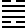
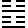
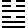
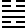

# Imperially Compiled Balanced Interpretations of the Zhou Changes

## Juan Seven · 卷七

The Lower Classic: The Well through Abundance. [Chinese source](../source/juan-07.md) · [Translation conventions](README.md)

**Voices:** “Original Meaning” is Zhu Xi; “Cheng's Commentary” is Cheng Yi; “Editorial Judgment” belongs to the imperial compilers. Translator’s notes appear separately at the end.

[48. Jing 井](#eee-4620) | [49. Ge 革](#eee-4621) | [50. Ding 鼎](#eee-4622) | [51. Zhen 震](#eee-4623) | [52. Gen 艮](#eee-4624) | [53. Jian 漸](#eee-4625) | [54. Guimei 歸妹](#eee-4626) | [55. Feng 豐](#eee-4627)

## 48. Jing 井 — The Well

<!-- Source: https://www.eee-learning.com/book/4620 -->

<!-- BEGIN TRANSLATION: eee-4620:001 -->

 **Jing 井 — The Well** — Xun below; Kan above.[^j07-well]

<!-- END TRANSLATION: eee-4620:001 -->

<!-- BEGIN TRANSLATION: eee-4620:002 -->

**Cheng's Commentary.** Concerning The Well, the *Sequence of the Hexagrams* says: “Those oppressed above must return below; therefore Oppression is followed by The Well.” This continues the preceding statement that unceasing ascent must lead to oppression: when one rises without stopping and becomes exhausted, one must return below. Among things situated below, none is more so than a well; this is why The Well follows Oppression. The hexagram has Kan above and Xun below. Kan is water. Xun's image is wood; its meaning is entering. Wood gives the image of a vessel. Wood enters beneath the water and brings the water up: the image of drawing from a well.

<!-- END TRANSLATION: eee-4620:002 -->

<!-- BEGIN TRANSLATION: eee-4620:003 -->

### The Well: the settlement may change, but not the well. Neither loss nor gain. Those going and coming draw from the well. Almost there, yet the rope has not drawn clear of the well; the vessel breaks. Misfortune.[^j07-well-judgment]

<!-- END TRANSLATION: eee-4620:003 -->

<!-- BEGIN TRANSLATION: eee-4620:004 -->

**Original Meaning.** A well is a place where the earth is pierced to bring forth water. Xun's wood enters beneath Kan's water and brings that water upward; hence The Well. The settlement changes but the well does not: thus there is neither loss nor gain, and those going and coming all draw from its well. *Qi* means almost; *yu*, the well-rope; *lei*, to ruin. When drawing from the well, one almost reaches the top, but before the rope has been drawn all the way up, the vessel breaks: misfortune. The prognostication is that affairs remain as before, without gain or loss. Yet one must also be reverent and diligent, not allowing near-completion to end in failure.[^j07-jing-readings]

<!-- END TRANSLATION: eee-4620:004 -->

<!-- BEGIN TRANSLATION: eee-4620:005 -->

**Cheng's Commentary.** A well is something constant that cannot be changed. A settlement can be moved elsewhere, but a well cannot be relocated; hence “the settlement may change, but not the well.” Draw from it and it is not exhausted; leave it alone and it does not overflow: neither loss nor gain. All who arrive receive its use: those going and coming draw from the well. Neither loss nor gain means that its virtue is constant; those going and coming drawing from it means that its use reaches all. Constancy and all-embracing service are the Way of The Well. *Qi* means almost; *yu*, the well-rope. A well fulfills its purpose by furnishing something useful. Almost reaching that purpose without yet providing its use is no different from never having lowered the rope into the well. The noble person's Way prizes completion. Thus the five grains, if they do not ripen, are inferior to wild grasses; a well dug nine fathoms deep without reaching a spring is still an abandoned well. Having the capacity to benefit things without yet benefiting them is as though one had none. If the vessel is broken and lost, its use is gone; hence misfortune. *Lei* means to damage and ruin.

<!-- END TRANSLATION: eee-4620:005 -->

<!-- BEGIN TRANSLATION: eee-4620:006 -->

**Collected Explanations.**

<!-- END TRANSLATION: eee-4620:006 -->

<!-- BEGIN TRANSLATION: eee-4620:007 -->

**Zheng Kangcheng:** The well supplies water that can be drawn without exhaustion, just as a ruler nourishes all under Heaven through government and instruction, his beneficence without end.

<!-- END TRANSLATION: eee-4620:007 -->

<!-- BEGIN TRANSLATION: eee-4620:008 -->

**Qiu Fuguo:** “The settlement may change, but not the well” describes the well's constitution; “neither loss nor gain,” its virtue; “those going and coming draw from the well,” its use. These three clauses concern the well itself. “Almost there, yet the rope has not drawn clear of the well” means that its use has not yet been realized. “The vessel breaks” means that its use is lost. These two clauses concern drawing from the well.

<!-- END TRANSLATION: eee-4620:008 -->

<!-- BEGIN TRANSLATION: eee-4620:009 -->

**Editorial Judgment.** Explanations of “the settlement may change, but not the well” often miss its meaning. The wording means that, in whatever settlement they are found, wells do not differ in their construction—as with the thousand wells uniformly lined wherever Zhuge Kongming's army marched. The analogy is to the practice of the kingly Way: government does not differ from state to state, nor customs from household to household. “Neither loss nor gain” means that the well neither overflows nor dries up, illustrating the Way's capacity to endure. “Those going and coming draw from the well” means that many receive its benefit, illustrating the Way's capacity for greatness. These three clauses all concern the well; in human affairs, it is the ruler's government that nourishes the people. Yet although the well can benefit things, a vessel draws from it. Although government can nourish the people, human beings carry it out. Without a vessel, the water's benefit cannot ascend; without the right people, the ruler's beneficence cannot reach all below. Thus “almost there” and the following words turn to the work of drawing from the well.[^j07-well-analogy]

<!-- END TRANSLATION: eee-4620:009 -->

<!-- BEGIN TRANSLATION: eee-4620:010 -->

### First Six: The well is muddy; no one drinks. No birds come to the old well.

<!-- END TRANSLATION: eee-4620:010 -->

<!-- BEGIN TRANSLATION: eee-4620:011 -->

**Original Meaning.** In The Well, yang firmness constitutes the spring, and bringing water upward constitutes its accomplishment. The first six is yin below; hence this image. When a well yields mud rather than spring water, people do not drink from it, and birds pay it no attention either.

<!-- END TRANSLATION: eee-4620:011 -->

<!-- BEGIN TRANSLATION: eee-4620:012 -->

**Cheng's Commentary.** The Well and The Cauldron are both actual objects, and their meanings are drawn from those objects. A yielding yin line below, without correspondence or support above, gives no image of raising water. Unable to benefit things, it is a well from which no one can drink. The well cannot be drunk from because its water is muddy and foul. Being at the bottom of the well gives the image of mud. A well's use is to nourish people with its water. Without water, it is abandoned and left unused. When the well's water is brought up, people obtain its use, and birds also approach and seek it. At an old, abandoned well, people no longer drink and water is no longer raised, so birds no longer come either: nothing is offered to sustain them. A well is by nature something that benefits people. Here, yin dwelling below gives no image of raising water, hence “no one drinks”; the water is undrinkable because of mud. So too, someone living in a time when things call for assistance, yet whose ability is weak and who lacks support, cannot extend benefit to others and is passed over by the age.

<!-- END TRANSLATION: eee-4620:012 -->

<!-- BEGIN TRANSLATION: eee-4620:013 -->

**Collected Explanations.**

<!-- END TRANSLATION: eee-4620:013 -->

<!-- BEGIN TRANSLATION: eee-4620:014 -->

**Wang Bi:** It is at the very bottom of the well and has no correspondent above, sunk and stagnant amid sediment and filth; hence “the well is muddy; no one drinks.” A muddy, undrinkable well is an old well that has not been dredged and put in order. Birds do not turn toward an old, uncleansed well; how much less do people!

<!-- END TRANSLATION: eee-4620:014 -->

<!-- BEGIN TRANSLATION: eee-4620:015 -->

**Cai Qing:** In The Well, yang firmness makes the spring, whereas the first six is yielding yin: hence the muddy well and the old well. The Well's accomplishment lies in bringing water up, whereas the first six remains below: hence no drinking and no birds.

<!-- END TRANSLATION: eee-4620:015 -->

<!-- BEGIN TRANSLATION: eee-4620:016 -->

### Nine in the Second Place: The well's hollow shoots water upon the small fish. The jar is broken and leaks.[^j07-well-fish]

<!-- END TRANSLATION: eee-4620:016 -->

<!-- BEGIN TRANSLATION: eee-4620:017 -->

**Original Meaning.** The second nine is firm and centered, giving the image of a spring. Yet it has no proper correspondent above and adjoins the first six below; its benefit does not ascend. Hence this image.

<!-- END TRANSLATION: eee-4620:017 -->

<!-- BEGIN TRANSLATION: eee-4620:018 -->

**Cheng's Commentary.** Although the second has the ability of yang firmness, it dwells below, without correspondence above and adjoining the first: an image of turning downward rather than upward. The Way of a well is to rise upward; water in a ravine flows out sideways and makes for the lower ground. The second, situated in The Well, turns downward, losing the well's Way and making the well like a ravine. Water raised from a well nourishes people and benefits things. Here it descends instead into foul mud and pours only upon the *fu*. Some take *fu* to mean a shrimp, others a toad: simply a small creature in the well's mud. “Shoots” means pours, like a ravine's descending stream pouring upon these creatures. “The jar is broken and leaks” is like a jar that has cracked and lets its water escape. Yang-firm ability could originally nourish people and benefit things, but without correspondence and support above, it cannot rise and turns downward; hence it achieves no useful service. Water in a jar could be used, but if the jar cracks and leaks, the water is of no use. Why do the first and second lines of The Well accomplish nothing, yet receive no verdict of regret or blame? Someone asks: “Failure brings regret, and transgression brings blame. Without support, being unable to realize one's use—is that not regret or blame? Dwelling in the second place and associating with the first—is that not a fault?” The answer is: “Dwelling in the center is no fault. Its inability to rise is due to lack of support, not to adjoining the first.”

<!-- END TRANSLATION: eee-4620:018 -->

<!-- BEGIN TRANSLATION: eee-4620:019 -->

**Collected Explanations.**

<!-- END TRANSLATION: eee-4620:019 -->

<!-- BEGIN TRANSLATION: eee-4620:020 -->

**Zhang Zhenyuan:** As an image of the well, it is a spring in the well's hollow that pours only downward upon the small fish. As an image of drawing from a well, it is a broken jar whose water leaks back down.

<!-- END TRANSLATION: eee-4620:020 -->

<!-- BEGIN TRANSLATION: eee-4620:021 -->

**Editorial Judgment.** The well's hollow is the opening within it through which water issues. If a well brings forth water, it is not a muddy well. Yet its benefit extends only far enough to pour upon small fish because there is no one above to draw it up. It is as though the vessel were broken and leaking: plainly, it cannot by itself serve human use. In the hexagram as a whole, the well represents government, and the one drawing from it represents the person who carries government out. In the lower trigram's lines, the well represents a person of ability and virtue, and the one drawing represents the ruler who advances and employs that person. In the upper trigram, the well represents a ruler possessing both virtue and position, and those drawing represent the multitude who receive his beneficence. These three meanings follow from one another, though their analogies differ.

<!-- END TRANSLATION: eee-4620:021 -->

<!-- BEGIN TRANSLATION: eee-4620:022 -->

### Nine in the Third Place: The well is cleansed, but no one drinks. It grieves my heart. Its water can be drawn. Were the king enlightened, we would all receive its blessing.[^j07-well-heart]

<!-- END TRANSLATION: eee-4620:022 -->

<!-- BEGIN TRANSLATION: eee-4620:023 -->

**Original Meaning.** “Cleansed” means that no foulness is allowed to remain. A well is cleansed, yet no one drinks, causing sorrow in people's hearts. Its water can be drawn. With an enlightened king, water would be drawn from the well to benefit others, and giver and recipient alike would receive its blessing. The third nine is yang in a yang place, at the top of the lower trigram, but not yet employed by its time; hence this image and prognostication.

<!-- END TRANSLATION: eee-4620:023 -->

<!-- BEGIN TRANSLATION: eee-4620:024 -->

**Cheng's Commentary.** The third, with yang firmness, occupies a correct position: it possesses ability that can furnish useful service. At the top of the well's lower part, it is clean water fit to drink. The well's use lies above; dwelling below, this line has not yet attained its use. Yang's nature is to rise, and its intention also responds to the top six. Firmly placed and beyond the center, it is eager to advance: able to serve, yet impatient to act. Still unused, it resembles a well that has been dredged and cleansed but whose water remains undrunk, making the heart ache. In the time of The Well, the third is firm but not centered, and therefore presses eagerly to act. It differs from one who acts when employed and withdraws when set aside. Yet does an enlightened king demand perfection in those he employs? Thus, with an enlightened king, there is blessing. The third's ability is sufficient for useful service, like a clean well from which water may be drawn and drunk. If an enlightened king is above, he should employ it and obtain its results. When worthy talent is employed, the worthy person practices his Way, the ruler enjoys the accomplishment, and those below receive the beneficence: above and below share the blessing.

<!-- END TRANSLATION: eee-4620:024 -->

<!-- BEGIN TRANSLATION: eee-4620:025 -->

**Collected Explanations.**

<!-- END TRANSLATION: eee-4620:025 -->

<!-- BEGIN TRANSLATION: eee-4620:026 -->

**Cai Qing:** In “it grieves my heart,” “my” refers to an onlooker: it is the distress felt on another's behalf, not the third nine's own distress. “Its water can be drawn,” together with “were the king enlightened, we would all receive its blessing,” all belong to the words of this grieving observer.

<!-- END TRANSLATION: eee-4620:026 -->

<!-- BEGIN TRANSLATION: eee-4620:027 -->

**Editorial Judgment.** The text does not say “an enlightened king,” but “the king enlightened”: these are the grieving person's words of prayer. They mean: “If the king were enlightened, all of us would receive its blessing.”

<!-- END TRANSLATION: eee-4620:027 -->

<!-- BEGIN TRANSLATION: eee-4620:028 -->

### Six in the Fourth Place: The well is lined with masonry. No blame.[^j07-well-lining]

<!-- END TRANSLATION: eee-4620:028 -->

<!-- BEGIN TRANSLATION: eee-4620:029 -->

**Original Meaning.** Six in the fourth place is correctly placed, yet yielding yin does not constitute a spring. It can only repair and put things in order, without accomplishing benefit for others. Thus its image is lining the well, and its prognostication is no blame. If the diviner can attend to self-cultivation and repair, then, even without accomplishing benefit for others, there can still be no blame.

<!-- END TRANSLATION: eee-4620:029 -->

<!-- BEGIN TRANSLATION: eee-4620:030 -->

**Cheng's Commentary.** Although the fourth is yielding yin, it is correctly placed and supports the ruler at the fifth nine above. Its ability is insufficient to spread benefit widely, but it can preserve itself; thus, by repairing and putting things in order, it avoids blame. *Zhou* means laying courses of masonry: repairing the well. Though weak in ability and unable to achieve far-reaching benefit, the fourth can tend its affairs so that they do not fall into neglect. If it could not put them in order, and allowed the well's work of nourishing people to lapse, it would lose the well's Way and incur great blame. Occupying a high position under a yang-firm, centered, correct ruler, merely keeping to correctness, supporting those above, and not abandoning one's responsibilities can also suffice to avoid blame.

<!-- END TRANSLATION: eee-4620:030 -->

<!-- BEGIN TRANSLATION: eee-4620:031 -->

**Collected Explanations.**

<!-- END TRANSLATION: eee-4620:031 -->

<!-- BEGIN TRANSLATION: eee-4620:032 -->

**Qiu Fuguo:** The third belongs to the inner trigram and dredges the well's interior to make it clean. The fourth belongs to the outer trigram and lines the well's outside to keep foulness away. Without dredging, the foul cannot become clean; without lining, the clean is easily fouled.

<!-- END TRANSLATION: eee-4620:032 -->

<!-- BEGIN TRANSLATION: eee-4620:033 -->

**Lai Zhide:** The fourth six is yielding yin, correctly placed and near the ruler at the fifth nine. It repairs the well so as to hold the fifth nine's cold spring water. If the diviner can put the duties of a minister in order, then through the ruler he can complete the well's work of nourishment. Thus there is no blame.

<!-- END TRANSLATION: eee-4620:033 -->

<!-- BEGIN TRANSLATION: eee-4620:034 -->

### Nine in the Fifth Place: The well is clear: cold spring water to drink.[^j07-well-clear]

<!-- END TRANSLATION: eee-4620:034 -->

<!-- BEGIN TRANSLATION: eee-4620:035 -->

**Original Meaning.** *Lie* means clean. Yang-firm, centered and correct, its accomplishment reaches others; hence this image. A diviner possessing its virtue accords with its image.

<!-- END TRANSLATION: eee-4620:035 -->

<!-- BEGIN TRANSLATION: eee-4620:036 -->

**Cheng's Commentary.** The fifth, yang-firm, centered and correct, occupies the honored position. Its ability and virtue are good and beautiful in every respect: “the well is clear: cold spring water to drink.” *Lie* means sweet and clean. Coldness is prized in well-water; a sweet, clean, cold spring can supply people with drink. This is the utmost goodness of the well's Way. Yet why is good fortune not stated? The well's accomplishment consists in bringing water all the way up. Until it reaches the top, its use has not been realized. Thus supreme good fortune is pronounced only at the top.

<!-- END TRANSLATION: eee-4620:036 -->

<!-- BEGIN TRANSLATION: eee-4620:037 -->

**Collected Explanations.**

<!-- END TRANSLATION: eee-4620:037 -->

<!-- BEGIN TRANSLATION: eee-4620:038 -->

**Yi Fu:** Both the third and fifth are clean spring water. The third lies below the lining: water not yet drawn, hence “no one drinks.” The fifth has come out above the lining: water already drawn, hence “drink.”

<!-- END TRANSLATION: eee-4620:038 -->

<!-- BEGIN TRANSLATION: eee-4620:039 -->

### Top Six: Water is drawn from the well. Do not cover it. There is trustworthiness. Supreme good fortune.[^j07-well-open]

<!-- END TRANSLATION: eee-4620:039 -->

<!-- BEGIN TRANSLATION: eee-4620:040 -->

**Original Meaning.** *Shou* means drawing water. Chao says it refers to the windlass winding in the well-rope; this also makes sense. “Cover” means to screen or close over. “There is trustworthiness” means that what flows forth has a source and does not run out. The well fulfills its work by bringing water upward, and Kan's mouth is not covered. Thus, although the top six is not yang-firm, its image is as stated. Yet for the diviner to answer to this image, there must be trustworthiness; only then is there supreme good fortune.

<!-- END TRANSLATION: eee-4620:040 -->

<!-- BEGIN TRANSLATION: eee-4620:041 -->

**Cheng's Commentary.** The well serves its purpose by bringing water upward. At the well's top, its Way is accomplished. *Shou* means drawing water; “cover” means to screen or close over. Drawing without covering makes its benefit inexhaustible. The well's bounty is broad and great! “There is trustworthiness” means constancy without change. To give widely and with constancy is the good fortune of great goodness. Who but a great person can embody the well's use, giving widely and with constancy? The endings of other hexagrams signify extremity and change; only in The Well and The Cauldron does the ending signify completed accomplishment. Hence good fortune.

<!-- END TRANSLATION: eee-4620:041 -->

<!-- BEGIN TRANSLATION: eee-4620:042 -->

**Editorial Judgment.** “Do not cover it” means that drawing is unrestricted: precisely “those going and coming draw from the well.” “There is trustworthiness” means that its source is inexhaustible: precisely “neither loss nor gain.” This line fully embodies the hexagram's meaning. Entering the water and bringing it upward reaches its utmost ascent at this line.

<!-- END TRANSLATION: eee-4620:042 -->

<!-- BEGIN TRANSLATION: eee-4620:043 -->

**General Discussion.**

<!-- END TRANSLATION: eee-4620:043 -->

<!-- BEGIN TRANSLATION: eee-4620:044 -->

**Li Guo:** The first's muddy well and the second's hollow well are both disused wells. The third's cleansing removes the first's mud; the fourth's masonry lines the second's hollow. Once both dredged and lined, the well's Way is complete. Thus at the fifth the well is clear and its spring cold; at the top its water is drawn and it is not covered. Its accomplishment now reaches others, and the well's Way achieves its full completion.

<!-- END TRANSLATION: eee-4620:044 -->

<!-- BEGIN TRANSLATION: eee-4620:045 -->

**Qiu Fuguo:** Earlier scholars take the three yang lines as the spring and the three yin as the well: an image of yang's substance and yin's emptiness. The second nine says “the well's hollow shoots water upon the small fish”; the third, “the well is cleansed, but no one drinks”; the fifth, “the well is clear: cold spring water.” Are shooting, cleansing, and clarity not images of the spring? The first six says “the well is muddy; no one drinks”; the fourth, “the well is lined with masonry; no blame”; the top, “water is drawn from the well; do not cover it.” Are mud, masonry, and drawing not images of the well? In the sequence of the lines, the second's shooting is a spring just opening a passage; the third's cleansing, a spring already clean; the fifth's clarity, a spring fit to drink. The first's mud is a well being dug; the fourth's masonry, a well repaired; the top's drawing, a well already supplying water. Again, taking the lines in pairs, the first and second are both at the well's bottom and not yet in use: hence mud at the first and a hollow at the second. The third and fourth are both in the well's middle and about to come into use: hence cleansing at the third and lining at the fourth. The fifth and top are both at the well's upper part and already in use: hence drinking at the fifth and drawing at the top.

<!-- END TRANSLATION: eee-4620:045 -->

## 49. Ge 革 — Revolution

<!-- Source: https://www.eee-learning.com/book/4621 -->

<!-- BEGIN TRANSLATION: eee-4621:001 -->

 **Ge 革 — Revolution** — Li below; Dui above.[^j07-revolution]

<!-- END TRANSLATION: eee-4621:001 -->

<!-- BEGIN TRANSLATION: eee-4621:002 -->

**Cheng's Commentary.** Concerning Revolution, the *Sequence of the Hexagrams* says: “The Way of The Well cannot remain without renewal; therefore The Well is followed by Revolution.” Leave a well unchanged and it becomes foul; renew it and it becomes clean. Renewal is indispensable, and so Revolution follows The Well. The hexagram has Dui above and Li below: fire within the lake. Ge means transformation and renewal. Water and fire extinguish one another: water puts out fire, and fire dries up water. They transform one another. Fire's nature is to rise, water's to descend. If they moved away from one another, there would merely be Opposition. Here fire is below and water above: they approach, overcome, and extinguish one another. Hence Revolution. Again, two daughters dwell together, yet each has a different destination. Their intentions differ and they cannot accommodate one another; this too gives Revolution.

<!-- END TRANSLATION: eee-4621:002 -->

<!-- BEGIN TRANSLATION: eee-4621:003 -->

### Revolution: only after the day has passed is there trust. Supreme success. Steadfastness in what is right is beneficial. Regret disappears.[^j07-ge-day]

<!-- END TRANSLATION: eee-4621:003 -->

<!-- BEGIN TRANSLATION: eee-4621:004 -->

**Original Meaning.** Ge means transformation and renewal. Dui's lake is above and Li's fire below: if the fire burns, the water dries up; if the water breaks through, the fire goes out. The middle and youngest daughters form one hexagram, but the younger is above and the middle below, their intentions at odds; hence Revolution. At the beginning of change, people do not yet trust it; only after the day has passed do they trust. Moreover, within there is the virtue of patterned clarity, and without, a spirit of harmony and joy. Thus the prognostication is that whatever is reformed will achieve great success and attain correctness. All that is changed is fitting, and the regret associated with change disappears. If anything is not correct, the reform will gain neither trust nor free passage and will instead bring regret.

<!-- END TRANSLATION: eee-4621:004 -->

<!-- BEGIN TRANSLATION: eee-4621:005 -->

**Cheng's Commentary.** Revolution means changing what is old. When the old is changed, people cannot immediately trust; only after the day has passed do their hearts trust and follow. “Supreme success; steadfastness in what is right is beneficial; regret disappears”: only after things become defective and corrupted should they be reformed. Reform is the means of restoring free passage; thus reform can bring great success. If reform accords with the correct Way, it can endure and fulfills the purpose of removing what is outworn. There is then no regret over the change: regret disappears. Even reform that brings no substantial benefit is regrettable; how much more reform that does harm! This is why the ancients treated alteration and innovation as weighty matters.

<!-- END TRANSLATION: eee-4621:005 -->

<!-- BEGIN TRANSLATION: eee-4621:006 -->

**Collected Explanations.**

<!-- END TRANSLATION: eee-4621:006 -->

<!-- BEGIN TRANSLATION: eee-4621:007 -->

**Li Jian:** “The day has passed” means that the time when reform can take place has now arrived. Reform before its time arouses suspicion rather than trust; hence only when that day has come is there trust. “Supreme success; steadfastness in what is right is beneficial” means that exhaustion gives rise to change, which certainly offers a way to great passage, but the benefit lies in not losing correctness. With correctness, regret disappears.

<!-- END TRANSLATION: eee-4621:007 -->

<!-- BEGIN TRANSLATION: eee-4621:008 -->

**He Kai:** The Judgment's “day” is the same as the day mentioned at the second six. “There is trust” is the trust spoken of at the third, fourth, and fifth nines. “Regret disappears” is the disappearance of regret at the fourth nine. The day is mentioned because affairs under Heaven must not be transformed lightly or hastily: only then can one gain people's trust. “Only then” expresses the difficulty of attaining it. In the lower three lines, one is just seeking to replace the old with the new; hence their emphasis on caution and not changing lightly. In the upper three, the old has already been changed into the new. The fourth nine stands at the meeting of the lower and upper trigrams, precisely the time of changing the mandate. Thus regret disappears expressly at the fourth nine, just as the *Commentary on the Judgment* says: “When reform is fitting, only then does its regret disappear.”

<!-- END TRANSLATION: eee-4621:008 -->

<!-- BEGIN TRANSLATION: eee-4621:009 -->

**Editorial Judgment.** Li's and He's explanations of “only after the day has passed is there trust” are preferable. The hexagram Judgment and the line statement should not contradict one another.

<!-- END TRANSLATION: eee-4621:009 -->

<!-- BEGIN TRANSLATION: eee-4621:010 -->

### First Nine: Bind fast with the hide of a yellow ox.[^j07-ge-oxhide]

<!-- END TRANSLATION: eee-4621:010 -->

<!-- BEGIN TRANSLATION: eee-4621:011 -->

**Original Meaning.** Although this is a time of reform, the line occupies the beginning and has no correspondent: it is not yet possible to act. Hence this image. *Gong* means to secure. Yellow is the central color; the ox is a compliant creature. Hide secures things. The word is drawn from the hexagram's name, although its meaning here differs. The prognostication calls for firm, resolute self-restraint, not undertaking action. Such is the sage's caution concerning reform.

<!-- END TRANSLATION: eee-4621:011 -->

<!-- BEGIN TRANSLATION: eee-4621:012 -->

**Cheng's Commentary.** Reform is a great undertaking. There must be the right time, the right position, and the requisite ability; one must deliberate carefully and act cautiously before regret can be avoided. In terms of time, this nine is at the beginning. Acting at an affair's beginning gives an image of haste and rashness rather than considered caution. In terms of position, it is below. Without a fitting time or support, acting from below incurs the blame of presumptuous interference, without the weight of established standing and authority. In terms of ability, it is yang and belongs to Li. Li's nature rises, and the firm constitution is vigorous: both are quick to act. With ability of this kind, action would bring misfortune and blame. Firm but not centered, and impetuous in constitution, it lacks centeredness and compliance. It should bind itself through centered compliance and refrain from reckless movement. *Gong* means to restrain and bind; hide is used for enclosing and binding. Yellow is the central color, and the ox is compliant. “Bind fast with the hide of a yellow ox” means to secure oneself through centered compliance and avoid reckless action. Why are neither good fortune nor misfortune stated? Reckless movement would bring misfortune and blame; securing oneself through centered compliance merely means not making the change. How could good fortune or misfortune be pronounced outright?[^j07-ge-readings]

<!-- END TRANSLATION: eee-4621:012 -->

<!-- BEGIN TRANSLATION: eee-4621:013 -->

**Collected Explanations.**

<!-- END TRANSLATION: eee-4621:013 -->

<!-- BEGIN TRANSLATION: eee-4621:014 -->

**Gan Bao:** At the beginning of Revolution, one cannot yet act; hence “bind fast with the hide of a yellow ox.”

<!-- END TRANSLATION: eee-4621:014 -->

<!-- BEGIN TRANSLATION: eee-4621:015 -->

**Liu Mu:** A low position is not a position from which to reform; the beginning is not the time to reform. What matters is holding firmly to centered compliance and not daring to make a change.

<!-- END TRANSLATION: eee-4621:015 -->

<!-- BEGIN TRANSLATION: eee-4621:016 -->

**Lü Dalin:** The first nine stands at Revolution's beginning, below and without official position. It adjoins the second six but has no proper correspondent above. Although it possesses firm virtue, it should not presume to act on its own. It can only bind itself to the second six for security: hence “bind fast with the hide of a yellow ox.” The second six is centered, yielding and compliant, hence the yellow ox, with the same meaning as at Retreat's second six.

<!-- END TRANSLATION: eee-4621:016 -->

<!-- BEGIN TRANSLATION: eee-4621:017 -->

**Gong Huan:** The *Changes* speaks of “the hide of a yellow ox” twice. Retreat's second six is centered and has a correspondent: it wishes to withdraw but cannot withdraw. Revolution's first nine is below and has no correspondent: it is a time of reform, but this line cannot reform. What the images refer to differs, but their meanings are closely related.

<!-- END TRANSLATION: eee-4621:017 -->

<!-- BEGIN TRANSLATION: eee-4621:018 -->

**Editorial Judgment.** The meaning of alteration is drawn from hide. Hide is the skin of birds and beasts. As they pass through the four seasons, their skin and coat change, as in the *Canon of Yao*'s references to thinning the coat and renewing the fur. This is why the six lines take the ox, tiger, and leopard as images. Oxhide is exceptionally tough and durable, difficult to alter. Used to tie something, it holds firmly: thus the fastening at Retreat's second line resembles it. Used to wrap something, it encloses closely: thus the securing at Revolution's first line resembles it.

<!-- END TRANSLATION: eee-4621:018 -->

<!-- BEGIN TRANSLATION: eee-4621:019 -->

### Six in the Second Place: Only after the day has passed make the change. Going forward brings good fortune. No blame.

<!-- END TRANSLATION: eee-4621:019 -->

<!-- BEGIN TRANSLATION: eee-4621:020 -->

**Original Meaning.** The second six is yielding, compliant, centered and correct. It governs patterned clarity and has a correspondent above. Under these conditions, reform is possible. Yet one must wait until the day has passed before reforming; then going forward brings good fortune without blame. The diviner is warned that change must still not be made precipitately.

<!-- END TRANSLATION: eee-4621:020 -->

<!-- BEGIN TRANSLATION: eee-4621:021 -->

**Cheng's Commentary.** Six in the second place is yielding and compliant, centered and correct. It also governs patterned clarity, and above there is a yang-firm ruler, corresponding through like virtue. Centered correctness excludes bias and obscurity; patterned clarity comprehends the principles of affairs; correspondence above provides power and authority; a compliant constitution excludes contrariness. The time is fitting, the position attained, and the ability sufficient: this is the best possible way of occupying Revolution. Yet the minister's Way must not take the lead in reform, and one must also await trust between above and below; hence only after the day has passed is the change made. With the second's ability and virtue, its position and the time it encounters, it can reform the world's defects and renew its government. It should advance to assist the ruler and carry out its Way: then there is good fortune without blame. Not advancing would miss the time for action and incur blame. The second's constitution is yielding and its position appropriate. Yieldingness makes it slow to advance; an appropriate position makes it settled in place. Reform is a great undertaking; hence this warning. Centered and responding to firmness, the second has not yet fallen into an excess of yieldingness. The sage clarifies the meaning because there is nevertheless something to guard against, so that worthy ability does not miss its opportunity to act.

<!-- END TRANSLATION: eee-4621:021 -->

<!-- BEGIN TRANSLATION: eee-4621:022 -->

**Collected Explanations.**

<!-- END TRANSLATION: eee-4621:022 -->

<!-- BEGIN TRANSLATION: eee-4621:023 -->

**Wang Zongchuan:** The second six, through centered and correct virtue, responds above to the centered and correct ruler at the fifth nine. In Revolution's time, this is the hexagram's “only after the day has passed is there trust.” Hence “only after the day has passed make the change; going forward brings good fortune, no blame.”

<!-- END TRANSLATION: eee-4621:023 -->

<!-- BEGIN TRANSLATION: eee-4621:024 -->

**Xiong Liangfu:** The second six governs the inner trigram; hence the Judgment's day appears here. The hexagram says that only then is there trust, and the line says that only then is change made: trust precedes reform.

<!-- END TRANSLATION: eee-4621:024 -->

<!-- BEGIN TRANSLATION: eee-4621:025 -->

### Nine in the Third Place: Going forward brings misfortune. Steadfastness brings danger. When words of reform have been agreed upon three times, there is trust.[^j07-ge-three]

<!-- END TRANSLATION: eee-4621:025 -->

<!-- BEGIN TRANSLATION: eee-4621:026 -->

**Original Meaning.** Excessively firm and not centered, at Li's extreme, this is one who acts impetuously in reform. Hence the prognostication warns of misfortune in going forward and danger in steadfastness. Yet the time does call for reform; when discussion of reform has reached agreement three times, there is trust and reform may proceed.

<!-- END TRANSLATION: eee-4621:026 -->

<!-- BEGIN TRANSLATION: eee-4621:027 -->

**Cheng's Commentary.** The third nine, yang-firm at the top of the lower trigram and at Li's upper end, without centeredness, is impetuous in reform. Being below and rashly seeking change, it would meet misfortune if it acted in this way. Yet it stands at the head of the lower part: if affairs require reform, how can it do nothing? It must preserve steadfast correctness, remain aware of danger, and follow public deliberation; then it can act without doubt. “Words of reform” means discussion of what ought to be changed. *Jiu* means completion and agreement. Examine the arguments for reform: when three examinations all agree, they may be trusted. This expresses the utmost caution. Acting thus must lead to what is entirely fitting; then there is trust. One is oneself trustworthy and trusted by the multitude. Under these conditions, reform is possible. In a time of reform, at the head of the lower trigram, failure to carry out needed change through fear would miss the time and cause harm. One must simply exercise the utmost caution, not rely solely on one's own firmness and clarity, but examine public judgment, reforming only after threefold agreement. Then there is no error.

<!-- END TRANSLATION: eee-4621:027 -->

<!-- BEGIN TRANSLATION: eee-4621:028 -->

**Collected Explanations.**

<!-- END TRANSLATION: eee-4621:028 -->

<!-- BEGIN TRANSLATION: eee-4621:029 -->

**Lü Dalin:** The third nine stands at the top of the lower trigram. From the first through the third, all three lines have been traversed: reform has proceeded by stages and its course is completed. Hence “words of reform have been agreed upon three times.” By the third, the people trust it; hence “there is trust.”

<!-- END TRANSLATION: eee-4621:029 -->

<!-- BEGIN TRANSLATION: eee-4621:030 -->

**Gong Huan:** With the third nine's excessive firmness, impetuously going forward brings misfortune. Yet in a time that calls for reform, rigidly preserving oneself brings danger. Only by carefully examining proposals for change until they have reached threefold agreement does one avoid both the misfortune of rash action and the danger of inflexible persistence. Attaining what the time requires is what makes reform possible.

<!-- END TRANSLATION: eee-4621:030 -->

<!-- BEGIN TRANSLATION: eee-4621:031 -->

**Hu Bingwen:** Because it is excessively firm, there is concern that it will advance without stopping and meet misfortune. Because it is not centered, there is also concern that it will cling exclusively to fixed correctness and lose the meaning of change, thus encountering danger. Therefore the arguments for reform must reach threefold agreement. Repeated examination establishes trust, and reform becomes possible.

<!-- END TRANSLATION: eee-4621:031 -->

<!-- BEGIN TRANSLATION: eee-4621:032 -->

### Nine in the Fourth Place: Regret disappears. There is trust. Change the mandate. Good fortune.[^j07-ge-mandate]

<!-- END TRANSLATION: eee-4621:032 -->

<!-- BEGIN TRANSLATION: eee-4621:033 -->

**Original Meaning.** Yang occupying yin gives regret. Yet the hexagram has passed its middle, and the line stands where water meets fire: this is the time for reform. Moreover, firmness and yieldingness are without bias, providing the means of reform; hence regret disappears. Nevertheless, there must be trust before reform can bring good fortune. This makes clear that the diviner must possess the virtue, encounter the right time, and also have trust; only then does regret disappear and good fortune follow.

<!-- END TRANSLATION: eee-4621:033 -->

<!-- BEGIN TRANSLATION: eee-4621:034 -->

**Cheng's Commentary.** At the fourth nine, reform is at its height. Yang firmness is its capacity for reform. Leaving the lower trigram and entering the upper is its time for reform. Dwelling at the junction of water and fire is its situation for reform. Holding a position near the ruler is its responsibility for reform. Having no binding correspondent below is its resolve for reform. Nine occupying the fourth place, where firmness and yieldingness meet, is its means of reform. Possessing all these, the fourth may truly be said to occupy the time for reform. Only when affairs give cause for regret are they reformed; when reform is appropriate, regret disappears. Once reform is appropriate, what matters is carrying it out with utmost sincerity. Thus, with trust, changing the mandate brings good fortune. “Change the mandate” means altering what is done: reforming it. Once affairs are properly handled and abuses removed, action undertaken sincerely is trusted above and followed below; good fortune is evident. Why is the fourth supremely good although it is neither centered nor formally correct? Precisely because it occupies yieldingness: firm without excess, near without encroaching, compliantly supporting a centered and correct ruler. It is thus a centered and correct person. The *Changes* has no fixed rule for selecting its meanings; it follows the time.

<!-- END TRANSLATION: eee-4621:034 -->

<!-- BEGIN TRANSLATION: eee-4621:035 -->

**Collected Explanations.**

<!-- END TRANSLATION: eee-4621:035 -->

<!-- BEGIN TRANSLATION: eee-4621:036 -->

**Yu Fan:** Deliberation before reform is called “words”; the enactment of reform is called a “mandate.”

<!-- END TRANSLATION: eee-4621:036 -->

<!-- BEGIN TRANSLATION: eee-4621:037 -->

**Lu Xisheng:** The reform is appropriate, and so regret disappears. Once people trust it, ordinances inconvenient for the people can be changed, bringing good fortune.

<!-- END TRANSLATION: eee-4621:037 -->

<!-- BEGIN TRANSLATION: eee-4621:038 -->

**Liu Mu:** The constitution of Revolution is completed in this one line. From the first through the third, the course of reform has taken shape; hence the lower three line statements all display the word *ge*. At the fourth, the statement is simply: “Regret disappears; there is trust; change the mandate; good fortune.”

<!-- END TRANSLATION: eee-4621:038 -->

<!-- BEGIN TRANSLATION: eee-4621:039 -->

**Classified Conversations of Master Zhu.** Someone asked: “Revolution's lower three lines stress caution and reluctance to change; the upper three show reform successfully carried out. Affairs have an old and a new state: the lower three represent the old. Before making the change, one must carefully examine what precedes it; in the upper three, affairs have been transformed into the new.” Zhu replied: “Yes. In Qian, when the fourth nine is reached, the text says, ‘The Way of Qian now changes.’ There too, it is at this point that change begins.”

<!-- END TRANSLATION: eee-4621:039 -->

<!-- BEGIN TRANSLATION: eee-4621:040 -->

**Hu Bingwen:** From the third through the fifth, all speak of trust. The third deliberates reform and then gains trust; the fourth has trust and then makes the change: a progression from less to more developed circumstances. The fifth has trust before divination: trust has long been accumulated.

<!-- END TRANSLATION: eee-4621:040 -->

<!-- BEGIN TRANSLATION: eee-4621:041 -->

### Nine in the Fifth Place: The great person changes like a tiger. Even before divination, there is trust.[^j07-tiger-change]

<!-- END TRANSLATION: eee-4621:041 -->

<!-- BEGIN TRANSLATION: eee-4621:042 -->

**Original Meaning.** The tiger is the image of the great person. Its change is the shedding of the old coat and renewal of the fur. In the great person, this is the utmost of renewing oneself and renewing the people, the time of complying with Heaven and answering human beings. The fifth nine, yang-firm, centered and correct, governs Revolution; hence this image. Obtaining this line through divination brings the corresponding outcome. Yet even before divination, people must already trust that one is such a person; only then can one be equal to the line.

<!-- END TRANSLATION: eee-4621:042 -->

<!-- BEGIN TRANSLATION: eee-4621:043 -->

**Cheng's Commentary.** The fifth nine has yang-firm ability, centered and correct virtue, and the honored position: it is the great person. Reforming affairs under Heaven through the great person's Way, nothing is inappropriate or untimely. Wherever he passes, things are transformed and their principles become brilliantly manifest, like a tiger's patterned coat; hence “changes like a tiger.” Dragon and tiger are images of the great person. The change concerns affairs and things; why speak of the tiger? Because the great person transforms them, it is the great person's transformation. Reform through his centered and correct Way is brilliantly evident. Without awaiting divination and a verdict, one knows it is entirely fitting and that all under Heaven will trust it. Those who receive the great person's reform know and trust its complete appropriateness without awaiting divination.

<!-- END TRANSLATION: eee-4621:043 -->

<!-- BEGIN TRANSLATION: eee-4621:044 -->

**Collected Explanations.**

<!-- END TRANSLATION: eee-4621:044 -->

<!-- BEGIN TRANSLATION: eee-4621:045 -->

**Zheng Ruxie:** Reform gains trust only after time has passed. At the fifth and top, has the reform not reached completion? The fifth is yang-firm, centered and correct, honored in position and belonging to the trigram of joy. It exhausts the beauty of reform; thus trust exists before divination. Its pattern is plainly visible throughout the world. The authority of its Way and virtue inspires trust on sight, just as all trust a tortoise or milfoil oracle. This is the meaning of changing like a tiger.

<!-- END TRANSLATION: eee-4621:045 -->

<!-- BEGIN TRANSLATION: eee-4621:046 -->

**Gong Huan:** Revolution takes trustworthiness as its governing concern; hence the Judgment and the third and fourth lines all speak of trust. By the fifth's “even before divination, there is trust,” trust needs no words, and nothing more can be added.

<!-- END TRANSLATION: eee-4621:046 -->

<!-- BEGIN TRANSLATION: eee-4621:047 -->

### Top Six: The noble person changes like a leopard; the petty person changes his face. Going forward brings misfortune. Remaining steadfast in what is right brings good fortune.[^j07-leopard-face]

<!-- END TRANSLATION: eee-4621:047 -->

<!-- BEGIN TRANSLATION: eee-4621:048 -->

**Original Meaning.** The course of reform is complete. The noble person changes like a leopard, and the petty person also changes his face in obedience. One must not go farther; remaining in correctness brings good fortune. Reform is undertaken because it cannot be avoided and must not be carried too far. The top six's ability is also unequal to further action. The diviner should act accordingly.

<!-- END TRANSLATION: eee-4621:048 -->

<!-- BEGIN TRANSLATION: eee-4621:049 -->

**Cheng's Commentary.** Revolution's ending is the completion of its Way. “Noble person” here means a good person. The good have already followed reform and changed, their transformation manifest like the leopard's richly patterned coat. Petty people are benighted and foolish, hard to change. Even if their hearts have not yet been transformed, they change their outward appearance to obey the superior's instruction and commands. Dragon and tiger image the great person; hence the great person is called a tiger, the noble person a leopard. Human nature is originally good, and all can undergo transformation. Yet there are the lowest in folly, whom even a sage cannot change. Yao and Shun ruled, sage succeeding sage, for more than a hundred years; the world's transformation was deep and long-lasting. Yet there were still the Miao and Xiang. Their eventual submission and being brought to order amounted merely to a change of outward appearance. Once petty people have changed externally, the course of reform may be called complete. To go on probing and coercing them would be excessive, and excess is not the Way. Thus further advance at Revolution's end brings misfortune. One should remain steadfast and preserve oneself. If, after reform reaches its limit, it is not maintained with steadfast correctness, what has been changed will change again. At first, affairs under Heaven suffer from the difficulty of reform; after reform, they suffer from failure to preserve it. Hence at Revolution's ending the warning is to remain steadfast for good fortune. Is this warning about steadfastness directed at the line's yielding nature? It speaks of reform's ending, and all such considerations are included. If human nature is originally good, why are some incapable of reform? In terms of their nature, all are good; in terms of their developed capacities, some remain immovable in the lowest folly. These are of two kinds: those who violate their own goodness, and those who abandon it. Anyone who governs himself through goodness can change. Even the most benighted can gradually be polished and advanced. Only those who violate themselves refuse through disbelief, and those who abandon themselves sever the possibility by refusing to act. Even living with a sage, they could not receive his transforming influence. These are Confucius's lowest fools. Yet such self-abandoning, self-violating people are not necessarily dull or unintelligent. Often they are forceful and perverse, with powers surpassing others—Shang Xin, for example. Because they cut themselves off from goodness, the sage calls them the lowest fools; judging by their final destination, they truly are foolish. If they are called the lowest fools, how can they change their faces? Although their hearts have cut themselves off from the good Way, in fearing authority and avoiding offenses they remain like other people. Precisely because they share this with others, we know that the fault does not lie in their nature.[^j07-ge-nature]

<!-- END TRANSLATION: eee-4621:049 -->

<!-- BEGIN TRANSLATION: eee-4621:050 -->

**Collected Explanations.**

<!-- END TRANSLATION: eee-4621:050 -->

<!-- BEGIN TRANSLATION: eee-4621:051 -->

**Kong Yingda:** At Revolution's ending, the work of transformation is complete. A noble person occupying this place may not equal the fifth nine in changing the mandate and founding institutions, brilliant as the tiger's markings; yet he adorns and refines the great achievement, rich as the leopard's pattern. Hence “the noble person changes like a leopard.” “The petty person changes his face” means only that he changes his expression and outward manner to comply with those above. Reform is complete; it is fitting to remain at peace and preserve correctness. Further advance brings misfortune; remaining and preserving correctness brings good fortune.

<!-- END TRANSLATION: eee-4621:051 -->

<!-- BEGIN TRANSLATION: eee-4621:052 -->

**Gong Huan:** Both the third nine and top six say that going forward brings misfortune, yet one gives danger in steadfastness and the other good fortune in steadfastness. At the third, misfortune in advancing warns against reckless movement. At the top, it means that what has already been reformed must not be changed again. The third should reform but has not yet done so; fixed persistence therefore brings danger. The top has already reformed and should preserve the result; remaining steadfast therefore brings good fortune. At the third, the course of reform is incomplete; at the top, it is complete.

<!-- END TRANSLATION: eee-4621:052 -->

<!-- BEGIN TRANSLATION: eee-4621:053 -->

**Yang Qixin:** The course of reform is complete, but the top six did not complete it; there was one who did the reforming. The top six merely inherits the accumulated brilliance and harmony of a time when order is established and achievement complete. Only Yao, Shun, Tang, or Wu could be equal to the fifth nine. A founding ruler establishes a great pattern, renewing all that people see and hear. It is as though primordial chaos had first opened: the pattern is spacious, clear, and vast. In subsequent reigns, it gradually grows deeper, stronger, and more intricate. After Zhou's recalcitrant people had passed through three cycles of years, the age changed and customs shifted: this is changing the face. If reform is not preserved through steadfast correctness, what has been transformed changes again. Before reform, the danger is inability to reform; after reform, inability to preserve. Hence the warning to remain steadfast.[^j07-ge-successors]

<!-- END TRANSLATION: eee-4621:053 -->

<!-- BEGIN TRANSLATION: eee-4621:054 -->

**Editorial Judgment.** The fifth and top lines follow one another, and tiger and leopard resemble one another. Cheng's Commentary takes “noble person” as someone transformed by kingly influence; this seems less satisfactory than Kong's and Yang's reading of a successor who preserves an established achievement. Wen and Wu laid the foundations and inaugurated renewal: was this not like a tiger's transformation, its markings radiant? Cheng and Kang succeeded them, illuminating ritual and completing music: was this not like a leopard's transformation, its pattern dense and intricate? “Noble person” is slightly distinguished from “great person,” yet reform must reach this point before it is detailed and complete. Only “the petty person changes his face” speaks of those receiving kingly transformation. Nor does changing the face mean changing only outward appearance without changing the heart. This hexagram draws its meaning from birds and beasts. Creatures with intelligence that resemble human beings, such as apes and monkeys, all have changed faces; this images a great transformation in the people's customs. When the kingly Way is practiced, benevolence and rightness become customary, and no heart remains unchanged. Otherwise, what could it mean that benevolence comes after a generation?[^j07-ge-bare-face]

<!-- END TRANSLATION: eee-4621:054 -->

<!-- BEGIN TRANSLATION: eee-4621:055 -->

**General Discussion — Gong Huan:** The first's binding with yellow oxhide marks a time when no change may yet be made. The second's reform only after the day has passed marks change that must not be hasty. The third's words of reform reaching agreement three times mark cautious deliberation before change. In all these, the course of reform is incomplete. At the fourth, trust and a change of mandate mean affairs have been reformed. At the fifth, the great person's tiger-like change is the sage's spirit-like transformation. At the top, the noble person's leopard-like change and the petty person's changed face mean a great transformation throughout the world. The course of Revolution is fully accomplished.

<!-- END TRANSLATION: eee-4621:055 -->

## 50. Ding 鼎 — The Cauldron

<!-- Source: https://www.eee-learning.com/book/4622 -->

<!-- BEGIN TRANSLATION: eee-4622:001 -->

 **Ding 鼎 — The Cauldron** — Xun below; Li above.[^j07-cauldron]

<!-- END TRANSLATION: eee-4622:001 -->

<!-- BEGIN TRANSLATION: eee-4622:002 -->

**Cheng's Commentary.** Concerning The Cauldron, the *Sequence of the Hexagrams* says: “Nothing transforms things like the cauldron; therefore Revolution is followed by The Cauldron.” The cauldron's use is to transform things: raw becomes cooked, hard becomes tender. Water and fire cannot occupy the same place, yet the cauldron joins them in useful service without letting them harm one another. It can thus transform things; this is why The Cauldron follows Revolution. The hexagram has Li above and Xun below. It becomes The Cauldron through both its image and its meaning. There are two ways of taking its image. In the whole figure, the planted elements below are the feet; the solid middle is the belly, showing things received within. Standing opposite one another above are the ears; spanning them is the lifting-bar. This is a cauldron's image. In terms of the two trigrams, there is an empty center above, with feet below supporting it: also a cauldron's image. Its meaning is wood following fire. Xun means entering and carries the sense of compliant following. Wood following fire is an image of burning. Fire is used for roasting and cooking; roasting needs no vessel, so cooking is chosen as the image, giving The Cauldron. Wood entering fire gives the image of preparing food. Were vessels made by taking their images from the hexagrams, or were hexagrams made in the image of vessels? The answer is that vessels were made from images. The images reside in the hexagrams, but the hexagrams need not have preceded the vessels. When sages made vessels, they did not need to see a hexagram before knowing its image. Because ordinary people could not know these images, the sages established hexagrams to show them. The order in which hexagrams and vessels appeared does not impair the meaning. Someone objects that a cauldron is not a natural image but a human construction. It is indeed made by people. Yet cooking can bring things to completion, and a vessel of this form can serve that purpose: this is not a human contrivance but something natural. The same applies to The Well. Although the vessel precedes the hexagram, what it embodies is nevertheless the hexagram's image; the hexagram in turn takes the vessel as its meaning.[^j07-vessel-image]

<!-- END TRANSLATION: eee-4622:002 -->

<!-- BEGIN TRANSLATION: eee-4622:003 -->

### The Cauldron: supreme good fortune. Success.[^j07-ding-judgment]

<!-- END TRANSLATION: eee-4622:003 -->

<!-- BEGIN TRANSLATION: eee-4622:004 -->

**Original Meaning.** The cauldron is a vessel for cooking. In the hexagram, the yin line at the bottom is its feet; the yang lines at the second, third, and fourth places are its belly; the yin fifth is its ears; the yang top is its lifting-bar. This gives the cauldron's image. Moreover, Xun's wood enters Li's fire to accomplish cooking: the cauldron's use. Hence the hexagram is The Cauldron. Xun below means compliance. Li above is the eye, and the fifth is the ears, giving an image of deference and compliance within and clear hearing and sight without. The hexagram comes from Xun: yin advances to the fifth place and responds below to the yang of the second nine. Thus its prognostication says “supreme success.” “Good fortune” is an interpolation.[^j07-ding-transformation]

<!-- END TRANSLATION: eee-4622:004 -->

<!-- BEGIN TRANSLATION: eee-4622:005 -->

**Cheng's Commentary.** The Judgment speaks from the hexagram's capacity. Capacity such as this can bring supreme success. The text should say only “supreme success”; “good fortune” is superfluous. The hexagram's capacity can achieve supreme success, but that does not immediately establish supreme good fortune. The *Commentary on the Judgment* likewise says only “supreme success,” making the interpolation clear.

<!-- END TRANSLATION: eee-4622:005 -->

<!-- BEGIN TRANSLATION: eee-4622:006 -->

**Collected Explanations.**

<!-- END TRANSLATION: eee-4622:006 -->

<!-- BEGIN TRANSLATION: eee-4622:007 -->

**Yi Fu:** All the hexagrams in the *Changes* speak through images, but only The Cauldron and The Well take their names from these implements. In The Well, wood enters water; in The Cauldron, wood enters fire. Both hexagrams concern nourishing people, so both clarify their meaning through concrete images.

<!-- END TRANSLATION: eee-4622:007 -->

<!-- BEGIN TRANSLATION: eee-4622:008 -->

**Hu Yigui:** Only Great Possession and The Cauldron contain no further words beyond “supreme success.”

<!-- END TRANSLATION: eee-4622:008 -->

<!-- BEGIN TRANSLATION: eee-4622:009 -->

**Editorial Judgment.** In the Upper Classic, Nourishment describes the Way of nourishing: “The sage nourishes the worthy and thereby reaches the myriad people.” These, then, are the two objects of nourishment proper to a ruler. In the Lower Classic, both The Well and The Cauldron speak of nourishment. Yet the well stands among settlements and neighborhoods, where people come and go drawing water: an image of nourishing the people. The cauldron stands in court and ancestral temple, used in feasting: an image of nourishing the worthy. Nourishing the people depends on government, and carrying out government depends on people. Whether the undertaking will succeed or fail is therefore not yet known; hence The Well's Judgment still contains many warnings. But when a ruler can nourish the worthy, he shares Heaven's emoluments with them and carries out Heaven's offices through them. The means of nourishing the people are already present. Thus the text simply says “supreme success,” as in Great Possession.

<!-- END TRANSLATION: eee-4622:009 -->

<!-- BEGIN TRANSLATION: eee-4622:010 -->

### First Six: The cauldron's feet turn upward. It is beneficial to pour out what is foul. One obtains a concubine through her son. No blame.[^j07-cauldron-concubine]

<!-- END TRANSLATION: eee-4622:010 -->

<!-- BEGIN TRANSLATION: eee-4622:011 -->

**Original Meaning.** Dwelling at the cauldron's bottom gives the image of its feet. Responding upward to the fourth nine turns it upside down. Yet at the hexagram's beginning, the cauldron has not been filled, and old foul matter has accumulated inside it. To turn it over and pour this out is beneficial. Obtaining a concubine and thereby obtaining her son follows the same principle. Such is this line's image. Its prognostication is no blame: through overturning, accomplishment is achieved; through lowliness, honor is attained.

<!-- END TRANSLATION: eee-4622:011 -->

<!-- BEGIN TRANSLATION: eee-4622:012 -->

**Cheng's Commentary.** The yin line at the cauldron's bottom images its feet. Responding upward to the fourth turns the feet upward: an image of overturning. When the cauldron overturns, its feet rise and its contents spill. This is not the compliant course. Yet there is a proper time to overturn it: pouring out what is spoiled and foul to make it clean and receive something new is permissible. Hence turning its feet upward is beneficial for expelling what is foul. *Pi* means bad or foul. The fourth, near the ruler, occupies the great minister's position; the first is a person below who responds to it. Those above seek those below, and those below follow those above. If those above can employ the goodness of those below, and those below assist their superiors' work, achievement is possible: this is a good Way. Like overturning the cauldron's feet, there is an appropriate time for it, and it does not violate principle. “One obtains a concubine through her zi; no blame”: six is yin and lowly, hence a concubine. Obtaining a concubine means obtaining the right person. A good concubine can assist her master and keep him from error and blame. *Zi* means master; the words “through her zi” mean bringing her master to freedom from blame. Yin dwelling below, humbly and deferentially following yang, images a concubine. Because the six responds upward to the fourth, it gives the overturned feet and develops this meaning. The first six originally offers no ability or virtue to select; thus the text says “obtains a concubine,” meaning that if the right person is obtained, the result is as described.[^j07-ding-readings]

<!-- END TRANSLATION: eee-4622:012 -->

<!-- BEGIN TRANSLATION: eee-4622:013 -->

**Collected Explanations.**

<!-- END TRANSLATION: eee-4622:013 -->

<!-- BEGIN TRANSLATION: eee-4622:014 -->

**Xiong Liangfu:** The cauldron's feet turning upward means its overturning before use. When it overturns before use, foulness cannot remain, and overturning is instead beneficial. If, as at the fourth nine, its feet break, its contents spill in ruin and there is misfortune. “One obtains a concubine through her son” draws its meaning from the same overturned feet and expulsion of foulness. Obtaining a concubine corresponds to turning the feet upward; through her son corresponds to expelling foulness. Because blame might be suspected, the text says “no blame.”

<!-- END TRANSLATION: eee-4622:014 -->

<!-- BEGIN TRANSLATION: eee-4622:015 -->

**Editorial Judgment.** As a rule in the *Changes*, a first six responding to a fourth nine does not convey success or good fortune. The first six has lowly ability and virtue, and correspondence with the fourth carries the suspicion of reaching upward for patronage; hence no favorable meaning is drawn from it. Movement toward its correspondent can bring misfortune and blame, as in Enthusiasm's sounding delight or Influence's great toe. Only Advance, with its meaning of rising; Gathering, with its meaning of joining those above; and The Cauldron, with its meaning of receiving nourishment, allow something to be made of this correspondence. Yet Advance's first line says “advancing, checked,” and Gathering's first speaks of disorder in gathering. Their focus is the person below seeking advancement or association. Lowly and at the beginning, naturally he cannot make his own way. The Cauldron alone centers on those above nourishing those below. They certainly nourish the greatly worthy; but in employing people according to their capacities, they neglect neither modest talent nor humble standing. At such a time, although approaching those above resembles upturning the feet, it enables one to remove foulness and wash oneself clean. Although being brokered and offered for employment resembles the sale of a concubine, it enables one, like a woman who extends the line of succession, to be presented among the palace consorts. This is how a flourishing age leaves no talent discarded and brings people onto the path of the cultivated and noble. Those who study the *Changes* therefore know that the meaning of the time is essential.

<!-- END TRANSLATION: eee-4622:015 -->

<!-- BEGIN TRANSLATION: eee-4622:016 -->

### Nine in the Second Place: The cauldron holds food. My adversary has an affliction and cannot reach me. Good fortune.[^j07-cauldron-adversary]

<!-- END TRANSLATION: eee-4622:016 -->

<!-- BEGIN TRANSLATION: eee-4622:017 -->

**Original Meaning.** Firmness dwelling in the center gives the image of a cauldron with contents. “My adversary” refers to the first line. When yin and yang seek one another without correctness, they entangle one another in wrongdoing and become adversaries. If the second preserves itself through firm centeredness, then, although the first is near, it cannot approach. Thus the image is as stated, and the prognostication is good fortune if one acts accordingly.

<!-- END TRANSLATION: eee-4622:017 -->

<!-- BEGIN TRANSLATION: eee-4622:018 -->

**Cheng's Commentary.** The second, substantial and firm in the center, images a cauldron containing food. The cauldron's contents become useful when brought out above. Yang-firm and able to serve, the second corresponds to the fifth. Following the ruler at the fifth six above, it attains correctness and its Way can have free passage. Yet it closely adjoins the first, and yin follows yang. The second nine dwells centrally and responds to centeredness, so it does not lose correctness. Though it preserves itself, the other will certainly seek it. Hence the warning: keep it at a distance so that it does not approach me; then there is good fortune. *Chou* means a counterpart. Yin and yang are counterparts, here referring to the first. Following one another would be incorrect and injure rightness: this is the affliction. The second should preserve itself in correctness, preventing the other from approaching. When a person preserves himself in correctness, what is incorrect cannot approach him. Hence good fortune.

<!-- END TRANSLATION: eee-4622:018 -->

<!-- BEGIN TRANSLATION: eee-4622:019 -->

**Collected Explanations.**

<!-- END TRANSLATION: eee-4622:019 -->

<!-- BEGIN TRANSLATION: eee-4622:020 -->

**Hu Bingwen:** The Cauldron's lines resemble The Well's. The Well takes yang firmness as its spring; The Cauldron takes it as its contents. The Well's second has no correspondent, and so its accomplishment never rises above. The Cauldron's second has a correspondent and can preserve itself through firm centeredness; hence good fortune.

<!-- END TRANSLATION: eee-4622:020 -->

<!-- BEGIN TRANSLATION: eee-4622:021 -->

**Editorial Judgment.** “Affliction” here means jealous hostility, as in “entering court and encountering envy.” People who envy and harm one another would ordinarily keep apart and not approach. Yet a petty person who wishes to harm someone must pretend affection in order to watch for an opening. One must therefore be dignified without hatred, ensuring that the other cannot approach; only then is there no opening to exploit. The image is taken simply from the second nine's ability to preserve itself through firm centeredness. There is no need to identify one particular line as “my adversary.”

<!-- END TRANSLATION: eee-4622:021 -->

<!-- BEGIN TRANSLATION: eee-4622:022 -->

### Nine in the Third Place: The cauldron's ears are altered; its movement is blocked. The rich pheasant meat goes uneaten. Rain is coming, and regret diminishes. In the end, good fortune.[^j07-cauldron-ears]

<!-- END TRANSLATION: eee-4622:022 -->

<!-- BEGIN TRANSLATION: eee-4622:023 -->

**Original Meaning.** Yang dwelling in the cauldron's belly originally signifies fine contents. Yet, excessively firm and losing the center, it passes over the fifth to respond to the top. Moreover, it occupies the lower trigram's extreme, a time of alteration. Thus the cauldron's ears are being altered and it cannot be lifted or moved. Although it receives the richness of the upper trigram's patterned clarity, with the delicacy of rich pheasant meat, it cannot provide this as food for people. Yet yang in a yang place attains correctness. If it can preserve itself, yin and yang will come into harmony and regret will be lost. A diviner acting thus encounters initial disadvantage but good fortune in the end.

<!-- END TRANSLATION: eee-4622:023 -->

<!-- BEGIN TRANSLATION: eee-4622:024 -->

**Cheng's Commentary.** The cauldron's ears are the fifth six, which governs the cauldron. The third, yang at the top of Xun, is firm yet deferential, with ability sufficient to accomplish affairs. Yet it neither corresponds with nor resembles the fifth. The fifth is centered but not formally correct; the third is correct but not centered: they differ. It has not gained the ruler's acceptance. Without that acceptance, how can its Way be practiced? “Altered” means changed so as to differ. The third and fifth differ and do not unite; its movement is blocked and cannot pass freely. Not united with the ruler, it receives no appointment and cannot exercise its usefulness. Rich meat is a sweet delicacy, imaging office and emolument. The pheasant refers to the fifth, called a pheasant because it possesses patterned clarity. The third has useful ability but does not obtain the office and emoluments of the fifth six: it cannot enjoy the pheasant's rich meat. The noble person stores up virtue, which must in time become manifest; preserving his Way, he must in the end find passage. The fifth gives an image of clear hearing and sight, while the third is something that ultimately rises. Yin and yang joining freely produce rain. “Rain is coming” means that rain is about to fall: the fifth and third are about to unite harmoniously. “Regret diminishes; in the end, good fortune” means that regret over what is lacking will eventually give way to good fortune. Having talent without a fitting encounter, the third regrets what is lacking. Yet it has yang-firm virtue, with clarity above and deferential correctness below. They must eventually accord; hence good fortune. Although the third is not centered, its Xun constitution prevents excessive firmness. Were it excessively firm, how could it have good fortune in the end?

<!-- END TRANSLATION: eee-4622:024 -->

<!-- BEGIN TRANSLATION: eee-4622:025 -->

**Collected Explanations.**

<!-- END TRANSLATION: eee-4622:025 -->

<!-- BEGIN TRANSLATION: eee-4622:026 -->

**Yi Fu:** The third is the cauldron's belly, containing food. The ears mean the fifth six, precisely what allows the belly's contents to be moved. Yet without correspondence above, movement is blocked. The contents are beautiful as rich pheasant meat, but who can enjoy them? The noble person's concern must be to possess this fine substance within himself, not to calculate whether his course is open or blocked. In the end, yin and yang assist one another; there is the sign of perfect harmony and approaching rain. Thus the initial regret diminishes, and good fortune must eventually be attained.

<!-- END TRANSLATION: eee-4622:026 -->

<!-- BEGIN TRANSLATION: eee-4622:027 -->

**Hu Bingwen:** The third nines of The Well and The Cauldron both dwell below and have not yet been employed by their time. The Well's third resembles a clean spring whose water is not drunk; The Cauldron's third resembles fine pheasant meat that cannot be served. Yet the noble person can make himself fit to be used; he cannot compel others to use him. The fifth six is the cauldron's ears. The third does not meet the fifth, like a cauldron whose ears are being altered so that it cannot be lifted or moved; hence its progress is blocked. Yet the fifth governs patterned clarity, and the third receives its richness from above while preserving itself in firm correctness. The fifth must eventually seek it. Harmony will arise like rain from the union of yin and yang. At first there is regret over failing to meet, but in the end good fortune in meeting. The Well's third says, “Were the king enlightened, we would all receive its blessing”: the meaning is the same.

<!-- END TRANSLATION: eee-4622:027 -->

<!-- BEGIN TRANSLATION: eee-4622:028 -->

### Nine in the Fourth Place: The cauldron's feet break. The lord's food spills. His body is drenched. Misfortune.[^j07-cauldron-spill]

<!-- END TRANSLATION: eee-4622:028 -->

<!-- BEGIN TRANSLATION: eee-4622:029 -->

**Original Meaning.** Chao says: “Other editions write ‘severe punishment’ where this text has ‘his body is drenched.’” This means a heavy penalty; I now follow that reading. The fourth nine dwells above and bears heavy responsibility, yet responds below to the yielding yin of the first six. It therefore cannot sustain its burden. Hence this image, with misfortune as the prognostication.

<!-- END TRANSLATION: eee-4622:029 -->

<!-- BEGIN TRANSLATION: eee-4622:030 -->

**Cheng's Commentary.** The fourth occupies the great minister's position and bears responsibility for the world's affairs. How could one person shoulder them alone? He must seek the worthy and wise throughout the world and work with them. With the right people, order can be achieved without toil. Employing the wrong people ruins the state's affairs and leaves calamity to the world. The fourth responds below to the first, a yielding yin petty person unfit for employment. Yet the fourth employs him. His inability to bear responsibility and consequent failure are like the cauldron's feet breaking. When the feet break, the lord's food spills. *Su* is the cauldron's contents. Holding a great minister's position and bearing the world's responsibility, yet employing the wrong people until everything is overturned, means failing under one's burden. It is deeply shameful. “His body is drenched” means blushing and sweating with shame. Misfortune is evident. The *Appended Statements* says: “Thin in virtue yet high in position, slight in knowledge yet great in designs, small in strength yet heavy in responsibility—few escape disaster.” It speaks of inability to sustain responsibility. Being blinded by private attachments is thin virtue and slight knowledge.

<!-- END TRANSLATION: eee-4622:030 -->

<!-- BEGIN TRANSLATION: eee-4622:031 -->

**Collected Explanations.**

<!-- END TRANSLATION: eee-4622:031 -->

<!-- BEGIN TRANSLATION: eee-4622:032 -->

**Wang Bi:** “Drenched” describes being soaked. Having spilled the lord's food, his body is fouled and drenched. His knowledge is slight but his undertaking great; unequal to his responsibility, he suffers the utmost humiliation, and disaster reaches his person. Hence “his body is drenched; misfortune.”

<!-- END TRANSLATION: eee-4622:032 -->

<!-- BEGIN TRANSLATION: eee-4622:033 -->

**Hu Yuan:** The contents of a cauldron must have their proper measure and cannot be allowed to overflow. If they overflow, the misfortune of spilling the food follows. Likewise, a noble person, though possessing ability and virtue, has a certain capacity. If official responsibilities exceed it, he will incur reproach for failing his office.

<!-- END TRANSLATION: eee-4622:033 -->

<!-- BEGIN TRANSLATION: eee-4622:034 -->

**Su Shi:** The cauldron's capacity ends at the fourth; above it are the ears. When filled, it must retain spare capacity to allow room for rising contents. If it overflows, it spills.

<!-- END TRANSLATION: eee-4622:034 -->

<!-- BEGIN TRANSLATION: eee-4622:035 -->

**Zhu Zhen:** “His body is drenched” images shame and blushing. Sweat runs over the face and soaks the body.

<!-- END TRANSLATION: eee-4622:035 -->

<!-- BEGIN TRANSLATION: eee-4622:036 -->

**Yi Fu:** The fourth too is the cauldron's belly, containing food. Above the other two yang, it has already passed the point of fullness. Moreover, with yang-firm ability it responds below to the first, whose feet are already overturned; hence the image of broken feet. The lord's food spills: the fourth is near the ruler, giving the image of a lord.

<!-- END TRANSLATION: eee-4622:036 -->

<!-- BEGIN TRANSLATION: eee-4622:037 -->

**Hu Bingwen:** At the first, the cauldron does not yet contain food, so upturned feet expel foulness. At the fourth, it already contains food, so broken feet spill the meal.

<!-- END TRANSLATION: eee-4622:037 -->

<!-- BEGIN TRANSLATION: eee-4622:038 -->

**Editorial Judgment.** The various commentators fully explain the fourth's misfortune. The three yang lines constitute the contents, and the fourth is precisely where fullness is reached; fullness gives an image of overturning. Moreover, correspondence with the first means lack of support; hence the broken feet and spilled food. As a rule in the *Changes*, a fourth nine responding to a first six suffers loss rather than receiving aid. Great Excess's “not bending downward” and Release's “release your great toe” are examples. For “his body is drenched,” Wang's interpretation should be followed. The *Odes* speaks of a complexion “rich as ochre” and “rich as vermilion,” both referring to facial appearance. Shame arises within and the face flushes red.

<!-- END TRANSLATION: eee-4622:038 -->

<!-- BEGIN TRANSLATION: eee-4622:039 -->

### Six in the Fifth Place: The cauldron has yellow ears and a metal lifting-bar. Steadfastness in what is right is beneficial.[^j07-cauldron-metal]

<!-- END TRANSLATION: eee-4622:039 -->

<!-- BEGIN TRANSLATION: eee-4622:040 -->

**Original Meaning.** In the image, the fifth is the ears; possessing the virtue of the center, it is called “yellow ears.” Metal is hard and firm. The lifting-bar passes through the ears to raise the cauldron. The fifth has an open center and responds to the firmness of the second nine; hence this image. The prognostication's benefit lies simply in steadfast constancy. Another explanation takes the metal lifting-bar to mean the top nine; this requires further consideration.

<!-- END TRANSLATION: eee-4622:040 -->

<!-- BEGIN TRANSLATION: eee-4622:041 -->

**Cheng's Commentary.** The fifth is above the cauldron, imaging its ears. Lifting and placing the cauldron depend on its ears, which therefore govern it. The fifth has centered virtue, hence yellow ears. The lifting-bar is fitted to the ears. The second responds to the fifth and comes to join the ears: it is the lifting-bar. The second has firm and centered virtue; yang is firm in constitution, and the central color is yellow, hence the metal lifting-bar. The fifth is clear and centered, responding to firmness; the second is firm and centered, belongs to Xun, and responds upward. Nothing is lacking in their capacities, and their correspondence is entirely good. The benefit lies simply in steadfast constancy. The fifth six dwells in the center and responds to the center, so it does not lose correctness. Yet its original constitution is yielding yin; hence the warning to remain steadfast in centeredness.

<!-- END TRANSLATION: eee-4622:041 -->

<!-- BEGIN TRANSLATION: eee-4622:042 -->

**Collected Explanations.**

<!-- END TRANSLATION: eee-4622:042 -->

<!-- BEGIN TRANSLATION: eee-4622:043 -->

**Wang Zongchuan:** What stands above the cauldron and receives the lifting-bar is its ears: the image of the fifth six. What stands outside the cauldron, passes through the ears, and raises it is the lifting-bar: the image of the top nine.

<!-- END TRANSLATION: eee-4622:043 -->

<!-- BEGIN TRANSLATION: eee-4622:044 -->

**Wang Shenzi:** Yellow is the central color, referring to the fifth's centeredness. Metal is firm virtue, referring to the top's yang. The whole cauldron is governed through its ears. Without open centers in the ears, even a lifting-bar has nowhere to be placed. Without a lifting-bar, even a filled cauldron cannot distribute its contents. Thus the fifth six opens its center to receive the top nine's yang-firm assistance; only then can the whole cauldron's contents benefit the world. It is like the cauldron's yellow ears obtaining a metal lifting-bar. The warning about steadfastness also arises because yin occupies a yang position.

<!-- END TRANSLATION: eee-4622:044 -->

<!-- BEGIN TRANSLATION: eee-4622:045 -->

**Hu Yigui:** Cheng's Commentary and most interpreters take the fifth six's correspondence below with the second nine as the metal lifting-bar. The *Original Meaning* follows them, yet also includes another view, that the metal lifting-bar is the top nine. I would say that the bar raises the cauldron and must therefore be above the ears before it can pass through them. The second nine is below and cannot physically serve that purpose. The alternative is preferable. Yet the top nine itself speaks of a jade lifting-bar: the metal image is taken from the line's yang nature, and the jade image from the mutual tempering of firmness and yieldingness in line and position.

<!-- END TRANSLATION: eee-4622:045 -->

<!-- BEGIN TRANSLATION: eee-4622:046 -->

### Top Nine: The cauldron has a jade lifting-bar. Great good fortune. Nothing is without benefit.[^j07-cauldron-jade]

<!-- END TRANSLATION: eee-4622:046 -->

<!-- BEGIN TRANSLATION: eee-4622:047 -->

**Original Meaning.** In the image, the top is the lifting-bar. Yang dwelling in yin is firm yet gentle, hence the jade lifting-bar. The prognostication is “great good fortune; nothing is without benefit.” Possessing this virtue, one receives the outcome described.

<!-- END TRANSLATION: eee-4622:047 -->

<!-- BEGIN TRANSLATION: eee-4622:048 -->

**Cheng's Commentary.** The Well and The Cauldron serve their purpose by bringing their contents out above. At the ending, the cauldron's accomplishment is complete. The uppermost place images the lifting-bar. Jade is firm yet gentle. Although nine is yang-firm, it occupies a yin position and rests in yieldingness, not carrying firmness to an extreme but able to be gentle. Once the work has been accomplished, one need only occupy that condition well. With firmness and yieldingness properly balanced, neither movement nor stillness excessive, there is great good fortune and nothing without benefit. At the top, it is the lifting-bar; though occupying a place without official position, it is in fact actively used. This differs from other hexagrams. The Well is the same.

<!-- END TRANSLATION: eee-4622:048 -->

<!-- BEGIN TRANSLATION: eee-4622:049 -->

**Collected Explanations.**

<!-- END TRANSLATION: eee-4622:049 -->

<!-- BEGIN TRANSLATION: eee-4622:050 -->

**Yi Fu:** In The Cauldron and The Well, useful substance is present at the fifth, but accomplishment belongs to the top. Only at the top does The Well attain supreme good fortune, and The Cauldron great good fortune. In each, the benefit of nourishing people is thereby fulfilled.

<!-- END TRANSLATION: eee-4622:050 -->

<!-- BEGIN TRANSLATION: eee-4622:051 -->

**Hu Bingwen:** The top nine is a single yang spanning the cauldron's ears, giving the image of a lifting-bar. Metal is firm. From the standpoint of the fifth six's yieldingness, the top nine's firmness is a metal lifting-bar. Jade embodies both firmness and yieldingness. The top nine is firm in a yielding place and also has the fifth six's yieldingness below; hence it is a jade lifting-bar.

<!-- END TRANSLATION: eee-4622:051 -->

<!-- BEGIN TRANSLATION: eee-4622:052 -->

**Xiong Liangfu:** Both The Well and The Cauldron pronounce good fortune at the top line. Water becomes useful when drawn out of the well, and food becomes useful when cooked and taken out of the cauldron.

<!-- END TRANSLATION: eee-4622:052 -->

<!-- BEGIN TRANSLATION: eee-4622:053 -->

**Editorial Judgment.** This hexagram differs from Great Possession only in its first six; all the other lines are the same. Great Possession's Judgment simply says “supreme success,” something other hexagrams do not do; only The Cauldron likewise says “supreme success.” Great Possession's top line says “good fortune; nothing is without benefit,” a formula not found in other lines; only The Cauldron's top also says “great good fortune; nothing is without benefit.” This is because both hexagrams concern honoring the worthy. The top nine's firm virtue is the worthy person; the fifth six, honored in position, honors that person above itself. In other hexagrams where this image occurs, such as Adornment, Great Restraint, and Nourishment, the meaning is likewise good, and their Judgment commentaries often develop honoring and nourishing the worthy. Yet in the meaning of the whole hexagram, Great Possession and The Cauldron alone express this in its fullest strength. The fullness of their meaning rests particularly on the accord between these two lines. Thus good fortune with nothing without benefit appears at each top line: it is precisely the Judgment's supreme success. Again, only these two hexagrams' *Great Images* speak of Heaven's mandate. One says “comply with Heaven's gracious mandate”; the other, “rectify the position and consolidate the mandate.” The *Documents* says: “Heaven appoints those with virtue: the five robes bear their five distinctions.” Thus withdrawing the unworthy and advancing the worthy is Heaven's mandate. Great Possession takes checking evil and promoting goodness as compliance with Heaven. Here the account traces things back to rectifying the position in order to consolidate the mandate: “When the ruler is correct, none is incorrect.” In this way one harmonizes above and below and receives Heaven's grace.[^j07-cauldron-heaven]

<!-- END TRANSLATION: eee-4622:053 -->

<!-- BEGIN TRANSLATION: eee-4622:054 -->

**General Discussion — Qiu Fuguo:** The first is the feet, hence their overturning. The second, third, and fourth are the belly, hence contents, rich pheasant meat, and the lord's food. The fifth is the ears, hence yellow ears. The top is the lifting-bar, hence a jade bar. Is this not the image of an entire cauldron? Yet although the first speaks of feet, the fourth also speaks of feet because it responds to the first: the fourth's feet are the first. Although the top speaks of the lifting-bar, the fifth also speaks of it because the fifth attaches to the top: the fifth's bar is the top. Although the fifth speaks of ears, the third also speaks of ears because it has no correspondence with the fifth, giving the image of altered cauldron ears.

<!-- END TRANSLATION: eee-4622:054 -->

## 51. Zhen 震 — Shock

<!-- Source: https://www.eee-learning.com/book/4623 -->

<!-- BEGIN TRANSLATION: eee-4623:001 -->

 **Zhen 震 — Shock** — Zhen below; Zhen above.[^j07-shock]

<!-- END TRANSLATION: eee-4623:001 -->

<!-- BEGIN TRANSLATION: eee-4623:002 -->

**Cheng's Commentary.** Concerning Shock, the *Sequence of the Hexagrams* says: “None is better suited to preside over the vessels than the eldest son; therefore The Cauldron is followed by Shock.” The cauldron is a vessel, and Zhen is the eldest son; thus the meaning of presiding over the vessels is taken to follow The Cauldron. The eldest son inherits the state and household, succeeding to position and title; hence he presides over the ancestral vessels. The *Sequence* selects one especially great meaning to explain the succession. In the Zhen trigram, one yang arises beneath two yin and moves upward; hence Zhen. Zhen means movement, but it is not called simply “movement” because it includes vigorous arousal, shaking and alarm. In the intercourse of Qian and Kun, the first seeking produces Zhen, the eldest of the generated beings; hence the eldest son. Its image is thunder, its meaning movement. Thunder gives the image of shaking and arousal; movement carries the meaning of alarm and fear.

<!-- END TRANSLATION: eee-4623:002 -->

<!-- BEGIN TRANSLATION: eee-4623:003 -->

### Shock: success. Shock comes—trembling and watchful. Laughter and speech sound joyously. Shock startles a hundred li; the sacrificial spoon and fragrant wine are not lost.[^j07-spoon-wine]

<!-- END TRANSLATION: eee-4623:003 -->

<!-- BEGIN TRANSLATION: eee-4623:004 -->

**Original Meaning.** Zhen means movement. One yang first arises beneath two yin, arousing and moving. Its image is thunder; its familial category is the eldest son. Shock has a way to success. “Shock comes” means the time when shock arrives. *Xixi* describes fear and startled looking around. “Shock startles a hundred li” speaks of thunder. The spoon lifts the cauldron's contents. The fragrant wine is made by blending black-millet wine with aromatic yu, then poured upon the earth to bring down the spirits. “The spoon and fragrant wine are not lost” speaks of the eldest son. The hexagram's prognostication is that the capacity for fear brings blessing without loss of the weighty responsibility entrusted to one.

<!-- END TRANSLATION: eee-4623:004 -->

<!-- BEGIN TRANSLATION: eee-4623:005 -->

**Cheng's Commentary.** Yang arises below and advances upward, giving the meaning of success. Zhen also means movement, fear, and having someone in charge. Arousal that calls forth one's powers, movement that advances, fear that leads to cultivation, and responsible guardianship that preserves a great charge can all bring success; hence Shock has success. When the shaking comes, one is afraid and does not dare rest complacently, looking around and considering all sides: this is *xixi*. The expression describes vigilant unease. The fly-hunting spider is called *xi* because it looks ceaselessly in every direction, never at rest. Meeting shock in this way enables one to preserve security and ease; hence laughter and speech sound joyously. *Yaya* describes laughter and speech that are harmonious and at ease. “Shock startles a hundred li; the spoon and fragrant wine are not lost” describes the magnitude of the shaking and the Way of meeting it. No movement is greater than thunder. Zhen is thunder, so thunder is used: its shock startles people a hundred li away, all afraid and losing composure. The thunder's sound reaches that distance. Yet those holding spoon and fragrant wine in ancestral sacrifice do not let them fall. Nothing brings human sincerity and reverence to their fullest expression like sacrifice. The spoon raises food from the cauldron onto the offering stand; the fragrant wine is poured upon the earth to bring down the spirits. While pouring the libation to seek the spirits and presenting the victim to invite their acceptance, one gives one's whole heart to sincerity and reverence. Even the awe of thunder cannot then cause fear that loses its hold. Thus only sincerity and reverence allow one to face great shock and fear with composure, without losing oneself. This is the Way of meeting Shock. No further meaning is drawn here from the hexagram's particular capacities; only the Way of meeting shock is stated.[^j07-shock-sounds]

<!-- END TRANSLATION: eee-4623:005 -->

<!-- BEGIN TRANSLATION: eee-4623:006 -->

**Collected Explanations.**

<!-- END TRANSLATION: eee-4623:006 -->

<!-- BEGIN TRANSLATION: eee-4623:007 -->

**Gan Bao:** Many things are set forth in sacrifice, but the Classic speaks only of not losing spoon and fragrant wine because lifting the victim's flesh and presenting the fragrant wine are tasks the ruler performs in person.

<!-- END TRANSLATION: eee-4623:007 -->

<!-- BEGIN TRANSLATION: eee-4623:008 -->

**Hu Yuan:** A hundred li is the reach of thunder's sound. The spoon is an ancestral-temple implement made from thornwood, resembling a *bi* fork but without its two prongs. It lifts the cauldron's contents onto the offering stand. The fragrant wine is wine blended with aromatic yu, giving a fragrant, harmonious and freely diffusing scent.

<!-- END TRANSLATION: eee-4623:008 -->

<!-- BEGIN TRANSLATION: eee-4623:009 -->

**Hu Bingwen:** “Shock startles a hundred li” takes its image from Zhen as thunder. “The spoon and fragrant wine are not lost” takes its image from the eldest son's guardianship of the vessels. “Shock: success” means that Shock has a way to success. The following “shock comes—trembling and watchful” explains “shock,” while “laughter and speech sound joyously” and what follows explain “success.”

<!-- END TRANSLATION: eee-4623:009 -->

<!-- BEGIN TRANSLATION: eee-4623:010 -->

**Cai Qing:** “Shock comes” means the time when shock arrives. It speaks of the heart: an affair calls for apprehension, and I apprehend it. My apprehension is trembling and watchful. It is not that shock comes first and trembling watchfulness follows; the watchfulness describes shock's arrival itself. Someone says that “comes” means coming from outside, pointing to “shock comes: danger” and “shock reaches not oneself but one's neighbor.” This not only misses “shock comes” in the Judgment but loses the meaning of the hexagram's name. “Comes” means arrives. There certainly is an occasion, but the arrival of apprehension is within me. The second six's “shock comes: danger” means danger at the arrival of shock, with precisely the Judgment's meaning. As for “shock reaches not oneself,” the *Original Meaning* explicitly speaks of fear, self-cultivation, and examination, making the agreement still clearer. Whenever one has an undertaking, one should feel apprehension; that apprehension is shock's coming. The noble person's heart constantly preserves reverence and awe, and he approaches every task reverently. This is how he brings blessing without losing his weighty charge.[^j07-shock-inward]

<!-- END TRANSLATION: eee-4623:010 -->

<!-- BEGIN TRANSLATION: eee-4623:011 -->

**He also said:** “Shock comes—trembling and watchful” speaks of the heart; “shock startles a hundred li,” of events. Not losing the spoon and wine is fearlessness. That fearlessness comes from the capacity for fear.

<!-- END TRANSLATION: eee-4623:011 -->

<!-- BEGIN TRANSLATION: eee-4623:012 -->

**Yu Ben:** “Shock startles a hundred li” merely completes the meaning of “laughter and speech sound joyously.” The general point is that one who can remain apprehensive in ordinary times can bring blessing. Even the sudden arrival of calamity and upheaval need not then be feared.

<!-- END TRANSLATION: eee-4623:012 -->

<!-- BEGIN TRANSLATION: eee-4623:013 -->

**Editorial Judgment.** Cai has grasped the meaning of shock's coming.

<!-- END TRANSLATION: eee-4623:013 -->

<!-- BEGIN TRANSLATION: eee-4623:014 -->

### First Nine: Shock comes—trembling and watchful. Afterward, laughter and speech sound joyously. Good fortune.

<!-- END TRANSLATION: eee-4623:014 -->

<!-- BEGIN TRANSLATION: eee-4623:015 -->

**Original Meaning.** It is the governing line that constitutes Zhen, dwelling at Shock's beginning; hence this prognostication.

<!-- END TRANSLATION: eee-4623:015 -->

<!-- BEGIN TRANSLATION: eee-4623:016 -->

**Cheng's Commentary.** The first nine is the governing line that constitutes Zhen and gives rise to the shock. At the hexagram's bottom, it occupies Shock's beginning. Knowing that shock is coming, at its very outset one should be afraid, attentive on every side and tremblingly watchful, not daring to rest complacently. Then one must ultimately preserve security and good fortune. Hence afterward there is joyous laughter and speech.

<!-- END TRANSLATION: eee-4623:016 -->

<!-- BEGIN TRANSLATION: eee-4623:017 -->

**Collected Explanations.**

<!-- END TRANSLATION: eee-4623:017 -->

<!-- BEGIN TRANSLATION: eee-4623:018 -->

**Shi Jie:** The first nine has the virtue of yang clarity and occupies Shock's beginning, able to be watchful in advance. Thus this line answers to what the Judgment says.

<!-- END TRANSLATION: eee-4623:018 -->

<!-- BEGIN TRANSLATION: eee-4623:019 -->

**Hu Bingwen:** The first nine lies within the inner trigram and governs Shock; hence its words agree with the hexagram Judgment. Zhen's function lies below. At the beginning of doubled Zhen, the very lowest line therefore governs the hexagram.

<!-- END TRANSLATION: eee-4623:019 -->

<!-- BEGIN TRANSLATION: eee-4623:020 -->

### Six in the Second Place: Shock comes: danger. Reckon on losing the cowries; climb the ninefold heights. Do not pursue. In seven days, they are regained.[^j07-shock-cowries]

<!-- END TRANSLATION: eee-4623:020 -->

<!-- BEGIN TRANSLATION: eee-4623:021 -->

**Original Meaning.** The second six rides upon the firmness of the first nine; hence danger when shock comes. The meaning of *yi* is unclear. One is also to lose one's cowrie wealth and ascend the ninefold heights. Yet yielding, compliant, centered and correct, the line can preserve itself, and so it regains what was lost without seeking. This line's prognostication is contained within its image, although the images of ninefold heights and seven days remain unexplained.

<!-- END TRANSLATION: eee-4623:021 -->

<!-- BEGIN TRANSLATION: eee-4623:022 -->

**Cheng's Commentary.** The second six is centered and correctly placed, one who meets shock well. Yet it rides upon the firmness of the first nine. Nine governs Zhen; its firmness moves and surges upward—who can resist it? *Li* means fierceness and danger. The other's coming is fierce, and one's own position is therefore dangerous. *Yi* means to estimate; cowries are the resources one possesses; “climb” means ascend. The ninefold heights are the highest hills. “Pursue” means going after something. Faced with the fierceness of the coming shock, one estimates that it cannot be withstood and that one's possessions must be lost, so one climbs to the highest ground to escape. Nine indicates repeated layers: ridge upon ridge, the utmost height. It means many levels, as in the nine heavens and nine earths. “Do not pursue; in seven days, they are regained”: what is valuable in the second is its centered correctness. When shock and fear arrive, although it assesses the situation and withdraws deferentially, it should preserve its centered correctness and not lose itself. Anticipating the necessary loss, it withdraws far away to preserve itself. Once the event has passed, the normal condition returns: without pursuit, what was lost is regained of itself. Pursuit means going toward external things; doing so would lose one's own hold. Hence the warning not to pursue. Withdrawing and preserving oneself is the great method of meeting shock. The second meets danger and fear well. A hexagram has six places; seven begins anew. The affair has ended and the time changed. Without losing its hold, though unable for a time to resist the arrival of shock, it returns to normal once the time and affair have passed. Hence “in seven days, they are regained.”

<!-- END TRANSLATION: eee-4623:022 -->

<!-- BEGIN TRANSLATION: eee-4623:023 -->

**Collected Explanations.**

<!-- END TRANSLATION: eee-4623:023 -->

<!-- BEGIN TRANSLATION: eee-4623:024 -->

**Zheng Ruxie:** *Yi* means to estimate. One judges that treasure can be relinquished and relinquishes it, not shrinking from the danger of the ninefold heights but climbing them. Escaping harm to preserve oneself, withdrawing quietly to observe the change, one must regain security and benefit once affairs are settled.

<!-- END TRANSLATION: eee-4623:024 -->

<!-- BEGIN TRANSLATION: eee-4623:025 -->

**Yang Jian:** The second six rides upon the first nine's firmness and cannot remain at ease; hence it anticipates losing its cowries. It goes and climbs the ninefold heights. Though it has not yet regained what was lost, after seven days the time for recovery will come; there is no need for pursuit. Escape from difficulty can involve just such turns. In antiquity, the Great King could neither resist the Di nor remain securely where he was. He departed and established a settlement beneath Mount Qi, and from this the Zhou later arose. This is the image.

<!-- END TRANSLATION: eee-4623:025 -->

<!-- BEGIN TRANSLATION: eee-4623:026 -->

**Jiang Tisheng:** *Yi* means to estimate: to consider and assess an affair before it has arrived or become manifest.

<!-- END TRANSLATION: eee-4623:026 -->

<!-- BEGIN TRANSLATION: eee-4623:027 -->

**Yang Qixin:** Loss here means relinquishing something oneself. Climbing the ninefold heights conveys rising far away, free of attachment. What repeatedly leads people into disaster is profit. Distancing oneself from profit and taking a high position not only removes danger; what has been relinquished can soon be regained.

<!-- END TRANSLATION: eee-4623:027 -->

<!-- BEGIN TRANSLATION: eee-4623:028 -->

### Six in the Third Place: Shock leaves one shaken and scattered. Acting through apprehension brings no fault.[^j07-shock-third]

<!-- END TRANSLATION: eee-4623:028 -->

<!-- BEGIN TRANSLATION: eee-4623:029 -->

**Original Meaning.** *Susu* describes being slackened, scattered, and no longer self-possessed. Yin occupying yang is incorrectly placed in a time of shock; hence this condition. If the diviner can act from apprehension to leave behind what is incorrect, there can be no fault.

<!-- END TRANSLATION: eee-4623:029 -->

<!-- BEGIN TRANSLATION: eee-4623:030 -->

**Cheng's Commentary.** *Susu* describes the spirit and vital energies scattered, with self-possession lost. The third is yin in yang, incorrectly placed. An incorrect position gives no security even in ordinary times, much less in shock; hence its fear leaves it scattered. If it can act because of this fear, leaving what is incorrect for what is correct, it can avoid fault. *Sheng* means a fault. The third, moving, reaches the fourth, which is correct for yin. Movement toward correctness is good. Thus the second regains what is lost by not pursuing, whereas the third avoids fault by acting. Dwelling incorrectly in shock and fear would plainly bring fault.

<!-- END TRANSLATION: eee-4623:030 -->

<!-- BEGIN TRANSLATION: eee-4623:031 -->

**Collected Explanations.**

<!-- END TRANSLATION: eee-4623:031 -->

<!-- BEGIN TRANSLATION: eee-4623:032 -->

**Zhao Guangda:** In a time of shock, fear intensifies and the spirit disperses; hence the image of shock leaving one scattered. Yet the world's problem is not the occurrence of fear and anxiety, but the absence of self-cultivation and examination. If one can act from this apprehension, one's conduct avoids recklessness and one's response to affairs follows sound principles. What fault could there be?

<!-- END TRANSLATION: eee-4623:032 -->

<!-- BEGIN TRANSLATION: eee-4623:033 -->

**Yang Qixin:** To be afraid without acting is merely to be afraid. Acting means changing one's course. This is how fear leads to self-cultivation and examination.

<!-- END TRANSLATION: eee-4623:033 -->

<!-- BEGIN TRANSLATION: eee-4623:034 -->

### Nine in the Fourth Place: Shock sinks into the mire.[^j07-shock-mire]

<!-- END TRANSLATION: eee-4623:034 -->

<!-- BEGIN TRANSLATION: eee-4623:035 -->

**Original Meaning.** Firmness in a yielding place, neither centered nor correct, is trapped between two yin and cannot rouse itself. “Sinks” implies no turning back. “Mire” means being mired and submerged.

<!-- END TRANSLATION: eee-4623:035 -->

<!-- BEGIN TRANSLATION: eee-4623:036 -->

**Cheng's Commentary.** The fourth nine occupies a time of shaking and movement, yet is neither centered nor correct. In a yielding position it loses the Way of firm vigor; in the fourth place it lacks the virtue of centered correctness. Submerged amid layers of yin, it cannot rouse itself. Hence it sinks into the mire. Mire means being mired and submerged. Incorrectly placed yang, with layers of yin above and below—how could it avoid the mire? “Sinks” implies no turning back. Faced with shock and fear, it cannot preserve its hold; wishing to act, it cannot summon its powers. The Way of Shock is lost. How could there again be radiance and success?

<!-- END TRANSLATION: eee-4623:036 -->

<!-- BEGIN TRANSLATION: eee-4623:037 -->

**Collected Explanations.**

<!-- END TRANSLATION: eee-4623:037 -->

<!-- BEGIN TRANSLATION: eee-4623:038 -->

**Xiang Anshi:** The first nine is one yang moving beneath two yin, attaining Zhen's original image; hence its blessing accords with the Judgment. The fourth nine is one yang moving amid four yin, so Zhen changes into the pattern of Kan. Shock then sinks into the mire.

<!-- END TRANSLATION: eee-4623:038 -->

<!-- BEGIN TRANSLATION: eee-4623:039 -->

**Hu Bingwen:** Both the first and fourth are lines through which Zhen becomes Zhen. Yet Zhen's function lies below. The fourth is submerged amid yielding yin, so Shock's success belongs to the first and not the fourth.

<!-- END TRANSLATION: eee-4623:039 -->

<!-- BEGIN TRANSLATION: eee-4623:040 -->

**Editorial Judgment.** Although “shock” in the Judgment and lines chiefly concerns the human heart, its original image is thunder. Thunder moves by riding yang energy, but the energy it rides differs. Thus Master Shao says: “Water-thunder is dark; fire-thunder blazes; earth-thunder rolls on; stone-thunder cracks.” Thunder that moves but whose sound cannot freely unfold is trapped in yin energy. In this line, yang moves amid four yin; hence shock sinks into the mire. In human affairs, one's purpose and energy cannot yet fulfill themselves: it is a time of a troubled heart and frustrated deliberation.[^j07-thunder-kinds]

<!-- END TRANSLATION: eee-4623:040 -->

<!-- BEGIN TRANSLATION: eee-4623:041 -->

### Six in the Fifth Place: Shock goes and comes: danger. Consider how to lose nothing and keep charge of the rites.[^j07-shock-rites]

<!-- END TRANSLATION: eee-4623:041 -->

<!-- BEGIN TRANSLATION: eee-4623:042 -->

**Original Meaning.** Six occupying the fifth place in a time of shock encounters danger at every turn. Because it attains the center, it loses nothing and can retain responsibility for affairs. If the diviner does not lose centeredness, then even amid danger there is no loss.

<!-- END TRANSLATION: eee-4623:042 -->

<!-- BEGIN TRANSLATION: eee-4623:043 -->

**Cheng's Commentary.** Although the fifth six is yin in a yang place, formally incorrect, yieldingness occupying firmness and attaining the center gives centered virtue. Not losing the center, it does not depart from correctness. This is why centeredness is prized. In many hexagrams, the second and fifth are praised for centeredness even when incorrectly placed, while the third and fourth may be faulted for lacking the center even when correctly placed. Centeredness generally carries greater weight than formal correctness. What is centered does not violate correctness, but what is formally correct need not be centered. No principle under Heaven is better than the center; this can be seen in the second and fifth sixes. In the fifth's movement, going upward would place yieldingness at the extreme of movement, where it cannot remain; coming downward would encounter firmness. Thus going and coming are both dangerous. Holding the ruler's place and governing movement, it can answer changes appropriately only through the center. It should therefore consider how to lose none of what it is charged to preserve. What it possesses is centered virtue. If the center is not lost, danger need not end in misfortune. “Consider” means deliberating and planning not to lose the center. The fifth is in danger because it is not yang-firm and lacks assistance. A yang-firm governing line with support could achieve success. When both going and coming are dangerous, the time is profoundly difficult. One can only hope to preserve oneself by not losing the center. Yieldingness governing movement cannot of itself bring successful rescue.

<!-- END TRANSLATION: eee-4623:043 -->

<!-- BEGIN TRANSLATION: eee-4623:044 -->

**Collected Explanations.**

<!-- END TRANSLATION: eee-4623:044 -->

<!-- BEGIN TRANSLATION: eee-4623:045 -->

**Yu Fan:** It can guard the ancestral temple and the altars of soil and grain, presiding over sacrifice; hence it loses nothing and keeps charge of the rites.

<!-- END TRANSLATION: eee-4623:045 -->

<!-- BEGIN TRANSLATION: eee-4623:046 -->

**Xiang Anshi:** The second stands above the moving line of the lower Zhen, so it speaks of coming. The fifth stands above that of repeated Zhen, so it speaks of going and coming. *Yi* means to consider. The second and fifth lines' danger is Shock's fear; their consideration is Shock's self-cultivation and examination.

<!-- END TRANSLATION: eee-4623:046 -->

<!-- BEGIN TRANSLATION: eee-4623:047 -->

**Xiong Liangfu:** Shock going is dangerous, and coming is also dangerous. Both are met with apprehension, so one can lose nothing and keep one's charge, preserving what one possesses. Is this not the Judgment's “the spoon and fragrant wine are not lost”—one who can preside over the vessels and rule the world?

<!-- END TRANSLATION: eee-4623:047 -->

<!-- BEGIN TRANSLATION: eee-4623:048 -->

**Yu Yan:** The second's “shock comes” refers to the first's coming. From the fifth's standpoint, the first's initial shock has already gone, and the fourth's renewed shock comes again. The fifth therefore belongs to a time when shock has gone and returns. “Having affairs” means having ritual duties in the ancestral temple and at the altars of soil and grain. Zhen's governing line is the first, yet keeping the rites without loss belongs to the fifth: the fifth is Shock's ruler.

<!-- END TRANSLATION: eee-4623:048 -->

<!-- BEGIN TRANSLATION: eee-4623:049 -->

**Editorial Judgment.** The *Spring and Autumn Annals* calls sacrifices “having affairs”; thus the affairs here are sacrifices. The second and fifth share the same shock, the same centered virtue, and the same ability to consider the principles of affairs. Yet the second loses cowries while the fifth loses nothing because the second holds a low position and possesses only cowries. The fifth occupies the honored position and guards the ancestral temple and altars of soil and grain. Cowries may be relinquished; can the ancestral temple and altars be abandoned? Thus the second attains the center by losing its cowries; the fifth attains it by losing nothing and keeping the rites.

<!-- END TRANSLATION: eee-4623:049 -->

<!-- BEGIN TRANSLATION: eee-4623:050 -->

### Top Six: Shock leaves one drained and trembling, one's eyes darting in alarm. Going forward brings misfortune. When shock reaches not oneself but one's neighbor, there is no blame. Marriage kin have words.[^j07-shock-neighbor]

<!-- END TRANSLATION: eee-4623:050 -->

<!-- BEGIN TRANSLATION: eee-4623:051 -->

**Original Meaning.** Yielding yin at Shock's extreme gives the image of drained trembling and darting eyes. To proceed in this state must bring misfortune. Yet if one can feel apprehension, cultivate oneself, and examine one's conduct before shock reaches one's own person, blame can be avoided. Even so, one cannot escape the words of marriage kin. The diviner is warned to act accordingly.

<!-- END TRANSLATION: eee-4623:051 -->

<!-- BEGIN TRANSLATION: eee-4623:052 -->

**Cheng's Commentary.** *Suosuo* describes exhaustion and dissolution, the condition of one's will and energy. Yielding yin at the utmost of shaking and movement is so greatly alarmed that its purpose and strength are spent. *Juejue* means unsettled: with purpose and energy drained, the eyes look about in bewilderment. Yielding yin, neither centered nor correct, occupying the extreme of shock and movement must meet misfortune if it advances. Shock reaching the person is shock upon oneself. “Not oneself” means that it has not yet reached one's person. The neighbor is what is close to oneself. To apprehend danger before it reaches one's own person prevents the extreme from being reached; hence no blame. Before the extreme is reached, there remains a way to change. Shock at its end must change, and yieldingness does not hold fast; thus the line can be warned by a neighbor's experience and change. At Shock's ending, the sage shows that understanding fear and being able to change are deeply worthy of encouragement. Marriage kin are those close to one, here those who act together with one. Their words express resentment and blame. At Shock's top, the line initially headed the movement of the multitude. Now, warned by what happens nearby, it does not dare advance and differs from the others in Shock. Hence marriage kin have words.

<!-- END TRANSLATION: eee-4623:052 -->

<!-- BEGIN TRANSLATION: eee-4623:053 -->

**Collected Explanations.**

<!-- END TRANSLATION: eee-4623:053 -->

<!-- BEGIN TRANSLATION: eee-4623:054 -->

**Zheng Ruxie:** Yielding yin at the hexagram's top has attained nothing within and cannot find composure. Thus shock leaves it drained, its spirit unable to rise; its eyes dart, its mind unsteady. Excessive fear offers nothing to commend. Yet if, in acting, one can see danger before it develops and take warning, this too is something the sage approves.

<!-- END TRANSLATION: eee-4623:054 -->

<!-- BEGIN TRANSLATION: eee-4623:055 -->

**Zhao Guangda:** Yin at Shock's extreme meets shock with purpose and energy dispirited and eyes wandering in alarm: fear has reached its utmost. Acting in this state, one's purpose is already disordered; hence misfortune. This happens because one did not consider things early enough. If, while shock has reached the neighbor but not oneself, one apprehends the danger, cultivates and examines oneself, and plans in advance, one naturally avoids the fault of drained trembling and darting eyes.

<!-- END TRANSLATION: eee-4623:055 -->

<!-- BEGIN TRANSLATION: eee-4623:056 -->

**Editorial Judgment.** “Marriage kin have words” resembles Breakthrough's fourth line, “he hears the words but does not believe.” Beyond the prognostication and warning, both add a contrary response to sharpen the decision. Small-minded marriage relations see only what is commonplace and near. Before calamity arrives, they merely encourage one another to remain comfortably at ease. How could they deliberate deeply and look far ahead on someone's behalf, joining in warning against what has not yet happened?

<!-- END TRANSLATION: eee-4623:056 -->

## 52. Gen 艮 — Keeping Still

<!-- Source: https://www.eee-learning.com/book/4624 -->

<!-- BEGIN TRANSLATION: eee-4624:001 -->

 **Gen 艮 — Keeping Still** — Gen below; Gen above.[^j07-keeping-still]

<!-- END TRANSLATION: eee-4624:001 -->

<!-- BEGIN TRANSLATION: eee-4624:002 -->

**Cheng's Commentary.** Concerning Keeping Still, the *Sequence of the Hexagrams* says: “Shock means movement. Things cannot move forever; they are brought to rest. Therefore Shock is followed by Gen. Gen means stopping.” Movement and stillness give rise to one another: movement leads to stillness, and stillness to movement. Nothing can remain forever in motion; hence Keeping Still follows Shock. Gen means stopping, but it is not simply called “stopping,” because the mountain image conveys composure, weight, firmness, and substance—more than stopping alone can express. In the intercourse of Qian and Kun, the third seeking produces Gen. One yang dwells above two yin. Yang moves and advances upward; once it reaches the top, it stops. Yin is still: stopping above and stillness below give Gen. How, then, does this differ from the stopping of Restraint? Restraint means control and containment, stopping something by force. Gen means coming to rest at ease, resting in one's proper place.[^j07-gen-readings]

<!-- END TRANSLATION: eee-4624:002 -->

<!-- BEGIN TRANSLATION: eee-4624:003 -->

### Keeping the back still, one does not apprehend one's own body. Walking in the courtyard, one does not see the people. No blame.[^j07-back-self]

<!-- END TRANSLATION: eee-4624:003 -->

<!-- BEGIN TRANSLATION: eee-4624:004 -->

**Original Meaning.** Gen means stopping. One yang stops above two yin: yang rises from below and stops on reaching the uppermost point. Its image is the mountain, taking Kun's earth and raising its surface; this too means stopping at the utmost and not proceeding farther. The prognostication requires one to stop at the back without taking possession of one's own body, and to walk in the courtyard without seeing its people; only then is there no blame. The body is something that moves; the back alone is still. Keeping the back still means stopping where one ought to stop. Stopping where one ought, one no longer moves at the body's prompting: this is not taking possession of one's own body. Thus, even walking through a courtyard where people are present, one does not see them. Keeping the back still and not apprehending one's own body is stillness while at rest; walking in the courtyard and not seeing its people is stillness while moving. Movement and stillness each rest in their proper place, and both take stillness as their governing principle. Hence no blame.

<!-- END TRANSLATION: eee-4624:004 -->

<!-- BEGIN TRANSLATION: eee-4624:005 -->

**Cheng's Commentary.** People cannot rest at ease because desire moves them. While desire draws one onward from the front, seeking stillness is impossible. Thus the Way of Gen requires keeping the back still. What one sees lies in front; the back turns away from it and is not seen. Resting in what is not seen leaves no desire to disorder the heart, and stillness becomes secure. “One does not apprehend one's own body” means not seeing oneself: forgetting the self. Without self, there is stillness. Unable to be without self, one has no way to stillness. “Walking in the courtyard, one does not see the people”: the courtyard is very near. Yet what is behind remains unseen, however near; this means not engaging with external things. External objects do not enter into contact, and inward desires do not arise. Resting in this way attains the Way of stillness, and so there is no blame.

<!-- END TRANSLATION: eee-4624:005 -->

<!-- BEGIN TRANSLATION: eee-4624:006 -->

**Collected Explanations.**

<!-- END TRANSLATION: eee-4624:006 -->

<!-- BEGIN TRANSLATION: eee-4624:007 -->

**Master Zhou:** Keep the back still: the back does not see. In quietness there is stopping, and stopping is not contrived action. With contrived action, there is no stopping. How profound is this Way!

<!-- END TRANSLATION: eee-4624:007 -->

<!-- BEGIN TRANSLATION: eee-4624:008 -->

**Guo Zhongxiao:** Ears, eyes, mouth, and nose all have desires; the back has none. When inward desire does not stir, the outer realm does not enter. Thus one walks in the courtyard without seeing its people. Not apprehending the body is resting while at rest; not seeing the people is resting while moving. Both within and without are brought to rest, so human desire ceases and Heaven's principle stands firm. Mencius says, “For nourishing the heart, nothing is better than few desires.” Does this not describe keeping the back still?

<!-- END TRANSLATION: eee-4624:008 -->

<!-- BEGIN TRANSLATION: eee-4624:009 -->

**Guo Yong:** The *Doctrine of the Mean* says: “Before joy, anger, sorrow, and delight have arisen, this is called centeredness.” Is this not the moment of stillness in Gen?

<!-- END TRANSLATION: eee-4624:009 -->

<!-- BEGIN TRANSLATION: eee-4624:010 -->

**Classified Conversations of Master Zhu.** Keeping the back still simply means stopping. The body's four limbs can all move; only the back does not move. This supplies the meaning of stillness. Resting in one's proper place, one is spacious and utterly impartial.

<!-- END TRANSLATION: eee-4624:010 -->

<!-- BEGIN TRANSLATION: eee-4624:011 -->

**The same work also says:** Keeping the back still means not apprehending one's own body; not apprehending one's own body means not seeing the people. “Walking in the courtyard” is only loosely balanced against “keeping the back still.” The body is something that moves. This is not to say that all movement is falsity, yet when it stirs, falsity arises; unstirred, it is naturally without falsity.[^j07-gen-movement]

<!-- END TRANSLATION: eee-4624:011 -->

<!-- BEGIN TRANSLATION: eee-4624:012 -->

**It also says:** Keeping the back still and not apprehending one's own body means seeing only principle, not oneself. Walking in the courtyard and not seeing its people means seeing only principle, not the other person.

<!-- END TRANSLATION: eee-4624:012 -->

<!-- BEGIN TRANSLATION: eee-4624:013 -->

**It also says:** Mingdao said, “Rather than rejecting the outer and affirming the inner, better to forget both inner and outer.” This is excellently put. It is precisely not apprehending one's own body and walking in the courtyard without seeing the people: seeing neither objects nor self, but only where one ought to rest.[^j07-forgetting-both]

<!-- END TRANSLATION: eee-4624:013 -->

<!-- BEGIN TRANSLATION: eee-4624:014 -->

**Someone asked:** “Yichuan says that inward desire does not arise, external objects do not enter into contact, and resting thus attains correctness. Does this not describe only stillness within quiet?” Zhu replied: “Yes. The passage falls into two parts. Keeping the back still and not apprehending the body is stillness in repose; walking in the courtyard and not seeing the people is stillness in movement. Taken together, ‘keeping the back still’ means stopping in the appropriate place at the time for stopping. Thus at rest one naturally does not apprehend the body, and in movement one naturally does not see the people. These three clauses are the effects of keeping the back still.”

<!-- END TRANSLATION: eee-4624:014 -->

<!-- BEGIN TRANSLATION: eee-4624:015 -->

**Someone asked about “keeping the back still, one does not apprehend one's own body.”** Zhu replied: “One does not see a self.” Asked about “walking in the courtyard, one does not see the people,” he replied: “One does not see other people.” The questioner continued: “If one sees neither a self nor others, what does one see?” He replied: “Only this principle.”

<!-- END TRANSLATION: eee-4624:015 -->

<!-- BEGIN TRANSLATION: eee-4624:016 -->

**Lu Jiuyuan:** “Keeping the back still, one does not apprehend one's own body”: no self. “Walking in the courtyard, one does not see the people”: no objects.

<!-- END TRANSLATION: eee-4624:016 -->

<!-- BEGIN TRANSLATION: eee-4624:017 -->

**Xu Heng:** Walking on level ground does not exhaust one; walking on sand does, because the place where one stands is unstable.

<!-- END TRANSLATION: eee-4624:017 -->

<!-- BEGIN TRANSLATION: eee-4624:018 -->

**Cai Qing:** For “keeping the back still,” the *Original Meaning* says that the back is the place of stillness. Heaven has four seasons, of which winter is not actively employed; earth has four directions, of which north is not actively employed; the human body has its bodily aspects, of which the back is not actively employed. This is one principle. Only after the underlying constitution is established can its functioning proceed. Fully developed, this principle is precisely “establishing centeredness, correctness, benevolence, and rightness, while taking stillness as master.”[^j07-stillness-ground]

<!-- END TRANSLATION: eee-4624:018 -->

<!-- BEGIN TRANSLATION: eee-4624:019 -->

**He also said:** The four clauses form only a loose parallel. “Keeping the back still” is their governing thought. Thus the *Commentary on the Judgment* says, “Therefore one does not apprehend one's own body; walking in the courtyard, one does not see the people.” The work of cultivation in this passage lies entirely in keeping the back still. People often set “walking in the courtyard” in strict opposition to it, which is mistaken. Walking in the courtyard is mentioned lightly. Once the back is kept still, one naturally sees neither oneself nor others; hence these four clauses form only a loose parallel.

<!-- END TRANSLATION: eee-4624:019 -->

<!-- BEGIN TRANSLATION: eee-4624:020 -->

**Chen Chen:** The back is the north. In the human heart, the depth of what is nourished in stillness determines how often its activity hits the mark. Someone who has attained nothing at all in stillness cannot take a single step.

<!-- END TRANSLATION: eee-4624:020 -->

<!-- BEGIN TRANSLATION: eee-4624:021 -->

**Wu Yueshen:** Master Cheng's “spacious and utterly impartial, responding compliantly as things arrive” gives the meaning. Spacious impartiality forgets self, so one does not apprehend one's own body. Responding compliantly as things arrive forgets objects, so one does not see the people. Movement and stillness each rest in their proper place; thus inner and outer can both be forgotten.

<!-- END TRANSLATION: eee-4624:021 -->

<!-- BEGIN TRANSLATION: eee-4624:022 -->

### First Six: Keep the toes still. No blame. Enduring steadfastness is beneficial.

<!-- END TRANSLATION: eee-4624:022 -->

<!-- BEGIN TRANSLATION: eee-4624:023 -->

**Original Meaning.** Yielding yin at the beginning of Keeping Still gives the image of stilling the toes. A diviner acting accordingly meets no blame. Yet because the line is yielding yin, there is also the warning that enduring steadfastness is beneficial.

<!-- END TRANSLATION: eee-4624:023 -->

<!-- BEGIN TRANSLATION: eee-4624:024 -->

**Cheng's Commentary.** The six is lowest, imaging the toes. The toes are first to move. Keeping them still means stopping at movement's beginning. An affair stopped at its beginning has not yet lost correctness; hence no blame. Yieldingness below belongs to the time of the toes. Going forward would lose correctness, so stopping brings no blame. The danger of yielding yin is inability to remain constant and firm. Thus, at the beginning of stillness, it is warned that benefit lies in enduring, steadfast constancy, so that the Way of stillness is not lost.

<!-- END TRANSLATION: eee-4624:024 -->

<!-- BEGIN TRANSLATION: eee-4624:025 -->

**Collected Explanations.**

<!-- END TRANSLATION: eee-4624:025 -->

<!-- BEGIN TRANSLATION: eee-4624:026 -->

**Hu Bingwen:** An affair that should be stopped must be stopped at its beginning; then blame can be avoided. Even when one stops at the beginning, one must fear failing to maintain stillness to the end. How much more if one cannot stop at the beginning! The first six is yielding yin, raising concern that its beginning may not reach completion. Hence the warning about enduring steadfastness: lasting constancy and firm correctness are required.

<!-- END TRANSLATION: eee-4624:026 -->

<!-- BEGIN TRANSLATION: eee-4624:027 -->

### Six in the Second Place: Keep the calf still. One cannot rescue what one follows. The heart is not at ease.[^j07-calf-following]

<!-- END TRANSLATION: eee-4624:027 -->

<!-- BEGIN TRANSLATION: eee-4624:028 -->

**Original Meaning.** The second six is centered and correctly placed, so its calf is already stilled. The third is the body's boundary, which the calf follows. Excessively firm and not centered, it stops above. Although the second is centered and correct, its constitution is weak and yielding, and it cannot go to rescue the third; hence its heart is not at ease. This line's prognostication lies within its image. The next line is the same.

<!-- END TRANSLATION: eee-4624:028 -->

<!-- BEGIN TRANSLATION: eee-4624:029 -->

**Cheng's Commentary.** The second six, centered and correctly placed, has attained the Way of stillness. Yet without correspondence and support above, it has not obtained its ruler's acceptance. The third stands at the top of the lower trigram and is the governing line that constitutes Gen. It governs stopping, but its firmness loses the center, so its stillness is inappropriate. Firmly stopped above, it cannot lower itself to seek what is below. Though the second possesses centered and correct virtue, the third cannot follow it. The second's movement and stillness depend on what governs it; they are not at its own disposal. Hence the calf's image. When the thigh moves, the calf follows: movement and stopping depend on the thigh, not the calf. Unable through its centered correctness to rescue the third from its lack of centeredness, the second must reluctantly follow it. Unable to rescue, it can only follow. Though the fault is not its own, how could this be what it desires? Its words are not heard, its Way not practiced; hence its heart is not at ease and its intention cannot be fulfilled. A cultivated person in high position must rescue, not merely follow. In a low position, there are occasions for rescuing, occasions for following, and occasions when rescue proves impossible and following comes afterward.

<!-- END TRANSLATION: eee-4624:029 -->

<!-- BEGIN TRANSLATION: eee-4624:030 -->

**Collected Explanations.**

<!-- END TRANSLATION: eee-4624:030 -->

<!-- BEGIN TRANSLATION: eee-4624:031 -->

**Yang Jian:** The calf moves by following what is above. When the upper part proceeds without receiving rescue, the calf has no choice but to follow; hence the heart is not at ease.

<!-- END TRANSLATION: eee-4624:031 -->

<!-- BEGIN TRANSLATION: eee-4624:032 -->

**Editorial Judgment.** “Following” here has the same meaning as at Influence's third line. There the third follows the fourth; here the second follows the third. Influence and Keeping Still both take images from the human body. The heart belongs to yang and the bodily form to yin. In Influence, three yang occupy the middle, with the fourth nine especially central; thus the fourth is the heart. In this hexagram, only the third nine is yang in the middle, so the third is the heart. When the heart moves, the body follows. The *Changes* takes the adjacent lower position as the follower; hence both Influence's third and Keeping Still's second speak of following. In both hexagrams, the line occupying the heart's position lacks centered and correct virtue. If following alone is made one's Way, the follower too loses correctness. Thus Influence's third holds fast to following and meets humiliation in going forward; here the second cannot rescue what it follows and is not at ease. Yet the second six possesses centered and correct virtue and has grounds for preserving itself. It is troubled at heart by its inability to rescue what it follows, unlike Influence's third, whose intention is simply to follow another.

<!-- END TRANSLATION: eee-4624:032 -->

<!-- BEGIN TRANSLATION: eee-4624:033 -->

### Nine in the Third Place: Stilling the waist, splitting the back's sinews. Danger smolders in the heart.[^j07-gen-waist]

<!-- END TRANSLATION: eee-4624:033 -->

<!-- BEGIN TRANSLATION: eee-4624:034 -->

**Original Meaning.** The boundary is the junction between the body's upper and lower parts, the waist and hips. *Yin* means the back's musculature. Stilling the calf means only not advancing. But the third nine, excessively firm and not centered, occupies the waist's position and stills it so completely that it cannot bend or extend. Upper and lower are divided, as though the back's sinews were split apart. Danger smolders in the heart: unease at its utmost.

<!-- END TRANSLATION: eee-4624:034 -->

<!-- BEGIN TRANSLATION: eee-4624:035 -->

**Cheng's Commentary.** “Boundary” means division, the junction of upper and lower. Firmness occupying firmness, without the center, governs the formation of Gen and takes decisive stopping to its extreme. At the top of the lower trigram, dividing upper from lower, everything gives the meaning of stopping; hence stilling the waist. This is stopping so fixedly that advance and retreat are no longer possible. In the body it is like splitting the back's sinews. *Yin* means the back's musculature, the junction of upper and lower. Severing it leaves upper and lower disconnected, expressing the inflexibility of this stopping below. The Way of stillness prizes appropriateness. Unable to move and stop according to the time, fixing oneself upon a single position with such hardness makes one's conduct contrary and one's relations with things estranged. The danger is extreme. Someone fixed rigidly in one corner, out of accord with the whole world, suffers difficulty, frustration, anger and fear burning within. How could there be composure and ease? “Danger smolders in the heart” means that this unsettled condition scorches one's inward being.

<!-- END TRANSLATION: eee-4624:035 -->

<!-- BEGIN TRANSLATION: eee-4624:036 -->

**Collected Explanations.**

<!-- END TRANSLATION: eee-4624:036 -->

<!-- BEGIN TRANSLATION: eee-4624:037 -->

**Wang Zongchuan:** The third nine is the end of the lower body; viewed through the two trigrams, it is their meeting place, hence the boundary. Although the human body has divisions and joints, its vessels, blood, and vital energies must circulate and communicate throughout, without any division between upper and lower. Only then can bending, extending, bowing, and looking upward accord with one's will, while the heart rests easily at the center. Here the waist is stilled and something is obstructed, sharply severing the body's connections. How could the heart alone remain at peace? Hence danger smolders in the heart.

<!-- END TRANSLATION: eee-4624:037 -->

<!-- BEGIN TRANSLATION: eee-4624:038 -->

**Hu Bingwen:** Shock's governing function is below. The first nine is the lowest of the low. Though the fourth nine also governs a Zhen trigram, it is submerged amid four yielding lines, giving the image of mire; hence it does not equal the first's good fortune. Keeping Still's governing function is above. The top nine is the highest of the high. Though the third nine also governs a Gen trigram, it stands between four yielding lines, giving the boundary and the splitting of the back's sinews; hence it does not equal the top's good fortune. Silent and unmoving is the heart's constitution: how could it chase after things? Responding and thereby penetrating all is the heart's functioning: how could it cut itself off from things? Excessively firm and not centered, the third stops so fixedly that it cannot advance or retreat, severing upper from lower. It cuts itself off from things. Nothing remains but danger smoldering in the heart.

<!-- END TRANSLATION: eee-4624:038 -->

<!-- BEGIN TRANSLATION: eee-4624:039 -->

**Yang Qixin:** This line hates movement in order to attain quiet, but instead ends by disturbing the heart. Heart and things are originally interconnected. Stopping when it is time to stop and moving when it is time to move allows affairs to answer to the heart while the heart remains at ease. Deliberately trying to sever oneself from things will never fully sever them, and the heart will never be still.

<!-- END TRANSLATION: eee-4624:039 -->

<!-- BEGIN TRANSLATION: eee-4624:040 -->

**Editorial Judgment.** *Yin* refers to the bones alongside the spine, directly opposite the heart. *Lie* means standing rigidly. Why does a rigid spine not give the image of keeping the back still? Keeping the back still means being able to move, yet resting—like one who sits with the dignity of a ritual personator and stands reverently, yet never abandons the functions of bowing, yielding, bending, and looking upward. This is how one can walk in the courtyard and respond to others. Here the rigidity of the back comes from stilling the waist. Because the waist cannot bend or extend, the spine stands stiffly. This is stopping because one cannot move, like someone afflicted with a crippling condition. How could danger fail to smolder in the heart? The heart is like fire: it may be fanned, but not smothered. Fanned, it shines; smothered, it smokes. Danger smoldering in the heart means inward congestion and obscurity, without the image of luminous, unimpeded ease. Shock's fourth nine moves when movement is inappropriate; this line stops when stopping is inappropriate. Influence's fourth nine responds with falsity; this line rests one-sidedly. All this arises from losing centered and correct virtue.[^j07-gen-rigid-back]

<!-- END TRANSLATION: eee-4624:040 -->

<!-- BEGIN TRANSLATION: eee-4624:041 -->

### Six in the Fourth Place: Keep the body still. No blame.

<!-- END TRANSLATION: eee-4624:041 -->

<!-- BEGIN TRANSLATION: eee-4624:042 -->

**Original Meaning.** Yin dwelling in yin stops when the time calls for stopping. Hence the image of stilling the body and the prognostication of no blame.

<!-- END TRANSLATION: eee-4624:042 -->

<!-- BEGIN TRANSLATION: eee-4624:043 -->

**Cheng's Commentary.** The fourth occupies the great minister's position, responsible for stopping what ought to be stopped throughout the world. Yet, yielding yin without a yang-firm ruler to meet, it cannot bring other things to rest. It can only still its own body and thereby avoid blame. It avoids blame because it rests in correctness. Saying that stilling its own body brings no blame shows that it cannot still other things; applied to government, this would incur blame. In high position, being able only to make oneself good offers very little to commend.

<!-- END TRANSLATION: eee-4624:043 -->

<!-- BEGIN TRANSLATION: eee-4624:044 -->

**Collected Explanations.**

<!-- END TRANSLATION: eee-4624:044 -->

<!-- BEGIN TRANSLATION: eee-4624:045 -->

**Hu Yuan:** Taken as a whole, a person's form is called the body. Divided into parts, what is above waist and legs is called the trunk. The fourth six has emerged above the lower body and stands at the bottom of the upper, giving the image of the trunk. People's difficulty is inability to still their own body. Here one can do so in accordance with the Way, keeping the limbs from reckless movement; hence no blame.

<!-- END TRANSLATION: eee-4624:045 -->

<!-- BEGIN TRANSLATION: eee-4624:046 -->

**Wu Yueshen:** Seeing, hearing, speaking, and acting are the body's functions. Not looking, listening, speaking, or acting contrary to ritual is keeping the body still. Stopping when it is time to stop brings no blame. But stilling the waist is exclusive insistence on stopping, like cutting off seeing, hearing, speech, and action and taking blank extinction as the Way.[^j07-gen-ritual][^j07-gen-supplement]

<!-- END TRANSLATION: eee-4624:046 -->

<!-- BEGIN TRANSLATION: eee-4624:047 -->

### Six in the Fifth Place: Keep the jaws still; words have their order. Regret disappears.[^j07-gen-speech]

<!-- END TRANSLATION: eee-4624:047 -->

<!-- BEGIN TRANSLATION: eee-4624:048 -->

**Original Meaning.** The fifth six occupies the jaws' position; hence this image and the prognostication that regret disappears. Regret refers to yin occupying yang.

<!-- END TRANSLATION: eee-4624:048 -->

<!-- BEGIN TRANSLATION: eee-4624:049 -->

**Cheng's Commentary.** The fifth is the ruler's position, governing Keeping Still and presiding over what is to be stopped throughout the world. Yet the ability of yielding yin is insufficient to bear this meaning. Thus it is considered simply as being above, and the image of the jaws is taken. What people should restrain with care is speech and conduct. Because the fifth is above, the jaws are spoken of. The jaws are where words issue. Stilling them prevents reckless speech and gives words their order. Words lightly uttered without order bring regret; checking them at the jaws makes regret disappear. Order means proper measure and sequence. Jaws, cheeks, and tongue all give rise to speech, but the jaws occupy the middle. Stilling the jaws means resting in the center.

<!-- END TRANSLATION: eee-4624:049 -->

<!-- BEGIN TRANSLATION: eee-4624:050 -->

**Collected Explanations.**

<!-- END TRANSLATION: eee-4624:050 -->

<!-- BEGIN TRANSLATION: eee-4624:051 -->

**Su Shi:** The mouth should be restrained; words should be few.

<!-- END TRANSLATION: eee-4624:051 -->

<!-- BEGIN TRANSLATION: eee-4624:052 -->

**Zhao Yansu:** Being able to remain silent makes one able to speak; it does not mean silence without speech. Extend this from words to conduct, and the meaning of Keeping Still is no different.

<!-- END TRANSLATION: eee-4624:052 -->

<!-- BEGIN TRANSLATION: eee-4624:053 -->

**Gong Huan:** Stilling the jaws does not mean not speaking. Speech in proper order is precisely what constitutes Keeping Still.

<!-- END TRANSLATION: eee-4624:053 -->

<!-- BEGIN TRANSLATION: eee-4624:054 -->

**Gu Jiajie:** Restraint comes before speech, not only after words have left the mouth. Yet proper order is itself restraint; restraint does not mean sealing one's lips in silence.

<!-- END TRANSLATION: eee-4624:054 -->

<!-- BEGIN TRANSLATION: eee-4624:055 -->

### Top Nine: Deep-rooted stillness. Good fortune.[^j07-gen-depth]

<!-- END TRANSLATION: eee-4624:055 -->

<!-- BEGIN TRANSLATION: eee-4624:056 -->

**Original Meaning.** Yang firmness at the utmost of stillness is one who is deeply grounded in stopping.

<!-- END TRANSLATION: eee-4624:056 -->

<!-- BEGIN TRANSLATION: eee-4624:057 -->

**Cheng's Commentary.** Nine occupies the top with firm substance and also governs the formation of Gen. At Keeping Still's ending, its stillness is supremely firm and steadfast. *Dun* means substantial depth. Occupying the utmost of stillness, it is not excessive but deeply grounded. Human stillness is difficult to preserve to the very end: integrity may change in later years, one's commitment may fail at the last, and affairs may lapse with time. These are common human failings. The top nine can remain deeply steadfast to the end, the highest goodness of the Way of stillness; hence good fortune. Of the six lines' virtues, only this one is called auspicious.

<!-- END TRANSLATION: eee-4624:057 -->

<!-- BEGIN TRANSLATION: eee-4624:058 -->

**Collected Explanations.**

<!-- END TRANSLATION: eee-4624:058 -->

<!-- BEGIN TRANSLATION: eee-4624:059 -->

**Xiang Anshi:** The top nine resembles the third: both govern a trigram. Yet the third nine stands at the meeting of upper and lower, stopping when the time does not permit stopping; hence danger. The top nine stands at the utmost of the entire hexagram, stopping when the time permits; hence good fortune.

<!-- END TRANSLATION: eee-4624:059 -->

<!-- BEGIN TRANSLATION: eee-4624:060 -->

**He also said:** The Judgment says, “Keeping the back still, one does not apprehend one's own body. Walking in the courtyard, one does not see the people. No blame.” Only the fourth six is fully equal to this. The *Image* says, “Mountains joined: Keeping Still. The noble person's thoughts do not go beyond his position.” Only the top nine is fully equal to this.

<!-- END TRANSLATION: eee-4624:060 -->

<!-- BEGIN TRANSLATION: eee-4624:061 -->

**Hu Bingwen:** Generous Approach and Deep-rooted Return both take their images from Kun's earth. Gen's mountain is Kun's earth with its surface raised: its depth is firmer still. Hence its image is deep-rootedness and its prognostication good fortune. There are eight hexagrams with Gen as the upper trigram, and all are auspicious.[^j07-gen-eight]

<!-- END TRANSLATION: eee-4624:061 -->

<!-- BEGIN TRANSLATION: eee-4624:062 -->

**General Discussion — Classified Conversations of Master Zhu.** Influence and Keeping Still both take the human body as their image, but in Keeping Still the correspondences shift by one position.

<!-- END TRANSLATION: eee-4624:062 -->

<!-- BEGIN TRANSLATION: eee-4624:063 -->

**Xiang Anshi:** The images of Influence and Keeping Still resemble one another. Keeping Still's fourth is the back, so its fifth is the jaws. Influence's fourth is the heart, so its fifth is the flesh of the back and its top the jaws. Moreover, Dui above is the mouth, so the jaws appropriately occupy the top.

<!-- END TRANSLATION: eee-4624:063 -->

<!-- BEGIN TRANSLATION: eee-4624:064 -->

**Editorial Judgment.** The images of Influence and Keeping Still differ by one position because Influence takes the fourth as the heart, the fifth as the back, and the top as the mouth. Keeping Still takes the third as the heart, the fourth as the back, and the fifth as the mouth. The positions all shift in relation to the heart. The second's calf includes the thigh in a single image; hence it speaks of following, as does Influence's third.

<!-- END TRANSLATION: eee-4624:064 -->

## 53. Jian 漸 — Gradual Progress

<!-- Source: https://www.eee-learning.com/book/4625 -->

<!-- BEGIN TRANSLATION: eee-4625:001 -->

 **Jian 漸 — Gradual Progress** — Gen below; Xun above.[^j07-gradual-progress]

<!-- END TRANSLATION: eee-4625:001 -->

<!-- BEGIN TRANSLATION: eee-4625:002 -->

**Cheng's Commentary.** Concerning Gradual Progress, the *Sequence of the Hexagrams* says: “Gen means stopping. Things cannot stop forever; therefore Keeping Still is followed by Gradual Progress. Gradual Progress means advancing.” Stopping must lead to advancement: this is the principle of contraction and extension, waning and growth. What stopping produces is advancement; what it turns back into is also advancement. Hence Gradual Progress follows Keeping Still. Advancing in due order is gradual progress. People now take slow advancement as gradual progress; it is slow because it follows an order and does not skip the stages. The hexagram has Xun above and Gen below: a tree upon a mountain. The tree's height derives from the mountain; its elevation has a foundation. Having a foundation for its height means having an order in its advancement. Hence Gradual Progress.

<!-- END TRANSLATION: eee-4625:002 -->

<!-- BEGIN TRANSLATION: eee-4625:003 -->

### Gradual Progress: the woman's marriage brings good fortune. Steadfastness in what is right is beneficial.[^j07-gradual-marriage]

<!-- END TRANSLATION: eee-4625:003 -->

<!-- BEGIN TRANSLATION: eee-4625:004 -->

**Original Meaning.** Jian means advancing by degrees. The hexagram has stillness below and deference above, signifying advancement that is not precipitous and giving the image of a woman marrying. Moreover, from the second through the fifth, all the positions are correct. Thus its prognostication is that the woman's marriage brings good fortune, with the further warning that steadfastness in what is right is beneficial.

<!-- END TRANSLATION: eee-4625:004 -->

<!-- BEGIN TRANSLATION: eee-4625:005 -->

**Cheng's Commentary.** The Judgment speaks through both the hexagram's capacity and the meaning of gradual progress. Qian and Kun change to become Xun and Gen, which combine to form Gradual Progress. In the constitution of this hexagram, the two middle lines exchange places. Through that exchange, male and female each attain the correct position. Although the first and last lines are not formally correctly placed, yang is above and yin below, attaining the proper order of honored and humble. Male and female each gain their proper place: this too is attaining position. The hexagram stands directly opposite The Marrying Maiden. If a woman's marriage possesses correctness of this kind, it brings good fortune. Among affairs under Heaven whose advancement must be gradual, none is more so than a woman's marriage. A minister's advancement at court and a person's progress in an undertaking should certainly follow an order. Without that order, one oversteps the stages and violates rightness, and misfortune and blame follow. Yet, in the weight of duty and the Way of integrity and shame, a woman's joining a husband is supremely important; hence marriage supplies the meaning. Moreover, male and female precede all other affairs. Many hexagrams say that steadfastness in what is right is beneficial, but the application differs. Sometimes the words warn against a suspected departure from correctness; sometimes an undertaking can be fitting only through correctness; sometimes its benefit is explained by correctness already present. Decrease's second nine illustrates the first: occupying yin and belonging to joy, it is warned to be correct. Great Restraint illustrates the second: what is restrained or accumulated must be correct. Gradual Progress illustrates the third. The woman's marriage is fortunate because it benefits from correctness such as this. Correctness is already present, rather than introduced as a warning. Gradual Progress might seem entitled to success, yet success is not stated because success means unimpeded passage, which is not the meaning of advancing by degrees.[^j07-gradual-exchange]

<!-- END TRANSLATION: eee-4625:005 -->

<!-- BEGIN TRANSLATION: eee-4625:006 -->

**Collected Explanations.**

<!-- END TRANSLATION: eee-4625:006 -->

<!-- BEGIN TRANSLATION: eee-4625:007 -->

**Hu Yuan:** All the world's affairs have their gradual course, but a woman's marriage especially requires it. Why? The woman dwells within the inner chambers. The man's household must perform the inquiry into her name, the presentation of betrothal gifts, the request for a date, and finally his coming in person to receive her. Only when the rites are complete is the ceremony fulfilled and the Way of husband and wife made correct. A noble person in poverty and low standing must not seek favor from the age and solicit the ruler in haste for advancement. One in low office must not flatter and fawn in the hope of a higher position. Only by reaching one's goal through gradual progress does one obtain good fortune.

<!-- END TRANSLATION: eee-4625:007 -->

<!-- BEGIN TRANSLATION: eee-4625:008 -->

**Guo Yong:** Nothing advances more gradually than a woman's marriage. Without gradual progress, her going is an elopement. Gradual progress makes a marriage; haste makes an elopement. Thus marriage is fortunate when gradual. If advancement throughout the world follows the gradual course of marriage, none of it will lack good fortune. “Steadfastness is beneficial” means that firmly preserving the correct Way of marriage leaves nothing without benefit.[^j07-jian-readings]

<!-- END TRANSLATION: eee-4625:008 -->

<!-- BEGIN TRANSLATION: eee-4625:009 -->

**Hu Bingwen:** Influence's “taking a wife brings good fortune” is a prognostication for the one taking a wife. Gradual Progress's “the woman's marriage brings good fortune” is a prognostication for the one giving a woman in marriage. Yet both center on correctness and Gen. Gen means stopping. Stopping joined with joy makes influence correct: this is the good fortune of taking a wife. Stopping joined with deference makes advancement correct: this is the good fortune of the woman's marriage.

<!-- END TRANSLATION: eee-4625:009 -->

<!-- BEGIN TRANSLATION: eee-4625:010 -->

### First Six: The wild goose advances gradually to the shore. For the young one, danger. There are words. No blame.[^j07-goose-shore]

<!-- END TRANSLATION: eee-4625:010 -->

<!-- BEGIN TRANSLATION: eee-4625:011 -->

**Original Meaning.** The wild goose travels in order and advances by degrees. The shore is the water's edge. Beginning to advance from below, not yet settled securely, and without a correspondent above, the line has this image. Its prognostication is danger for the young one. Though there are critical words, in rightness there is no blame.

<!-- END TRANSLATION: eee-4625:011 -->

<!-- BEGIN TRANSLATION: eee-4625:012 -->

**Cheng's Commentary.** All the lines of Gradual Progress take the wild goose as their image. The goose arrives at its season, and its flock has an order. Not missing either the time or the order constitutes gradual progress. The shore is the water's edge. A waterbird resting there remains very near the water; its advance is indeed gradual. Moving according to the time is what gradual progress means. Advancing by degrees without error, it attains what is fitting. Six occupies the first place, the very lowest; yin's capacity is very weak, and there is no correspondent or support above. Advancing under these conditions is something ordinary feeling finds alarming. The noble person, however, understands deeply and sees far. Knowing where rightness and principle find repose and what the circumstances of the time require, he occupies the situation without doubt. Petty people and young children see only what has already happened and follow common understanding; they cannot illuminate principle. Thus they fear danger and have words of criticism. They do not understand that being below is precisely what allows advancement, employing yieldingness precisely what prevents haste, and lacking correspondence precisely what permits gradual progress. In rightness there is naturally no blame. If at Gradual Progress's beginning one employed firmness and pressed forward hastily, one would lose its meaning, fail to advance, and certainly incur blame.

<!-- END TRANSLATION: eee-4625:012 -->

<!-- BEGIN TRANSLATION: eee-4625:013 -->

**Collected Explanations.**

<!-- END TRANSLATION: eee-4625:013 -->

<!-- BEGIN TRANSLATION: eee-4625:014 -->

**Li Dingzuo:** The wild goose is a bird that follows yang, imaging the woman following her husband. The hexagram makes gradual progress clear; all its lines therefore speak of the goose.

<!-- END TRANSLATION: eee-4625:014 -->

<!-- BEGIN TRANSLATION: eee-4625:015 -->

**Yang Jian:** Advancement should know its time; hence the wild goose is the image. Advancement should be gradual; hence the images of shore, rock, high ground, tree, and hill.

<!-- END TRANSLATION: eee-4625:015 -->

<!-- BEGIN TRANSLATION: eee-4625:016 -->

**He Kai:** All six lines image the wild goose because its going and coming have their season and its order of precedence is maintained: an exact fit with gradual progress. The marriage rites use a goose because it does not take a second mate, which also accords closely with the woman's marriage.[^j07-goose-ritual]

<!-- END TRANSLATION: eee-4625:016 -->

<!-- BEGIN TRANSLATION: eee-4625:017 -->

**Editorial Judgment.** A goose is used in the marriage rites, and a great officer also presents one as his ceremonial gift. Both express distinction and order. This line's “for the young one, danger; there are words” resembles Advance's being checked. At the beginning of advancement, no one immediately finds security and others' trust. Yet this very condition is how one ultimately secures oneself and gains trust. Planning only for one's own convenience and seeking conformity with the multitude's opinion brings greater danger and suspicion. Only Pushing Upward's first six speaks of the multitude's trust, because it governs that hexagram and the meaning of its time differs.[^j07-jian-trust-quotation]

<!-- END TRANSLATION: eee-4625:017 -->

<!-- BEGIN TRANSLATION: eee-4625:018 -->

### Six in the Second Place: The wild goose advances gradually to the broad rock. Eating and drinking in glad accord. Good fortune.

<!-- END TRANSLATION: eee-4625:018 -->

<!-- BEGIN TRANSLATION: eee-4625:019 -->

**Original Meaning.** The broad rock is a great stone. Gradually farther from the water, it is a more secure advance beyond the shore. *Kankan* conveys harmony and joy. The second six is yielding, compliant, centered and correct. It advances gradually and has the fifth nine's correspondence above; hence this image and the prognostication of good fortune.

<!-- END TRANSLATION: eee-4625:019 -->

<!-- BEGIN TRANSLATION: eee-4625:020 -->

**Cheng's Commentary.** The second is centered and correctly placed, responding above to the fifth. Its advancement is secure and spacious, but because it belongs to Gradual Progress, it does not advance quickly. The broad rock is a stable, level stone, such as is found along rivers. It images secure advancement. From the shore to the rock is another gradual advance. The second and the ruler at the fifth nine correspond through centered correctness. Nothing surpasses the security, firmness, and ease of their advancement. Hence their eating and drinking are harmonious and joyful; good fortune is evident.

<!-- END TRANSLATION: eee-4625:020 -->

<!-- BEGIN TRANSLATION: eee-4625:021 -->

**Collected Explanations.**

<!-- END TRANSLATION: eee-4625:021 -->

<!-- BEGIN TRANSLATION: eee-4625:022 -->

**Hu Bingwen:** Gen is stone, hence the broad rock. When the goose feeds, it calls its company: eating and drinking in glad accord, calling harmoniously. At the first, the young one's danger and critical words express peril and distress. At the second, eating and drinking in glad accord express security and joy. The time makes the difference. The first lacks correspondence; the second is yielding, compliant, centered and correct, with the fifth nine's correspondence above.

<!-- END TRANSLATION: eee-4625:022 -->

<!-- BEGIN TRANSLATION: eee-4625:023 -->

### Nine in the Third Place: The wild goose advances gradually to high ground. The husband goes forth and does not return. The wife conceives but does not rear a child. Misfortune. It is beneficial to ward off raiders.[^j07-goose-third]

<!-- END TRANSLATION: eee-4625:023 -->

<!-- BEGIN TRANSLATION: eee-4625:024 -->

**Original Meaning.** The goose is a waterbird; high ground is not its secure resting place. The third nine is excessively firm, not centered, and without correspondence; hence this image. Its prognostication is that a husband who goes forth does not return and a wife who conceives does not bring a child to fruition. No misfortune is greater. Yet because of its excessive firmness, defending against raiders is beneficial.

<!-- END TRANSLATION: eee-4625:024 -->

<!-- BEGIN TRANSLATION: eee-4625:025 -->

**Cheng's Commentary.** Level, elevated ground is called *lu*: a plateau. The third is at the top of the lower trigram and has advanced to such ground. Yang advances upward. In the time of Gradual Progress, it intends to advance gradually, yet has no correspondence or support above. It should preserve correctness and await the time. Resting securely on level ground attains the Way of gradual progress. If it cannot preserve itself, but desire draws it and its intention seeks attachment, it loses that Way. The fourth is yin above, closely adjacent and pleasing to yang; the third is yang below, close at hand and followed by yin. The two lines adjoin without proper correspondence. Adjacency brings intimacy and easy union; without correspondence, neither has an appointed partner and each seeks the other. Hence the warning. The husband is yang and refers to the third. If the third does not preserve correctness but joins the fourth, it knows going forth but not returning. Going forth means proceeding; returning means turning back. Not returning means not looking back to rightness and principle. The wife refers to the fourth. Joining incorrectly, she may conceive but cannot bring the child to fruition, because the proper Way is absent. This brings misfortune. The third benefits from warding off raiders. What arrives contrary to principle is a raider. Preserving correctness to exclude what is deviant is warding off raiders. Unable to do so, one loses oneself and meets misfortune.

<!-- END TRANSLATION: eee-4625:025 -->

<!-- BEGIN TRANSLATION: eee-4625:026 -->

**Collected Explanations.**

<!-- END TRANSLATION: eee-4625:026 -->

<!-- BEGIN TRANSLATION: eee-4625:027 -->

**Guo Yong:** Because the hexagram Judgment says that the woman's marriage brings good fortune, husband and wife are spoken of here.

<!-- END TRANSLATION: eee-4625:027 -->

<!-- BEGIN TRANSLATION: eee-4625:028 -->

**Cheng Jingcheng:** With excessive firmness in a time of gradual advance, the third risks advancing into difficulty; hence the warning. Both going forth and pregnancy bring misfortune: one must not advance. The benefit lies in warding off raiders: one may stop.

<!-- END TRANSLATION: eee-4625:028 -->

<!-- BEGIN TRANSLATION: eee-4625:029 -->

**Editorial Judgment.** This hexagram concerns the woman's marriage; only correspondence between yin and yang agrees with that meaning. Thus the first's danger comes from having no correspondent, and the second's security from having one. The third also lacks correspondence but occupies a higher position, so its difficulty goes beyond danger alone. The top nine stands outside the hexagram's affairs and does not respond to the third: like a husband who goes forth and does not return, disregarding his household. The third's firm constitution loses the Way of yieldingness: like a wife who conceives and gives birth but cannot nourish the child, disregarding it. Applied to the advancement of the cultivated and noble, those above do not engage with those below, while those below lose the Way of compliant diligence. In rightness, this is misfortune. Where above and below do not communicate, slander and perversity must interpose themselves: these are the raiders. Only cautious self-preservation that leaves raiders no opening can remedy the fault of excessive firmness and bring benefit.

<!-- END TRANSLATION: eee-4625:029 -->

<!-- BEGIN TRANSLATION: eee-4625:030 -->

### Six in the Fourth Place: The wild goose advances gradually to a tree. Perhaps it finds a level branch. No blame.[^j07-goose-branch]

<!-- END TRANSLATION: eee-4625:030 -->

<!-- BEGIN TRANSLATION: eee-4625:031 -->

**Original Meaning.** The goose does not roost in trees. *Jue* is a level branch; finding one may allow it to rest securely. The fourth six rides upon firmness but is compliant and deferential; hence this image. The diviner who acts accordingly meets no blame.

<!-- END TRANSLATION: eee-4625:031 -->

<!-- BEGIN TRANSLATION: eee-4625:032 -->

**Cheng's Commentary.** In Gradual Progress's time, the fourth advances with yielding yin to occupy a place above yang firmness. Yang is firm and advances upward; how could it rest content beneath yielding yin? Thus the fourth's position is insecure, like a goose advancing to a tree. The tree is higher still, yet gives an image of insecurity. The goose's toes are joined, so it cannot grip branches and does not roost in trees. *Jue* is a level, horizontal branch; only upon such a branch can it rest securely. This means that the fourth's original position is dangerous, but if it can find a way to security, it incurs no blame. A goose in a tree is originally insecure; finding a level branch makes it secure. The fourth is correctly placed, deferential and compliant, and should therefore be blameless. Why express the matter in terms of what may be gained or lost? To clarify the meaning through gain and loss.

<!-- END TRANSLATION: eee-4625:032 -->

<!-- BEGIN TRANSLATION: eee-4625:033 -->

**Collected Explanations.**

<!-- END TRANSLATION: eee-4625:033 -->

<!-- BEGIN TRANSLATION: eee-4625:034 -->

**Fang Qiao:** Advancing to a tree, it has lost its proper place. Perhaps it finds a strong, straight branch that accommodates its webbed feet and allows secure resting. This means attaching above to the fifth; hence no blame.

<!-- END TRANSLATION: eee-4625:034 -->

<!-- BEGIN TRANSLATION: eee-4625:035 -->

**Hu Bingwen:** Xun is wood, standing upon Gen's mountain. The goose progressing here rises higher still. But its feet cannot grasp wood; high though the tree is, it is not a secure place for a goose. Yet yin in a yin position attains correctness, like finding a level branch within the tree and resting there. This too gives security; hence no blame.

<!-- END TRANSLATION: eee-4625:035 -->

<!-- BEGIN TRANSLATION: eee-4625:036 -->

**Editorial Judgment.** The fourth six likewise lacks correspondence. Yet a fourth six supporting a fifth nine is generally auspicious: yin supporting yang accords with the meaning of the woman's marriage. Compliantly serving those above, it is high without danger. Hence the image of alighting in a tree and finding a level branch.

<!-- END TRANSLATION: eee-4625:036 -->

<!-- BEGIN TRANSLATION: eee-4625:037 -->

### Nine in the Fifth Place: The wild goose advances gradually to the hill. For three years the wife does not conceive. In the end, nothing can prevail against them. Good fortune.[^j07-goose-fifth]

<!-- END TRANSLATION: eee-4625:037 -->

<!-- BEGIN TRANSLATION: eee-4625:038 -->

**Original Meaning.** The hill is a high mound. The fifth nine holds the honored position, with the second six as its proper correspondent below, but the third and fourth separate them. Yet these cannot ultimately displace their correctness. Hence this image. A diviner in such circumstances meets good fortune.

<!-- END TRANSLATION: eee-4625:038 -->

<!-- BEGIN TRANSLATION: eee-4625:039 -->

**Cheng's Commentary.** The hill is a high mound, the highest place where the goose rests, imaging the ruler's position. Although this position is attained, in the time of Gradual Progress the practice of one's Way is still not immediate. The fifth properly corresponds with the second, sharing centered and correct virtue, yet the third and fourth stand between them. The third adjoins the second, the fourth the fifth, each obstructing their intercourse. Unable to unite at once, the wife does not conceive for three years. Yet the Way of centered correctness must have passage; how could what is incorrect obstruct and injure it forever? Thus nothing can ultimately prevail against them. Their union merely has its gradual course, and in the end they gain good fortune. What is incorrect can resist centered correctness for a time; how could it prevail in the long run?

<!-- END TRANSLATION: eee-4625:039 -->

<!-- BEGIN TRANSLATION: eee-4625:040 -->

**Editorial Judgment.** The line images here resemble those in The Marrying Maiden: whether the line is yin or yang, it may image a wife. Earlier scholars, seeing that the third and fifth are both yang yet both mention a wife, referred the wife at the third to the fourth, and at the fifth to the second. But examining the line meanings suggests that the third and fifth themselves image the wife. The third has no correspondent. The fifth has one, but reverses the appropriate category: once it is taken as the wife, its correspondent is yin, and this is a reversal of category. Its departure from the hexagram's meaning is more serious than mere absence of correspondence. Thus the third still conceives, though she does not rear the child; at the fifth she does not conceive for three years, expressing a still deeper failure of harmonious union. The third is excessively firm, so it is warned to ward off raiders, lest it fail in caution. The fifth has centered and correct virtue, so there is no warning, only the decisive assurance that nothing will ultimately prevail against it. “Prevail” carries forward the third nine's warding off raiders. Slander and perversity are the state's raiders. When a noble person's advancement cannot attain harmonious union and free passage, the raiders have prevailed. Yet virtue such as the fifth nine's can rectify the state. In Gradual Progress's time, it must ultimately attain good fortune. How could slander and perversity prevail against it?

<!-- END TRANSLATION: eee-4625:040 -->

<!-- BEGIN TRANSLATION: eee-4625:041 -->

### Top Nine: The wild goose advances gradually to high ground. Its feathers may be used for ceremonial adornment. Good fortune.[^j07-goose-upper-reading]

<!-- END TRANSLATION: eee-4625:041 -->

<!-- BEGIN TRANSLATION: eee-4625:042 -->

**Original Meaning.** Both Hu and Cheng say that “high ground” should read “thoroughfare,” meaning a path through the clouds. Read in rhyme, this is indeed convincing. “Ceremonial adornment” means the feathered decoration of standards and banners. The top nine is supremely high, beyond the realm of human position, yet its feathers can serve for ceremonial adornment. The image is of what, though exceedingly high, is not without use. Thus the prognostication gives good fortune under such conditions.

<!-- END TRANSLATION: eee-4625:042 -->

<!-- BEGIN TRANSLATION: eee-4625:043 -->

**Cheng's Commentary.** Hu of Anding takes “high ground” as “thoroughfare”: the road of clouds, in the open sky. The *Erya* says, “A road opening in nine directions is called a thoroughfare.” The word means free passage without obstruction. The top nine occupies the highest position and advances higher still, passing beyond position. At another time this would be excessive. But in Gradual Progress's time, at Xun's utmost, it necessarily preserves its order. Like a goose leaving its resting place and flying through the clouded sky, it represents a person who rises beyond ordinary affairs. Advancing this far without losing the gradual order is the lofty attainment of the worthy and accomplished. Hence it can serve as a model and brings good fortune. Feathers are what the goose uses to advance; their use in advancement illustrates the top nine's Way of advancing.

<!-- END TRANSLATION: eee-4625:043 -->

<!-- BEGIN TRANSLATION: eee-4625:044 -->

**Collected Explanations.**

<!-- END TRANSLATION: eee-4625:044 -->

<!-- BEGIN TRANSLATION: eee-4625:045 -->

**Kong Yingda:** The top nine and third both occupy the top of a trigram; hence both speak of high ground. The top nine is at the very highest extreme, advancing into lofty purity; hence the goose advances to high ground. “Its feathers may be used for ceremonial adornment; good fortune” means that, dwelling in a place without official position, it is not burdened by position. High yet not bound to rank, it can offer its feathers as a model for others: something to honor and emulate.

<!-- END TRANSLATION: eee-4625:045 -->

<!-- BEGIN TRANSLATION: eee-4625:046 -->

**Wang Anshi:** Its advancement is gradual and does not miss the time; its flight is with the flock and does not lose the order. This is what it means for advance and retreat to be exemplary.

<!-- END TRANSLATION: eee-4625:046 -->

<!-- BEGIN TRANSLATION: eee-4625:047 -->

**Editorial Judgment.** All six lines carry the meaning of a woman's marriage. Only the third and fifth expressly mention a wife because yin lines need not be said to represent a minister's or wife's Way. The top nine, moreover, stands at the hexagram's summit. In the wife's Way, it is a woman already old, not one going to marry; in the minister's Way, a minister already retired, not one advancing. Outside the hexagram's immediate meaning, it too need not be so named. Only the third and fifth combine high position with yang, raising doubt whether they image a wife; hence the wife is named. Even the fifth position may speak of minister or wife, according to the hexagram's meaning. The first responds as yin to yin; the third as yang to yang. Neither agrees with the woman's marriage, so each receives words of misfortune or danger. The fifth responds to the second: yin and yang seek one another. Yet if the second is the woman, joining yang gives a proper mate; hence glad eating and drinking in harmony. If the fifth is the woman, joining the second reverses the category; hence three years without conception and without harmony. The fourth, though without correspondence, supports the fifth and likewise finds a proper destination, avoiding blame. The top is the hexagram's ending and the utmost of advancement. Once neither marriage nor advancement supplies its meaning, absence of correspondence is instead appropriate. In the household it is the venerable governess; in the state, the aged elder, standing beyond advance and retreat. “High ground” repeats the third nine's word, so earlier scholars changed it to “thoroughfare” to supply a rhyme. Yet in ancient rhyme, “thoroughfare” and “ceremonial adornment” do not actually rhyme. Perhaps *lu*, high ground, is a mistaken writing of *a*, a great hill: advancing beyond the hill, one reaches a greater height. *Yi*, ceremonial adornment, was anciently read *e* and rhymes precisely with *a*. The *Odes* says: “Luxuriant grows the mugwort, there upon the middle slope. Having seen the noble person, there is delight and seemly bearing.”[^j07-goose-final]

<!-- END TRANSLATION: eee-4625:047 -->

## 54. Guimei 歸妹 — The Marrying Maiden

<!-- Source: https://www.eee-learning.com/book/4626 -->

<!-- BEGIN TRANSLATION: eee-4626:001 -->

 **Guimei 歸妹 — The Marrying Maiden** — Dui below; Zhen above.[^j07-marrying-maiden]

<!-- END TRANSLATION: eee-4626:001 -->

<!-- BEGIN TRANSLATION: eee-4626:002 -->

**Cheng's Commentary.** Concerning The Marrying Maiden, the *Sequence of the Hexagrams* says: “Gradual Progress means advancing. Advancement must have a destination; therefore it is followed by The Marrying Maiden.” To advance is necessarily to arrive somewhere, so gradual progress contains the meaning of going to one's destination. Hence The Marrying Maiden follows it. Guimei means a woman's going in marriage; *mei* names the youngest daughter. The hexagram has Zhen above and Dui below: the youngest daughter follows the eldest son. The man moves and the woman delights; moreover, action proceeds from delight. Both express the man delighting in the woman and the woman following the man. Four hexagrams concern the union of male and female: Influence, Constancy, Gradual Progress, and The Marrying Maiden. Influence is their mutual attraction. The man places himself beneath the woman; their two energies respond; stillness joins with joy. This images the mutual stirring of male and female feeling. Constancy means enduring regularity. Man above and woman below, moving with deference and compliance, yin and yang all corresponding: this is the constant Way of husband and wife living together, one leading and the other following. Gradual Progress is the correctness of a woman's marriage. Man places himself beneath woman, and each obtains the right position; still and quiet, deferential and compliant, they advance by degrees and attain the Way of union. The Marrying Maiden means the woman's marrying and going to her husband. Man above and woman below, she follows him. Yet there is delight in a young woman, and action arises from that delight. Action through delight does not attain correctness; hence all the positions are inappropriate. Although first and top match their yin-yang positions, yang is below and yin above, which also makes them inappropriate. This is directly opposite Gradual Progress. Influence and Constancy concern the Way of husband and wife; Gradual Progress and The Marrying Maiden concern a woman's marriage. Influence and The Marrying Maiden concern male and female feeling: Influence stops and delights, The Marrying Maiden moves through delight; both involve joy. Constancy and Gradual Progress concern the rightness of husband and wife: Constancy is deferential and moves, Gradual Progress stops and is deferential; both involve deference and compliance. The Way of male and female and the rightness of husband and wife are fully expressed here. The Marrying Maiden has thunder above the lake: thunder stirs and the lake moves, an image of following. Nothing follows movement like water. The man moves above and the woman follows, imaging marriage and following the husband. Zhen is the eldest son, Dui the youngest daughter. The youngest daughter follows the eldest son: movement through delight, and mutual delight through movement. What pleases a man is the young woman; hence *mei*. This images her marriage and also the eldest son's delight in the youngest daughter. Hence The Marrying Maiden.

<!-- END TRANSLATION: eee-4626:002 -->

<!-- BEGIN TRANSLATION: eee-4626:003 -->

### The Marrying Maiden: going forward brings misfortune. Nothing is beneficial.

<!-- END TRANSLATION: eee-4626:003 -->

<!-- BEGIN TRANSLATION: eee-4626:004 -->

**Original Meaning.** A woman's marriage is called “going home.” *Mei* is the youngest daughter. Dui, the youngest daughter, follows Zhen, the eldest son, and their feeling is movement through delight: neither is correct. Hence the hexagram is The Marrying Maiden. From the second through the fifth, none of its lines is correctly placed. Moreover, at the third and fifth, yieldingness rides upon firmness. Thus the prognostication is misfortune in going forward, with nothing beneficial.

<!-- END TRANSLATION: eee-4626:004 -->

<!-- BEGIN TRANSLATION: eee-4626:005 -->

**Cheng's Commentary.** Action arises from delight and is inappropriate; hence misfortune. Inappropriateness means inappropriate position. “Going forward brings misfortune” means that action brings misfortune. Such is the hexagram's meaning, not only in marriage: there is nowhere one may go with benefit.

<!-- END TRANSLATION: eee-4626:005 -->

<!-- BEGIN TRANSLATION: eee-4626:006 -->

**Collected Explanations.**

<!-- END TRANSLATION: eee-4626:006 -->

<!-- BEGIN TRANSLATION: eee-4626:007 -->

**Cai Qing:** The text does not say “the maiden marries,” but “marrying the maiden”: the initiative lies with the maiden. Gradual Progress, by contrast, says “the woman marries.”

<!-- END TRANSLATION: eee-4626:007 -->

<!-- BEGIN TRANSLATION: eee-4626:008 -->

**Zhang Zhenyuan:** The maiden is the youngest daughter following the eldest son, and her feeling moves through delight. Feeling prevails without regard for the suitability of the match; hence The Marrying Maiden. The initiative in the marriage lies with the maiden, so its impropriety is evident: misfortune, with nothing beneficial.

<!-- END TRANSLATION: eee-4626:008 -->

<!-- BEGIN TRANSLATION: eee-4626:009 -->

**Editorial Judgment.** The wording of Guimei resembles the *Spring and Autumn Annals*' expressions for conveying land or fields to someone: something is given to another, rather than that person coming to take it. The Marrying Maiden has two faults. First, going without awaiting the request to marry violates the marriage rites. In the hexagram image, woman precedes man, opposite to Influence's man placing himself beneath woman. Second, the youngest daughter marries the eldest son, missing the proper time for marriage, opposite to Influence's union of two young people. Hence “marrying the maiden,” rather than “the maiden marries,” makes the breach of ritual clear; “marrying the maiden,” rather than “marrying the woman,” shows the mistiming. Among Judgments that directly state good or ill fortune without further warning, Great Possession and The Cauldron simply say “supreme success,” while this one simply says “going forward brings misfortune; nothing is beneficial.” Honoring the worthy and nurturing talent are a ruler's highest conduct; acting as one's own matchmaker and recommending oneself are shameful conduct in the cultivated man and woman.[^j07-guimei-initiative]

<!-- END TRANSLATION: eee-4626:009 -->

<!-- BEGIN TRANSLATION: eee-4626:010 -->

### First Nine: The maiden marries as a junior consort. The lame can walk. Going forward brings good fortune.[^j07-junior-consort]

<!-- END TRANSLATION: eee-4626:010 -->

<!-- BEGIN TRANSLATION: eee-4626:011 -->

**Original Meaning.** The first nine is below and has no proper correspondent, giving the image of a junior consort. Yet yang firmness in a woman represents worthy and correct virtue. In the lowly station of a junior consort, she can merely support and assist her mistress; hence also the image of the lame who can walk. Its prognostication is good fortune in going forward.

<!-- END TRANSLATION: eee-4626:011 -->

<!-- BEGIN TRANSLATION: eee-4626:012 -->

**Cheng's Commentary.** A woman going in marriage, situated below without proper correspondence, images a junior consort. Yang firmness in a woman means worthy, steadfast virtue. Humble and compliant in position, she is the worthy and correct junior consort. Belonging to joy and dwelling below supplies the meaning of compliance. In her low station, however worthy, what can she accomplish? No more than make herself good and support her mistress, like the lame who can walk but cannot go far. Yet within her allotted role this is good; proceeding accordingly brings good fortune.

<!-- END TRANSLATION: eee-4626:012 -->

<!-- BEGIN TRANSLATION: eee-4626:013 -->

**Collected Explanations.**

<!-- END TRANSLATION: eee-4626:013 -->

<!-- BEGIN TRANSLATION: eee-4626:014 -->

**Kong Yingda:** Going forward brings good fortune because the youngest daughter is not a fitting equal match. Going as the principal wife would bring misfortune; going as a junior consort brings good fortune.

<!-- END TRANSLATION: eee-4626:014 -->

<!-- BEGIN TRANSLATION: eee-4626:015 -->

**Hu Yuan:** Lameness means that one foot is impaired. The niece or younger sister accompanying a bride is not the principal mate, yet can fulfill her Way in joining the noble man, just as an impaired foot can still tread the ground and walk, rather than being wholly unusable.

<!-- END TRANSLATION: eee-4626:015 -->

<!-- BEGIN TRANSLATION: eee-4626:016 -->

**Editorial Judgment.** The first is below, imaging a junior consort. In general, a woman's going in marriage without waiting for the six rites to be completed violates ritual. Only the junior consort may accompany the bride without such a violation. Being too young for an equal match misses the proper time; only the junior consort may await maturity without incurring that fault. Thus, although the hexagram's meaning is unfavorable, there is no such objection at the first. The Judgment's misfortune in going forward becomes good fortune here.

<!-- END TRANSLATION: eee-4626:016 -->

<!-- BEGIN TRANSLATION: eee-4626:017 -->

### Nine in the Second Place: The one with impaired sight can see. The secluded person's steadfastness is beneficial.[^j07-guimei-secluded]

<!-- END TRANSLATION: eee-4626:017 -->

<!-- BEGIN TRANSLATION: eee-4626:018 -->

**Original Meaning.** Impaired sight that can nevertheless see continues the preceding line's imagery. The second nine is yang-firm and centered, a worthy woman. There is a proper correspondent above, but it is instead yielding yin and incorrect: the woman is worthy, yet her mate is not good. Unable fully to accomplish her work of assistance within, she images someone of impaired sight who can still see. The prognostication therefore favors the secluded person's steadfastness. The secluded person likewise embraces the Way and preserves correctness without finding a fitting partner.

<!-- END TRANSLATION: eee-4626:018 -->

<!-- BEGIN TRANSLATION: eee-4626:019 -->

**Cheng's Commentary.** The second nine is yang-firm and centered: a worthy and correct woman. Her proper correspondent above is instead yielding yin, moving through delight. Thus the woman is worthy but the mate is not good. Worthy though she is, she cannot fulfill her purpose and complete her inward assistance. She can only make herself good and exert a small influence, like someone of impaired sight who can still see, but not far. Relations between man and woman should follow correct ritual. Although the fifth is incorrect, the second benefits by preserving its own secluded quiet and steadfast correctness. The second has firm and correct virtue: it is the secluded person. Given its capacity, why mention beneficial steadfastness? Because it is fitting to be steadfast in this way, not because something is lacking that requires a warning.

<!-- END TRANSLATION: eee-4626:019 -->

<!-- BEGIN TRANSLATION: eee-4626:020 -->

**Collected Explanations.**

<!-- END TRANSLATION: eee-4626:020 -->

<!-- BEGIN TRANSLATION: eee-4626:021 -->

**Guo Yong:** The second nine is firm and centered: a worthy woman. She preserves her integrity in seclusion and does not allow her resolve to be taken from her. Hence the benefit of the secluded person's steadfastness.

<!-- END TRANSLATION: eee-4626:021 -->

<!-- BEGIN TRANSLATION: eee-4626:022 -->

**Hu Yigui:** The lameness and impaired sight at the first and second come from Dui's image of damage and breakage. Treading's third six also belongs to Dui; hence the same images are taken.

<!-- END TRANSLATION: eee-4626:022 -->

<!-- BEGIN TRANSLATION: eee-4626:023 -->

**Editorial Judgment.** This hexagram resembles Gradual Progress. Yin responding to yang images a woman with a mate; yin responding to yin or yang to yang images a woman without one. Yang responding to yin has correspondence but reverses the appropriate category, something worse than no correspondence: the woman has a mate, but the match is wrong. The Wei *Odes* says, “Drifting, that cypress boat, drifting on its stream”: a mate who is not good. Again it says, “Drifting, that cypress boat, there in midstream”: a union that does not endure. Yet in both, the woman holds fast to her resolve, immovable as stone, vowing even unto death to turn to no other. Is this not the secluded person's steadfastness? Feet walk as a pair, eyes see as a pair, and husband and wife accomplish their union as a pair. In lameness, one is sound and one impaired; in defective sight, one is darkened and one clear. Though the junior consort is constrained to a secondary place, she can still assist in ordering the household; hence she can walk. Though the secluded person has lost the one to whom she should look, her resolve shines clearly; hence she can see.[^j07-guimei-cypress]

<!-- END TRANSLATION: eee-4626:023 -->

<!-- BEGIN TRANSLATION: eee-4626:024 -->

### Six in the Third Place: The maiden marries as a waiting woman; she returns to marry as a junior consort.[^j07-guimei-xu]

<!-- END TRANSLATION: eee-4626:024 -->

<!-- BEGIN TRANSLATION: eee-4626:025 -->

**Original Meaning.** The third six is yielding yin, neither centered nor correct, and moreover governs joy. It is an incorrect woman whom no one will take in marriage. Thus she has not found a husband and returns to marry as a junior consort. Another explanation takes *xu* to mean a woman of low station.

<!-- END TRANSLATION: eee-4626:025 -->

<!-- BEGIN TRANSLATION: eee-4626:026 -->

**Cheng's Commentary.** The third stands at the top of the lower trigram and is not originally lowly. But because it lacks virtue and proper correspondence, it wishes to marry without finding a marriage. *Xu* means waiting: she has no appointed husband. Six in the third place is incorrectly positioned, so her virtue is incorrect. Yielding yet esteeming firmness, her conduct is not compliant. Governing joy, she seeks marriage through delight, moving contrary to ritual. With no correspondent above, no one receives her. Having nowhere to go, she waits. Who would marry a woman in such circumstances? She cannot be someone's principal mate. She should turn back and seek marriage as an accompanying junior consort. Through incorrectness she has lost her proper place.

<!-- END TRANSLATION: eee-4626:026 -->

<!-- BEGIN TRANSLATION: eee-4626:027 -->

**Collected Explanations.**

<!-- END TRANSLATION: eee-4626:027 -->

<!-- BEGIN TRANSLATION: eee-4626:028 -->

**Lu Xisheng:** In the celestial figures, the Weaving Woman is noble and the Waiting Woman lowly.

<!-- END TRANSLATION: eee-4626:028 -->

<!-- BEGIN TRANSLATION: eee-4626:029 -->

**Hu Bingwen:** The first nine dwells below and is a junior consort. The third six stands at the top of the lower trigram and is not one. Yet yielding yin, neither centered nor correct, and governing Dui's joy, it is a woman without virtue. No one takes such a woman in marriage; thus she would have to wait, but instead returns to marry as a junior consort.

<!-- END TRANSLATION: eee-4626:029 -->

<!-- BEGIN TRANSLATION: eee-4626:030 -->

**Editorial Judgment.** For *xu*, the *Original Meaning*'s alternative explanation, a woman of low station, should be followed. The third is neither centered nor correct and has no correspondent, so it takes the image of a lowly woman. No one takes her in marriage; she can only turn back and marry as a junior consort. Yet only absence of correspondence in the lower trigram allows the image of an accompanying woman, joining in the marriage of another of her kind above. In the upper trigram, lack of correspondence does not even allow that image. Hence at the fourth there is a delayed marriage, and at the top an empty basket.

<!-- END TRANSLATION: eee-4626:030 -->

<!-- BEGIN TRANSLATION: eee-4626:031 -->

### Nine in the Fourth Place: The maiden's marriage passes its appointed time. Though marriage is delayed, its time will come.[^j07-guimei-delay]

<!-- END TRANSLATION: eee-4626:031 -->

<!-- BEGIN TRANSLATION: eee-4626:032 -->

**Original Meaning.** The fourth nine is yang in the upper trigram and has no proper correspondent. It images a worthy woman who will not lightly follow someone, letting the usual time pass while awaiting her marriage. This is exactly opposite to the third six.

<!-- END TRANSLATION: eee-4626:032 -->

<!-- BEGIN TRANSLATION: eee-4626:033 -->

**Cheng's Commentary.** Nine occupies the fourth place, in the upper trigram, a high station. Yang firmness in a woman is correct virtue: she is worthy and clear-sighted. Without a proper correspondent, she has not yet obtained her marriage. The usual time has passed without marriage; hence “passes its appointed time.” A woman of high and honorable standing, with worthy and discerning qualities, is one people wish to marry. Thus her passing the usual time means that she has a time of her own. She is waiting for something, not unwanted: she will go only after obtaining a good match. Although nine in the fourth place is not formally correct, occupying yieldingness is the woman's Way. Lack of correspondence gives the delayed marriage. The sage reasons that a worthy woman whose marriage is delayed must have something for which she waits.

<!-- END TRANSLATION: eee-4626:033 -->

<!-- BEGIN TRANSLATION: eee-4626:034 -->

**Collected Explanations.**

<!-- END TRANSLATION: eee-4626:034 -->

<!-- BEGIN TRANSLATION: eee-4626:035 -->

**Hu Yuan:** With a yang-firm constitution in a yielding yin position, she does not advance rashly. She waits for the rites to be fully prepared and for maturity in years, then marries the noble man. This attains the proper time. Delay means waiting.

<!-- END TRANSLATION: eee-4626:035 -->

<!-- BEGIN TRANSLATION: eee-4626:036 -->

### Six in the Fifth Place: Di Yi gives the maiden in marriage. The lady's sleeves are less fine than her junior consort's. The moon is nearly full. Good fortune.[^j07-guimei-diyi]

<!-- END TRANSLATION: eee-4626:036 -->

<!-- BEGIN TRANSLATION: eee-4626:037 -->

**Original Meaning.** Yielding and centered, the fifth six holds the honored position and responds below to the second nine. It esteems virtue rather than adornment; hence the image of a king's daughter marrying below her rank, without sumptuous clothing. Yet no greater excellence of female virtue is possible; hence also the image of the moon nearly full. A diviner acting accordingly meets good fortune.

<!-- END TRANSLATION: eee-4626:037 -->

<!-- BEGIN TRANSLATION: eee-4626:038 -->

**Cheng's Commentary.** The fifth six holds the honored position: the maiden of high and noble standing. Responding below to the second images marrying beneath her rank. Royal daughters have married below their station since antiquity, but only with Di Yi were the marriage rites correctly established and the distinction between male and female clarified. Even the noblest woman must not lose the Way of yielding deference or harbor pride in her rank. Thus, when honored yin humbly descends in the *Changes*, the text speaks of Di Yi giving the maiden in marriage, as at Peace's fifth six. For a noblewoman marrying, humble descent in accordance with ritual is itself the virtue of high rank. She does not cultivate outward adornment to please others. Attending junior consorts concern themselves with such adornment, and the sleeves of a robe provide it. The fifth six is a noblewoman who values ritual rather than decoration; thus her sleeves are not as fine as her junior consort's. “Fine” means beautiful. The full moon is yin at fullness; full, it rivals yang. Nearly full means not yet reaching that limit. If the fifth's high rank never reaches overflowing excess, she does not set herself against her husband; hence good fortune. This is the Way for a woman of noble standing.

<!-- END TRANSLATION: eee-4626:038 -->

<!-- BEGIN TRANSLATION: eee-4626:039 -->

**Collected Explanations.**

<!-- END TRANSLATION: eee-4626:039 -->

<!-- BEGIN TRANSLATION: eee-4626:040 -->

**Xue Wenqi:** Even the maiden of the highest rank must go to a husband: the proper order of human relationships.

<!-- END TRANSLATION: eee-4626:040 -->

<!-- BEGIN TRANSLATION: eee-4626:041 -->

**Editorial Judgment.** A woman going of her own accord without awaiting a request from the husband's family is incorrect; this is why the hexagram is unfavorable. Yet only the Son of Heaven's daughter must seek the husband's family and go in marriage through her own side's initiative. Thus what in others is a breach of ritual and rightness, bringing misfortune, becomes in the Son of Heaven's household the humbling of exalted rank, bringing good fortune. The fifth six occupies the honored position and responds below to the second nine, fitting this image exactly; hence its words. Among the lines, this one alone has a correspondent and also finds the meaning of marrying the maiden precisely appropriate rather than objectionable. Its good fortune is fitting indeed.

<!-- END TRANSLATION: eee-4626:041 -->

<!-- BEGIN TRANSLATION: eee-4626:042 -->

### Top Six: The woman holds a basket with nothing in it. The man cuts the sheep, but no blood comes. Nothing is beneficial.[^j07-guimei-empty]

<!-- END TRANSLATION: eee-4626:042 -->

<!-- BEGIN TRANSLATION: eee-4626:043 -->

**Original Meaning.** The top six, yielding yin at The Marrying Maiden's ending and without correspondence, represents a marriage pledged but not completed. Hence this image and the prognostication that nothing is beneficial.

<!-- END TRANSLATION: eee-4626:043 -->

<!-- BEGIN TRANSLATION: eee-4626:044 -->

**Cheng's Commentary.** The top six stands at the end of a woman's marriage without correspondence: a marriage that does not endure to completion. A wife succeeds in service to the ancestors and attends the sacrifices. Unable to attend them, she cannot fulfill the wife's role. The contents of baskets and hampers are supplied by the wife's duties. In antiquity, the queens and consorts were responsible for such preparations as the pickled vegetables on the offering stands within the women's quarters. The feudal lords personally cut the sacrificial victim; ministers and great officers did likewise, taking its blood for sacrifice. Ritual says that blood sacrifice presents the abundance of vital energy. The woman should attend to her duties, yet the baskets are empty. Without contents there is nothing to offer: she cannot perform the sacrifice. Husband and wife jointly serve the ancestral temple. If the wife cannot perform the sacrifice, the husband likewise cannot sustain it. Thus he cuts the sheep but obtains no blood and also has nothing to offer: the ancestral rites cannot be carried out. A wife unable to attend the sacrifices would be separated from her husband. This is a union that does not endure. Where could one go with benefit?

<!-- END TRANSLATION: eee-4626:044 -->

<!-- BEGIN TRANSLATION: eee-4626:045 -->

**Collected Explanations.**

<!-- END TRANSLATION: eee-4626:045 -->

<!-- BEGIN TRANSLATION: eee-4626:046 -->

**Hu Bingwen:** Zhen gives the image of an empty basket; Dui, of a sheep. The top and third are both empty yin without correspondence, hence the images of holding an empty basket and cutting a sheep without blood. Cheng's Commentary takes these as a marriage without an enduring conclusion; the *Original Meaning* takes them as a betrothal that is not completed. Since the text says “man” and “woman,” they have not yet become husband and wife. The woman is named before the man because the fault lies with her. Thus “nothing is beneficial” agrees with the hexagram Judgment.

<!-- END TRANSLATION: eee-4626:046 -->

## 55. Feng 豐 — Abundance

<!-- Source: https://www.eee-learning.com/book/4627 -->

<!-- BEGIN TRANSLATION: eee-4627:001 -->

 **Feng 豐 — Abundance** — Li below; Zhen above.[^j07-abundance]

<!-- END TRANSLATION: eee-4627:001 -->

<!-- BEGIN TRANSLATION: eee-4627:002 -->

**Cheng's Commentary.** Concerning Abundance, the *Sequence of the Hexagrams* says: “What obtains its proper destination must grow great; therefore The Marrying Maiden is followed by Abundance.” Where things return and gather, greatness must develop. Hence Abundance follows The Marrying Maiden. Feng means flourishing greatness. The hexagram has Zhen above and Li below. Zhen is movement; Li is clarity. Moving through clarity, and moving while able to remain clear, are both ways of achieving abundance. Only when clarity is sufficient to illuminate and movement sufficient to bring things through can flourishing greatness be attained.

<!-- END TRANSLATION: eee-4627:002 -->

<!-- BEGIN TRANSLATION: eee-4627:003 -->

### Abundance: success. The king attains it. Do not be anxious. Be like the sun at noon.[^j07-abundance-noon]

<!-- END TRANSLATION: eee-4627:003 -->

<!-- BEGIN TRANSLATION: eee-4627:004 -->

**Original Meaning.** Feng means greatness. Moving with clarity gives a condition of flourishing greatness; hence its prognostication offers a way to success. Yet when a king reaches this condition, prosperity at its height must decline, so there is also cause for anxiety. The sage considers mere anxiety unhelpful. It is enough to preserve the constant norm and not pass into excessive fullness. Hence the warning: “Do not be anxious; be like the sun at noon.”

<!-- END TRANSLATION: eee-4627:004 -->

<!-- BEGIN TRANSLATION: eee-4627:005 -->

**Cheng's Commentary.** Abundance is flourishing greatness, inherently carrying the meaning of success. Only a king can attain the utmost of the world's brilliance and greatness. *Jia* means to reach. The honor of Heaven's position, the wealth of the four seas, the multitude of living people, the greatness of the kingly Way—who but a king can carry abundance to its utmost? In Abundance's time, people are numerous and affairs and things plentiful. How could governing them be easily comprehensive? There is cause for concern. One should resemble the sun at noon, shining brilliantly and widely, reaching everywhere; only then is there no anxiety.

<!-- END TRANSLATION: eee-4627:005 -->

<!-- BEGIN TRANSLATION: eee-4627:006 -->

**Collected Explanations.**

<!-- END TRANSLATION: eee-4627:006 -->

<!-- BEGIN TRANSLATION: eee-4627:007 -->

**Master Zhang:** Be like the sun at noon, not past noon.

<!-- END TRANSLATION: eee-4627:007 -->

<!-- BEGIN TRANSLATION: eee-4627:008 -->

**Guo Zhongxiao:** Abundance names flourishing greatness, which gives success. Yet when things flourish to their utmost, anxiety must be near. Past noon, the sun declines; past the height of abundance, prosperity wanes. The sage wishes to preserve fullness through the center; hence being like the sun at noon.

<!-- END TRANSLATION: eee-4627:008 -->

<!-- BEGIN TRANSLATION: eee-4627:009 -->

**Xiang Anshi:** Abundance takes clarity as its governing concern. Thus the lower three lines are all clear and without blame, while the upper three are all dark. Those able to seek clarity have good fortune; those unable to do so have misfortune. This is why one should be like the sun at noon.

<!-- END TRANSLATION: eee-4627:009 -->

<!-- BEGIN TRANSLATION: eee-4627:010 -->

**Hu Bingwen:** Abundance's greatness has a way to success, for greatness must find passage. It also has a way to anxiety, for greatness can give cause for concern. One need not be excessively anxious: being like the sun at noon suffices. Peace, Advance, Breakthrough, The Family, and Pushing Upward all say “do not worry”; this says “do not be anxious.” All belong to times of great flourishing, when ordinary people feel no concern but the sage is deeply concerned. “Do not be anxious” is an earnest admonition, not a claim that there is nothing to fear.

<!-- END TRANSLATION: eee-4627:010 -->

<!-- BEGIN TRANSLATION: eee-4627:011 -->

**He Kai:** Abundance gives cause for anxiety, yet the text says not to be anxious because there is a Way by which anxiety can become unnecessary. Where is that Way? The foundation that produces abundance is the very Way of preserving it. How is abundance produced? Li's clarity governs, and Zhen's movement carries it forward. Remain always like the sun just at noon, letting clarity reach everywhere, and all that is hidden will be illuminated. Thus the success of Abundance can be preserved enduringly.

<!-- END TRANSLATION: eee-4627:011 -->

<!-- BEGIN TRANSLATION: eee-4627:012 -->

### First Nine: One meets a matching partner. Though equal, there is no blame. Going forward brings honor.[^j07-feng-equal]

<!-- END TRANSLATION: eee-4627:012 -->

<!-- BEGIN TRANSLATION: eee-4627:013 -->

**Original Meaning.** The matching partner is the fourth. *Xun* means equal: both lines are yang. In Abundance's time, clarity and movement support one another. Thus the first nine's meeting with the fourth nine receives this prognostication, although both are yang-firm.

<!-- END TRANSLATION: eee-4627:013 -->

<!-- BEGIN TRANSLATION: eee-4627:014 -->

**Cheng's Commentary.** Thunder and lightning both arrive, forming Abundance's image. Clarity and movement supporting one another are its means of attainment. Without clarity there is no illumination; without movement, no enactment. They require one another like form and shadow and support one another like outer and inner. The first nine is the beginning of clarity, the fourth nine the beginning of movement. They should depend upon one another to accomplish their shared function; hence, although equal, they respond. Their positions correspond, and their functions assist one another. Thus the first calls the fourth its matching partner, the one to which it joins itself. Although matching means pairing, it implies approaching another, as in being paired with Heaven or joining a noble man. Hence the first calls the fourth a match, whereas the fourth calls the first an equal. “Though equal, there is no blame”: *xun* means equal. Those who answer one another in the world are ordinarily not equal rivals: yin answers yang, yieldingness follows firmness, the lower attaches to the higher. Equals would not readily follow one another. Only Abundance's first and fourth support one another in function and complete one another through response. Thus, though both are yang-firm, they can follow one another without blame. Without clarity, movement has no direction; without movement, clarity has no application. They sustain one another and thereby become useful. In the same boat, Hu and Yue are of one heart; sharing difficulty, enemies work together. Circumstances make it so. Going to join the other can complete their abundance; hence honor follows: there is something worthy of praise. In other hexagrams, they would refuse to yield to one another and become divided.

<!-- END TRANSLATION: eee-4627:014 -->

<!-- BEGIN TRANSLATION: eee-4627:015 -->

**Collected Explanations.**

<!-- END TRANSLATION: eee-4627:015 -->

<!-- BEGIN TRANSLATION: eee-4627:016 -->

**Hu Yuan:** A *xun* is ten days, expressing a number come to fullness. The first and fourth agree in virtue; even amid fullness and greatness, there can be no blame. Proceeding in this way, one's conduct is worthy of honor.

<!-- END TRANSLATION: eee-4627:016 -->

<!-- BEGIN TRANSLATION: eee-4627:017 -->

**Su Shi:** Human wisdom grows through anxiety and hardship, while folly grows through comfort and ease. Abundance's danger is always obscurity; hence the lines base good and ill fortune on clarity and darkness. The first nine, second six, and third nine all belong to Li and possess clear virtue. The fourth nine, fifth six, and top six are those who are abundant yet dark. Li is fire and sun. Rising from below to above is its nature; using clarity to open darkness is its virtue. Hence all three Li lines approach Zhen above. The first nine approaches the fourth, its appointed match; hence the matching partner.[^j07-feng-readings]

<!-- END TRANSLATION: eee-4627:017 -->

<!-- BEGIN TRANSLATION: eee-4627:018 -->

**Xiang Anshi:** The first takes the fourth as its match; the fourth takes the first as its equal. Above and below use different words. Joining one above from a lower position is called matching.

<!-- END TRANSLATION: eee-4627:018 -->

<!-- BEGIN TRANSLATION: eee-4627:019 -->

**Hu Bingwen:** The first does not mention abundance because at the beginning abundance has not yet been reached. The fifth also does not mention it: empty and yielding, conscious of insufficiency, it relies on assistance below and does not think itself abundant. Line interpretations generally take firmness and yieldingness responding to one another; Abundance takes clarity and movement assisting one another. The firmness of the first meets the firmness of the fourth in shared virtue. Although the two yang are equal in power, going to join the other brings not only freedom from blame but honor. Another explanation takes *xun* to mean ten days.

<!-- END TRANSLATION: eee-4627:019 -->

<!-- BEGIN TRANSLATION: eee-4627:020 -->

**Lai Zhide:** Because of “be like the sun at noon,” the line statements all speak in terms of days. King Wen images abundance through a single day; hence “do not be anxious; be like the sun at noon.” The Duke of Zhou images it through ten days; hence “though a ten-day period has passed, there is no blame.” Ten days make a *xun*. At the first line's abundance, a third of the month has already passed: precisely the time of flourishing.

<!-- END TRANSLATION: eee-4627:020 -->

<!-- BEGIN TRANSLATION: eee-4627:021 -->

### Six in the Second Place: So great its screen that the Dipper is seen at noon. Going forward encounters suspicion and hostility. Sincerity that opens the darkness brings good fortune.[^j07-feng-screen]

<!-- END TRANSLATION: eee-4627:021 -->

<!-- BEGIN TRANSLATION: eee-4627:022 -->

**Original Meaning.** In Abundance's time, the second six governs Li and is supremely clear, yet responds above to the yielding darkness of the fifth six. Hence the image of a great screen and the Dipper visible. The screen is an obstruction. Made great, it causes darkness at noon. Going to follow the ruler would instead arouse that darkened ruler's suspicion. Only accumulating sincerity to move and open him brings good fortune. The diviner is warned accordingly. An open center gives the image of sincerity.

<!-- END TRANSLATION: eee-4627:022 -->

<!-- BEGIN TRANSLATION: eee-4627:023 -->

**Cheng's Commentary.** Only clarity and movement assisting one another can accomplish abundance. The second governs clarity and also attains centered correctness: it can indeed be called clear. Yet the fifth, in its corresponding position, is yielding yin and incorrect, unable to act effectively. Though both are yin, they occupy corresponding positions in a time when clarity and movement support one another. The fifth's ability is insufficient. Without adequate assistance from its correspondent, solitary clarity cannot accomplish abundance. Failing to do so, it loses clarity's effective work; hence the great screen and the Dipper seen at noon. The second's supremely clear ability encounters an inadequate partner, preventing abundance and the accomplishment of illumination. Without the work of clarity there is darkness; hence seeing the Dipper. The Dipper appears in darkness. A screen encircles and encloses, something that covers and obscures the light. The Dipper belongs to yin and governs the celestial turning and balance, imaging the fifth's yielding yin in the ruler's place. Seeing it at noon, the time of greatest light, is like encountering a weak ruler in a time of abundance. Since the Dipper appears in darkness, seeing it means that light has been lost. Though the second has supremely clear, centered and correct ability, its ruler is yielding, dark and incorrect. Unable to seek the second from above, he will react with suspicion, jealousy and hostility if the second approaches him. Such is a darkened ruler. What, then, can be done? If a noble person serving above has not gained the ruler's heart, he can only give his utmost sincerity to move and awaken the ruler's purpose. If sincerity can move him, even obscurity can be opened, weakness assisted, and incorrectness rectified. Those of antiquity who served ordinary rulers yet carried out their Way did so because their sincerity reached above and the ruler trusted them deeply. Guan Zhong assisting Duke Huan and Kongming assisting the Later Lord were such cases. If sincerity awakens the ruler's intention, one's Way can be practiced; this is good fortune.

<!-- END TRANSLATION: eee-4627:023 -->

<!-- BEGIN TRANSLATION: eee-4627:024 -->

**Collected Explanations.**

<!-- END TRANSLATION: eee-4627:024 -->

<!-- BEGIN TRANSLATION: eee-4627:025 -->

**Fu Qian:** It is noon, yet dark.

<!-- END TRANSLATION: eee-4627:025 -->

<!-- BEGIN TRANSLATION: eee-4627:026 -->

**Master Zhang:** Going always means advancing toward what is above. The first advances upward and meets yang, bringing honor. The second is yin in yin, and its correspondent is also yin; going therefore increases suspicion and hostility.

<!-- END TRANSLATION: eee-4627:026 -->

<!-- BEGIN TRANSLATION: eee-4627:027 -->

**Guo Yong:** The second six lies at the center of Li's clarity, yet experiences the darkness of the great screen because yin occupies yin and there is no proper correspondent above. Hence the image of following darkness. In the principles of the world, clarity excludes doubt, while darkness brings doubt. The second directs clarity toward darkness; going and encountering suspicion and hostility is therefore fitting. Yet if it relies on centered correctness and opens the obstruction through sincerity, its action cannot lack good fortune.

<!-- END TRANSLATION: eee-4627:027 -->

<!-- BEGIN TRANSLATION: eee-4627:028 -->

**Xu Ji:** The hexagram says to be like the sun at noon. In the lower trigram, the second is the center; in the whole hexagram, the third and fourth are central. Hence the second, third, and fourth all speak of noon. Firmness produces clarity, so the first's correspondence with the fourth brings honor in going. Yieldingness produces darkness, so the second's correspondence with the fifth brings suspicion and hostility in going.

<!-- END TRANSLATION: eee-4627:028 -->

<!-- BEGIN TRANSLATION: eee-4627:029 -->

### Nine in the Third Place: So great its curtain that small stars are seen at noon. The right arm is broken. No blame.[^j07-feng-curtain]

<!-- END TRANSLATION: eee-4627:029 -->

<!-- BEGIN TRANSLATION: eee-4627:030 -->

**Original Meaning.** *Pei* is also written with the graph for a hanging banner and means a curtain. Its obstruction is greater than the screen's. *Mei* means small stars. The third is at clarity's extreme and responds to the top six. Though it cannot be employed, this is no fault of its own. Hence this image and prognostication.

<!-- END TRANSLATION: eee-4627:030 -->

<!-- BEGIN TRANSLATION: eee-4627:031 -->

**Cheng's Commentary.** Ancient copies sometimes write *pei* with the graph for a banner. Wang Bi takes it as a curtain, so that must be the intended sense: a hanging that encloses and screens the interior. Its great curtain makes the darkness deeper than the screen's. Although the third belongs to clarity, it is darker than the fourth because its correspondent is dark yin. The third stands at the top of clarity's trigram, yang-firm and correctly placed, originally capable of illumination. But Abundance's Way requires clarity and movement to support one another. The third responds to the top, yielding yin without official position at Zhen's ending. At the ending, movement stops; it cannot act. Other hexagrams reach an extreme at their end, but Zhen reaches stopping. Without effective response from above, the third cannot achieve abundance. *Mei* are tiny stars without individual names or enumeration. Seeing them means profound darkness. Encountering the top six in a time of Abundance is seeing small stars at noon. The right arm, which a person uses in action, is broken; inability to act is evident. Worthy, wise ability encountering an enlightened ruler can accomplish things in the world. Without a ruler above upon whom to rely, it cannot, just as a person whose right arm is broken cannot act. When a person's undertaking fails through some error, blame has a source: one says that this cause produced that result. But wishing to move without a right arm, or wishing to act without support above, simply means inability. What more can be said? There is no one to blame.

<!-- END TRANSLATION: eee-4627:031 -->

<!-- BEGIN TRANSLATION: eee-4627:032 -->

**Editorial Judgment.** The third nine's obstruction is greater than that of the second or fourth. The lines take noon as the image of darkness. The second, third, and fourth occupy the middle of the whole hexagram, and the third nine is also the middle of these three. Moreover, the second responds to the fifth, a yielding but centered ruler; the fourth responds to the first, an assistant of like virtue. The third's correspondent is yin beyond the center, at the extreme. How could its obstruction fail to be greater? The top six, itself benighted, benights others. Thus, although the third nine serves as its limb and support through firm and clear ability, it cannot avoid being broken. Yet in rightness it is blameless: it preserves firm correctness in serving above, finds no shame upon self-examination, and receives no reproach from the multitude.

<!-- END TRANSLATION: eee-4627:032 -->

<!-- BEGIN TRANSLATION: eee-4627:033 -->

**Further Editorial Judgment.** Although the *Changes* uses imagined figures, corresponding events must actually occur between Heaven and Earth; the images are not invented out of nothing. Seeing the Dipper at noon, and even seeing small stars, certainly illustrates the deepest darkness concealed within the greatest light. Yet in seeking an actual image, one finds it in a solar eclipse. When the obscuration is extensive, the large stars appear; when it is extreme, the small stars appear as well. This happens because yin energy screens and obstructs the light. Thus the great screen and great curtain obscure the sun, not the observer. This meaning also illuminates the *Commentary on the Judgment*'s “at noon the sun declines; at fullness the moon is eclipsed.”[^j07-feng-eclipse]

<!-- END TRANSLATION: eee-4627:033 -->

<!-- BEGIN TRANSLATION: eee-4627:034 -->

### Nine in the Fourth Place: So great its screen that the Dipper is seen at noon. One meets an equal partner. Good fortune.[^j07-feng-partners]

<!-- END TRANSLATION: eee-4627:034 -->

<!-- BEGIN TRANSLATION: eee-4627:035 -->

**Original Meaning.** The image is the same as at the second six. An equal means someone of equal standing, referring to the first nine. Its prognostication is that, in Abundance's time under a dark ruler, going down to someone of like virtue brings good fortune.

<!-- END TRANSLATION: eee-4627:035 -->

<!-- BEGIN TRANSLATION: eee-4627:036 -->

**Cheng's Commentary.** Although the fourth is yang-firm, governs movement, and occupies a great minister's position, it is neither centered nor correct and encounters a dark, weak ruler. How could it achieve abundance? Hence the great screen. The screen encloses and obscures: enclosure prevents expansiveness, and obstruction prevents clarity. Seeing the Dipper at noon means darkness instead of light at the time of fullest brightness. The equal partner is one of equal standing, called a partner because the positions correspond. The first and fourth are both yang at the beginning of their respective trigrams, sharing the same virtue and occupying corresponding places; hence an equal partner. In a great minister's position, obtaining a worthy person below to assist through like virtue is no small help. Hence good fortune. Could ability such as the fourth's, assisted by a worthy person below, then achieve abundance? Those below gain someone in office to support them, and those above gain worthy talent to assist them; how could this bring no benefit? Hence good fortune. Yet the world's abundance can be achieved only with the ruler. The fifth is yielding yin in the honored position and belongs to Zhen. It has no image of opening itself, yielding deferentially, and humbling itself before the worthy. However many worthy people are below, what can they do? Only yang-firm centered correctness can accomplish abundance throughout the world.

<!-- END TRANSLATION: eee-4627:036 -->

<!-- BEGIN TRANSLATION: eee-4627:037 -->

**Collected Explanations.**

<!-- END TRANSLATION: eee-4627:037 -->

<!-- BEGIN TRANSLATION: eee-4627:038 -->

**Kong Yingda:** When the first approaches the fourth, the fourth is its partner, hence meeting the matching partner. When the fourth goes to the first, the first is its partner, hence meeting the equal partner.

<!-- END TRANSLATION: eee-4627:038 -->

<!-- BEGIN TRANSLATION: eee-4627:039 -->

**Master Zhang:** Closely adjoining the fifth, the fourth too speaks of seeing the Dipper. Its corresponding line is also yang, hence the equal partner.

<!-- END TRANSLATION: eee-4627:039 -->

<!-- BEGIN TRANSLATION: eee-4627:040 -->

**Guo Yong:** The second's great screen and visible Dipper arise from doubled yin without proper correspondence. Yet sincerity that opens the obstruction brings good fortune because it is centered and correct. The fourth's great screen and visible Dipper arise from lack of centered correctness. Yet meeting the equal partner brings good fortune because it corresponds with the first and obtains a meeting. The two lines' meanings resemble one another, so their words agree and both end in good fortune. In a time of action, clarity and movement must assist one another before accomplishment is possible. Thus the first calls the fourth its matching partner, and the fourth calls the first its equal partner. Each calls the other the one it looks to, because clarity and movement require one another and neither alone is master. The clear person knows to seek movement as guide; the active person knows to seek clarity as guide.

<!-- END TRANSLATION: eee-4627:040 -->

<!-- BEGIN TRANSLATION: eee-4627:041 -->

**Zheng Ruxie:** The first regards the fourth as a match: one below joins one above. The fourth regards the first as an equal: one above descends to join one below.

<!-- END TRANSLATION: eee-4627:041 -->

<!-- BEGIN TRANSLATION: eee-4627:042 -->

### Six in the Fifth Place: Bring brightness near. There are blessings and praise. Good fortune.[^j07-feng-brightness]

<!-- END TRANSLATION: eee-4627:042 -->

<!-- BEGIN TRANSLATION: eee-4627:043 -->

**Original Meaning.** Though its constitution is yielding and dark, if it can bring the world's clarity to itself, it will have blessings, praise, and good fortune. This possibility is set forth precisely because of its yielding darkness, to open a way for it. If the diviner can act thus, the prognostication is fulfilled.

<!-- END TRANSLATION: eee-4627:043 -->

<!-- BEGIN TRANSLATION: eee-4627:044 -->

**Cheng's Commentary.** With yielding yin ability, the fifth governs Abundance but cannot itself accomplish flourishing greatness. If it can bring to itself and employ the bright, beautiful talent below, there will be blessing and favorable praise: this is good fortune. The second six has patterned clarity and centered correctness, the bright and beautiful talent. If the fifth truly places it in office and entrusts responsibility to it, the blessings of abundance and the beauty of a good name can be attained; hence good fortune. Bright talent chiefly refers to the second. Yet the first, third, and fourth also have yang-firm ability; if the fifth can employ the worthy, they will advance together. Although the second is yin, its patterned clarity and centered correctness make it a greatly worthy person below. Though the fifth and second are not a proper yin-yang pair, in a time when clarity and movement assist one another, each can serve the other's use. If the fifth brings brightness near, there will be blessings, praise, and good fortune. Yet the fifth six itself gives no meaning of emptying oneself and yielding to the worthy; the sage sets forth this possibility as instruction.

<!-- END TRANSLATION: eee-4627:044 -->

<!-- BEGIN TRANSLATION: eee-4627:045 -->

**Collected Explanations.**

<!-- END TRANSLATION: eee-4627:045 -->

<!-- BEGIN TRANSLATION: eee-4627:046 -->

**Feng Dangke:** The second six speaks of going, the fifth six of coming. Going and coming meet and unite: an image of manifested clarity.

<!-- END TRANSLATION: eee-4627:046 -->

<!-- BEGIN TRANSLATION: eee-4627:047 -->

**Xiang Anshi:** The second six takes the fifth as its screen, because it is dark above. The fifth six takes the second as brightness, because it is clear below.

<!-- END TRANSLATION: eee-4627:047 -->

<!-- BEGIN TRANSLATION: eee-4627:048 -->

**Master Chen:** The fifth is yielding and dark, so going toward it meets suspicion. The second has patterned clarity, so bringing it near brings brightness. Brightness is the image of Li's patterned clarity.

<!-- END TRANSLATION: eee-4627:048 -->

<!-- BEGIN TRANSLATION: eee-4627:049 -->

**Hu Bingwen:** Three lines speak of noon, and all have an obstruction. The fifth six does not speak of noon because it fulfills the requirement of noon without obstruction.

<!-- END TRANSLATION: eee-4627:049 -->

<!-- BEGIN TRANSLATION: eee-4627:050 -->

**Editorial Judgment.** The fifth is the ruler's position. The Judgment's “the king attains it” refers precisely to this place, making the fifth the hexagram's governing line. The hexagram's central concern is clarity that illuminates the world. Although the fifth six does not belong to the trigram of clarity, it responds below to the second six, which governs patterned clarity. Possessing yielding, centered virtue, the fifth can draw upon that brightness to assist itself. Thus the hexagram's “do not be anxious; be like the sun at noon” accords exactly with this line's meaning.

<!-- END TRANSLATION: eee-4627:050 -->

<!-- BEGIN TRANSLATION: eee-4627:051 -->

### Top Six: He makes his house grand and screens his household. Peering through the door, one finds silence and no one there. For three years, no one is seen. Misfortune.[^j07-feng-empty-house]

<!-- END TRANSLATION: eee-4627:051 -->

<!-- BEGIN TRANSLATION: eee-4627:052 -->

**Original Meaning.** Yielding yin at Abundance's extreme, at the end of movement, is brightness reaching its utmost and turning back into darkness. Hence the image of enlarging one's house only to screen oneself off. No people and no encounter also express the depth of this obstruction. The misfortune is extreme.

<!-- END TRANSLATION: eee-4627:052 -->

<!-- BEGIN TRANSLATION: eee-4627:053 -->

**Cheng's Commentary.** The top six, with yielding yin constitution, dwells at Abundance's extreme and movement's end. Its arrogant fullness and restless activity are excessive. In a time of abundance, humility is fitting, yet it occupies the highest extreme. Accomplishing abundance requires firm vigor, yet its constitution is yielding yin. Bearing responsibility for abundance requires a fitting opportunity, yet it has no appropriate position. Nothing about the top six's situation is fitting; its misfortune is evident. Making the house grand means occupying excessive height; screening the household means dwelling without clarity. Yielding yin in abundance, in a place without official position, is haughty and benighted, cutting itself off from people. Who would join it? Hence one peers through the door and finds stillness and no one there. Even after three years, it does not know how to change; misfortune is fitting. No one is seen means that it still has no encounter with people, because it has not changed. The line stands at the hexagram's end, carrying the meaning of change, yet cannot change because its capacity is inadequate.

<!-- END TRANSLATION: eee-4627:053 -->

<!-- BEGIN TRANSLATION: eee-4627:054 -->

**Collected Explanations.**

<!-- END TRANSLATION: eee-4627:054 -->

<!-- BEGIN TRANSLATION: eee-4627:055 -->

**Gong Huan:** Abundance resembles Darkening of the Light, differing only at the fourth nine. Its great screens and obstructions are all the work of the two yin at the fifth and top. The second has a great screen because its correspondent is the fifth. The third has a great curtain because its correspondent is the top. The fourth has a great screen because it supports the fifth. Yet, although the fifth is yielding and dark, it attains the center and therefore has the good fortune of bringing brightness near. The top occupies Abundance's extreme: at first it obscures others' light, and in the end it obscures itself, like the top six of Darkening of the Light.

<!-- END TRANSLATION: eee-4627:055 -->

<!-- BEGIN TRANSLATION: eee-4627:056 -->

**He Kai:** At Abundance's extreme, one haughtily elevates oneself, making one's residence grand to display satisfaction. One is still withdrawing deep within, seldom emerging and holding others a thousand li away, unaware that misfortune is about to arrive. How can one not be afraid?

<!-- END TRANSLATION: eee-4627:056 -->

<!-- BEGIN TRANSLATION: eee-4627:057 -->

**General Discussion — Xiong Liangfu:** Abundance's six lines favor relationships that lack formal correspondence. First and fourth are both yang: the first meets its matching partner, the fourth its equal partner. Second and fifth are both yin: the second has good fortune through sincerity that opens the darkness, the fifth through bringing brightness near, with blessings and praise. The third and top properly correspond, yet the third cannot avoid a broken arm and the top has severe misfortune. In a time of abundance, assistance through shared virtue is good; formal yin-yang correspondence is not what is chosen.

<!-- END TRANSLATION: eee-4627:057 -->

## Translator's Endnotes

The base is the repository's [Chinese Juan Seven](../source/juan-07.md). “Parallel text” means the *Siku Quanshu* transcription in [Wikisource, fixed revision 759591](https://zh.wikisource.org/w/index.php?title=御纂周易折中_(四庫全書本)/卷07&oldid=759591), consulted on September 25, 2026. Comparison has been selective and has not included systematic collation against historical facsimiles. Agreement between web transcriptions does not independently establish an original reading. Attested corrections, changes of punctuation, conjectures, and unresolved difficulties are distinguished below. The Chinese base has not been altered. One editorial passage absent from the base, under Keeping Still's fourth line, is translated separately in a supplementary endnote.

The distinctions established in preceding juans remain: “Original Meaning” is Zhu Xi, “Cheng's Commentary” is Cheng Yi, and “Editorial Judgment” is the imperial compilers—not the translator. Lines are counted upward; “nine” designates yang and “six” yin, not ninth and sixth positions. Centeredness, positional correctness, and ethical rightness are not interchangeable. Historical judgments about rank, sex, marriage, nature, and government are translated as the commentators' judgments rather than silently adapted to present-day norms.

[^j07-well]: **Well, water, and public nourishment.** 井 names both the physical well and, in 往來井井, people's repeated use of it. The concrete well remains in the oracle; its political and ethical applications belong to the commentary. The three analogical arrangements explained by the compilers—government and its administrators, worthy people and the ruler who employs them, and the ruler and those receiving his benefits—must not be collapsed into a single psychological interpretation.

[^j07-well-judgment]: **An unchanging well and an unfinished drawing.** 改邑不改井 is read by Cheng as a settlement's ability to move while its well remains fixed. The compilers instead stress uniform construction and, by analogy, consistent government across settlements. 繘 is the rope, not the vessel; 瓶 is the vessel. Zhu takes the final danger as a jar broken just before the drawing is complete. Cheng emphasizes failure to bring an undertaking into use, treating near-completion without use as equivalent to never lowering the rope. The oracle preserves these concrete terms rather than replacing them with “finish what you begin.”

[^j07-jing-readings]: **Corrections and repunctuation in The Well.** In Cheng's Judgment commentary, the base's 不知荑稗 is corrected from the parallel text to 不如荑稗: unripe grain is “inferior to wild grasses,” not ignorant of them. In Zheng Kangcheng's gloss, 井以汲人 is corrected to 井以汲水, drawing water rather than people. Zhu's 事仍舊无得，喪 is repunctuated as 事仍舊，无得喪: affairs remain as before, without gain or loss. Cheng's third-line 異乎。用之則行舍之則藏者也 is read continuously: the impatient talented person differs from one who acts when employed and withdraws when set aside. The parallel is not followed indiscriminately: its 上井不已 in the introduction is inferior to the base's intelligible 上升不已, unceasing ascent.

[^j07-well-analogy]: **The thousand wells.** Zhuge Kongming is Zhuge Liang. The compilers invoke uniformly lined wells associated with his army as an illustration of an unvarying public standard. This historical illustration is translated as their claim; it has not been independently verified here. “The well” can consequently be unchanging in more than the merely geographical sense.

[^j07-well-fish]: **The well's hollow, the fish, and the leaking jar.** 鮒 is rendered broadly as “small fish” in the oracle. Cheng records alternatives identifying the creature as a shrimp or a toad; these are not suppressed in favor of the oracle's translation. 射, literally shooting, becomes water pouring downward in his explanation. His ravine-like flow and the compilers' spring opening within the shaft differ in emphasis. The common problem is water that fails to reach human use above, not an instruction to hunt fish.

[^j07-well-heart]: **Whose sorrow?** Cai Qing and the compilers take 我 as the observer who grieves for unrecognized worth, not the unemployed worthy person himself. 王明 is construed as a wish—“were the king enlightened”—rather than simply the noun phrase “an enlightened king.” Both consulted transcriptions have the difficult 行惻 in Cai's gloss. “Distress felt on another's behalf” follows his explicit explanation of the observing subject; no unattested character correction is claimed.

[^j07-well-lining]: **Repair before distribution.** 甃 is masonry lining or repairing the well. Qiu Fuguo distinguishes cleansing its interior from securing its enclosure against renewed fouling. Zhu applies the line to self-cultivation even before one's benefits reach others; Lai Zhide emphasizes preparing the institution that will hold and distribute the ruler's spring water. These are related but not identical applications.

[^j07-well-clear]: **冽 and 洌.** The base writes 冽, while the parallel writes 洌. Both accompanying commentaries explicitly explain the word through cleanliness, sweetness, and drinkability; 寒 separately supplies coldness. “Clear” therefore conveys the glossed meaning without silently changing the Chinese base. Cheng's claim that completion comes only at the top is also retained, although Yi Fu describes the fifth as water already drawn: the compilation permits different accounts of when usefulness becomes complete.

[^j07-well-open]: **An open well, not a closed possession.** 收 is explained as drawing water, with Chao's alternative referring to the windlass taking up the rope. 勿幕 means not covering the well; the compilers expand this into unrestricted drawing. 有孚 denotes a dependable, inexhaustible source or a constancy of beneficence, not merely the user's confidence. The physical image and its public ethical application are both essential.

[^j07-revolution]: **Revolution and renewal.** 革 includes alteration, reform, removal of the old, and the changing of an animal's skin or coat. The established title “Revolution” should not make every occurrence signify violent political overthrow. The compilers expressly connect the oxhide, tiger, and leopard to the name's material sense. “Patterned clarity” translates 文明 here without the modern implication of “civilization” as a historical stage.

[^j07-ge-day]: **已日: elapsed time or the ripe moment.** The base and parallel write 已日, not the calendrical stem 己. The oracle's “only after the day has passed” follows the delay emphasized by Zhu and Cheng: people do not immediately trust a change. Li Jian instead reads it as the time when reform has become possible; He Kai insists that the Judgment and second line should agree. The compilers prefer these readings, and Xiong Liangfu makes the sequence explicit: trust first, reform afterward. This unresolved difference is preserved. No fixed waiting interval or stem-day prescription is imposed on it.

[^j07-ge-oxhide]: **Holding fast before changing.** 鞏 is binding or securing oneself. Oxhide is durable and resistant to change; yellow signifies the center, and the ox compliance. The same material that gives 革 its sense of renewal can therefore image restraint against premature reform. In this line “hide” is not replaced with “revolution,” although the compilers intentionally exploit their connection.

[^j07-ge-readings]: **Textual details in Revolution.** The first-line commentary's 躁。易 is joined as 躁易, rash precipitancy. In the second-line commentary, 才是矣 is corrected from the parallel to 才足矣, “the ability is sufficient.” At the top line, the base's surname 揚 in 揚氏啓新 is corrected to the parallel's 楊: Yang Qixin. The third-line 已可信 is intelligibly read as saying that one is oneself trustworthy; both witnesses have 已, so this is an interpretation of the sentence, not a witnessed correction to 己.

[^j07-ge-three]: **Threefold agreement is not repeated casting.** 革言三就 concerns deliberation over reform. Cheng requires repeated examination and agreement of public counsel; Lü Dalin connects threefold completion with the first three lines. Neither passage instructs the reader to recast the oracle three times. The contrast between hazardous haste and hazardous inflexibility is deliberate: in a time that requires change, steadfastness can become the wrong persistence.

[^j07-ge-mandate]: **Changing the mandate.** 命 can mean an authoritative command or ordinance as well as a political mandate. Yu Fan distinguishes proposed reform, 言, from enacted reform, 命; Lu Xisheng explicitly discusses inconvenient ordinances. “Change the mandate” retains the stronger range of the oracle without assuming that this line always announces a new dynasty.

[^j07-tiger-change]: **A renewed coat made visible.** Zhu explains 虎變 through seasonal replacement of the coat, not transformation into another species. Cheng and Zheng emphasize the conspicuous clarity of an accomplished reform. 未占有孚 is stronger than hoping for confirmation through divination: the great person's trustworthiness must already be evident before divination. Zhu makes possession of the required virtue a condition of being equal to the line.

[^j07-leopard-face]: **Successor or subject?** Cheng takes the noble person's leopard-like change as the transformation of a good person under the ruler's influence. Kong Yingda and Yang Qixin understand the successor who refines and completes an established achievement; the compilers prefer the latter. The smaller and more intricate leopard pattern is not merely a lesser personal transformation. 小人革面 then concerns those below receiving transformation. Its meaning is further disputed in the closing editorial discussion.

[^j07-ge-nature]: **Original goodness and refusal of the good.** Cheng's lengthy discussion distinguishes good human nature from the developed capacities of those who refuse or abandon the possibility of moral change. 自暴 and 自棄 are translated within that philosophical distinction, not as present-day clinical diagnoses or literal descriptions of bodily self-harm. Shang Xin is the ruler elsewhere called Zhou of Shang. Cheng adduces him to show that force of character and intelligence do not, by themselves, constitute goodness. His account is preserved even where the compilers subsequently disagree about changing the face.

[^j07-ge-successors]: **Three cycles and the work of succession.** Yang's 三紀 is retained as “three cycles of years,” without assigning the passage an absolute chronology. Wen and Wu exemplify founding renewal; Cheng and Kang exemplify subsequent refinement of ritual and music. The point is the difference between initiating a great change and completing it over successive reigns, not that every reform follows a calculable number of years.

[^j07-ge-bare-face]: **The compilers reject merely outward compliance.** They expressly deny that changing the face means an unchanged heart behind an altered appearance. Their comparison with apes and monkeys belongs to a traditional analogy between a humanlike face, intelligence, and transformed customs; it is not an evolutionary argument. The curious statement that these creatures have “changed faces” is retained rather than replaced by modern zoology. The concluding appeal to benevolence after a generation supports their insistence on inward as well as outward transformation.

[^j07-cauldron]: **Feet, belly, ears, and lifting-bar.** 鼎 is the cooking and sacrificial vessel, not a kettle in the modern domestic sense. Its feet, hollow belly, paired ears or lugs, and the bar passing through them supply a continuous anatomical image. 鉉 is therefore “lifting-bar,” rather than an unspecified handle. The commentary extends cooking into the nourishment of worthy people and the government carried out through them.

[^j07-vessel-image]: **Pattern does not require chronological priority.** Cheng expressly allows the physical vessel to precede the written hexagram. His claim is that the operative form or image already belongs to the pattern represented by the hexagram. This is an argument about intelligibility and the relation between human making and natural suitability, not an archaeological dating of either vessels or hexagrams.

[^j07-ding-judgment]: **The disputed 吉 is retained.** The base and parallel display 鼎，元吉亨. The oracle accordingly includes both supreme good fortune and success. Zhu and Cheng then argue that 吉 is superfluous and that the Judgment should read 元亨. The later claims that only Great Possession and The Cauldron say simply “supreme success” depend on that proposed deletion. Keeping both the received wording and its critics avoids silently editing the Classic to agree with the commentary; it also explains the apparent discrepancy already noted in Juan Two.

[^j07-ding-transformation]: **From doubled Xun to The Cauldron.** Zhu's account exchanges the fourth and fifth lines of doubled Xun: the fourth's yin moves to the fifth and the fifth's yang to the fourth. This yields Xun below and Li above. It is the commentator's account of the hexagram's formation, not an instruction that those lines must be moving in a particular divination.

[^j07-cauldron-concubine]: **The concubine and 子.** 妾 is a concubine, not a second modern spouse. The oracle's “through her son” retains the causal sense of 以. Zhu speaks of obtaining a concubine and thereby a son, making honorable benefit arise through low status. Cheng instead glosses 子 as “master,” an alternative explicitly marked by keeping *zi* in his explanation. The compilers apply the image to humble talent admitted into service. None of these interpretations is silently made identical to the others, and the social hierarchy is not modernized away.

[^j07-ding-readings]: **A displaced 上 and a commentator's surname.** Cheng's first-line passage reads 以上六應四 in the base, which would misleadingly suggest a “top six.” The parallel has 以六上應四: this six responds upward to the fourth. The translation adopts that supported correction; the hexagram's actual top line is nine. At the fifth, 五氏宗傳 is corrected from the parallel to 王氏宗傳, Wang Zongchuan. Conversely, the base's 上卦文明之腴 in Zhu's third-line explanation is retained as the upper trigram's richness; the parallel has 上爻. The base reading is intelligible and is not automatically treated as a typo.

[^j07-cauldron-adversary]: **Affliction, hostility, and a false friend.** The principal commentaries identify 我仇 with the first line, an improper attachment that can injure the second's integrity. The compilers reject the need to identify a specific line and understand 疾 as jealous hostility. Their warning concerns a hostile person seeking access under the guise of affection. The oracle retains “affliction,” while the different explanation is explicit in the editorial voice; the passage is not converted into a diagnosis of illness.

[^j07-cauldron-ears]: **The obstructed vessel and unused talent.** Zhu reads the ears as undergoing alteration, preventing the cauldron from being lifted. Cheng treats 革 as difference: third and fifth do not agree. He reads the pheasant's rich meat as the ruler's office and emoluments, while the other explanations emphasize good contents unable to nourish anyone. 方雨 is impending reconciliation through yin-yang accord. The commentaries agree on eventual usefulness but differ on what presently blocks it.

[^j07-cauldron-spill]: **其形渥 versus 刑剭.** The main oracle follows the base's 其形渥, “his body is drenched.” Zhu reports Chao's textual evidence for 刑剭, a heavy penalty, and says that he follows it. The decision to adopt the variant is Zhu's, not a translator's replacement of the base. Wang Bi understands bodily wetting and humiliation; Cheng and Zhu Zhen emphasize the sweat and flushed appearance of shame. The compilers retain the appearance reading, appealing to the *Odes*. The alternatives materially change the image and must remain visible.

[^j07-cauldron-metal]: **The second or the top as lifting-bar.** Zhu and Cheng first identify the second nine as the bar through its correspondence with the fifth's ears. Wang Zongchuan, Wang Shenzi, and Hu Yigui locate it at the top, above the ears, and Hu explicitly argues from the vessel's workable shape. Zhu himself leaves this second possibility open. 金 is translated as metal, preserving the symbolism of firmness without deciding that the historical implement was made of literal gold.

[^j07-cauldron-jade]: **Why metal in one line and jade in another?** Hu Bingwen explains metal by the top's yang firmness in relation to the yielding fifth. Jade conveys firmness tempered by gentleness: the top is yang in an even, yielding position. The translation retains the material contrast. It does not replace the jade with a mechanically more plausible modern lifting device or assume that the oracle is an instruction for making one.

[^j07-cauldron-heaven]: **Honoring the worthy and Heaven's mandate.** The concluding editorial judgment compares the paired fifth and top lines of Great Possession and The Cauldron, then links their *Great Images* through 命. Here “mandate” concerns legitimate office and the appointment of the virtuous, not a private prediction of destiny. Its assertions about exceptional favorable formulas are part of this comparison and should be read alongside the earlier proposal to delete 吉 from The Cauldron's Judgment.

[^j07-shock]: **Movement, thunder, and apprehension.** 震 is broader than a sudden external shock: it includes arousal, movement, thunder, and the apprehension through which one attends to responsibility. “Shock” names the hexagram, while the prose varies with the particular sense. The eldest son comes from the traditional trigram family, not from an assumption about the diviner's identity. The three seekings of Qian and Kun describe that familial account of the trigrams.

[^j07-spoon-wine]: **What must not be dropped.** 匕 raises solid sacrificial food from the cauldron onto the offering stand. 鬯 is fragrant sacrificial millet wine, described here as blended with aromatic 鬱金 and poured upon the earth to invite the spirits. “Wine” does not imply a distilled spirit, and no modern botanical identification of the aromatic is required by the translation. The objects concretely represent the weight of an inherited ritual charge. 百里 is left as a hundred *li*, without imposing a fixed modern distance on the traditional expression.

[^j07-shock-sounds]: **Trembling watchfulness and unforced laughter.** 虩虩 and 啞啞 are expressive reduplications, explained respectively as alert apprehension and harmonious, easy laughter and speech. The English conveys those explanations rather than producing an arbitrary imitation of their sounds. Cheng's 蠅虎 is the fly-hunting spider, not a “fly-tiger” or a fly; the name's sense is supported by the Ministry of Education's [胡蠅虎 entry](https://sutian.moe.edu.tw/zh-hant/tshiau/?lui=tai_su&tsha=hoo2). His point is its ceaselessly watchful movement.

[^j07-shock-inward]: **Cai Qing's distinction.** Cai does not deny an external occasion. He locates the arrival of 震 in the person's apprehension and distinguishes it from the event's objective magnitude. Thus fear properly cultivated beforehand makes composure in great danger possible. This is not an instruction to maintain panic: the commentators distinguish reverent vigilance from the scattered and exhausted fear described in the third and top lines.

[^j07-shock-cowries]: **億, nine heights, and seven days.** Zhu explicitly leaves 億 and the numerical images unresolved. The oracle uses Cheng's “reckon” or “estimate,” rather than silently presenting that gloss as unanimous. 貝 retains its concrete cowrie wealth. Cheng reads nine as repeated height and seven as renewal after the six positions have run their course; other comments emphasize relinquishing possessions to preserve oneself. These explanations do not establish a precise geographical itinerary or a universal seven-day recovery timetable.

[^j07-shock-third]: **Fear must lead to changed conduct.** 蘇蘇 is a loss of collected spirit, not a favorable state in itself. 震行 is interpreted as acting because apprehension has prompted one to leave an incorrect course. Cheng's movement from third to fourth describes yin moving from an odd to an even position; it is not a claim that every third-line casting mechanically becomes the fourth line.

[^j07-shock-mire]: **The two governing yang lines do not fare alike.** First and fourth each constitute a Zhen trigram, but the fourth is surrounded by yin above and below. Xiang Anshi accordingly invokes Kan's image of entrapment. The comparison explains inability to rouse oneself, not an instruction to transform the whole cast into Kan. 遂 carries the sense of a condition that persists without turning back.

[^j07-thunder-kinds]: **Shao's four thunders.** Water-, fire-, earth-, and stone-thunder belong to the quoted cosmological vocabulary. Their terse qualities are translated as dark, blazing, rolling, and cracking. The compilers use this account to explain motion whose sound cannot emerge freely, then turn to a human condition of frustrated purpose. The passage is preserved as their natural analogy, not presented as a modern physical classification of thunder.

[^j07-shock-rites]: **有事 as ritual responsibility.** “Keep charge of the rites” follows Yu Fan, Yu Yan, and the compilers, who read 有事 through its sacrificial use in the *Spring and Autumn Annals*. Cheng instead develops the preservation of centered virtue and one's entrusted affairs. The fifth's contrast with the second is therefore not simply that one loses money and another makes money: possessions may be relinquished, but the ancestral temple and altars are a charge that must not be abandoned.

[^j07-shock-neighbor]: **Before danger reaches oneself.** The top line distinguishes fear prompted by a nearby warning from fear after one's own purpose has already been shattered. 婚媾 means the kinship or association arising through marriage; “have words” retains the source's restrained expression for criticism. Their objection does not establish that the prudent response is wrong. The compilers explicitly compare it with another line where sound warning is heard but disbelieved.

[^j07-keeping-still]: **Resting where one ought to rest.** Gen is not simply immobility. Cheng distinguishes 安止, coming to rest appropriately, from stopping by coercive restraint. The mountain adds composure, solidity, and groundedness to the verb “stop.” The translation therefore uses “Keeping Still” as the title but allows stop, rest, and restraint where the argument requires them.

[^j07-gen-readings]: **A question restored; the base otherwise respected.** The introduction's 與畜止之義問異 is corrected with the parallel to 與畜止之義何異: “How does this differ from restraint?” Several apparent mistakes in the parallel are not imported: it has 勝 where the base has 腓 in Zhu's second-line comment, 汎 where the base has 泥 in Hu Bingwen's third-line comparison, and 莫 where the base has 其 in the fifth-line comment. The base's intelligible readings are retained.

[^j07-back-self]: **Not apprehending the body is not bodily disappearance.** 不獲其身 and 不見其人 remain deliberately striking expressions in the oracle. The commentaries interpret them through forgetting self, freedom from possessive desire, and responding according to principle. Zhu distinguishes stillness while resting from stillness while moving; Cheng's first account emphasizes withdrawal from sensory disturbance. The English preserves this difference rather than making all the voices prescribe the same exercise. Nothing in the translation should be taken as a practical instruction to immobilize the spine or suppress sensation.

[^j07-gen-movement]: **A difficult sentence is not silently harmonized.** Both transcriptions give Zhu's 不道動都是妄，然而動斯妄矣: “This is not to say that all movement is falsity, yet when it stirs, falsity arises.” Its tension is retained. In the surrounding discussion, appropriate movement remains possible, while self-directed agitation is criticized. That context helps explain the sentence but does not authorize replacing its wording with an unqualified claim that all movement is good or all movement is false.

[^j07-forgetting-both]: **Names and the inner–outer distinction.** Mingdao is Cheng Hao; Yichuan is Cheng Yi; Master Zhou is Zhou Dunyi. The important contrast is not between an inherently good interior and an inherently bad exterior. “Forgetting both” rejects attachment to that opposition. Lu Jiuyuan's terse 無我 and 無物 are correspondingly left as “no self” and “no objects,” while the neighboring explanations show their ethical application.

[^j07-stillness-ground]: **Stillness as the ground of functioning.** Cai Qing's winter, north, and back are analogies for the less manifest ground on which active functioning depends. His 不用 is retained in that comparative argument, not converted into a scientific claim that winter or a bodily region has no function. 體 and 用 distinguish underlying constitution from functioning; the translation avoids treating them as two independent substances.

[^j07-calf-following]: **Rescue, following, and responsibility.** The second line cannot simply govern its own movement, just as the calf follows the thigh. Zhu describes inability to rescue the third's rigidity; Cheng elaborates the dilemma of a subordinate whose advice is not heard. The compilers relate the calf to the heart-position in the third, contrasting Influence's fourth-line heart. Their conclusion is explicitly against making mere following one's whole Way: appropriate deference is not blind compliance.

[^j07-gen-waist]: **A divided body.** 限 is the boundary at waist and hips; 夤 is interpreted through the back's musculature or the region beside the spine. Zhu and Cheng read 列 through splitting or severing, producing a body that cannot bend and extend coherently. “The back's sinews” keeps that reading in the oracle. The compilers propose a different reading, standing rigidly, in their own judgment. The image concerns an unlivable rigidity, not a recommended posture.

[^j07-gen-rigid-back]: **Being able to move, yet resting.** The compilers' 列，峙也 construes the back as held stiff, not cut apart. Their crucial opposition is between being able to move while resting appropriately and being still because movement has become impossible. 坐尸 refers to sitting with the dignity of a ritual personator, not sitting like a corpse. The fire that shines when allowed to rise and smokes when smothered is their image for unobstructed or congested inward life, not a physiological mechanism asserted by the translator.

[^j07-gen-ritual]: **Correct use rather than extinction of the faculties.** Wu Yueshen invokes the refusal to look, listen, speak, or act contrary to ritual. His point is that the functions remain, governed by appropriateness. His polemical reference to 寂滅, blank extinction, is translated as his criticism rather than expanded into a description of all Buddhist practice.

[^j07-gen-supplement]: **Supplementary editorial passage absent from the base.** The parallel transcription includes the following judgment after the fourth-line collected explanations. It is translated here, outside the source-aligned text: **Editorial Judgment.** “Influence's fifth lies above the heart, so its being affected in the flesh of the back means the back. This line also lies above the heart and therefore images the back. Yet it does not say ‘keep the back still,’ because keeping the back still is the meaning of the whole hexagram, something only centered and correct virtue can fulfill. Although the fourth matches that position, its virtue is not centered; hence it says only ‘keep the body still.’ Keeping the back still means not apprehending one's own body. Not apprehending the body is forgetting it. Keeping the body still means being able to stop but not yet being able to forget. Yet stopping is the road to forgetting; hence its prognostication too is no blame. This resembles Fellowship, whose whole meaning speaks of the open fields. Though the top nine occupies the place of the fields, its virtue has not reached that level; hence the lesser word ‘outskirts.’ Here the whole hexagram means keeping the back still. Though this line occupies the back's position, its virtue likewise falls short. Hence, one degree short of not apprehending the body, it says ‘keep the body still.’” This is additional testimony from the parallel witness, not an intervention attributed to the original base.

[^j07-gen-speech]: **Stillness that makes speech possible.** The fifth does not commend perpetual silence. 趙彥肅, 龔煥, and 谷家杰 explicitly say that restraint enables ordered speech. 言有序 means words proceeding with proper measure and sequence. Restraint belongs before utterance, but its fulfillment is fitting speech rather than the disappearance of speech.

[^j07-gen-depth]: **敦 and endurance to the end.** 敦 carries depth, substantiality, and steadfastness. “Deep-rooted stillness” should not be read as greater physical force or more rigid fixation; the third line has already exposed that error. Cheng's emphasis is the preservation of integrity into later life and through an undertaking's completion.

[^j07-gen-eight]: **A broad generalization about upper Gen.** Hu Bingwen says all eight hexagrams with Gen above are auspicious. In context, the comparison concerns the beneficial completion associated with their upper lines, not a claim that every Judgment or every line in those hexagrams literally says 吉. Splitting Apart's Judgment alone would contradict that unrestricted reading. The source's generalization is retained, with its context made explicit here.

[^j07-gradual-progress]: **Order, not merely slowness.** Cheng defines 漸 as advancement in due sequence, explaining that slowness follows from not skipping stages. A delay without order is therefore not automatically gradual progress. The tree's height depends on its mountain foundation; the image does not simply praise getting higher.

[^j07-gradual-marriage]: **A woman's 歸.** In the marital vocabulary, 歸 is the woman's going to the husband's household, literally her “return” or destination. “Marriage” makes the reference readable without suggesting that she is physically returning to a former residence. The chapter applies this ritually ordered movement to entry into office and other undertakings, while retaining its gendered historical assumptions.

[^j07-gradual-exchange]: **Which two lines exchange?** Cheng's 中二爻 refers to the two lines in the middle of the six-line figure, the third and fourth, not the two centered positions, second and fifth. Exchanging the middle lines of Obstruction, with Kun below and Qian above, produces Gen below and Xun above. The resulting second through fifth positions are correct. This explains the formation argument without importing it as a rule for a present casting.

[^j07-jian-readings]: **Corrections and an unusual phrase retained.** Guo Yong's 女婦之漸 is corrected with the parallel's 女歸之漸, the gradual order of a woman's marriage. Fang Qiao's 綱足 is corrected to 網足, webbed feet. Hu Bingwen's unusual 皆以貞艮為主 occurs in both transcriptions. The translation reads it as centering on correctness and Gen's stillness, in keeping with his ensuing explanation; it does not claim an attested replacement for 貞艮.

[^j07-goose-shore]: **The young one and the critical voices.** Zhu takes 小子厲 as danger for the young or inexperienced person. Cheng locates the fear and critical speech in petty people or children unable to understand a principled, gradual advance. The oracle keeps the compact expression rather than deciding that the later criticism must come from the diviner. 干 is the water's edge, the first landing place, not a dry landscape in general.

[^j07-goose-ritual]: **The goose as a traditional exemplar.** Seasonal arrival, ordered flight, calling companions to food, and the claim that a goose does not take another mate belong to the commentators' exemplary natural history and marriage symbolism. They are translated as that tradition's claims, not asserted as exceptionless modern zoological rules. 鴻 and 雁 remain “wild goose” and “goose”; no exact modern species is imposed. The gift also has an official, non-marital use in the compilers' explanation.

[^j07-jian-trust-quotation]: **A shared quotation error.** Both consulted texts say 升之初六曰眾允, assigning “the multitude trusts” to Pushing Upward's first six. The actual line in [Juan Six](juan-06.md#eee-4618) reads 允升, while 眾允 belongs to Advance's third line in [Juan Five](juan-05.md#eee-4607). The English retains the compilers' statement rather than silently passing off a corrected quotation as their words. Their argument concerns the governing line's distinctive access to trust, but the cited wording is not exact.

[^j07-goose-third]: **Not returning; not bringing a child to fruition.** 復 means returning, extended by Cheng into returning one's attention to rightness. 育 can involve bringing forth or rearing. The compilers explicitly speak of conceiving and giving birth without then nourishing the child, whereas the principal commentaries are less specific. “Does not rear a child” in the oracle and “does not bring a child to fruition” in the principal explanations preserve that range. These are translated historical prognostications and analogies, not diagnoses of a reader's fertility or pregnancy.

[^j07-goose-branch]: **A branch like a rafter.** 桷 is explained here as a level branch on which a goose can rest, with the word's horizontal, rafter-like shape in view. It is not silently turned into a house or roof. The fourth's lack of a distant correspondent is offset by its immediate support of the fifth; this is one of the compilation's recurring distinctions between correspondence and adjacency.

[^j07-goose-fifth]: **Who is the wife?** Zhu and Cheng treat the fifth's union with the second as the central relationship, obstructed by the intervening lines. The compilers instead let the yang fifth itself image the wife, then explain its yin correspondent as an inversion of the role appropriate to the marriage image. This produces a different account of the delay. Such assignments belong to a mobile symbolic reading of offices and relations: a yang line need not literally represent a man. The three years remain the oracle's duration, not a guaranteed timetable added by the translator.

[^j07-goose-upper-reading]: **陸, 逵, or 阿.** The base and parallel both retain 陸, high ground, in the oracle, and so does the translation. Hu Yuan and Cheng propose 逵, a thoroughfare interpreted as the cloud-road; Zhu accepts their appeal to rhyme. The compilers reject that rhyme argument and conjecture 阿, a great hill or slope, citing a rhyme with 儀 in the *Odes*. These are competing historical emendations, not readings independently established by the present comparison. Modern Mandarin pronunciation is not used to adjudicate their claims about ancient rhyme.

[^j07-goose-final]: **Feathers, ceremony, and a model beyond office.** Zhu reads 儀 through feathered ceremonial standards; Cheng and Kong stress exemplary bearing. The feather therefore moves between material adornment and a model of conduct. The compilers' 保姆 is the senior governess or matron within the household, paired with the aged elder in the state: figures beyond the immediate competition of advancement. Their final rhyme quotation is translated for its sense; the Chinese rhyme evidence remains explicit in their discussion rather than being imitated by an invented English rhyme.

[^j07-marrying-maiden]: **The title and the younger daughter.** 妹 is the younger or youngest daughter in the trigram family, not necessarily someone's sister in every sentence. 歸妹 can be construed as giving the maiden in marriage or as a marriage initiated from her side; the chapter discusses that ambiguity. The title “The Marrying Maiden” preserves continuity with earlier juans without deciding every grammatical application. The harsh judgments about initiative, rank, and the appropriate age relation are the commentators' historical judgments, not recommendations for present-day relationships.

[^j07-guimei-initiative]: **Why the word order matters to the compilers.** They contrast 女歸, a woman going in marriage through the prescribed approach, with 歸妹, conveying the maiden without awaiting the other household's initiative. Their comparison is with transferring fields in the *Spring and Autumn Annals*. The courtly analogue is self-promotion rather than a ruler's invitation to worthy service. This is more specific than a general condemnation of marriage or attraction.

[^j07-junior-consort]: **娣 is an accompanying status.** The term literally evokes a younger sister accompanying the principal bride; the commentary also mentions nieces and the broader 媵 institution. “Junior consort” preserves her status within the marriage, rather than reducing her to a modern bridesmaid who has no marital role. 君 in the first-line commentaries is her principal lady or mistress, not necessarily the husband. The exception to the Judgment depends on this subordinate role and on the commentators' account of accompanying the bride and awaiting maturity. The parallel's 少長非偶 explicitly contrasts younger and older, where the base has 少女非偶; the English follows the base's young-woman wording while retaining the age contrast in the surrounding explanation. Hu Yuan's 足以偏 is read with the parallel's 足之偏, impairment of the foot.

[^j07-guimei-secluded]: **Virtue without a fitting match.** 眇 does not mean complete blindness: the image depends on some remaining sight. The worthy woman's own integrity persists even when her partner cannot support its full use. 幽人 is the secluded person who preserves the Way without a fitting counterpart, not a prescription of permanent social isolation. Unlike a warning that virtue is absent, “steadfastness is beneficial” here recognizes a virtue already present.

[^j07-guimei-cypress]: **Two cypress-boat poems.** The compilers invoke two distinct poems beginning with the drifting cypress boat, identifying respectively a bad match and a union that does not endure. The translation preserves their readings rather than substituting a new literary interpretation. The cited resolves, like an immovable stone and faithfulness unto death, explain their sense of solitary steadfastness. 衛詩 is retained as their regional designation, not silently narrowed into a claim that both poems occupy the same received subsection of the *Odes*.

[^j07-guimei-xu]: **Waiting or an attendant of low status.** 須 is disputed. Cheng reads waiting for a husband; the alternative reported by Zhu and preferred by the compilers is a lowly woman. Lu Xisheng compares the celestial Weaving Woman and Waiting Woman to explain the hierarchy. “Waiting woman” in the oracle preserves the attendant reading while leaving its connection to waiting audible; it should not conceal the substantive difference between an uncompleted wait and an inferior status. The explanations translate each view explicitly.

[^j07-guimei-delay]: **Delay without unworthiness.** The fourth contrasts with the third. Its delayed marriage is explained as a worthy woman's refusal to accept a match lightly, not rejection due to lack of virtue. 愆期 means passing the expected time, while 有時 affirms a fitting time still to come. The same outward delay can therefore receive different judgments according to the line's character and situation.

[^j07-guimei-diyi]: **The royal exception and the moon.** 帝乙 remains the name Di Yi; the different identifications discussed earlier in [Juan Two](juan-02.md#eee-4557) are not resolved here by inventing a definitive genealogy. 君 is the principal lady, contrasted with her junior consort; 袂 is the robe's sleeve. Nearly full moon imagery marks fullness held short of excess. The compilers explain why initiative from the royal woman's family is proper despite the general Judgment's disapproval. Their statement that only this line has a correspondent concerns the fitting marriage correspondence they accept, not a denial that the second and fifth occupy the two ends of the same formal pair.

[^j07-guimei-empty]: **Uncompleted betrothal or a failed marriage.** Zhu reads a marriage agreement that is not fulfilled; Cheng reads a marriage unable to continue in its ancestral duties. Hu Bingwen supports Zhu because the oracle says man and woman, not husband and wife. The empty basket and bloodless sacrifice are preserved as concrete ritual images rather than converted into generic “lack of commitment.” The historical commentaries place responsibility on the woman; the translation retains that attribution without adopting it as a modern judgment.

[^j07-abundance]: **Greatness dependent on clarity.** 豐 is flourishing fullness, not simply money or plenty of possessions. The lower Li and upper Zhen provide clarity and movement, each useless without the other. This is why the chapter's favorable and unfavorable relationships do not follow a simple rule that unlike lines attract and like lines repel.

[^j07-abundance-noon]: **Do not worry, but do not become complacent.** Zhu and Zhang Zai emphasize keeping fullness from passing its proper limit. Cheng emphasizes illumination wide enough to govern flourishing affairs. He Kai connects the two: what creates abundance also preserves it. The imperative 宜日中 is rendered “be like the sun at noon,” retaining both centeredness and complete illumination. It does not instruct one to act only at a particular clock time. 王假之 is read here as the king attaining this condition, as both principal commentaries explain.

[^j07-feng-equal]: **旬 as equality or ten days.** Zhu and Cheng read 旬 as 均, equality, since first and fourth are both yang. Hu Yuan and Lai Zhide keep its usual ten-day meaning and develop fullness within a month. The oracle follows the equality reading, with the ten-day alternatives translated in full. 配主 is a matching partner, and 夷主 in the fourth line an equal partner; 主 carries the sense of the person to whom one looks for a needed complementary capacity, not necessarily a sovereign.

[^j07-feng-readings]: **Supported corrections in Abundance.** Su Shi's 共性也 is corrected with the parallel's 其性也, “it is its nature,” referring to Li rising upward. In Cheng's third-line commentary, 上无所頹 is corrected to 上无所賴, no one above upon whom to rely. Xiang Anshi's fifth-line 在下面明 is corrected to 在下而明, clear below. These affect sense, not merely typography. The base's intelligible 歉然, conscious of insufficiency, in Hu Bingwen's first-line comment is retained against the parallel's 歡然, joyful; the surrounding denial of self-satisfaction supports the base.

[^j07-feng-screen]: **Darkness at noon.** 蔀 is a screen or covering; 斗 is the Dipper. “So great its screen” renders the paradox that abundance can enlarge the very obstruction that defeats illumination. Zhu and Cheng make the second's clear virtue unable to take effect through a darkened ruler. 疑疾 is suspicion and hostile jealousy, not necessarily physical sickness. 有孚發若 is sincerity that opens or awakens the other, rather than merely being sincere in isolation.

[^j07-feng-curtain]: **The finer stars and the broken arm.** 沛 is explained through the variant 旆, a hanging or curtain more obstructive than 蔀. 沬 is glossed as small, faint stars; no exact modern star identification is supplied. The parallel alternates 沬 and 沫 in this discussion, while the base is consistently intelligible as 沬. The right arm remains a concrete image in the oracle and becomes the capacity for effective service in the commentary. Cheng's absence of anyone to blame and the compilers' positive account of blameless integrity are related but distinct.

[^j07-feng-eclipse]: **An eclipse proposed as the concrete analogue.** The compilers argue that a poetic or divinatory image must have a possible concrete counterpart, and identify a solar eclipse as the circumstance in which stars appear at noon. They accordingly take the screen as obscuring the sun, not merely a human observer. Their explanation invokes 陰氣, yin energy, and is translated in its own terms. This is their interpretive argument, not an independent demonstration that a particular historical eclipse originally generated the oracle.

[^j07-feng-partners]: **Reciprocal leadership.** In the first line, clarity seeks effective movement above; in the fourth, movement seeks clarity below. Guo Yong expressly says that neither can be sole master. The translation's “partner” therefore preserves the reciprocity of the two occurrences of 主. The source's contrast between Hu and Yue in a shared boat likewise illustrates cooperation across customary divisions, not an identification of the present diviner with either people.

[^j07-feng-brightness]: **Bringing the worthy near.** 來章 means bringing manifested brightness to oneself, developed as welcoming and employing clear-sighted talent. Zhu and Cheng present this as a possibility offered to an otherwise dark ruler; the compilers ground it more positively in the fifth's yielding centeredness and its relationship to the second. The short gloss attributed only to 陳氏 is retained as “Master Chen.” No personal name is supplied without evidence.

[^j07-feng-empty-house]: **Self-enclosure rather than simple solitude.** The enlarged house becomes an obstruction to its own occupant. No people and no encounter express pride and failure to change, not a blanket condemnation of a quiet life. The three years remain the line's expression of prolonged isolation. In the concluding generalization, 不應 means lacking the standard yin-yang correspondence: first with fourth and second with fifth can nevertheless cooperate through shared virtue, while the formally corresponding third and top fail. Formal correspondence alone is therefore not a sufficient prognostic rule.
