# Imperially Compiled Balanced Interpretations of the Zhou Changes

## Juan Nineteen · 卷十九

The Introduction to the Study of the Changes (易學啓蒙): its own preface and Parts One–Two, with the compilation’s accompanying explanations. The primer continues in Juan Twenty. [Chinese source](../source/juan-19.md) · [Translation conventions](README.md)

[Primer Preface](#primer-preface) · [Part One](#part-1) · [Part Two](#part-2) · [Generating the Figures](#generating-figures) · [Earlier Heaven](#earlier-heaven) · [Later Heaven](#later-heaven) · [Endnotes](#translators-endnotes)

**Voices:** “Primer text,” “Primer quotation,” and “Primer gloss” distinguish the embedded work’s layers. “Editorial Judgment” belongs to the imperial compilers, never the translator. Quotations from the classic are quotations within this primer, not additional Wings. Translator’s notes follow the whole juan. The compilation’s separate imperial preface and preliminary juan remain untranslated.

<!-- Source: https://www.eee-learning.com/book/4712 -->

<!-- BEGIN TRANSLATION: eee-4712:001 -->

**Introduction to the Study of the Changes · 易學啓蒙**[^j19-scope]

<!-- END TRANSLATION: eee-4712:001 -->

<!-- BEGIN TRANSLATION: eee-4712:002 -->

**Primer Preface — Zhu Xi.** The sages observed images and drew the figures; they counted the yarrow stalks and assigned the lines. Thus people throughout the world and in later ages all had a means to resolve uncertainties, settle hesitation, and avoid losing their way among good fortune, misfortune, regret, and humiliation. Their achievement may indeed be called great. Yet the formation of the figures proceeds from root to trunk, from trunk to branch, with a momentum as though compelled, unable to stop of itself. In the use of the stalks, division and joining, advance and retreat, vertical and horizontal, reverse and forward—nowhere do they fail to correspond. Could this have been contrived by the sages’ thought, ingenuity, or calculation? It was simply the spontaneous order of qi and number, taking shape in exemplary images and appearing in the Chart and Writing, that awakened their hearts and borrowed their hands. Scholars of recent times generally delight in discussing the Changes without examining this. Those devoted exclusively to verbal meanings become fragmented and diffuse, with nothing in which to take root. Those who venture into images and numbers force connections and contrive correspondences; some even suppose these to be inventions of the sages’ thought and ingenuity. I have long found this troubling. Together with like-minded companions, I have therefore gathered a considerable body of earlier teachings into a work of four parts, to place before beginners and leave them without doubt about its explanations.

<!-- END TRANSLATION: eee-4712:002 -->

<!-- BEGIN TRANSLATION: eee-4712:003 -->

**Date.** After the full moon, late spring of the bingwu year of Chunxi.[^j19-date]

<!-- END TRANSLATION: eee-4712:003 -->

<!-- BEGIN TRANSLATION: eee-4712:004 -->

**Wei Liaoweng:** Master Zhu, posthumously honored as Wen, owed much of his understanding of the Changes to Master Shao. Without reading Shao’s Changes, one remains at a loss to understand why the Introduction and the Original Meaning were written.

<!-- END TRANSLATION: eee-4712:004 -->

<!-- Source: https://www.eee-learning.com/book/4713 -->

<!-- BEGIN TRANSLATION: eee-4713:001 -->

**Part One · Taking the Chart and Writing as the Foundation**

<!-- END TRANSLATION: eee-4713:001 -->

<!-- BEGIN TRANSLATION: eee-4713:002 -->

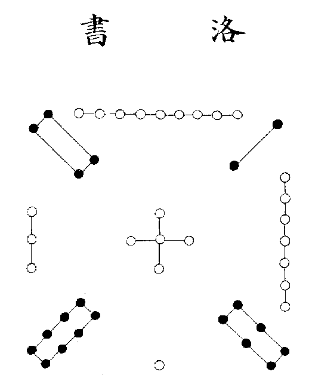 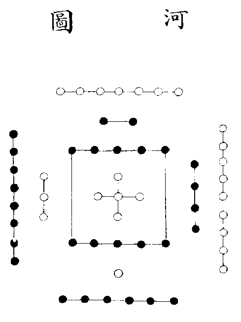[^j19-diagrams]

<!-- END TRANSLATION: eee-4713:002 -->

<!-- BEGIN TRANSLATION: eee-4713:003 -->

**Primer quotation — The Great Commentary on the Changes:** “The River brought forth the Chart; the Luo brought forth the Writing. The sages took them as their models.”[^j19-river-writing]

<!-- END TRANSLATION: eee-4713:003 -->

<!-- BEGIN TRANSLATION: eee-4713:004 -->

**Primer quotation — Kong Anguo:** The River Chart: when Fuxi ruled the world, a dragon-horse emerged from the River. He modeled its markings and thereby drew the eight trigrams. The Luo Writing: when Yu controlled the waters, a numinous turtle bore markings arrayed upon its back, with numbers reaching nine. Yu followed them and set them in order, forming the Nine Categories.

<!-- END TRANSLATION: eee-4713:004 -->

<!-- BEGIN TRANSLATION: eee-4713:005 -->

**Collected Explanations.**

<!-- END TRANSLATION: eee-4713:005 -->

<!-- BEGIN TRANSLATION: eee-4713:006 -->

**Zhu Xi, replying to Yuan Shu:** The view that the River Chart and Luo Writing are unworthy of belief has existed since Master Ouyang. Yet one cannot get around the fact that the Testamentary Charge, the Appended Statements, and the Analects all speak of them. The numbers of the two diagrams transmitted by the scholars, though interchanging, do not contradict one another. Count forward or trace backward, vertically or horizontally, along curves or straight lines: everywhere there are clear rules that cannot simply be dismissed. The River Chart agrees with the Changes’ sequence from Heaven One to Earth Ten and contains Heaven and Earth’s fifty-five numbers; it is therefore indeed the source from which the Changes arose. The Luo Writing agrees with the Great Plan’s sequence from “first, one” to “next, nine” and contains the numbers of its Nine Categories; it is therefore indeed the source from which the Great Plan arose. The Appended Statements does not say that Fuxi received the River Chart to make the Changes. Yet among its “looking upward and examining downward, seeking far away and taking from nearby,” how do we know that the River Chart was not one of the things he considered? In general, the sources of the sages’ creations were never confined to a single strand. Nevertheless, the framework of their models and images must have had a point of particularly close correspondence. In the age of primordial simplicity, yin and yang qi between Heaven and Earth each had their images, but there were as yet no numbers. Only with the appearance of the River Chart did the fifty-five numbers—odd and even, generating and completing—become brilliantly visible. This profoundly awakened the sage’s unique understanding in a way that vague manifestations of qi could not match. Thus only at this point, after looking upward and examining downward, seeking far and taking near, could the yin and yang, odd and even, of the Two Modes, Four Images, and Eight Trigrams be articulated. Although the Appended Statements gives more than one source for the sage’s making of the Changes, this does not prevent his having reached a definitive understanding only after obtaining the Chart.[^j19-chart-letter]

<!-- END TRANSLATION: eee-4713:006 -->

<!-- BEGIN TRANSLATION: eee-4713:007 -->

**Primer quotation — Liu Xin:** Fuxi followed Heaven and became king. He received the River Chart and drew it: these are the eight trigrams. Yu controlled the great flood; granted the pattern of the Luo Writing, he set it forth: these are the Nine Categories. River Chart and Luo Writing are warp and weft to one another; the Eight Trigrams and Nine Sections are outer and inner to one another.

<!-- END TRANSLATION: eee-4713:007 -->

<!-- BEGIN TRANSLATION: eee-4713:008 -->

**Primer quotation — Guan Ziming:** The River Chart’s pattern has seven in front, six behind, eight on the left, and nine on the right. The Luo Writing’s pattern has nine in front, one behind, three on the left, and seven on the right; four at the front left, two at the front right, eight at the rear left, and six at the rear right.

<!-- END TRANSLATION: eee-4713:008 -->

<!-- BEGIN TRANSLATION: eee-4713:009 -->

**Collected Explanations.**

<!-- END TRANSLATION: eee-4713:009 -->

<!-- BEGIN TRANSLATION: eee-4713:010 -->

**Zhu Xi, writing on the River Chart and Luo Writing:** Reading the Elder Dai’s Book of Rites, I found another very clear piece of evidence. Its Hall of Light chapter has the words “two, nine, four; seven, five, three; six, one, eight.” Master Zheng comments, “It models the turtle’s markings.” Thus Han scholars certainly regarded the diagram of nine numbers as the Luo Writing.[^j19-mingtang]

<!-- END TRANSLATION: eee-4713:010 -->

<!-- BEGIN TRANSLATION: eee-4713:011 -->

**Zhu Xi, Notes from Casual Reading:** The Zihua zi discusses the River Chart: two and four embrace nine and ascend; six and eight tread upon one and sink; five dwells in the center, supporting three and holding seven. Clever indeed! Precisely because it is so clever, one knows it is not an ancient book.

<!-- END TRANSLATION: eee-4713:011 -->

<!-- BEGIN TRANSLATION: eee-4713:012 -->

**Editorial Judgment.** Zheng’s gloss on the Elder Dai’s Rites is firm evidence. As for the Zihua zi, although its positions are clear, it mistakenly calls the Luo Writing the River Chart. Thus Zhu doubted that it was an ancient book.

<!-- END TRANSLATION: eee-4713:012 -->

<!-- BEGIN TRANSLATION: eee-4713:013 -->

**Primer quotation — Master Shao:** What is round is the stars. Could the numbers governing the calendar have begun here?

<!-- END TRANSLATION: eee-4713:013 -->

<!-- BEGIN TRANSLATION: eee-4713:014 -->

**Primer gloss.** Calendrical methods combine the two beginnings to determine firm and yielding, the two middles to determine pitch standards and calendrical reckoning, and the two endings to record intercalary remainders. This is what is meant by the governing of the calendar.[^j19-calendar-land]

<!-- END TRANSLATION: eee-4713:014 -->

<!-- BEGIN TRANSLATION: eee-4713:015 -->

**Primer quotation — Master Shao, continued:** What is square is the land. Could the method of marking out provinces and dividing land into well-fields have taken this as its model?

<!-- END TRANSLATION: eee-4713:015 -->

<!-- BEGIN TRANSLATION: eee-4713:016 -->

**Primer gloss.** There are nine provinces; a well-field comprises nine hundred mu. This is what is meant by marking out provinces and dividing land into well-fields.

<!-- END TRANSLATION: eee-4713:016 -->

<!-- BEGIN TRANSLATION: eee-4713:017 -->

**Primer quotation — Master Shao, continued:** Thus the round is the River Chart’s number, the square the Luo Writing’s pattern. Fuxi and King Wen followed them in making the Changes; Yu and Jizi set them in order in making the Great Plan.

<!-- END TRANSLATION: eee-4713:017 -->

<!-- BEGIN TRANSLATION: eee-4713:018 -->

**Cai Yuanding:** In records ancient and recent, Kong Anguo, Liu Xiang and his son, and Ban Gu all hold that the River Chart was given to Fuxi and the Luo Writing bestowed upon Yu. Guan Ziming and Shao Kangjie both take ten as the River Chart and nine as the Luo Writing. The Great Commentary already sets forth Heaven and Earth’s number, fifty-five; the Great Plan explicitly says, “Heaven then bestowed upon Yu the Great Plan’s Nine Categories.” The numbers of the Nine Palaces—nine worn upon the head, one beneath the feet, three on the left, seven on the right, two and four as shoulders, six and eight as feet—are precisely the image of a turtle’s back. Liu Mu alone, following his own conjecture, took nine as the River Chart and ten as the Luo Writing, claiming that this came from Xiyi. Not only did this disagree with the older explanations, but he also cited the Great Commentary to argue that both appeared in Fuxi’s age. There is no clear evidence for his exchanging the Chart and Writing. Yet his claim that Fuxi drew upon both raises a question, since the numbers of the Changes and Great Plan do indeed correspond as outer and inner. In truth, the principle of Heaven and Earth is one. Although times differ as ancient and recent, earlier and later, their principle admits no duality. Fuxi could therefore make the Changes from the River Chart alone, without seeing the Luo Writing beforehand, and already accord with it in advance. Yu could make the Great Plan from the Luo Writing alone, without investigating the River Chart retrospectively, and already agree with it unseen. Why? Because beyond this principle there is no other. Nor is this the only case. Music has five notes and twelve pitch standards, whose multiplicative combinations reach sixty. Day names have ten stems and twelve branches, whose combinations likewise reach sixty. Both arose after the Changes, and their initial numbers differ; yet they correspond of themselves to the differing totals of yin and yang stalks in the Changes. All reach sixty, fitting as the two halves of a tally. Even the arts of Yunqi, Cantong, and Taiyi, though not worth discussing, interconnect with these. Such is spontaneous principle. Suppose another Chart or Writing appeared today: its numbers would also necessarily correspond. Could we say Fuxi took something from our own day to make the Changes? The Great Commentary’s “the River brought forth the Chart; the Luo brought forth the Writing; the sages took them as models” speaks generally of the sages making the Changes and Great Plan, their origins alike proceeding from Heaven. It is like “those who practice divination prize its prognostications” or “nothing is greater than yarrow and turtle.” Does the book of Changes contain methods of turtle-shell divination? These expressions simply say that their principle is not two.[^j19-sixty]

<!-- END TRANSLATION: eee-4713:018 -->

<!-- BEGIN TRANSLATION: eee-4713:019 -->

**Primer quotation — Appended Statements:** Heaven: one; Earth: two. Heaven: three; Earth: four. Heaven: five; Earth: six. Heaven: seven; Earth: eight. Heaven: nine; Earth: ten. Heaven has five numbers, Earth five numbers. The five positions find one another, and each has its partner. Heaven’s numbers total twenty-five; Earth’s numbers total thirty. Together, Heaven and Earth’s numbers are fifty-five. Through these, change and transformation are accomplished and ghosts and spirits are brought into operation.[^j19-generation-completion]

<!-- END TRANSLATION: eee-4713:019 -->

<!-- BEGIN TRANSLATION: eee-4713:020 -->

**Primer text — Zhu Xi.** In this passage the Master brings to light the River Chart’s numbers. Between Heaven and Earth there is only one qi. Divided in two, it becomes yin and yang; the creative transformations of the five phases and the beginnings and endings of all things are all governed by this. Thus in the River Chart, one and six share their source and dwell in the north; two and seven are companions in the south; three and eight follow one Way in the east; four and nine are friends in the west; five and ten keep company in the center. As numbers, they are no more than one yin and one yang doubling each of the five phases. What is called Heaven is yang, light and clear, occupying the upper place. What is called Earth is yin, heavy and turbid, occupying the lower place. Yang numbers are odd: one, three, five, seven, and nine all belong to Heaven. This is “Heaven has five numbers.” Yin numbers are even: two, four, six, eight, and ten all belong to Earth. This is “Earth has five numbers.” Heaven’s and Earth’s numbers each seek their kind: this is how “the five positions find one another.” Heaven generates water with one, and Earth completes it with six. Earth generates fire with two, and Heaven completes it with seven. Heaven generates wood with three, and Earth completes it with eight. Earth generates metal with four, and Heaven completes it with nine. Heaven generates earth with five, and Earth completes it with ten. This is also what is meant by “each has its partner.” The five odd numbers sum to twenty-five; the five even numbers to thirty. Together they make fifty-five, the River Chart’s complete number. All this is the Master’s meaning and the scholars’ explanation. As for the Luo Writing, although the Master did not speak of it here, its image and explanation have already been given. Understand their interconnections, and what Liu Xin calls their warp and weft, outer and inner, becomes apparent.

<!-- END TRANSLATION: eee-4713:020 -->

<!-- BEGIN TRANSLATION: eee-4713:021 -->

**Editorial Judgment.** The central passage recounting the Great Commentary gives the Master’s meaning. Statements such as “Heaven generates water with one” are the scholars’ explanations. Earlier scholars all explained the Chart and Writing through the five phases; Zhu followed their usage in the Introduction and Original Meaning. On another occasion he said, “The River Chart and Luo Writing do not connect with the Eight Trigrams and Nine Sections; I do not yet know how to understand this.” Thus Zhu seems to have doubted that the Chart and Writing’s subtle content was exhausted by the scholars’ accounts.

<!-- END TRANSLATION: eee-4713:021 -->

<!-- BEGIN TRANSLATION: eee-4713:022 -->

**Primer text — Zhu Xi.** Someone asks, “Why do the positions and numbers of the River Chart and Luo Writing differ?” The reply: “In the River Chart, the five generating numbers govern the five completing numbers, each pair sharing its direction. It displays the whole to people and speaks of what is constant: the constitution of number. In the Luo Writing, the five odd numbers govern the four even numbers, each occupying its own place. It takes yang as primary to govern yin and initiate change: the activity of number.”[^j19-body-use]

<!-- END TRANSLATION: eee-4713:022 -->

<!-- BEGIN TRANSLATION: eee-4713:023 -->

**Collected Explanations.**

<!-- END TRANSLATION: eee-4713:023 -->

<!-- BEGIN TRANSLATION: eee-4713:024 -->

**Zhao Rumei:** One faces two, three faces four, and five occupies the center. Six and seven join one and two; eight and nine join three and four; ten joins five. Odd and even face one another, yin and yang have their partners, and the constitution of number is established. This is an instance of the sage’s “yin and yang unite their virtues, and firm and yielding have form.” Yet once constitution is established, without change number cannot operate. Thus yang proceeds leftward by three, yin rightward by two. Triple one to obtain three, which occupies the east. Triple three to obtain nine, which occupies the south. Triple nine to obtain twenty-seven: seven occupies the west. Triple twenty-seven to obtain eighty-one: one returns to the north. Continue upward, even to immense numbers, and the positions of their remainders remain the same. Double two to obtain four in the southeast; double four to obtain eight in the northeast; double eight to obtain sixteen, with six in the northwest; double sixteen to obtain thirty-two, with two returning to the southwest. Continue upward to immense numbers, and the same holds. Once the eight positions are arrayed, five remains in the center and the activity of number opens freely. This is an instance of the sage’s “varying them by threes and fives, interweaving their numbers.”[^j19-cycles]

<!-- END TRANSLATION: eee-4713:024 -->

<!-- BEGIN TRANSLATION: eee-4713:025 -->

**Bao Yunlong:** Tracing the Luo Writing’s changing numbers, yang proceeds leftward by three. Heaven is round: a diameter of one gives a circumference of three. Three is Heaven’s number. One is in the north: triple one, and three is in the east. Triple three to obtain nine in the south. Triple nine: three nines are twenty-seven, in the west. Triple twenty-seven to obtain eighty-one, and one returns to the north. North to east, east to south, south to west, west back to north: the cycle is endless, corresponding to Heaven’s leftward turning. Earth is square: a span of one gives a perimeter of four, twice two. Earth’s numbers begin with two, on which yin depends for its beginning. It occupies the southwest and moves rightward. Double two to obtain four in the southeast; double four to obtain eight in the northeast; double eight to obtain sixteen in the northwest; double sixteen to obtain thirty-two, and two returns to its original southwestern place. Southwest to southeast, southeast to northeast, northeast to northwest, northwest back to southwest: this too is an endless cycle, according with Earth’s rightward movement. One, three, nine, seven: yang occupies the four cardinal positions. Two, four, eight, six: yin occupies the four corners. Revolving left and right, they form warp and weft to one another. Such is the subtlety of creative transformation. The River Chart can be traced in the same way, except that yin and yang are arrayed in pairs and interwoven within and without, making the arrangement different.

<!-- END TRANSLATION: eee-4713:025 -->

<!-- BEGIN TRANSLATION: eee-4713:026 -->

**Editorial Judgment.** Zhu’s statement fully expresses the Chart and Writing’s central meaning. The generating numbers govern the completing numbers and share their directions: up to five are numbers coming into being; beyond five are numbers already completed. What yin generates, yang completes; what yang generates, yin completes. The two qi begin and end one another without ever parting. The odd numbers govern the even, each occupying its own place: odd numbers occupy the four cardinal positions, even numbers the four corners. Yin is governed by yang, Earth by Heaven. Heaven and Earth flow together, yet their established distinctions do not change. Displaying the whole and speaking of the constant means that number becomes complete only at ten; lacking one, it is incomplete. Hence “the constitution of number.” Taking yang as primary to govern yin and initiate change means beginning with one and ending with nine, thereby originating methods of multiplication and division. Hence “the activity of number.” The principle of generation and completion is thus clear; but of all the explanations, only Zhao’s and Bao’s illuminate how the cardinal and corner positions establish themselves. The others do not reach this.

<!-- END TRANSLATION: eee-4713:026 -->

<!-- BEGIN TRANSLATION: eee-4713:027 -->

**Primer text — Zhu Xi.** “Why do both place five at the center?” “At the beginning of all number there is only one yin and one yang. Yang’s image is round: a circle with a span of one has a circumference of three. Yin’s image is square: a square with a span of one has a perimeter of four. With a circumference of three, one is taken as one unit; thus its one yang is tripled to make three. With a perimeter of four, two is taken as one unit; thus its one yin is doubled to make two. This is what is meant by ‘assigning three to Heaven and two to Earth.’ Three and two together make five. This is why both the River Chart and Luo Writing take five as their center.”[^j19-central-five]

<!-- END TRANSLATION: eee-4713:027 -->

<!-- BEGIN TRANSLATION: eee-4713:028 -->

**Editorial Judgment.** Three joined with two is five; one joined with four is also five. One times one together with two times two again makes five. Three times three together with four times four makes the square of five. Is this not why five is the meeting point of numbers and the center of positions?

<!-- END TRANSLATION: eee-4713:028 -->

<!-- BEGIN TRANSLATION: eee-4713:029 -->

**Primer text — Zhu Xi.** Yet the River Chart takes the generating numbers as primary. Thus the five at its center also contains the images of the five generating numbers: the dot below images Heaven One; the dot above, Earth Two; the dot on the left, Heaven Three; the dot on the right, Earth Four; the central dot, Heaven Five. The Luo Writing takes odd numbers as primary. Thus its central five also contains the images of the five odd numbers: the dot below likewise images Heaven One; the dot on the left, Heaven Three; the central dot, Heaven Five; but the dot on the right images Heaven Seven, and the dot above Heaven Nine. Of their numbers and positions, three agree and two differ. Yang cannot be changed, while yin can. Completing numbers, even when yang, are nevertheless yin in relation to generation. “If the central five already images five numbers, what of the actual numbers themselves?” “Considered numerically, every part of each diagram, from within to without, has an accumulated total that can be counted. Yet the River Chart’s one, two, three, and four each lie outside the corresponding direction of its central fivefold image. Six, seven, eight, nine, and ten each gain their number through five and are attached outside their generating numbers. In the Luo Writing, one, three, seven, and nine likewise lie outside their corresponding directions in the central fivefold image. Two, four, six, and eight each follow their kind and adjoin the odd numbers at the sides. The center is host and the outside guest; the cardinal position ruler and the lateral position minister. Each has its ordered pattern, without confusion.”[^j19-five-dots]

<!-- END TRANSLATION: eee-4713:029 -->

<!-- BEGIN TRANSLATION: eee-4713:030 -->

**Collected Explanations.**

<!-- END TRANSLATION: eee-4713:030 -->

<!-- BEGIN TRANSLATION: eee-4713:031 -->

**Weng Yong:** In the River Chart, east and north are yang directions: odd numbers govern, joined by even partners. West and south are yin directions: even numbers govern, joined by odd partners.

<!-- END TRANSLATION: eee-4713:031 -->

<!-- BEGIN TRANSLATION: eee-4713:032 -->

**Wu Yueshen:** Yang begins in the north and ends in the west. At one and three it is still slight, so it dwells within; at seven and nine it flourishes and becomes manifest outside. Only after making the center substantial can it appear outside; thus five occupies the center. Yin begins in the south and ends in the east. At two and four it is still slight, so it dwells within; at six and eight it flourishes and condenses outside. Only after making the outside firm can it fill the inside; thus ten occupies the center. From center to outside is yang’s generation and growth; from outside to center, yin’s gathering and storing. This can also be seen in plants’ branches, leaves, fruits, and seeds.[^j19-numbers-repairs]

<!-- END TRANSLATION: eee-4713:032 -->

<!-- BEGIN TRANSLATION: eee-4713:033 -->

**Wu Yueshen, continued:** Five completes the generating numbers; ten completes the completing numbers, and both are stored within. Through this, Great Harmony is preserved in deep and firm union, and the workings of life become full and substantial within.

<!-- END TRANSLATION: eee-4713:033 -->

<!-- BEGIN TRANSLATION: eee-4713:034 -->

**Editorial Judgment.** This passage illuminates the earlier statement that generating numbers govern completing numbers and odd numbers govern even. In the first case, generating numbers always dwell within as hosts, completing numbers outside as guests. So with heat and cold throughout a year, the dying and rebirth of the moon’s dark aspect within a month, and the advance and retreat of day and night: what proceeds from birth toward growth is host; what proceeds from fullness toward decline is guest. This is the River Chart’s central meaning. In the second case, odd numbers occupy the four cardinal positions as rulers, even numbers the four lateral positions as ministers. Heaven revolves as a circle, with its pivots at the four cardinal points; Earth establishes its place as a square, with its supports at the four corners. These are the positions of exalted Heaven and lowly Earth, the respective roles of governing yang and assisting yin. This is the Luo Writing’s central meaning. Weng’s and Wu’s discussions of the River Chart deeply grasp Zhu’s meaning of inner and outer, guest and host. Although they do not reach the Luo Writing, Zhao’s and Bao’s earlier explanations suffice to make that connection.

<!-- END TRANSLATION: eee-4713:034 -->

<!-- BEGIN TRANSLATION: eee-4713:035 -->

**Primer text — Zhu Xi.** “Why do their totals differ?” “The River Chart takes completeness as primary, and therefore reaches ten, with odd and even positions equal in number. Only when their accumulated totals are considered does the excess of even and shortage of odd become apparent. The Luo Writing takes change as primary and therefore reaches nine; in both positions and accumulated totals, odd exceeds and even falls short. Only after the centers of both are left empty do yin and yang each total twenty, without imbalance.”[^j19-twenty]

<!-- END TRANSLATION: eee-4713:035 -->

<!-- BEGIN TRANSLATION: eee-4713:036 -->

**Editorial Judgment.** This passage also illuminates the earlier discussion of the constitution and activity of number.

<!-- END TRANSLATION: eee-4713:036 -->

<!-- BEGIN TRANSLATION: eee-4713:037 -->

**Primer text — Zhu Xi.** “Why do their sequences differ?” “In the River Chart’s order of generation, the sequence begins below, proceeds above, then left, then right, and returns to the center, before beginning below again. In its order of circulation, it begins east, proceeds south, then center, west, and north, making one leftward circuit before beginning east again. Among its generating numbers within, yang lies below and left, yin above and right. Among its completing numbers outside, yin lies below and left, yang above and right. In the Luo Writing, the yang numbers begin north, then proceed east, center, west, and south; the yin numbers begin southwest, then proceed southeast, northwest, and northeast. Taken together, the sequence begins north, then southwest, east, southeast, center, northwest, west, northeast, and finally south. In its circulation, water overcomes fire, fire overcomes metal, metal overcomes wood, wood overcomes earth; one rightward circuit is completed, and earth again overcomes water. Each arrangement thus has its explanation.”

<!-- END TRANSLATION: eee-4713:037 -->

<!-- BEGIN TRANSLATION: eee-4713:038 -->

**Primer text — Zhu Xi.** “How do they differ in the numbers seven, eight, nine, and six?” “In the River Chart, six, seven, eight, and nine are already attached outside the generating numbers. This is the regular pattern of yin and yang, old and young, advancing and retreating, abundant and deficient. Nine is the sum of the generating numbers one, three, and five: thus it proceeds from north to east, then from east to west, attaining completion outside four. Six is the sum of the generating numbers two and four: thus it proceeds from south to west, then from west to north, attaining completion outside one. Seven is nine proceeding from west to south; eight is six proceeding from north to east. This is the transformation through which old and young yin and yang hide within one another’s dwelling places. In the Luo Writing, vertical and horizontal totals are fifteen, and seven, eight, nine, and six alternately wane and wax. Leave five empty and divide ten: one contains nine, two contains eight, three contains seven, four contains six. Working by threes and fives and interweaving the numbers, wherever one turns, one encounters their fitting conjunction. This is the subtlety of inexhaustible change and transformation.”[^j19-nine-six]

<!-- END TRANSLATION: eee-4713:038 -->

<!-- BEGIN TRANSLATION: eee-4713:039 -->

**Primer text — Zhu Xi.** “How, then, did the sages take them as models?” “Those who modeled the River Chart left its center empty; those who modeled the Luo Writing gathered its actual numbers into a whole. In the River Chart, leaving five and ten empty is the Supreme Ultimate. Odd numbers totaling twenty and even numbers totaling twenty are the Two Modes. Taking one, two, three, and four to form six, seven, eight, and nine gives the Four Images. Dividing the paired numbers at the four cardinal directions to form Qian, Kun, Li, and Kan, and filling the empty corners to form Dui, Zhen, Xun, and Gen, gives the Eight Trigrams. As for the Luo Writing’s actual numbers: its first is the five phases; its second, the Five Activities; its third, the Eight Affairs of Government; its fourth, the Five Measures of Time; its fifth, the Sovereign Standard; its sixth, the Three Virtues; its seventh, the Examination of Doubts; its eighth, the Various Verifications; its ninth, Blessings and Extremities. Its positions and numbers are especially clear.”[^j19-nine-categories]

<!-- END TRANSLATION: eee-4713:039 -->

<!-- BEGIN TRANSLATION: eee-4713:040 -->

**Collected Explanations.**

<!-- END TRANSLATION: eee-4713:040 -->

<!-- BEGIN TRANSLATION: eee-4713:041 -->

**Conversations of Master Zhu:** “The Luo Writing’s original text consists of only forty-five dots. Ban Gu says its original text was sixty-five characters. Ancient characters had few strokes; perhaps there was some such form, but we have no means of examining it now. This Han scholarly explanation is not right. I suspect the ordering arose from meaning, not because the numbers were inherently so. Throughout, Heaven’s Way and human affairs are discussed in relation to one another. The five phases are most urgent, so they come first. The Five Activities are then brought into relation with them, so they come second. Once the person is cultivated, this can be extended to government, so the Eight Affairs of Government follow. Once government is established, it is tested against Heaven’s Way, so the Five Measures of Time follow. The Sovereign Standard then occupies the fifth place. Only by extending the five phases, rectifying the Five Activities, employing the Eight Affairs of Government, and ordering the Five Measures of Time can one establish the standard. Sixth, the Three Virtues weigh and balance this Sovereign Standard. Once virtue is cultivated, the Examination of Doubts and Various Verifications follow to make its signs apparent. Blessings and Extremities come next: the effects of good and evil have now reached their utmost. The Sovereign Standard does not mean ‘great center.’ Sovereign means the Son of Heaven; standard means the ultimate point. It says that the sovereign establishes this standard.”[^j19-sovereign-standard]

<!-- END TRANSLATION: eee-4713:041 -->

<!-- BEGIN TRANSLATION: eee-4713:042 -->

**Wu Yueshen:** The River Chart leaves its central palace empty to image the Supreme Ultimate; hence Master Zhou’s “Nonpolar, yet Supreme Ultimate.” The Luo Writing takes the central five as primary, making it the Sovereign Standard; hence “the sovereign establishes his standard.”

<!-- END TRANSLATION: eee-4713:042 -->

<!-- BEGIN TRANSLATION: eee-4713:043 -->

**Wu Yueshen, continued:** Yin and yang both begin their birth within and reach exhaustion outside. This is visible in the seasons’ alternating heat and cold and in all things’ flourishing, withering, birth, and death. The River Chart’s generating numbers begin within, its completing numbers end outside. In the Earlier Heaven circular diagram, Zhen’s one yang proceeds to Qian’s three yang, and Xun’s one yin to Kun’s three yin, always from within to without. What is within governs and gradually grows; what is outside is guest and gradually diminishes. This is unalterable in these models and images.

<!-- END TRANSLATION: eee-4713:043 -->

<!-- BEGIN TRANSLATION: eee-4713:044 -->

**Wu Yueshen, continued:** The Luo Writing’s upper three numbers image Heaven, its middle three humanity, its lower three Earth. Human beings can stand alongside Heaven and Earth, assist transformation and nourishment, and establish centered harmony. Thus the emphasis returns to five, the Sovereign Standard.

<!-- END TRANSLATION: eee-4713:044 -->

<!-- BEGIN TRANSLATION: eee-4713:045 -->

**Editorial Judgment.** Wu’s three observations deeply illuminate the Chart and Writing, the hexagrams and categories. What he says of the Nonpolar and of having an ultimate standard concerns the foremost meaning of the Changes and Great Plan. His joining of the Earlier Heaven diagram with the River Chart is particularly exact. When the sage speaks of taking them as models, he means that their principles fit like tally halves. Why insist pedantically on exact correspondence in dots, strokes, positions, and directions? In the Luo Writing, the threefold numbers at the cardinal points image Heaven, the twofold numbers at the corners image Earth, and their combined number in the central palace images humanity. Wu’s division into three tiers also seems to derive from the Elder Dai’s Rites and the Zihua zi. Yet examining the Great Plan, its beginning is one, two, three; its middle four, five, six; its ending seven, eight, nine. Each proceeds in order through assisting Heaven’s Way, establishing the ruler’s standard, and bringing the people’s lives into harmony. From the nearby matters of daily food and drink, self-cultivation, and governing others, it rises tier upon tier until above and below flow together. All this grasps the principle without pedantically demanding exact agreement in dots, strokes, and directions. Broadly, the figures of the Changes are articulated through eight, rooted in the Two Modes; the Great Plan’s categories through nine, rooted in the Three Powers. Knowing these roots, one understands the subtlety contained in the Chart and Writing.[^j19-first-principles]

<!-- END TRANSLATION: eee-4713:045 -->

<!-- BEGIN TRANSLATION: eee-4713:046 -->

**Primer text — Zhu Xi.** “But leave the Luo Writing’s center empty, and that too is the Supreme Ultimate. Let odd and even each occupy twenty, and those too are the Two Modes. One, two, three, and four containing nine, eight, seven, and six, with vertical and horizontal totals of fifteen and reciprocal combinations of seven, eight, nine, and six—these too are the Four Images. Let the four cardinal points form Qian, Kun, Li, and Kan, and the four corners form Dui, Zhen, Xun, and Gen: those too are the Eight Trigrams. In the River Chart, one and six are water, two and seven fire, three and eight wood, four and nine metal, five and ten earth: these are indeed the Great Plan’s five phases. And fifty-five is also the total of the Nine Categories’ subsidiary items. Thus the Luo Writing could certainly yield a Changes, and the River Chart a Great Plan. How do we even know that the Chart is not the Writing, or the Writing the Chart?” The reply: “Although they appeared at different times and differ in numerical totals, their principle is one. Yet the Changes is what Fuxi first obtained from the Chart, with no need to await the Writing; the Great Plan is what Yu obtained independently from the Writing, without necessarily investigating the Chart. Moreover, remove ten from the River Chart and one obtains the Luo Writing’s forty-five. Remove five, and one obtains the Great Expansion’s fifty. Add five and ten, and one obtains the Luo Writing’s vertical and horizontal total of fifteen. Multiply five by ten or ten by five, and both give the Great Expansion’s number. The Luo Writing’s five also contains another five within itself, giving ten, and so connects with the Great Expansion’s number. Combine five and ten to obtain fifteen, and it connects with the River Chart’s number. Understand this, and horizontal, oblique, curved, and straight all interconnect. How could the River Chart and Luo Writing then be separated into earlier and later, this and that?”[^j19-forty-five-fifty-five]

<!-- END TRANSLATION: eee-4713:046 -->

<!-- Source: https://www.eee-learning.com/book/4714 -->

<!-- BEGIN TRANSLATION: eee-4714:001 -->

**Part Two · Tracing the Origin of the Hexagram Strokes**[^j19-primer-voices]

<!-- END TRANSLATION: eee-4714:001 -->

<!-- BEGIN TRANSLATION: eee-4714:002 -->

**Zhu Xi, replying to Yuan Shu:** Fuxi’s Changes originally had no written words, only a diagram containing its images and numbers; within it were the principles of Heaven, Earth, and all things, and the changes of yin and yang from beginning to end. King Wen’s Changes is our present Zhou Changes, for which Confucius made the commentaries. Since Confucius wrote in response to King Wen’s Changes, his discussion naturally takes that work as its chief concern. Yet without tracing back to the source from which Fuxi made the Changes and drew the figures, students would begin halfway and fail to recognize the roots above. Thus, among the Ten Wings, such passages as “the eight trigrams are arrayed,” “by doubling them,” the Supreme Ultimate, Two Modes, Four Images, and Eight Trigrams, and Heaven, Earth, mountains, lakes, thunder, wind, water, and fire all rest upon Fuxi’s intention in drawing the figures. The new book’s part on tracing the strokes likewise distinguishes two meanings: Fuxi first, King Wen afterward.

<!-- END TRANSLATION: eee-4714:002 -->

<!-- BEGIN TRANSLATION: eee-4714:003 -->

**Primer quotation — Appended Statements:** In ancient times, when Baoxi ruled the world, he looked upward to observe images in Heaven and downward to observe patterns on Earth. He observed the markings of birds and beasts and what was fitting to the land. Close at hand he took from the body, farther away from things. Thus he first made the eight trigrams, to communicate with the virtue of the numinous powers and classify the dispositions of the myriad things.

<!-- END TRANSLATION: eee-4714:003 -->

<!-- BEGIN TRANSLATION: eee-4714:004 -->

**Primer quotation — Appended Statements:** The Changes has the Supreme Ultimate. This gives birth to the Two Modes; the Two Modes give birth to the Four Images; the Four Images give birth to the Eight Trigrams.

<!-- END TRANSLATION: eee-4714:004 -->

<!-- BEGIN TRANSLATION: eee-4714:005 -->

**Primer text — Zhu Xi.** The Great Commentary also describes in this way what Baoxi drew upon to make the figures; the Changes therefore was not made from the River Chart alone. Everything filling the space between Heaven and Earth manifests the subtlety of the Supreme Ultimate and yin and yang. Looking upward and examining downward, seeking far and taking near, the sage surely attained a transcendent, silent accord within his heart. Thus, before the Two Modes were divided, there was the undifferentiated Supreme Ultimate, within which the principles of the Two Modes, Four Images, and sixty-four hexagrams were already brilliantly present. When the Supreme Ultimate divides into the Two Modes, the Supreme Ultimate remains the Supreme Ultimate and the Two Modes remain the Two Modes. When the Two Modes divide into the Four Images, the Two Modes in turn are the Supreme Ultimate and the Four Images in turn are the Two Modes. Extend this: four to eight, eight to sixteen, sixteen to thirty-two, thirty-two to sixty-four, and onward without end through hundreds, thousands, ten thousands, and beyond. Although their appearance in drawings seems successive and the result of human action, their determined forms and fully constituted tendencies were already present within the undifferentiated whole. Not a hair’s breadth of deliberate thought or contrivance can be admitted between them. Master Cheng’s phrase “the method of doubling” may be said to encompass the matter in a word. And Master Shao’s “before the drawings there was already the Changes” can be seen to be true, not groundless. Scholars sometimes fail to perceive this and suppose that the sages made the Changes through the utmost ingenuity of mental searching. Some go so far as to say that every stroke must first have been obtained from the yarrow. Their error is greater still.[^j19-doubling]

<!-- END TRANSLATION: eee-4714:005 -->

<!-- BEGIN TRANSLATION: eee-4714:006 -->

**Collected Explanations.**

<!-- END TRANSLATION: eee-4714:006 -->

<!-- BEGIN TRANSLATION: eee-4714:007 -->

**Xie Liangzuo:** Yaofu’s numbers of the Changes were exceedingly refined. Mingdao had heard their explanation often. One day, while supervising an examination and otherwise unoccupied, he worked through the calculations, and all agreed. On coming out, he told Yaofu, “Your numbers are simply the method of doubling.” From this one knows that the Supreme Mystery accomplishes nothing of the kind.

<!-- END TRANSLATION: eee-4714:007 -->

<!-- BEGIN TRANSLATION: eee-4714:008 -->

**Zhu Xi, replying to Yu Dazhong:** Supreme Ultimate, Two Modes, Four Images, Eight Trigrams: this is the guiding framework of Changes studies, the first principle upon opening the book. Confucius brought to light the spontaneous form and structure of Fuxi’s drawing of the figures. For a thousand years after Confucius it was not transmitted; only the two masters Kangjie and Mingdao understood it. Kangjie first transmitted Earlier Heaven learning and obtained its explanation, taking it as Fuxi’s Changes. The Discussion of the Trigrams’ chapter “Heaven and Earth establish their positions” and the Earlier Heaven diagram’s sequence from Qian One to Kun Eight both rest upon this. Yet Kangjie was unwilling to disclose it at length. The very heart and marrow of the Changes lies here; he did not dare speak of it lightly or casually, and his intention was not accidental. Mingdao called it “the method of doubling”: his illumination of Confucius’s words may indeed be called supremely close to the essential point.

<!-- END TRANSLATION: eee-4714:008 -->

## The Generation of the Figures

<!-- BEGIN TRANSLATION: eee-4714:009 -->

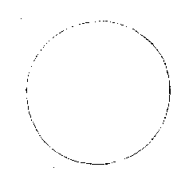 **Diagram caption.** The Changes has the Supreme Ultimate.

<!-- END TRANSLATION: eee-4714:009 -->

<!-- BEGIN TRANSLATION: eee-4714:010 -->

**Primer text — Zhu Xi.** “Supreme Ultimate” names the condition in which images and numbers have not yet taken shape but their principle is already complete. It also names the condition in which forms and concrete things are already complete but their principle leaves no trace. In both the River Chart and Luo Writing, it is imaged by the empty center. Master Zhou’s “Nonpolar, yet Supreme Ultimate,” and Master Shao’s “the Way is the Supreme Ultimate” and “the heart is the Supreme Ultimate,” mean this.[^j19-supreme-ultimate]

<!-- END TRANSLATION: eee-4714:010 -->

<!-- BEGIN TRANSLATION: eee-4714:011 -->

**Editorial Judgment.** Although the Supreme Ultimate in the book of Changes has no form, Qian itself is the Supreme Ultimate. Spoken of partially, it can face Kun and stand alongside the six children. Spoken of comprehensively, Earth too is one Heaven, and the six children too are one Heaven. Thus Master Cheng says: “Heaven, spoken of comprehensively, is the Way. In terms of its form it is called Heaven; its governance, the Sovereign; its subtle activity, the numinous; its nature and disposition, Qian.” His words may be called complete. Nevertheless, at the beginning of drawing the figures, Qian did not yet have a name. What begins with one stroke is precisely this principle. Depicting it as a circle began with Master Zhou. Zhu borrowed the image to reveal the source of Changes principle. Students must not mistakenly suppose that Fuxi really drew such an image when making the figures.

<!-- END TRANSLATION: eee-4714:011 -->

<!-- BEGIN TRANSLATION: eee-4714:012 -->

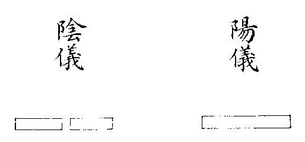 **Diagram caption.** This gives birth to the Two Modes.[^j19-two-modes-image]

<!-- END TRANSLATION: eee-4714:012 -->

<!-- BEGIN TRANSLATION: eee-4714:013 -->

**Primer text — Zhu Xi.** When the Supreme Ultimate divides, it first gives birth to one odd stroke and one even stroke, making two one-line figures. These are the Two Modes. Numerically, yang is one and yin two; in the River Chart and Luo Writing these are odd and even. Master Zhou’s “the Supreme Ultimate moves and generates yang; at movement’s utmost it becomes still; in stillness it generates yin; at stillness’s utmost it moves again. Movement and stillness are rooted in one another; yin and yang are distinguished, and the Two Modes stand established,” and Master Shao’s “one divides into two,” both refer to this.

<!-- END TRANSLATION: eee-4714:013 -->

<!-- BEGIN TRANSLATION: eee-4714:014 -->

**Collected Explanations.**

<!-- END TRANSLATION: eee-4714:014 -->

<!-- BEGIN TRANSLATION: eee-4714:015 -->

**Zhu Xi, replying to Yuan Shu:** In your discussion of the Two Modes, you say “Qian’s stroke is odd, Kun’s stroke even.” The names Qian and Kun themselves are not yet appropriate here. Mode means a counterpart, like the ordinary expressions a pair or a couple. Only after two further changes, reaching the third stroke and completing the eight trigrams, do the names Qian and Kun exist. At the stage of one stroke there are only one odd and one even: these may be called yin and yang, but not yet Qian and Kun.

<!-- END TRANSLATION: eee-4714:015 -->

<!-- BEGIN TRANSLATION: eee-4714:016 -->

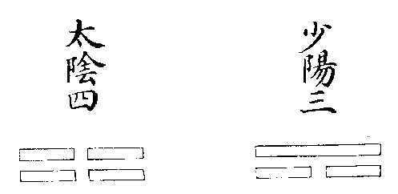 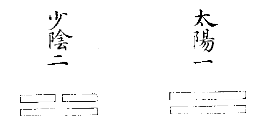[^j19-four-images]

<!-- END TRANSLATION: eee-4714:016 -->

<!-- BEGIN TRANSLATION: eee-4714:017 -->

**Diagram caption.** The Two Modes give birth to the Four Images.

<!-- END TRANSLATION: eee-4714:017 -->

<!-- BEGIN TRANSLATION: eee-4714:018 -->

**Primer text — Zhu Xi.** Above each of the Two Modes, one odd and one even stroke arise, making four two-line figures. These are the Four Images. Their positions are great yang first, young yin second, young yang third, and great yin fourth. Their numerical values are great yang nine, young yin eight, young yang seven, and great yin six. In terms of the River Chart, six is one obtaining five; seven is two obtaining five; eight is three obtaining five; nine is four obtaining five. In terms of the Luo Writing, nine is the remainder when one is taken from ten; eight when two is taken from ten; seven when three is taken from ten; six when four is taken from ten. Master Zhou’s “water, fire, wood, metal” and Master Shao’s “two divide into four” both refer to this.

<!-- END TRANSLATION: eee-4714:018 -->

<!-- BEGIN TRANSLATION: eee-4714:019 -->

**Collected Explanations.**

<!-- END TRANSLATION: eee-4714:019 -->

<!-- BEGIN TRANSLATION: eee-4714:020 -->

**Zhu Xi, replying to Cheng Jiong:** Your statement that the Two Modes are the first lines of Qian and Kun, and that the Four Images are formed by interweaving their first two lines, seems insufficiently clear. At the stage of the Two Modes, there are not yet Four Images; at the stage of the Four Images, there are not yet Eight Trigrams. How could the names Qian and Kun and the distinction between their first and second lines already exist? The Two Modes may only be called yin and yang. Only with the Four Images does the distinction between great and young arise. Their sequence is great yang, young yin, young yang, great yin. Once this sequence is established, successive increase and doubling yield exactly the order Qian One, Dui Two, Li Three, Zhen Four, Xun Five, Kan Six, Gen Seven, and Kun Eight.

<!-- END TRANSLATION: eee-4714:020 -->

<!-- BEGIN TRANSLATION: eee-4714:021 -->

**Zhu Xi, again replying to Yuan Shu:** The name Four Images embraces a very broad range. Fundamentally, the four positions arrayed by doubling two strokes must be taken as primary. One, two, three, and four are their positional sequence; seven, eight, nine, and six are their actual numerical values. To distinguish them as yin, yang, firm, and yielding speaks of Heaven and Earth together. To distinguish them as yin and yang, great and young, speaks specifically of Heaven’s Way. Speaking specifically of Earth’s Way, firm and yielding also each have great and young. Extend this broadly, interweaving vertically and horizontally: every single thing possesses four such images. They are not confined to these few cases.

<!-- END TRANSLATION: eee-4714:021 -->

<!-- BEGIN TRANSLATION: eee-4714:022 -->

**Conversations of Master Zhu:** “Previously, the numbers seven, eight, nine, and six in the Changes were derived only from counting the yarrow. Although the results agreed, the explanation always seemed too circuitous, and I doubted that this was the source from which the numbers were obtained. While examining the order of the Four Images, I happened upon an explanation that is exceedingly direct. From one, two, three, and four one immediately sees six, seven, eight, and nine. Old yang occupies the first position and contains nine; young yin the second and contains eight; young yang the third and contains seven; old yin the fourth and contains six. Number does not go beyond ten. This one principle earlier scholars never brought out; they merely spoke of advances and retreats in between.”[^j19-missing-words]

<!-- END TRANSLATION: eee-4714:022 -->

<!-- BEGIN TRANSLATION: eee-4714:023 -->

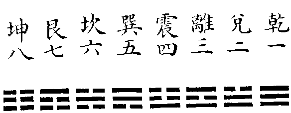[^j19-linear-images]

<!-- END TRANSLATION: eee-4714:023 -->

<!-- BEGIN TRANSLATION: eee-4714:024 -->

**Diagram caption.** The Four Images give birth to the Eight Trigrams.

<!-- END TRANSLATION: eee-4714:024 -->

<!-- BEGIN TRANSLATION: eee-4714:025 -->

**Primer text — Zhu Xi.** Above each of the Four Images, one odd and one even stroke arise, making eight three-line figures. The Three Powers are now present in outline, and the names of the Eight Trigrams appear. Their positions are Qian One, Dui Two, Li Three, Zhen Four, Xun Five, Kan Six, Gen Seven, and Kun Eight. In the River Chart, Qian, Kun, Li, and Kan occupy the four filled positions; Dui, Zhen, Xun, and Gen the four empty positions. In the Luo Writing, Qian, Kun, Li, and Kan occupy the cardinal directions; Dui, Zhen, Xun, and Gen the corners. The Rites of Zhou’s statement that the three Changes each have eight fundamental figures, the Great Commentary’s “the eight trigrams are arrayed,” and Master Shao’s “four divide into eight” all refer to this.

<!-- END TRANSLATION: eee-4714:025 -->

<!-- BEGIN TRANSLATION: eee-4714:026 -->

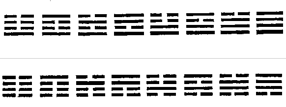

<!-- END TRANSLATION: eee-4714:026 -->

<!-- BEGIN TRANSLATION: eee-4714:027 -->

**Primer text — Zhu Xi.** Above each of the Eight Trigrams, one odd and one even stroke arise, making sixteen four-line figures. These do not appear in the Classic. They are what Master Shao calls “eight divide into sixteen.” This also amounts to adding the Eight Trigrams above each of the Two Modes, or adding the Two Modes above each of the Eight Trigrams.

<!-- END TRANSLATION: eee-4714:027 -->

<!-- BEGIN TRANSLATION: eee-4714:028 -->

**Editorial Judgment.** The sixteen four-line figures arise by adding the Two Modes above each of the Eight Trigrams, and also by adding the Four Images above each of the Four Images. Although they do not appear in the Classic, once the sixty-four hexagrams are complete, their four lines from the second to the fifth can be overlapped. One may also take the first through fourth, or the third through top; or reverse the fourth through first, fifth through second, or top through third. Interweaving, reversing, and overlapping them yields Qian, Kun, After Completion, Before Completion, Splitting Apart, Return, Coming to Meet, Breakthrough, Gradual Progress, The Marrying Maiden, Great Excess, Nourishment, Release, Limping, Opposition, and The Family: exactly sixteen. Confucius disclosed the beginning of this in the Miscellaneous Hexagrams. The Han scholars’ account of overlapping hexagrams presumably rests upon it. Master Shao’s poem says, “The Four Images intersect and form sixteen affairs.” It takes these four-line figures as the intersection of the Four Images. Students who mistakenly identify them with the sixteen hexagrams of Heaven, Earth, Obstruction, and Peace discussed earlier miss his point.[^j19-overlapping-four]

<!-- END TRANSLATION: eee-4714:028 -->

<!-- BEGIN TRANSLATION: eee-4714:029 -->

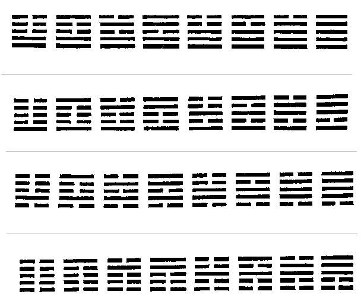

<!-- END TRANSLATION: eee-4714:029 -->

<!-- BEGIN TRANSLATION: eee-4714:030 -->

**Primer text — Zhu Xi.** Above each four-line figure, one odd and one even stroke arise, making thirty-two five-line figures. This is what Master Shao calls “sixteen divide into thirty-two.” It also amounts to adding the Eight Trigrams above each of the Four Images, or the Four Images above each of the Eight Trigrams.

<!-- END TRANSLATION: eee-4714:030 -->

<!-- BEGIN TRANSLATION: eee-4714:031 -->

**Editorial Judgment.** In the thirty-two five-line figures, the first through third strokes can form one trigram and the third through fifth another. Once the sixty-four hexagrams are complete, interweave, reverse, and overlap their lines by this method. One obtains Return, Coming to Meet, Nourishment, Great Excess, Difficulty at the Beginning, The Cauldron, Constancy, Increase, Abundance, Dispersion, Kan, Li, Unformed Understanding, Revolution, Fellowship, The Army, Approach, Retreat, Influence, Decrease, Limitation, The Wanderer, Inner Sincerity, Small Excess, Great Strength, Viewing, Great Possession, Holding Together, Breakthrough, Splitting Apart, Qian, and Kun: again exactly thirty-two. Earlier scholars also used this to explain overlapping hexagrams. For example, Decrease and Increase both overlap into Nourishment; Nourishment images Li, which is the turtle. Thus the second and fifth lines of Decrease and Increase speak of “a turtle worth ten pairs.” Such is their method.[^j19-overlapping-five]

<!-- END TRANSLATION: eee-4714:031 -->

<!-- BEGIN TRANSLATION: eee-4714:032 -->

**Primer text — Zhu Xi.** Above each five-line figure, one odd and one even stroke arise, making sixty-four six-line figures. The Three Powers are embraced and doubled, and the multiplication of Eight Trigrams by Eight Trigrams is complete. The names of the sixty-four hexagrams are now established, and the Way of the Changes reaches its full formation. This is what the Rites of Zhou calls the sixty-four derivative figures in each of the three Changes, what the Great Commentary means by “by doubling them, lines are within them,” and what Master Shao calls “thirty-two divide into sixty-four.” If one odd and one even stroke are again generated above each figure, there will be 128 seven-line figures. Above seven strokes, adding odd and even gives 256 eight-line figures; above eight, 512 nine-line figures; above nine, 1,024 ten-line figures; above ten, 2,048 eleven-line figures; above eleven, 4,096 twelve-line figures. This is the number of changing hexagrams in Jiao Gan’s Forest of Changes, also sixty-four multiplied by sixty-four. We do not draw these again here; they are briefly shown in Part Four. If one odd and one even stroke are again added above the twelve, and this is continued to twenty-four strokes, there will be 16,777,216 transformations. Multiplying 4,096 by itself gives the same number. Extend this further, and one cannot know where it would end. Although their application has not been seen, they suffice to show the inexhaustibility of the Way of the Changes.[^j19-powers]

<!-- END TRANSLATION: eee-4714:032 -->

<!-- BEGIN TRANSLATION: eee-4714:033 -->

**Editorial Judgment.** The Forest of Changes’ numbers presumably follow the ancient method of divination. The Great Plan’s account of prognostication says “zhen and hui.” In the transformation of eight trigrams into sixty-four hexagrams, the eight fundamental trigrams are zhen and the added trigrams hui: this is the Spring and Autumn Commentary’s “zhen is wind, hui mountain.” In the transformation of sixty-four hexagrams into 4,096, the sixty-four originals are zhen and the changing figures hui: this is its “zhen is Difficulty at the Beginning, hui Enthusiasm.” Because the strokes generate without end, the changes and transformations of divination are inexhaustible. Jiao Gan understood the method, but attaching a separate text to every case was contrived. Here lies the essential teaching transmitted from heart to heart by the two masters Shao and Zhu.[^j19-zhen-hui]

<!-- END TRANSLATION: eee-4714:033 -->

## Drawing, Interpretation, and Transmission

<!-- BEGIN TRANSLATION: eee-4714:034 -->

**Collected Explanations.**

<!-- END TRANSLATION: eee-4714:034 -->

<!-- BEGIN TRANSLATION: eee-4714:035 -->

**Zhu Xi, replying to Lin Li:** The Supreme Ultimate, Two Modes, Four Images, and Eight Trigrams arise in sequence, with positions and ranks brilliantly ordered without deliberate arrangement. At the fourth division there are sixteen, at the fifth thirty-two, at the sixth sixty-four. Thus their doubling likewise requires no intentional contrivance and agrees throughout with the preceding three divisions. Compare this with piling three yang strokes together as Qian, then stacking three yin strokes as Kun, deliberately crossing them to form the six children, then first drawing the Eight Trigrams within and again outside, adding them to one another in turn to form sixty-four. Spontaneous Heaven-given principle and human contrivance are surely different things.

<!-- END TRANSLATION: eee-4714:035 -->

<!-- BEGIN TRANSLATION: eee-4714:036 -->

**Zhu Xi, again replying to Yuan Shu:** To see the source of the sages’ making of the Changes directly and clearly, nothing is better than first examining the horizontal diagram at the beginning of the volume. Begin when there are only the two strokes and follow it gradually until the full six strokes have arisen. Earlier and later, fewer and more, have their sequence; their positions are clear without elaborate explanation. Once this is seen, one recognizes that the sixty-four hexagrams are entirely arrayed by the spontaneous order of Heaven’s principle. The sages simply saw clearly and drew according to that original pattern, adding not a hair’s breadth of ingenuity. It did not require such assistance, nor would it admit it. Once the figures are complete, however, reverse and forward, vertical and horizontal all embody principle and rightness. In a thousand forms and ten thousand kinds, their subtlety is inexhaustible. It then depends on how people see them: each explains according to what he perceives. Though the explanations may not seem to draw upon one another, they do not in fact contradict one another. The account beginning before any stroke exists and continuing to the completion of six strokes is what Master Shao calls Earlier Heaven learning. Once the figures are complete, developing their explanations according to particular meanings is what he calls Later Heaven learning. Earlier and Later Heaven each have their own meaning; within Later Heaven, the meanings drawn out also differ greatly. They do not obstruct one another. One must not seize upon one and discard a hundred.[^j19-earlier-later-repair]

<!-- END TRANSLATION: eee-4714:036 -->

<!-- BEGIN TRANSLATION: eee-4714:037 -->

**Conversations of Master Zhu:** Asked, “From one yin and one yang, each again gives rise to one yin and one yang. In a diagram, the Two Modes give birth to the Four Images and the Four Images to the Eight Trigrams: continuing step by step is easy enough to see. But how can this be verified in the actual world between Heaven and Earth?” He replied, “Every thing itself has yin and yang. Human male and female are yin and yang, yet each individual body also has blood and qi: blood is yin and qi yang. So with day and night: day is yang, night yin. Yet within the yang of daytime, the period after noon belongs to yin; within the yin of night, the period after midnight belongs to yang. These are images of yin and yang each generating yin and yang.”

<!-- END TRANSLATION: eee-4714:037 -->

<!-- BEGIN TRANSLATION: eee-4714:038 -->

**Conversations of Master Zhu:** “The Earlier Heaven diagram is profoundly subtle. It did not originate with Kangjie; it existed before Xiyi, but was kept secret and not openly transmitted. Presumably it was handed down among practitioners of esoteric arts. The Cantong qi contains somewhat similar ideas. Yang Xiong’s Supreme Mystery entirely imitates the Changes. His work uses the number three, while the Changes uses four. Since his intention was to imitate the Changes, examining the Changes through the passages he imitated can also give some sense of its meaning.”[^j19-other-systems]

<!-- END TRANSLATION: eee-4714:038 -->

<!-- BEGIN TRANSLATION: eee-4714:039 -->

**Conversations of Master Zhu:** “Since the Changes came into being, only Master Shao has explained this diagram with such complete order. Yang Xiong’s Supreme Mystery is so patched together in fragments as to be laughable. Without the patch it falls short by one quarter; with the patch it exceeds by three quarters. The Qianxu uses five in its numbers, much like present-day counting-rod positions: one vertical stroke is five; one horizontal stroke beneath it makes six; two horizontal strokes make seven. It too is a patched-together book.”

<!-- END TRANSLATION: eee-4714:039 -->

<!-- BEGIN TRANSLATION: eee-4714:040 -->

**Huang Ruijie:** The Earlier Heaven diagram and the Supreme Ultimate diagram appeared at the same time. The two masters Zhou and Shao had not heard from one another, so neither diagram was communicated to the other; let that matter rest. Chen Yingzhong says that Sima Wenzheng was Shao Kangjie’s contemporary and close friend, yet never said a word about Earlier Heaven learning. Shao Bowen says that, while Kangjie was alive, Yichuan did ask about the teaching, but Kangjie would not tell him. From these two accounts, was the Earlier Heaven diagram perhaps not yet widely known even then? Chen Yingzhong says that Earlier Heaven learning takes the heart as its foundation; what appears in the Book of Ordering the World was only a subsidiary undertaking for Kangjie. He also says, “Unfolding the earlier sages’ hidden meaning and revealing the subtlety in Earlier Heaven’s manifest form—is this not found in Kangjie’s book?” Thus, before Zhu, Liaoweng already showed discernment in bringing this diagram to light and honoring it.[^j19-liaoweng]

<!-- END TRANSLATION: eee-4714:040 -->

## Earlier Heaven

<!-- BEGIN TRANSLATION: eee-4714:041 -->

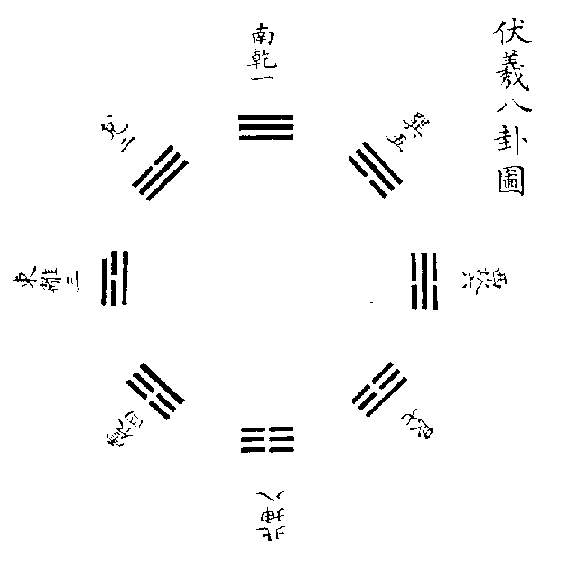[^j19-fuxi-image]

<!-- END TRANSLATION: eee-4714:041 -->

<!-- BEGIN TRANSLATION: eee-4714:042 -->

**Primer quotation — Discussion of the Trigrams:** Heaven and Earth establish their positions; mountains and lakes communicate their qi; thunder and wind press upon one another; water and fire do not assail one another. The eight trigrams interweave. Counting what has gone is forward; knowing what is coming is reverse. Thus the Changes reckons in reverse.

<!-- END TRANSLATION: eee-4714:042 -->

<!-- BEGIN TRANSLATION: eee-4714:043 -->

**Primer quotation — Discussion of the Trigrams:** Thunder sets things moving; wind disperses them; rain moistens them; the sun warms them. Gen brings them to rest; Dui delights them; Qian rules them; Kun stores them within.

<!-- END TRANSLATION: eee-4714:043 -->

<!-- BEGIN TRANSLATION: eee-4714:044 -->

**Primer quotation — Master Shao:** This passage explains Fuxi’s eight trigrams. “The eight trigrams interweave” explains their mutual crossing to form the sixty-four hexagrams. “Counting what has gone is forward” is like proceeding with Heaven: a leftward turning. These are all figures already born, hence “counting what has gone.” “Knowing what is coming is reverse” is like proceeding against Heaven: a rightward movement. These are all figures not yet born, hence “knowing what is coming.” The numbers of the Changes are formed through reverse reckoning. This passage directly explains the diagram’s intention, as though speaking of anticipating the four seasons.[^j19-reckoning]

<!-- END TRANSLATION: eee-4714:044 -->

<!-- BEGIN TRANSLATION: eee-4714:045 -->

**Primer gloss.** In the horizontal diagram, only after Qian One is there Dui Two, after Dui Two Li Three, after Li Three Zhen Four. With Zhen Four, Xun Five, Kan Six, Gen Seven, and Kun Eight also arise in sequence. This is how the Changes is formed. On the circular diagram’s left side, the beginning of Zhen is the winter solstice; the space between Li and Dui is the spring equinox; the end of Qian meets the summer solstice. All these advance toward figures already born, like looking back from today and counting yesterday. Hence “counting what has gone is forward.” On its right side, the beginning of Xun is the summer solstice; the space between Kan and Gen is the autumn equinox; the end of Kun meets the winter solstice. All these advance toward figures not yet born, like reckoning tomorrow in advance from today. Hence “knowing what is coming is reverse.” Yet the fundamental sequence by which the Changes is formed, from beginning to end, is simply that of the horizontal diagram and the circular diagram’s right side. Hence “the Changes reckons in reverse.”

<!-- END TRANSLATION: eee-4714:045 -->

<!-- BEGIN TRANSLATION: eee-4714:046 -->

**Collected Explanations.**

<!-- END TRANSLATION: eee-4714:046 -->

<!-- BEGIN TRANSLATION: eee-4714:047 -->

**Conversations of Master Zhu:** “If Qian One is arrayed horizontally through Kun Eight, this is entirely spontaneous. Thus the Discussion of the Trigrams says, ‘the Changes reckons in reverse’: each figure already born gives access to one not yet born. But the circular diagram must be arranged in this way to display yin and yang’s waning and waxing: Zhen has one yang, Li and Dui two yang, Qian three yang; Xun has one yin, Kan and Gen two yin, Kun three yin. Though it seems to involve some arrangement, it follows spontaneous principle throughout.”

<!-- END TRANSLATION: eee-4714:047 -->

<!-- BEGIN TRANSLATION: eee-4714:048 -->

**Supplement.**

<!-- END TRANSLATION: eee-4714:048 -->

<!-- BEGIN TRANSLATION: eee-4714:049 -->

**Xiang Anshi:** “Counting what has gone is forward” points to the preceding text; “knowing what is coming is reverse” points to what follows. The sentence “thus the Changes reckons in reverse” introduces the following eight clauses. The preceding text takes the eight trigrams after their completion and counts them in pairs. Their sequence is forward and their principle clear; hence “counting what has gone is forward.” What follows takes the beginning of drawing the figures: they are drawn in pairs to left and right, and generated in reverse order from bottom to top. Hence “knowing what is coming is reverse.” The sage does not create a separate set of reverse images outside the forward ones. These reverse images are the same as the forward images already given.

<!-- END TRANSLATION: eee-4714:049 -->

<!-- BEGIN TRANSLATION: eee-4714:050 -->

**Zhang Huang:** From Qian’s pure yang, through Dui and Li to Zhen’s single yang; from Kun’s pure yin, through Gen and Kan to Xun’s single yin—is this not the forward counting of what has gone? From Zhen’s single yang, through Li and Dui to Qian’s pure yang; from Xun’s single yin, through Kan and Gen to Kun’s pure yin—is this not the reverse knowing of what is coming? Turning leftward is altogether knowing what is coming; turning rightward is altogether counting what has gone. But the Changes chiefly concerns knowing what is coming, generating without end, and therefore reckons in reverse.

<!-- END TRANSLATION: eee-4714:050 -->

<!-- BEGIN TRANSLATION: eee-4714:051 -->

**Editorial Judgment.** Shao’s “turning leftward” simply means turning toward the left; his “moving rightward,” moving toward the right. This is precisely the opposite of what calendrical astronomers mean by leftward and rightward rotation: they are different explanations. His already-born and not-yet-born refer specifically to yin and yang’s generation, as Zhang explains. Xiang’s account is particularly successful in preserving the connection of the preceding and following wording. The forward reckoning has already been arrayed above, but the diagram’s construction chiefly concerns reverse reckoning. Thus its generation from beginning to end is described below. Zhu’s explanation seems again to form a separate account. Students should distinguish them as they read.

<!-- END TRANSLATION: eee-4714:051 -->

<!-- BEGIN TRANSLATION: eee-4714:052 -->

**Primer quotation — Master Shao:** Once the Supreme Ultimate divides, the Two Modes stand established. Yang moves upward to join yin, yin downward to join yang, and the Four Images arise. Yang joins yin and yin joins yang, generating Heaven’s Four Images; firm joins yielding and yielding joins firm, generating Earth’s Four Images. The eight trigrams interweave, and only then do the myriad things arise. Thus one divides into two, two into four, four into eight, eight into sixteen, sixteen into thirty-two, thirty-two into sixty-four. It is like a root having a trunk, a trunk having branches: the greater the whole, the smaller its divisions; the finer they become, the more numerous.[^j19-branching]

<!-- END TRANSLATION: eee-4714:052 -->

<!-- BEGIN TRANSLATION: eee-4714:053 -->

**Collected Explanations.**

<!-- END TRANSLATION: eee-4714:053 -->

<!-- BEGIN TRANSLATION: eee-4714:054 -->

**Conversations of Master Zhu:** Asked, “Cheng’s commentary under Qian says that when the sage first drew the eight trigrams, the Way of the Three Powers was complete. He then doubled them to exhaust the world’s changes, forming hexagrams with six strokes. Some think this says the sage initially drew each of the eight trigrams with three strokes and then doubled them to six. This seems different from Shao’s account of one dividing into two until sixty-four six-line figures are reached.” He replied, “Cheng’s meaning is simply that three strokes are doubled into six and eight trigrams into sixty-four hexagrams. It does indeed differ from Shao’s. Kangjie never explained this intention to Cheng, nor did Cheng ask him; Cheng therefore consistently followed what he himself saw. But when Cheng says that the sage first drew the eight trigrams, we do not know which trigram the sage drew first. This point cannot be made clear.”[^j19-cheng-shao]

<!-- END TRANSLATION: eee-4714:054 -->

<!-- BEGIN TRANSLATION: eee-4714:055 -->

**Primer quotation — Master Shao, continued:** Thus Qian divides, Kun gathers, Zhen increases, and Xun diminishes. Increase leads to division, division to diminution, diminution to gathering. Qian and Kun establish the positions. Zhen and Xun are the first conjunction; Dui, Li, Kan, and Gen the second. Thus in Zhen yang is slight and yin still abundant; in Xun yin is slight and yang still abundant. In Dui and Li yang gradually increases; in Kan and Gen yin gradually increases.

<!-- END TRANSLATION: eee-4714:055 -->

<!-- BEGIN TRANSLATION: eee-4714:056 -->

**Primer quotation — Master Shao:** Before the Nonpolar, yin contains yang. After images arise, yang divides yin. Yin is yang’s mother, yang yin’s father. Thus the mother carries the eldest son and forms Return; the father brings forth the eldest daughter and forms Coming to Meet. Therefore yang arises in Return and yin in Coming to Meet.[^j19-before-nonpolar]

<!-- END TRANSLATION: eee-4714:056 -->

<!-- BEGIN TRANSLATION: eee-4714:057 -->

**Collected Explanations.**

<!-- END TRANSLATION: eee-4714:057 -->

<!-- BEGIN TRANSLATION: eee-4714:058 -->

**Conversations of Master Zhu:** Asked, “How can one speak of ‘before’ the Nonpolar?” He replied, “Shao speaks in terms of the diagram, with a cyclical meaning. From Coming to Meet to Kun, yin contains yang; from Return to Qian, yang divides yin. Between Kun and Return lies the Nonpolar.” Asked, “If there is a before and after the Nonpolar, must there not be being and nonbeing?” He replied, “There is fundamentally no interruption.” Asked, “Yin and yang arise from the two sides of the Earlier Heaven diagram. If Kun is taken as the Supreme Ultimate, this differs from the Supreme Ultimate diagram. How is that?” He replied, “For now, explain it according to his own intention; he did not compare it with Lianxi’s. As for the emptiness at the center of his Supreme Ultimate, he himself says that the diagram begins from the center. Arising on its two sides means yin rooted in yang and yang rooted in yin: this has a counterpart. What comes from the center has no counterpart.”

<!-- END TRANSLATION: eee-4714:058 -->

<!-- BEGIN TRANSLATION: eee-4714:059 -->

**Editorial Judgment.** Zhou’s “Nonpolar, yet Supreme Ultimate” speaks of yin and yang’s original constitution: what the Doctrine of the Mean calls the nature mandated by Heaven. Shao’s “Nonpolar” speaks of the pivot of movement and stillness: what the Doctrine of the Mean calls the centered state before expression. The Heaven-mandated nature indeed circulates everywhere, yet “human beings are still at birth: this is Heaven’s nature.” Thus in the condition of undifferentiated stillness, without an incipient trace, the reality of the original constitution is fully present. Zhou therefore also speaks of taking stillness as primary; Cheng says that the root is true and still. The three masters’ explanations illuminate one another rather than conflict.

<!-- END TRANSLATION: eee-4714:059 -->

<!-- BEGIN TRANSLATION: eee-4714:060 -->

**Primer quotation — Master Shao:** Zhen first joins yin and yang is born; Xun first diminishes yang and yin is born. Dui is yang increasing; Gen yin increasing. Zhen and Dui are yin in Heaven; Xun and Gen yang in Earth. Thus Zhen and Dui have yin above and yang below; Xun and Gen yang above and yin below. Heaven is spoken of in terms of beginning to generate: yin above and yang below express conjunction and peace. Earth is spoken of in terms of completed formation: yang above and yin below express the positions of honored and subordinate. Qian and Kun establish the positions above and below; Kan and Li array the gates to left and right. Heaven and Earth’s closing and opening, sun and moon’s emergence and return, spring, summer, autumn, winter, the moon’s obscurity, new moon, quarters, and fullness, the length of day and night, and the excess and shortfall of celestial motions—all proceed from this.[^j19-heaven-earth-images]

<!-- END TRANSLATION: eee-4714:060 -->

<!-- BEGIN TRANSLATION: eee-4714:061 -->

**Primer gloss.** “Zhen first joins yin and yang is born” means that in the circular diagram Zhen meets Kun and one yang is born. “Xun first diminishes yang and yin is born” means that Xun meets Qian and one yin is born.[^j19-single-yin]

<!-- END TRANSLATION: eee-4714:061 -->

<!-- BEGIN TRANSLATION: eee-4714:062 -->

**Collected Explanations.**

<!-- END TRANSLATION: eee-4714:062 -->

<!-- BEGIN TRANSLATION: eee-4714:063 -->

**Master Shao:** Yang lines are the numbers of daytime; yin lines the numbers of nighttime. Heaven and Earth join, yin and yang meet; thus day and night part from one another and firm and yielding interweave. Spring and summer are yang: daytime numbers are many, nighttime numbers few. Autumn and winter are yin: daytime numbers are few, nighttime numbers many.

<!-- END TRANSLATION: eee-4714:063 -->

<!-- BEGIN TRANSLATION: eee-4714:064 -->

**Hu Fangping:** This passage first discusses the four corner trigrams, Zhen, Xun, Gen, and Dui, and then the four cardinal positions, Qian, Kun, Kan, and Li. “Zhen first joins yin and yang is born” refers to Zhen meeting Kun. At Dui there are two yang, so yang has increased. “Xun first diminishes yang and yin is born” refers to Xun meeting Qian. At Gen there are two yin, so yin has increased. Zhen and Dui are yin in Heaven because Shao takes Zhen as Heaven’s young yin and Dui as its great yin. As yin, their yin strokes are above and their yang strokes below. Heaven chiefly generates things; at generation’s beginning there must be conjunction and peace. Thus yin above and yang below express that meaning. Xun and Gen are yang in Earth because Shao takes Xun as Earth’s young firmness and Gen as its great firmness. As firm, their yang strokes are above and their yin strokes below. Earth chiefly completes things; after completion, honored and subordinate are established. Thus yin below and yang above express those positions. Qian and Kun establishing above and below are Heaven and Earth’s closing and opening. Kan and Li arraying the gates to left and right are sun and moon’s emergence and return. In the year, spring, summer, autumn, winter; in the month, obscurity, new moon, quarters, and fullness; in the day, daytime, nighttime, and celestial movement—all arise from this. How could it be confined narrowly to yin and yang strokes?

<!-- END TRANSLATION: eee-4714:064 -->

<!-- BEGIN TRANSLATION: eee-4714:065 -->

**Primer quotation — Master Shao:** Qian has forty-eight, divided into four portions; one portion is overcome by yin. Kun has forty-eight, divided into four portions; one portion is the yang it overcomes. Thus Qian obtains thirty-six and Kun twelve.[^j19-forty-eight]

<!-- END TRANSLATION: eee-4714:065 -->

<!-- BEGIN TRANSLATION: eee-4714:066 -->

**Primer gloss.** Dui, Li, and those that follow require further thought.

<!-- END TRANSLATION: eee-4714:066 -->

<!-- BEGIN TRANSLATION: eee-4714:067 -->

**Primer gloss, continued.** On examination: Dui and Li each have twenty-eight yang and twenty yin; Zhen twenty yang and twenty-eight yin; Gen and Kan each twenty-eight yin and twenty yang; Xun twenty yin and twenty-eight yang.

<!-- END TRANSLATION: eee-4714:067 -->

<!-- BEGIN TRANSLATION: eee-4714:068 -->

**Primer quotation — Master Shao:** Qian and Kun lie along the vertical axis, the six children across it: this is the Changes’ foundation.

<!-- END TRANSLATION: eee-4714:068 -->

<!-- BEGIN TRANSLATION: eee-4714:069 -->

**Primer quotation — Master Shao:** Yang within yin moves in reverse; yin within yang moves in reverse. Yang within yang and yin within yin both move forward. This is the truest principle; examine the diagram and it becomes visible.

<!-- END TRANSLATION: eee-4714:069 -->

<!-- BEGIN TRANSLATION: eee-4714:070 -->

**Primer quotation — Master Shao:** From Return to Qian there are 112 yang lines; from Coming to Meet to Kun, eighty yang. From Coming to Meet to Kun there are 112 yin lines; from Return to Qian, eighty yin.[^j19-halves]

<!-- END TRANSLATION: eee-4714:070 -->

<!-- BEGIN TRANSLATION: eee-4714:071 -->

**Primer quotation — Master Shao:** Kan and Li are the boundaries of yin and yang. Thus Li corresponds to Yin, Kan to Shen. That the numbers regularly go beyond them is yin and yang’s overflowing. Yet the numbers in use do not go beyond the midpoint.[^j19-branches]

<!-- END TRANSLATION: eee-4714:071 -->

<!-- BEGIN TRANSLATION: eee-4714:072 -->

**Primer gloss.** This too requires further thought. Li corresponds to Mao, Kan to You. Taking Kun as the midpoint of Zi makes this apparent.

<!-- END TRANSLATION: eee-4714:072 -->

<!-- BEGIN TRANSLATION: eee-4714:073 -->

**Collected Explanations.**

<!-- END TRANSLATION: eee-4714:073 -->

<!-- BEGIN TRANSLATION: eee-4714:074 -->

**Cai Yuanding:** This discusses yin and yang coming and going through gradual development, not an abrupt division into yin and yang. Consider Kan and Li: Li’s center corresponds to Mao, Kan’s center to You. Yet Li’s generation has already begun at Yin, within Zhen; Kan’s generation has already begun at Shen, within Xun. Thus Shao says Li corresponds to Yin and Kan to Shen. Kun corresponding to mid-Zi and Qian to mid-Wu means precisely Li at Mao and Kan at You.

<!-- END TRANSLATION: eee-4714:074 -->

<!-- BEGIN TRANSLATION: eee-4714:075 -->

**Primer quotation — Master Shao:** Earlier Heaven learning is a method of the heart. Thus all the diagrams begin from the center: the myriad transformations and affairs arise from the heart.

<!-- END TRANSLATION: eee-4714:075 -->

<!-- BEGIN TRANSLATION: eee-4714:076 -->

**Primer quotation — Master Shao:** Though the diagram has no words, I may speak all day without departing from it, for the principles of Heaven, Earth, and the myriad things are all within it.

<!-- END TRANSLATION: eee-4714:076 -->

<!-- BEGIN TRANSLATION: eee-4714:077 -->

**Editorial Judgment.** After Confucius died, the Way of the Changes lost its transmission. Its principles and meanings were already distorted; its diagrams and images became still more obscure. Only the trigram positions set out in the Great Commentary’s “the Sovereign comes forth in Zhen” remained plainly clear, so scholars continued to describe them. Other accounts, such as hexagram qi and monthly correspondences, were Han scholars’ forced constructions, not the sages’ original method. With Master Shao Kangjie in the Song came what is called the Earlier Heaven diagram. It includes a sequence generating the sixty-four hexagrams: the present horizontal diagram, from one stroke to six, each repeatedly dividing in two. It includes positions of the eight trigrams: the present small circular diagram, Qian south, Kun north, Li east, Kan west. It includes positions of the sixty-four hexagrams: the present large circle, beginning with Return and Coming to Meet and ending with Qian and Kun. Within that large circle is a square diagram, further imaging Heaven and Earth containing one another. The diagrams’ meanings are broad and great, high and deep; surely none but a sage could have devised them.

Yet in Shao’s own time, Master Cheng Yichuan had not seen them; Yang of Guishan saw them but did not believe in them. Only Master Cheng Mingdao had some sight of the work and summed it up in the single word “doubling.” Thus Mingdao alone understood Shao at that time. After the move south, opponents such as Lin Li and Yuan Shu were especially numerous. Even Lu of Xiangshan held that the Earlier Heaven diagram was not the original intention of the sages in making the Changes. Zhu and Cai alone explained and brought it to light; only then did Shao’s learning become clear to the world. Over the ensuing five hundred years, contrary opinions have arisen, but have not displaced it.

Zhu thought that, after Confucius, scholars failed to transmit the teaching, allowing those outside their tradition to obtain it. It thus flowed into the lesser arts of the alchemical furnace, until Kangjie returned it to the Way of the Changes. Yet examine the Cantong qi and related books. Their six trigrams’ monthly correspondences are simply the method of assigning stems; their twelve sovereign hexagrams governing the year are a continuation of hexagram-qi theory. Their beginning with Zhen and Return agrees with Earlier Heaven only incidentally and seems insufficient evidence of its transmission.

Yang Xiong’s Supreme Mystery, however, begins with three regions, develops these into nine provinces, then twenty-seven divisions, then eighty-one houses. This resembles Earlier Heaven’s method of doubling through Ultimate, Modes, Images, and Trigrams. Its circulating sequence begins with 中、羨、從, centers upon 更、睟、廓, and ends with 減、沈、成. This resembles Earlier Heaven’s sequence from Return to Qian and Coming to Meet to Kun. Its heads use nine times nine and its stalks six times six, resembling Earlier Heaven’s eight times eight hexagrams and seven times seven stalks. Might Kangjie have read Yang Xiong’s book and inwardly awakened to the source of making the Changes? Yet unless the Changes’ transmission had remained alive in Yang’s time, he too would have had nothing to imitate. Thus Kangjie profoundly admired the Supreme Mystery, regarding it as revealing the heart of Heaven and Earth: perhaps it was where his learning found illumination and strength.

Nevertheless, once Shao’s book appeared, the Supreme Mystery became an unauthorized rival to the Classic, confusing yin and yang’s ordering. It differed from Shao’s book as widely as dark color from white. Mingdao’s intention seems to have been that Kangjie could discover his own teachers: he drew both upon Xiyi’s transmission and Yang Xiong’s book, yet his purity without admixture and his vast, expansive scope exceeded anything Yang or Chen could attain. Thus Mingdao said, “Yaofu’s numbers resemble the Mystery but are different.” He also said, “Mu and Li both obtained their teaching from Xiyi, yet their words and conduct give a general indication of their attainment. Yaofu merely entered through that doorway.” Cheng’s words are entirely fitting. Later students who wish to examine the transmission of Earlier Heaven must understand this.[^j19-transmission]

<!-- END TRANSLATION: eee-4714:077 -->

## Later Heaven

<!-- BEGIN TRANSLATION: eee-4714:078 -->

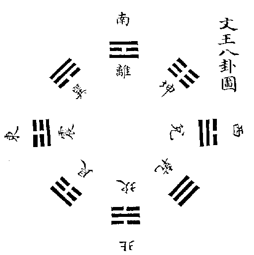[^j19-wen-image]

<!-- END TRANSLATION: eee-4714:078 -->

<!-- BEGIN TRANSLATION: eee-4714:079 -->

**Primer quotation — Discussion of the Trigrams:** The Sovereign comes forth in Zhen, brings things into order in Xun, makes them visible to one another in Li, brings service to fulfillment in Kun, delights in Dui, battles in Qian, labors in Kan, and brings completion in Gen. The myriad things come forth in Zhen. Zhen is the east. They come into order in Xun; Xun is the southeast. Coming into order means that the myriad things are renewed and evenly arrayed. Li is brightness: all things become visible to one another. It is the trigram of the south. The sage faces south to hear the affairs of the world, turning toward the light to govern; this is surely what he draws upon. Kun is Earth: all things receive their full nourishment from it. Hence “brings service to fulfillment in Kun.” Dui is the height of autumn, where the myriad things find delight. Hence “delights in Dui.” “Battles in Qian”: Qian is the trigram of the northwest; this means yin and yang pressing upon one another. Kan is water, the trigram of due north, the trigram of labor, where all things return. Hence “labors in Kan.” Gen is the trigram of the northeast, where all things reach their completion and make their beginning. Hence “brings completion in Gen.”

The numinous is spoken of in terms of the subtle working of the myriad things. Nothing moves the myriad things more swiftly than thunder; nothing bends them more swiftly than wind; nothing dries them more fiercely than fire; nothing delights them more than the lake; nothing moistens them more than water; nothing more abundantly ends and begins them than Gen. Thus water and fire reach one another, thunder and wind do not oppose one another, and mountains and lakes communicate their qi. Only then can change and transformation bring all things to completion.

<!-- END TRANSLATION: eee-4714:079 -->

<!-- BEGIN TRANSLATION: eee-4714:080 -->

**Primer quotation — Master Shao:** This passage explains King Wen’s eight trigrams.

<!-- END TRANSLATION: eee-4714:080 -->

<!-- BEGIN TRANSLATION: eee-4714:081 -->

**Primer quotation — Master Shao:** How consummate was King Wen’s making of the Changes! Did he not grasp Heaven and Earth’s activity? Thus Qian and Kun join to form Peace; Kan and Li join to form After Completion. Qian is born at Zi, Kun at Wu; Kan ends at Yin, Li at Shen, responding to Heaven’s times. Qian is placed northwest, Kun withdrawn southwest; the eldest son takes charge and the eldest daughter acts for the mother; Kan and Li obtain their positions, while Dui and Gen form a pair, responding to Earth’s directions. The kingly method—**primer gloss: King Wen’s**—is fully expressed here.

<!-- END TRANSLATION: eee-4714:081 -->

<!-- BEGIN TRANSLATION: eee-4714:082 -->

**Primer gloss.** This speaks of King Wen’s intention in changing Fuxi’s trigram diagram. Qian south and Kun north exchange, becoming Qian north and Kun south: Peace. Li east and Kan west exchange, becoming Li west and Kan east: After Completion. Qian and Kun’s exchange turns back from their completed positions to the places from which they were born. Thus a further change withdraws Qian to the northwest and Kun to the southwest. In Kan and Li’s change, the eastern figure moves westward by the upper side, the western figure eastward by the lower. Once Qian and Kun have withdrawn, Li obtains Qian’s place and Kan Kun’s. Zhen taking charge means generation in the east; Xun acting for the mother means growth and nourishment in the southeast.

<!-- END TRANSLATION: eee-4714:082 -->

<!-- BEGIN TRANSLATION: eee-4714:083 -->

**Editorial Judgment.** Shao’s statement that Qian and Kun exchange to form Peace explains the intention of changing Earlier Heaven into Later Heaven. In Earlier Heaven, Qian is south and Kun north; they now become Qian north and Kun south, hence “exchange.” Yet Shao says Qian is born at Zi and Kun at Wu. Examine the diagram: Qian is northwest, at Hai rather than Zi; Kun southwest, at Wei rather than Wu. Why? Yang proceeds from stillness to movement, so its qi begins at Zi. Yet its incipient signs and embryonic formation are already present in the month of Hai. Thus the ancients called Hai the yang month, saying that Heaven’s Way begins there. Yin proceeds from movement to stillness, so its achievement is manifest at Wu. Yet only at Wei does its nurture become abundant; thus the ancients called Wei the center, saying that earth’s virtue rules there. Add the grass component to hai and one gets roots; add wood and one gets a kernel: both express embryonic beginnings. Add sun to wei and one gets dimness, saying that the sun now begins to turn toward the Valley of Darkness and the myriad things approach their western completion. In the pitch standards, Huangzhong at Zi is Heaven’s governing origin; yet at Yingzhong in Hai, yang qi already responds within, hence “Responding Bell.” Linzhong at Wei is Earth’s governing origin; thus Ban Gu explains it by citing “finding companions in the southwest.” Even lesser arts such as stem-assignment and astral fate calculation take Hai as Heaven’s gate and Wei as Kun’s beginning. I suspect that all base their explanations on Later Heaven.[^j19-later-directions][^j19-etymologies]

Fire begins in the east but flourishes in the south; water begins in the west but flourishes in the north. Thunder’s qi moves at Yin but gives voice at Mao. Nourishing moisture spreads at Si but completes its work at You. Wind in the southwest is cool wind, completing things; thus the Spring and Autumn Commentary says, “wind strips the mountain.” In the southeast it is gentle wind, generating things; thus the Song of the South Wind says it can enrich the people’s resources. Gen in the northwest is movement reaching its utmost and becoming still; thus the Great Commentary says, “Gen brings them to rest.” In the northeast it is stillness reaching its utmost and moving again; thus it says, “where all things reach their completion and make their beginning.” All these show the subtle way Earlier and Later Heaven illuminate one another. In sum, they describe creative transformation flowing, generating, and nourishing. Earlier scholars have said Qian and Kun are not in use. Yet examine Confucius’s words: Kun is said to bring service to fulfillment and give full nourishment. No activity could be greater. Qian is said to battle: this displays the constitution of firm vigor, capable of overcoming the many yin and governing Heaven’s mandate. All eight trigrams’ activity is its activity. How could it be unused? This profound intention of the sage must be brought to light.[^j19-nonuse]

<!-- END TRANSLATION: eee-4714:083 -->

<!-- BEGIN TRANSLATION: eee-4714:084 -->

**Primer quotation — Master Shao:** The Changes means one yin and one yang. Zhen and Dui are the beginning of conjunction, so they occupy morning and evening. Kan and Li are conjunction at its utmost, so they occupy Zi and Wu. Xun and Gen do not conjoin, yet yin and yang are still mixed in them; thus they occupy the lateral positions within activity. Qian is pure yang and Kun pure yin; thus they occupy positions not in use.

<!-- END TRANSLATION: eee-4714:084 -->

<!-- BEGIN TRANSLATION: eee-4714:085 -->

**Primer quotation — Master Shao:** Dui, Li, and Xun receive more yang; Gen, Kan, and Zhen receive more yin. Thus they serve Heaven and Earth’s activity. Qian is utmost yang, Kun utmost yin; thus they are not in use.

<!-- END TRANSLATION: eee-4714:085 -->

<!-- BEGIN TRANSLATION: eee-4714:086 -->

**Primer quotation — Master Shao:** Zhen and Dui lie along the horizontal axis, the six other trigrams along the vertical: this is the Changes’ activity.

<!-- END TRANSLATION: eee-4714:086 -->

<!-- BEGIN TRANSLATION: eee-4714:087 -->

**Primer gloss.** I have examined this diagram and offered a further explanation. Zhen is east and Dui west because yang chiefly advances: the eldest therefore comes first and occupies the left. Yin chiefly retreats: the youngest is therefore favored and occupies the right. Kan in the north is the midpoint of advancing; Li in the south the midpoint of retreating. Male north and female south conceal themselves in one another’s dwellings. These four all occupy the cardinal positions and are the trigrams in active charge. Yet Zhen and Dui begin, Kan and Li end; Zhen and Dui carry less weight, Kan and Li more. Qian northwest and Kun southwest are the father and mother, now old, retiring to positions no longer in use. Yet the mother is close and the father honored, so Kun remains half in use while Qian is wholly unused. Gen northeast and Xun southeast are the youngest son, last in advancing, and the eldest daughter, first in retreating; thus both too are unused. Yet the son has not yet gone to a tutor, while the daughter is about to marry, so Xun is approaching use, whereas Gen is not yet in use at all. These four occupy noncardinal positions at the corners. Those in the east are not yet in use; those in the west no longer in use. Thus the following text names the six children but does not enumerate Qian and Kun. When it comes to the pairings of water and fire, thunder and wind, mountains and lakes, it again employs Fuxi’s trigrams.

<!-- END TRANSLATION: eee-4714:087 -->

<!-- BEGIN TRANSLATION: eee-4714:088 -->

**Collected Explanations.**

<!-- END TRANSLATION: eee-4714:088 -->

<!-- BEGIN TRANSLATION: eee-4714:089 -->

**Master Shao:** Qian governs the three sons in the north and east; Kun governs the three daughters in the south and west.[^j19-directions-and-roles]

<!-- END TRANSLATION: eee-4714:089 -->

<!-- BEGIN TRANSLATION: eee-4714:090 -->

**Editorial Judgment.** Shao’s words encompass the diagram’s entire meaning. The Zhou Changes’ Judgments of Kun, Limping, and Release all arise from this. Broadly, Earlier Heaven takes east and south as yang territory, west and north as yin territory. Thus figures born from the yang mode occupy east and south, those born from the yin mode west and north. Later Heaven takes north and east as yang territory, south and west as yin territory. Thus all yang trigrams occupy north and east, all yin trigrams south and west. Yet although Earlier Heaven’s yang trigrams begin in the east, when they are doubled to order hexagram qi, the principle of “in Return, seeing the heart of Heaven and Earth” still takes the north as its beginning. Although Later Heaven’s yang trigrams begin in the north, when distributed in accord with the year’s sequence, “the Sovereign comes forth in Zhen” still takes the east first. Neither meaning can be discarded. Only by considering them in relation to one another can one recognize the subtlety of creative transformation and the essence of Changes principle.

The year begins in the east and ends in the north, with west and south between. Later Heaven’s intention takes yang as primary to govern yin. Thus the movement from Zhen to Kan and Gen uses yang to begin and end the year’s work; from Xun through Li to Dui, yin assists yang between them. Zhen’s yang is born, so it meets spring’s command of generation: it takes the beginning as beginning. Qian takes the ending as beginning, without any discernible first point: this is what the Commentary calls “the great beginning” and “not taking the lead.” Dui’s yin reaches completion, fulfilling the work of western completion: this is the end of yin’s achievement. Kun brings service to fulfillment, completing affairs without claiming the accomplishment: this is what the Commentary calls “bringing to completion” and “having no accomplishment of its own, yet completing on another’s behalf.”

Thus yang occupies beginning and ending, yin the interval between: this is an ultimate principle of Heaven, Earth, and all things. In plants, seeds and fruits are yang, flowers and leaves yin. Among human beings, fathers and sons are yang, wives and concubines yin. A plant begins in the sowing of seed and ends in the formation of fruit, while flowers and leaves flourish between. A family begins with a father and ends in a son, while wives and secondary consorts abound between. Fruit arises from flowers, the son from the mother: this shows yin assisting yang. Yet the completed fruit becomes next year’s seed, and the newborn son another day’s father. This too is taking the ending as beginning. The primal yang generates without cease: its head or tail, beginning or end, truly cannot be discerned. Xie Liangzuo says, “One begins in Zhen: this concerns generation.” He also says, “One begins in Qian: this traces the root.” Did he not grasp Later Heaven’s profound intention?

<!-- END TRANSLATION: eee-4714:090 -->

<!-- BEGIN TRANSLATION: eee-4714:091 -->

**Primer quotation — Discussion of the Trigrams:** Qian is vigor; Kun compliance; Zhen movement; Xun entry; Kan entrapment; Li clinging; Gen stopping; Dui delight.

<!-- END TRANSLATION: eee-4714:091 -->

<!-- BEGIN TRANSLATION: eee-4714:092 -->

**Primer quotation — Master Cheng:** Whenever yang is below, it images movement; in the middle, entrapment; above, stopping. Whenever yin is below, it images entry; in the middle, clinging; above, delight.

<!-- END TRANSLATION: eee-4714:092 -->

<!-- BEGIN TRANSLATION: eee-4714:093 -->

**Primer quotation — Discussion of the Trigrams:** Qian is the horse; Kun the ox; Zhen the dragon; Xun the chicken; Kan the pig; Li the pheasant; Gen the dog; Dui the sheep.

<!-- END TRANSLATION: eee-4714:093 -->

<!-- BEGIN TRANSLATION: eee-4714:094 -->

**Primer text — Zhu Xi.** These are the images taken from things farther away.

<!-- END TRANSLATION: eee-4714:094 -->

<!-- BEGIN TRANSLATION: eee-4714:095 -->

**Primer quotation — Discussion of the Trigrams:** Qian is the head; Kun the belly; Zhen the feet; Xun the thighs; Kan the ears; Li the eyes; Gen the hands; Dui the mouth.

<!-- END TRANSLATION: eee-4714:095 -->

<!-- BEGIN TRANSLATION: eee-4714:096 -->

**Primer text — Zhu Xi.** These are the images taken from the body close at hand.[^j19-final-glosses]

<!-- END TRANSLATION: eee-4714:096 -->

<!-- BEGIN TRANSLATION: eee-4714:097 -->

**Collected Explanations.**

<!-- END TRANSLATION: eee-4714:097 -->

<!-- BEGIN TRANSLATION: eee-4714:098 -->

**Conversations of Master Zhu:** “When Fuxi drew the eight trigrams, these few strokes encompassed the principles of everything in the world. What students grasp through words is shallow; what they grasp through images is deep. Wang Fusi and Yichuan both distrust images. When Yichuan explains an image, he treats it merely as a comparison. Guo Zihe says that images are not only Heaven, Earth, thunder, wind, water, fire, mountains, and lakes: the strokes of the figures themselves are images. That too is well said. Zheng Dongqing concentrates on images, taking the Cauldron as a cauldron, Revolution as a furnace, Small Excess as a flying bird. These too have principle and meaning, but trying to force every case into such a correspondence becomes careless and strained. Students must first understand sound principles. Only afterward should they gather such particular observations to supplement and illuminate them; doing so is not without benefit.”[^j19-image-method]

<!-- END TRANSLATION: eee-4714:098 -->

<!-- BEGIN TRANSLATION: eee-4714:099 -->

**Primer quotation — Discussion of the Trigrams:** Qian is Heaven and is therefore called the father. Kun is Earth and is therefore called the mother. Zhen, in the first seeking, obtains a son and is therefore named the eldest son. Xun, in the first seeking, obtains a daughter and is therefore named the eldest daughter. Kan, in the second seeking, obtains a son and is therefore named the middle son. Li, in the second seeking, obtains a daughter and is therefore named the middle daughter. Gen, in the third seeking, obtains a son and is therefore named the youngest son. Dui, in the third seeking, obtains a daughter and is therefore named the youngest daughter.

<!-- END TRANSLATION: eee-4714:099 -->

<!-- BEGIN TRANSLATION: eee-4714:100 -->

**Primer text — Zhu Xi.** On examination: Kun seeks from Qian, obtains its first nine, and becomes Zhen; hence “in the first seeking, obtains a son.” Qian seeks from Kun, obtains its first six, and becomes Xun; hence “in the first seeking, obtains a daughter.” Kun seeks again and obtains Qian’s second nine to become Kan; hence “in the second seeking, obtains a son.” Qian seeks again and obtains Kun’s second six to become Li; hence “in the second seeking, obtains a daughter.” Kun seeks a third time and obtains Qian’s third nine to become Gen; hence “in the third seeking, obtains a son.” Qian seeks a third time and obtains Kun’s third six to become Dui; hence “in the third seeking, obtains a daughter.”

<!-- END TRANSLATION: eee-4714:100 -->

<!-- BEGIN TRANSLATION: eee-4714:101 -->

**Primer text — Zhu Xi.** All these passages concern King Wen observing the figures already formed and developing explanations from images not yet made clear. They are what Master Shao calls Later Heaven learning, the positions entering into activity.

<!-- END TRANSLATION: eee-4714:101 -->

<!-- BEGIN TRANSLATION: eee-4714:102 -->

**Editorial Judgment.** Shao takes the chapter “Heaven and Earth establish their positions” as Earlier Heaven’s Changes, and consequently the text from “the Sovereign comes forth in Zhen” onward as Later Heaven’s Changes. Fuxi before King Wen: the sequence is credible. Earlier Heaven’s diagram is easy and simple, comprehensively containing the spontaneous subtlety of drawing the figures. Later Heaven’s diagram is profound and exact, agreeing in many places with the Zhou Changes’ interpretive conventions. Its principle is especially credible. Yet Zhu’s explanation of why Later Heaven rearranges Earlier Heaven is rather brief. His letter to Yuan Shu reveals the earlier master’s profound caution. The various explanations through the five phases are also orderly, but examine the trigram images themselves: only Kan as water, Li as fire, Xun as wood, and Kun as earth correspond to their fundamental images. Metal is one image of Qian, insufficient to encompass Qian; blue-green bamboo one image of Zhen, insufficient to encompass Zhen. Gen as mountain may provisionally be associated with earth, but Dui has no meaning of metal at all. Moreover, the book of Changes does not speak of the five phases, and the Discussion of the Trigrams’ explanation of the diagram’s structure is remote from their generation and conquest. I therefore doubt that King Wen’s intention arose from this.[^j19-five-phases-limit]

Tested against Confucius’s words, the explanation seems obtainable without departing from the trigrams’ virtues and images. Why? In terms of virtue, Zhen is movement. When yang qi moves, it emerges, and the myriad things also emerge. Xun is entry and regulation. When yang moves, yin moves too. Yin qi condenses and stagnates; yang can enter and disperse it, bringing yin into order with yang, and the myriad things likewise come into order. Li is brightness, hence mutual visibility. The Sovereign and things become visible to one another, and all things also become mutually visible. Kun is compliance, hence service brought to fulfillment and full nourishment. In relation to the Sovereign, Kun compliantly offers its labor; in relation to the myriad things, it compliantly enriches their life. Dui is delight: the Sovereign’s generative intention is fulfilled here, and the myriad things’ generative impulse likewise becomes sufficient.

Qian is vigor, hence battle. Once yin’s work is complete, its workings must draw inward and its traces be transformed. Only Heaven’s firm virtue can subdue the many yin and make them yield, so that the unceasing mandate continues to circulate. Kan has the meaning of repeated danger and is therefore the trigram of diligent labor. Long practice brings familiarity, so it is also the trigram of resting from labor. The Sovereign’s labor of generating things, once fulfilled, rests; the myriad things’ lives, once completed, likewise come to rest. Gen is stopping. Without stopping there is no going; without rest there is no generation. Thus it completes not only the end but also the beginning.

In terms of images, nothing equals thunder for moving yang qi and bringing it forth; nothing equals wind for bending yin qi and dispersing it; nothing equals fire for raising things into radiant flame; nothing equals the lake for nourishing them and replenishing their vital fluids. Once the lake has filled those fluids, and withering and falling follow, water from a living source again moistens the roots. Once water has moistened the roots, at the junction of generation and rest, Gen’s substantial virtue again secures their qi. All this is governed by Qian and present in Kun. In terms of virtue, Qian and Kun are vigor and compliance and can be enumerated alongside the other trigrams. In terms of images, they are Heaven and Earth and cannot be assigned separate offices alongside the six children.[^j19-final-punctuation]

Thus, in terms of form, it is called Heaven: “Heaven and Earth establish their positions.” In terms of nature and disposition, it is called Qian: “Qian rules; Kun stores.” In terms of governance, it is called the Sovereign: “the Sovereign comes forth in Zhen.” In terms of subtle activity, it is called the numinous: “the numinous subtly works through the myriad things.” In truth, it is one Heaven. Heaven, spoken of comprehensively, is the Way; in truth, it is one Supreme Ultimate. Qian governs, circulating as the eight trigrams’ activity. This is how Earlier and Later Heaven form warp and weft to one another: different yet the same, two yet one.

<!-- END TRANSLATION: eee-4714:102 -->

## Translator’s Endnotes

The base is the repository’s unchanged 易學網 edition. Selective comparison used [the Siku Quanshu transcription, fixed revision 759596](<https://zh.wikisource.org/w/index.php?title=御纂周易折中_(四庫全書本)/卷19&oldid=759596>), the historical pages identified below, and additional primary texts. That transcription omits a stretch of diagram-page material; it is not a complete second witness for every paragraph. All eleven base images remain at their original positions, with English reading keys in the notes. Supported corrections, repunctuation, unresolved interpretations, and the commentators’ own hypotheses remain distinct. This is not systematic leaf-by-leaf collation. Descriptive reading headings are navigational additions.

[^j19-scope]: This juan begins the embedded Yixue qimeng (易學啓蒙), rendered Introduction to the Study of the Changes. Its own short preface and date belong to Juan Nineteen and are translated here; the imperial compilation’s separate front matter and preliminary juan remain untouched. The primer continues in Juan Twenty. “Primer text,” “Primer quotation,” and “Primer gloss” distinguish the embedded work’s layers from the compilers’ Collected Explanations, Supplement, and Editorial Judgment. An unlabeled small-type gloss is not silently attributed to the imperial editors.

[^j19-date]: The date is retained in its historical form. Bingwu is a sexagenary year; late spring is the third lunar month, and 既望 denotes the period just after the full moon, conventionally the sixteenth. No exact astronomical or Gregorian day has been inferred.

[^j19-diagrams]: The two opening images are, in the base’s displayed order, the Luo Writing (洛書) and River Chart (河圖). Open dots denote odd/yang numbers; filled dots even/yin numbers. South is above, north below, east to the reader’s left, west to the right. The Luo grid, read left-to-right in this display, is 4–9–2 / 3–5–7 / 8–1–6. In the River Chart, the directional pairs are north 1/6, south 2/7, east 3/8, west 4/9, center 5/10. The original image files are retained; English labels and this key identify their contents without redrawing them.

[^j19-river-writing]: 圖 and 書 here mean the River Chart (Hetu) and Luo Writing (Luoshu), not books and diagrams in general. The Great Commentary’s sentence is quoted from the Appended Statements. The claims about Fuxi, a dragon-horse, Yu, and a numinous turtle are the transmitted historical accounts being discussed, not independently verified origins of the surviving dot diagrams. Nine Categories refers to the Hongfan, the Great Plan, in the Documents.

[^j19-chart-letter]: Zhu’s letter in the base omits 與 in 河圖易之天一: the parallel Siku transcription has 河圖與易之天一, “the River Chart agrees with the Changes’ Heaven One …,” adopted here. Gu ming is the Documents chapter “Testamentary Charge”; the Appended Statements and Analects are the other works he invokes. Their mention of a river chart does not by itself identify all details of the surviving numerical diagram; the subsequent argument is Zhu’s.

[^j19-mingtang]: The Ming tang passage’s number string is retained as 2–9–4, 7–5–3, 6–1–8, not rearranged to match the adjacent image. Placed in three rows it is the horizontal reflection of that image and still has fifteen in each row, column, and diagonal. The commentary calls the gloss Zheng’s; that attribution is translated as given, not independently adjudicated. Zihua zi is the title of the text criticized by Zhu, not an identification supplied by the translator.

[^j19-calendar-land]: The primer’s two brief glosses are retained as glosses, not attributed to Shao as part of his quoted sentence. 足所謂 is corrected to 是所謂 following the parallel. 州有九井九百畝 is punctuated 州有九，井九百畝: “there are nine provinces; a well-field comprises nine hundred mu,” not “each province has nine wells.” The calendrical “two beginnings,” “two middles,” and “two endings” are not explained in this passage, and are not assigned speculative modern equivalents here.

[^j19-sixty]: Cai’s 相乘 is rendered “multiplicative combinations.” Five notes times twelve pitch standards is sixty, and thirty-six yang stalks plus twenty-four yin stalks also give sixty. Ten stems times twelve branches would arithmetically be 120, but the traditional cycle pairs odd with odd and even with even, yielding sixty admissible pairs. The text compresses these different operations into an analogy; it must not be read as the equation 10 × 12 = 60. Xiyi is the name by which Chen Tuan is invoked. The titles and arts Yunqi, Cantong, and Taiyi are preserved as references within Cai’s argument, not endorsements of their claims.

[^j19-generation-completion]: Generating numbers (生數) are one through five; completing numbers (成數) are six through ten, obtained by adding five. Their directional pairing belongs to the commentators’ five-phase model. The following Editorial Judgment expressly distinguishes that model from the words actually quoted from the Appended Statements. Heaven’s five odd numbers total 25, Earth’s five even numbers 30; together 55.

[^j19-body-use]: 體 and 用 are rendered “constitution” and “activity,” as elsewhere in this project. Here they distinguish the complete structure of number from its operation in transformations, not a physical substance from a merely subjective use. 因乘歸除 names multiplication and division techniques; the English does not impose an algorithm absent from this passage.

[^j19-cycles]: The sequences in Zhao and Bao use final digits, equivalently remainders modulo ten: successive powers of three give 1→3→9→7→1, and successive doublings of two give 2→4→8→6→2. These calculations reproduce the stated directional cycles. “Leftward” and “rightward” retain the source’s orientation conventions; the explicit directional sequences should be followed rather than assuming a modern viewer’s clockwise convention.

[^j19-central-five]: The circle’s circumference-to-diameter ratio of three is the traditional schematic approximation already qualified by the compilers in Juan Seventeen, not an exact value of pi. In the next Editorial Judgment, 一一二二之積 is read as 1×1 + 2×2 = 5, and 三三四四之積 as 3×3 + 4×4 = 25, the square of five. Reading the repeated numerals merely as a list to add would give six and fourteen and would miss the multiplication idiom.

[^j19-five-dots]: The central quincunx is a symbolic miniature of the whole diagram, not five dots each literally carrying the numeral one. In the River Chart its upper and right dots represent two and four; in the Luo Writing they represent nine and seven. Bottom, left, and center retain one, three, and five. The completing odd numbers seven and nine are called yin relative to the generating numbers, despite being yang by parity: the text shifts its frame of comparison explicitly.

[^j19-numbers-repairs]: Minor supported repairs in this part include 具位→其位, “their positions,” and 共成數→其成數, “their completing numbers,” following the parallel. Wu Yueshen’s 七九, “seven and nine,” is retained against the parallel’s erroneous 十九; the numerical setting makes the two separate numbers clear. The base’s 陰魄, the moon’s dark aspect, is retained as intelligible against the parallel’s 明魄; it has not been silently replaced.

[^j19-twenty]: For the River Chart, remove the central five and ten: the odd sum becomes 25−5=20, the even sum 30−10=20. For the Luo Writing, remove its central five: the odd sum becomes 25−5=20 and the even sum is already 20. The larger total of odd versus even positions in the Luo Writing does not contradict equality after removing the center.

[^j19-nine-six]: The River Chart initially pairs one with six, two with seven, three with eight, and four with nine. Zhu then relates nine to the generating odd sum 1+3+5 and six to the generating even sum 2+4. These are distinct explanatory operations, not one uniform arithmetical derivation. In the Luo Writing, rows, columns, and diagonals total fifteen; opposite outer numbers sum to ten, and each number one through four has the complement nine through six.

[^j19-nine-categories]: The Great Plan’s categories are translated as five phases, Five Activities, Eight Affairs of Government, Five Measures of Time, Sovereign Standard, Three Virtues, Examination of Doubts, Various Verifications, and Blessings and Extremities. The base’s 庶徽 is corrected to 庶徴, “Various Verifications,” following the parallel; 征/徴 are graphical variants here. “Blessings and Extremities” combines the traditional favorable and adverse outcomes in the ninth category. This list is a quotation about the Great Plan, not another list of hexagrams.

[^j19-sovereign-standard]: Zhu expressly rejects 皇極 as “great center”: 皇 is the sovereign and 極 the ultimate standard he establishes. The English preserves this disagreement rather than making his technical term identical to 太極, Supreme Ultimate. His sixty-five written characters and forty-five dots are different claims about what the original Luo Writing comprised. 《朱於語類》 is corrected to 《朱子語類》 from the parallel.

[^j19-first-principles]: In this Editorial Judgment the base’s 相天道, “assist Heaven’s Way,” is retained rather than the parallel’s 象天道, “image Heaven’s Way”; both are intelligible. 建主極 is rendered “establish the ruler’s standard,” without silently replacing the transmitted 主 with 皇. “Threefold numbers” and “twofold numbers” refer back to Heaven’s three and Earth’s two, not a claim that all cardinal numbers are divisible by three.

[^j19-forty-five-fifty-five]: The concluding comparisons combine operations that should be kept distinct: 55−10=45; 55−5=50; 5+10=15; 5×10=10×5=50. For the Luo Writing, its total 45 plus a further five gives 50; its outer forty plus the central five and ten gives 55. The claim that the Nine Categories’ subsidiary items total fifty-five is retained as the primer’s count; segmentation of compound categories is presupposed, not demonstrated in this passage.

[^j19-primer-voices]: From Part Two onward, many bold paragraphs are the primer’s own explanations or quotations from Shao, Cheng, and other writers, not additional canonical Wings. “Primer quotation” identifies a quotation embedded in Zhu’s text; “Collected Explanations” identifies the imperial compilation’s later assembled material. The drawings and their captions retain their source order. The Siku web transcription leaves a substantial gap at these diagram pages, so it cannot alone verify the intervening prose.

[^j19-doubling]: The successive numbers are 2, 4, 8, 16, 32, and 64: each existing figure acquires either a solid or a broken stroke above. This is the mathematical doubling described in the text. The claim that this reproduces Fuxi’s actual act of drawing is the commentators’ historical and philosophical argument, not something established by the calculation. “Before the drawings there was already the Changes” concerns prior principle, not a surviving earlier manuscript.

[^j19-supreme-ultimate]: 太極 is “Supreme Ultimate,” 無極 “Nonpolar.” The compilers explicitly warn against attributing the drawn circle to Fuxi: they connect this representation with Zhou Dunyi and its reuse by Zhu. The primer’s two descriptions concern principle both before and within manifested forms, not two separate objects. 無眹 means without an observable trace or incipient sign.

[^j19-two-modes-image]: The Two Modes image reads, from right to left, 陽儀 “yang mode” over the solid stroke and 陰儀 “yin mode” over the broken stroke. The English caption translates 是生兩儀. Zhu’s insistence that these are not yet the trigrams Qian and Kun remains distinct from the compilers’ broader use of Qian for the whole generative principle.

[^j19-four-images]: In the two retained image files, reading the combined display from right to left gives 太陽一 “great yang, one”; 少陰二 “young yin, two”; 少陽三 “young yang, three”; 太陰四 “great yin, four.” Lines are read from the bottom upward. Positional indices 1–4 must be distinguished from values 9, 8, 7, 6. The primer then gives two correspondences: addition of five in the River Chart, and complements of ten in the Luo Writing. It does not identify these as the same computation. The inspected historical page 1937 confirms the base’s main numerical paragraph.

[^j19-missing-words]: The base ends the recorded conversation 先儒未曾進退而已, which is grammatically and logically incomplete. Historical page image [1940](https://www.eee-learning.com/eeebook/middleyi/1940.png) reads 先儒未曾發但說中間進退而已: “earlier scholars never brought it out; they merely spoke of advances and retreats in between.” The English restores 發但說中間 on that evidence. The parallel web transcription omits this entire diagram-page passage and supplies no independent check here.

[^j19-linear-images]: The eight-trigram image is read right to left: Qian 1, Dui 2, Li 3, Zhen 4, Xun 5, Kan 6, Gen 7, Kun 8. The four-line and five-line arrays continue the same binary order, reading right to left within each row, then proceeding to the next row. Their figures have no independent canonical hexagram names. The retained pictures are the base’s actual eleven images; references below to larger sixty-four-hexagram diagrams do not imply that such a picture has been omitted from this translation.

[^j19-overlapping-four]: The four-line construction forms a lower trigram from strokes 1–3 and an upper trigram from 2–4. All sixteen four-bit patterns yield exactly the sixteen six-line figures listed here. “Overlapping figures” renders 互體/互卦; in the familiar nuclear-hexagram operation the four strokes are the original hexagram’s lines 2–5. The compilers additionally discuss other four-line windows and reversed readings.

[^j19-overlapping-five]: The five-line operation instead uses strokes 1–3 and 3–5, sharing the middle stroke. It yields thirty-two distinct hexagrams, matching the list. This is not the same operation as the four-line nuclear construction. The turtle explanation refers to the second line of Decrease and fifth of Increase; the composite Nourishment figure is compared to a thickened Li image. The argument is analogical, not a claim that Nourishment literally is the trigram Li.

[^j19-powers]: The successive counts 64, 128, 256, 512, 1024, 2048, and 4096 are 2 to the powers six through twelve. Twenty-four strokes yield 16,777,216 = 2^24 = 4096^2. The English preserves the extrapolation and Zhu’s admission that a use for the larger figures has not been seen. Jiao Gan is the attribution used here for the Yilin, Forest of Changes. The cited fourth part belongs to this embedded primer and follows in Juan Twenty.

[^j19-zhen-hui]: 貞 and 悔 have different technical applications in the compilers’ two examples: inner/lower and outer/upper trigrams in the first, original and resulting hexagrams in the second. They are therefore not translated here as moral steadfastness and regret. The compilers endorse the combinatorial framework of the Yilin while criticizing its attaching a separate text to every combination; that distinction is retained.

[^j19-earlier-later-repair]: In Zhu’s letter to Yuan Shu, the base reverses the labels 先天 and 後天. The parallel Siku transcription reads 先天之學 for the generation of strokes and 後天之學 for interpreting figures once completed. The English restores “Earlier Heaven” and “Later Heaven” accordingly. The same comparison supports 逆顧→逆順, “reverse and forward,” and in the following conversation 駿得→驗得, “verify.” These are transcription repairs, not an attempt to harmonize competing philosophies.

[^j19-other-systems]: Taixuan is rendered Supreme Mystery; Qianxu is retained as a title. Zhu’s comparison of their numerical schemes with the Changes is his appraisal. The quarter-short/three-quarters-excess remark is translated without assigning it a unit that the source does not specify. His claims about an esoteric transmission before Chen Tuan are likewise historical claims in the conversation; the compilers later question that genealogy.

[^j19-liaoweng]: Huang Ruijie’s concluding 了翁 refers to Chen Guan, styled Yingzhong, not to Wei Liaoweng at the beginning of this juan. The historical attribution is supported by the entry on Chen Guan in [Gujin tushu jicheng, Character Studies 110](https://zh.wikisource.org/wiki/欽定古今圖書集成/理學彙編/字學典/第110卷), which cites the Pingyuan collection for the sobriquet. Mingdao is Cheng Hao; Yichuan is Cheng Yi; Kangjie/Yaofu refer to Shao Yong. The differing reports about whether Cheng Yi asked Shao to explain the teaching are not silently reconciled.

[^j19-fuxi-image]: The retained picture is titled 伏羲八卦圖, “Fuxi’s Eight-Trigram Diagram.” South is above: Qian 1 south, Kun 8 north, Li 3 east, Kan 6 west, Dui 2 southeast, Zhen 4 northeast, Xun 5 southwest, Gen 7 northwest. The strokes are oriented radially, with the bottom of each trigram toward the center. Left and right in the ensuing prose must be read with that orientation in mind.

[^j19-reckoning]: “Forward” and “reverse” retain 順/逆, but do not reduce them to clockwise and counterclockwise. Zhu’s gloss distinguishes the horizontal generating sequence and the halves of the circular diagram; Xiang and Zhang offer other accounts. The imperial compilers explicitly say Shao’s directional language differs from astronomers’ usage and Zhu’s explanation forms a separate account. Their disagreement remains visible.

[^j19-branching]: Shao’s 愈大則愈小 is retained as “the greater the whole, the smaller its divisions”: an increasingly extensive tree or classification has more numerous, finer branches. This is an interpretation of the compressed wording, not an emended reading. The separate “Four Images of Heaven” and “Four Images of Earth” belong to Shao’s classification and should not be collapsed into four identical two-line glyphs.

[^j19-cheng-shao]: The conversation says that Cheng Yi neither received nor asked for Shao’s explanation; Huang Ruijie’s earlier account says he asked but was not told. Both reports are translated without harmonization. 程於 in the base is corrected to 程子 following the parallel. The statement is a historical report by Zhu, not the translator’s conclusion about the actual exchange.

[^j19-before-nonpolar]: Shao’s “before the Nonpolar” is preserved, not rewritten to fit Zhou Dunyi’s formulation. The conversation places it at the circular transition between Kun and Return and expressly denies an interruption in the cycle. The editors distinguish an original constitution from the pivot of movement and stillness before proposing their reconciliation. “Before” here therefore does not establish a first moment in a modern cosmological chronology.

[^j19-heaven-earth-images]: Shao and Hu Fangping call Zhen and Dui Heaven’s yin, Xun and Gen Earth’s firm/yang aspects. These are relational classifications in their scheme, distinct from the sons/daughters classification of trigrams. The moon’s obscurity, new moon, quarters, and full moon translate 晦朔弦望. Descriptions of seasonal and astronomical order are the text’s models, not observational measurements verified here.

[^j19-single-yin]: The base’s 二陰 in the gloss on Xun meeting Qian is corrected to 一陰, “one yin,” following the parallel transcription. Xun has one broken stroke below two solid strokes. This restores the stated first emergence of yin rather than changing a cosmological interpretation.

[^j19-forty-eight]: Forty-eight is the number of strokes in eight six-line hexagrams. Holding a given three-line trigram fixed while the other ranges over all eight yields 8k+12 yang strokes, where k is the number of yang strokes in the fixed trigram: Qian 36, Dui/Li/Xun 28, Zhen/Kan/Gen 20, Kun 12. The complementary counts are yin. The metaphors of overcoming are retained, along with the primer’s explicit instruction to think further. The base’s unfinished final 二十八 in the next gloss is completed as 二十八陽, “twenty-eight yang,” from the parallel.

[^j19-halves]: Return through Qian names the half of the Earlier Heaven hexagram circle with a yang bottom line; Coming to Meet through Kun the half with a yin bottom line. Each contains thirty-two six-line figures, hence 192 strokes. In the first half the fixed bottom line contributes 32 yang and the other five positions contribute 80, giving 112 yang and 80 yin; the other half reverses those totals. This calculation checks the counts, not all the astronomical applications proposed for the arrangement.

[^j19-branches]: Yin 寅, Shen 申, Mao 卯, You 酉, Zi 子, and Wu 午 are Earthly Branch names, not the yin of 陰. Shao places Li at Yin and Kan at Shen; the primer’s gloss places them at Mao and You and marks the matter for further thought. Cai Yuanding distinguishes the onset of each trigram’s influence from its midpoint to reconcile them. The English keeps all three statements and does not replace one with another. Zi and Wu correspond to the northern and southern points in this schematic cycle.

[^j19-transmission]: The long Editorial Judgment is translated as an argument about transmission, including its questions and conjectures. It doubts that parallels in alchemical texts prove the Earlier Heaven diagram’s transmission and tentatively suggests that Shao’s reading of Yang Xiong could have helped him recover its principle. It does not state this hypothesis as a documented lineage. In the Taixuan sequence, 晬 is corrected to 睟 and 然白 to 然自 from the parallel. The individual section names are retained in Chinese to avoid inventing interpretive equivalents for a different work.

[^j19-wen-image]: The retained picture is titled 文王八卦圖, “King Wen’s Eight-Trigram Diagram.” South remains above. Its compass positions are Zhen east, Xun southeast, Li south, Kun southwest, Dui west, Qian northwest, Kan north, and Gen northeast. The trigram figures themselves, not only their Chinese labels, are retained. “Earlier” and “Later Heaven” designate the two arrangements and modes of interpretation discussed by the authors, not a claim that the physical heavens changed location.

[^j19-later-directions]: The base’s 乾在西方 is corrected to 乾在西北, “Qian occupies the northwest,” following the parallel and the displayed King Wen diagram. The primer gloss’s 面為泰 is corrected to 而為泰; 位子左 below to 位乎左, also following the parallel. Zi/Hai and Wu/Wei remain distinct Branch positions: the compilers explain beginnings and visible fruition rather than simply treating the names as interchangeable.

[^j19-etymologies]: The compilers use graphic and phonetic associations: 亥 with the grass radical gives 荄, roots; with wood gives 核, kernel. 未 with the sun gives 昧, dimness. These are their interpretive associations, not modern historical etymologies demonstrated here. Huangzhong, Yingzhong, and Linzhong are named pitch standards correlated with the Branches. The Song of the South Wind and the Spring and Autumn Commentary are quoted as traditional authorities for the wind images.

[^j19-nonuse]: Shao and the primer’s gloss describe Qian and Kun as “not in use,” while the imperial editors explicitly reject an interpretation that would remove their activity. Both positions are preserved. The later family analogy of parents retiring, a son not yet studying under a tutor, and a daughter approaching marriage belongs to the historical explanation, not a present-day prescription for age or gender roles.

[^j19-directions-and-roles]: “Northeast” and “southwest” in Shao’s comprehensive grouping mean the northern-and-eastern and southern-and-western halves of the Later Heaven circuit, not only the two corner points. The corresponding earlier grouping likewise includes east and south versus west and north. The editors’ father–son and wife–concubine analogies preserve their hierarchical assumptions; they are not recast as modern family ethics.

[^j19-final-glosses]: The base’s 近取者身 is corrected to 近取諸身, “taken from the body close at hand,” and 故口 to 故曰, “hence it says,” following the parallel. The “On examination” paragraph explaining the three seekings belongs to the primer’s main text, not the imperial editors’ separately marked Editorial Judgment. Its direction of seeking agrees with the correction endorsed in Juan Seventeen.

[^j19-image-method]: Wang Fusi is Wang Bi; Yichuan is Cheng Yi; Guo Zihe is the attribution used by Zhu. The criticism of their handling of images belongs to Zhu’s reported conversation. Ge as furnace and Small Excess as flying bird are cited as particular analogies, not a rule that every hexagram is a literal picture of an object. The concluding warning against forcing such correspondences remains part of the main text.

[^j19-five-phases-limit]: The final Editorial Judgment disputes deriving the complete Later Heaven arrangement from the five phases, especially treating Dui as metal. This is not silently harmonized with the five-phase explanations included earlier. It argues from trigram virtues and images instead. The English retains “the Changes does not speak of the five phases” as the editors’ claim about the classic, not a claim that the entire compilation lacks five-phase discussions.

[^j19-final-punctuation]: The closing description of thunder and wind is repunctuated 莫如雷，撓陰氣而散之者莫如風: “nothing equals thunder” ends the first clause; “bending yin qi and dispersing it” begins the second. The base wrongly joins 撓 to 雷 and separates 陰氣 from its verb. The parallel preserves the same characters without that mistaken modern break. Other intact base readings are retained, including 相見, “become visible to one another,” where the parallel has an apparent error 相是.
