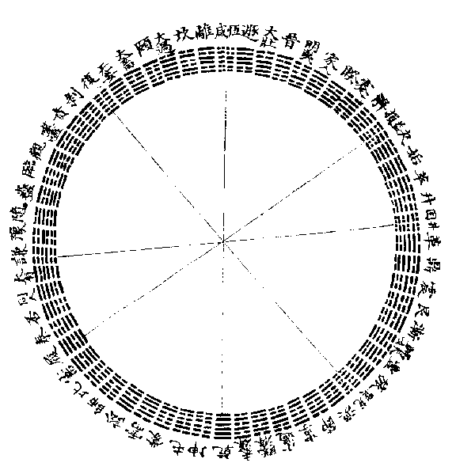
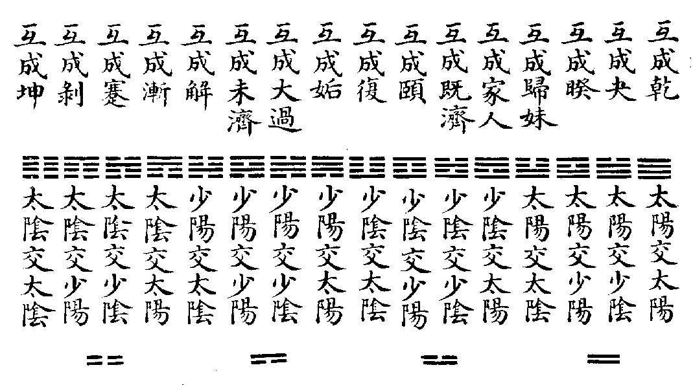
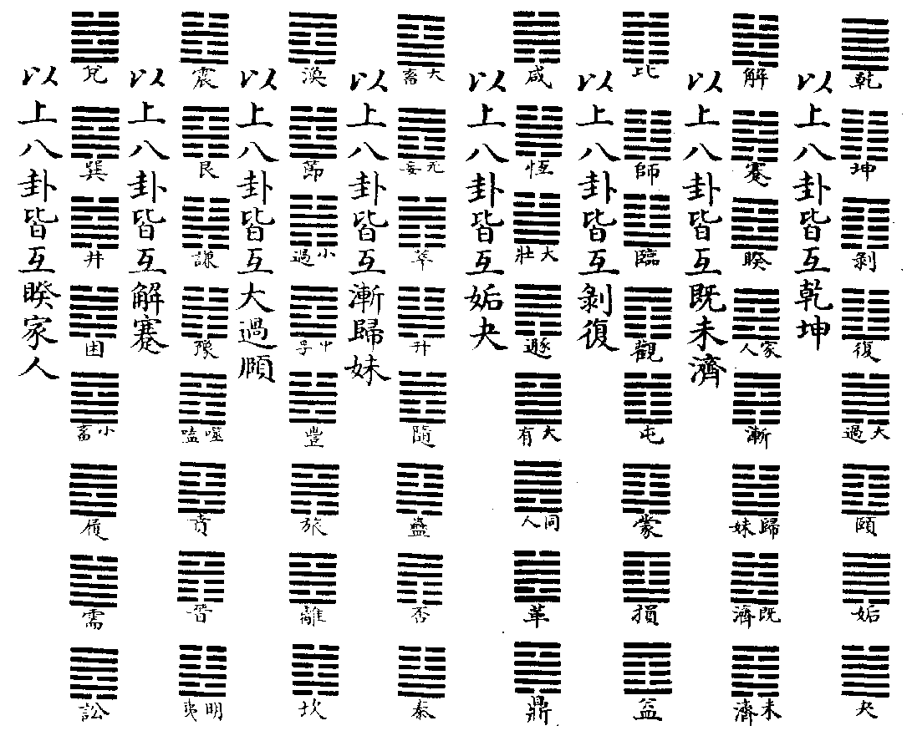
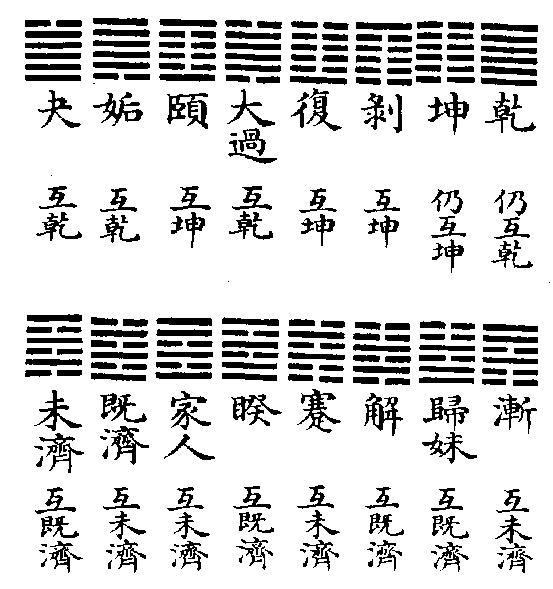
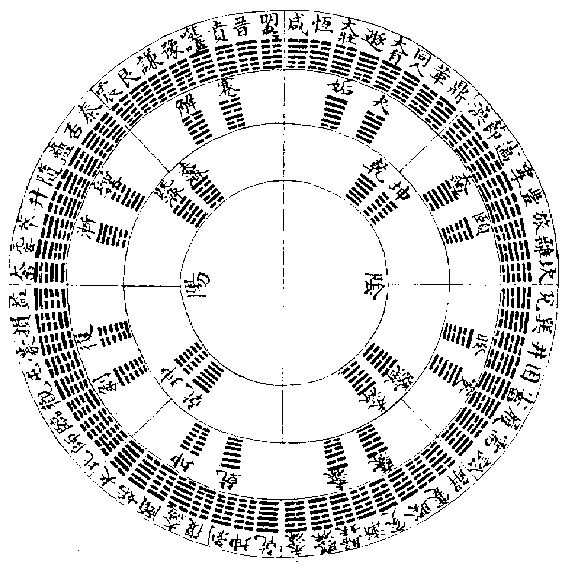
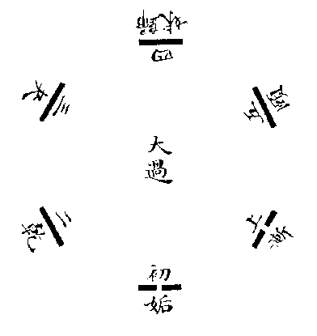

# Imperially Compiled Balanced Interpretations of the Zhou Changes

## Juan Twenty-Two · 卷二十二

The complete **Clarifying the Meanings of the Sequence and Miscellaneous Hexagrams (序卦雜卦明義)**. [Chinese source](../source/juan-22.md) · [Translation conventions](README.md)

**Voices:** This is the imperial compilers’ explanatory essay. Its discussions, two brief source glosses, and quotations from the Miscellaneous Wing are distinguished. The English diagram keys translate the retained images’ labels; numerical tables and navigation are reading aids, not new canonical text. Translator’s notes follow the complete juan.

[Introduction](#introduction) · [Sequence principles](#sequence-principles) · [Eight groups](#sequence-groups) · [Sequence circle](#sequence-circle) · [Overlapping figures](#four-images) · [Fourteen exceptions](#exceptions) · [Regular and variant arrangements](#classification) · [Final eight](#cyclic-overlaps) · [Endnotes](#translators-endnotes)

<!-- Source: https://www.eee-learning.com/book/4719 -->

<!-- BEGIN TRANSLATION: eee-4719:001 -->

Imperially Compiled Balanced Interpretations of the Zhou Changes · Juan Twenty-Two.

<!-- END TRANSLATION: eee-4719:001 -->

<!-- BEGIN TRANSLATION: eee-4719:002 -->

## Clarifying the Meanings of the Sequence and Miscellaneous Hexagrams · 序卦雜卦明義

<!-- END TRANSLATION: eee-4719:002 -->

<!-- BEGIN TRANSLATION: eee-4719:003 -->

**Compilers’ Discussion.** Both the ordering of the hexagrams and their interweaving come from King Wen. His reasons for arranging and interweaving them must have embodied a profound intention, and must also have followed certain general principles. When the Master wrote their commentaries, he followed these arrangements to illuminate how yin and yang give rise to one another and stand opposite one another, revealing the inexhaustibility of the Way of the Changes. King Wen’s establishment of the pattern is supremely subtle; the Master’s insight into its principles is supremely vast. Neither can be left unexamined.[^j22-voice]

<!-- END TRANSLATION: eee-4719:003 -->

<!-- BEGIN TRANSLATION: eee-4719:004 -->

**Compilers’ Discussion.** Han, Kong, and other scholars questioned the hexagram sequence: if it were as the Master explained it, the hexagrams ought not all to occur in opposed pairs. Thus Cheng’s Commentary, after setting out the Master’s meaning under the individual hexagrams, also provided an essay on the meaning of the Upper and Lower Parts, drawing out what had not yet been fully expressed. As for Ouyang Xiu and others, who flatly denied that the Sequence was Confucius’s work, their assertion was unfounded. In the Miscellaneous Hexagrams, Qian and Kun are followed by Holding Together and The Army; thereafter its arrangement differs throughout from the Sequence. Can there be no meaning in this? Yet none of the scholars reached it. Only Master Hu of the Yuan faintly disclosed a beginning at the end of the chapter, without carrying its thread to completion. We now follow Cheng’s and Hu’s explanations and examine in detail how these two works order their categories and interweave their arrangements. We append this account under the title “Clarifying the Meanings.”[^j22-han-kong]

<!-- END TRANSLATION: eee-4719:004 -->

<!-- BEGIN TRANSLATION: eee-4719:005 -->

## The Sequence of the Hexagrams · 序卦

<!-- END TRANSLATION: eee-4719:005 -->

<!-- BEGIN TRANSLATION: eee-4719:006 -->

**Source gloss.** Master Cheng wrote an essay on the meaning of the Upper and Lower Parts. We now take his intention as our starting point and examine it in detail.

<!-- END TRANSLATION: eee-4719:006 -->

<!-- BEGIN TRANSLATION: eee-4719:007 -->

**Compilers’ Discussion.** The Upper Part is yang: it concerns the Way of Heaven. Thus the hexagrams in which Heaven’s Way is properly ordered, in which yang trigrams or yang lines flourish, and in which yin and yang, elder and younger, earlier and later follow their due order all belong to the Upper Part. The Lower Part is yin: it concerns human affairs. Thus the hexagrams of human interaction, of flourishing yin trigrams or yin lines, and of mingled responses between yin and yang, in which elder and younger, earlier and later depart from their due order, all belong to the Lower Part. Considered as the Eight Trigrams, Qian and Kun are yin and yang in their purity; Kan and Li are yin and yang in their centeredness. These are the regular within the regular, and therefore count as yang. Zhen and Xun are the beginning of yin and yang’s interaction; Gen and Dui are its culmination. These are interaction within the regular, and therefore count as yin.[^j22-classification][^j22-order]

<!-- END TRANSLATION: eee-4719:007 -->

<!-- BEGIN TRANSLATION: eee-4719:008 -->

**Compilers’ Discussion.** Considered through the combinations of the Eight Trigrams, only Obstruction and Peace—the interaction of Heaven and Earth—are the regular within interaction; thus they count as yang. Influence and Constancy, Decrease and Increase, After Completion and Before Completion are interactions among the six children: interaction within interaction. Thus they count as yin. Qian’s combinations with yang trigrams produce six hexagrams. Waiting and Contention, Without Falsity and Great Restraint all show flourishing yang. Yet when we also consider the lines, Great Strength has yang extending past the middle, while Retreat has yin gradually growing. Although formed from yang trigrams, these two therefore occupy the yin division. Kun’s combinations with yin trigrams likewise produce six hexagrams. Advance and Darkening of the Light, Gathering and Pushing Upward all show flourishing yin. But in Approach yang gradually grows, and in Viewing yin has passed the middle. Although formed from yin trigrams, these two therefore occupy the yang division. Qian’s combinations with yin trigrams produce another six. Small Restraint and Treading, Fellowship and Great Possession each have five yang and one yin: yang flourishes. Yet when the lines are also considered, in Breakthrough yang is already overextended, while in Coming to Meet yin is first born. These cannot count as yang; they count as yin. Kun’s combinations with yang trigrams produce six: The Army and Holding Together, Modesty and Enthusiasm, Splitting Apart and Return. All have five yin and one yang. Yang has the function of governing yin: although the yin are numerous, they do not flourish as masters but serve; although the yang is solitary, it is not weakened but governs. Thus all these count not as yin but as yang. Combinations among the yang trigrams produce six more. Difficulty at the Beginning, Unformed Understanding, and Nourishment maintain the order of elder and younger, earlier and later; therefore they count as yang. Limping, Release, and Small Excess lose that order; therefore they count as yin. Combinations among the yin trigrams also produce six. Great Excess alone is Nourishment’s counterpart and maintains its due order; thus it too counts as yang. The Family, Opposition, Revolution, The Cauldron, and Inner Sincerity all count as yin. Revolution and The Cauldron preserve the order, however, so they remain yang within yin. Finally, combinations between yin and yang trigrams produce twelve hexagrams. Six are orderly: Following and Decay, Biting Through and Adornment are yin within yang; The Well and Oppression are yang within yin. Six are out of order: Gradual Progress and The Marrying Maiden, Abundance and The Wanderer, Dispersion and Limitation are yin within yin. Once the division between the two Parts has been settled, the sequence of their successive sections and hexagrams is determined by the flourishing and decline, waning and waxing, of yin and yang, as explained below.[^j22-stage]

<!-- END TRANSLATION: eee-4719:008 -->

<!-- BEGIN TRANSLATION: eee-4719:009 -->

**Sequence group.** Qian, Kun, Difficulty at the Beginning, Unformed Understanding, Waiting, Contention, The Army, Holding Together, Small Restraint, Treading.[^j22-eight-groups]

<!-- END TRANSLATION: eee-4719:009 -->

<!-- BEGIN TRANSLATION: eee-4719:010 -->

**Group label.** The preceding are the First Section of the Yang Hexagrams.

<!-- END TRANSLATION: eee-4719:010 -->

<!-- BEGIN TRANSLATION: eee-4719:011 -->

**Sequence group.** Peace, Obstruction, Fellowship, Great Possession, Modesty, Enthusiasm.

<!-- END TRANSLATION: eee-4719:011 -->

<!-- BEGIN TRANSLATION: eee-4719:012 -->

**Group label.** The preceding are the Second Section of the Yang Hexagrams.

<!-- END TRANSLATION: eee-4719:012 -->

<!-- BEGIN TRANSLATION: eee-4719:013 -->

**Sequence group.** Following, Decay, Approach, Viewing, Biting Through, Adornment, Splitting Apart, Return.

<!-- END TRANSLATION: eee-4719:013 -->

<!-- BEGIN TRANSLATION: eee-4719:014 -->

**Group label.** The preceding are the Third Section of the Yang Hexagrams.

<!-- END TRANSLATION: eee-4719:014 -->

<!-- BEGIN TRANSLATION: eee-4719:015 -->

**Sequence group.** Without Falsity, Great Restraint, Nourishment, Great Excess, Repeated Danger, Clinging.

<!-- END TRANSLATION: eee-4719:015 -->

<!-- BEGIN TRANSLATION: eee-4719:016 -->

**Group label.** The preceding are the Fourth Section of the Yang Hexagrams.

<!-- END TRANSLATION: eee-4719:016 -->

<!-- BEGIN TRANSLATION: eee-4719:017 -->

**Sequence group.** Influence, Constancy, Retreat, Great Strength, Advance, Darkening of the Light, The Family, Opposition, Limping, Release.

<!-- END TRANSLATION: eee-4719:017 -->

<!-- BEGIN TRANSLATION: eee-4719:018 -->

**Group label.** The preceding are the First Section of the Yin Hexagrams.

<!-- END TRANSLATION: eee-4719:018 -->

<!-- BEGIN TRANSLATION: eee-4719:019 -->

**Sequence group.** Decrease, Increase, Breakthrough, Coming to Meet, Gathering, Pushing Upward.

<!-- END TRANSLATION: eee-4719:019 -->

<!-- BEGIN TRANSLATION: eee-4719:020 -->

**Group label.** The preceding are the Second Section of the Yin Hexagrams.

<!-- END TRANSLATION: eee-4719:020 -->

<!-- BEGIN TRANSLATION: eee-4719:021 -->

**Sequence group.** Oppression, The Well, Revolution, The Cauldron, Shock, Keeping Still, Gradual Progress, The Marrying Maiden, Abundance, The Wanderer, Penetration, Joy.

<!-- END TRANSLATION: eee-4719:021 -->

<!-- BEGIN TRANSLATION: eee-4719:022 -->

**Group label.** The preceding are the Third Section of the Yin Hexagrams.

<!-- END TRANSLATION: eee-4719:022 -->

<!-- BEGIN TRANSLATION: eee-4719:023 -->

**Sequence group.** Dispersion, Limitation, Inner Sincerity, Small Excess, After Completion, Before Completion.

<!-- END TRANSLATION: eee-4719:023 -->

<!-- BEGIN TRANSLATION: eee-4719:024 -->

**Group label.** The preceding are the Fourth Section of the Yin Hexagrams.

<!-- END TRANSLATION: eee-4719:024 -->

<!-- BEGIN TRANSLATION: eee-4719:025 -->

#### First Section of the Yang Hexagrams

<!-- END TRANSLATION: eee-4719:025 -->

<!-- BEGIN TRANSLATION: eee-4719:026 -->

**Compilers’ Discussion.** Qian and Kun are the source of the assembled hexagrams, and therefore stand at the beginning of the Part. Earlier scholars said that the Zhou Changes begins with Qian: this is the order established by King Wen and cannot be altered. After Qian and Kun, the three sons hold the honored place. Difficulty at the Beginning and Unformed Understanding are hexagrams of the three sons. In both, elder and younger, earlier and later retain their order, obtaining the proper pattern of the yang Way; thus they follow Qian and Kun. Waiting and Contention have yang trigrams both above and below, and yang lines in both the second and fifth places. Yang flourishes; thus they follow Difficulty at the Beginning and Unformed Understanding. The Army and Holding Together each have one yang governing the many yin, occupying the central second or fifth place. Here too yang flourishes; thus they follow Waiting and Contention. Small Restraint and Treading have five yang and one yin. Yang is already overwhelmingly numerous, while the two yin lines withdraw to the noncentral third and fourth places. Both are hexagrams of flourishing yang, and therefore follow The Army and Holding Together.[^j22-two-yin]

<!-- END TRANSLATION: eee-4719:026 -->

<!-- BEGIN TRANSLATION: eee-4719:027 -->

#### Second Section of the Yang Hexagrams

<!-- END TRANSLATION: eee-4719:027 -->

<!-- BEGIN TRANSLATION: eee-4719:028 -->

**Compilers’ Discussion.** Peace and Obstruction unite the forms of Qian and Kun, and share their meaning. Yet because they involve interaction between Qian and Kun, they rank after them. Fellowship and Great Possession are the opposites of The Army and Holding Together; but because their numerous yang lines flourish to the utmost, they resemble Small Restraint and Treading while ranking after The Army and Holding Together. Modesty and Enthusiasm are the opposites of Small Restraint and Treading; but because yang governs each hexagram, they resemble The Army and Holding Together while ranking after Small Restraint and Treading. These six together form the next degree of flourishing yang.

<!-- END TRANSLATION: eee-4719:028 -->

<!-- BEGIN TRANSLATION: eee-4719:029 -->

#### Third Section of the Yang Hexagrams

<!-- END TRANSLATION: eee-4719:029 -->

<!-- BEGIN TRANSLATION: eee-4719:030 -->

**Compilers’ Discussion.** In the two preceding sections, apart from Difficulty at the Beginning and Unformed Understanding, which are composed entirely of trigrams from the three sons, all the others have Qian or Kun as their governing element. There has not yet been interaction between sons and daughters; hence we speak of flourishing yang. Only with Following and Decay, Biting Through and Adornment, do sons and daughters interact. This is yin’s first emergence. Yet elder and younger, earlier and later still retain their due order, so these remain yin within yang. Following and Decay are followed by Approach and Viewing; Biting Through and Adornment by Splitting Apart and Return. Yang therefore flourishes again.

<!-- END TRANSLATION: eee-4719:030 -->

<!-- BEGIN TRANSLATION: eee-4719:031 -->

#### Fourth Section of the Yang Hexagrams

<!-- END TRANSLATION: eee-4719:031 -->

<!-- BEGIN TRANSLATION: eee-4719:032 -->

**Compilers’ Discussion.** Without Falsity and Great Restraint combine Qian with yang trigrams, sharing the meaning of Waiting and Contention. Yet their second and fifth places are not both yang, so they rank after Waiting and Contention. In Nourishment and Great Excess, male and female remain in their separate kinds, and elder and younger, earlier and later follow their order, as in Difficulty at the Beginning and Unformed Understanding. Yet the two are not both composed of yang trigrams, so they rank after that pair. Kan and Li receive the central qi of Heaven and Earth, sharing the meaning of Qian and Kun. Yet they are trigrams of the six children, and so again rank after Qian and Kun. These six correspond, in reverse order, to the first six hexagrams of the Part. Together they are hexagrams in which yang flourishes anew.[^j22-reversed-comparison]

<!-- END TRANSLATION: eee-4719:032 -->

<!-- BEGIN TRANSLATION: eee-4719:033 -->

#### First Section of the Yin Hexagrams

<!-- END TRANSLATION: eee-4719:033 -->

<!-- BEGIN TRANSLATION: eee-4719:034 -->

**Compilers’ Discussion.** The Lower Part is concerned with interaction in human affairs, and therefore begins with the Way of husband and wife. When male and female unite, in youth their feeling is undivided; in maturity their commitment is deep. Thus Influence comes first and Constancy follows. Retreat and Great Strength show yin growing and yang passing beyond its proper measure: yin flourishes. Thus they follow Influence and Constancy. Advance and Darkening of the Light have yin trigrams above and below, with yin lines in both the second and fifth places: they oppose Waiting and Contention in the yang division. The Family and Opposition are formed from the three daughter trigrams, with elder and younger out of order. This is the yin Way, opposing Difficulty at the Beginning and Unformed Understanding in the yang division. These four therefore follow Retreat and Great Strength. Limping and Release are originally formed from the three son trigrams, but they too put elder and younger out of order, opposing Difficulty at the Beginning and Unformed Understanding. Thus they follow The Family and Opposition.

<!-- END TRANSLATION: eee-4719:034 -->

<!-- BEGIN TRANSLATION: eee-4719:035 -->

#### Second Section of the Yin Hexagrams

<!-- END TRANSLATION: eee-4719:035 -->

<!-- BEGIN TRANSLATION: eee-4719:036 -->

**Compilers’ Discussion.** Decrease and Increase are the interactions of the youngest pair and the eldest pair, sharing the meaning of Influence and Constancy. Breakthrough and Coming to Meet show yang reaching its extreme and yin being born, sharing the meaning of Retreat and Great Strength. Gathering and Pushing Upward combine Kun with yin trigrams, sharing the meaning of Advance and Darkening of the Light. Thus these six follow one another as the next degree of flourishing yin.

<!-- END TRANSLATION: eee-4719:036 -->

<!-- BEGIN TRANSLATION: eee-4719:037 -->

#### Third Section of the Yin Hexagrams

<!-- END TRANSLATION: eee-4719:037 -->

<!-- BEGIN TRANSLATION: eee-4719:038 -->

**Compilers’ Discussion.** In Oppression and The Well, male and female interact in due order. Their meaning resembles Following and Decay, Biting Through and Adornment in the yang division: they are yang within yin. Revolution and The Cauldron are formed from the three daughter trigrams, like The Family and Opposition; but elder and younger are duly ordered, so they follow Oppression and The Well, just as Great Excess follows Nourishment. Although Shock and Keeping Still are governing hexagrams of the Lower Classic, they are originally yang trigrams. Thus these six together are yang within yin. In Gradual Progress and The Marrying Maiden, Abundance and The Wanderer, male and female interact out of order, opposing Oppression and The Well, Revolution and The Cauldron. Penetration and Joy are yin trigrams, opposing Shock and Keeping Still. These six therefore turn from yang toward yin once more.[^j22-inner-yang]

<!-- END TRANSLATION: eee-4719:038 -->

<!-- BEGIN TRANSLATION: eee-4719:039 -->

#### Fourth Section of the Yin Hexagrams

<!-- END TRANSLATION: eee-4719:039 -->

<!-- BEGIN TRANSLATION: eee-4719:040 -->

**Compilers’ Discussion.** Gradual Progress and The Marrying Maiden, Abundance and The Wanderer, Dispersion and Limitation are six hexagrams of male and female interacting out of order; in this they belong to one kind. Yet in the pair Gradual Progress and The Marrying Maiden, both the eldest son and the eldest daughter are present; in Abundance and The Wanderer, the eldest son is present; in Dispersion and Limitation, only the eldest daughter is present. Dispersion and Limitation therefore bring this transformation to exhaustion, to the extreme of the yin Way. Inner Sincerity and Small Excess correspond to Nourishment and Great Excess in the Upper Part. Although Great Excess is formed from yin trigrams, it follows Nourishment because it preserves the order. Likewise, although Small Excess is formed from yang trigrams, it follows Inner Sincerity because it loses the order. This is the same principle by which Limping and Release follow The Family and Opposition. All are hexagrams in which yin flourishes anew. After Completion and Before Completion close the Part, with the greater weight falling on Before Completion. Its three yang lines are out of place: the male is exhausted, and yin’s flourishing reaches its extreme. Yet things cannot be utterly exhausted. Therefore Before Completion receives what precedes it and brings the work to its close.[^j22-unfinished-ending]

<!-- END TRANSLATION: eee-4719:040 -->

<!-- BEGIN TRANSLATION: eee-4719:041 -->

#### Circular Diagram of the Sequence

<!-- END TRANSLATION: eee-4719:041 -->

<!-- BEGIN TRANSLATION: eee-4719:042 -->

**Diagram key.** The circumference carries the sixty-four names translated in the eight Sequence groups above; radii divide the corresponding sections. The interpretive correspondences discussed below connect Qian with Influence/Constancy, Treading with Decrease/Increase, Modesty with Oppression/The Well, and Return with Penetration/Joy.[^j22-diagram-keys]

<!-- END TRANSLATION: eee-4719:042 -->

<!-- BEGIN TRANSLATION: eee-4719:043 -->

**Compilers’ Discussion.** In the Appended Statements, Confucius enumerates nine hexagrams from the Upper and Lower Parts: “Treading is virtue’s foundation; Modesty, virtue’s handle; Return, virtue’s root; Constancy, virtue’s firmness; Decrease, virtue’s cultivation; Increase, virtue’s abundance; Oppression, virtue’s testing; The Well, virtue’s ground; Penetration, virtue’s discernment and decision.” Earlier scholars used these hexagrams to establish correspondences between the two Classics. Qian corresponds to Influence and Constancy; Treading to Decrease and Increase; Modesty to Oppression and The Well; Return to Penetration and Joy. Each pair in the Lower Part corresponds to one hexagram in the Upper: twelve hexagrams in all. In this way the numbers of the two Parts become equal. Yet why are only nine taken from these twelve? Qian and Influence are the beginnings; Joy is the end. The beginning and end are set aside, and the intermediate hexagrams selected, to reveal the gradual waning and waxing, flourishing and decline, of yin and yang. Hence there are only nine.[^j22-nine-virtues]

<!-- END TRANSLATION: eee-4719:043 -->

<!-- BEGIN TRANSLATION: eee-4719:044 -->

**Compilers’ Discussion.** The sequence of yin and yang’s waning and waxing, flourishing and decline, in the four sections of each Part examined above accords closely with this diagram.

<!-- END TRANSLATION: eee-4719:044 -->

<!-- BEGIN TRANSLATION: eee-4719:045 -->

## The Miscellaneous Hexagrams · 雜卦

<!-- END TRANSLATION: eee-4719:045 -->

<!-- BEGIN TRANSLATION: eee-4719:046 -->

**Source gloss.** Some earlier scholars understood the Miscellaneous Hexagrams through overlapping hexagrams. We now adopt their explanation and examine it in detail.[^j22-overlap]

<!-- END TRANSLATION: eee-4719:046 -->

<!-- BEGIN TRANSLATION: eee-4719:047 -->

#### Diagram of the Four Images Interacting to Form Sixteen Configurations

<!-- END TRANSLATION: eee-4719:047 -->

<!-- BEGIN TRANSLATION: eee-4719:048 -->

**Diagram key.** Each printed label reads “overlapping produces” the named figure. Read the diagram from right to left. The lower Image and upper Image combine as follows.[^j22-dyads]

| Lower Image | Upper Image | Overlapping result |
|---|---|---|
| Old yang 太陽 | Old yang 太陽 | 1. Qian 乾 |
| Old yang 太陽 | Young yin 少陰 | 43. Breakthrough 夬 |
| Old yang 太陽 | Young yang 少陽 | 38. Opposition 睽 |
| Old yang 太陽 | Old yin 太陰 | 54. The Marrying Maiden 歸妹 |
| Young yin 少陰 | Old yang 太陽 | 37. The Family 家人 |
| Young yin 少陰 | Young yin 少陰 | 63. After Completion 既濟 |
| Young yin 少陰 | Young yang 少陽 | 27. Nourishment 頤 |
| Young yin 少陰 | Old yin 太陰 | 24. Return 復 |
| Young yang 少陽 | Old yang 太陽 | 44. Coming to Meet 姤 |
| Young yang 少陽 | Young yin 少陰 | 28. Great Excess 大過 |
| Young yang 少陽 | Young yang 少陽 | 64. Before Completion 未濟 |
| Young yang 少陽 | Old yin 太陰 | 40. Release 解 |
| Old yin 太陰 | Old yang 太陽 | 53. Gradual Progress 漸 |
| Old yin 太陰 | Young yin 少陰 | 39. Limping 蹇 |
| Old yin 太陰 | Young yang 少陽 | 23. Splitting Apart 剝 |
| Old yin 太陰 | Old yin 太陰 | 2. Kun 坤 |

<!-- END TRANSLATION: eee-4719:048 -->

<!-- BEGIN TRANSLATION: eee-4719:049 -->

**Compilers’ Discussion.** This is the root of overlapping hexagrams. Already when four strokes have been formed, their overlaps yield these sixteen hexagrams. Thus, after all sixty-four hexagrams have been completed, taking their middle lines in overlap yields only these sixteen. Even if the six lines are taken cyclically in overlap, the results are still only these sixteen.

<!-- END TRANSLATION: eee-4719:049 -->

<!-- BEGIN TRANSLATION: eee-4719:050 -->

**Compilers’ Discussion.** The four strokes yield sixteen overlapping hexagrams. Examine also the two middle strokes: patterns producing Qian, Kun, Splitting Apart, Return, Great Excess, Nourishment, Coming to Meet, and Breakthrough all have old yang or old yin in the middle pair. Patterns producing Gradual Progress, The Marrying Maiden, Release, Limping, Opposition, The Family, After Completion, and Before Completion all have young yang or young yin in the middle pair. Thus the sixteen configurations return to the Four Images.[^j22-middle-pair]

<!-- END TRANSLATION: eee-4719:050 -->

<!-- BEGIN TRANSLATION: eee-4719:051 -->

#### Diagram of Overlapping Hexagrams Formed from the Middle Four Lines of the Sixty-Four

<!-- END TRANSLATION: eee-4719:051 -->

<!-- BEGIN TRANSLATION: eee-4719:052 -->

**Diagram key.** Columns are numbered from right to left; within each, read downward. Their printed summaries say, respectively, that the eight figures yield Qian/Kun; After/Before Completion; Splitting Apart/Return; Coming to Meet/Breakthrough; Gradual Progress/The Marrying Maiden; Great Excess/Nourishment; Release/Limping; Opposition/The Family. The individual correspondences are:

| Printed column | Original figure | Overlapping figure |
|---:|---|---|
| 1 | 1. Qian 乾 | 1. Qian 乾 |
| 1 | 2. Kun 坤 | 2. Kun 坤 |
| 1 | 23. Splitting Apart 剝 | 2. Kun 坤 |
| 1 | 24. Return 復 | 2. Kun 坤 |
| 1 | 28. Great Excess 大過 | 1. Qian 乾 |
| 1 | 27. Nourishment 頤 | 2. Kun 坤 |
| 1 | 44. Coming to Meet 姤 | 1. Qian 乾 |
| 1 | 43. Breakthrough 夬 | 1. Qian 乾 |
| 2 | 40. Release 解 | 63. After Completion 既濟 |
| 2 | 39. Limping 蹇 | 64. Before Completion 未濟 |
| 2 | 38. Opposition 睽 | 63. After Completion 既濟 |
| 2 | 37. The Family 家人 | 64. Before Completion 未濟 |
| 2 | 53. Gradual Progress 漸 | 64. Before Completion 未濟 |
| 2 | 54. The Marrying Maiden 歸妹 | 63. After Completion 既濟 |
| 2 | 63. After Completion 既濟 | 64. Before Completion 未濟 |
| 2 | 64. Before Completion 未濟 | 63. After Completion 既濟 |
| 3 | 8. Holding Together 比 | 23. Splitting Apart 剝 |
| 3 | 7. The Army 師 | 24. Return 復 |
| 3 | 19. Approach 臨 | 24. Return 復 |
| 3 | 20. Viewing 觀 | 23. Splitting Apart 剝 |
| 3 | 3. Difficulty at the Beginning 屯 | 23. Splitting Apart 剝 |
| 3 | 4. Unformed Understanding 蒙 | 24. Return 復 |
| 3 | 41. Decrease 損 | 24. Return 復 |
| 3 | 42. Increase 益 | 23. Splitting Apart 剝 |
| 4 | 31. Influence 咸 | 44. Coming to Meet 姤 |
| 4 | 32. Constancy 恒 | 43. Breakthrough 夬 |
| 4 | 34. Great Strength 大壯 | 43. Breakthrough 夬 |
| 4 | 33. Retreat 遯 | 44. Coming to Meet 姤 |
| 4 | 14. Great Possession 大有 | 43. Breakthrough 夬 |
| 4 | 13. Fellowship 同人 | 44. Coming to Meet 姤 |
| 4 | 49. Revolution 革 | 44. Coming to Meet 姤 |
| 4 | 50. The Cauldron 鼎 | 43. Breakthrough 夬 |
| 5 | 26. Great Restraint 大畜 | 54. The Marrying Maiden 歸妹 |
| 5 | 25. Without Falsity 无妄 | 53. Gradual Progress 漸 |
| 5 | 45. Gathering 萃 | 53. Gradual Progress 漸 |
| 5 | 46. Pushing Upward 升 | 54. The Marrying Maiden 歸妹 |
| 5 | 17. Following 隨 | 53. Gradual Progress 漸 |
| 5 | 18. Decay 蠱 | 54. The Marrying Maiden 歸妹 |
| 5 | 12. Obstruction 否 | 53. Gradual Progress 漸 |
| 5 | 11. Peace 泰 | 54. The Marrying Maiden 歸妹 |
| 6 | 59. Dispersion 渙 | 27. Nourishment 頤 |
| 6 | 60. Limitation 節 | 27. Nourishment 頤 |
| 6 | 62. Small Excess 小過 | 28. Great Excess 大過 |
| 6 | 61. Inner Sincerity 中孚 | 27. Nourishment 頤 |
| 6 | 55. Abundance 豐 | 28. Great Excess 大過 |
| 6 | 56. The Wanderer 旅 | 28. Great Excess 大過 |
| 6 | 30. Clinging 離 | 28. Great Excess 大過 |
| 6 | 29. Repeated Danger 坎 | 27. Nourishment 頤 |
| 7 | 51. Shock 震 | 39. Limping 蹇 |
| 7 | 52. Keeping Still 艮 | 40. Release 解 |
| 7 | 15. Modesty 謙 | 40. Release 解 |
| 7 | 16. Enthusiasm 豫 | 39. Limping 蹇 |
| 7 | 21. Biting Through 噬嗑 | 39. Limping 蹇 |
| 7 | 22. Adornment 賁 | 40. Release 解 |
| 7 | 35. Advance 晉 | 39. Limping 蹇 |
| 7 | 36. Darkening of the Light 明夷 | 40. Release 解 |
| 8 | 58. Joy 兌 | 37. The Family 家人 |
| 8 | 57. Penetration 巽 | 38. Opposition 睽 |
| 8 | 48. The Well 井 | 38. Opposition 睽 |
| 8 | 47. Oppression 困 | 37. The Family 家人 |
| 8 | 9. Small Restraint 小畜 | 38. Opposition 睽 |
| 8 | 10. Treading 履 | 37. The Family 家人 |
| 8 | 5. Waiting 需 | 38. Opposition 睽 |
| 8 | 6. Contention 訟 | 37. The Family 家人 |

<!-- END TRANSLATION: eee-4719:052 -->

<!-- BEGIN TRANSLATION: eee-4719:053 -->

#### Diagram of the Sixteen Hexagrams Yielding Four by Overlap

<!-- END TRANSLATION: eee-4719:053 -->

<!-- BEGIN TRANSLATION: eee-4719:054 -->

**Diagram key.** Read the upper row from right to left, then the lower row from right to left. “Again overlaps to” is printed under Qian and Kun; the other labels read “overlaps to.”

| Figure | Its overlapping figure |
|---|---|
| 1. Qian 乾 | 1. Qian 乾 |
| 2. Kun 坤 | 2. Kun 坤 |
| 23. Splitting Apart 剝 | 2. Kun 坤 |
| 24. Return 復 | 2. Kun 坤 |
| 28. Great Excess 大過 | 1. Qian 乾 |
| 27. Nourishment 頤 | 2. Kun 坤 |
| 44. Coming to Meet 姤 | 1. Qian 乾 |
| 43. Breakthrough 夬 | 1. Qian 乾 |
| 53. Gradual Progress 漸 | 64. Before Completion 未濟 |
| 54. The Marrying Maiden 歸妹 | 63. After Completion 既濟 |
| 40. Release 解 | 63. After Completion 既濟 |
| 39. Limping 蹇 | 64. Before Completion 未濟 |
| 38. Opposition 睽 | 63. After Completion 既濟 |
| 37. The Family 家人 | 64. Before Completion 未濟 |
| 63. After Completion 既濟 | 64. Before Completion 未濟 |
| 64. Before Completion 未濟 | 63. After Completion 既濟 |

<!-- END TRANSLATION: eee-4719:054 -->

<!-- BEGIN TRANSLATION: eee-4719:055 -->

**Compilers’ Discussion.** The sixteen hexagrams whose overlaps yield Qian, Kun, After Completion, and Before Completion are precisely those produced by the overlaps of all the hexagrams. Thus these sixteen in turn yield only the four—Qian, Kun, After Completion, and Before Completion—just as the sixteen configurations return to the Four Images. The Four Images already contain the forms of Qian, Kun, After Completion, and Before Completion. Stack old yang three times and there is Qian; old yin three times and there is Kun; young yin three times and there is After Completion; young yang three times and there is Before Completion. Qian, Kun, After Completion, and Before Completion encompass the Way of the Changes. Thus both the Sequence and the Miscellaneous Hexagrams take these as their beginning and ending.[^j22-two-stages]

<!-- END TRANSLATION: eee-4719:055 -->

<!-- BEGIN TRANSLATION: eee-4719:056 -->

#### Circular Diagram of Overlapping Hexagrams

<!-- END TRANSLATION: eee-4719:056 -->

<!-- BEGIN TRANSLATION: eee-4719:057 -->

**Diagram key.** The outer ring names the sixty-four hexagrams; the next ring the sixteen overlapping figures; the inner ring Qian, Kun, After Completion, and Before Completion. The two preceding tables identify every name and its ordinary overlapping result. The six intermediate figures on the left are Splitting Apart, Return, Gradual Progress, The Marrying Maiden, Release, and Limping; those on the right are Coming to Meet, Breakthrough, Great Excess, Nourishment, Opposition, and The Family. Their placement expresses the families explained in the following paragraph.[^j22-circular-families]

<!-- END TRANSLATION: eee-4719:057 -->

<!-- BEGIN TRANSLATION: eee-4719:058 -->

**Compilers’ Discussion.** Qian and Kun are the underlying form; After Completion and Before Completion are its functioning. Therefore Qian and Kun begin the arrangement, and After Completion and Before Completion end it. Between them, the six figures on the left—Splitting Apart and Return, Gradual Progress and The Marrying Maiden, Release and Limping—are yang hexagrams. All take Zhen and Gen as their governing trigrams and are comprehended under Qian and Kun. The six on the right—Coming to Meet and Breakthrough, Great Excess and Nourishment, Opposition and The Family—are yin hexagrams. All take Xun and Dui as their governing trigrams and are comprehended under After Completion and Before Completion. Thus the outermost ring contains the sixty-four hexagrams; the next ring inward contains their sixteen overlapping figures; and the next inward contains the four figures yielded by the overlaps of those sixteen.

<!-- END TRANSLATION: eee-4719:058 -->

<!-- BEGIN TRANSLATION: eee-4719:059 -->

**Compilers’ Discussion.** Viewed by quadrants, those whose overlaps yield Qian and Kun come first, and those whose overlaps yield After Completion and Before Completion come after. Viewed by their left and right halves, the left is comprehended under Qian and Kun, the right under After Completion and Before Completion.

<!-- END TRANSLATION: eee-4719:059 -->

<!-- BEGIN TRANSLATION: eee-4719:060 -->

#### Fourteen Governing Hexagrams Outside the Overlapping-Hexagram Sequence

<!-- END TRANSLATION: eee-4719:060 -->

<!-- BEGIN TRANSLATION: eee-4719:061 -->

**Compilers’ Discussion.** Qian’s overlap yields Qian; Kun’s yields Kun; After Completion’s yields Before Completion; Before Completion’s yields After Completion. These four cannot be changed into other kinds, and therefore stand outside the overlapping-hexagram sequence. Among the six yang figures, Splitting Apart and Return combine Zhen and Gen with Kun; Gradual Progress and The Marrying Maiden combine Zhen and Gen with Xun and Dui; Release and Limping combine Zhen and Gen with Kan. Thus Zhen and Gen govern the yang overlapping hexagrams. Among the six yin figures, Coming to Meet and Breakthrough combine Xun and Dui with Qian; Great Excess and Nourishment combine Xun and Dui with Zhen and Gen; Opposition and The Family combine Xun and Dui with Li. Thus Xun and Dui govern the yin overlapping hexagrams.[^j22-fourteen]

<!-- END TRANSLATION: eee-4719:061 -->

<!-- BEGIN TRANSLATION: eee-4719:062 -->

**Compilers’ Discussion.** At the three-line level, Gen is yang’s culmination and Zhen its birth. At the six-line level, Splitting Apart is yang’s culmination and Return its birth. Thus Splitting Apart and Return image Gen and Zhen and stand at the head of the yang hexagrams. At the three-line level, Dui is yin’s culmination and Xun its birth. At the six-line level, Breakthrough is yin’s culmination and Coming to Meet its birth. Thus Breakthrough and Coming to Meet image Dui and Xun and stand at the head of the yin hexagrams. Qian and Kun function through Obstruction and Peace, just as Kan and Li function through After Completion and Before Completion. Obstruction and Peace are therefore the interaction of Qian and Kun, and the source of After Completion and Before Completion. These ten hexagrams likewise stand outside the overlapping-hexagram sequence. Whenever the Miscellaneous Hexagrams encounters these figures, it takes its meaning directly from the original hexagram rather than employing the overlapping form. All the others, from Holding Together and The Army through Waiting and Contention, are arranged by their overlapping forms.[^j22-trigram-analogy]

<!-- END TRANSLATION: eee-4719:062 -->

<!-- BEGIN TRANSLATION: eee-4719:063 -->

#### The Yin–Yang Sequence of Overlapping Hexagrams

<!-- END TRANSLATION: eee-4719:063 -->

<!-- BEGIN TRANSLATION: eee-4719:064 -->

**Classification.** From Qian and Kun through Advance and Darkening of the Light, twenty-eight figures form the yang division.[^j22-regular-variant]

<!-- END TRANSLATION: eee-4719:064 -->

<!-- BEGIN TRANSLATION: eee-4719:065 -->

**Compilers’ Discussion.** Their overlaps yield Splitting Apart, Return, Gradual Progress, The Marrying Maiden, Release, and Limping. Eighteen hexagrams from the Upper Classic are interwoven with ten from the Lower.

<!-- END TRANSLATION: eee-4719:065 -->

<!-- BEGIN TRANSLATION: eee-4719:066 -->

**Classification.** From The Well and Oppression through Waiting and Contention, twenty-eight figures form the yin division.

<!-- END TRANSLATION: eee-4719:066 -->

<!-- BEGIN TRANSLATION: eee-4719:067 -->

**Compilers’ Discussion.** Their overlaps yield Coming to Meet, Breakthrough, Great Excess, Nourishment, Opposition, and The Family. Eighteen hexagrams from the Lower Classic are interwoven with ten from the Upper.

<!-- END TRANSLATION: eee-4719:067 -->

<!-- BEGIN TRANSLATION: eee-4719:068 -->

**Classification.** From Qian and Kun through Biting Through and Adornment is the regular arrangement of the yang division.

<!-- END TRANSLATION: eee-4719:068 -->

<!-- BEGIN TRANSLATION: eee-4719:069 -->

**Compilers’ Discussion.** First Splitting Apart and Return; next Gradual Progress and The Marrying Maiden; next Release and Limping.

<!-- END TRANSLATION: eee-4719:069 -->

<!-- BEGIN TRANSLATION: eee-4719:070 -->

**Classification.** From Joy and Penetration through Advance and Darkening of the Light is the variant arrangement of the yang division.

<!-- END TRANSLATION: eee-4719:070 -->

<!-- BEGIN TRANSLATION: eee-4719:071 -->

**Compilers’ Discussion.** First Gradual Progress and The Marrying Maiden; next Splitting Apart and Return; next Release and Limping.

<!-- END TRANSLATION: eee-4719:071 -->

<!-- BEGIN TRANSLATION: eee-4719:072 -->

**Classification.** From The Well and Oppression through Obstruction and Peace is the variant arrangement of the yin division.

<!-- END TRANSLATION: eee-4719:072 -->

<!-- BEGIN TRANSLATION: eee-4719:073 -->

**Compilers’ Discussion.** First Opposition and The Family; next Coming to Meet and Breakthrough; next Great Excess and Nourishment.

<!-- END TRANSLATION: eee-4719:073 -->

<!-- BEGIN TRANSLATION: eee-4719:074 -->

**Classification.** From Great Strength and Retreat through Waiting and Contention is the regular arrangement of the yin division.

<!-- END TRANSLATION: eee-4719:074 -->

<!-- BEGIN TRANSLATION: eee-4719:075 -->

**Compilers’ Discussion.** First Coming to Meet and Breakthrough; next Great Excess and Nourishment; next Opposition and The Family.

<!-- END TRANSLATION: eee-4719:075 -->

<!-- BEGIN TRANSLATION: eee-4719:076 -->

#### Qian and Kun Head the Hexagrams

<!-- END TRANSLATION: eee-4719:076 -->

<!-- BEGIN TRANSLATION: eee-4719:077 -->

**Quotation — Miscellaneous Hexagrams.** Qian is firm; Kun yielding.[^j22-cited-wing]

<!-- END TRANSLATION: eee-4719:077 -->

<!-- BEGIN TRANSLATION: eee-4719:078 -->

**Compilers’ Discussion.** The Zhou Changes begins with Qian and Kun; neither the Sequence nor the Miscellaneous Hexagrams changes this. In terms of overlap, only Qian, Kun, After Completion, and Before Completion yield those same four figures again, without changing into other kinds. Yet After Completion still becomes Before Completion, and Before Completion becomes After Completion. Qian alone continues to yield Qian, Kun to yield Kun: their forms are settled and cannot change. The Way of the Changes is concerned with transformation and exchange. The Sequence concerns successive times giving rise to one another: transformation. The Miscellaneous Hexagrams concerns situations standing opposite one another: exchange. Yet without something unchanging to serve as their underlying form, there would be what the text calls “Qian and Kun destroyed, with no means of seeing the Changes.” From what, then, could transformation arise? Thus Qian and Kun come first; only afterward are the yin and yang overlapping hexagrams distinguished and arranged.

<!-- END TRANSLATION: eee-4719:078 -->

<!-- BEGIN TRANSLATION: eee-4719:079 -->

#### The Regular Yang Group: Splitting Apart and Return Come First

<!-- END TRANSLATION: eee-4719:079 -->

<!-- BEGIN TRANSLATION: eee-4719:080 -->

**Quotation — Miscellaneous Hexagrams.** Holding Together is gladness; The Army, concern. The meanings of Approach and Viewing involve giving and seeking. Difficulty at the Beginning appears without losing its place. Unformed Understanding is mingled, yet manifest. Shock rises; Keeping Still stops. Decrease and Increase are the beginnings of flourishing and decline.

<!-- END TRANSLATION: eee-4719:080 -->

<!-- BEGIN TRANSLATION: eee-4719:081 -->

**Compilers’ Discussion.** These eight hexagrams all have Splitting Apart or Return as their overlapping forms, while Shock and Keeping Still are interwoven among them. Zhen and Gen govern the yang hexagrams and embody the forms of Splitting Apart and Return. Holding Together and The Army, Approach and Viewing, Difficulty at the Beginning and Unformed Understanding all belong to the Upper Classic; only Decrease and Increase belong to the Lower. Shock and Keeping Still likewise belong to the Lower, and are therefore placed immediately before Decrease and Increase. (Of the six Upper-Classic figures, Holding Together and The Army have one yang each; Approach, Viewing, Difficulty at the Beginning, and Unformed Understanding have two each.)[^j22-eight-plus-two]

<!-- END TRANSLATION: eee-4719:081 -->

<!-- BEGIN TRANSLATION: eee-4719:082 -->

#### Next, Gradual Progress and The Marrying Maiden

<!-- END TRANSLATION: eee-4719:082 -->

<!-- BEGIN TRANSLATION: eee-4719:083 -->

**Quotation — Miscellaneous Hexagrams.** Great Restraint is timeliness; Without Falsity, calamity. Gathering collects; Pushing Upward does not return.

<!-- END TRANSLATION: eee-4719:083 -->

<!-- BEGIN TRANSLATION: eee-4719:084 -->

**Compilers’ Discussion.** These four all have Gradual Progress or The Marrying Maiden as their overlapping forms. In the yang division, Upper-Classic hexagrams precede those of the Lower. Thus Great Restraint and Without Falsity come first, Gathering and Pushing Upward after.

<!-- END TRANSLATION: eee-4719:084 -->

<!-- BEGIN TRANSLATION: eee-4719:085 -->

#### Next, Limping and Release

<!-- END TRANSLATION: eee-4719:085 -->

<!-- BEGIN TRANSLATION: eee-4719:086 -->

**Quotation — Miscellaneous Hexagrams.** Modesty makes light of itself; Enthusiasm grows slack. Biting Through is eating; Adornment is without color.

<!-- END TRANSLATION: eee-4719:086 -->

<!-- BEGIN TRANSLATION: eee-4719:087 -->

**Compilers’ Discussion.** These four all have Release or Limping as their overlapping forms. (Modesty and Enthusiasm have one yang each; Biting Through and Adornment have three each.)[^j22-pair-order]

<!-- END TRANSLATION: eee-4719:087 -->

<!-- BEGIN TRANSLATION: eee-4719:088 -->

**Compilers’ Discussion.** The foregoing completes the regular arrangement of the yang division.

<!-- END TRANSLATION: eee-4719:088 -->

<!-- BEGIN TRANSLATION: eee-4719:089 -->

#### The Variant Yang Group: Gradual Progress and The Marrying Maiden Come First

<!-- END TRANSLATION: eee-4719:089 -->

<!-- BEGIN TRANSLATION: eee-4719:090 -->

**Quotation — Miscellaneous Hexagrams.** Joy is visible; Penetration lies hidden.

<!-- END TRANSLATION: eee-4719:090 -->

<!-- BEGIN TRANSLATION: eee-4719:091 -->

**Compilers’ Discussion.** Zhen and Gen combine with Dui and Xun to form Gradual Progress and The Marrying Maiden. Those overlapping figures are about to be discussed; therefore Joy and Penetration precede them.

<!-- END TRANSLATION: eee-4719:091 -->

<!-- BEGIN TRANSLATION: eee-4719:092 -->

**Quotation — Miscellaneous Hexagrams.** Following is free of old encumbrances; Decay requires putting things in order.

<!-- END TRANSLATION: eee-4719:092 -->

<!-- BEGIN TRANSLATION: eee-4719:093 -->

**Compilers’ Discussion.** These two have Gradual Progress and The Marrying Maiden as their overlapping forms. The preceding arrangement began with Splitting Apart and Return: Heaven’s course. This one begins with Gradual Progress and The Marrying Maiden: human affairs.

<!-- END TRANSLATION: eee-4719:093 -->

<!-- BEGIN TRANSLATION: eee-4719:094 -->

#### Next, Splitting Apart and Return

<!-- END TRANSLATION: eee-4719:094 -->

<!-- BEGIN TRANSLATION: eee-4719:095 -->

**Quotation — Miscellaneous Hexagrams.** Splitting Apart is decay; Return is coming back.

<!-- END TRANSLATION: eee-4719:095 -->

<!-- BEGIN TRANSLATION: eee-4719:096 -->

**Compilers’ Discussion.** These two are not interpreted through their overlapping forms; only the meanings of Splitting Apart and Return themselves are taken. Here Splitting Apart returns to Return; at the end of the chapter, Coming to Meet concludes in Breakthrough. Both express support for yang.[^j22-splitting-return]

<!-- END TRANSLATION: eee-4719:096 -->

<!-- BEGIN TRANSLATION: eee-4719:097 -->

#### Next, Release and Limping

<!-- END TRANSLATION: eee-4719:097 -->

<!-- BEGIN TRANSLATION: eee-4719:098 -->

**Quotation — Miscellaneous Hexagrams.** Advance is daylight; Darkening of the Light is being struck down.

<!-- END TRANSLATION: eee-4719:098 -->

<!-- BEGIN TRANSLATION: eee-4719:099 -->

**Compilers’ Discussion.** These two have Release and Limping as their overlapping forms.

<!-- END TRANSLATION: eee-4719:099 -->

<!-- BEGIN TRANSLATION: eee-4719:100 -->

**Compilers’ Discussion.** The foregoing completes the variant arrangement of the yang division.

<!-- END TRANSLATION: eee-4719:100 -->

<!-- BEGIN TRANSLATION: eee-4719:101 -->

**Compilers’ Discussion.** Apart from the final eight hexagrams, which establish their own interpretive principles, the remaining figures enter the regular yin and yang groups. In the variant arrangements, only two figures from each family are presented to disclose the meaning.

<!-- END TRANSLATION: eee-4719:101 -->

<!-- BEGIN TRANSLATION: eee-4719:102 -->

**Compilers’ Discussion.** From Qian and Kun to this point, the yang division contains twenty-eight hexagrams.

<!-- END TRANSLATION: eee-4719:102 -->

<!-- BEGIN TRANSLATION: eee-4719:103 -->

#### The Variant Yin Group: Opposition and The Family Come First

<!-- END TRANSLATION: eee-4719:103 -->

<!-- BEGIN TRANSLATION: eee-4719:104 -->

**Quotation — Miscellaneous Hexagrams.** The Well gives passage; Oppression is an encounter.

<!-- END TRANSLATION: eee-4719:104 -->

<!-- BEGIN TRANSLATION: eee-4719:105 -->

**Compilers’ Discussion.** These two have Opposition and The Family as their overlapping forms. The variant yang arrangement begins with Gradual Progress and The Marrying Maiden because Zhen and Gen combine with Xun and Dui: yin within yang. The variant yin arrangement begins with Opposition and The Family because Xun and Dui combine with Li: yin within yin. Yang gives primacy to the regular and proceeds from Heaven’s Way to human affairs. Yin gives primacy to variation and proceeds from human affairs to Heaven’s Way.

<!-- END TRANSLATION: eee-4719:105 -->

<!-- BEGIN TRANSLATION: eee-4719:106 -->

#### Next, Coming to Meet and Breakthrough

<!-- END TRANSLATION: eee-4719:106 -->

<!-- BEGIN TRANSLATION: eee-4719:107 -->

**Quotation — Miscellaneous Hexagrams.** Influence is swift; Constancy endures.

<!-- END TRANSLATION: eee-4719:107 -->

<!-- BEGIN TRANSLATION: eee-4719:108 -->

**Compilers’ Discussion.** These two have Coming to Meet and Breakthrough as their overlapping forms.

<!-- END TRANSLATION: eee-4719:108 -->

<!-- BEGIN TRANSLATION: eee-4719:109 -->

#### Next, Great Excess and Nourishment

<!-- END TRANSLATION: eee-4719:109 -->

<!-- BEGIN TRANSLATION: eee-4719:110 -->

**Quotation — Miscellaneous Hexagrams.** Dispersion separates; Limitation stops.

<!-- END TRANSLATION: eee-4719:110 -->

<!-- BEGIN TRANSLATION: eee-4719:111 -->

**Compilers’ Discussion.** These two both have Nourishment as their overlapping form.

<!-- END TRANSLATION: eee-4719:111 -->

<!-- BEGIN TRANSLATION: eee-4719:112 -->

**Compilers’ Discussion.** Among the sixty-four hexagrams, there are cases in which two figures yield only one overlapping figure: Splitting Apart and Return yield only Kun; Coming to Meet and Breakthrough yield only Qian; Dispersion and Limitation yield only Nourishment; Abundance and The Wanderer yield only Great Excess.[^j22-paired-results]

<!-- END TRANSLATION: eee-4719:112 -->

<!-- BEGIN TRANSLATION: eee-4719:113 -->

#### After Completion and Before Completion Govern the Yin Hexagrams

<!-- END TRANSLATION: eee-4719:113 -->

<!-- BEGIN TRANSLATION: eee-4719:114 -->

**Quotation — Miscellaneous Hexagrams.** Release relaxes; Limping encounters difficulty. Opposition puts outside; The Family brings within. Obstruction and Peace reverse their kinds.

<!-- END TRANSLATION: eee-4719:114 -->

<!-- BEGIN TRANSLATION: eee-4719:115 -->

**Compilers’ Discussion.** Release and Limping, Opposition and The Family all have After Completion or Before Completion as their overlapping forms, and therefore follow the variant yin group. Obstruction and Peace lie outside the overlapping-hexagram sequence and are the root of After Completion and Before Completion; therefore they follow the figures of that family. All yang hexagrams are comprehended under Qian and Kun, with particular emphasis on the regular group; hence Qian and Kun stand before Holding Together and The Army. All yin hexagrams are comprehended under After Completion and Before Completion, with particular emphasis on the variant group; hence Dispersion and Limitation are followed by Release and Limping, Opposition and The Family, Obstruction and Peace.[^j22-completion-family]

<!-- END TRANSLATION: eee-4719:115 -->

<!-- BEGIN TRANSLATION: eee-4719:116 -->

**Compilers’ Discussion.** The foregoing completes the variant arrangement of the yin division.

<!-- END TRANSLATION: eee-4719:116 -->

<!-- BEGIN TRANSLATION: eee-4719:117 -->

#### The Regular Yin Group: Coming to Meet and Breakthrough Come First

<!-- END TRANSLATION: eee-4719:117 -->

<!-- BEGIN TRANSLATION: eee-4719:118 -->

**Quotation — Miscellaneous Hexagrams.** Great Strength stops; Retreat withdraws. Great Possession has the multitude; Fellowship brings closeness. Revolution removes the old; The Cauldron takes up the new.

<!-- END TRANSLATION: eee-4719:118 -->

<!-- BEGIN TRANSLATION: eee-4719:119 -->

**Compilers’ Discussion.** These six all have Coming to Meet or Breakthrough as their overlapping forms. Great Strength and Retreat in the yin division resemble Approach and Viewing in the yang division; Great Possession and Fellowship in the yin division resemble Holding Together and The Army in the yang division. Earlier, among the yang hexagrams, Holding Together and The Army came first, then Approach and Viewing. Here Great Strength and Retreat come first, then Great Possession and Fellowship, because the yin division places Lower-Classic figures before Upper-Classic ones. Revolution and The Cauldron in the yin division resemble Difficulty at the Beginning and Unformed Understanding in the yang division.

<!-- END TRANSLATION: eee-4719:119 -->

<!-- BEGIN TRANSLATION: eee-4719:120 -->

#### Next, Great Excess and Nourishment

<!-- END TRANSLATION: eee-4719:120 -->

<!-- BEGIN TRANSLATION: eee-4719:121 -->

**Quotation — Miscellaneous Hexagrams.** Small Excess goes beyond; Inner Sincerity is trustworthiness. Abundance has many affairs. Few close companions: this is The Wanderer. Clinging rises; Repeated Danger descends.

<!-- END TRANSLATION: eee-4719:121 -->

<!-- BEGIN TRANSLATION: eee-4719:122 -->

**Compilers’ Discussion.** These six all have Great Excess or Nourishment as their overlapping forms. Small Excess and Inner Sincerity, Abundance and The Wanderer belong to the Lower Classic and come first; Clinging and Repeated Danger belong to the Upper Classic and come after.

<!-- END TRANSLATION: eee-4719:122 -->

<!-- BEGIN TRANSLATION: eee-4719:123 -->

#### Next, Opposition and The Family

<!-- END TRANSLATION: eee-4719:123 -->

<!-- BEGIN TRANSLATION: eee-4719:124 -->

**Quotation — Miscellaneous Hexagrams.** Small Restraint has few; Treading does not rest. Waiting does not advance; Contention does not draw close.

<!-- END TRANSLATION: eee-4719:124 -->

<!-- BEGIN TRANSLATION: eee-4719:125 -->

**Compilers’ Discussion.** These four all have Opposition or The Family as their overlapping forms. (Small Restraint and Treading have one yin each; Waiting and Contention have two each.)

<!-- END TRANSLATION: eee-4719:125 -->

<!-- BEGIN TRANSLATION: eee-4719:126 -->

**Compilers’ Discussion.** The foregoing completes the regular arrangement of the yin division.

<!-- END TRANSLATION: eee-4719:126 -->

<!-- BEGIN TRANSLATION: eee-4719:127 -->

**Compilers’ Discussion.** From The Well and Oppression to this point, the yin division likewise contains twenty-eight hexagrams.

<!-- END TRANSLATION: eee-4719:127 -->

<!-- BEGIN TRANSLATION: eee-4719:128 -->

#### Diagram of Cyclic Overlapping Hexagrams

<!-- END TRANSLATION: eee-4719:128 -->

<!-- BEGIN TRANSLATION: eee-4719:129 -->

**Diagram key.** Great Excess (大過) is named at the center. The outer labels identify the starting line and result: line 1 → Coming to Meet 姤; line 6 → Gradual Progress 漸; line 5 → Nourishment 頤; line 4 → The Marrying Maiden 歸妹; line 3 → Breakthrough 夬; line 2 → Qian 乾. Each window takes four successive strokes cyclically; its overlapping form repeats the middle pair to produce six lines.[^j22-cyclic]

<!-- END TRANSLATION: eee-4719:129 -->

<!-- BEGIN TRANSLATION: eee-4719:130 -->

**Quotation — Miscellaneous Hexagrams.** Great Excess topples. Coming to Meet is encountering: the yielding meets the firm. Gradual Progress: a woman marrying waits for the man before setting out. Nourishment nourishes correctness. After Completion is settled. The Marrying Maiden is the woman’s completion; Before Completion, the man’s exhaustion. Breakthrough is decision: the firm decisively removes the yielding. The noble person’s Way grows; the petty person’s Way is troubled.[^j22-last-order]

<!-- END TRANSLATION: eee-4719:130 -->

<!-- BEGIN TRANSLATION: eee-4719:131 -->

**Compilers’ Discussion.** The preceding fifty-six hexagrams all stand in opposed pairs, as in the Sequence. These eight alone are interwoven without that pairing, to show that overlap is not confined to the four middle lines: all six lines can be taken cyclically in overlap. This holds for every hexagram. Why single out Great Excess? Of all the hexagrams, Great Excess alone has yang occupying the four middle places.[^j22-uniqueness] Moreover, beginning with its first line, the original hexagram turns leftward and its overlapping forms turn rightward. They begin precisely with Coming to Meet and end with Breakthrough and Qian, expressing how the Way of the Changes employs yin while honoring yang. Examine the diagram: from the first line to the fourth gives Coming to Meet; from the top to the third, Gradual Progress; from the fifth to the second, Nourishment; from the fourth to the first, The Marrying Maiden; from the third to the top, Breakthrough; from the second to the fifth, Qian. Yet the Master’s commentary does not name Qian here. Qian already stands at the opening; when Breakthrough completes its course, there is pure Qian. This is the meaning of beginning and end giving rise to one another. After Completion and Before Completion are outside these overlapping results and are appended here through their meaning. After yin and yang encounter one another, if there is the ritual propriety of Gradual Progress and the nourishment of rightness in Nourishment, there is After Completion: things are settled. If there is the transgression of propriety and loss of rightness in The Marrying Maiden, there is Before Completion: things are exhausted. Thus perverse yin must be decisively removed so that the yang Way may unfold. Only then does the noble person’s Way grow and the petty person’s Way become troubled. After Completion and Before Completion encompass the meaning of all sixty-four hexagrams. Therefore the Miscellaneous Hexagrams brings its chapter to completion through them, just as the Sequence does.[^j22-normative-close]

<!-- END TRANSLATION: eee-4719:131 -->

## Translator’s Endnotes

The base is the repository’s unchanged 易學網 text. Selective comparison used [the Siku Quanshu transcription, fixed revision 759599](<https://zh.wikisource.org/w/index.php?title=御纂周易折中_(四庫全書本)/卷22&oldid=759599>). Historical page images [2246](https://www.eee-learning.com/eeebook/middleyi/2246.png), [2280](https://www.eee-learning.com/eeebook/middleyi/2280.png), and [2281](https://www.eee-learning.com/eeebook/middleyi/2281.png) were checked for the passages identified below. Earlier translated juans supply the cited antecedent commentaries. Attested correction, repunctuation, retained variation, and unresolved claims are distinguished. This is not systematic facsimile collation or independent bilingual review.

[^j22-voice]: This final numbered juan is the imperial compilers’ explanatory essay, not a third version of either Wing and not a work attributed here to Zhu Xi. Its assumptions that King Wen established both arrangements and Confucius wrote their commentaries are the compilers’ traditional attributions. They are translated as their assertions, not certified by the translator as historical findings. The two brief source glosses are separately labeled; quotations from the Miscellaneous Hexagrams are identified as quotations. The compilation’s separate front matter and preliminary juan are outside this translation.

[^j22-han-kong]: “Han and Kong” are Han Kangbo and Kong Yingda. Their relevant argument is preserved in the opening collected explanations of [Juan Eighteen](juan-18.md#sequence): pairing by reversal or inversion is not by itself explained by the successive verbal associations in the Sequence. “Master Hu” is Hu Bingwen, whose closing Miscellaneous commentary in the same juan proposes an overlapping-hexagram explanation. “Master Cheng” is Cheng Yi; his complete essay on the Upper and Lower Parts is translated there. The compilers expand these proposals rather than merely repeat them.

[^j22-classification]: “Yang” and “yin” are relative classifications here, not a single invariant way of counting lines. The Upper Classic contains hexagrams 1–30; the Lower, 31–64. In the first classification Qian, Kun, Kan, and Li collectively count as yang because they exemplify the regular arrangement, while Zhen, Xun, Gen, and Dui count as yin because they exemplify interaction. When the following paragraph speaks of Qian combining with the yang trigrams, however, it means the three sons, Zhen, Kan, and Gen; the yin trigrams are Xun, Li, and Dui. The argument deliberately moves between whole-Classic classification, trigram family, and the disposition of individual lines. Kun’s inclusion in a yang group therefore does not change its six yin lines.

[^j22-order]: The governing distinction is 正, the regular or normatively ordered pattern, versus 交, interaction or intermingling. Later 正 is contrasted with 變, a variation on that pattern. The family hierarchy, priority of the elder, and preference for yang belong to the compilers’ account; they have not been replaced by modern psychological categories. “Orderly” and “out of order” describe this particular interpretive scheme, not independent rules for predicting the favorability of a divination.

[^j22-stage]: “Past the middle,” “gradually growing,” and “overextended” refer to different phases of increase, decline, and positional development. They are not equivalent to a simple majority vote among the six lines. In particular, a lone yang may govern five yin. All named exceptions are preserved; the reader should not infer that more yang lines automatically put a hexagram in the Upper Classic.

[^j22-eight-groups]: The eight lists preserve the received hexagram sequence exactly: the Upper Part is divided into groups of 10, 6, 8, and 6 hexagrams; the Lower into groups of 10, 6, 12, and 6. Their lengths total thirty and thirty-four respectively. “The preceding” translates 右, the conventional reference to text placed to the right in vertical printing. These divisions belong to the compilers’ exposition, not to the wording of the Sequence Wing itself.

[^j22-two-yin]: The base’s 陽之盛之 is read as 陽之盛也, “yang flourishes,” following the parallel Siku transcription and confirmed by [historical page image 2246](https://www.eee-learning.com/eeebook/middleyi/2246.png). “The two yin lines” later in the paragraph counts one in each of the paired hexagrams, not two in either hexagram. Treading’s yin is at the third place; Small Restraint’s at the fourth. Likewise the centered yang of The Army and Holding Together occupies the second and fifth places respectively. “Three sons” names the trigram family, not three trigrams inside one hexagram.

[^j22-reversed-comparison]: Repunctuation: the base joins 屯蒙、坎離. The comparison ends after 屯蒙; Kan and Li begin a new sentence. “In reverse order” concerns the order of three comparisons: Without Falsity/Great Restraint correspond to Waiting/Contention; Nourishment/Great Excess to Difficulty at the Beginning/Unformed Understanding; Kan/Li to Qian/Kun. It does not assert that reversing the six strokes transforms each of these later hexagrams into its comparator.

[^j22-inner-yang]: Repunctuation: the base places a full stop after 隨蠱, detaching 噬嗑賁. Read 義同陽之隨蠱噬嗑賁 together: Oppression and The Well are compared with Following, Decay, Biting Through, and Adornment in the yang division. They are themselves “yang within yin.” The unpunctuated parallel preserves the same characters. This is a punctuation decision, not a recovered addition.

[^j22-unfinished-ending]: Before Completion has yang in places two, four, and six, all formally yin positions; this explains “the three yang lines are out of place.” The statement does not mean the loss of yang itself. The final words recall the end of the Sequence Wing: things cannot be brought to an absolute end, so the book ends with Before Completion. The compilers retain both the image of exhaustion and the refusal of final closure.

[^j22-diagram-keys]: All six images are the unchanged local images of the selected edition. English diagram keys translate their labels; tables are reading aids, not additional passages attributed to the compilers. The full sixty-four-figure key and sixteen-figure key also identify names in the concentric diagram. Arrow notation states the ordinary overlapping operation. Numbered hexagram names follow the received order used throughout this project.

[^j22-nine-virtues]: The nine-virtue quotation is also translated in [Juan Fifteen](juan-15.md). Four correspondences connect four Upper-Classic figures with eight Lower-Classic figures, hence twelve named hexagrams. Counting each of those four Lower-Classic pairs as one reduces thirty-four to thirty, matching the thirty of the Upper Classic; the claim does not make the actual lists equal in length. Removing Qian, Influence, and Joy from the twelve leaves the nine virtue hexagrams. The circular diagram’s radii mark the eight groups already listed.

[^j22-overlap]: 互卦 is translated “overlapping hexagram”; “nuclear hexagram” is a familiar modern term for its ordinary middle-line form. Number six lines from bottom to top. Take lines 2–3–4 as the lower trigram and 3–4–5 as the upper. More generally, four consecutive strokes a,b,c,d produce the six-stroke figure a,b,c,b,c,d. Only sixteen results are possible. This construction is not the same as changing a divined moving line. The compilers’ claim that it explains the Miscellaneous order is an interpretation, distinct from the verifiable construction itself.

[^j22-dyads]: The Four Images here are two-line figures: old yang (太陽), young yin (少陰), young yang (少陽), old yin (太陰). Read strokes from bottom to top: 11, 10, 01, 00, with 1 yang and 0 yin. In the diagram key, the first Image supplies the lower pair, the second the upper pair of the four-line pattern; their overlapping construction supplies the named hexagram. These labels describe dyads, not divination results 9, 8, 7, and 6 requiring a line change.

[^j22-middle-pair]: “Their middle two lines” refers here to the middle two strokes of the four-line generating pattern, not to a new operation on arbitrary hexagram positions. If those strokes agree, the overlapping result lies in the eight-item Qian/Kun family named here; if they differ, it lies in the eight-item After/Before Completion family. Repeating a dyad three times gives Qian, Kun, After Completion, or Before Completion as stated.

[^j22-two-stages]: The two-stage reduction is exact for the stated construction: all sixty-four hexagrams produce sixteen distinct overlapping figures; repeating the operation produces only Qian, Kun, After Completion, and Before Completion. Qian and Kun then remain fixed, while the two Completion figures alternate. The source’s “beginning and ending” is explanatory rather than a claim that the final word of the Miscellaneous Wing is Before Completion: its received last hexagram is Breakthrough.

[^j22-circular-families]: The circular grouping places the families governed by Zhen/Gen on the left and those governed by Xun/Dui on the right. “Governed by” is classificatory, not an assertion that every second-stage overlap on the left must literally be Qian or Kun, or every one on the right a Completion figure. Gradual Progress and The Marrying Maiden, for example, overlap to Before and After Completion; Great Excess and Nourishment overlap to Qian and Kun. The tabulated operations make this distinction visible. Nor does the grouping of Nourishment with the yin family make its constituent Zhen and Gen trigrams yin. The ensuing language of Xun and Dui interacting with Zhen and Gen describes a paired classification; it does not mean that the six strokes of Nourishment contain an Xun or Dui trigram.

[^j22-fourteen]: “Outside the overlapping-hexagram sequence” is contextual: these figures supply governing principles or are interpreted directly in the Miscellaneous essay rather than being placed solely by their nuclear figures. It cannot mean they never occur as nuclear results: Qian and Kun plainly do. The fourteen are the four named first, plus ten others: Shock, Keeping Still, Penetration, Joy, Splitting Apart, Return, Breakthrough, Coming to Meet, Obstruction, and Peace. The compilers’ later placements explicitly treat these exceptions separately.

[^j22-trigram-analogy]: Gen has a sole yang at the top, Zhen at the bottom; Dui has a sole yin at the top, Xun at the bottom. Splitting Apart/Return and Breakthrough/Coming to Meet extend these positional images to six lines. “Culmination” therefore describes the line’s place in a cycle, not an additional moving-line rule. These four hexagrams, the four pure doubled trigrams, and Obstruction/Peace are the ten figures just distinguished from the four fundamental figures.

[^j22-regular-variant]: 正 and 變 now describe the regular arrangement of overlapping families and a variation on their order. They do not mean an unchanging or moving line obtained in divination. The first twenty-eight Miscellaneous hexagrams contain eighteen from the Upper Classic and ten from the Lower; the next twenty-eight contain eighteen from the Lower and ten from the Upper. The final eight are treated separately. Generalizations beginning “all overlap to” are subject to the fourteen direct-reading exceptions just specified.

[^j22-cited-wing]: The sixteen separately labeled Miscellaneous quotations in this juan collectively name all sixty-four hexagrams once, in the received Miscellaneous order. Their grouping differs from the twenty canonical source blocks in Juan Eighteen, but they are quotations of that Wing, not newly added canonical passages. Wording follows the translation in [Juan Eighteen](juan-18.md#miscellany), with its explanations of such expressions as “giving and seeking,” “without color,” and “free of old encumbrances.” The compilers’ interpretation is presented separately after each quotation.

[^j22-eight-plus-two]: The quoted group names ten hexagrams, but “these eight” correctly excludes Shock and Keeping Still, the two governing figures inserted among the eight ordinary nuclear examples. Holding Together, The Army, Approach, Viewing, Difficulty at the Beginning, Unformed Understanding, Decrease, and Increase do yield Splitting Apart or Return. Shock and Keeping Still instead yield Limping and Release. No correction of “eight” is needed.

[^j22-pair-order]: The base heading reads 次蹇解, “Next, Limping and Release,” whereas the parallel Siku heading reads 次解蹇, “Next, Release and Limping.” The English retains the base’s heading and its following discussion’s reverse pair order. Both names identify the same paired family; Modesty produces Release, Enthusiasm Limping, Biting Through Limping, and Adornment Release. The inconsistency is therefore not silently regularized.

[^j22-splitting-return]: Here the two hexagrams are interpreted directly, although both would ordinarily yield Kun as their overlapping figure. The compilers explain the ordering as support for yang: the lone yang at the top of Splitting Apart gives way to the renewed yang at Return’s bottom. This is their normative reading of the pair, not a modification of the six-line construction.

[^j22-paired-results]: 有兩卦只互得一卦者 means that there are cases in which a pair gives the same overlapping hexagram. It does not say only two such hexagrams exist. All four named pairs check: Splitting Apart/Return → Kun; Coming to Meet/Breakthrough → Qian; Dispersion/Limitation → Nourishment; Abundance/The Wanderer → Great Excess.

[^j22-completion-family]: Release/Limping and Opposition/The Family give After/Before Completion directly. Obstruction and Peace, however, first give Gradual Progress and The Marrying Maiden, then Before and After Completion on a second overlap. Their treatment as the “root” is therefore not the assertion of a direct first-stage result. The text explicitly interprets them outside the ordinary overlapping sequence.

[^j22-cyclic]: For the final diagram, run four-stroke windows around Great Excess’s six lines cyclically, keeping the bottom-to-top direction and wrapping from line six to line one. Starting successively at lines 1, 6, 5, 4, 3, 2 yields Coming to Meet, Gradual Progress, Nourishment, The Marrying Maiden, Breakthrough, Qian. Thus “from the top to the third” means the cyclic run 6–1–2–3, not reading 6–5–4–3 downward. This distinction is essential to reproducing the diagram.

[^j22-last-order]: The eight quoted hexagrams remain in the received Miscellaneous order: Great Excess, Coming to Meet, Gradual Progress, Nourishment, After Completion, The Marrying Maiden, Before Completion, Breakthrough. The cyclic construction accounts for six other figures when Great Excess is used as its starting pattern, one of them Qian rather than either Completion figure. The compilers explicitly supply the two Completion figures by meaning and connect Qian with the opening of the Wing. This is not an exact identity between the eight-item quotation and a mechanically generated eight-item sequence.

[^j22-uniqueness]: The assertion that only Great Excess has yang in all four middle positions is retained but is literally too broad. Qian, Coming to Meet, and Breakthrough also have four yang middle lines. Great Excess is unique when the two outer yin lines are specified, but that qualification is not stated here. Both consulted transcriptions and [historical page image 2280](https://www.eee-learning.com/eeebook/middleyi/2280.png) contain the broad wording; no attested emendation was found. The six cyclic results themselves are correct.

[^j22-normative-close]: The closing contrast retains the compilers’ language of ritual propriety, rightness, honoring yang, and restraining perverse yin. It is part of their moral reading of the diagrams, not a claim that every yin line or every woman is morally defective. “The noble person” and “the petty person” preserve 君子 and 小人. The conclusion links After/Before Completion with the ending of the Sequence by significance, while leaving Breakthrough last in the Miscellaneous quotation.
